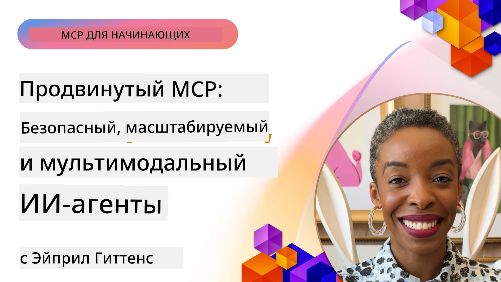

# Расширенные темы в MCP

_(Нажмите на изображение выше, чтобы посмотреть видео этого урока)_

В этой главе рассматривается ряд расширенных тем по реализации протокола Model Context Protocol (MCP), включая многомодальную интеграцию, масштабируемость, лучшие практики безопасности и интеграцию в корпоративной среде. Эти темы имеют решающее значение для создания надежных и готовых к производству приложений MCP, способных удовлетворять требования современных систем ИИ.

## Обзор

Этот урок исследует продвинутые концепции реализации протокола Model Context Protocol, с акцентом на многомодальную интеграцию, масштабируемость, лучшие практики безопасности и интеграцию в корпоративных системах. Эти темы необходимы для создания производственных приложений MCP, способных обрабатывать сложные требования корпоративной среды.

> **Взгляд в будущее:** несколько приведенных ниже тем затрагиваются кандидатом в релизы спецификации MCP от `2026-07-28` — корневые контексты (5.4) и семплирование (5.6) базируются на примитивах, помеченных в кандидате как устаревшие, а экспериментальная функция задач, упомянутая в Возможностях протокола (5.16), переходит в отдельное расширение Tasks. Подробнее см. [Что меняется в MCP: кандидат в релиз 2026-07-28](../01-CoreConcepts/mcp-2026-07-28-release-candidate.md).

## Цели обучения

К концу этого урока вы сможете:

- Реализовать многомодальные возможности в рамках MCP
- Проектировать масштабируемые архитектуры MCP для сценариев с высокой нагрузкой
- Применять лучшие практики безопасности в соответствии с принципами безопасности MCP
- Интегрировать MCP с корпоративными системами и фреймворками ИИ
- Оптимизировать производительность и надежность в продукционных средах

## Уроки и примеры проектов

| Ссылка | Название | Описание |
|------|-------|-------------|
| [5.1 Integration with Azure](./mcp-integration/README.md) | Интеграция с Azure | Узнайте, как интегрировать ваш MCP сервер на Azure |
| [5.2 Multi modal sample](./mcp-multi-modality/README.md) | Примеры многомодальной работы MCP | Примеры для аудио, изображений и многомодальных ответов |
| [5.3 MCP OAuth2 sample](../../../05-AdvancedTopics/mcp-oauth2-demo) | Демонстрация OAuth2 MCP | Минимальное приложение Spring Boot, показывающее OAuth2 с MCP, как авторизационный и ресурсный сервер. Демонстрирует безопасный выпуск токенов, защищённые конечные точки, развертывание в Azure Container Apps и интеграцию с API Management. |
| [5.4 Root Contexts](./mcp-root-contexts/README.md) | Корневые контексты | Узнайте больше о корневом контексте и о том, как их реализовать |
| [5.5 Routing](./mcp-routing/README.md) | Маршрутизация | Изучите различные типы маршрутизации |
| [5.6 Sampling](./mcp-sampling/README.md) | Семплирование | Научитесь работать с семплированием |
| [5.7 Scaling](./mcp-scaling/README.md) | Масштабирование | Узнайте о масштабировании |
| [5.8 Security](./mcp-security/README.md) | Безопасность | Обеспечьте безопасность вашего MCP сервера |
| [5.9 Web Search sample](./web-search-mcp/README.md) | Веб-поиск MCP | Python MCP сервер и клиент, интегрирующийся с SerpAPI для поиска в режиме реального времени по вебу, новостям, товарам и вопросам-ответам. Демонстрирует оркестрацию многосервисных инструментов, интеграцию с внешними API и надежную обработку ошибок. |
| [5.10 Realtime Streaming](./mcp-realtimestreaming/README.md) | Потоковая передача данных | Потоковая передача данных в реальном времени становится незаменимой в современном мире, где бизнесы и приложения требуют мгновенного доступа к информации для своевременного принятия решений. |
| [5.11 Realtime Web Search](./mcp-realtimesearch/README.md) | Веб-поиск в реальном времени | Как MCP преобразует поиск в реальном времени, обеспечивая стандартизированный подход к управлению контекстом между ИИ-моделями, поисковыми системами и приложениями. | 
| [5.12  Entra ID Authentication for Model Context Protocol Servers](./mcp-security-entra/README.md) | Аутентификация Entra ID | Microsoft Entra ID предоставляет надежное облачное решение для управления удостоверениями и доступом, помогая гарантировать, что только авторизованные пользователи и приложения могут взаимодействовать с вашим MCP сервером. |
| [5.13 Microsoft Foundry Agent Integration](./mcp-foundry-agent-integration/README.md) | Интеграция Microsoft Foundry | Узнайте, как интегрировать MCP серверы с агентами Microsoft Foundry, обеспечивая мощную оркестрацию инструментов и возможности корпоративного ИИ с помощью стандартизированных подключений к внешним источникам данных. |
| [5.14 Context Engineering](./mcp-contextengineering/README.md) | Инженерия контекста | Перспективы применения техник инженерии контекста для MCP серверов, включая оптимизацию контекста, динамическое управление контекстом и стратегии эффективного создания подсказок в рамках MCP. |
| [5.15 MCP Custom Transport](./mcp-transport/README.md) | Пользовательский транспорт | Узнайте, как реализовать пользовательские механизмы транспорта для специализированных сценариев коммуникации MCP. |
| [5.16 Protocol Features Deep Dive](./mcp-protocol-features/README.md) | Возможности протокола | Освойте продвинутые возможности протокола, включая уведомления о прогрессе, отмену запросов, шаблоны ресурсов и схемы обработки ошибок. |
| [5.17 Adversarial Multi-Agent Reasoning](./mcp-adversarial-agents/README.md) | Соперничающие агенты | Используйте двух агентов с противоположными позициями, совместно использующих один набор инструментов MCP, чтобы выявлять галлюцинации, освещать крайние случаи и создавать более адекватные ответы через структурированные дебаты. |

> **Новое в спецификации MCP 2025-11-25**: спецификация теперь включает экспериментальную поддержку **Задач** (долгосрочных операций с отслеживанием прогресса), **Аннотаций инструментов** (метаданных о поведении инструментов для безопасности), **Вызывания URL-режима** (запрос специфичного содержимого URL у клиентов) и улучшенные **Корни** (для управления контекстом рабочего пространства). См. [changelog спецификации MCP](https://spec.modelcontextprotocol.io/) для полного описания.

## Дополнительные ссылки

Для получения самой актуальной информации по расширенным темам MCP обращайтесь к:
- [Документация MCP](https://modelcontextprotocol.io/)
- [Спецификация MCP (2025-11-25)](https://spec.modelcontextprotocol.io/specification/2025-11-25/)
- [Репозиторий GitHub](https://github.com/modelcontextprotocol)
- [OWASP MCP Топ 10](https://microsoft.github.io/mcp-azure-security-guide/mcp/) - риски безопасности и способы их минимизации
- [MCP Security Summit Workshop (Sherpa)](https://azure-samples.github.io/sherpa/) - практическое обучение безопасности

## Главные выводы

- Многомодальные реализации MCP расширяют возможности ИИ за пределы обработки текста
- Масштабируемость необходима для корпоративных внедрений и достигается горизонтальным и вертикальным масштабированием
- Комплексные меры безопасности защищают данные и обеспечивают правильный контроль доступа
- Корпоративная интеграция с платформами вроде Azure OpenAI и Microsoft AI Foundry расширяет возможности MCP
- Продвинутые реализации MCP выигрывают от оптимизированной архитектуры и тщательного управления ресурсами

## Упражнение

Спроектируйте корпоративную реализацию MCP для конкретного сценария использования:

1. Определите многомодальные требования для вашего сценария
2. Опишите меры безопасности для защиты конфиденциальных данных
3. Разработайте масштабируемую архитектуру, способную обрабатывать переменную нагрузку
4. Спланируйте точки интеграции с корпоративными системами ИИ
5. Документируйте потенциальные узкие места производительности и стратегии их устранения

## Дополнительные ресурсы

- [Документация Azure OpenAI](https://learn.microsoft.com/en-us/azure/ai-services/openai/)
- [Документация Microsoft AI Foundry](https://learn.microsoft.com/en-us/ai-services/)

---

## Что дальше

Изучите уроки этого модуля, начиная с: [5.1 MCP Integration](./mcp-integration/README.md)

После завершения модуля продолжайте с: [Модуль 6: Вклад сообщества](../06-CommunityContributions/README.md)

---

<!-- CO-OP TRANSLATOR DISCLAIMER START -->
**Отказ от ответственности**:
Этот документ был переведен с использованием сервиса машинного перевода [Co-op Translator](https://github.com/Azure/co-op-translator). Несмотря на наши усилия по обеспечению точности, имейте в виду, что автоматический перевод может содержать ошибки или неточности. Оригинальный документ на его исходном языке следует считать авторитетным источником. Для получения критически важной информации рекомендуется обратиться к профессиональному человеческому переводу. Мы не несем ответственности за любые недоразумения или неправильные толкования, возникшие в результате использования этого перевода.
<!-- CO-OP TRANSLATOR DISCLAIMER END -->