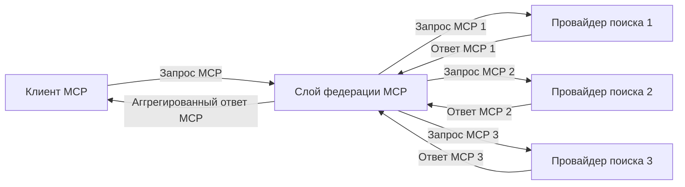
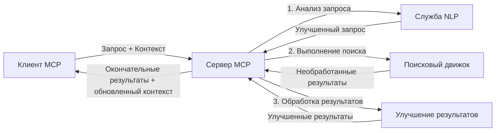

# Протокол Контекста Модели для Поиска в Интернете в Реальном Времени

## Обзор

Поиск в интернете в реальном времени стал необходимым в современном информационно-ориентированном мире, где приложениям требуется мгновенный доступ к актуальной информации из сети для предоставления релевантных и своевременных ответов. Протокол Контекста Модели (MCP) представляет собой значительный прорыв в оптимизации этих процессов поиска в реальном времени, повышая эффективность поиска, сохраняя целостность контекста и улучшая общую производительность систем.

В этом модуле рассматривается, как MCP трансформирует поиск в интернете в реальном времени, обеспечивая стандартизированный подход к управлению контекстом между ИИ-моделями, поисковыми движками и приложениями.

### Чему вы научитесь

В этом подробном руководстве вы узнаете:

- Как MCP создает бесшовный мост между ИИ-моделями и возможностями поиска в реальном времени
- Архитектурные паттерны для реализации эффективных и масштабируемых поисковых решений с MCP
- Техники сохранения контекста поиска при множественных запросах и взаимодействиях
- Практические реализации на Python и JavaScript для различных сценариев поиска
- Методы балансировки релевантности, актуальности и производительности в системах поиска на базе MCP

## Введение в Поиск в Интернете в Реальном Времени

Поиск в интернете в реальном времени — это технологический подход, который позволяет непрерывно осуществлять запросы, обработку и анализ веб-информации в момент её публикации или обновления, что даёт системам возможность предоставлять свежую и релевантную информацию с минимальной задержкой. В отличие от традиционных поисковых систем, которые работают с индексированными данными, иногда устаревшими на часы или дни, поиск в реальном времени обрабатывает живые данные из интернета, предоставляя инсайты и информацию, отражающие текущее состояние онлайн-контента.

### Основные концепции поиска в интернете в реальном времени:

- **Непрерывная обработка запросов**: Поисковые запросы обрабатываются на данных, которые постоянно обновляются
- **Приоритет актуальности**: Системы сконструированы для приоритизации свежей информации
- **Баланс релевантности**: Поддержание баланса между актуальностью и релевантностью
- **Масштабируемая архитектура**: Системы должны справляться с переменной нагрузкой запросов и объемами данных
- **Понимание контекста**: Сохранение пользовательского контекста между итерациями поиска является ключом к значимым результатам
- **Динамическая переработка запросов**: Адаптивное изменение запросов на основе контекста и предыдущих результатов
- **Интеграция из нескольких источников**: Объединение результатов от различных поисковых провайдеров и веб-источников
- **Семантическое понимание**: Обработка запросов и контента на основе смысла, а не только ключевых слов
- **Ранжирование в реальном времени**: Непрерывная корректировка рейтинга результатов с поступлением новой информации

### Протокол Контекста Модели и Поиск в Реальном Времени

Протокол Контекста Модели (MCP) решает несколько ключевых задач в условиях реального времени поиска в интернете:

1. **Сохранение контекста поиска**: MCP стандартизирует способ удержания контекста между распределенными компонентами поиска, гарантируя, что ИИ-модели и узлы обработки имеют доступ к релевантной истории запросов и предпочтениям пользователя.

2. **Эффективное управление запросами**: Обеспечивая структурированные механизмы передачи контекста, MCP снижает нагрузку, связанную с повторным указанием контекста при каждом поисковом цикле.

3. **Взаимодействие**: MCP создает общий язык для обмена контекстом между разнообразными технологиями поиска и ИИ-моделями, что позволяет создавать более гибкие и расширяемые архитектуры.

4. **Оптимизированный для поиска контекст**: Внедрения MCP могут выделять наиболее релевантные элементы контекста для эффективного поиска, оптимизируя производительность и точность.

5. **Адаптивная обработка поиска**: При правильном управлении контекстом через MCP, системы поиска могут динамически настраивать обработку, исходя из изменяющихся потребностей пользователя и информационного ландшафта.

В современных приложениях, от агрегаторов новостей до ассистентов для исследований, интеграция MCP с технологиями веб-поиска позволяет создавать более интеллектуальный, контекстно-осведомленный поиск, обеспечивающий все более релевантные результаты при продолжении взаимодействия пользователя.

## Цели обучения

К концу этого урока вы сможете:

- Понять основы поиска в интернете в реальном времени и его вызовы в современных приложениях
- Объяснить, как Протокол Контекста Модели (MCP) расширяет возможности поиска в реальном времени
- Реализовывать решения для поиска на базе MCP с использованием популярных фреймворков и API
- Проектировать и внедрять масштабируемые и высокопроизводительные поисковые архитектуры с MCP
- Применять концепции MCP в различных сценариях, включая семантический поиск, помощь в исследованиях и AI-ассистированный просмотр
- Оценивать новые тенденции и будущие инновации в технологиях поиска на базе MCP
- Разрабатывать контекстно-осведомленные системы поиска, которые обучаются на взаимодействиях с пользователями
- Интегрировать возможности веб-поиска в AI-ассистентов с использованием стандартизированных протоколов MCP
- Создавать многократные поисковые конвейеры, которые постепенно уточняют результаты на основе контекста
- Оптимизировать производительность поиска, сохраняя при этом полное осознание контекста

### Определение и значение

Поиск в интернете в реальном времени предполагает непрерывное выполнение запросов, получение и предоставление веб-информации с минимальной задержкой. В отличие от традиционных поисковых движков, которые периодически сканируют и индексируют интернет, поиск в реальном времени направлен на мгновенное отображение информации по мере её появления, обеспечивая незамедлительный доступ к самым свежим материалам.

Ключевые характеристики поиска в интернете в реальном времени включают:

- **Свежесть**: Приоритет недавнему контенту и обновлениям
- **Непрерывная обработка**: Постоянный мониторинг появления новой информации
- **Адаптация запросов**: Уточнение поисковых запросов на основе контекста и обратной связи
- **Немедленная доставка**: Предоставление результатов поиска с минимальной задержкой
- **Сохранение контекста**: Использование предыдущих запросов для улучшения релевантности

### Проблемы традиционного веб-поиска

Традиционные подходы к веб-поиску сталкиваются с несколькими ограничениями при применении в сценариях реального времени:

1. **Фрагментация контекста**: Трудности сохранения контекста поиска между несколькими запросами
2. **Свежесть информации**: Проблемы с доступом и приоритетом самой новой информации
3. **Сложность интеграции**: Трудности во взаимодействии между поисковыми системами и приложениями
4. **Проблемы задержек**: Баланс между полнотой поиска и требованиями по времени отклика
5. **Настройка релевантности**: Обеспечение точности и релевантности при приоритете актуальности

## Понимание Протокола Контекста Модели (MCP) для Поиска

### Что такое MCP в контексте поиска?

Протокол Контекста Модели (MCP) — это стандартизированный протокол связи, разработанный для облегчения эффективного взаимодействия между ИИ-моделями и приложениями. В контексте поиска в интернете в реальном времени MCP предоставляет рамки для:

- Сохранения контекста поиска на протяжении последовательности запросов
- Стандартизации форматов запросов и результатов поиска
- Оптимизации передачи параметров поиска и результатов
- Улучшения коммуникации между моделями и поисковыми системами

### Основные компоненты и архитектура

Архитектура MCP для поиска в интернете в реальном времени состоит из нескольких ключевых компонентов:

1. **Обработчики контекста запросов**: Управляют и поддерживают контекст поиска между множественными запросами
2. **Процессоры поиска**: Обрабатывают входящие поисковые запросы с использованием техник, учитывающих контекст
3. **Адаптеры протоколов**: Конвертируют между различными API поиска, сохраняя контекст
4. **Хранилище контекста**: Эффективно сохраняет и извлекает историю поиска и предпочтения
5. **Коннекторы поиска**: Подключаются к различным поисковым движкам и веб-API

```mermaid
graph TD
    subgraph "Источники данных"
        Web[Веб-контент]
        APIs[Внешние API]
        DB[Базы знаний]
        News[Новостные ленты]
    end

    subgraph "Слой поиска MCP"
        SC[Поисковые коннекторы]
        PA[Адаптеры протоколов]
        CH[Обработчики контекста]
        SP[Поисковые процессоры]
        CS[Хранилище контекста]
    end

    subgraph "Обработка и анализ"
        RE[Движок релевантности]
        ML[Модели машинного обучения]
        NLP[Обработка естественного языка (NLP)]
        Rank[Система ранжирования]
    end

    subgraph "Приложения и сервисы"
        RA[Исследовательский помощник]
        Alerts[Системы оповещений]
        KB[База знаний]
        API[API-сервисы]
    end

    Web -->|Контент| SC
    APIs -->|Данные| SC
    DB -->|Знания| SC
    News -->|Обновления| SC
    
    SC -->|Необработанные результаты| PA
    PA -->|Нормализованные результаты| CH
    CH <-->|Операции с контекстом| CS
    CH -->|Результаты с добавленным контекстом| SP
    SP -->|Обработанные результаты| RE
    SP -->|Фичи| ML
    SP -->|Текст| NLP
    
    RE -->|Ранжированные результаты| Rank
    ML -->|Прогнозы| Rank
    NLP -->|Сущности и отношения| Rank
    
    Rank -->|Финальные результаты| RA
    ML -->|Инсайты| Alerts
    NLP -->|Структурированные данные| KB
    
    RA -->|Исследования| Users((Users))
    Alerts -->|Уведомления| Users
    KB <-->|Доступ к знаниям| API

    classDef sources fill:#f9f,stroke:#333,stroke-width:2px,color:#4a004a
    classDef mcp fill:#bbf,stroke:#333,stroke-width:2px,color:#00004a
    classDef processing fill:#bfb,stroke:#333,stroke-width:2px,color:#003300
    classDef apps fill:#fbb,stroke:#333,stroke-width:2px,color:#4a0000
    
    class Web,APIs,DB,News sources
    class SC,PA,CH,SP,CS mcp
    class RE,ML,NLP,Rank processing
    class RA,Alerts,KB,API apps
```

### Как MCP улучшает поиск в интернете в реальном времени

MCP решает задачи традиционного веб-поиска через:

- **Продолжительность контекста**: Сохранение взаимосвязей между запросами на протяжении всей поисковой сессии
- **Оптимизированная передача**: Сокращение избыточности параметров поиска через интеллектуальное управление контекстом
- **Стандартизированные интерфейсы**: Предоставление единообразных API для поисковых компонентов
- **Снижение задержек**: Минимизация накладных расходов за счет эффективной обработки контекста
- **Повышение релевантности**: Улучшение соответствия результатов за счёт сохранения пользовательских намерений на протяжении нескольких запросов

## Интеграция и реализация

Системы поиска в реальном времени требуют тщательного проектирования архитектуры и реализации для сохранения и производительности, и контекстной целостности. Протокол Контекста Модели предлагает стандартизированный подход к интеграции ИИ-моделей и поисковых технологий, позволяющий создавать более сложные, осведомленные о контексте поисковые конвейеры.

### Обзор интеграции MCP в поисковые архитектуры

Реализация MCP в условиях реального времени включает несколько ключевых аспектов:

1. **Сериализация контекста поиска**: MCP предоставляет эффективные механизмы кодирования контекстной информации в поисковых запросах, обеспечивая передачу важного контекста вместе с запросом по всей цепочке обработки. Это включает стандартизированные форматы сериализации, оптимизированные для метаданных, связанных с поиском.

2. **Состояние обработки поиска**: MCP обеспечивает более интеллектуальную обработку с сохранением состояния за счёт поддержания последовательного представления контекста на протяжении поисковых итераций. Это особенно ценно в многоступенчатых поисковых конвейерах, где улучшение контекста повышает качество результатов.

3. **Расширение и уточнение запросов**: Внедрения MCP в поисковых системах могут предусматривать сложные механизмы расширения и уточнения запросов на базе накопленного контекста, позволяя получать всё более релевантные результаты по мере продвижения сессии поиска.

4. **Кэширование и приоритизация результатов**: Стандартизируя обработку контекста, MCP помогает управлять кешированием и приоритетами результатов, позволяя компонентам адаптироваться в соответствии с изменяющимся контекстом поиска.

5. **Федерация и агрегация поиска**: MCP способствует более сложной федерации поиска по множеству бекендов за счёт предоставления структурированных представлений контекста, что позволяет более существенно агрегировать результаты из разных источников.

Реализация MCP в различных поисковых технологиях создает единый подход к управлению контекстом, снижая необходимость в кастомном интеграционном коде и улучшая способность системы поддерживать значимый контекст по мере эволюции поисковых запросов.

### MCP в различных реализациях веб-поиска

Эти примеры следуют текущей спецификации MCP, которая ориентируется на протокол JSON-RPC с различными транспортными механизмами. Код демонстрирует, как можно реализовать кастомные интеграции поиска, сохраняя полную совместимость с протоколом MCP.


<details>
<summary>Реализация на Python с Универсальным API Поиска</summary>

```python
import asyncio
import json
import aiohttp
from typing import Dict, Any, Optional, List
from contextlib import asynccontextmanager
from collections.abc import AsyncIterator

# Импорт стандартных библиотек MCP
from mcp.client.session import ClientSession
from mcp.client.streamable_http import streamablehttp_client
from mcp.types import TextContent, CreateMessageRequestParams, CreateMessageResult
from mcp.server.fastmcp import FastMCP

# Создать FastMCP сервер для веб-поиска
search_server = FastMCP("WebSearch")

# Класс для обработки операций веб-поиска
class WebSearchHandler:
    def __init__(self, api_endpoint: str, api_key: str):
        self.api_endpoint = api_endpoint
        self.api_key = api_key
        self.session = None
        
    async def initialize(self):
        """Initialize the HTTP session"""
        self.session = aiohttp.ClientSession(
            headers={"Authorization": f"Bearer {self.api_key}"}
        )
    
    async def close(self):
        """Close the HTTP session"""
        if self.session:
            await self.session.close()
            
    async def perform_search(self, query: str, max_results: int = 5, 
                           include_domains: List[str] = None, 
                           exclude_domains: List[str] = None,
                           time_period: str = "any") -> Dict[str, Any]:
        """Perform web search using the search API"""
        # Конструировать параметры поиска
        search_params = {
            "q": query,
            "limit": max_results,
            "time": time_period
        }
        
        if include_domains:
            search_params["site"] = ",".join(include_domains)
            
        if exclude_domains:
            search_params["exclude_site"] = ",".join(exclude_domains)
        
        # Выполнить запрос поиска
        try:
            async with self.session.get(
                self.api_endpoint,
                params=search_params
            ) as response:
                if response.status != 200:
                    error_text = await response.text()
                    raise Exception(f"Search API error: {response.status} - {error_text}")
                
                search_data = await response.json()
                
                # Преобразовать ответ API в стандартный формат
                results = []
                for item in search_data.get("results", []):
                    results.append({
                        "title": item.get("title", ""),
                        "url": item.get("url", ""),
                        "snippet": item.get("snippet", ""),
                        "date": item.get("published_date", ""),
                        "source": item.get("source", "")
                    })
                
                return {
                    "query": query,
                    "totalResults": len(results),
                    "results": results
                }
        except Exception as e:
            print(f"Search API request error: {e}")
            raise

# Инициализировать обработчик поиска
search_handler = WebSearchHandler(
    api_endpoint="https://api.search-service.example/search",
    api_key="your-api-key-here"
)

# Настроить жизненный цикл для управления обработчиком поиска
@asyncio.asynccontextmanager
async def app_lifespan(server: FastMCP):
    """Manage application lifecycle"""
    await search_handler.initialize()
    try:
        yield {"search_handler": search_handler}
    finally:
        await search_handler.close()

# Установить жизненный цикл для сервера
search_server = FastMCP("WebSearch", lifespan=app_lifespan)

# Зарегистрировать инструмент веб-поиска
@search_server.tool()
async def web_search(query: str, max_results: int = 5, 
                   include_domains: List[str] = None,
                   exclude_domains: List[str] = None,
                   time_period: str = "any") -> Dict[str, Any]:
    """
    Search the web for information
    
    Args:
        query: The search query
        max_results: Maximum number of results to return (default: 5)
        include_domains: List of domains to include in search results
        exclude_domains: List of domains to exclude from search results
        time_period: Time period for results ("day", "week", "month", "any")
        
    Returns:
        Dictionary containing search results
    """
    ctx = search_server.get_context()
    search_handler = ctx.request_context.lifespan_context["search_handler"]
    
    results = await search_handler.perform_search(
        query=query,
        max_results=max_results,
        include_domains=include_domains,
        exclude_domains=exclude_domains,
        time_period=time_period
    )
    
    return results

# Пример использования клиентом
async def client_example():
    # Подключиться к серверу поиска с использованием Streamable HTTP транспорта
    async with streamablehttp_client("http://localhost:8000/mcp") as (read, write, _):
        async with ClientSession(read, write) as session:
            # Инициализировать соединение
            await session.initialize()
            
            # Вызвать инструмент web_search
            search_results = await session.call_tool(
                "web_search", 
                {
                    "query": "latest developments in AI and Model Context Protocol",
                    "max_results": 5,
                    "time_period": "day",
                    "include_domains": ["github.com", "microsoft.com"]
                }
            )
            
            print(f"Search results: {search_results}")

# Пример выполнения сервера
if __name__ == "__main__":
    # Запустить сервер с использованием Streamable HTTP транспорта
    search_server.run(transport="streamable-http")
```
</details> 

<details>
<summary>Реализация на JavaScript для Поиска в Браузере</summary>


```javascript
// Реализация MCP сервера для веб-поиска
import { McpServer, ResourceTemplate } from '@modelcontextprotocol/sdk/server/mcp.js';
import { StreamableHTTPServerTransport } from '@modelcontextprotocol/sdk/server/streamableHttp.js';
import { z } from 'zod';

// Создать MCP сервер для веб-поиска
const searchServer = new McpServer({
    name: "BrowserSearch",
    description: "A server that provides web search capabilities"
});

// Класс сервиса поиска
class SearchService {
    constructor(searchApiUrl, apiKey) {
        this.searchApiUrl = searchApiUrl;
        this.apiKey = apiKey;
    }

    async performSearch(parameters) {
        const {
            query = '',
            maxResults = 5,
            includeDomains = [],
            excludeDomains = [],
            timePeriod = 'any'
        } = parameters;
        
        // Сформировать URL поиска с параметрами
        const url = new URL(this.searchApiUrl);
        url.searchParams.append('q', query);
        url.searchParams.append('limit', maxResults);
        url.searchParams.append('time', timePeriod);
        
        if (includeDomains.length > 0) {
            url.searchParams.append('site', includeDomains.join(','));
        }
        
        if (excludeDomains.length > 0) {
            url.searchParams.append('exclude_site', excludeDomains.join(','));
        }
        
        try {
            const response = await fetch(url.toString(), {
                method: 'GET',
                headers: {
                    'Authorization': `Bearer ${this.apiKey}`,
                    'Content-Type': 'application/json'
                }
            });
            
            if (!response.ok) {
                const errorText = await response.text();
                throw new Error(`Search API error: ${response.status} - ${errorText}`);
            }
            
            const searchData = await response.json();
            
            // Преобразовать специфичный для API ответ в стандартный формат
            const results = searchData.results?.map(item => ({
                title: item.title || '',
                url: item.url || '',
                snippet: item.snippet || '',
                date: item.published_date || '',
                source: item.source || ''
            })) || [];
            
            return {
                query,
                totalResults: results.length,
                results
            };
        } catch (error) {
            console.error('Search API request error:', error);
            throw error;
        }
    }
}

// Инициализировать сервис поиска
const searchService = new SearchService(
    'https://api.search-service.example/search',
    'your-api-key-here'
);

// Настроить провайдера контекста для сервера
searchServer.setContextProvider(() => {
    return {
        searchService
    };
});

// Зарегистрировать инструмент веб-поиска
searchServer.tool({
    name: 'web_search',
    description: 'Search the web for information',
    parameters: {
        type: 'object',
        properties: {
            query: {
                type: 'string',
                description: 'The search query'
            },
            maxResults: {
                type: 'integer',
                description: 'Maximum number of results to return',
                default: 5
            },
            includeDomains: {
                type: 'array',
                items: { type: 'string' },
                description: 'List of domains to include in search results'
            },
            excludeDomains: {
                type: 'array',
                items: { type: 'string' },
                description: 'List of domains to exclude from search results'
            },
            timePeriod: {
                type: 'string',
                description: 'Time period for results',
                enum: ['day', 'week', 'month', 'any'],
                default: 'any'
            }
        },
        required: ['query']
    },
    handler: async (params, context) => {
        const { searchService } = context;
        return await searchService.performSearch(params);
    }
});

// Пример клиентского кода для подключения к серверу поиска
import { Client } from '@modelcontextprotocol/sdk/client/index.js';
import { StreamableHTTPClientTransport } from '@modelcontextprotocol/sdk/client/streamableHttp.js';

async function connectToSearchServer() {
    // Подключиться к серверу поиска
    const transport = new StreamableHTTPClientTransport(
        new URL('http://localhost:8000/mcp')
    );
    
    const client = new Client({
        name: 'search-client',
        version: '1.0.0'
    });
    
    await client.connect(transport);
    
    // Выполнить инструмент поиска
    const searchResults = await client.callTool({
        name: 'web_search',
        arguments: {
            query: 'Model Context Protocol implementation examples',
            maxResults: 10,
            timePeriod: 'week',
            includeDomains: ['github.com', 'docs.microsoft.com']
        }
    });
    
    console.log('Search results:', searchResults);
    
    // Очистка
    await client.disconnect();
}

// Запуск сервера
const transport = new StreamableHTTPServerTransport();
await searchServer.connect(transport);
console.log('Search server running at http://localhost:8000/mcp');

// В отдельном процессе или после запуска сервера
// connectToSearchServer().catch(console.error);
```
</details> 


## Отказ от ответственности по примерам кода

> **Важное замечание**: Представленные ниже примеры кода демонстрируют интеграцию Протокола Контекста Модели (MCP) с функциями веб-поиска. Хотя они следуют паттернам и структурам официальных SDK MCP, они были упрощены для образовательных целей.
> 
> В этих примерах показано:
> 
> 1. **Реализация на Python**: Сервер FastMCP, предоставляющий инструмент веб-поиска и подключающийся к внешнему API поиска. Этот пример показывает правильное управление жизненным циклом, обработку контекста и реализацию инструмента, следуя шаблонам [официального MCP Python SDK](https://github.com/modelcontextprotocol/python-sdk). Сервер использует рекомендуемый Streamable HTTP транспорт, который заменил устаревший SSE транспорт для производственных развёртываний.
> 
> 2. **Реализация на JavaScript**: Типизированная/JavaScript реализация с использованием паттерна FastMCP из [официального MCP TypeScript SDK](https://github.com/modelcontextprotocol/typescript-sdk) для создания поискового сервера с правильным определением инструментов и подключениями клиентов. Следует последним рекомендуемым паттернам управления сессиями и сохранения контекста.
> 
> Для производственного использования необходимы дополнительные меры обработки ошибок, аутентификации и интеграции с конкретными API. Показанные конечные точки API поиска (`https://api.search-service.example/search`) являются заполнителями и должны быть заменены реальными адресами сервисов поиска.
> 
> Для полного описания реализций и самых актуальных подходов, пожалуйста, обращайтесь к [официальной спецификации MCP](https://spec.modelcontextprotocol.io/) и документации SDK.

## Основные концепции

### Фреймворк Протокола Контекста Модели (MCP)

В своей основе Протокол Контекста Модели предоставляет стандартизированный способ обмена контекстом между ИИ-моделями, приложениями и сервисами. В поиске в реальном времени этот фреймворк необходим для создания связного, многошагового поискового опыта. Ключевые компоненты включают:

1. **Архитектура клиент-сервер**: MCP устанавливает четкое разделение между поисковыми клиентами (инициаторами запросов) и поисковыми серверами (поставщиками), что позволяет гибко размещать компоненты.

2. **Обмен сообщениями JSON-RPC**: Протокол использует JSON-RPC для общения, что делает его совместимым с веб-технологиями и простым для реализации на разных платформах.

3. **Управление контекстом**: MCP определяет структурированные методы поддержки, обновления и использования контекста поиска между множественными взаимодействиями.

4. **Определения инструментов**: Возможности поиска представлены в виде стандартизированных инструментов с четко заданными параметрами и возвращаемыми значениями.

5. **Поддержка потоковой передачи**: Протокол поддерживает потоковую передачу результатов, что важно для поиска в реальном времени, когда результаты могут поступать постепенно.

### Паттерны интеграции веб-поиска

При интеграции MCP с веб-поиском выделяются несколько паттернов:

#### 1. Прямая интеграция с провайдером поиска


В этом паттерне сервер MCP напрямую взаимодействует с одним или несколькими поисковыми API, переводя запросы MCP в специфичные вызовы API и форматируя результаты как ответы MCP.

#### 2. Федеративный поиск с сохранением контекста



Этот паттерн распределяет поисковые запросы по нескольким совместимым с MCP провайдерам поиска, каждый из которых может специализироваться на разных типах контента или функциональных возможностях поиска, при этом поддерживая единый контекст.

#### 3. Поисковая цепочка с улучшением контекста



В этом паттерне процесс поиска разбит на несколько этапов, при этом контекст обогащается на каждом шаге, что приводит к постепенно более релевантным результатам.

### Компоненты контекста поиска

В поиске на базе MCP контекст обычно включает:

- **Историю запросов**: Предыдущие поисковые запросы в сессии
- **Предпочтения пользователя**: Язык, регион, настройки безопасного поиска
- **Историю взаимодействий**: На какие результаты нажимали, сколько времени тратилось на просмотр результатов
- **Параметры поиска**: Фильтры, порядок сортировки и другие модификаторы поиска
- **Доменные знания**: Контекст, связанный с конкретной тематикой, релевантный для поиска
- **Временной контекст**: Факторы релевантности, связанные с временем
- **Предпочтения источников**: Надежные или предпочтительные информационные источники

## Сценарии использования и приложения

### Исследования и сбор информации

MCP улучшает рабочие процессы исследований за счет:

- Сохранения исследовательского контекста между сессиями поиска
- Возможности более сложных и контекстуально релевантных запросов
- Поддержки федерации поиска из нескольких источников
- Содействия извлечению знаний из результатов поиска

### Мониторинг новостей и трендов в реальном времени

MCP-оснащённый поиск предлагает преимущества для мониторинга новостей:

- Обнаружение новостных сюжетов почти в реальном времени
- Контекстная фильтрация релевантной информации
- Отслеживание тем и сущностей в разных источниках
- Персонализированные новостные уведомления на основе пользовательского контекста

### AI-усиленный просмотр и исследования

MCP открывает новые возможности для AI-усиленного просмотра:

- Контекстные предложения поиска на основе текущей активности браузера
- Бесшовная интеграция веб-поиска с помощниками на базе крупных языковых моделей
- Многошаговое уточнение поиска с сохранением контекста
- Расширенная проверка фактов и верификация информации

## Будущие тренды и инновации

### Эволюция MCP в веб-поиске

Взгляд в будущее – мы ожидаем, что MCP будет развиваться, чтобы решать:


- **Мультимодальный поиск**: интеграция поиска по тексту, изображению, аудио и видео с сохранением контекста
- **Децентрализованный поиск**: поддержка распределенных и федеративных поисковых экосистем
- **Конфиденциальность поиска**: контекстно-чувствительные механизмы поиска с сохранением приватности
- **Понимание запросов**: глубокий семантический разбор поисковых запросов на естественном языке

### Потенциальные технологические достижения

Развивающиеся технологии, которые сформируют будущее поиска MCP:

1. **Нейронные архитектуры поиска**: поисковые системы на основе встраиваний, оптимизированные для MCP
2. **Персонализированный контекст поиска**: изучение индивидуальных поисковых паттернов пользователя со временем
3. **Интеграция графов знаний**: контекстный поиск с использованием предметно-ориентированных графов знаний
4. **Мульти-модальный контекст**: поддержание контекста между различными модальностями поиска

## Практические упражнения

### Упражнение 1: Настройка базового поискового конвейера MCP

В этом упражнении вы научитесь:
- Настраивать базовую поисковую среду MCP
- Реализовывать обработчики контекста для веб-поиска
- Тестировать и проверять сохранение контекста в разных итерациях поиска

### Упражнение 2: Создание помощника-исследователя с помощью MCP поиска

Создайте полнофункциональное приложение, которое:
- Обрабатывает исследовательские вопросы на естественном языке
- Выполняет контекстно-чувствительный веб-поиск
- Синтезирует информацию из нескольких источников
- Представляет организованные результаты исследования

### Упражнение 3: Реализация федерации поиска с несколькими источниками на основе MCP

Продвинутое упражнение, охватывающее:
- Контекстно-чувствительную отправку запросов на несколько поисковых движков
- Ранжирование и агрегацию результатов
- Контекстуальное устранение дублирующих результатов поиска
- Обработку метаданных, специфичных для источников

## Дополнительные ресурсы

- [Спецификация протокола Model Context](https://spec.modelcontextprotocol.io/) - официальная спецификация MCP и подробная документация протокола
- [Документация Model Context Protocol](https://modelcontextprotocol.io/) - подробные руководства и инструкции по внедрению
- [MCP Python SDK](https://github.com/modelcontextprotocol/python-sdk) - официальная реализация протокола MCP на Python
- [MCP TypeScript SDK](https://github.com/modelcontextprotocol/typescript-sdk) - официальная реализация протокола MCP на TypeScript
- [MCP справочные серверы](https://github.com/modelcontextprotocol/servers) - эталонные реализации серверов MCP
- [Документация Bing Web Search API](https://learn.microsoft.com/en-us/bing/search-apis/bing-web-search/overview) - API веб-поиска от Microsoft
- [Google Custom Search JSON API](https://developers.google.com/custom-search/v1/overview) - программируемый поисковый движок Google
- [Документация SerpAPI](https://serpapi.com/search-api) - API страницы результатов поисковой системы
- [Документация Meilisearch](https://www.meilisearch.com/docs) - поисковая система с открытым исходным кодом
- [Документация Elasticsearch](https://www.elastic.co/guide/index.html) - распределённая поисковая и аналитическая система
- [Документация LangChain](https://python.langchain.com/docs/get_started/introduction) - создание приложений с LLM

## Результаты обучения

По завершении этого модуля вы сможете:

- Понимать основы веб-поиска в реальном времени и связанные с ним проблемы
- Объяснять, как Model Context Protocol (MCP) улучшает возможности веб-поиска в реальном времени
- Реализовывать поисковые решения на базе MCP с использованием популярных фреймворков и API
- Проектировать и развертывать масштабируемые высокопроизводительные архитектуры поиска с MCP
- Применять концепции MCP для различных задач, включая семантический поиск, помощь в исследовании и поиск с поддержкой ИИ
- Оценивать современные тенденции и будущие инновации в технологиях поиска на базе MCP


### Вопросы доверия и безопасности

При реализации поисковых решений на базе MCP помните об этих важных принципах из спецификации MCP:

1. **Согласие и контроль пользователя**: пользователи должны явно дать согласие и понимать все операции и доступ к данным. Это особенно важно для реализации веб-поиска, который может обращаться к внешним источникам данных.

2. **Конфиденциальность данных**: обеспечьте надлежащую обработку поисковых запросов и результатов, особенно если они могут содержать чувствительную информацию. Внедрите соответствующие меры контроля доступа для защиты данных пользователей.

3. **Безопасность инструментов**: реализуйте корректную авторизацию и валидацию поисковых инструментов, так как они могут представлять угрозу через выполнение произвольного кода. Описания поведения инструментов считаются ненадежными, если они получены не с доверенного сервера.

4. **Чёткая документация**: предоставьте ясную документацию о возможностях, ограничениях и соображениях безопасности вашей реализации поиска на основе MCP, согласно руководящим принципам спецификации MCP.

5. **Надежные потоки согласия**: создайте надежные механизмы запроса согласия и авторизации, которые ясно объясняют функции каждого инструмента до его активации, особенно для инструментов, взаимодействующих с внешними веб-ресурсами.

Для полного ознакомления с вопросами безопасности и доверия MCP обратитесь к [официальной документации](https://modelcontextprotocol.io/specification/2025-11-25/basic/security_best_practices).

## Что дальше

- [5.12 Аутентификация Entra ID для серверов Model Context Protocol](../mcp-security-entra/README.md)

---

<!-- CO-OP TRANSLATOR DISCLAIMER START -->
**Отказ от ответственности**:
Этот документ был переведен с использованием сервиса машинного перевода [Co-op Translator](https://github.com/Azure/co-op-translator). Несмотря на наши усилия по обеспечению точности, имейте в виду, что автоматический перевод может содержать ошибки или неточности. Оригинальный документ на его исходном языке следует считать авторитетным источником. Для получения критически важной информации рекомендуется обратиться к профессиональному человеческому переводу. Мы не несем ответственности за любые недоразумения или неправильные толкования, возникшие в результате использования этого перевода.
<!-- CO-OP TRANSLATOR DISCLAIMER END -->