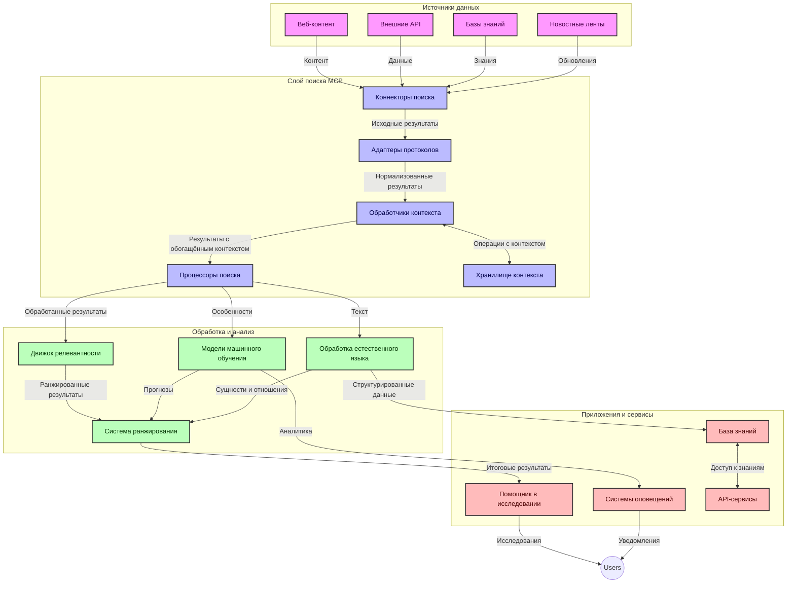
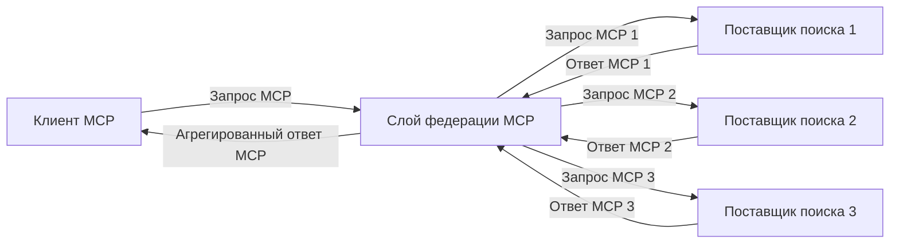
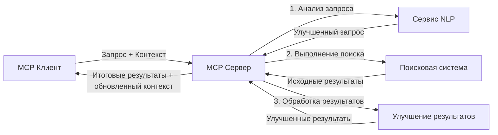

# Протокол контекста модели для поиска в реальном времени в интернете

## Обзор

Поиск в реальном времени в интернете стал незаменимым в современном информационно ориентированном окружении, где приложениям требуется мгновенный доступ к актуальной информации по всему Интернету для предоставления релевантных и своевременных ответов. Протокол контекста модели (MCP) представляет собой значительный прогресс в оптимизации этих процессов поиска в реальном времени, повышая эффективность поиска, сохраняя контекстуальную целостность и улучшая общую производительность системы.

В этом модуле рассматривается, как MCP трансформирует поиск в реальном времени в интернете, обеспечивая стандартизированный подход к управлению контекстом между моделями ИИ, поисковыми системами и приложениями.

### Что вы узнаете

В этом всеобъемлющем руководстве вы узнаете:

- Как MCP создает бесшовный мост между моделями ИИ и возможностями поиска в реальном времени
- Архитектурные шаблоны для реализации эффективных и масштабируемых поисковых решений с MCP
- Техники сохранения поискового контекста через множество запросов и взаимодействий
- Практические реализации кода на Python и JavaScript для разных поисковых сценариев
- Методы балансировки релевантности, актуальности и производительности в поисковых системах на базе MCP

## Введение в поиск в реальном времени в интернете

Поиск в реальном времени в интернете — это технологический подход, позволяющий непрерывно выполнять запросы, обрабатывать и анализировать веб-информацию по мере ее публикации или обновления, что позволяет системам предоставлять свежую и релевантную информацию с минимальной задержкой. В отличие от традиционных поисковых систем, работающих с индексированными данными, которые могут быть устаревшими на часы или дни, поиск в реальном времени обрабатывает живые данные с веба, предоставляя инсайты и информацию, отражающие текущее состояние онлайн-контента.

### Основные концепции поиска в реальном времени:

- **Непрерывная обработка запросов**: Поисковые запросы обрабатываются на постоянно обновляющихся источниках данных
- **Приоритет актуальности**: Системы настроены на приоритет свежей информации
- **Баланс релевантности**: Поддержание баланса между релевантностью и свежестью
- **Масштабируемая архитектура**: Системы должны справляться с переменным объемом запросов и данными
- **Контекстуальное понимание**: Важно сохранять контекст пользователя в серии поисковых запросов для значимых результатов
- **Динамическая переработка запросов**: Адаптивное изменение запросов на основе контекста и предыдущих результатов
- **Интеграция из нескольких источников**: Объединение результатов от разных поисковых провайдеров и веб-источников
- **Семантическое понимание**: Обработка запросов и контента исходя из смысла, а не только ключевых слов
- **Ранжирование в реальном времени**: Непрерывное обновление рейтинга результатов по мере появления новой информации

### Протокол контекста модели и поиск в реальном времени

Протокол контекста модели (MCP) решает несколько ключевых задач в средах поиска в реальном времени:

1. **Сохранение контекста поиска**: MCP стандартизирует способы поддержания контекста между распределенными компонентами поиска, обеспечивая доступ моделей ИИ и узлов обработки к релевантной истории запросов и предпочтениям пользователя.

2. **Эффективное управление запросами**: Обеспечивая структурированные механизмы передачи контекста, MCP снижает накладные расходы на повторение контекста в каждом цикле поиска.

3. **Взаимодействие**: MCP создает общий язык для обмена контекстом между разнообразными технологиями поиска и моделями ИИ, позволяя разрабатывать более гибкие и расширяемые архитектуры.

4. **Оптимизированный для поиска контекст**: Реализации MCP могут расставлять приоритеты по наиболее релевантным элементам контекста для эффективного поиска, оптимизируя как производительность, так и точность.

5. **Адаптивная обработка поиска**: При правильном управлении контекстом через MCP системы поиска могут динамически подстраиваться под изменения запросов пользователя и информационного ландшафта.

В современных приложениях — от агрегаторов новостей до помощников в исследованиях — интеграция MCP с технологиями веб-поиска позволяет создавать более интеллектуальный, контекстно-информированный поиск, предоставляющий всё более релевантные результаты по мере продолжения взаимодействия пользователя.

## Цели обучения

К концу этого урока вы сможете:

- Понять основные принципы поиска в реальном времени и его вызовы в современных приложениях
- Объяснить, как Протокол контекста модели (MCP) улучшает возможности поиска в реальном времени
- Реализовывать поисковые решения на базе MCP с использованием популярных фреймворков и API
- Проектировать и внедрять масштабируемые, высокопроизводительные архитектуры поиска с MCP
- Применять концепции MCP в различных случаях, включая семантический поиск, помощь в исследованиях и дополненный ИИ браузинг
- Оценивать новые тренды и будущие инновации в поисковых технологиях на базе MCP
- Разрабатывать системы поиска, учитывающие контекст, которые обучаются на взаимодействиях с пользователем
- Интегрировать возможности веб-поиска в ИИ-ассистентах, используя стандартизированные протоколы MCP
- Создавать многоступенчатые поисковые конвейеры, которые постепенно уточняют результаты на основе контекста
- Оптимизировать производительность поиска, сохраняя полное осознание контекста

### Определение и значимость

Поиск в реальном времени в интернете включает непрерывный опрос, извлечение и доставку веб-основанной информации с минимальной задержкой. В отличие от традиционных поисковых систем, которые периодически сканируют и индексируют веб, поиск в реальном времени стремится выявлять информацию по мере ее доступности, обеспечивая мгновенный доступ к самой свежей информации.

Ключевые характеристики поиска в реальном времени:

- **Свежесть**: Приоритет последних контента и обновлений
- **Непрерывная обработка**: Постоянный мониторинг новой информации
- **Адаптация запросов**: Уточнение поисковых запросов на основе контекста и обратной связи
- **Мгновенная доставка**: Представление результатов поиска с минимальной задержкой
- **Сохранение контекста**: Построение на основании предыдущих запросов для улучшения релевантности

### Проблемы традиционного веб-поиска

Традиционные методы веб-поиска имеют несколько ограничений при применении к сценариям в реальном времени:

1. **Фрагментация контекста**: Трудности с сохранением поискового контекста между несколькими запросами
2. **Актуальность информации**: Проблемы с доступом и приоритезацией самой свежей информации
3. **Сложность интеграции**: Трудности взаимодействия между поисковыми системами и приложениями
4. **Проблемы задержки**: Баланс между комплексностью поиска и требованиями к времени отклика
5. **Настройка релевантности**: Обеспечение точности и релевантности при приоритезации свежести

## Понимание Протокола контекста модели (MCP) для поиска

### Что такое MCP в контексте поиска?

Протокол контекста модели (MCP) — это стандартизированный протокол связи, созданный для облегчения эффективного взаимодействия между моделями ИИ и приложениями. В контексте поиска в реальном времени MCP предоставляет рамки для:

- Сохранения контекста поиска в последовательностях запросов
- Стандартизации форматов поисковых запросов и результатов
- Оптимизации передачи параметров поиска и результатов
- Улучшения коммуникации между моделями и поисковыми движками

### Основные компоненты и архитектура

Архитектура MCP для поиска в реальном времени включает несколько ключевых компонентов:

1. **Обработчики контекста запросов**: Управляют и поддерживают поисковый контекст между несколькими запросами
2. **Процессоры поиска**: Обрабатывают входящие поисковые запросы с применением контекстно-осведомленных техник
3. **Адаптеры протокола**: Конвертируют между разными поисковыми API, сохраняя контекст
4. **Хранилище контекста**: Эффективно сохраняет и извлекает историю поиска и предпочтения пользователя
5. **Поисковые коннекторы**: Подключаются к различным поисковым движкам и веб-API



### Как MCP улучшает поиск в реальном времени

MCP решает традиционные проблемы веб-поиска через:

- **Контекстуальная непрерывность**: Поддержание взаимосвязей между запросами на протяжении всей поисковой сессии
- **Оптимизированную передачу**: Снижение избыточности параметров поиска через умное управление контекстом
- **Стандартизированные интерфейсы**: Обеспечивает единый API для поисковых компонентов
- **Снижение задержек**: Минимизирует накладные расходы обработки благодаря эффективному управлению контекстом
- **Повышенная релевантность**: Улучшает релевантность поиска, сохраняя намерения пользователя через множество запросов

## Интеграция и реализация

Системы веб-поиска в реальном времени требуют тщательного архитектурного проектирования и реализации, чтобы сохранить и производительность, и целостность контекста. Протокол контекста модели предлагает стандартизованный подход к интеграции моделей ИИ и поисковых технологий, позволяя выстраивать более сложные, контекстно-осведомленные поисковые конвейеры.

### Обзор интеграции MCP в архитектуры поиска

Реализация MCP в средах веб-поиска в реальном времени подразумевает несколько ключевых аспектов:

1. **Сериализация контекста поиска**: MCP обеспечивает эффективные механизмы кодирования контекстуальной информации в поисковых запросах, гарантируя, что важный контекст сопровождает запрос на протяжении всей обработки. Включает стандартизованные форматы сериализации, оптимизированные для метаданных, связанных с поиском.

2. **Состояниевый поиск**: MCP позволяет более интеллектуальную обработку с сохранением состояния, поддерживая постоянное представление контекста через поисковые итерации. Особенно ценен в многоступенчатых поисковых конвейерах, где уточнение контекста улучшает результаты.

3. **Расширение и уточнение запросов**: Реализации MCP в поисковых системах могут обеспечивать продвинутое расширение и уточнение запросов на основе накопленного контекста, позволяя получать всё более релевантные результаты по мере продвижения сессии поиска.

4. **Кэширование результатов и приоритезация**: Стандартизируя работу с контекстом, MCP способствует управлению кэшированием результатов и их приоритезацией, позволяя компонентам адаптироваться по мере изменения поискового контекста.

5. **Федерация и агрегация поиска**: MCP облегчает более сложную федерацию поиска по нескольким бэкендам, предоставляя структурированные представления контекста, что позволяет более осмысленно агрегировать результаты с разных источников.

Реализация MCP в различных поисковых технологиях создает единый подход к управлению контекстом, снижая необходимость в пользовательском интеграционном коде и повышая способность системы сохранять значимый контекст по мере развития поисковых запросов.

### MCP в различных реализациях веб-поиска

Эти примеры следуют текущей спецификации MCP, которая фокусируется на протоколе на основе JSON-RPC с различными транспортными механизмами. Код демонстрирует, как можно реализовать пользовательские интеграции поиска, сохраняя полную совместимость с протоколом MCP.


<details>
<summary>Реализация на Python с универсальным поисковым API</summary>

```python
import asyncio
import json
import aiohttp
from typing import Dict, Any, Optional, List
from contextlib import asynccontextmanager
from collections.abc import AsyncIterator

# Импорт стандартных библиотек MCP
from mcp.client.session import ClientSession
from mcp.client.streamable_http import streamablehttp_client
from mcp.types import TextContent, CreateMessageRequestParams, CreateMessageResult
from mcp.server.fastmcp import FastMCP

# Создать сервер FastMCP для веб-поиска
search_server = FastMCP("WebSearch")

# Класс для обработки операций веб-поиска
class WebSearchHandler:
    def __init__(self, api_endpoint: str, api_key: str):
        self.api_endpoint = api_endpoint
        self.api_key = api_key
        self.session = None
        
    async def initialize(self):
        """Initialize the HTTP session"""
        self.session = aiohttp.ClientSession(
            headers={"Authorization": f"Bearer {self.api_key}"}
        )
    
    async def close(self):
        """Close the HTTP session"""
        if self.session:
            await self.session.close()
            
    async def perform_search(self, query: str, max_results: int = 5, 
                           include_domains: List[str] = None, 
                           exclude_domains: List[str] = None,
                           time_period: str = "any") -> Dict[str, Any]:
        """Perform web search using the search API"""
        # Построить параметры поиска
        search_params = {
            "q": query,
            "limit": max_results,
            "time": time_period
        }
        
        if include_domains:
            search_params["site"] = ",".join(include_domains)
            
        if exclude_domains:
            search_params["exclude_site"] = ",".join(exclude_domains)
        
        # Выполнить запрос поиска
        try:
            async with self.session.get(
                self.api_endpoint,
                params=search_params
            ) as response:
                if response.status != 200:
                    error_text = await response.text()
                    raise Exception(f"Search API error: {response.status} - {error_text}")
                
                search_data = await response.json()
                
                # Преобразовать специфичный для API ответ в стандартный формат
                results = []
                for item in search_data.get("results", []):
                    results.append({
                        "title": item.get("title", ""),
                        "url": item.get("url", ""),
                        "snippet": item.get("snippet", ""),
                        "date": item.get("published_date", ""),
                        "source": item.get("source", "")
                    })
                
                return {
                    "query": query,
                    "totalResults": len(results),
                    "results": results
                }
        except Exception as e:
            print(f"Search API request error: {e}")
            raise

# Инициализировать обработчик поиска
search_handler = WebSearchHandler(
    api_endpoint="https://api.search-service.example/search",
    api_key="your-api-key-here"
)

# Настроить lifespan для управления обработчиком поиска
@asyncio.asynccontextmanager
async def app_lifespan(server: FastMCP):
    """Manage application lifecycle"""
    await search_handler.initialize()
    try:
        yield {"search_handler": search_handler}
    finally:
        await search_handler.close()

# Установить lifespan для сервера
search_server = FastMCP("WebSearch", lifespan=app_lifespan)

# Зарегистрировать инструмент веб-поиска
@search_server.tool()
async def web_search(query: str, max_results: int = 5, 
                   include_domains: List[str] = None,
                   exclude_domains: List[str] = None,
                   time_period: str = "any") -> Dict[str, Any]:
    """
    Search the web for information
    
    Args:
        query: The search query
        max_results: Maximum number of results to return (default: 5)
        include_domains: List of domains to include in search results
        exclude_domains: List of domains to exclude from search results
        time_period: Time period for results ("day", "week", "month", "any")
        
    Returns:
        Dictionary containing search results
    """
    ctx = search_server.get_context()
    search_handler = ctx.request_context.lifespan_context["search_handler"]
    
    results = await search_handler.perform_search(
        query=query,
        max_results=max_results,
        include_domains=include_domains,
        exclude_domains=exclude_domains,
        time_period=time_period
    )
    
    return results

# Пример использования клиента
async def client_example():
    # Подключиться к серверу поиска с использованием Streamable HTTP транспорта
    async with streamablehttp_client("http://localhost:8000/mcp") as (read, write, _):
        async with ClientSession(read, write) as session:
            # Инициализировать соединение
            await session.initialize()
            
            # Вызвать инструмент web_search
            search_results = await session.call_tool(
                "web_search", 
                {
                    "query": "latest developments in AI and Model Context Protocol",
                    "max_results": 5,
                    "time_period": "day",
                    "include_domains": ["github.com", "microsoft.com"]
                }
            )
            
            print(f"Search results: {search_results}")

# Пример выполнения сервера
if __name__ == "__main__":
    # Запустить сервер с использованием Streamable HTTP транспорта
    search_server.run(transport="streamable-http")
```
</details> 

<details>
<summary>Реализация на JavaScript с браузерным поиском</summary>


```javascript
// Реализация сервера MCP для веб-поиска
import { McpServer, ResourceTemplate } from '@modelcontextprotocol/sdk/server/mcp.js';
import { StreamableHTTPServerTransport } from '@modelcontextprotocol/sdk/server/streamableHttp.js';
import { z } from 'zod';

// Создать сервер MCP для веб-поиска
const searchServer = new McpServer({
    name: "BrowserSearch",
    description: "A server that provides web search capabilities"
});

// Класс сервиса поиска
class SearchService {
    constructor(searchApiUrl, apiKey) {
        this.searchApiUrl = searchApiUrl;
        this.apiKey = apiKey;
    }

    async performSearch(parameters) {
        const {
            query = '',
            maxResults = 5,
            includeDomains = [],
            excludeDomains = [],
            timePeriod = 'any'
        } = parameters;
        
        // Сформировать URL для поиска с параметрами
        const url = new URL(this.searchApiUrl);
        url.searchParams.append('q', query);
        url.searchParams.append('limit', maxResults);
        url.searchParams.append('time', timePeriod);
        
        if (includeDomains.length > 0) {
            url.searchParams.append('site', includeDomains.join(','));
        }
        
        if (excludeDomains.length > 0) {
            url.searchParams.append('exclude_site', excludeDomains.join(','));
        }
        
        try {
            const response = await fetch(url.toString(), {
                method: 'GET',
                headers: {
                    'Authorization': `Bearer ${this.apiKey}`,
                    'Content-Type': 'application/json'
                }
            });
            
            if (!response.ok) {
                const errorText = await response.text();
                throw new Error(`Search API error: ${response.status} - ${errorText}`);
            }
            
            const searchData = await response.json();
            
            // Преобразовать API-специфичный ответ в стандартный формат
            const results = searchData.results?.map(item => ({
                title: item.title || '',
                url: item.url || '',
                snippet: item.snippet || '',
                date: item.published_date || '',
                source: item.source || ''
            })) || [];
            
            return {
                query,
                totalResults: results.length,
                results
            };
        } catch (error) {
            console.error('Search API request error:', error);
            throw error;
        }
    }
}

// Инициализировать сервис поиска
const searchService = new SearchService(
    'https://api.search-service.example/search',
    'your-api-key-here'
);

// Настроить провайдера контекста для сервера
searchServer.setContextProvider(() => {
    return {
        searchService
    };
});

// Зарегистрировать инструмент веб-поиска
searchServer.tool({
    name: 'web_search',
    description: 'Search the web for information',
    parameters: {
        type: 'object',
        properties: {
            query: {
                type: 'string',
                description: 'The search query'
            },
            maxResults: {
                type: 'integer',
                description: 'Maximum number of results to return',
                default: 5
            },
            includeDomains: {
                type: 'array',
                items: { type: 'string' },
                description: 'List of domains to include in search results'
            },
            excludeDomains: {
                type: 'array',
                items: { type: 'string' },
                description: 'List of domains to exclude from search results'
            },
            timePeriod: {
                type: 'string',
                description: 'Time period for results',
                enum: ['day', 'week', 'month', 'any'],
                default: 'any'
            }
        },
        required: ['query']
    },
    handler: async (params, context) => {
        const { searchService } = context;
        return await searchService.performSearch(params);
    }
});

// Пример клиентского кода для подключения к серверу поиска
import { Client } from '@modelcontextprotocol/sdk/client/index.js';
import { StreamableHTTPClientTransport } from '@modelcontextprotocol/sdk/client/streamableHttp.js';

async function connectToSearchServer() {
    // Подключиться к серверу поиска
    const transport = new StreamableHTTPClientTransport(
        new URL('http://localhost:8000/mcp')
    );
    
    const client = new Client({
        name: 'search-client',
        version: '1.0.0'
    });
    
    await client.connect(transport);
    
    // Выполнить инструмент поиска
    const searchResults = await client.callTool({
        name: 'web_search',
        arguments: {
            query: 'Model Context Protocol implementation examples',
            maxResults: 10,
            timePeriod: 'week',
            includeDomains: ['github.com', 'docs.microsoft.com']
        }
    });
    
    console.log('Search results:', searchResults);
    
    // Очистка
    await client.disconnect();
}

// Запустить сервер
const transport = new StreamableHTTPServerTransport();
await searchServer.connect(transport);
console.log('Search server running at http://localhost:8000/mcp');

// В отдельном процессе или после запуска сервера
// connectToSearchServer().catch(console.error);
```
</details> 


## Отказ от ответственности по кодовым примерам

> **Важное замечание**: приведённые ниже кодовые примеры показывают интеграцию Протокола контекста модели (MCP) с функционалом веб-поиска. Хотя они следуют схемам и структурам официальных SDK MCP, они упрощены в образовательных целях.
> 
> В этих примерах показано:
> 
> 1. **Реализация на Python**: сервер FastMCP, предоставляющий инструмент веб-поиска и подключающийся к внешнему поисковому API. Этот пример демонстрирует правильное управление временем жизни, обработку контекста и реализацию инструментов с использованием шаблонов [официального MCP Python SDK](https://github.com/modelcontextprotocol/python-sdk). Сервер использует рекомендованный транспорт Streamable HTTP, который заменил устаревший SSE для производственных развертываний.
> 
> 2. **Реализация на JavaScript**: реализация на TypeScript/JavaScript с использованием шаблона FastMCP из [официального MCP TypeScript SDK](https://github.com/modelcontextprotocol/typescript-sdk) для создания поискового сервера с корректными определениями инструментов и клиентскими подключениями. Следует последним рекомендованным шаблонам управления сессиями и сохранения контекста.
> 
> Для использования в продакшене эти примеры потребуют дополнительной обработки ошибок, аутентификации и специфического кода интеграции API. Показанные конечные точки поискового API (`https://api.search-service.example/search`) являются заполнителями и должны быть заменены реальными конечными точками поисковых сервисов.
> 
> Для полной реализации и самых новых подходов,
> обратитесь к [официальной спецификации MCP](https://modelcontextprotocol.io/specification/2026-07-28/)
> и документации SDK.

## Основные концепции

### Фреймворк Протокола контекста модели (MCP)

В своей основе MCP предоставляет стандартизованный способ обмена контекстом между моделями ИИ, приложениями и сервисами. В поиске в реальном времени этот фреймворк необходим для создания последовательных поисковых впечатлений с множеством ходов. Ключевые компоненты включают:

1. **Архитектура клиент-сервер**: MCP устанавливает четкое разделение между поисковыми клиентами (инициаторами запросов) и поисковыми серверами (поставщиками), позволяя гибко развертывать систему.

2. **Обмен сообщениями через JSON-RPC**: протокол использует JSON-RPC для обмена сообщениями, что делает его совместимым с веб-технологиями и легко реализуемым на различных платформах.

3. **Управление контекстом**: MCP определяет структурированные методы для поддержки, обновления и использования контекста поиска в нескольких взаимодействиях.

4. **Определение инструментов**: поисковые возможности представлены как стандартизованные инструменты с чётко определёнными параметрами и возвращаемыми значениями.

5. **Поддержка потоковой передачи**: протокол поддерживает потоковую передачу результатов, что важно для поиска в реальном времени, когда результаты могут поступать по мере готовности.

### Шаблоны интеграции веб-поиска

При интеграции MCP с веб-поиском выделяются несколько шаблонов:

#### 1. Прямая интеграция с поисковым провайдером


В этом шаблоне сервер MCP напрямую взаимодействует с одним или несколькими поисковыми API, преобразуя запросы MCP в API-специфичные вызовы и форматируя результаты как ответы MCP.

#### 2. Федеративный поиск с сохранением контекста



Этот шаблон распределяет поисковые запросы между несколькими совместимыми с MCP провайдерами поиска, каждый из которых может специализироваться на разных типах контента или поисковых возможностях, при этом поддерживая единый контекст.

#### 3. Контекстно-улучшенная поисковая цепочка



В этом шаблоне процесс поиска делится на несколько этапов, при каждом шаге контекст дополняется, что приводит к постепенно более релевантным результатам.

### Компоненты контекста поиска

В веб-поиске на базе MCP контекст обычно включает:

- **Историю запросов**: предыдущие поисковые запросы в сессии
- **Предпочтения пользователя**: язык, регион, настройки безопасного поиска
- **Историю взаимодействий**: какие результаты были кликнуты, время, проведенное на результатах
- **Параметры поиска**: фильтры, порядок сортировки и другие модификаторы поиска
- **Доменные знания**: контекст, специфичный для темы поиска
- **Временной контекст**: фактор актуальности, связанный со временем
- **Предпочтения источников**: доверенные или предпочтительные источники информации

## Случаи использования и приложения

### Исследования и сбор информации

MCP улучшает исследовательские рабочие процессы, обеспечивая:

- Сохранение контекста исследований через поисковые сессии
- Обеспечение более сложных и контекстно релевантных запросов
- Поддержку федерации поиска из множества источников
- Облегчение извлечения знаний из результатов поиска

### Мониторинг новостей и трендов в реальном времени

Поиск на базе MCP предлагает преимущества для мониторинга новостей:

- Почти мгновенное обнаружение новых новостных событий
- Контекстная фильтрация релевантной информации
- Отслеживание тем и сущностей в нескольких источниках
- Персонализированные новостные уведомления на основе контекста пользователя

### Дополненный ИИ браузинг и исследование

MCP открывает новые возможности для AI-дополненного браузинга:

- Контекстные поисковые предложения на основе текущей активности в браузере
- Бесшовная интеграция веб-поиска с помощниками, основанными на больших языковых моделях
- Многоходовое уточнение поиска с сохранением контекста
- Улучшенная проверка фактов и верификация информации

## Будущие тренды и инновации

### Эволюция MCP в веб-поиске

Впереди мы ожидаем, что MCP будет эволюционировать для решения:


- **Мультимодальный поиск**: интеграция поиска по тексту, изображениям, аудио и видео с сохранением контекста
- **Децентрализованный поиск**: поддержка распределённых и федеративных поисковых экосистем
- **Конфиденциальность поиска**: механизмы поиска с сохранением конфиденциальности, учитывающие контекст
- **Понимание запросов**: глубокий семантический разбор поисковых запросов на естественном языке

### Потенциальные технологические достижения

Новые технологии, которые будут формировать будущее поиска MCP:

1. **Нейронные архитектуры поиска**: поисковые системы на основе встраиваний, оптимизированные для MCP
2. **Персонализированный контекст поиска**: изучение индивидуальных шаблонов поиска пользователей со временем
3. **Интеграция графов знаний**: контекстный поиск, улучшенный с помощью специализированных графов знаний в предметной области
4. **Межмодальный контекст**: поддержание контекста между разными модальностями поиска

## Практические упражнения

### Упражнение 1: Настройка базового поискового конвейера MCP

В этом упражнении вы научитесь:
- Настраивать базовую поисковую среду MCP
- Реализовывать обработчики контекста для веб-поиска
- Тестировать и проверять сохранение контекста между итерациями поиска

### Упражнение 2: Создание ассистента для исследований с использованием MCP поиска

Создайте полноценное приложение, которое:
- Обрабатывает вопросы для исследований на естественном языке
- Выполняет контекстно-зависимый веб-поиск
- Синтезирует информацию из нескольких источников
- Представляет организованные результаты исследований

### Упражнение 3: Реализация федерации многоканального поиска с MCP

Продвинутое упражнение, охватывающее:
- Контекстно-зависимую маршрутизацию запросов к нескольким поисковым системам
- Ранжирование и агрегирование результатов
- Контекстную дедупликацию результатов поиска
- Обработку метаданных, специфичных для источников

## Дополнительные ресурсы

- [Спецификация протокола Model Context Protocol](https://modelcontextprotocol.io/specification/2026-07-28/) – официальная спецификация MCP и подробная документация протокола
- [Документация по Model Context Protocol](https://modelcontextprotocol.io/) – подробные руководства и учебные материалы по реализации
- [MCP Python SDK](https://github.com/modelcontextprotocol/python-sdk) – официальная реализация протокола MCP на Python
- [MCP TypeScript SDK](https://github.com/modelcontextprotocol/typescript-sdk) – официальная реализация протокола MCP на TypeScript
- [Справочные серверы MCP](https://github.com/modelcontextprotocol/servers) – референсные реализации MCP серверов
- [Документация API веб-поиска Bing](https://learn.microsoft.com/en-us/bing/search-apis/bing-web-search/overview) – API веб-поиска от Microsoft
- [Google Custom Search JSON API](https://developers.google.com/custom-search/v1/overview) – программируемый поисковый движок Google
- [Документация SerpAPI](https://serpapi.com/search-api) – API результатов поисковых систем
- [Документация Meilisearch](https://www.meilisearch.com/docs) – движок поиска с открытым исходным кодом
- [Документация Elasticsearch](https://www.elastic.co/guide/index.html) – распределённый движок поиска и аналитики
- [Документация LangChain](https://python.langchain.com/docs/get_started/introduction) – создание приложений с LLM

## Результаты обучения

По завершении этого модуля вы сможете:

- Понимать основы поиска в режиме реального времени в интернете и связанные с этим задачи
- Объяснять, как Model Context Protocol (MCP) расширяет возможности веб-поиска в режиме реального времени
- Реализовывать поисковые решения на основе MCP с использованием популярных фреймворков и API
- Проектировать и развёртывать масштабируемые, высокопроизводительные архитектуры поиска с MCP
- Применять концепции MCP для различных случаев использования, включая семантический поиск, помощь в исследованиях и дополненный ИИ просмотр
- Оценивать новые тенденции и будущие инновации в технологиях поиска на основе MCP


### Вопросы доверия и безопасности

При реализации веб-поисковых решений на основе MCP помните следующие важные принципы из спецификации MCP:

1. **Согласие и контроль пользователя**: пользователи должны явно дать согласие и понимать все операции и доступ к данным. Особенно важно для реализаций веб-поиска, которые могут обращаться к внешним источникам данных.

2. **Конфиденциальность данных**: обеспечьте надлежащую обработку поисковых запросов и результатов, особенно если они могут содержать чувствительную информацию. Реализуйте соответствующие меры контроля доступа для защиты пользовательских данных.

3. **Безопасность инструментов**: реализуйте правильную авторизацию и проверку для инструментов поиска, так как они представляют потенциальные угрозы безопасности через выполнение произвольного кода. Описания поведения инструментов следует считать ненадёжными, если они не получены с доверенного сервера.

4. **Чёткая документация**: предоставьте ясную документацию о возможностях, ограничениях и вопросах безопасности вашей реализации поиска на основе MCP, следуя рекомендациям по реализации из спецификации MCP.

5. **Надёжные процессы согласия**: создавайте надёжные процессы согласия и авторизации, которые чётко объясняют функции каждого инструмента перед разрешением его использования, особенно для инструментов, взаимодействующих с внешними веб-ресурсами.

Для подробной информации о безопасности и вопросах доверия MCP обращайтесь к
[официальной документации](https://modelcontextprotocol.io/specification/2026-07-28/basic/security_best_practices).

## Что дальше 

- [5.12 Аутентификация Entra ID для серверов Model Context Protocol](../mcp-security-entra/README.md)

---

<!-- CO-OP TRANSLATOR DISCLAIMER START -->
**Отказ от ответственности**:
Этот документ был переведен с использованием сервиса машинного перевода [Co-op Translator](https://github.com/Azure/co-op-translator). Несмотря на наши усилия по обеспечению точности, имейте в виду, что автоматический перевод может содержать ошибки или неточности. Оригинальный документ на его исходном языке следует считать авторитетным источником. Для получения критически важной информации рекомендуется обратиться к профессиональному человеческому переводу. Мы не несем ответственности за любые недоразумения или неправильные толкования, возникшие в результате использования этого перевода.
<!-- CO-OP TRANSLATOR DISCLAIMER END -->