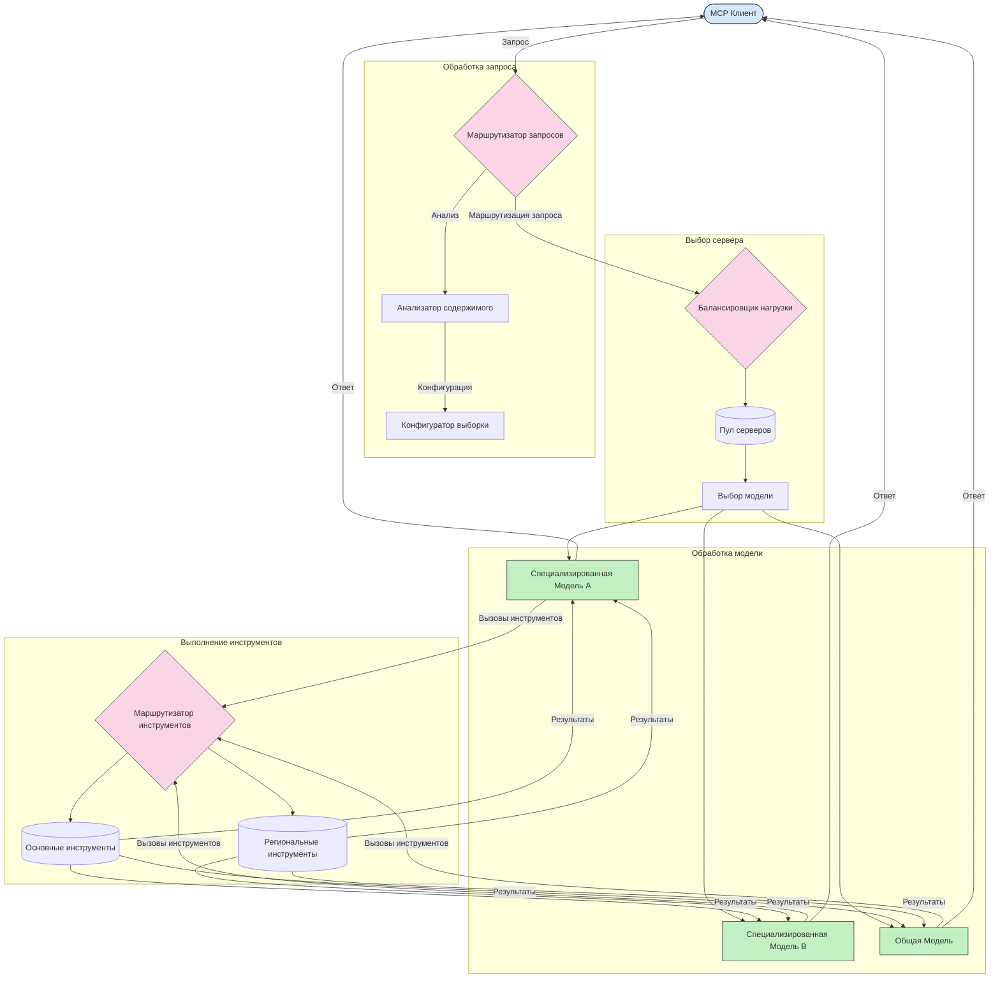

# Маршрутизация в протоколе контекста модели

Маршрутизация необходима для направления запросов к соответствующим моделям, инструментам или службам в экосистеме MCP.

## Введение

Маршрутизация в протоколе контекста модели (MCP) заключается в направлении запросов к наиболее подходящим моделям или службам на основе различных критериев, таких как тип содержимого, контекст пользователя и нагрузка на систему. Это обеспечивает эффективную обработку и оптимальное использование ресурсов.

## Цели обучения

К концу этого урока вы сможете:

- Понять принципы маршрутизации в MCP.
- Реализовать маршрутизацию на основе содержимого для направления запросов к специализированным службам.
- Применять интеллектуальные стратегии балансировки нагрузки для оптимизации использования ресурсов.
- Реализовать динамическую маршрутизацию инструментов на основе контекста запроса.

## Маршрутизация на основе содержимого

Маршрутизация на основе содержимого направляет запросы к специализированным службам в зависимости от содержимого запроса. Например, запросы, связанные с генерацией кода, могут направляться к специализированной модели кода, а запросы на творческое письмо — к модели для творческого письма.

Рассмотрим пример реализации на разных языках программирования.

<details>
<summary>.NET</summary>

```csharp
// .NET Example: Content-based routing in MCP
public class ContentBasedRouter
{
    private readonly Dictionary<string, McpClient> _specializedClients;
    private readonly RoutingClassifier _classifier;
    
    public ContentBasedRouter()
    {
        // Initialize specialized clients for different domains
        _specializedClients = new Dictionary<string, McpClient>
        {
            ["code"] = new McpClient("https://code-specialized-mcp.com"),
            ["creative"] = new McpClient("https://creative-specialized-mcp.com"),
            ["scientific"] = new McpClient("https://scientific-specialized-mcp.com"),
            ["general"] = new McpClient("https://general-mcp.com")
        };
        
        // Initialize content classifier
        _classifier = new RoutingClassifier();
    }
    
    public async Task<McpResponse> RouteAndProcessAsync(string prompt, IDictionary<string, object> parameters = null)
    {
        // Classify the prompt to determine the best specialized service
        string category = await _classifier.ClassifyPromptAsync(prompt);
        
        // Get the appropriate client or fall back to general
        var client = _specializedClients.ContainsKey(category) 
            ? _specializedClients[category] 
            : _specializedClients["general"];
            
        Console.WriteLine($"Routing request to {category} specialized service");
        
        // Send request to the selected service
        return await client.SendPromptAsync(prompt, parameters);
    }
    
    // Simple classifier for routing decisions
    private class RoutingClassifier
    {
        public Task<string> ClassifyPromptAsync(string prompt)
        {
            prompt = prompt.ToLowerInvariant();
            
            if (prompt.Contains("code") || prompt.Contains("function") || 
                prompt.Contains("program") || prompt.Contains("algorithm"))
            {
                return Task.FromResult("code");
            }
            
            if (prompt.Contains("story") || prompt.Contains("creative") || 
                prompt.Contains("imagine") || prompt.Contains("design"))
            {
                return Task.FromResult("creative");
            }
            
            if (prompt.Contains("science") || prompt.Contains("research") || 
                prompt.Contains("analyze") || prompt.Contains("study"))
            {
                return Task.FromResult("scientific");
            }
            
            return Task.FromResult("general");
        }
    }
}
```

В приведённом коде мы:

- Создали класс `ContentBasedRouter`, который маршрутизирует запросы на основе содержимого подсказки.
- Инициализировали специализированных клиентов для разных областей (код, творчество, наука, общие).
- Реализовали простой классификатор, который определяет категорию подсказки и направляет её в соответствующую специализированную службу.
- Использовали механизм fallback для маршрутизации запросов к общей службе, если специализированная служба недоступна.
- Реализовали асинхронную обработку для эффективной работы с запросами.
- Использовали словарь для сопоставления категорий содержимого специализированным клиентам MCP.
- Реализовали простой классификатор, который анализирует подсказку и возвращает соответствующую категорию.
- Использовали специализированного клиента для отправки запроса и получения ответа.
- Обработали случаи, когда подсказка не соответствует ни одной специализированной категории, направляя запросы к общей службе.

</details>

## Интеллектуальная балансировка нагрузки

Балансировка нагрузки оптимизирует использование ресурсов и обеспечивает высокую доступность служб MCP. Существуют различные способы реализации балансировки нагрузки, такие как round-robin, взвешенное время отклика или стратегии с учётом содержимого.

Рассмотрим пример реализации, использующий следующие стратегии:

- **Round Robin**: Равномерно распределяет запросы по доступным серверам.
- **Взвешенное время отклика**: Направляет запросы к серверам в зависимости от их среднего времени отклика.
- **С учётом содержимого**: Направляет запросы на специализированные серверы в зависимости от содержимого запроса.

<details>
<summary>Java</summary>

```java
// Пример на Java: Интеллектуальное распределение нагрузки для серверов MCP
public class McpLoadBalancer {
    private final List<McpServerNode> serverNodes;
    private final LoadBalancingStrategy strategy;
    
    public McpLoadBalancer(List<McpServerNode> nodes, LoadBalancingStrategy strategy) {
        this.serverNodes = new ArrayList<>(nodes);
        this.strategy = strategy;
    }
    
    public McpResponse processRequest(McpRequest request) {
        // Выбрать лучший сервер на основе стратегии
        McpServerNode selectedNode = strategy.selectNode(serverNodes, request);
        
        try {
            // Направить запрос на выбранный узел
            return selectedNode.processRequest(request);
        } catch (Exception e) {
            // Обработать сбой - реализовать повторную попытку или резервную логику
            System.err.println("Error processing request on node " + selectedNode.getId() + ": " + e.getMessage());
            
            // Отметить узел как потенциально неисправный
            selectedNode.recordFailure();
            
            // Попробовать следующий лучший узел в качестве резерва
            List<McpServerNode> remainingNodes = new ArrayList<>(serverNodes);
            remainingNodes.remove(selectedNode);
            
            if (!remainingNodes.isEmpty()) {
                McpServerNode fallbackNode = strategy.selectNode(remainingNodes, request);
                return fallbackNode.processRequest(request);
            } else {
                throw new RuntimeException("All MCP server nodes failed to process the request");
            }
        }
    }
    
    // Задача проверки состояния узла
    public void startHealthChecks(Duration interval) {
        ScheduledExecutorService scheduler = Executors.newScheduledThreadPool(1);
        scheduler.scheduleAtFixedRate(() -> {
            for (McpServerNode node : serverNodes) {
                try {
                    boolean isHealthy = node.checkHealth();
                    System.out.println("Node " + node.getId() + " health status: " + 
                                      (isHealthy ? "HEALTHY" : "UNHEALTHY"));
                } catch (Exception e) {
                    System.err.println("Health check failed for node " + node.getId());
                    node.setHealthy(false);
                }
            }
        }, 0, interval.toMillis(), TimeUnit.MILLISECONDS);
    }
    
    // Интерфейс для стратегий балансировки нагрузки
    public interface LoadBalancingStrategy {
        McpServerNode selectNode(List<McpServerNode> nodes, McpRequest request);
    }
    
    // Стратегия круговой очереди
    public static class RoundRobinStrategy implements LoadBalancingStrategy {
        private AtomicInteger counter = new AtomicInteger(0);
        
        @Override
        public McpServerNode selectNode(List<McpServerNode> nodes, McpRequest request) {
            List<McpServerNode> healthyNodes = nodes.stream()
                .filter(McpServerNode::isHealthy)
                .collect(Collectors.toList());
            
            if (healthyNodes.isEmpty()) {
                throw new RuntimeException("No healthy nodes available");
            }
            
            int index = counter.getAndIncrement() % healthyNodes.size();
            return healthyNodes.get(index);
        }
    }
    
    // Стратегия с учетом взвешенного времени отклика
    public static class ResponseTimeStrategy implements LoadBalancingStrategy {
        @Override
        public McpServerNode selectNode(List<McpServerNode> nodes, McpRequest request) {
            return nodes.stream()
                .filter(McpServerNode::isHealthy)
                .min(Comparator.comparing(McpServerNode::getAverageResponseTime))
                .orElseThrow(() -> new RuntimeException("No healthy nodes available"));
        }
    }
    
    // Стратегия с учетом содержимого
    public static class ContentAwareStrategy implements LoadBalancingStrategy {
        @Override
        public McpServerNode selectNode(List<McpServerNode> nodes, McpRequest request) {
            // Определить характеристики запроса
            boolean isCodeRequest = request.getPrompt().contains("code") || 
                                   request.getAllowedTools().contains("codeInterpreter");
            
            boolean isCreativeRequest = request.getPrompt().contains("creative") || 
                                       request.getPrompt().contains("story");
            
            // Найти специализированные узлы
            Optional<McpServerNode> specializedNode = nodes.stream()
                .filter(McpServerNode::isHealthy)
                .filter(node -> {
                    if (isCodeRequest && node.getSpecialization().equals("code")) {
                        return true;
                    }
                    if (isCreativeRequest && node.getSpecialization().equals("creative")) {
                        return true;
                    }
                    return false;
                })
                .findFirst();
            
            // Вернуть специализированный узел или наименее загруженный узел
            return specializedNode.orElse(
                nodes.stream()
                    .filter(McpServerNode::isHealthy)
                    .min(Comparator.comparing(McpServerNode::getCurrentLoad))
                    .orElseThrow(() -> new RuntimeException("No healthy nodes available"))
            );
        }
    }
}
```

В приведённом коде мы:

- Создали класс `McpLoadBalancer`, который управляет списком узлов серверов MCP и маршрутизирует запросы на основе выбранной стратегии балансировки нагрузки.
- Реализовали различные стратегии балансировки нагрузки: `RoundRobinStrategy`, `ResponseTimeStrategy` и `ContentAwareStrategy`.
- Использовали `ScheduledExecutorService` для периодической проверки состояния узлов серверов.
- Реализовали механизм проверки состояния, который помечает узлы как здоровые или нездоровые в зависимости от их ответа на проверки.
- Обработали обработку запросов с ошибками и логикой резервирования для обеспечения высокой доступности.
- Использовали класс `McpServerNode` для представления отдельных узлов серверов MCP, включая их состояние здоровья, среднее время отклика и текущую нагрузку.
- Реализовали класс `McpRequest` для инкапсуляции деталей запроса, таких как подсказка и разрешённые инструменты.
- Использовали Java Streams для фильтрации и выбора узлов на основе состояния здоровья и специализации.

</details>

## Динамическая маршрутизация инструментов

Маршрутизация инструментов обеспечивает направление вызовов инструментов к наиболее подходящей службе на основе контекста. Например, вызов инструмента погоды может требовать маршрутизации к региональному эндпоинту в зависимости от местоположения пользователя, или инструмент калькулятора может требовать использования определённой версии API.

Рассмотрим пример реализации, демонстрирующий динамическую маршрутизацию инструментов на основе анализа запросов, региональных эндпоинтов и поддержки версионирования.

<details>
<summary>Python</summary>

```python
# Пример на Python: Динамическая маршрутизация инструмента на основе анализа запроса
class McpToolRouter:
    def __init__(self):
        # Регистрация доступных конечных точек инструментов
        self.tool_endpoints = {
            "weatherTool": "https://weather-service.example.com/api",
            "calculatorTool": "https://calculator-service.example.com/compute",
            "databaseTool": "https://database-service.example.com/query",
            "searchTool": "https://search-service.example.com/search"
        }
        
        # Региональные конечные точки для глобального распределения
        self.regional_endpoints = {
            "us": {
                "weatherTool": "https://us-west.weather-service.example.com/api",
                "searchTool": "https://us.search-service.example.com/search"
            },
            "europe": {
                "weatherTool": "https://eu.weather-service.example.com/api",
                "searchTool": "https://eu.search-service.example.com/search"
            },
            "asia": {
                "weatherTool": "https://asia.weather-service.example.com/api",
                "searchTool": "https://asia.search-service.example.com/search"
            }
        }
        
        # Поддержка версионирования инструментов
        self.tool_versions = {
            "weatherTool": {
                "default": "v2",
                "v1": "https://weather-service.example.com/api/v1",
                "v2": "https://weather-service.example.com/api/v2",
                "beta": "https://weather-service.example.com/api/beta"
            }
        }
    
    async def route_tool_request(self, tool_name, parameters, user_context=None):
        """Route a tool request to the appropriate endpoint based on context"""
        endpoint = self._select_endpoint(tool_name, parameters, user_context)
        
        if not endpoint:
            raise ValueError(f"No endpoint available for tool: {tool_name}")
        
        # Выполнить фактический запрос к выбранной конечной точке
        return await self._execute_tool_request(endpoint, tool_name, parameters)
    
    def _select_endpoint(self, tool_name, parameters, user_context=None):
        """Select the most appropriate endpoint based on context"""
        # Базовая конечная точка из реестра
        if tool_name not in self.tool_endpoints:
            return None
            
        base_endpoint = self.tool_endpoints[tool_name]
        
        # Проверить, нужно ли использовать определённую версию инструмента
        if tool_name in self.tool_versions:
            version_info = self.tool_versions[tool_name]
            
            # Использовать указанную версию или версию по умолчанию
            requested_version = parameters.get("_version", version_info["default"])
            if requested_version in version_info:
                base_endpoint = version_info[requested_version]
        
        # Проверить маршрутизацию по региону, если регион пользователя известен
        if user_context and "region" in user_context:
            user_region = user_context["region"]
            
            if user_region in self.regional_endpoints:
                regional_tools = self.regional_endpoints[user_region]
                
                if tool_name in regional_tools:
                    # Использовать конечную точку, специфичную для региона
                    return regional_tools[tool_name]
        
        # Проверить требования к размещению данных
        if user_context and "data_residency" in user_context:
            # Это реализует логику, чтобы данные оставались в указанной юрисдикции
            pass
        
        # Проверить маршрутизацию на основе задержек
        if user_context and "latency_sensitive" in user_context and user_context["latency_sensitive"]:
            # Это реализует логику выбора конечной точки с наименьшей задержкой
            pass
            
        return base_endpoint
        
    async def _execute_tool_request(self, endpoint, tool_name, parameters):
        """Execute the actual tool request to the selected endpoint"""
        try:
            async with aiohttp.ClientSession() as session:
                async with session.post(
                    endpoint,
                    json={"toolName": tool_name, "parameters": parameters},
                    headers={"Content-Type": "application/json"}
                ) as response:
                    if response.status == 200:
                        result = await response.json()
                        return result
                    else:
                        error_text = await response.text()
                        raise Exception(f"Tool execution failed: {error_text}")
        except Exception as e:
            # Реализовать логику повторных попыток или стратегию резервирования
            print(f"Error executing tool {tool_name} at {endpoint}: {str(e)}")
            raise
```

В приведённом коде мы:

- Создали класс `McpToolRouter`, который управляет маршрутизацией инструментов на основе анализа запросов, региональных эндпоинтов и поддержки версионирования.
- Зарегистрировали доступные эндпоинты инструментов и региональные эндпоинты для глобального распределения.
- Реализовали логику динамической маршрутизации, которая выбирает подходящий эндпоинт на основе контекста пользователя, такого как регион и требования к локализации данных.
- Реализовали поддержку версионирования инструментов, позволяя пользователям указывать, какую версию инструмента они хотят использовать.
- Использовали асинхронные HTTP-запросы для выполнения вызовов инструментов и обработки ответов.

</details>

## Архитектура выборки и маршрутизации в MCP

Выборка — это критически важный компонент протокола контекста модели (MCP), который позволяет эффективно обрабатывать запросы и маршрутизировать их. Она включает анализ входящих запросов для определения наиболее подходящей модели или службы для их обработки на основе различных критериев, таких как тип содержимого, контекст пользователя и нагрузка на систему.

Выборку и маршрутизацию можно сочетать для создания надёжной архитектуры, которая оптимизирует использование ресурсов и обеспечивает высокую доступность. Процесс выборки может использоваться для классификации запросов, а маршрутизация направляет их к соответствующим моделям или службам.

Ниже приведена диаграмма, которая иллюстрирует, как выборка и маршрутизация работают вместе в комплексной архитектуре MCP:



## Что дальше

- [5.6 Sampling](../mcp-sampling/README.md)

---

<!-- CO-OP TRANSLATOR DISCLAIMER START -->
**Отказ от ответственности**:
Этот документ был переведен с использованием сервиса машинного перевода [Co-op Translator](https://github.com/Azure/co-op-translator). Несмотря на наши усилия по обеспечению точности, имейте в виду, что автоматический перевод может содержать ошибки или неточности. Оригинальный документ на его исходном языке следует считать авторитетным источником. Для получения критически важной информации рекомендуется обратиться к профессиональному человеческому переводу. Мы не несем ответственности за любые недоразумения или неправильные толкования, возникшие в результате использования этого перевода.
<!-- CO-OP TRANSLATOR DISCLAIMER END -->