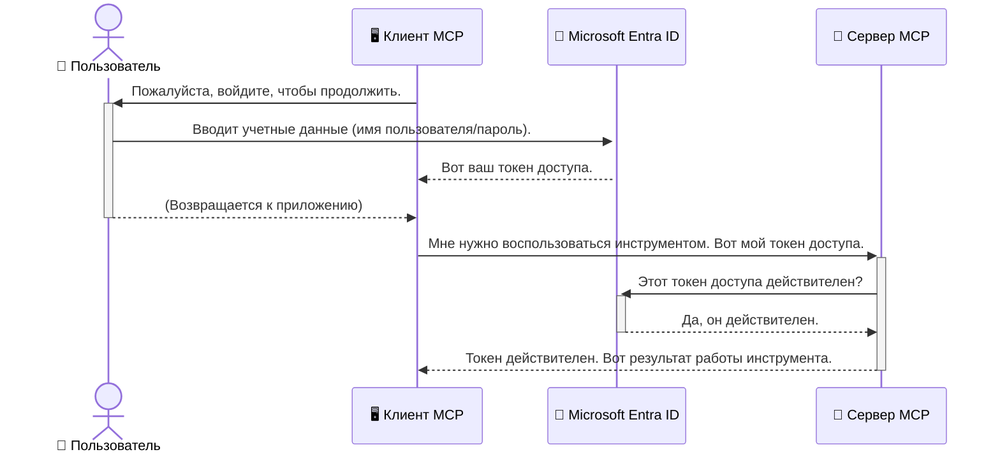

# Защита рабочих процессов ИИ: аутентификация Entra ID для серверов протокола Model Context

> [!NOTE]
> Код удаленного сервера в этом уроке защищает устаревшие конечные точки `/sse` и `/message`
> и ориентируется на MCP версии `2025-11-25`. Сохраните его методы проверки подлинности и идентификации,
> но для новых реализаций используйте совместимый с `2026-07-28` Streamable HTTP транспорт.


## Введение
Защита вашего сервера Model Context Protocol (MCP) так же важна, как и запирание входной двери дома. Оставляя сервер MCP открытым, вы подвергаете свои инструменты и данные несанкционированному доступу, что может привести к нарушениям безопасности. Microsoft Entra ID предоставляет надежное облачное решение для управления идентификацией и доступом, помогая гарантировать, что взаимодействовать с вашим сервером MCP могут только авторизованные пользователи и приложения. В этом разделе вы узнаете, как защитить ваши рабочие процессы ИИ с помощью аутентификации Entra ID.

## Цели обучения
К концу этого раздела вы сможете:

- Понимать важность защиты серверов MCP.
- Объяснять основы Microsoft Entra ID и аутентификации OAuth 2.0.
- Распознавать разницу между публичными и конфиденциальными клиентами.
- Реализовывать аутентификацию Entra ID в локальных (публичный клиент) и удаленных (конфиденциальный клиент) сценариях сервера MCP.
- Применять лучшие практики безопасности при разработке рабочих процессов ИИ.

## Безопасность и MCP

Так же как вы не оставите входную дверь своего дома незапертой, не стоит оставлять сервер MCP открытым для любого пользователя. Защита ваших рабочих процессов ИИ необходима для создания надежных, доверенных и безопасных приложений. В этой главе вы узнаете, как использовать Microsoft Entra ID для защиты серверов MCP, чтобы только авторизованные пользователи и приложения могли взаимодействовать с вашими инструментами и данными.

## Почему безопасность важна для серверов MCP

Представьте, что ваш сервер MCP имеет инструмент, способный отправлять электронные письма или получать доступ к базе данных клиентов. Не защищенный сервер означает, что любой может использовать этот инструмент, что приведет к несанкционированному доступу к данным, спаму или другим вредоносным действиям.

Реализуя аутентификацию, вы гарантируете, что каждый запрос к серверу проверяется, подтверждая личность пользователя или приложения, делающего запрос. Это первый и самый важный шаг в обеспечении безопасности ваших рабочих процессов ИИ.

## Введение в Microsoft Entra ID

[**Microsoft Entra ID**](https://adoption.microsoft.com/microsoft-security/entra/) — это облачный сервис управления идентификацией и доступом. Представьте его как универсального охранника безопасности для ваших приложений. Он обрабатывает сложные процессы проверки личностей пользователей (аутентификация) и определяет, что им разрешено делать (авторизация).

Используя Entra ID, вы можете:

- Обеспечить безопасный вход пользователей.
- Защищать API и сервисы.
- Управлять политиками доступа из центрального места.

Для серверов MCP Entra ID предоставляет надежное и широко признанное решение для управления тем, кто имеет доступ к возможностям вашего сервера.

---

## Понимание магии: как работает аутентификация Entra ID

Entra ID использует открытые стандарты, такие как **OAuth 2.0**, для обработки аутентификации. Хотя детали могут быть сложными, основная концепция проста и понятна через аналогию.

### Краткое введение в OAuth 2.0: ключ парковщика

Представьте OAuth 2.0 как услугу парковщика для вашей машины. Когда вы приходите в ресторан, вы не даете парковщику свой главный ключ. Вместо этого вы предоставляете **ключ парковщика** с ограниченными правами — он может завести машину и запереть двери, но не может открыть багажник или перчаточный ящик.

В этой аналогии:

- **Вы** — это **Пользователь**.
- **Ваша машина** — это **сервер MCP** с его ценными инструментами и данными.
- **Парковщик** — это **Microsoft Entra ID**.
- **Парковочный контролёр** — это **MCP клиент** (приложение, пытающееся получить доступ к серверу).
- **Ключ парковщика** — это **токен доступа**.

Токен доступа — это безопасная строка текста, которую клиент MCP получает от Entra ID после вашего входа в систему. Затем клиент предъявляет этот токен серверу MCP с каждым запросом. Сервер может проверить токен, чтобы убедиться, что запрос легитимен и у клиента есть необходимые разрешения, не обрабатывая при этом ваши реальные учетные данные (например, пароль).

### Процесс аутентификации

Вот как процесс работает на практике:



### Введение в Microsoft Authentication Library (MSAL)

Прежде чем перейти к коду, важно представить ключевой компонент, который вы увидите в примерах: **Microsoft Authentication Library (MSAL)**.

MSAL — это библиотека, разработанная Microsoft, которая значительно упрощает разработчикам работу с аутентификацией. Вместо того чтобы писать весь сложный код для работы с токенами безопасности, управлением входов и обновлением сессий, MSAL берет на себя эту тяжелую работу.

Использование библиотеки MSAL настоятельно рекомендуется, так как:

- **Это безопасно:** реализует отраслевые протоколы и лучшие практики безопасности, снижая риск уязвимостей в вашем коде.
- **Это упрощает разработку:** скрывает сложности протоколов OAuth 2.0 и OpenID Connect, позволяя добавить надежную аутентификацию в ваше приложение всего несколькими строками кода.
- **Она поддерживается:** Microsoft активно поддерживает и обновляет MSAL для борьбы с новыми угрозами безопасности и изменениями платформы.

MSAL поддерживает множество языков программирования и фреймворков, включая .NET, JavaScript/TypeScript, Python, Java, Go, а также мобильные платформы iOS и Android. Это означает, что вы можете использовать одни и те же последовательные шаблоны аутентификации в вашем технологическом стеке.

Чтобы узнать больше про MSAL, ознакомьтесь с официальной [документацией по MSAL](https://learn.microsoft.com/entra/identity-platform/msal-overview).

---

## Защита вашего сервера MCP с помощью Entra ID: пошаговое руководство

Теперь рассмотрим, как защитить локальный сервер MCP (который общается через `stdio`) с использованием Entra ID. В этом примере используется **публичный клиент**, подходящий для приложений, работающих на компьютере пользователя, например десктопного приложения или локального сервера разработки.

### Сценарий 1: Защита локального сервера MCP (с публичным клиентом)

В этом сценарии рассмотрим MCP сервер, работающий локально, который общается по `stdio` и использует Entra ID для аутентификации пользователя перед предоставлением доступа к своим инструментам. У сервера будет один инструмент, который получает информацию профиля пользователя из Microsoft Graph API.

#### 1. Настройка приложения в Entra ID

Прежде чем писать код, необходимо зарегистрировать ваше приложение в Microsoft Entra ID. Это сообщает Entra ID о вашем приложении и предоставляет ему разрешение использовать сервис аутентификации.

1. Перейдите на **[портал Microsoft Entra](https://entra.microsoft.com/)**.
2. Перейдите в раздел **Регистрация приложений** и нажмите **Создать регистрацию**.
3. Присвойте вашему приложению имя (например, "Мой локальный сервер MCP").
4. Для **Типов поддерживаемых учетных записей** выберите **Учетные записи только в этом организационном каталоге**.
5. Для этого примера можно оставить **URI перенаправления** пустым.
6. Нажмите **Зарегистрировать**.

После регистрации запишите значения **Application (client) ID** и **Directory (tenant) ID** — они понадобятся в вашем коде.

#### 2. Код: разбор

Рассмотрим ключевые части кода, которые обрабатывают аутентификацию. Полный код этого примера доступен в папке [Entra ID - Local - WAM](https://github.com/Azure-Samples/mcp-auth-servers/tree/main/src/entra-id-local-wam) репозитория [mcp-auth-servers на GitHub](https://github.com/Azure-Samples/mcp-auth-servers).

**`AuthenticationService.cs`**

Этот класс отвечает за взаимодействие с Entra ID.

- **`CreateAsync`**: этот метод инициализирует `PublicClientApplication` из MSAL (Microsoft Authentication Library). Он настраивается с `clientId` и `tenantId` вашего приложения.
- **`WithBroker`**: включает использование брокера (например, Windows Web Account Manager), обеспечивающего более безопасный и плавный опыт единого входа.
- **`AcquireTokenAsync`**: основной метод. Сначала пытается получить токен тихо (если у пользователя уже есть действующая сессия, повторный вход не потребуется). Если получить токен тихо не получается, выведется интерактивный запрос входа.

```csharp
// Simplified for clarity
public static async Task<AuthenticationService> CreateAsync(ILogger<AuthenticationService> logger)
{
    var msalClient = PublicClientApplicationBuilder
        .Create(_clientId) // Your Application (client) ID
        .WithAuthority(AadAuthorityAudience.AzureAdMyOrg)
        .WithTenantId(_tenantId) // Your Directory (tenant) ID
        .WithBroker(new BrokerOptions(BrokerOptions.OperatingSystems.Windows))
        .Build();

    // ... cache registration ...

    return new AuthenticationService(logger, msalClient);
}

public async Task<string> AcquireTokenAsync()
{
    try
    {
        // Try silent authentication first
        var accounts = await _msalClient.GetAccountsAsync();
        var account = accounts.FirstOrDefault();

        AuthenticationResult? result = null;

        if (account != null)
        {
            result = await _msalClient.AcquireTokenSilent(_scopes, account).ExecuteAsync();
        }
        else
        {
            // If no account, or silent fails, go interactive
            result = await _msalClient.AcquireTokenInteractive(_scopes).ExecuteAsync();
        }

        return result.AccessToken;
    }
    catch (Exception ex)
    {
        _logger.LogError(ex, "An error occurred while acquiring the token.");
        throw; // Optionally rethrow the exception for higher-level handling
    }
}
```

**`Program.cs`**

Здесь настраивается сервер MCP и интегрируется сервис аутентификации.

- **`AddSingleton<AuthenticationService>`**: регистрирует `AuthenticationService` в контейнере внедрения зависимостей для использования в других частях приложения (например, в нашем инструменте).
- **Инструмент `GetUserDetailsFromGraph`**: этому инструменту нужен экземпляр `AuthenticationService`. Перед началом он вызывает `authService.AcquireTokenAsync()`, чтобы получить действующий токен доступа. Если аутентификация прошла успешно, инструмент использует этот токен для вызова Microsoft Graph API и получения данных пользователя.

```csharp
// Simplified for clarity
[McpServerTool(Name = "GetUserDetailsFromGraph")]
public static async Task<string> GetUserDetailsFromGraph(
    AuthenticationService authService)
{
    try
    {
        // This will trigger the authentication flow
        var accessToken = await authService.AcquireTokenAsync();

        // Use the token to create a GraphServiceClient
        var graphClient = new GraphServiceClient(
            new BaseBearerTokenAuthenticationProvider(new TokenProvider(authService)));

        var user = await graphClient.Me.GetAsync();

        return System.Text.Json.JsonSerializer.Serialize(user);
    }
    catch (Exception ex)
    {
        return $"Error: {ex.Message}";
    }
}
```

#### 3. Как это работает вместе

1. Когда MCP клиент пытается использовать инструмент `GetUserDetailsFromGraph`, инструмент сначала вызывает `AcquireTokenAsync`.
2. `AcquireTokenAsync` заставляет библиотеку MSAL проверить наличие действительного токена.
3. Если токен не найден, MSAL через брокера запрашивает у пользователя вход с учетной записью Entra ID.
4. После входа Entra ID выдает токен доступа.
5. Инструмент получает токен и использует его для безопасного вызова Microsoft Graph API.
6. Детали пользователя возвращаются MCP клиенту.

Этот процесс гарантирует, что использовать инструмент могут только аутентифицированные пользователи, эффективно защищая ваш локальный сервер MCP.

### Сценарий 2: Защита удаленного сервера MCP (с конфиденциальным клиентом)

Когда ваш сервер MCP работает на удаленной машине (например, в облаке) и общается по протоколу, такому как HTTP Streaming, требования к безопасности иные. В этом случае следует использовать **конфиденциального клиента** и **поток авторизации с кодом**. Это более безопасный метод, так как тайны приложения никогда не раскрываются в браузере.

В этом примере используется MCP сервер на TypeScript, который использует Express.js для обработки HTTP-запросов.

#### 1. Настройка приложения в Entra ID

Настройка в Entra ID похожа на сценарий с публичным клиентом, но с одним важным отличием: нужно создать **секрет клиента**.

1. Перейдите на **[портал Microsoft Entra](https://entra.microsoft.com/)**.
2. В регистрации вашего приложения перейдите на вкладку **Сертификаты и секреты**.
3. Нажмите **Новый секрет клиента**, дайте описание и нажмите **Добавить**.
4. **Важно:** сразу скопируйте значение секрета. Повторно увидеть его нельзя.
5. Также нужно настроить **URI перенаправления**. Перейдите на вкладку **Аутентификация**, нажмите **Добавить платформу**, выберите **Веб** и введите URI перенаправления для вашего приложения (например, `http://localhost:3001/auth/callback`).

> **⚠️ Важное замечание по безопасности:** для производственных приложений Microsoft настоятельно рекомендует использовать методы аутентификации без секретов, такие как **Managed Identity** или **Workload Identity Federation**, вместо секретов клиента. Секреты клиента представляют риски безопасности, так как могут быть раскрыты или скомпрометированы. Управляемые идентификаторы обеспечивают более безопасный подход, устраняя необходимость хранить учетные данные в коде или конфигурации.
>
> Для получения дополнительной информации об управляемых идентификаторах и их реализации смотрите [Обзор управляемых идентификаторов для ресурсов Azure](https://learn.microsoft.com/entra/identity/managed-identities-azure-resources/overview).

#### 2. Код: разбор

В этом примере используется сессионный подход. При аутентификации пользователя сервер сохраняет токен доступа и токен обновления в сессии и выдает пользователю токен сессии. Затем этот токен сессии используется для последующих запросов. Полный код доступен в папке [Entra ID - Confidential client](https://github.com/Azure-Samples/mcp-auth-servers/tree/main/src/entra-id-cca-session) репозитория [mcp-auth-servers на GitHub](https://github.com/Azure-Samples/mcp-auth-servers).

**`Server.ts`**

Этот файл настраивает сервер Express и слой транспорта MCP.

- **`requireBearerAuth`**: это middleware, которое защищает конечные точки `/sse` и `/message`. Оно проверяет наличие действительного токена типа bearer в заголовке `Authorization` запроса.
- **`EntraIdServerAuthProvider`**: это пользовательский класс, реализующий интерфейс `McpServerAuthorizationProvider`. Он отвечает за обработку потока OAuth 2.0.
- **`/auth/callback`**: эта конечная точка обрабатывает перенаправление от Entra ID после аутентификации пользователя. Она обменивает код авторизации на токен доступа и токен обновления.

```typescript
// Упрощено для ясности
const app = express();
const { server } = createServer();
const provider = new EntraIdServerAuthProvider();

// Защитить SSE эндпоинт
app.get("/sse", requireBearerAuth({
  provider,
  requiredScopes: ["User.Read"]
}), async (req, res) => {
  // ... подключиться к транспорту ...
});

// Защитить эндпоинт сообщений
app.post("/message", requireBearerAuth({
  provider,
  requiredScopes: ["User.Read"]
}), async (req, res) => {
  // ... обработать сообщение ...
});

// Обработать обратный вызов OAuth 2.0
app.get("/auth/callback", (req, res) => {
  provider.handleCallback(req.query.code, req.query.state)
    .then(result => {
      // ... обработать успех или неудачу ...
    });
});
```

**`Tools.ts`**

Этот файл определяет инструменты, которые предоставляет сервер MCP. Инструмент `getUserDetails` похож на предыдущий, но получает токен доступа из сессии.

```typescript
// Упрощено для ясности
server.setRequestHandler(CallToolRequestSchema, async (request) => {
  const { name } = request.params;
  const context = request.params?.context as { token?: string } | undefined;
  const sessionToken = context?.token;

  if (name === ToolName.GET_USER_DETAILS) {
    if (!sessionToken) {
      throw new AuthenticationError("Authentication token is missing or invalid. Ensure the token is provided in the request context.");
    }

    // Получить токен Entra ID из хранилища сессий
    const tokenData = tokenStore.getToken(sessionToken);
    const entraIdToken = tokenData.accessToken;

    const graphClient = Client.init({
      authProvider: (done) => {
        done(null, entraIdToken);
      }
    });

    const user = await graphClient.api('/me').get();

    // ... вернуть данные пользователя ...
  }
});
```

**`auth/EntraIdServerAuthProvider.ts`**

Этот класс отвечает за логику:

- Перенаправление пользователя на страницу входа Entra ID.
- Обмен кода авторизации на токен доступа.
- Хранение токенов в `tokenStore`.
- Обновление токена доступа при его истечении.


#### 3. Как это всё работает вместе

1. Когда пользователь впервые пытается подключиться к серверу MCP, middleware `requireBearerAuth` обнаруживает, что у него нет действительной сессии, и перенаправляет его на страницу входа Entra ID.
2. Пользователь входит в систему со своей учетной записью Entra ID.
3. Entra ID перенаправляет пользователя обратно на конечную точку `/auth/callback` с кодом авторизации.
4. Сервер обменивает код на токен доступа и токен обновления, сохраняет их и создает токен сессии, который отправляется клиенту.
5. Клиент теперь может использовать этот токен сессии в заголовке `Authorization` для всех последующих запросов к серверу MCP.
6. При вызове инструмента `getUserDetails` используется токен сессии для поиска токена доступа Entra ID, который затем используется для вызова Microsoft Graph API.

Этот процесс сложнее, чем для публичного клиента, но необходим для конечных точек, доступных из интернета. Поскольку удаленные серверы MCP доступны через публичный интернет, им требуются более строгие меры безопасности для защиты от несанкционированного доступа и потенциальных атак.


## Лучшие практики безопасности

- **Всегда используйте HTTPS**: Шифруйте связь между клиентом и сервером, чтобы защитить токены от перехвата.
- **Реализуйте контроль доступа на основе ролей (RBAC)**: Не просто проверяйте, *аутентифицирован ли* пользователь; проверяйте, *что* ему разрешено делать. Вы можете определить роли в Entra ID и проверять их на сервере MCP.
- **Мониторинг и аудит**: Ведите журнал всех событий аутентификации, чтобы обнаруживать и реагировать на подозрительную активность.
- **Обработка ограничения скорости и дросселирования**: Microsoft Graph и другие API реализуют ограничение количества запросов для предотвращения злоупотреблений. Реализуйте экспоненциальное отступление и логику повторных попыток на сервере MCP для корректной обработки ответов HTTP 429 (Слишком много запросов). Рассмотрите возможность кэширования часто используемых данных для сокращения количества вызовов API.
- **Безопасное хранение токенов**: Надежно храните токены доступа и токены обновления. Для локальных приложений используйте системные механизмы безопасного хранения. Для серверных приложений рассмотрите использование зашифрованного хранилища или сервисов управления ключами, таких как Azure Key Vault.
- **Обработка истечения срока токенов**: Токены доступа имеют ограниченный срок действия. Реализуйте автоматическое обновление токенов с использованием токенов обновления, чтобы обеспечить бесшовный пользовательский опыт без необходимости повторной аутентификации.
- **Рассмотрите использование Azure API Management**: Хотя реализация безопасности непосредственно на сервере MCP дает тонкий контроль, API-шлюзы, такие как Azure API Management, могут автоматически обрабатывать многие вопросы безопасности, включая аутентификацию, авторизацию, ограничение скорости и мониторинг. Они обеспечивают централизованный слой безопасности между вашими клиентами и серверами MCP. Для подробностей об использовании API-шлюзов с MCP смотрите нашу статью [Azure API Management Your Auth Gateway For MCP Servers](https://techcommunity.microsoft.com/blog/integrationsonazureblog/azure-api-management-your-auth-gateway-for-mcp-servers/4402690).


## Основные выводы

- Защита вашего сервера MCP крайне важна для безопасности данных и инструментов.
- Microsoft Entra ID предоставляет надежное и масштабируемое решение для аутентификации и авторизации.
- Используйте **публичного клиента** для локальных приложений и **конфиденциального клиента** для удаленных серверов.
- **Authorization Code Flow** — самый безопасный вариант для веб-приложений.


## Задание

1. Подумайте о сервере MCP, который вы могли бы построить. Был бы он локальным или удаленным?
2. Исходя из вашего ответа, какой клиент вы бы использовали: публичный или конфиденциальный?
3. Какие разрешения ваш сервер MCP запросил бы для выполнения операций Microsoft Graph?


## Практические задания

### Упражнение 1: Зарегистрировать приложение в Entra ID
Перейдите в портал Microsoft Entra.
Зарегистрируйте новое приложение для вашего сервера MCP.
Запишите идентификатор приложения (client ID) и идентификатор каталога (tenant ID).

### Упражнение 2: Защитить локальный сервер MCP (публичный клиент)
- Следуйте примеру кода для интеграции MSAL (Microsoft Authentication Library) для аутентификации пользователей.
- Проверьте поток аутентификации, вызвав инструмент MCP, который получает данные пользователя из Microsoft Graph.

### Упражнение 3: Защитить удаленный сервер MCP (конфиденциальный клиент)
- Зарегистрируйте конфиденциального клиента в Entra ID и создайте секрет клиента.
- Настройте ваш Express.js сервер MCP для использования Authorization Code Flow.
- Проверьте защищённые конечные точки и подтвердите доступ по токену.

### Упражнение 4: Применить лучшие практики безопасности
- Включите HTTPS для вашего локального или удаленного сервера.
- Реализуйте контроль доступа на основе ролей (RBAC) в логике сервера.
- Добавьте обработку истечения срока токенов и безопасное хранение токенов.

## Ресурсы

1. **Обзор MSAL**  
   Узнайте, как Microsoft Authentication Library (MSAL) обеспечивает безопасное получение токенов на различных платформах:  
   [MSAL Overview on Microsoft Learn](https://learn.microsoft.com/en-gb/entra/msal/overview)

2. **Репозиторий Azure-Samples/mcp-auth-servers на GitHub**  
   Реализации MCP серверов, демонстрирующие потоки аутентификации:  
   [Azure-Samples/mcp-auth-servers on GitHub](https://github.com/Azure-Samples/mcp-auth-servers)

3. **Обзор управляемых идентичностей для ресурсов Azure**  
   Узнайте, как избавиться от секретов, используя системные или назначенные пользователем управляемые идентичности:  
   [Managed Identities Overview on Microsoft Learn](https://learn.microsoft.com/en-us/entra/identity/managed-identities-azure-resources/)

4. **Azure API Management: Ваш шлюз аутентификации для серверов MCP**  
   Подробный обзор использования APIM в качестве безопасного шлюза OAuth2 для серверов MCP:  
   [Azure API Management Your Auth Gateway For MCP Servers](https://techcommunity.microsoft.com/blog/integrationsonazureblog/azure-api-management-your-auth-gateway-for-mcp-servers/4402690)

5. **Справочник разрешений Microsoft Graph**  
   Полный перечень делегированных и приложенческих разрешений для Microsoft Graph:  
   [Microsoft Graph Permissions Reference](https://learn.microsoft.com/zh-tw/graph/permissions-reference)


## Результаты обучения
После прохождения этого раздела вы сможете:

- Объяснить, почему аутентификация критична для серверов MCP и AI-воркфлоу.
- Настроить и конфигурировать аутентификацию Entra ID как для локальных, так и для удаленных сценариев серверов MCP.
- Выбрать соответствующий тип клиента (публичный или конфиденциальный) в зависимости от развертывания сервера.
- Реализовать безопасные практики программирования, включая хранение токенов и авторизацию на основе ролей.
- Уверенно защищать ваш сервер MCP и его инструменты от несанкционированного доступа.

## Что дальше

- [5.13 Model Context Protocol (MCP) интеграция с Microsoft Foundry](../mcp-foundry-agent-integration/README.md)

---

<!-- CO-OP TRANSLATOR DISCLAIMER START -->
**Отказ от ответственности**:
Этот документ был переведен с использованием сервиса машинного перевода [Co-op Translator](https://github.com/Azure/co-op-translator). Несмотря на наши усилия по обеспечению точности, имейте в виду, что автоматический перевод может содержать ошибки или неточности. Оригинальный документ на его исходном языке следует считать авторитетным источником. Для получения критически важной информации рекомендуется обратиться к профессиональному человеческому переводу. Мы не несем ответственности за любые недоразумения или неправильные толкования, возникшие в результате использования этого перевода.
<!-- CO-OP TRANSLATOR DISCLAIMER END -->