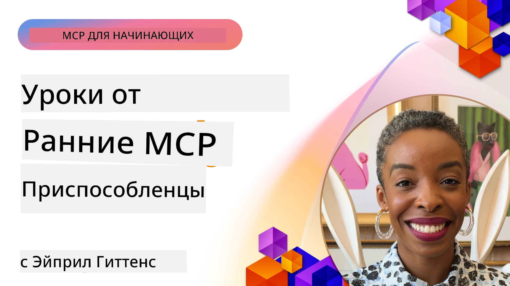

# 🌟 Уроки от первых пользователей

[](https://youtu.be/jds7dSmNptE)

_(Нажмите на изображение выше, чтобы посмотреть видеоурок)_

## 🎯 Что охватывает этот модуль

В этом модуле рассматривается, как реальные организации и разработчики используют Model Context Protocol (MCP) для решения реальных задач и стимулирования инноваций. Через подробные кейс-стади, практические проекты и примеры вы узнаете, как MCP обеспечивает безопасную, масштабируемую интеграцию ИИ, соединяя языковые модели, инструменты и корпоративные данные.

### 📚 Посмотрите MCP в действии

Хотите увидеть применение этих принципов в инструментах, готовых к производству? Ознакомьтесь с нашим [**10 серверами Microsoft MCP, которые трансформируют производительность разработчиков**](microsoft-mcp-servers.md), демонстрирующими реальные серверы Microsoft MCP, доступные для использования уже сегодня.

## Обзор

Этот урок рассказывает о том, как первые пользователи воспользовались Model Context Protocol (MCP) для решения реальных задач и стимулирования инноваций в различных отраслях. Через подробные кейс-стади и практические проекты вы увидите, как MCP обеспечивает стандартизированную, безопасную и масштабируемую интеграцию ИИ — соединяя большие языковые модели, инструменты и корпоративные данные в единую структуру. Вы получите практический опыт проектирования и создания решений на базе MCP, изучите проверенные модели внедрения и узнаете лучшие практики развертывания MCP в производственной среде. В уроке также освещаются новые тенденции, будущие направления и ресурсы с открытым исходным кодом, которые помогут вам оставаться в авангарде технологий MCP и развивающейся экосистемы.

## Цели обучения

- Анализировать реальные внедрения MCP в разных отраслях
- Проектировать и создавать полнофункциональные приложения на базе MCP
- Изучать новые тенденции и будущие направления в технологии MCP
- Применять лучшие практики в реальных сценариях разработки

## Реальные внедрения MCP

### Кейс-стади 1: Автоматизация поддержки клиентов в корпоративной среде

Многонациональная корпорация внедрила решение на базе MCP для стандартизации взаимодействия ИИ в системах поддержки клиентов. Это позволило им:

- Создать единый интерфейс для нескольких поставщиков LLM
- Поддерживать единое управление подсказками во всех отделах
- Внедрить надежные меры безопасности и соответствия требованиям
- Легко переключаться между разными ИИ-моделями в зависимости от конкретных задач

**Техническая реализация:**

```python
# Реализация MCP сервера на Python для поддержки клиентов
import logging
import asyncio
from modelcontextprotocol import create_server, ServerConfig
from modelcontextprotocol.server import MCPServer
from modelcontextprotocol.transports import create_http_transport
from modelcontextprotocol.resources import ResourceDefinition
from modelcontextprotocol.prompts import PromptDefinition
from modelcontextprotocol.tool import ToolDefinition

# Настроить логирование
logging.basicConfig(level=logging.INFO)

async def main():
    # Создать конфигурацию сервера
    config = ServerConfig(
        name="Enterprise Customer Support Server",
        version="1.0.0",
        description="MCP server for handling customer support inquiries"
    )
    
    # Инициализировать MCP сервер
    server = create_server(config)
    
    # Зарегистрировать ресурсы базы знаний
    server.resources.register(
        ResourceDefinition(
            name="customer_kb",
            description="Customer knowledge base documentation"
        ),
        lambda params: get_customer_documentation(params)
    )
    
    # Зарегистрировать шаблоны подсказок
    server.prompts.register(
        PromptDefinition(
            name="support_template",
            description="Templates for customer support responses"
        ),
        lambda params: get_support_templates(params)
    )
    
    # Зарегистрировать инструменты поддержки
    server.tools.register(
        ToolDefinition(
            name="ticketing",
            description="Create and update support tickets"
        ),
        handle_ticketing_operations
    )
    
    # Запустить сервер с HTTP транспортом
    transport = create_http_transport(port=8080)
    await server.run(transport)

if __name__ == "__main__":
    asyncio.run(main())
```

**Результаты:** сокращение затрат на модели на 30%, улучшение согласованности ответов на 45% и повышение соответствия требованиям в глобальных операциях.

### Кейс-стади 2: Ассистент диагностики в здравоохранении

Провайдер медицинских услуг разработал инфраструктуру MCP для интеграции нескольких специализированных медицинских ИИ-моделей с одновременной защитой конфиденциальных данных пациентов:

- Бесшовное переключение между общими и специализированными медицинскими моделями
- Строгий контроль конфиденциальности и аудит
- Интеграция с существующими системами электронных медицинских карт (ЭМК)
- Единообразное управление подсказками для медицинской терминологии

**Техническая реализация:**

```csharp
// C# MCP host application implementation in healthcare application
using Microsoft.Extensions.DependencyInjection;
using ModelContextProtocol.SDK.Client;
using ModelContextProtocol.SDK.Security;
using ModelContextProtocol.SDK.Resources;

public class DiagnosticAssistant
{
    private readonly MCPHostClient _mcpClient;
    private readonly PatientContext _patientContext;
    
    public DiagnosticAssistant(PatientContext patientContext)
    {
        _patientContext = patientContext;
        
        // Configure MCP client with healthcare-specific settings
        var clientOptions = new ClientOptions
        {
            Name = "Healthcare Diagnostic Assistant",
            Version = "1.0.0",
            Security = new SecurityOptions
            {
                Encryption = EncryptionLevel.Medical,
                AuditEnabled = true
            }
        };
        
        _mcpClient = new MCPHostClientBuilder()
            .WithOptions(clientOptions)
            .WithTransport(new HttpTransport("https://healthcare-mcp.example.org"))
            .WithAuthentication(new HIPAACompliantAuthProvider())
            .Build();
    }
    
    public async Task<DiagnosticSuggestion> GetDiagnosticAssistance(
        string symptoms, string patientHistory)
    {
        // Create request with appropriate resources and tool access
        var resourceRequest = new ResourceRequest
        {
            Name = "patient_records",
            Parameters = new Dictionary<string, object>
            {
                ["patientId"] = _patientContext.PatientId,
                ["requestingProvider"] = _patientContext.ProviderId
            }
        };
        
        // Request diagnostic assistance using appropriate prompt
        var response = await _mcpClient.SendPromptRequestAsync(
            promptName: "diagnostic_assistance",
            parameters: new Dictionary<string, object>
            {
                ["symptoms"] = symptoms,
                patientHistory = patientHistory,
                relevantGuidelines = _patientContext.GetRelevantGuidelines()
            });
            
        return DiagnosticSuggestion.FromMCPResponse(response);
    }
}
```

**Результаты:** улучшение диагностических предложений для врачей при полном соблюдении HIPAA и значительное сокращение переключения контекста между системами.

### Кейс-стади 3: Анализ рисков в финансовых услугах

Финансовое учреждение внедрило MCP для стандартизации процессов анализа рисков в разных подразделениях:

- Создан единый интерфейс для моделей кредитных рисков, выявления мошенничества и инвестиционных рисков
- Внедрены строгие меры контроля доступа и версионирование моделей
- Обеспечена возможность аудита всех рекомендаций ИИ
- Сохранено единообразие формата данных в различных системах

**Техническая реализация:**

```java
// Java MCP сервер для оценки финансовых рисков
import org.mcp.server.*;
import org.mcp.security.*;

public class FinancialRiskMCPServer {
    public static void main(String[] args) {
        // Создать MCP сервер с функциями финансового соответствия
        MCPServer server = new MCPServerBuilder()
            .withModelProviders(
                new ModelProvider("risk-assessment-primary", new AzureOpenAIProvider()),
                new ModelProvider("risk-assessment-audit", new LocalLlamaProvider())
            )
            .withPromptTemplateDirectory("./compliance/templates")
            .withAccessControls(new SOCCompliantAccessControl())
            .withDataEncryption(EncryptionStandard.FINANCIAL_GRADE)
            .withVersionControl(true)
            .withAuditLogging(new DatabaseAuditLogger())
            .build();
            
        server.addRequestValidator(new FinancialDataValidator());
        server.addResponseFilter(new PII_RedactionFilter());
        
        server.start(9000);
        
        System.out.println("Financial Risk MCP Server running on port 9000");
    }
}
```

**Результаты:** повышение соответствия нормативным требованиям, ускорение циклов развертывания моделей на 40% и улучшение согласованности оценки рисков в подразделениях.

### Кейс-стади 4: Microsoft Playwright MCP Server для автоматизации браузера

Microsoft разработала [Playwright MCP server](https://github.com/microsoft/playwright-mcp) для обеспечения безопасной, стандартизированной автоматизации браузера через Model Context Protocol. Этот сервер готов к промышленному использованию, позволяя ИИ-агентам и LLM взаимодействовать с веб-браузерами в контролируемом, аудируемом и расширяемом формате — поддерживая сценарии автоматизированного веб-тестирования, извлечения данных и сквозных рабочих процессов.

> **🎯 Инструмент готовый к производству**
> 
> Этот кейс демонстрирует реальный MCP сервер, который вы можете использовать сегодня! Узнайте больше о Playwright MCP Server и 9 других производственных серверах Microsoft MCP в нашем [**руководстве по Microsoft MCP серверам**](microsoft-mcp-servers.md#8--playwright-mcp-server).

**Ключевые особенности:**
- Обеспечивает возможности автоматизации браузера (навигация, заполнение форм, снятие скриншотов и др.) как инструменты MCP
- Реализует строгие меры контроля доступа и песочницу для предотвращения неавторизованных действий
- Предоставляет детальные журналы аудита всех взаимодействий с браузером
- Поддерживает интеграцию с Azure OpenAI и другими поставщиками LLM для автоматизации с участием агентов
- Обеспечивает функциональность веб-серфинга для Coding Agent в GitHub Copilot

**Техническая реализация:**

```typescript
// TypeScript: Регистрация инструментов автоматизации браузера Playwright на сервере MCP
import { createServer, ToolDefinition } from 'modelcontextprotocol';
import { launch } from 'playwright';

const server = createServer({
  name: 'Playwright MCP Server',
  version: '1.0.0',
  description: 'MCP server for browser automation using Playwright'
});

// Зарегистрировать инструмент для перехода по URL и захвата скриншота
server.tools.register(
  new ToolDefinition({
    name: 'navigate_and_screenshot',
    description: 'Navigate to a URL and capture a screenshot',
    parameters: {
      url: { type: 'string', description: 'The URL to visit' }
    }
  }),
  async ({ url }) => {
    const browser = await launch();
    const page = await browser.newPage();
    await page.goto(url);
    const screenshot = await page.screenshot();
    await browser.close();
    return { screenshot };
  }
);

// Запустить сервер MCP
server.listen(8080);
```

**Результаты:**

- Обеспечена безопасная программируемая автоматизация браузера для ИИ-агентов и LLM
- Снижены трудозатраты на ручное тестирование и увеличено покрытие тестами веб-приложений
- Предоставлена повторно используемая, расширяемая платформа для интеграции инструментов на базе браузера в корпоративной среде
- Обеспечена функциональность веб-серфинга для GitHub Copilot

**Ссылки:**

- [Playwright MCP Server GitHub репозиторий](https://github.com/microsoft/playwright-mcp)
- [Решения Microsoft AI и автоматизации](https://azure.microsoft.com/en-us/products/ai-services/)

### Кейс-стади 5: Azure MCP – Корпоративный Model Context Protocol как услуга

Azure MCP Server ([https://aka.ms/azmcp](https://aka.ms/azmcp)) — это управляемая Microsoft корпоративная реализация Model Context Protocol, обеспечивающая масштабируемые, безопасные и соответствующие требованиям службы MCP как облачный сервис. Azure MCP позволяет организациям быстро развертывать, управлять и интегрировать MCP серверы с Azure AI, данными и службами безопасности, снижая операционные затраты и ускоряя внедрение ИИ.

> **🎯 Инструмент готовый к производству**
> 
> Это реальный MCP сервер, который вы можете использовать уже сегодня! Узнайте больше о Microsoft Foundry MCP Server в нашем [**руководстве по Microsoft MCP серверам**](microsoft-mcp-servers.md).


- Полностью управляемый хостинг MCP сервера с встроенным масштабированием, мониторингом и безопасностью
- Нативная интеграция с Azure OpenAI, Azure AI Search и другими сервисами Azure
- Корпоративная аутентификация и авторизация через Microsoft Entra ID
- Поддержка пользовательских инструментов, шаблонов подсказок и коннекторов ресурсов
- Соответствие корпоративным стандартам безопасности и нормативным требованиям

**Техническая реализация:**

```yaml
# Example: Azure MCP server deployment configuration (YAML)
apiVersion: mcp.microsoft.com/v1
kind: McpServer
metadata:
  name: enterprise-mcp-server
spec:
  modelProviders:
    - name: azure-openai
      type: AzureOpenAI
      endpoint: https://<your-openai-resource>.openai.azure.com/
      apiKeySecret: <your-azure-keyvault-secret>
  tools:
    - name: document_search
      type: AzureAISearch
      endpoint: https://<your-search-resource>.search.windows.net/
      apiKeySecret: <your-azure-keyvault-secret>
  authentication:
    type: EntraID
    tenantId: <your-tenant-id>
  monitoring:
    enabled: true
    logAnalyticsWorkspace: <your-log-analytics-id>
```

**Результаты:**  
- Сокращение времени достижения ценности для корпоративных проектов ИИ за счет готовой к использованию платформы MCP сервера с соблюдением требований
- Упрощение интеграции LLM, инструментов и корпоративных источников данных
- Повышение безопасности, наблюдаемости и эффективности эксплуатации MCP нагрузок
- Улучшение качества кода с помощью лучших практик Azure SDK и современных схем аутентификации

**Ссылки:**  
- [Документация Azure MCP](https://aka.ms/azmcp)
- [GitHub репозиторий Azure MCP Server](https://github.com/Azure/azure-mcp)
- [Сервисы Azure AI](https://azure.microsoft.com/en-us/products/ai-services/)
- [Microsoft MCP Center](https://mcp.azure.com)

## Кейс-стади 6: NLWeb 
MCP (Model Context Protocol) — это новая протокольная спецификация для чатботов и ИИ-ассистентов для взаимодействия с инструментами. Каждый экземпляр NLWeb также является MCP сервером, поддерживающим один ключевой метод ask, который используется для запроса к сайту на естественном языке. Полученный ответ использует schema.org — широко применяемый словарь для описания веб-данных. Если говорить проще, MCP — это то же для NLWeb, что Http — для HTML. NLWeb объединяет протоколы, форматы Schema.org и примерный код, чтобы помочь сайтам быстро создавать такие конечные точки, принося пользу как людям через разговорные интерфейсы, так и машинам через естественное взаимодействие агент к агенту.

В NLWeb выделены два основных компонента.
- Протокол, очень простой для начала, для взаимодействия с сайтом на естественном языке и формат, использующий json и schema.org для ответа. Подробнее см. документацию по REST API.
- Простая реализация (1), которая использует существующую разметку для сайтов, которые можно представить в виде списков объектов (товары, рецепты, достопримечательности, отзывы и т.д.). Вместе с набором виджетов пользовательского интерфейса сайты легко предоставляют разговорные интерфейсы к своему контенту. Подробнее о работе см. в документации «Жизненный цикл запроса чата».
 
**Ссылки:**  
- [Документация Azure MCP](https://aka.ms/azmcp)
- [NLWeb](https://github.com/microsoft/NlWeb)

### Кейс-стади 7: Microsoft Foundry MCP Server – интеграция корпоративных ИИ-агентов

Серверы Microsoft Foundry MCP демонстрируют, как MCP может использоваться для организации и управления ИИ-агентами и рабочими процессами в корпоративной среде. Интеграция MCP с Microsoft Foundry позволяет организациям стандартизировать взаимодействия агентов, использовать управление рабочими процессами Foundry и обеспечивать безопасное, масштабируемое развертывание.

> **🎯 Инструмент готовый к производству**
> 
> Это реальный MCP сервер, который вы можете использовать уже сегодня! Узнайте больше о Microsoft Foundry MCP Server в нашем [**руководстве по Microsoft MCP серверам**](microsoft-mcp-servers.md#9--microsoft-foundry-mcp-server).

**Ключевые особенности:**
- Полный доступ к экосистеме Azure AI, включая каталоги моделей и управление развертыванием
- Индексация знаний с Azure AI Search для приложений с расширенным извлечением информации (RAG)
- Инструменты оценки производительности и контроля качества ИИ-моделей
- Интеграция с каталогом и лабораториями Microsoft Foundry для исследовательских моделей
- Управление агентами и оценка их работы для производственных сценариев

**Результаты:**
- Быстрое прототипирование и надежный мониторинг рабочих процессов ИИ-агентов
- Бесшовная интеграция с Azure AI сервисами для продвинутых сценариев
- Единый интерфейс для создания, развертывания и мониторинга агентов
- Повышенная безопасность, соответствие требованиям и эффективность эксплуатации в предприятиях
- Ускоренное внедрение ИИ при полном контроле сложных процессов с участием агентов

**Ссылки:**
- [GitHub репозиторий Microsoft Foundry MCP Server](https://github.com/azure-ai-foundry/mcp-foundry)
- [Интеграция агентов Azure AI с MCP (блог Microsoft Foundry)](https://devblogs.microsoft.com/foundry/integrating-azure-ai-agents-mcp/)

### Кейс-стади 8: Foundry MCP Playground – экспериментирование и прототипирование

Foundry MCP Playground предлагает готовую среду для экспериментов с MCP серверами и интеграциями Microsoft Foundry. Разработчики могут быстро создавать прототипы, тестировать и оценивать ИИ-модели и рабочие процессы агентов, используя ресурсы из каталога и лабораторий Microsoft Foundry. Плейграунд упрощает настройку, предоставляет примеры проектов и поддерживает совместную разработку, облегчая изучение лучших практик и новых сценариев с минимальными затратами. Это особенно полезно для команд, которые хотят проверить идеи, поделиться экспериментами и ускорить обучение без сложной инфраструктуры. Снижая порог входа, плейграунд способствует инновациям и вкладу сообщества в экосистему MCP и Microsoft Foundry.

**Ссылки:**

- [GitHub репозиторий Foundry MCP Playground](https://github.com/azure-ai-foundry/foundry-mcp-playground)

### Кейс-стади 9: Microsoft Learn Docs MCP Server – доступ к документации с помощью ИИ

Microsoft Learn Docs MCP Server — облачный сервис, предоставляющий ИИ-ассистентам доступ в реальном времени к официальной документации Microsoft через Model Context Protocol. Этот сервер готов к производству, подключается к всесторонней экосистеме Microsoft Learn и обеспечивает семантический поиск по всем официальным источникам Microsoft.

> **🎯 Инструмент готовый к производству**
> 
> Это реальный MCP сервер, который вы можете использовать уже сегодня! Узнайте больше о Microsoft Learn Docs MCP Server в нашем [**руководстве по Microsoft MCP серверам**](microsoft-mcp-servers.md#1--microsoft-learn-docs-mcp-server).

**Ключевые особенности:**
- Доступ в реальном времени к официальной документации Microsoft, документации Azure и Microsoft 365
- Продвинутые возможности семантического поиска с пониманием контекста и намерений
- Всегда актуальная информация по мере публикации контента Microsoft Learn
- Всестороннее покрытие Microsoft Learn, Azure и Microsoft 365 источников
- Возвращает до 10 качественных фрагментов контента с заголовками статей и URL

**Почему это важно:**
- Решает проблему «устаревших знаний ИИ» по технологиям Microsoft
- Обеспечивает ИИ-ассистентов последними функциями .NET, C#, Azure и Microsoft 365
- Предоставляет авторитетную информацию из первоисточников для точной генерации кода
- Необходим для разработчиков, работающих с быстроразвивающимися технологиями Microsoft

**Результаты:**
- Существенно повышена точность кода ИИ для технологий Microsoft
- Сокращено время поиска актуальной документации и лучших практик
- Повышена продуктивность разработчиков благодаря контекстно-зависимому доступу к документации
- Бесшовная интеграция с рабочими процессами разработки без выхода из IDE

**Ссылки:**
- [GitHub репозиторий Microsoft Learn Docs MCP Server](https://github.com/MicrosoftDocs/mcp)
- [Документация Microsoft Learn](https://learn.microsoft.com/)

## Практические проекты

### Проект 1: Создание MCP сервера с поддержкой нескольких провайдеров

**Цель:** Создать MCP сервер, который может маршрутизировать запросы к нескольким поставщикам ИИ-моделей на основе конкретных критериев.

**Требования:**

- Поддержка как минимум трех разных провайдеров моделей (например, OpenAI, Anthropic, локальные модели)
- Реализация механизма маршрутизации на основе метаданных запросов
- Создание конфигурационной системы для управления учетными данными провайдеров
- Добавление кэширования для оптимизации производительности и затрат
- Создание простой панели мониторинга для отслеживания использования

**Этапы реализации:**

1. Настроить базовую инфраструктуру MCP сервера
2. Реализовать адаптеры для каждого сервиса ИИ-модели
3. Создать логику маршрутизации на основе атрибутов запросов
4. Добавить механизмы кэширования для часто повторяющихся запросов
5. Разработать панель мониторинга
6. Провести тестирование с различными шаблонами запросов

**Технологии:** Выберите из Python (.NET/Java/Python в зависимости от предпочтений), Redis для кэширования и простой веб-фреймворк для панели мониторинга.

### Проект 2: Корпоративная система управления подсказками

**Цель:** Разработать систему на базе MCP для управления, версионирования и развертывания шаблонов подсказок в организации.

**Требования:**


- Создать централизованный репозиторий шаблонов запросов
- Реализовать версии и рабочие процессы утверждения
- Построить возможности тестирования шаблонов на примерах
- Разработать контроль доступа на основе ролей
- Создать API для получения и развертывания шаблонов

**Шаги реализации:**

1. Спроектировать схему базы данных для хранения шаблонов
2. Создать основной API для операций CRUD с шаблонами
3. Реализовать систему версионирования
4. Построить рабочий процесс утверждения
5. Разработать тестовую инфраструктуру
6. Создать простой веб-интерфейс для управления
7. Интегрировать с MCP сервером

**Технологии:** Любой выбранный вами backend-фреймворк, SQL или NoSQL база данных, и фронтенд-фреймворк для интерфейса управления.

### Проект 3: Платформа генерации контента на основе MCP

**Цель:** Создать платформу генерации контента, использующую MCP для обеспечения единообразных результатов для разных типов контента.

**Требования:**

- Поддержка множества форматов контента (блог-посты, социальные сети, маркетинговый текст)
- Реализация генерации на основе шаблонов с опциями настройки
- Создание системы обзора контента и обратной связи
- Отслеживание метрик эффективности контента
- Поддержка версионирования и итераций контента

**Шаги реализации:**

1. Настроить инфраструктуру клиента MCP
2. Создать шаблоны для различных типов контента
3. Построить конвейер генерации контента
4. Реализовать систему обзора
5. Разработать систему отслеживания метрик
6. Создать пользовательский интерфейс для управления шаблонами и генерации контента

**Технологии:** Любимый язык программирования, веб-фреймворк и система баз данных.

## Будущие направления развития технологии MCP

### Перспективные тренды

1. **Мульти-модальный MCP**
   - Расширение MCP для стандартизации взаимодействия с моделями изображений, аудио и видео
   - Разработка способностей к кросс-модальному рассуждению
   - Стандартизированные форматы запросов для разных модальностей

2. **Федеративная инфраструктура MCP**
   - Распределённые сети MCP, способные обмениваться ресурсами между организациями
   - Стандартизированные протоколы для безопасного обмена моделями
   - Техники вычислений с сохранением конфиденциальности

3. **Рынки MCP**
   - Экосистемы для обмена и монетизации шаблонов и плагинов MCP
   - Процессы обеспечения качества и сертификации
   - Интеграция с маркетплейсами моделей

4. **MCP для Edge-вычислений**
   - Адаптация стандартов MCP для устройств с ограниченными ресурсами на периферии
   - Оптимизированные протоколы для сред с низкой пропускной способностью
   - Специализированные реализации MCP для экосистем IoT

5. **Регуляторные рамки**
   - Разработка расширений MCP для соответствия нормативным требованиям
   - Стандартизированные аудиторские цепочки и интерфейсы объяснимости
   - Интеграция с появляющимися рамками управления ИИ

### Решения MCP от Microsoft

Microsoft и Azure разработали несколько репозиториев с открытым исходным кодом, чтобы помочь разработчикам внедрять MCP в различных сценариях:

#### Организация Microsoft

1. [playwright-mcp](https://github.com/microsoft/playwright-mcp) - Сервер Playwright MCP для автоматизации и тестирования браузера
2. [files-mcp-server](https://github.com/microsoft/files-mcp-server) - Реализация сервера OneDrive MCP для локального тестирования и участия сообщества
3. [NLWeb](https://github.com/microsoft/NlWeb) - NLWeb — коллекция открытых протоколов и связанных с ними инструментов с открытым исходным кодом. Основной акцент на установление базового слоя для AI Web

#### Организация Azure-Samples

1. [mcp](https://github.com/Azure-Samples/mcp) - Ссылки на образцы, инструменты и ресурсы для создания и интеграции MCP серверов на Azure с использованием разных языков
2. [mcp-auth-servers](https://github.com/Azure-Samples/mcp-auth-servers) - Референсные MCP серверы, демонстрирующие аутентификацию на базе текущей спецификации Model Context Protocol
3. [remote-mcp-functions](https://github.com/Azure-Samples/remote-mcp-functions) - Лэндинг для реализаций удалённых MCP серверов на Azure Functions с ссылками на репозитории по языкам
4. [remote-mcp-functions-python](https://github.com/Azure-Samples/remote-mcp-functions-python) - Быстрый старт для создания и развертывания кастомных удалённых MCP серверов с использованием Azure Functions на Python
5. [remote-mcp-functions-dotnet](https://github.com/Azure-Samples/remote-mcp-functions-dotnet) - Быстрый старт для создания и развертывания кастомных удалённых MCP серверов с использованием Azure Functions на .NET/C#
6. [remote-mcp-functions-typescript](https://github.com/Azure-Samples/remote-mcp-functions-typescript) - Быстрый старт для создания и развертывания кастомных удалённых MCP серверов с использованием Azure Functions на TypeScript
7. [remote-mcp-apim-functions-python](https://github.com/Azure-Samples/remote-mcp-apim-functions-python) - Azure API Management в роли AI шлюза к удалённым MCP серверам на Python
8. [AI-Gateway](https://github.com/Azure-Samples/AI-Gateway) - Эксперименты APIM ❤️ AI, включая возможности MCP, интеграция с Azure OpenAI и AI Foundry

Эти репозитории предоставляют различные реализации, шаблоны и ресурсы для работы с Model Context Protocol на разных языках программирования и сервисах Azure. Они охватывают широкий спектр сценариев — от базовых реализаций серверов до аутентификации, облачного развертывания и интеграции в корпоративной среде.

#### Каталог ресурсов MCP

В [каталоге ресурсов MCP](https://github.com/microsoft/mcp/tree/main/Resources) официального репозитория Microsoft MCP собрана куратированная коллекция образцов ресурсов, шаблонов запросов и определений инструментов для использования с серверами Model Context Protocol. Этот каталог помогает разработчикам быстро начать работу с MCP, предлагая повторно используемые строительные блоки и примеры лучших практик для:

- **Шаблоны запросов:** Готовые шаблоны запросов для распространённых задач и сценариев ИИ, которые можно адаптировать для собственных реализаций MCP серверов.
- **Определения инструментов:** Примеры схем и метаданных инструментов для стандартизации интеграции и вызова инструментов в разных MCP серверах.
- **Образцы ресурсов:** Примеры определений ресурсов для подключения к источникам данных, API и внешним сервисам в рамках MCP.
- **Референсные реализации:** Практические примеры, демонстрирующие структуру и организацию ресурсов, запросов и инструментов в реальных проектах MCP.

Эти ресурсы ускоряют разработку, способствуют стандартизации и помогают обеспечить лучшие практики при построении и развертывании решений на базе MCP.

#### Каталог ресурсов MCP

- [MCP Resources (пример запросов, инструменты и определения ресурсов)](https://github.com/microsoft/mcp/tree/main/Resources)

### Исследовательские задачи

- Эффективные методы оптимизации запросов в рамках MCP
- Модель безопасности для многопользовательских развертываний MCP
- Бенчмаркинг производительности различных реализаций MCP
- Формальные методы верификации серверов MCP

## Заключение

Протокол Model Context Protocol (MCP) быстро формирует будущее стандартизированной, безопасной и совместимой интеграции ИИ в различных отраслях. На примерах и практических проектах этого урока вы увидели, как первые пользователи — в том числе Microsoft и Azure — используют MCP для решения реальных задач, ускорения внедрения ИИ и обеспечения соответствия, безопасности и масштабируемости. Модульный подход MCP позволяет организациям объединять большие языковые модели, инструменты и корпоративные данные в единой, проверяемой системе. По мере развития MCP поддержка сообщества, исследование открытых ресурсов и применение лучших практик станут ключом к созданию надёжных, готовых к будущему ИИ решений.

## Дополнительные ресурсы

- [Репозиторий MCP Foundry на GitHub](https://github.com/azure-ai-foundry/mcp-foundry)
- [Игровая площадка Foundry MCP](https://github.com/azure-ai-foundry/foundry-mcp-playground)
- [Интеграция агентов Azure AI с MCP (блог Microsoft Foundry)](https://devblogs.microsoft.com/foundry/integrating-azure-ai-agents-mcp/)
- [Репозиторий MCP на GitHub (Microsoft)](https://github.com/microsoft/mcp)
- [Каталог ресурсов MCP (пример запросов, инструменты и определения ресурсов)](https://github.com/microsoft/mcp/tree/main/Resources)
- [Сообщество и документация MCP](https://modelcontextprotocol.io/introduction)
- [Спецификация MCP (2026-07-28)](https://modelcontextprotocol.io/specification/2026-07-28/)
- [Документация Azure MCP](https://aka.ms/azmcp)
- [OWASP MCP Top 10](https://microsoft.github.io/mcp-azure-security-guide/mcp/) - Лучшие практики безопасности
- [Репозиторий Playwright MCP Server на GitHub](https://github.com/microsoft/playwright-mcp)
- [Сервер Files MCP (OneDrive)](https://github.com/microsoft/files-mcp-server)
- [Azure-Samples MCP](https://github.com/Azure-Samples/mcp)
- [MCP Auth Servers (Azure-Samples)](https://github.com/Azure-Samples/mcp-auth-servers)
- [Remote MCP Functions (Azure-Samples)](https://github.com/Azure-Samples/remote-mcp-functions)
- [Remote MCP Functions Python (Azure-Samples)](https://github.com/Azure-Samples/remote-mcp-functions-python)
- [Remote MCP Functions .NET (Azure-Samples)](https://github.com/Azure-Samples/remote-mcp-functions-dotnet)
- [Remote MCP Functions TypeScript (Azure-Samples)](https://github.com/Azure-Samples/remote-mcp-functions-typescript)
- [Remote MCP APIM Functions Python (Azure-Samples)](https://github.com/Azure-Samples/remote-mcp-apim-functions-python)
- [AI-Gateway (Azure-Samples)](https://github.com/Azure-Samples/AI-Gateway)
- [Решения Microsoft в области искусственного интеллекта и автоматизации](https://azure.microsoft.com/en-us/products/ai-services/)

## Упражнения

1. Проанализируйте один из кейсов и предложите альтернативный подход к реализации.
2. Выберите одну из идей проектов и создайте детальную техническую спецификацию.
3. Исследуйте отрасль, не рассмотренную в кейсах, и опишите, как MCP может решить её специфические задачи.
4. Изучите одно из направлений развития и создайте концепцию нового расширения MCP для его поддержки.

## Что дальше

Узнайте больше: [Microsoft MCP Servers](./microsoft-mcp-servers.md)

Продолжить: [Модуль 8: Лучшие практики](../08-BestPractices/README.md)

---

<!-- CO-OP TRANSLATOR DISCLAIMER START -->
**Отказ от ответственности**:
Этот документ был переведен с использованием сервиса машинного перевода [Co-op Translator](https://github.com/Azure/co-op-translator). Несмотря на наши усилия по обеспечению точности, имейте в виду, что автоматический перевод может содержать ошибки или неточности. Оригинальный документ на его исходном языке следует считать авторитетным источником. Для получения критически важной информации рекомендуется обратиться к профессиональному человеческому переводу. Мы не несем ответственности за любые недоразумения или неправильные толкования, возникшие в результате использования этого перевода.
<!-- CO-OP TRANSLATOR DISCLAIMER END -->