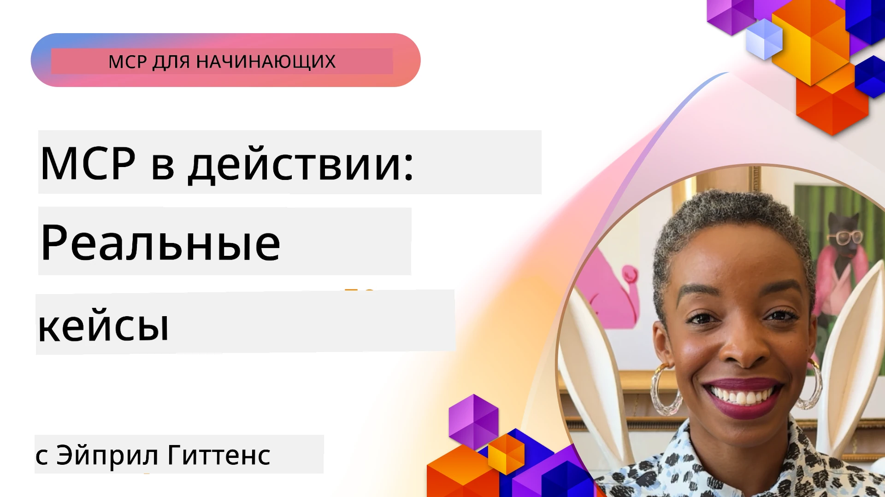

# MCP в действии: реальные кейсы

_(Нажмите на изображение выше, чтобы посмотреть видео урока)_

Протокол Контекста Модели (MCP) меняет способ взаимодействия AI-приложений с данными, инструментами и сервисами. В этом разделе представлены реальные кейсы, демонстрирующие практическое применение MCP в различных корпоративных сценариях.

## Обзор

В этом разделе показаны конкретные примеры реализации MCP, подчеркивающие, как организации используют этот протокол для решения сложных бизнес-задач. Изучая эти кейсы, вы получите представление о гибкости, масштабируемости и практических преимуществах MCP в реальных условиях.

## Основные цели обучения

Изучая эти кейсы, вы:

- Поймёте, как MCP можно применять для решения конкретных бизнес-проблем
- Узнаете о различных паттернах интеграции и архитектурных подходах
- Выделите лучшие практики внедрения MCP в корпоративной среде
- Получите представление о вызовах и решениях при реальных внедрениях
- Определите возможности применения подобных паттернов в своих проектах

## Избранные кейсы

### 1. [Azure AI Travel Agents – эталонная реализация](./travelagentsample.md)

В этом кейсе рассматривается комплексное эталонное решение Microsoft, демонстрирующее, как создать многопользовательское AI-приложение для планирования путешествий, используя MCP, Azure OpenAI и Azure AI Search. Проект включает:

- Многоагентную оркестрацию через MCP
- Интеграцию корпоративных данных с Azure AI Search
- Безопасную масштабируемую архитектуру на базе сервисов Azure
- Расширяемые инструменты с переиспользуемыми компонентами MCP
- Диалоговый пользовательский опыт благодаря Azure OpenAI

Архитектура и детали реализации дают ценные знания по созданию сложных многопользовательских систем с MCP в качестве координационного слоя.

### 2. [Обновление элементов Azure DevOps с помощью данных YouTube](./UpdateADOItemsFromYT.md)

Этот кейс демонстрирует практическое применение MCP для автоматизации рабочих процессов. Показано, как инструменты MCP можно использовать для:

- Извлечения данных с онлайн-платформ (YouTube)
- Обновления рабочих элементов в системах Azure DevOps
- Создания повторяемых автоматизированных процессов
- Интеграции данных между разрозненными системами

Этот пример показывает, как даже относительно простые реализации MCP могут существенно повысить эффективность, автоматизируя рутинные задачи и улучшая согласованность данных между системами.

### 3. [Получение документации в реальном времени с MCP](./docs-mcp/README.md)

В этом кейсе показано, как подключить Python консольный клиент к серверу Model Context Protocol (MCP) для получения и ведения журнала актуальной, контекстно-зависимой документации Microsoft в реальном времени. Вы узнаете, как:

- Подключиться к MCP-серверу с помощью Python клиента и официального MCP SDK
- Использовать HTTP-клиенты с потоковой передачей для эффективного получения данных в реальном времени
- Вызвать инструменты документации на сервере и записывать ответы прямо в консоль
- Внедрить актуальную документацию Microsoft в рабочий процесс без выхода из терминала

В главе представлен практический пример, минимальный рабочий пример кода и ссылки на дополнительные ресурсы для углубленного изучения. Полный разбор и код можно найти в связанной главе, чтобы понять, как MCP может преобразовать доступ к документации и повысить продуктивность разработчиков в средах с консольным интерфейсом.

### 4. [Интерактивное приложение для генерации учебного плана с MCP](./docs-mcp/README.md)

Этот кейс демонстрирует, как построить интерактивное веб-приложение с использованием Chainlit и Model Context Protocol (MCP) для генерации персонализированных учебных планов на любую тему. Пользователи могут указать предмет (например, "сертификация AI-900") и длительность обучения (например, 8 недель), а приложение предоставит разбивку по неделям с рекомендуемым содержимым. Chainlit обеспечивает диалоговый интерфейс, делающий опыт интерактивным и адаптивным.

- Диалоговое веб-приложение на базе Chainlit
- Запросы пользователя по теме и длительности обучения
- Рекомендации по содержимому по неделям с использованием MCP
- Адаптивные ответы в реальном времени в интерфейсе чата

Проект демонстрирует, как разговорный ИИ и MCP могут сочетаться для создания динамичных образовательных инструментов с пользовательским управлением в современной веб-среде.

### 5. [Документация в редакторе с MCP сервером в VS Code](./docs-mcp/README.md)

В этом кейсе показано, как встроить Microsoft Learn Docs прямо в среду VS Code с помощью MCP сервера — больше не нужно переключаться между вкладками браузера! Вы увидите, как:

- Мгновенно искать и читать документацию внутри VS Code через панель MCP или командную палитру
- Ссылаться на документацию и вставлять ссылки напрямую в README или markdown-файлы курсов
- Использовать GitHub Copilot и MCP вместе для бесшовных рабочих процессов с документацией и кодом
- Проверять и улучшать документацию с помощью обратной связи в реальном времени и точности от Microsoft
- Интегрировать MCP с GitHub workflows для непрерывной проверки документации

Реализация включает:

- Пример конфигурации `.vscode/mcp.json` для легкой настройки
- Пошаговые обзоры интерфейса в редакторе на скриншотах
- Советы по сочетанию Copilot и MCP для максимальной продуктивности

Этот сценарий идеально подходит для авторов курсов, технических писателей и разработчиков, которые хотят оставаться сосредоточенными в редакторе, работая с документацией, Copilot и инструментами проверки — всё на основе MCP.

### 6. [Создание MCP сервера с помощью APIM](./apimsample.md)

В этом кейсе приведено пошаговое руководство по созданию MCP сервера с использованием Azure API Management (APIM). Рассмотрено:

- Настройка MCP сервера в Azure API Management
- Открытие API операций в виде инструментов MCP
- Конфигурация политик ограничения скорости и безопасности
- Тестирование MCP сервера с помощью Visual Studio Code и GitHub Copilot

Этот пример показывает, как использовать возможности Azure для создания надежного MCP сервера, который можно применять в различных приложениях, улучшая интеграцию AI-систем с корпоративными API.

### 7. [GitHub MCP Registry — ускорение агентной интеграции](https://github.com/mcp)

В этом кейсе рассматривается GitHub MCP Registry, запущенный в сентябре 2025 года, который решает ключевую проблему в экосистеме ИИ: разрозненность и сложность обнаружения и развертывания серверов Model Context Protocol (MCP).

#### Обзор
**MCP Registry** решает проблему рассредоточенности MCP серверов по разным репозиториям и реестрам, что ранее замедляло и осложняло интеграцию. Эти серверы позволяют AI-агентам взаимодействовать с внешними системами, такими как API, базы данных и источники документации.

#### Проблематика
Разработчики агентных рабочих процессов сталкивались с несколькими проблемами:
- **Плохая обнаруживаемость** MCP серверов на разных платформах
- **Повторяющиеся вопросы по настройке** на форумах и в документации
- **Риски безопасности** из-за непроверенных и ненадежных источников
- **Отсутствие стандартов** качества и совместимости серверов

#### Архитектура решения
GitHub MCP Registry централизует проверенные MCP серверы с ключевыми функциями:
- **Установка в один клик** через VS Code для удобной настройки
- **Фильтрация по важности** по звездам, активности и проверке сообществом
- **Прямая интеграция** с GitHub Copilot и другими MCP-совместимыми инструментами
- **Открытая модель вклада** для сообщества и корпоративных партнеров

#### Влияние на бизнес
Реестр обеспечил измеримые улучшения:
- **Быстрый вход в систему** для разработчиков с помощью инструментов, таких как Microsoft Learn MCP Server, который транслирует официальную документацию в агенты
- **Повышение продуктивности** за счет специализированных серверов, например, `github-mcp-server`, для автоматизации GitHub на естественном языке (создание PR, повторные запуски CI, сканирование кода)
- **Рост доверия экосистемы** благодаря кураторским спискам и прозрачным стандартам конфигурации

#### Стратегическая ценность
Для специалистов по управлению жизненным циклом агентов и воспроизводимым рабочим процессам MCP Registry предлагает:
- **Модульное развертывание агентов** с использованием стандартизированных компонентов
- **Пайплайны оценки на основе реестра** для последовательного тестирования и валидации
- **Межинструментальную совместимость** для бесшовной интеграции между различными AI платформами

Этот кейс демонстрирует, что MCP Registry — это не просто каталог, а основополагающая платформа для масштабируемой интеграции моделей и развертывания агентных систем в реальном мире.

### 8. [Публикация в соцсетях через агента](./publora-social-publishing.md)

В этом кейсе показан **записывающий удалённый MCP сервер** — сервер, инструменты которого выполняют необратимые действия от имени пользователя — на примере публикации в соцсетях. Агент создаёт пост, человек его утверждает, а сервер планирует публикацию в разных сетях.

Интересны ограничения дизайна, которые накладывает публикация, и которые применимы к любому серверу, пишущему данные вместо их чтения:

- **Открытое обнаружение, аутентифицированное выполнение** — `tools/list` отвечает без учётных данных, чтобы реестры и клиенты могли изучать возможности, в то время как каждый `tools/call` требует токен и иначе возвращает `401` с заголовком `WWW-Authenticate`
- **Регистрация OAuth без шага вне канала** — сегодня динамическая регистрация клиентов, с метаданными Client ID как направление, указанное спецификацией `2026-07-28`
- **Аннотации инструментов** (`readOnlyHint`, `destructiveHint`, `idempotentHint`), которые клиенты используют для решения, что подтверждать — подсказки, а не жёсткие правила, и то, что теперь ожидается каталогами коннекторов при обзоре
- **Невыдумываемые идентификаторы**, чтобы ложные значения вызывали явную ошибку, а не действовали как правдоподобные
- **Ключи идемпотентности на инструментах создания постов**, чтобы повторные попытки агента не приводили к дублированию публикаций
- **Цель без операции, описанная в схеме инструмента**, которая проверяет весь путь записи без публикации, для проверяющих и CI

Глава завершается кратким контрольным списком для применения при построении сервера.

## Заключение

Эти восемь масштабных кейсов демонстрируют выдающуюся универсальность и практическое применение протокола Model Context Protocol в разнообразных реальных сценариях. От сложных систем многопользовательского планирования путешествий и корпоративного управления API до оптимизации рабочих процессов с документацией и революционного GitHub MCP Registry — эти примеры показывают, как MCP обеспечивает стандартизированный, масштабируемый способ соединения AI-систем с необходимыми им инструментами, данными и сервисами для создания исключительной ценности.

Кейсы охватывают несколько аспектов реализации MCP:
- **Корпоративная интеграция**: Azure API Management и автоматизация Azure DevOps
- **Оркестрация многопользовательских агентов**: планирование путешествий с координацией AI-агентов
- **Продуктивность разработчиков**: интеграция VS Code и доступ к документации в реальном времени
- **Развитие экосистемы**: GitHub MCP Registry как основополагающая платформа
- **Образовательные приложения**: генераторы учебных планов и диалоговые интерфейсы

Изучая эти реализации, вы получите важные знания о:
- **Архитектурных паттернах** для разных масштабов и сценариев использования
- **Стратегиях реализации**, балансирующих между функциональностью и поддерживаемостью
- **Требованиях безопасности и масштабируемости** для производственных развертываний
- **Лучших практиках** разработки MCP серверов и интеграции клиентов
- **Мысли об экосистеме** для создания взаимосвязанных решений на базе AI

Все эти примеры вместе показывают, что MCP — это не просто теоретическая концепция, а зрелый, готовый к промышленному использованию протокол, позволяющий создавать практические решения сложных бизнес-задач. Независимо от того, строите ли вы простые инструменты автоматизации или сложные многопользовательские системы, паттерны и подходы, показанные здесь, обеспечат надежную основу для ваших проектов MCP.

## Дополнительные ресурсы

- [GitHub репозиторий Azure AI Travel Agents](https://github.com/Azure-Samples/azure-ai-travel-agents)
- [Инструмент MCP для Azure DevOps](https://github.com/microsoft/azure-devops-mcp)
- [Инструмент MCP для Playwright](https://github.com/microsoft/playwright-mcp)
- [MCP сервер Microsoft Docs](https://github.com/MicrosoftDocs/mcp)
- [GitHub MCP Registry — ускорение агентной интеграции](https://github.com/mcp)
- [Примеры сообщества MCP](https://github.com/microsoft/mcp)

## Что дальше

- Предыдущая: [Модуль 8: Лучшие практики](../08-BestPractices/README.md)
- Следующая: [Модуль 10: Оптимизация AI рабочих процессов: создание MCP сервера с AI Toolkit](../10-StreamliningAIWorkflowsBuildingAnMCPServerWithAIToolkit/README.md)

---

<!-- CO-OP TRANSLATOR DISCLAIMER START -->
**Отказ от ответственности**:
Этот документ был переведен с использованием сервиса машинного перевода [Co-op Translator](https://github.com/Azure/co-op-translator). Несмотря на наши усилия по обеспечению точности, имейте в виду, что автоматический перевод может содержать ошибки или неточности. Оригинальный документ на его исходном языке следует считать авторитетным источником. Для получения критически важной информации рекомендуется обратиться к профессиональному человеческому переводу. Мы не несем ответственности за любые недоразумения или неправильные толкования, возникшие в результате использования этого перевода.
<!-- CO-OP TRANSLATOR DISCLAIMER END -->