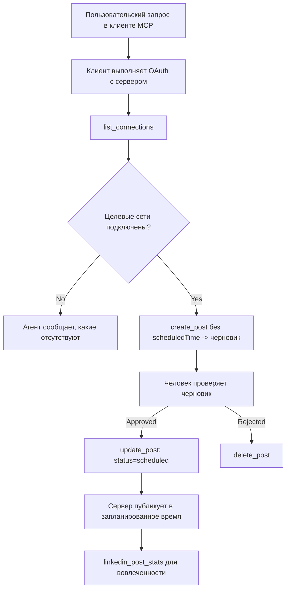

# Исследование: Публикация в социальные сети через агента с удалённым MCP сервером

> **Отказ от ответственности:** Существует множество сервисов и проектов с открытым исходным кодом, которые могут публиковать записи в социальные сети, и команда также может напрямую интегрировать API каждой сети. Ниже приведён один из примеров, как можно спроектировать и использовать **удалённый MCP сервер с возможностью записи**. Publora — это коммерческий сервис с бесплатным тарифом; описанные здесь шаблоны применимы к любому MCP серверу, который выполняет необратимые действия от имени пользователя.

## Обзор

Агенты хороши в составлении контента, но слабы в его публикации. Модель может за секунды написать анонс релиза, и на этом работа заканчивается: публикация требует API для каждой сети, OAuth-приложение для каждой сети и разных правил для медиа для каждой из них. Большинство команд решают эту задачу путем ручного копирования текста в браузер.

В этом исследовании рассматривается, как последний шаг закрывается с помощью одного удалённого MCP сервера, и — что полезнее для тех, кто строит такой сервер — какие решения по дизайну должен правильно принять **сервер с возможностью записи**. Чтение данных прощает ошибки. Публикация — нет: неправильный вызов инструмента виден аудитории и не может быть отменён.

## Сценарий

Небольшая команда по связям с разработчиками составляет посты внутри агента (Claude, VS Code, Cursor — клиент не имеет значения). Они хотят, чтобы агент мог:

- видеть, какие социальные аккаунты команда подключила,
- создавать черновик поста и хранить его до одобрения человеком,
- прикреплять изображение,
- планировать публикацию в нескольких сетях в выбранное время,
- и позже получать отчёты об эффективности.

Важно, что агент *не должен* иметь возможность случайно опубликовать пост, пока команда ещё экспериментирует.

## Используемые инструменты

- [Publora MCP Server](https://github.com/publora/mcp-server) — удалённый MCP сервер (`streamable-http`), предоставляющий функции публикации, планирования, управления медиа и аналитики LinkedIn. Зарегистрирован в официальном реестре MCP как `com.publora/mcp-server`.

## Пошаговый рабочий процесс

1. **Подключение сервера.** Клиенты, поддерживающие OAuth, проходят авторизацию с кодом и PKCE на экране согласия сервера; клиенты без интерфейса, например CLI, используют API-ключ Publora в заголовке. Оба пути поддерживаются; какой используется — зависит от клиента, а не от сервера.
2. **Список подключений.** Агент вызывает `list_connections` и получает список подключённых аккаунтов с их идентификаторами.
3. **Создание черновика.** Агент вызывает `create_post` *без* времени публикации. Пост сохраняется как черновик — ничего не публикуется.
4. **Прикрепление медиа.** Публичные URL изображений передаются в том же запросе; сервер скачивает и проверяет их.
5. **Планирование.** После одобрения человеком `update_post` меняет статус на запланированный с указанным временем в формате ISO 8601.
6. **Измерение.** Для LinkedIn метод `linkedin_post_stats` возвращает данные об вовлечённости после публикации поста.

## Пример запроса

```text
Which social accounts do I have connected?
Draft a post announcing our new changelog page, attach the screenshot at
https://example.com/changelog.png, and keep it as a draft — do not publish it.
Once I approve, schedule it to LinkedIn and Bluesky for tomorrow at 09:00 UTC.
```

## Диаграмма Mermaid



## Техническая реализация

Следующие уроки можно перенести в другие проекты — это наиболее важное в данном исследовании.

### Открытое обнаружение, аутентифицированное выполнение

`tools/list` доступен без учётных данных; каждый `tools/call` требует токен и иначе возвращает `401` с заголовком `WWW-Authenticate`, указывающим на метаданные защищённого ресурса. (Сервер также отвечает на неаутентифицированный `initialize`, что важно только для клиентов до версии протокола `2026-07-28`; в этой ревизии рукопожатие было полностью убрано.)

Это разделение важно на практике. Реестры, каталоги и клиенты могут интроспектировать набор инструментов — имена, схемы, аннотации — без секретов, но *выполнить* что-либо анонимно нельзя. Сервер, требующий токен для `initialize`, по сути невидим для инструментов; сервер, допускающий анонимные `tools/call`, — уязвимость.

### Регистрация: динамическая регистрация клиента и что её заменит

Сервер объявляет `/.well-known/oauth-protected-resource` и `/.well-known/oauth-authorization-server`, поддерживает авторизацию с кодом и PKCE (`S256`), рефреш-токены и **динамическую регистрацию клиентов**.

Динамическая регистрация убирает ручной шаг: без неё каждый клиент требует заранее выданный `client_id`, что означает внеполосный запрос к вендору для каждого нового клиента.

Рассматривайте это как поведение для совместимости, а не конечный дизайн. Ревизия спецификации от `2026-07-28` объявляет динамическую регистрацию устаревшей в пользу документов метаданных Client ID, где клиент размещает метаданные по стабильному HTTPS URL, и этот URL *есть* `client_id`. DCR работает пока, но сервер, создаваемый сегодня, должен планировать CIMD и оставить DCR только для старых клиентов.

### Аннотации инструментов — не декорация

Каждый инструмент содержит `title` и подсказки: `readOnlyHint`, `destructiveHint`, `idempotentHint`, `openWorldHint`.

Два объяснения, почему в них стоит вкладываться. Первое — клиенты используют подсказки для решения, что подтверждать с пользователем — можно автоматически запускать только чтение и остановиться за подтверждением перед удалением. Спецификация чётко говорит, что аннотации — это ненадежные подсказки, а не механизм авторизации: они формируют, что клиент предлагает сделать, не блокируют сервер, а сервер всё равно должен применять свои правила. Второе — крупные каталоги коннекторов теперь *требуют* их для ревью; сервер без названий инструментов и подсказок будет отклонён, независимо от качества работы.

### Сделайте идентификаторы невыдумываемыми

Идентификаторы платформ — это непрозрачные строки, возвращаемые `list_connections`, и схема явно говорит, что их нужно копировать дословно и никогда не угадывать. Сервер отвергает всё остальное.

Модели склонны к угадыванию. Любой сервер с возможностью записи должен предполагать, что идентификатор рано или поздно будет выдуман, и делать эту ошибку заметной и быстрой, а не работать с похожим значением.

### Ошибка до публикации с понятным сообщением

Некоторые соцсети не принимают посты только с текстом и требуют изображение или видео. Это проверяется при планировании, и ошибка указывает платформу и недостающие требования.

Агент может исправить ошибку "Instagram требует медиа — прикрепите изображение или видео" без дополнительного обращения. Он не сможет восстановиться после общей ошибки `400`.

### Обеспечьте безопасные повторные попытки

Два инструмента, создающих контент — `create_post` и `update_post` — принимают ключ идемпотентности: повторный вызов с тем же ключом и идентичным запросом возвращает исходный ответ вместо создания второго поста. Агенты повторяют запросы при таймаутах; без идемпотентности медленный ответ приводит к дублированию публикации. Другие инструменты записи — удаления, операции с медиа, реакции и комментарии LinkedIn — такой ключ не принимают, повторение там не гарантированно безопасно. Стоит знать, какие изменения защищены, а какие нет.

### Предоставьте способ тестировать публикацию без отправки

Сервер принимает зарезервированную цель `publora-playground`, которая проверяется и подтверждается, как настоящая, а затем игнорируется — ничего не публикуется на живой аккаунт. Это описано в самой схеме инструмента, её может прочитать любой клиент без учетных данных: поле `platforms` в `create_post` документирует её как "цель для теста подключения, не требующая реального подключения — пост подтверждается и отбрасывается, ничего не публикуется". Чтобы вызвать её, передайте единственный элемент: `platforms: ["publora-playground"]`.

Это оказалось одним из самых полезных деталей всей поверхности. Рецензенты каталогов коннекторов, их участники и CI могут полностью пройти путь записи без риска для реальной аудитории. Любой MCP сервер с необратимыми действиями выигрывает от задокументированной цели no-op.

## Результаты и влияние

- Шаг публикации переместился из браузера в тот же диалог, где создаётся контент, а привычка работать через черновик удерживает человека в цикле. Будьте точны, что именно это значит: черновик — это соглашение, а не граница. Одни и те же учётные данные могут планировать или публиковать, так что реальный контроль одобрения нужно реализовывать вне интерфейса — отдельные учетные данные или слой политики перед сервером.
- Различия по сетям — требования к медиа, ветвления, управление ответами — теперь обрабатываются единожды на сервере, а не в каждом агенте.
- Один и тот же сервер поддерживает несколько клиентов MCP без работы под каждого, потому что обнаружение открытое, а регистрация динамическая.
- Перечисленные ограничения дизайна формировались не только пользователями, но и рецензентами каталогов: аннотации, OAuth и безопасная тестовая цель требовались хотя бы одним из них.

## Ресурсы

- [Publora MCP Server (исходный код)](https://github.com/publora/mcp-server)
- [Документация Publora API и MCP](https://docs.publora.com)
- [Запись в реестре MCP: `com.publora/mcp-server`](https://registry.modelcontextprotocol.io/v0/servers?search=com.publora/mcp-server)
- [Спецификация MCP — Авторизация](https://modelcontextprotocol.io/specification/draft/basic/authorization)
- [Спецификация MCP — Аннотации инструментов](https://modelcontextprotocol.io/docs/concepts/tools)

## Что дальше

- Возьмите MCP сервер, который вы строите, и проверьте три самых дешевых улучшения здесь: аннотации для каждого инструмента, ключ идемпотентности для каждой записи и задокументированную цель no-op.
- Попробуйте разделение открытого обнаружения: вызовите `tools/list` на публичном удалённом сервере без учётных данных, затем вызовите инструмент и посмотрите `401` с вызовом к аутентификации.
- Подумайте, что значит "отмена" для вашей области. Публикация включает черновики и удаление; если для ваших операций нет аналога, подтверждение должно быть в дизайне инструмента, а не в подсказке.

---

<!-- CO-OP TRANSLATOR DISCLAIMER START -->
**Отказ от ответственности**:
Этот документ был переведен с использованием сервиса машинного перевода [Co-op Translator](https://github.com/Azure/co-op-translator). Несмотря на наши усилия по обеспечению точности, имейте в виду, что автоматический перевод может содержать ошибки или неточности. Оригинальный документ на его исходном языке следует считать авторитетным источником. Для получения критически важной информации рекомендуется обратиться к профессиональному человеческому переводу. Мы не несем ответственности за любые недоразумения или неправильные толкования, возникшие в результате использования этого перевода.
<!-- CO-OP TRANSLATOR DISCLAIMER END -->