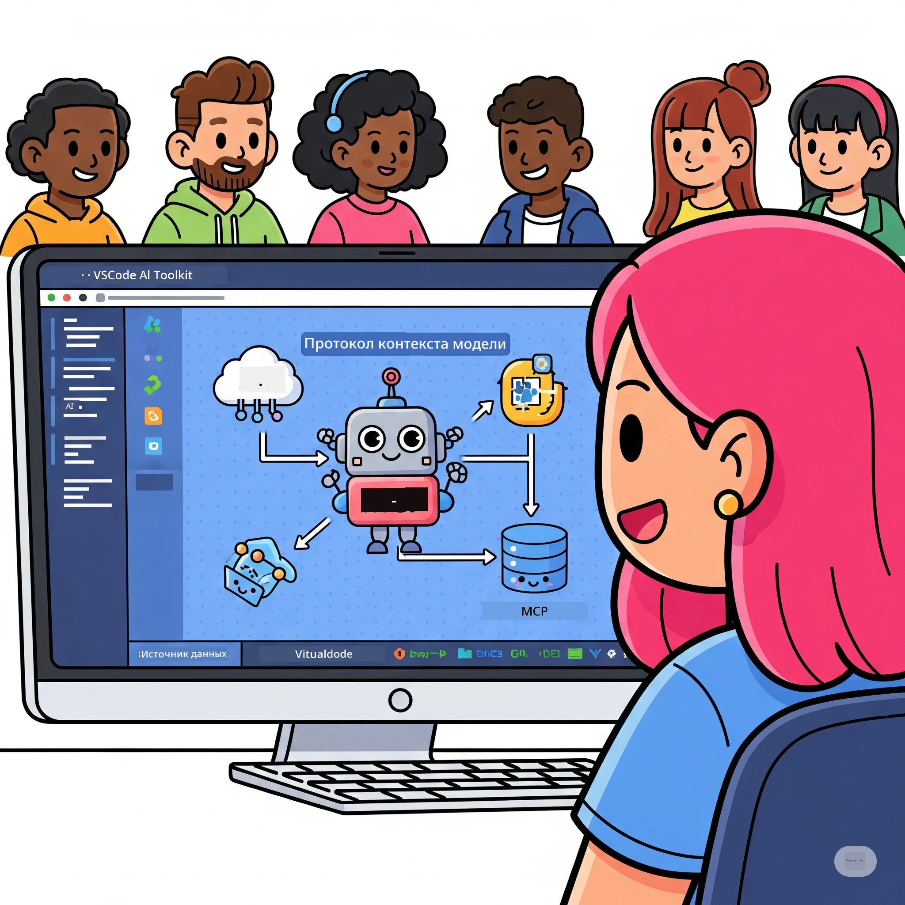
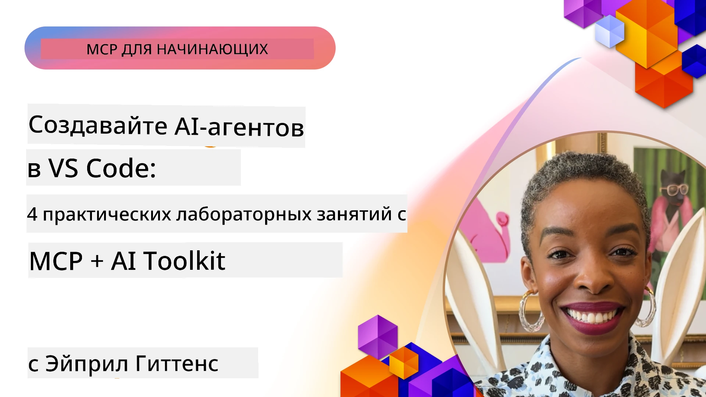

# Оптимизация рабочих процессов ИИ: создание MCP-сервера с помощью Microsoft Foundry Toolkit

## 🎯 Обзор

_(Нажмите на изображение выше, чтобы посмотреть видео по этому уроку)_

Добро пожаловать на **Практический семинар Model Context Protocol (MCP)**! Этот комплексный практический семинар объединяет две передовые технологии, чтобы революционизировать разработку приложений ИИ:

> **Примечание о совместимости:** код семинара был создан и протестирован с MCP
> `2025-11-25`, как указано на значке выше. Используйте
> [актуальную спецификацию `2026-07-28`](https://modelcontextprotocol.io/specification/2026-07-28/)
> для новых реализаций протокола и обязательно ознакомьтесь с заметками по выпуску SDK перед
> миграцией лабораторий.

- **🔗 Model Context Protocol (MCP)**: Открытый стандарт для бесшовной интеграции инструментов ИИ
- **🛠️ Расширение Microsoft Foundry Toolkit для VS Code**: Мощное расширение Microsoft для разработки ИИ

### 🎓 Чему вы научитесь

К концу этого семинара вы овладеете искусством создания интеллектуальных приложений, которые связывают модели ИИ с реальными инструментами и сервисами. От автоматизированного тестирования до пользовательских интеграций API — вы приобретете практические навыки для решения сложных бизнес-задач.

## 🏗️ Технологический стек

### 🔌 Model Context Protocol (MCP)

MCP — это **«USB-C для ИИ»** — универсальный стандарт, который связывает модели ИИ с внешними инструментами и источниками данных.

**✨ Ключевые особенности:**

- 🔄 **Стандартизированная интеграция**: Универсальный интерфейс для подключения инструментов ИИ
- 🏛️ **Гибкая архитектура**: Локальные и удалённые серверы через транспорт stdio/SSE
- 🧰 **Богатая экосистема**: Инструменты, подсказки и ресурсы в рамках одного протокола
- 🔒 **Готовность для предприятий**: Встроенная безопасность и надёжность

**🎯 Почему MCP важен:**
Как USB-C устранил путаницу с кабелями, так MCP убирает сложности интеграции ИИ. Один протокол — бесконечные возможности.

### 🤖 Расширение Microsoft Foundry Toolkit для VS Code

Флагманское расширение Microsoft для разработки ИИ, которое превращает VS Code в мощную платформу для ИИ.

**🚀 Основные возможности:**

- 📦 **Каталог моделей**: Доступ к моделям из Azure AI, GitHub, Hugging Face, Ollama
- ⚡ **Локальный вывод**: Оптимизированное выполнение ONNX на CPU/GPU/NPU
- 🏗️ **Конструктор агентов**: Визуальная разработка агентов ИИ с интеграцией MCP
- 🎭 **Мультимодальный**: Поддержка текста, зрения и структурированного вывода

**💡 Преимущества разработки:**

- Развёртывание моделей без настройки
- Визуальная инженерия подсказок
- Площадка для тестирования в реальном времени
- Бесшовная интеграция с MCP-сервером

## 📚 Учебный путь

### [🚀 Модуль 1: Основы Microsoft Foundry Toolkit](./lab1/README.md)

**Длительность**: 15 минут

- 🛠️ Установите и настройте Microsoft Foundry Toolkit для VS Code
- 🗂️ Изучите Каталог моделей (100+ моделей с GitHub, ONNX, OpenAI, Anthropic, Google)
- 🎮 Овладейте Интерактивной площадкой для тестирования моделей в реальном времени
- 🤖 Создайте своего первого агента ИИ с помощью Конструктора агентов
- 📊 Оцените производительность моделей с помощью встроенных метрик (F1, релевантность, схожесть, связность)
- ⚡ Узнайте возможности пакетной обработки и поддержки мультимодальности

**🎯 Результат обучения**: Создать функционального AI-агента с полным пониманием возможностей Microsoft Foundry Toolkit

### [🌐 Модуль 2: MCP с основами Microsoft Foundry Toolkit](./lab2/README.md)

**Длительность**: 20 минут

- 🧠 Овладейте архитектурой и концепциями Model Context Protocol (MCP)
- 🌐 Исследуйте экосистему MCP-серверов Microsoft
- 🤖 Создайте агента для автоматизации браузера с использованием Playwright MCP-сервера
- 🔧 Интегрируйте MCP-серверы с Конструктором агентов Microsoft Foundry Toolkit
- 📊 Настройте и протестируйте инструменты MCP внутри своих агентов
- 🚀 Экспортируйте и внедряйте агентов с поддержкой MCP для производственного использования

**🎯 Результат обучения**: Развёртывание AI-агента с расширенными возможностями внешних инструментов через MCP

### [🔧 Модуль 3: Продвинутая разработка MCP с Microsoft Foundry Toolkit](./lab3/README.md)

**Длительность**: 20 минут

- 💻 Создайте пользовательские MCP-серверы с Microsoft Foundry Toolkit
- 🐍 Настройте и используйте последнюю версию MCP Python SDK (v1.9.3)
- 🔍 Выполните настройку и использование MCP Inspector для отладки
- 🛠️ Постройте MCP-сервер Погоды с профессиональными рабочими процессами отладки
- 🧪 Отлаживайте MCP-серверы как в Конструкторе агентов, так и в Inspector

**🎯 Результат обучения**: Разработка и отладка пользовательских MCP-серверов с современными инструментами

### [🐙 Модуль 4: Практическая разработка MCP - пользовательский сервер GitHub Clone](./lab4/README.md)

**Длительность**: 30 минут

- 🏗️ Постройте MCP-сервер GitHub Clone для реальных рабочих процессов разработки
- 🔄 Реализуйте умное клонирование репозиториев с проверкой и обработкой ошибок
- 📁 Создайте интеллектуальное управление директориями и интеграцию с VS Code
- 🤖 Используйте режим агента GitHub Copilot с пользовательскими инструментами MCP
- 🛡️ Применяйте надёжность готового к производству и кроссплатформенную совместимость

**🎯 Результат обучения**: Развёртывание MCP-сервера, готового к работе в продакшене, который оптимизирует реальные рабочие процессы разработки

## 💡 Примеры реального применения и влияние

### 🏢 Корпоративные сценарии использования

#### 🔄 Автоматизация DevOps

Преобразуйте ваш процесс разработки с помощью интеллектуальной автоматизации:

- **Умное управление репозиториями**: AI-управляемый код-ревью и решения о слиянии
- **Интеллектуальные CI/CD**: Автоматизированная оптимизация пайплайнов на основе изменений кода
- **Триаж задач**: Автоматическая классификация и назначение багов

#### 🧪 Революция в контроле качества

Повышайте качество тестирования с помощью ИИ-автоматизации:

- **Интеллектуальная генерация тестов**: Автоматическое создание комплексных тестовых наборов
- **Визуальное регрессионное тестирование**: Обнаружение изменений UI с помощью ИИ
- **Мониторинг производительности**: Проактивное выявление и решение проблем

#### 📊 Интеллектуальность потоков данных

Создавайте умные рабочие процессы обработки данных:

- **Адаптивные ETL-процессы**: Самооптимизирующиеся преобразования данных
- **Обнаружение аномалий**: Мониторинг качества данных в реальном времени
- **Интеллектуальная маршрутизация**: Умное управление потоками данных

#### 🎧 Улучшение опыта клиентов

Создавайте исключительные взаимодействия с клиентами:

- **Поддержка с учётом контекста**: AI-агенты с доступом к истории клиентов
- **Проактивное решение проблем**: Предиктивное обслуживание клиентов
- **Мультиканальная интеграция**: Единый AI-опыт на всех платформах

## 🛠️ Требования и настройка

### 💻 Системные требования

| Компонент | Требование | Примечания |
|-----------|-------------|-----------|
| **Операционная система** | Windows 10+, macOS 10.15+, Linux | Любая современная ОС |
| **Visual Studio Code** | Последняя стабильная версия | Требуется для Microsoft Foundry Toolkit |
| **Node.js** | v18.0+ и npm | Для разработки MCP-серверов |
| **Python** | 3.10+ | По желанию для Python MCP-серверов |
| **Память** | минимум 8 ГБ ОЗУ | Рекомендуется 16 ГБ для локальных моделей |

### 🔧 Среда разработки

#### Рекомендуемые расширения для VS Code

- **Microsoft Foundry Toolkit** (ms-windows-ai-studio.windows-ai-studio)
- **Python** (ms-python.python)
- **Отладчик Python** (ms-python.debugpy)
- **GitHub Copilot** (GitHub.copilot) — необязательно, но полезно

#### Дополнительные инструменты

- **uv**: Современный менеджер пакетов Python
- **MCP Inspector**: Визуальный инструмент отладки MCP-серверов
- **Playwright**: Для примеров веб-автоматизации

## 🎖️ Результаты обучения и путь сертификации

### 🏆 Список ключевых навыков

После завершения этого семинара вы достигнете мастерства в:

#### 🎯 Основные компетенции

- [ ] **Мастерство протокола MCP**: Глубокое понимание архитектуры и паттернов реализации
- [ ] **Профессиональное владение Microsoft Foundry Toolkit**: Экспертное использование для быстрой разработки
- [ ] **Разработка пользовательских серверов**: Создание, развертывание и поддержка MCP-серверов в продакшене
- [ ] **Отличное интегрирование инструментов**: Беспроблемное связывание ИИ с существующими рабочими процессами разработки
- [ ] **Применение для решения задач**: Использование изученных навыков для реальных бизнес-задач

#### 🔧 Технические навыки

- [ ] Настройка и конфигурация Microsoft Foundry Toolkit в VS Code
- [ ] Проектирование и реализация пользовательских MCP-серверов
- [ ] Интеграция моделей GitHub с архитектурой MCP
- [ ] Создание автоматизированных рабочих процессов тестирования с Playwright
- [ ] Внедрение AI-агентов для производственного использования
- [ ] Отладка и оптимизация производительности MCP-сервера

#### 🚀 Продвинутые возможности

- [ ] Архитектура интеграций ИИ корпоративного уровня
- [ ] Реализация лучших практик безопасности для AI-приложений
- [ ] Проектирование масштабируемых архитектур MCP-серверов
- [ ] Создание пользовательских цепочек инструментов для конкретных доменов
- [ ] Наставничество по развитию AI-ориентированных разработок

## 📖 Дополнительные ресурсы

- [Спецификация MCP (2026-07-28)](https://modelcontextprotocol.io/specification/2026-07-28/)
- [Репозиторий Microsoft Foundry Toolkit на GitHub](https://github.com/microsoft/vscode-ai-toolkit)
- [Коллекция примерных MCP-серверов](https://github.com/modelcontextprotocol/servers)
- [Руководство с лучшими практиками](https://modelcontextprotocol.io/docs/best-practices)
- [OWASP MCP Топ-10](https://microsoft.github.io/mcp-azure-security-guide/mcp/) — лучшие практики безопасности

---

**🚀 Готовы революционизировать процесс разработки ИИ?**

Давайте вместе создадим будущее интеллектуальных приложений с MCP и Microsoft Foundry Toolkit!

## Что дальше

Продолжить к: [Модуль 11: Практические лаборатории серверов MCP](../11-MCPServerHandsOnLabs/README.md)

---

<!-- CO-OP TRANSLATOR DISCLAIMER START -->
**Отказ от ответственности**:
Этот документ был переведен с использованием сервиса машинного перевода [Co-op Translator](https://github.com/Azure/co-op-translator). Несмотря на наши усилия по обеспечению точности, имейте в виду, что автоматический перевод может содержать ошибки или неточности. Оригинальный документ на его исходном языке следует считать авторитетным источником. Для получения критически важной информации рекомендуется обратиться к профессиональному человеческому переводу. Мы не несем ответственности за любые недоразумения или неправильные толкования, возникшие в результате использования этого перевода.
<!-- CO-OP TRANSLATOR DISCLAIMER END -->