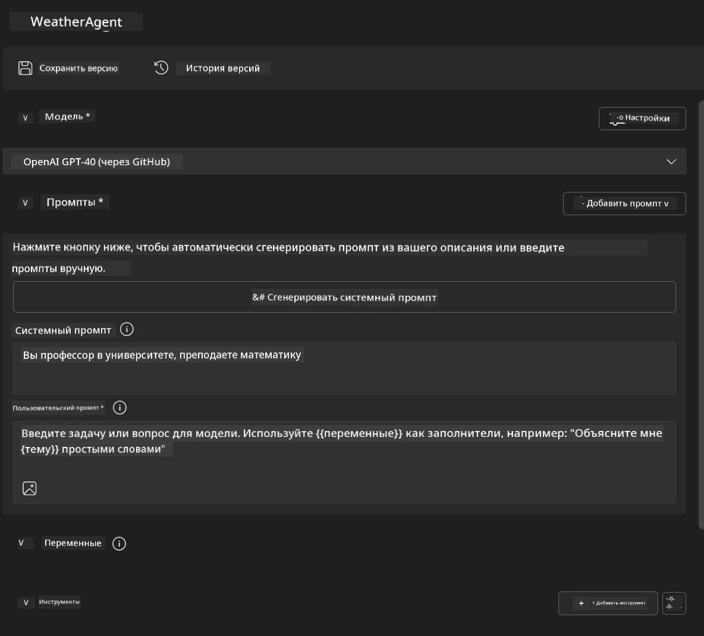
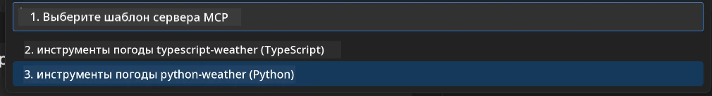
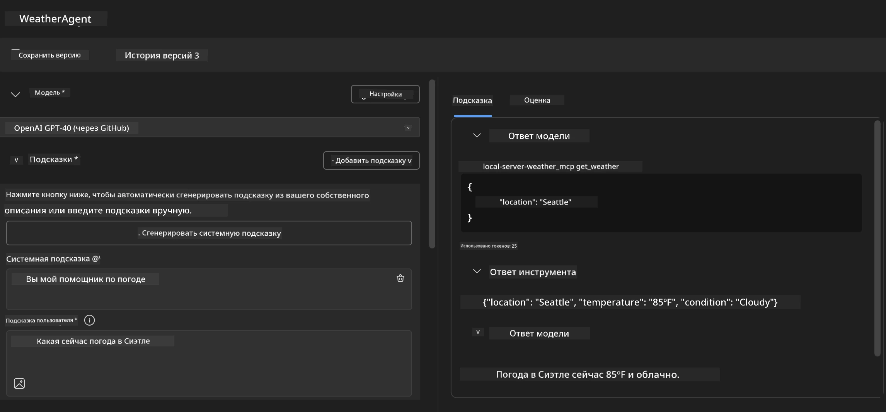
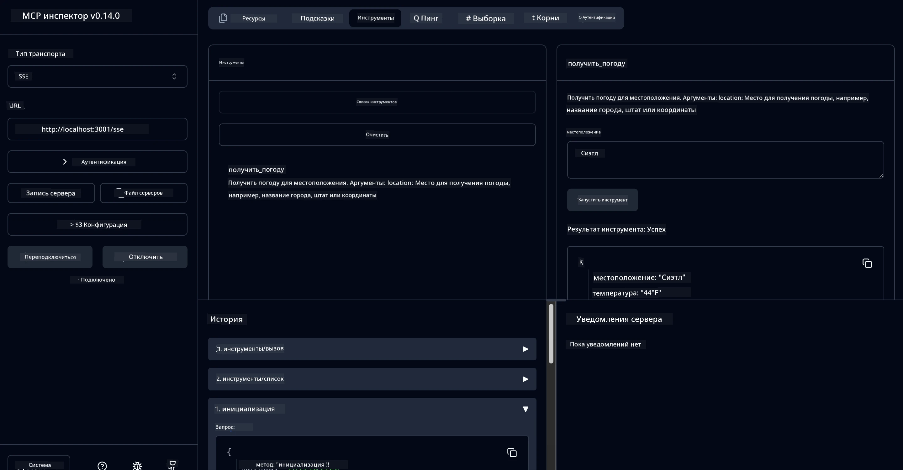

# 🔧 Модуль 3: Продвинутая разработка MCP с Microsoft Foundry Toolkit

> [!NOTE]
> URL инспектора в этой лабораторной работе используют устаревший эндпоинт `/sse` и нацелены на
> закрепленные зависимости MCP SDK `1.9.3` и Inspector `0.14.0`. Это не
> актуальные примеры Streamable HTTP от `2026-07-28`.


## 🎯 Цели обучения

К концу этой лабораторной работы вы сможете:

- ✅ Создавать пользовательские MCP серверы с использованием Microsoft Foundry Toolkit
- ✅ Настраивать и использовать последнюю версию MCP Python SDK (v1.9.3)
- ✅ Настраивать и использовать MCP Inspector для отладки
- ✅ Отлаживать MCP серверы как в Agent Builder, так и в Inspector
- ✅ Понимать продвинутые рабочие процессы разработки MCP серверов

## 📋 Предварительные требования

- Завершенная Лабораторная работа 2 (Основы MCP)
- Установленный VS Code с расширением Microsoft Foundry Toolkit
- Среда Python 3.10+
- Node.js и npm для настройки Inspector

## 🏗️ Что вы построите

В этой лабораторной работе вы создадите **Weather MCP Server**, который демонстрирует:
- Пользовательскую реализацию MCP сервера
- Интеграцию с Microsoft Foundry Toolkit Agent Builder
- Профессиональные рабочие процессы отладки
- Современные шаблоны использования MCP SDK

---

## 🔧 Обзор основных компонентов

### 🐍 MCP Python SDK
Python SDK протокола Model Context Protocol предоставляет основу для создания пользовательских MCP серверов. Вы будете использовать версию 1.9.3 с расширенными возможностями отладки.

### 🔍 MCP Inspector
Мощный инструмент отладки, который предоставляет:
- Мониторинг сервера в реальном времени
- Визуализацию выполнения инструментов
- Инспекцию сетевых запросов/ответов
- Интерактивную среду тестирования

---

## 📖 Пошаговая реализация

### Шаг 1: Создайте WeatherAgent в Agent Builder

1. **Запустите Agent Builder** в VS Code через расширение Microsoft Foundry Toolkit
2. **Создайте нового агента** с следующими настройками:
   - Имя агента: `WeatherAgent`



### Шаг 2: Инициализация проекта MCP сервера

1. **Перейдите в Инструменты** → **Добавить инструмент** в Agent Builder
2. **Выберите "MCP Server"** из доступных вариантов
3. **Выберите "Создать новый MCP сервер"**
4. **Выберите шаблон `python-weather`**
5. **Назовите ваш сервер:** `weather_mcp`



### Шаг 3: Откройте и изучите проект

1. **Откройте сгенерированный проект** в VS Code
2. **Просмотрите структуру проекта:**
   ```
   weather_mcp/
   ├── src/
   │   ├── __init__.py
   │   └── server.py
   ├── inspector/
   │   ├── package.json
   │   └── package-lock.json
   ├── .vscode/
   │   ├── launch.json
   │   └── tasks.json
   ├── pyproject.toml
   └── README.md
   ```

### Шаг 4: Обновление до последней версии MCP SDK

> **🔍 Почему обновлять?** Мы хотим использовать последнюю версию MCP SDK (v1.9.3) и сервис Inspector (0.14.0) для расширенных возможностей и лучшей отладки.

#### 4a. Обновление зависимостей Python

**Отредактируйте `pyproject.toml`:** обновите [./code/weather_mcp/pyproject.toml](../../../../10-StreamliningAIWorkflowsBuildingAnMCPServerWithAIToolkit/lab3/code/weather_mcp/pyproject.toml)


#### 4b. Обновление конфигурации Inspector

**Отредактируйте `inspector/package.json`:** обновите [./code/weather_mcp/inspector/package.json](../../../../10-StreamliningAIWorkflowsBuildingAnMCPServerWithAIToolkit/lab3/code/weather_mcp/inspector/package.json)

#### 4c. Обновление зависимостей Inspector

**Отредактируйте `inspector/package-lock.json`:** обновите [./code/weather_mcp/inspector/package-lock.json](../../../../10-StreamliningAIWorkflowsBuildingAnMCPServerWithAIToolkit/lab3/code/weather_mcp/inspector/package-lock.json)

> **📝 Примечание:** Этот файл содержит обширные определения зависимостей. Ниже приведена основная структура — полный контент обеспечивает правильное разрешение зависимостей.


> **⚡ Полный package-lock:** Полный package-lock.json содержит ~3000 строк определений зависимостей. Выше показана ключевая структура — используйте предоставленный файл для полного разрешения зависимостей.

### Шаг 5: Настройка отладки в VS Code

*Примечание: Пожалуйста, скопируйте файл в указанном пути, чтобы заменить соответствующий локальный файл*

#### 5a. Обновление конфигурации запуска

**Отредактируйте `.vscode/launch.json`:**

```json
{
  "version": "0.2.0",
  "configurations": [
    {
      "name": "Attach to Local MCP",
      "type": "debugpy",
      "request": "attach",
      "connect": {
        "host": "localhost",
        "port": 5678
      },
      "presentation": {
        "hidden": true
      },
      "internalConsoleOptions": "neverOpen",
      "postDebugTask": "Terminate All Tasks"
    },
    {
      "name": "Launch Inspector (Edge)",
      "type": "msedge",
      "request": "launch",
      "url": "http://localhost:6274?timeout=60000&serverUrl=http://localhost:3001/sse#tools",
      "cascadeTerminateToConfigurations": [
        "Attach to Local MCP"
      ],
      "presentation": {
        "hidden": true
      },
      "internalConsoleOptions": "neverOpen"
    },
    {
      "name": "Launch Inspector (Chrome)",
      "type": "chrome",
      "request": "launch",
      "url": "http://localhost:6274?timeout=60000&serverUrl=http://localhost:3001/sse#tools",
      "cascadeTerminateToConfigurations": [
        "Attach to Local MCP"
      ],
      "presentation": {
        "hidden": true
      },
      "internalConsoleOptions": "neverOpen"
    }
  ],
  "compounds": [
    {
      "name": "Debug in Agent Builder",
      "configurations": [
        "Attach to Local MCP"
      ],
      "preLaunchTask": "Open Agent Builder",
    },
    {
      "name": "Debug in Inspector (Edge)",
      "configurations": [
        "Launch Inspector (Edge)",
        "Attach to Local MCP"
      ],
      "preLaunchTask": "Start MCP Inspector",
      "stopAll": true
    },
    {
      "name": "Debug in Inspector (Chrome)",
      "configurations": [
        "Launch Inspector (Chrome)",
        "Attach to Local MCP"
      ],
      "preLaunchTask": "Start MCP Inspector",
      "stopAll": true
    }
  ]
}
```

**Отредактируйте `.vscode/tasks.json`:**

```
{
  "version": "2.0.0",
  "tasks": [
    {
      "label": "Start MCP Server",
      "type": "shell",
      "command": "python -m debugpy --listen 127.0.0.1:5678 src/__init__.py sse",
      "isBackground": true,
      "options": {
        "cwd": "${workspaceFolder}",
        "env": {
          "PORT": "3001"
        }
      },
      "problemMatcher": {
        "pattern": [
          {
            "regexp": "^.*$",
            "file": 0,
            "location": 1,
            "message": 2
          }
        ],
        "background": {
          "activeOnStart": true,
          "beginsPattern": ".*",
          "endsPattern": "Application startup complete|running"
        }
      }
    },
    {
      "label": "Start MCP Inspector",
      "type": "shell",
      "command": "npm run dev:inspector",
      "isBackground": true,
      "options": {
        "cwd": "${workspaceFolder}/inspector",
        "env": {
          "CLIENT_PORT": "6274",
          "SERVER_PORT": "6277",
        }
      },
      "problemMatcher": {
        "pattern": [
          {
            "regexp": "^.*$",
            "file": 0,
            "location": 1,
            "message": 2
          }
        ],
        "background": {
          "activeOnStart": true,
          "beginsPattern": "Starting MCP inspector",
          "endsPattern": "Proxy server listening on port"
        }
      },
      "dependsOn": [
        "Start MCP Server"
      ]
    },
    {
      "label": "Open Agent Builder",
      "type": "shell",
      "command": "echo ${input:openAgentBuilder}",
      "presentation": {
        "reveal": "never"
      },
      "dependsOn": [
        "Start MCP Server"
      ],
    },
    {
      "label": "Terminate All Tasks",
      "command": "echo ${input:terminate}",
      "type": "shell",
      "problemMatcher": []
    }
  ],
  "inputs": [
    {
      "id": "openAgentBuilder",
      "type": "command",
      "command": "ai-mlstudio.agentBuilder",
      "args": {
        "initialMCPs": [ "local-server-weather_mcp" ],
        "triggeredFrom": "vsc-tasks"
      }
    },
    {
      "id": "terminate",
      "type": "command",
      "command": "workbench.action.tasks.terminate",
      "args": "terminateAll"
    }
  ]
}
```


---

## 🚀 Запуск и тестирование вашего MCP сервера

### Шаг 6: Установка зависимостей

После внесения изменений в конфигурацию выполните следующие команды:

**Установка зависимостей Python:**
```bash
uv sync
```

**Установка зависимостей Inspector:**
```bash
cd inspector
npm install
```

### Шаг 7: Отладка с Agent Builder

1. **Нажмите F5** или используйте конфигурацию **"Debug in Agent Builder"**
2. **Выберите составную конфигурацию** в панели отладки
3. **Дождитесь запуска сервера** и открытия Agent Builder
4. **Проверьте работу вашего MCP сервера погоды** с помощью запросов на естественном языке

Введите запрос, например

SYSTEM_PROMPT

```
You are my weather assistant
```

USER_PROMPT

```
How's the weather like in Seattle
```



### Шаг 8: Отладка с MCP Inspector

1. **Используйте конфигурацию "Debug in Inspector"** (Edge или Chrome)
2. **Откройте интерфейс Inspector** по адресу `http://localhost:6274`
3. **Исследуйте интерактивную среду тестирования:**
   - Просматривайте доступные инструменты
   - Тестируйте выполнение инструментов
   - Мониторьте сетевые запросы
   - Отлаживайте ответы сервера



---

## 🎯 Основные результаты обучения

Выполнив эту лабораторную работу, вы:

- [x] **Создали пользовательский MCP сервер** с использованием шаблонов Microsoft Foundry Toolkit
- [x] **Обновились до последней версии MCP SDK** (v1.9.3) для расширенного функционала
- [x] **Настроили профессиональные процессы отладки** как для Agent Builder, так и для Inspector
- [x] **Настроили MCP Inspector** для интерактивного тестирования сервера
- [x] **Освоили конфигурацию отладки в VS Code** для разработки MCP

## 🔧 Изученные продвинутые возможности

| Возможность | Описание | Сценарий использования |
|---------|-------------|----------|
| **MCP Python SDK v1.9.3** | Последняя реализация протокола | Современная разработка серверов |
| **MCP Inspector 0.14.0** | Интерактивный инструмент отладки | Тестирование сервера в реальном времени |
| **Отладка в VS Code** | Интегрированная среда разработки | Профессиональный процесс отладки |
| **Интеграция с Agent Builder** | Прямое подключение к Microsoft Foundry Toolkit | Полное тестирование агента |

## 📚 Дополнительные ресурсы

- [Документация MCP Python SDK](https://modelcontextprotocol.io/docs/sdk/python)
- [Руководство по расширению Microsoft Foundry Toolkit](https://code.visualstudio.com/docs/ai/ai-toolkit)
- [Документация по отладке в VS Code](https://code.visualstudio.com/docs/editor/debugging)
- [Спецификация Model Context Protocol](https://modelcontextprotocol.io/docs/concepts/architecture)

---

**🎉 Поздравляем!** Вы успешно завершили Лабораторную работу 3 и теперь можете создавать, отлаживать и разворачивать пользовательские MCP серверы с использованием профессиональных рабочих процессов разработки.

### 🔜 Продолжайте к следующему модулю

Готовы применить свои навыки MCP в реальном разработческом процессе? Продолжайте к **[Модулю 4: Практическая разработка MCP - Пользовательский сервер клонирования GitHub](../lab4/README.md)**, где вы:
- Построите производственный MCP сервер для автоматизации операций с репозиториями GitHub
- Реализуете функциональность клонирования репозиториев GitHub через MCP
- Интегрируете пользовательские MCP серверы с VS Code и режимом агента GitHub Copilot
- Протестируете и развернете пользовательские MCP серверы в продуктиве
- Изучите практическую автоматизацию рабочих процессов для разработчиков

---

<!-- CO-OP TRANSLATOR DISCLAIMER START -->
**Отказ от ответственности**:
Этот документ был переведен с использованием сервиса машинного перевода [Co-op Translator](https://github.com/Azure/co-op-translator). Несмотря на наши усилия по обеспечению точности, имейте в виду, что автоматический перевод может содержать ошибки или неточности. Оригинальный документ на его исходном языке следует считать авторитетным источником. Для получения критически важной информации рекомендуется обратиться к профессиональному человеческому переводу. Мы не несем ответственности за любые недоразумения или неправильные толкования, возникшие в результате использования этого перевода.
<!-- CO-OP TRANSLATOR DISCLAIMER END -->