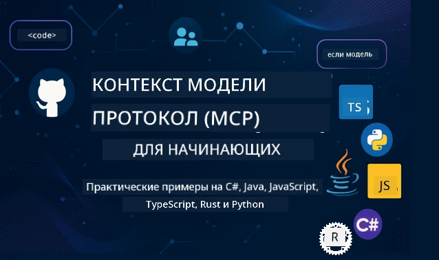

 

[](https://GitHub.com/microsoft/mcp-for-beginners/graphs/contributors)
[](https://GitHub.com/microsoft/mcp-for-beginners/issues)
[](https://GitHub.com/microsoft/mcp-for-beginners/pulls)
[](http://makeapullrequest.com)

[](https://GitHub.com/microsoft/mcp-for-beginners/watchers)
[](https://GitHub.com/microsoft/mcp-for-beginners/fork)
[](https://GitHub.com/microsoft/mcp-for-beginners/stargazers)


[](https://discord.gg/nTYy5BXMWG)

Следуйте этим шагам, чтобы начать использовать эти ресурсы:
1. **Создайте форк репозитория**: Нажмите [](https://GitHub.com/microsoft/mcp-for-beginners/fork)
2. **Клонируйте репозиторий**:   `git clone https://github.com/microsoft/mcp-for-beginners.git`
3. **Присоединяйтесь к** [](https://discord.gg/nTYy5BXMWG)


### 🌐 Поддержка нескольких языков

#### Поддерживается через GitHub Action (Автоматически и всегда актуально)

<!-- CO-OP TRANSLATOR LANGUAGES TABLE START -->
[Arabic](../ar/README.md) | [Bengali](../bn/README.md) | [Bulgarian](../bg/README.md) | [Burmese (Myanmar)](../my/README.md) | [Chinese (Simplified)](../zh-CN/README.md) | [Chinese (Traditional, Hong Kong)](../zh-HK/README.md) | [Chinese (Traditional, Macau)](../zh-MO/README.md) | [Chinese (Traditional, Taiwan)](../zh-TW/README.md) | [Croatian](../hr/README.md) | [Czech](../cs/README.md) | [Danish](../da/README.md) | [Dutch](../nl/README.md) | [Estonian](../et/README.md) | [Finnish](../fi/README.md) | [French](../fr/README.md) | [German](../de/README.md) | [Greek](../el/README.md) | [Hebrew](../he/README.md) | [Hindi](../hi/README.md) | [Hungarian](../hu/README.md) | [Indonesian](../id/README.md) | [Italian](../it/README.md) | [Japanese](../ja/README.md) | [Kannada](../kn/README.md) | [Korean](../ko/README.md) | [Lithuanian](../lt/README.md) | [Malay](../ms/README.md) | [Malayalam](../ml/README.md) | [Marathi](../mr/README.md) | [Nepali](../ne/README.md) | [Nigerian Pidgin](../pcm/README.md) | [Norwegian](../no/README.md) | [Persian (Farsi)](../fa/README.md) | [Polish](../pl/README.md) | [Portuguese (Brazil)](../pt-BR/README.md) | [Portuguese (Portugal)](../pt-PT/README.md) | [Punjabi (Gurmukhi)](../pa/README.md) | [Romanian](../ro/README.md) | [Russian](./README.md) | [Serbian (Cyrillic)](../sr/README.md) | [Slovak](../sk/README.md) | [Slovenian](../sl/README.md) | [Spanish](../es/README.md) | [Swahili](../sw/README.md) | [Swedish](../sv/README.md) | [Tagalog (Filipino)](../tl/README.md) | [Tamil](../ta/README.md) | [Telugu](../te/README.md) | [Thai](../th/README.md) | [Turkish](../tr/README.md) | [Ukrainian](../uk/README.md) | [Urdu](../ur/README.md) | [Vietnamese](../vi/README.md)

> **Предпочитаете клонировать локально?**
>
> В этом репозитории есть более 50 переводов, что значительно увеличивает размер загрузки. Чтобы клонировать без переводов, используйте sparse checkout:
>
> **Bash / macOS / Linux:**
> ```bash
> git clone --filter=blob:none --sparse https://github.com/microsoft/mcp-for-beginners.git
> cd mcp-for-beginners
> git sparse-checkout set --no-cone '/*' '!translations' '!translated_images'
> ```
>
> **CMD (Windows):**
> ```cmd
> git clone --filter=blob:none --sparse https://github.com/microsoft/mcp-for-beginners.git
> cd mcp-for-beginners
> git sparse-checkout set --no-cone "/*" "!translations" "!translated_images"
> ```
>
> Это даст вам всё необходимое для прохождения курса с намного более быстрой загрузкой.
<!-- CO-OP TRANSLATOR LANGUAGES TABLE END -->

# 🚀 Учебный курс по Model Context Protocol (MCP) для начинающих

## **Изучайте MCP с практическими примерами кода на C#, Java, JavaScript, Rust, Python и TypeScript**

## 🧠 Обзор учебного курса Model Context Protocol
Добро пожаловать в путешествие по Model Context Protocol! Если вы когда-либо задавались вопросом, как приложения ИИ взаимодействуют с разными инструментами и сервисами, то сейчас вы узнаете изящное решение, которое меняет способ создания интеллектуальных систем разработчиками.

Подумайте о MCP как о универсальном переводчике для приложений искусственного интеллекта — так же, как USB-порты позволяют подключать любое устройство к вашему компьютеру, MCP позволяет AI-моделям подключаться к любому инструменту или сервису стандартизированным способом. Независимо от того, создаёте ли вы своего первого чат-бота или работаете со сложными AI-рабочими процессами, понимание MCP даст вам возможность создавать более мощные и гибкие приложения.

Этот курс разработан с терпением и заботой о вашем обучении. Мы начнём с простых концепций, которые вы уже понимаете, и постепенно будем наращивать ваш опыт через практические занятия на вашем любимом языке программирования. Каждый этап включает понятные объяснения, практические примеры и много поддержки на пути.

К моменту завершения этого курса вы будете уверенно создавать собственные MCP-серверы, интегрировать их с популярными AI-платформами и понимать, как эта технология меняет будущее разработки искусственного интеллекта. Давайте вместе начнём это увлекательное приключение!

### Официальная документация и спецификации

Этот курс соответствует **MCP Specification 2025-11-25** (последний стабильный релиз). Спецификация MCP использует версионирование по дате (в формате ГГГГ-ММ-ДД) для чёткого отслеживания версий протокола.

Эти ресурсы станут ценнее по мере вашего прогресса, но не спешите изучать всё сразу. Начинайте с тех разделов, которые вас интересуют больше всего!
- 📘 [Документация MCP](https://modelcontextprotocol.io/) – Ваш основной ресурс с пошаговыми уроками и руководствами пользователя. Документация написана для начинающих с понятными примерами, которые вы можете изучать в удобном для себя темпе.
- 📜 [Спецификация MCP](https://modelcontextprotocol.io/specification/2025-11-25) – Ваш подробный справочник. По мере прохождения курса вы будете возвращаться сюда для уточнения деталей и исследования продвинутых функций.
- 📜 [Версионирование спецификации MCP](https://modelcontextprotocol.io/specification/versioning) – Содержит информацию об истории версий протокола и о том, как MCP использует дату для версионирования.
- 🧑‍💻 [Репозиторий MCP на GitHub](https://github.com/modelcontextprotocol) – Здесь вы найдёте SDK, инструменты и примеры кода на разных языках программирования. Это настоящий кладезь практических примеров и готовых компонентов.
- 🌐 [Сообщество MCP](https://github.com/orgs/modelcontextprotocol/discussions) – Присоединяйтесь к другим учащимся и опытным разработчикам в обсуждениях о MCP. Это поддерживающее сообщество, где вопросы приветствуются, а знания свободно делятся.

## Цели обучения

К концу этого курса вы будете чувствовать себя уверенно и вдохновлённо новыми знаниями. Вот чего вы достигнете:

• **Поймёте основы MCP**: Вы усвоите, что такое Model Context Protocol и почему он меняет способ взаимодействия AI-приложений, используя понятные аналогии и примеры.

• **Создадите свой первый MCP-сервер**: Вы построите работающий MCP-сервер на предпочитаемом языке программирования, начиная с простых примеров и постепенно совершенствуя навыки.

• **Свяжете AI-модели с реальными инструментами**: Вы научитесь создавать мост между AI-моделями и реальными сервисами, расширяя возможности ваших приложений.

• **Внедрите лучшие практики безопасности**: Вы поймёте, как обеспечить безопасность своих MCP-реализаций, защищая как приложения, так и пользователей.

• **Уверенно развернёте проекты**: Вы узнаете, как вывести свои MCP-проекты из разработки в продакшен с практическими стратегиями развертывания, работающими в реальном мире.

• **Присоединитесь к сообществу MCP**: Вы станете частью растущего сообщества разработчиков, формирующих будущее разработки AI-приложений.

## Необходимая база

Прежде чем мы перейдём к деталям MCP, убедимся, что вы комфортно чувствуете себя с некоторыми фундаментальными понятиями. Не волнуйтесь, если вы не эксперт — мы всё объясним по ходу!

### Понимание протоколов (Основы)

Подумайте о протоколе как о правилах для разговора. Когда вы звоните другу, вы оба знаете, что надо сказать «привет» при ответе, говорить по очереди и прощаться в конце. Компьютерным программам нужны похожие правила для эффективного общения.

MCP — это протокол, набор согласованных правил, которые помогают моделям ИИ и приложениям вести продуктивные «разговоры» с инструментами и сервисами. Как наличие правил разговора облегчает общение между людьми, так и MCP делает связь AI-приложений намного надёжнее и мощнее.

### Клиент-серверные отношения (Как программы работают вместе)

Вы ежедневно используете клиент-серверные отношения! Когда вы используете веб-браузер (клиент), чтобы зайти на сайт, вы подключаетесь к веб-серверу, который отправляет содержимое страницы. Браузер знает, как запросить информацию, а сервер — как ответить.

В MCP у нас похожие отношения: модели ИИ выступают клиентами, которые запрашивают информацию или действия, а MCP-серверы предоставляют эти возможности. Это похоже на помощника (сервер), к которому ИИ может обратиться за выполнением конкретных задач.

### Почему стандартизация важна (Чтобы всё работало вместе)

Представьте, что у каждого производителя автомобилей разная форма бензозаправочных пистолетов — вам пришлось бы иметь разные адаптеры для каждой машины! Стандартизация значит договориться об общих подходах, чтобы всё работало без проблем.

MCP даёт такую стандартизацию для AI-приложений. Вместо того, чтобы каждой модели AI требовался собственный код для работы с каждым инструментом, MCP создаёт универсальный язык общения. Это позволяет разработчикам создать инструмент один раз, и он работает с множеством разных AI-систем.

## 🧭 Обзор вашего пути обучения

Ваш путь в MCP продуман таким образом, чтобы последовательно наращивать уверенность и навыки. Каждый этап вводит новые понятия, одновременно закрепляя уже изученное.

### 🌱 Фаза основ: Понимание базовых понятий (Модули 0-2)

Здесь начинается ваше приключение! Мы познакомим вас с концепциями MCP, используя знакомые аналогии и простые примеры. Вы поймёте, что такое MCP, зачем он нужен и как вписывается в мир разработки AI.

• **Модуль 0 - Введение в MCP**: Мы начнём с того, что такое MCP и почему он так важен для современных AI-приложений. Вы увидите примеры MCP в реальной жизни и поймёте, как он решает типичные проблемы разработчиков.

• **Модуль 1 - Объяснение основных понятий**: Здесь вы изучите ключевые строительные блоки MCP. Мы используем много аналогий и визуальных примеров, чтобы вы легко понимали эти концепции.

• **Модуль 2 - Безопасность в MCP**: Безопасность может пугать, но мы покажем, какие встроенные средства безопасности есть в MCP, и научим лучшим практикам для защиты ваших приложений с самого начала.

### 🔨 Фаза создания: Разработка первых реализаций (Модуль 3)

Теперь начинается самое интересное! Вы получите практический опыт в создании настоящих MCP-серверов и клиентов. Не волнуйтесь — мы начнём с простого и проведём вас через каждый шаг.
Этот модуль включает несколько практических руководств, которые позволяют вам практиковаться на предпочтительном языке программирования. Вы создадите свой первый сервер, разработаете клиент для подключения к нему и даже интегрируетесь с популярными инструментами разработки, такими как VS Code.

Каждое руководство включает полные примеры кода, советы по устранению неполадок и объяснения, почему мы принимаем определённые проектные решения. К концу этого этапа у вас будут работающие реализации MCP, которыми можно гордиться!

### 🚀 Этап роста: Продвинутые концепции и применение в реальных условиях (Модули 4-5)

После освоения основ вы готовы изучать более сложные возможности MCP. Мы рассмотрим практические стратегии реализации, методы отладки и продвинутые темы, такие как интеграция с мультимодальными ИИ.

Вы также узнаете, как масштабировать реализации MCP для использования в продакшене и интегрироваться с облачными платформами, такими как Azure. Эти модули подготовят вас к созданию MCP-решений, способных справляться с реальными задачами.

### 🌟 Этап мастерства: Сообщество и специализация (Модули 6-11)

Последний этап сосредоточен на присоединении к сообществу MCP и специализации в наиболее интересующих вас областях. Вы научитесь вносить вклад в проекты MCP с открытым исходным кодом, реализовывать продвинутые паттерны аутентификации и строить комплексные решения с интеграцией баз данных.

Особое внимание заслуживает Модуль 11 — это полный из 13 практических лабораторий учебный путь, который учит создавать готовые к продакшену MCP-серверы с интеграцией PostgreSQL. Это как венчурный проект, объединяющий всё, что вы изучили!

### 📚 Полная структура учебной программы

| Модуль | Тема | Описание | Ссылка |
|--------|-------|-------------|------|
| **Модули 0-3: Основы** | | | |
| 00 | Введение в MCP | Обзор протокола Model Context Protocol и его значимости в AI-пайплайнах | [Подробнее](./00-Introduction/README.md) |
| 01 | Основные концепции | Глубокое изучение основных концепций MCP | [Подробнее](./01-CoreConcepts/README.md) |
| 02 | Безопасность в MCP | Угрозы безопасности и лучшие практики | [Подробнее](./02-Security/README.md) |
| 03 | Начало работы с MCP | Настройка среды, базовые серверы/клиенты, интеграция | [Подробнее](./03-GettingStarted/README.md) |
| **Модуль 3: Создание первого сервера и клиента** | | | |
| 3.1 | Первый сервер | Создайте свой первый MCP сервер | [Руководство](./03-GettingStarted/01-first-server/README.md) |
| 3.2 | Первый клиент | Разработайте базовый MCP клиент | [Руководство](./03-GettingStarted/02-client/README.md) |
| 3.3 | Клиент с LLM | Интеграция больших языковых моделей | [Руководство](./03-GettingStarted/03-llm-client/README.md) |
| 3.4 | Интеграция с VS Code | Использование MCP серверов в VS Code | [Руководство](./03-GettingStarted/04-vscode/README.md) |
| 3.5 | stdio сервер | Создание серверов с использованием транспорта stdio | [Руководство](./03-GettingStarted/05-stdio-server/README.md) |
| 3.6 | HTTP потоковая передача | Реализация потоковой передачи HTTP в MCP | [Руководство](./03-GettingStarted/06-http-streaming/README.md) |
| 3.7 | AI Toolkit | Использование AI Toolkit с MCP | [Руководство](./03-GettingStarted/07-aitk/README.md) |
| 3.8 | Тестирование | Тестирование вашей реализации MCP сервера | [Руководство](./03-GettingStarted/08-testing/README.md) |
| 3.9 | Развертывание | Развертывание MCP серверов в продакшене | [Руководство](./03-GettingStarted/09-deployment/README.md) |
| 3.10 | Расширенное использование сервера | Использование продвинутых серверов для расширенных функций и улучшенной архитектуры | [Руководство](./03-GettingStarted/10-advanced/README.md) |
| 3.11 | Простая аутентификация | Глава, показывающая авторизацию с самого начала и RBAC | [Руководство](./03-GettingStarted/11-simple-auth/README.md) |
| 3.12 | MCP хосты | Настройка Claude Desktop, Cursor, Cline и других MCP хостов | [Руководство](./03-GettingStarted/12-mcp-hosts/README.md) |
| 3.13 | MCP Inspector | Отладка и тестирование MCP серверов с помощью инструмента Inspector | [Руководство](./03-GettingStarted/13-mcp-inspector/README.md) |
| 3.14 | Семплирование | Использование семплирования для совместной работы с клиентом | [Руководство](./03-GettingStarted/14-sampling/README.md) |
| 3.15 | MCP приложения | Создание MCP приложений | [Руководство](./03-GettingStarted/15-mcp-apps/README.md) |

| **Модули 4-5: Практика и продвинутый уровень** | | | |
| 04 | Практическая реализация | SDK, отладка, тестирование, переиспользуемые шаблоны промтов | [Подробнее](./04-PracticalImplementation/README.md) |
| 4.1 | Пагинация | Обработка больших наборов результатов с помощью пагинации на основе курсора | [Руководство](./04-PracticalImplementation/pagination/README.md) |
| 05 | Продвинутые темы MCP | Мультимодальный ИИ, масштабирование, корпоративное использование | [Подробнее](./05-AdvancedTopics/README.md) |
| 5.1 | Интеграция с Azure | Интеграция MCP с Azure | [Руководство](./05-AdvancedTopics/mcp-integration/README.md) |
| 5.2 | Мультимодальность | Работа с несколькими модальностями | [Руководство](./05-AdvancedTopics/mcp-multi-modality/README.md) |
| 5.3 | Демонстрация OAuth2 | Реализация аутентификации OAuth2 | [Руководство](./05-AdvancedTopics/mcp-oauth2-demo/README.md) |
| 5.4 | Корневые контексты | Понимание и реализация корневых контекстов | [Руководство](./05-AdvancedTopics/mcp-root-contexts/README.md) |
| 5.5 | Маршрутизация | Стратегии маршрутизации MCP | [Руководство](./05-AdvancedTopics/mcp-routing/README.md) |
| 5.6 | Семплирование | Техники семплирования в MCP | [Руководство](./05-AdvancedTopics/mcp-sampling/README.md) |
| 5.7 | Масштабирование | Масштабирование реализаций MCP | [Руководство](./05-AdvancedTopics/mcp-scaling/README.md) |
| 5.8 | Безопасность | Продвинутые вопросы безопасности | [Руководство](./05-AdvancedTopics/mcp-security/README.md) |
| 5.9 | Веб-поиск | Реализация возможностей веб-поиска | [Руководство](./05-AdvancedTopics/web-search-mcp/README.md) |
| 5.10 | Потоковая передача в реальном времени | Создание функционала потоковой передачи в реальном времени | [Руководство](./05-AdvancedTopics/mcp-realtimestreaming/README.md) |
| 5.11 | Поиск в реальном времени | Реализация поиска в реальном времени | [Руководство](./05-AdvancedTopics/mcp-realtimesearch/README.md) |
| 5.12 | Аутентификация Entra ID | Аутентификация с Microsoft Entra ID | [Руководство](./05-AdvancedTopics/mcp-security-entra/README.md) |
| 5.13 | Интеграция Foundry | Интеграция с Azure AI Foundry | [Руководство](./05-AdvancedTopics/mcp-foundry-agent-integration/README.md) |
| 5.14 | Инжиниринг контекста | Техники эффективного инжиниринга контекста | [Руководство](./05-AdvancedTopics/mcp-contextengineering/README.md) |
| 5.15 | Кастомный транспорт MCP | Реализации кастомных транспортов | [Руководство](./05-AdvancedTopics/mcp-transport/README.md) |
| 5.16 | Особенности протокола | Уведомления о прогрессе, отмена, шаблоны ресурсов | [Руководство](./05-AdvancedTopics/mcp-protocol-features/README.md) |
| **Модули 6-10: Сообщество и лучшие практики** | | | |
| 06 | Вклад сообщества | Как вносить вклад в экосистему MCP | [Руководство](./06-CommunityContributions/README.md) |
| 07 | Опыт раннего внедрения | Истории реализации в реальном мире | [Руководство](./07-LessonsfromEarlyAdoption/README.md) |
| 08 | Лучшие практики MCP | Производительность, отказоустойчивость, устойчивость | [Руководство](./08-BestPractices/README.md) |
| 09 | Кейсы MCP | Практические примеры реализации | [Руководство](./09-CaseStudy/README.md) |
| 10 | Практический воркшоп | Создание MCP сервера с AI Toolkit | [Лаборатория](./10-StreamliningAIWorkflowsBuildingAnMCPServerWithAIToolkit/README.md) |
| **Модуль 11: Практика MCP сервера** | | | |
| 11 | Интеграция MCP сервера с базой данных | Полный учебный путь из 13 лабораторий по интеграции с PostgreSQL | [Лаборатории](./11-MCPServerHandsOnLabs/README.md) |
| 11.1 | Введение | Обзор MCP с интеграцией базы данных и кейсом розничной аналитики | [Лаборатория 00](./11-MCPServerHandsOnLabs/00-Introduction/README.md) |
| 11.2 | Основная архитектура | Понимание архитектуры MCP сервера, уровней базы данных и схем безопасности | [Лаборатория 01](./11-MCPServerHandsOnLabs/01-Architecture/README.md) |
| 11.3 | Безопасность и мультиарендность | Безопасность на уровне строк, аутентификация и доступ к данным между арендаторами | [Лаборатория 02](./11-MCPServerHandsOnLabs/02-Security/README.md) |
| 11.4 | Настройка среды | Настройка среды разработки, Docker, ресурсы Azure | [Лаборатория 03](./11-MCPServerHandsOnLabs/03-Setup/README.md) |
| 11.5 | Проектирование базы данных | Настройка PostgreSQL, дизайн схемы розничной торговли, образцы данных | [Лаборатория 04](./11-MCPServerHandsOnLabs/04-Database/README.md) |
| 11.6 | Реализация MCP сервера | Создание FastMCP сервера с интеграцией базы данных | [Лаборатория 05](./11-MCPServerHandsOnLabs/05-MCP-Server/README.md) |
| 11.7 | Разработка инструментов | Создание инструментов запросов к базе данных и интроспекция схемы | [Лаборатория 06](./11-MCPServerHandsOnLabs/06-Tools/README.md) |
| 11.8 | Семантический поиск | Реализация векторных эмбеддингов с Azure OpenAI и pgvector | [Лаборатория 07](./11-MCPServerHandsOnLabs/07-Semantic-Search/README.md) |
| 11.9 | Тестирование и отладка | Стратегии тестирования, инструменты отладки и подходы к валидации | [Лаборатория 08](./11-MCPServerHandsOnLabs/08-Testing/README.md) |
| 11.10 | Интеграция VS Code | Настройка интеграции MCP в VS Code и использование AI Chat | [Лаборатория 09](./11-MCPServerHandsOnLabs/09-VS-Code/README.md) |
| 11.11 | Стратегии развертывания | Развертывание через Docker, Azure Container Apps и вопросы масштабирования | [Лаборатория 10](./11-MCPServerHandsOnLabs/10-Deployment/README.md) |
| 11.12 | Мониторинг | Application Insights, логирование, мониторинг производительности | [Лаборатория 11](./11-MCPServerHandsOnLabs/11-Monitoring/README.md) |
| 11.13 | Лучшие практики | Оптимизация производительности, усиление безопасности и советы для продакшена | [Лаборатория 12](./11-MCPServerHandsOnLabs/12-Best-Practices/README.md) |

### 💻 Примеры проектов кода

Одна из самых захватывающих частей изучения MCP — это постепенное развитие ваших навыков кодирования. Мы спроектировали наши примеры кода так, чтобы они были простыми в начале и становились более продвинутыми по мере углубления ваших знаний. Вот как мы вводим концепции — с кодом, который легко понять, но который демонстрирует реальные принципы MCP, вы поймёте не только что делает этот код, но и почему он так структурирован и как он вписывается в более крупные MCP-приложения.

#### Основные примеры калькулятора MCP

| Язык | Описание | Ссылка |
|----------|-------------|------|
| C# | Пример MCP сервера | [Просмотреть код](./03-GettingStarted/samples/csharp/README.md) |
| Java | MCP калькулятор | [Просмотреть код](./03-GettingStarted/samples/java/calculator/README.md) |
| JavaScript | Демонстрация MCP | [Просмотреть код](./03-GettingStarted/samples/javascript/README.md) |
| Python | MCP сервер | [Просмотреть код](../../03-GettingStarted/samples/python/mcp_calculator_server.py) |
| TypeScript | Пример MCP | [Просмотреть код](./03-GettingStarted/samples/typescript/README.md) |
| Rust | Пример MCP | [Просмотреть код](./03-GettingStarted/samples/rust/README.md) |

#### Продвинутые реализации MCP

| Язык | Описание | Ссылка |
|----------|-------------|------|
| C# | Продвинутый пример | [Просмотреть код](./04-PracticalImplementation/samples/csharp/README.md) |
| Java с Spring | Пример контейнерного приложения | [Просмотреть код](./04-PracticalImplementation/samples/java/containerapp/README.md) |
| JavaScript | Продвинутый пример | [Просмотреть код](./04-PracticalImplementation/samples/javascript/README.md) |
| Python | Сложная реализация | [Просмотреть код](./04-PracticalImplementation/samples/python/README.md) |
| TypeScript | Пример контейнера | [Просмотреть код](./04-PracticalImplementation/samples/typescript/README.md) |


## 🎯 Необходимые знания для изучения MCP

Чтобы максимально эффективно усвоить учебную программу, вам необходимо:
- Базовые знания программирования как минимум на одном из следующих языков: C#, Java, JavaScript, Python или TypeScript  
- Понимание клиент-серверной модели и API  
- Знание концепций REST и HTTP  
- (Опционально) Знания в области AI/ML  

- Участие в обсуждениях нашего сообщества для поддержки  

## 📚 Учебное руководство и ресурсы  

В этом репозитории собрано несколько ресурсов, которые помогут вам эффективно ориентироваться и учиться:  

### Учебное руководство  

Доступно подробное [Учебное руководство](./study_guide.md), помогающее эффективно использовать репозиторий. Этот визуальный план учебной программы показывает взаимосвязь всех тем и даёт рекомендации, как использовать примеры проектов. Особенно полезно для визуальных учеников, которым нравится видеть общую картину.  

В руководстве включено:  
- Визуальная карта учебной программы, показывающая все темы  
- Детальный разбор каждого раздела репозитория  
- Рекомендации по использованию примеров проектов  
- Рекомендуемые пути обучения для разных уровней подготовки  
- Дополнительные ресурсы для углублённого изучения  

### Журнал изменений  

Мы ведём подробный [Журнал изменений](./changelog.md), в котором отражены все значимые обновления учебных материалов, чтобы вы могли быть в курсе последних улучшений и дополнений.  
- Добавление нового контента  
- Изменения в структуре  
- Улучшения функционала  
- Обновления документации  

## 🛠️ Как эффективно использовать эту учебную программу  

Каждый урок в этом руководстве включает:  

1. Чёткие объяснения концепций MCP  
2. Рабочие примеры кода на нескольких языках  
3. Задания для создания реальных MCP-приложений  
4. Дополнительные материалы для продвинутых учеников  

### Изучаем MCP на C# — серия уроков  
Давайте познакомимся с Model Context Protocol (MCP) — современным фреймворком, разработанным для стандартизации взаимодействия между AI-моделями и клиентскими приложениями. В этом уроке для начинающих мы познакомим вас с MCP и проведём через создание вашего первого MCP-сервера.  
#### C#: [https://aka.ms/letslearnmcp-csharp](https://aka.ms/letslearnmcp-csharp)  
#### Java: [https://aka.ms/letslearnmcp-java](https://aka.ms/letslearnmcp-java)  
#### JavaScript: [https://aka.ms/letslearnmcp-javascript](https://aka.ms/letslearnmcp-javascript)  
#### Python: [https://aka.ms/letslearnmcp-python](https://aka.ms/letslearnmcp-python)  

## 🎓 Ваше путешествие в мире MCP начинается  

Поздравляем! Вы сделали первый шаг в захватывающем путешествии, которое расширит ваши возможности в программировании и познакомит с передовыми технологиями в разработке AI.  

### Что вы уже достигли  

Прочитав это введение, вы уже начали строить базу знаний о MCP. Вы понимаете, что такое MCP, почему это важно, и как эта учебная программа поможет вам на пути обучения. Это значительное достижение и начало вашего профессионализма в этой важной технологии.  

### Приключение впереди  

Продвигаясь по модулям, помните: каждый эксперт когда-то был новичком. Концепты, которые сейчас кажутся сложными, станут элементарными с практикой и применением. Каждый маленький шаг приближает вас к мощным навыкам, которые будут полезны на протяжении всей вашей карьеры разработчика.  

### Ваша поддержка  

Вы присоединяетесь к сообществу учащихся и экспертов, увлечённых MCP и готовых помогать друг другу добиваться успеха. Если вы застряли на каком-то коде или хотите поделиться открытием — сообщество поможет вам.  

Если возникнут трудности или вопросы по созданию AI-приложений, присоединяйтесь к обсуждениям MCP вместе с другими учениками и опытными разработчиками. Это поддерживающее сообщество, где вопросы приветствуются, а знания свободно делятся.  

[](https://discord.gg/nTYy5BXMWG)  

Если у вас есть отзывы о продукте или ошибки при разработке, посетите:  

[](https://aka.ms/foundry/forum)  

### Готовы начать?  

Ваше приключение с MCP начинается сейчас! Начните с Модуля 0, чтобы получить первые практические знания, или изучите примерные проекты, чтобы увидеть, что предстоит создавать. Помните — каждый эксперт начинал именно там, где вы сейчас, и с терпением и практикой вы сможете добиться потрясающих результатов.  

Добро пожаловать в мир разработки на Model Context Protocol. Давайте создавать что-то удивительное вместе!  

## 🤝 Вклад в учебное сообщество  

Эта учебная программа становится лучше благодаря вкладу таких учеников, как вы! Независимо от того, исправляете ли вы опечатку, предлагаете более чёткое объяснение или добавляете новый пример, ваш вклад помогает другим новичкам достигать успеха.  

Благодарим Microsoft Valued Professional [Shivam Goyal](https://www.linkedin.com/in/shivam2003/) за предоставленные примеры кода.  

Процесс внесения изменений разработан так, чтобы быть дружелюбным и поддерживающим. Для большинства вкладов требуется Соглашение о правах участника (Contributor License Agreement, CLA), но автоматические инструменты помогут пройти этот процесс без затруднений.  

## 📜 Открытое обучение  

Вся эта учебная программа распространяется под лицензией MIT [LICENSE](../../LICENSE), что позволяет вам свободно использовать, изменять и распространять её. Это поддерживает нашу миссию сделать знания о MCP доступными для разработчиков по всему миру.  

## 🤝 Руководство по внесению вклада  

Этот проект приветствует вклад и предложения. Большинство вкладов требуют, чтобы вы согласились с  
Соглашением о правах участника (CLA), подтверждающим, что вы имеете право и действительно  
даёте нам права на использование вашего вклада. Для подробностей посетите <https://cla.opensource.microsoft.com>.  

При создании pull request бот CLA автоматически определит, нужно ли вам предоставлять CLA, и отметит PR должным образом (например, статус проверки, комментарий). Просто следуйте инструкциям бота. Вам потребуется сделать это только один раз для всех репозиториев, использующих нашу CLA.  

Проект принял [Кодекс поведения Microsoft Open Source](https://opensource.microsoft.com/codeofconduct/).  
Для получения дополнительной информации смотрите [FAQ по Кодексу поведения](https://opensource.microsoft.com/codeofconduct/faq/) или обращайтесь по адресу [opencode@microsoft.com](mailto:opencode@microsoft.com) с вопросами или комментариями.  

---

*Готовы начать своё путешествие в MCP? Начните с [Модуля 00 - Введение в MCP](./00-Introduction/README.md) и сделайте первые шаги в мире разработки Model Context Protocol!*  

## 🎒 Другие курсы  
Наша команда выпускает и другие курсы! Ознакомьтесь:  

<!-- CO-OP TRANSLATOR OTHER COURSES START -->  
### LangChain  
[](https://aka.ms/langchain4j-for-beginners)  
[](https://aka.ms/langchainjs-for-beginners?WT.mc_id=m365-94501-dwahlin)  
[](https://github.com/microsoft/langchain-for-beginners?WT.mc_id=m365-94501-dwahlin)  
---  

### Azure / Edge / MCP / Агентские решения  
[](https://github.com/microsoft/AZD-for-beginners?WT.mc_id=academic-105485-koreyst)  
[](https://github.com/microsoft/edgeai-for-beginners?WT.mc_id=academic-105485-koreyst)  
[](https://github.com/microsoft/mcp-for-beginners?WT.mc_id=academic-105485-koreyst)  
[](https://github.com/microsoft/ai-agents-for-beginners?WT.mc_id=academic-105485-koreyst)  

---  

### Серия по генеративному AI  
[](https://github.com/microsoft/generative-ai-for-beginners?WT.mc_id=academic-105485-koreyst)  
[-9333EA?style=for-the-badge&labelColor=E5E7EB&color=9333EA)](https://github.com/microsoft/Generative-AI-for-beginners-dotnet?WT.mc_id=academic-105485-koreyst)  
[-C084FC?style=for-the-badge&labelColor=E5E7EB&color=C084FC)](https://github.com/microsoft/generative-ai-for-beginners-java?WT.mc_id=academic-105485-koreyst)  
[-E879F9?style=for-the-badge&labelColor=E5E7EB&color=E879F9)](https://github.com/microsoft/generative-ai-with-javascript?WT.mc_id=academic-105485-koreyst)  

---  

### Основное обучение  
[](https://aka.ms/ml-beginners?WT.mc_id=academic-105485-koreyst)  
[](https://aka.ms/datascience-beginners?WT.mc_id=academic-105485-koreyst)  
[](https://aka.ms/ai-beginners?WT.mc_id=academic-105485-koreyst)  
[](https://github.com/microsoft/Security-101?WT.mc_id=academic-96948-sayoung)  
[](https://aka.ms/webdev-beginners?WT.mc_id=academic-105485-koreyst)  
[](https://aka.ms/iot-beginners?WT.mc_id=academic-105485-koreyst)  
[](https://github.com/microsoft/xr-development-for-beginners?WT.mc_id=academic-105485-koreyst)  

---  

### Серия по Copilot  

[](https://aka.ms/GitHubCopilotAI?WT.mc_id=academic-105485-koreyst)
[](https://github.com/microsoft/mastering-github-copilot-for-dotnet-csharp-developers?WT.mc_id=academic-105485-koreyst)
[](https://github.com/microsoft/CopilotAdventures?WT.mc_id=academic-105485-koreyst)
<!-- CO-OP TRANSLATOR OTHER COURSES END -->

---

<!-- CO-OP TRANSLATOR DISCLAIMER START -->
**Отказ от ответственности**:  
Этот документ был переведен с помощью сервиса автоматического перевода [Co-op Translator](https://github.com/Azure/co-op-translator). Несмотря на наши усилия по обеспечению точности, пожалуйста, имейте в виду, что автоматические переводы могут содержать ошибки или неточности. Оригинальный документ на его исходном языке следует считать авторитетным источником. Для получения критически важной информации рекомендуется профессиональный перевод человеком. Мы не несем ответственности за любые недоразумения или неправильные толкования, возникшие в результате использования данного перевода.
<!-- CO-OP TRANSLATOR DISCLAIMER END -->