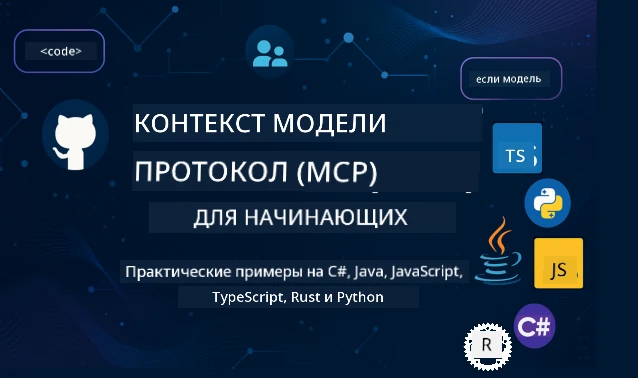

 

[](https://GitHub.com/microsoft/mcp-for-beginners/graphs/contributors)
[](https://GitHub.com/microsoft/mcp-for-beginners/issues)
[](https://GitHub.com/microsoft/mcp-for-beginners/pulls)
[](http://makeapullrequest.com)
[](https://mcptoplist.com/server/mcp.so%2Fmcp-for-beginners%2Fmicrosoft)

[](https://GitHub.com/microsoft/mcp-for-beginners/watchers)
[](https://GitHub.com/microsoft/mcp-for-beginners/fork)
[](https://GitHub.com/microsoft/mcp-for-beginners/stargazers)


[](https://discord.gg/nTYy5BXMWG)

Следуйте этим шагам, чтобы начать использовать эти ресурсы:
1. **Форкните репозиторий**: Нажмите [](https://GitHub.com/microsoft/mcp-for-beginners/fork)
2. **Клонируйте репозиторий**:   `git clone https://github.com/microsoft/mcp-for-beginners.git`
3. **Присоединяйтесь к** [](https://discord.gg/nTYy5BXMWG)


### 🌐 Поддержка множества языков

#### Поддерживается через GitHub Action (Автоматически и всегда обновлено)

<!-- CO-OP TRANSLATOR LANGUAGES TABLE START -->
[Arabic](../ar/README.md) | [Bengali](../bn/README.md) | [Bulgarian](../bg/README.md) | [Burmese (Myanmar)](../my/README.md) | [Chinese (Simplified)](../zh-CN/README.md) | [Chinese (Traditional, Hong Kong)](../zh-HK/README.md) | [Chinese (Traditional, Macau)](../zh-MO/README.md) | [Chinese (Traditional, Taiwan)](../zh-TW/README.md) | [Croatian](../hr/README.md) | [Czech](../cs/README.md) | [Danish](../da/README.md) | [Dutch](../nl/README.md) | [Estonian](../et/README.md) | [Finnish](../fi/README.md) | [French](../fr/README.md) | [German](../de/README.md) | [Greek](../el/README.md) | [Hebrew](../he/README.md) | [Hindi](../hi/README.md) | [Hungarian](../hu/README.md) | [Indonesian](../id/README.md) | [Italian](../it/README.md) | [Japanese](../ja/README.md) | [Kannada](../kn/README.md) | [Khmer](../km/README.md) | [Korean](../ko/README.md) | [Lithuanian](../lt/README.md) | [Malay](../ms/README.md) | [Malayalam](../ml/README.md) | [Marathi](../mr/README.md) | [Nepali](../ne/README.md) | [Nigerian Pidgin](../pcm/README.md) | [Norwegian](../no/README.md) | [Persian (Farsi)](../fa/README.md) | [Polish](../pl/README.md) | [Portuguese (Brazil)](../pt-BR/README.md) | [Portuguese (Portugal)](../pt-PT/README.md) | [Punjabi (Gurmukhi)](../pa/README.md) | [Romanian](../ro/README.md) | [Russian](./README.md) | [Serbian (Cyrillic)](../sr/README.md) | [Slovak](../sk/README.md) | [Slovenian](../sl/README.md) | [Spanish](../es/README.md) | [Swahili](../sw/README.md) | [Swedish](../sv/README.md) | [Tagalog (Filipino)](../tl/README.md) | [Tamil](../ta/README.md) | [Telugu](../te/README.md) | [Thai](../th/README.md) | [Turkish](../tr/README.md) | [Ukrainian](../uk/README.md) | [Urdu](../ur/README.md) | [Vietnamese](../vi/README.md)

> **Предпочитаете локальное клонирование?**
>
> Этот репозиторий включает более 50 переводов, что значительно увеличивает размер загрузки. Чтобы клонировать без переводов, используйте sparse checkout:
>
> **Bash / macOS / Linux:**
> ```bash
> git clone --filter=blob:none --sparse https://github.com/microsoft/mcp-for-beginners.git
> cd mcp-for-beginners
> git sparse-checkout set --no-cone '/*' '!translations' '!translated_images'
> ```
>
> **CMD (Windows):**
> ```cmd
> git clone --filter=blob:none --sparse https://github.com/microsoft/mcp-for-beginners.git
> cd mcp-for-beginners
> git sparse-checkout set --no-cone "/*" "!translations" "!translated_images"
> ```
>
> Это даст вам всё необходимое для прохождения курса с гораздо более быстрой загрузкой.
<!-- CO-OP TRANSLATOR LANGUAGES TABLE END -->

# 🚀 Учебный план Model Context Protocol (MCP) для начинающих

## **Изучайте MCP на практике с примерами кода на C#, Java, JavaScript, Rust, Python и TypeScript**

## 🧠 Обзор учебного плана Model Context Protocol
Добро пожаловать в ваше путешествие по Model Context Protocol! Если вы когда-либо задумывались, как приложения с ИИ взаимодействуют с различными инструментами и сервисами, вы скоро познакомитесь с элегантным решением, которое меняет подход разработчиков к созданию интеллектуальных систем.

Представьте MCP как универсальный переводчик для ИИ-приложений — так же, как USB-порты позволяют подключать любое устройство к вашему компьютеру, MCP позволяет ИИ-моделям подключаться к любому инструменту или сервису по единому стандарту. Независимо от того, создаете ли вы своего первого чатбота или работаете с комплексными рабочими процессами ИИ, понимание MCP даст вам возможность создавать более мощные и гибкие приложения.

Этот учебный план разработан с терпением и заботой о вашем пути обучения. Мы начнем с простых концепций, которые вы уже понимаете, и постепенно наращиваем ваш опыт через практические занятия на любимом языке программирования. Каждый шаг включает понятные объяснения, практические примеры и массу поддержки.

К моменту завершения этого пути вы будете уверены в создании собственных MCP-серверов, интеграции их с популярными платформами ИИ и понимании того, как эта технология меняет будущее разработки ИИ. Давайте вместе начнем это захватывающее приключение!

### Официальная документация и спецификации

Этот учебный план соответствует **MCP Specification 2025-11-25** (последняя стабильная версия). Спецификация MCP использует версионирование на основе даты (формат ГГГГ-ММ-ДД) для прозрачного отслеживания версий протокола.

> **Смотрим вперед:** кандидат в релизы для следующей версии спецификации, **2026-07-28**, запланирован к выпуску 28 июля 2026 года. Она делает протокол статeless на транспортном уровне, формализует фреймворк расширений (MCP Apps, Tasks), усиливает авторизацию и удаляет Roots, Sampling и Logging. Полный разбор см. в [Что меняется в MCP: кандидат в релизы 2026-07-28](./01-CoreConcepts/mcp-2026-07-28-release-candidate.md).

Эти ресурсы становятся всё более полезными по мере вашего роста, но не чувствуйте давление читать всё сразу. Начинайте с того, что вам интереснее всего!
- 📘 [Документация MCP](https://modelcontextprotocol.io/) – Ваш основной источник пошаговых учебников и руководств пользователя. Документация написана с учётом начинающих и содержит четкие примеры для самостоятельного освоения.
- 📜 [Спецификация MCP](https://modelcontextprotocol.io/specification/2025-11-25) – Можно считать это вашим подробным справочником. В процессе обучения вы будете возвращаться сюда для уточнения деталей и изучения продвинутых функций.
- 📜 [Версионирование спецификации MCP](https://modelcontextprotocol.io/specification/versioning) – Содержит информацию об истории версий протокола и о том, как MCP использует версионирование по дате (формат ГГГГ-ММ-ДД).
- 🧑‍💻 [GitHub репозиторий MCP](https://github.com/modelcontextprotocol) – Здесь вы найдете SDK, инструменты и примеры кода на разных языках программирования. Это настоящая сокровищница практических примеров и готовых компонентов.
- 🌐 [Сообщество MCP](https://github.com/orgs/modelcontextprotocol/discussions) – Присоединяйтесь к другим изучающим и опытным разработчикам в обсуждениях о MCP. Это поддерживающее сообщество, где приветствуются вопросы и свободный обмен знаниями.
  
## Цели обучения

К концу этого учебного плана вы будете уверены и воодушевлены своими новыми навыками. Вот чего вы добьётесь:

• **Поймете основы MCP**: Вы узнаете, что такое Model Context Protocol и почему он меняет взаимодействие ИИ-приложений, с помощью понятных аналогий и примеров.

• **Создадите свой первый MCP-сервер**: Вы напишете работающий MCP-сервер на выбранном языке программирования, начиная с простых примеров и постепенно усложняя задачи.

• **Подключите ИИ-модели к реальным инструментам**: Вы научитесь мостить разрыв между ИИ-моделями и реальными сервисами, расширяя возможности своих приложений.

• **Внедрите лучшие практики безопасности**: Вы поймете, как обеспечить безопасность MCP-реализаций, защищая как приложения, так и пользователей.

• **Развертывайте с уверенностью**: Вы узнаете, как переводить проекты MCP из разработки в продакшн с практическими стратегиями развертывания, проверенными в реальных условиях.

• **Вступите в сообщество MCP**: Вы станете частью растущего сообщества разработчиков, формирующих будущее разработки ИИ-приложений.

## Необходимая база знаний

Прежде чем погрузиться в детали MCP, убедимся, что вы комфортно чувствуете себя с основными понятиями. Не переживайте, если вы не эксперт – мы объясним всё необходимое по ходу дела!

### Понимание протоколов (основа)

Можно представить протокол как набор правил для разговора. Когда вы звоните другу, вы оба знаете, что нужно сказать "привет", говорить по очереди и прощаться, когда разговор заканчивается. Компьютерным программам нужны похожие правила, чтобы общаться эффективно.

MCP — это протокол, набор согласованных правил, которые помогают ИИ-моделям и приложениям вести продуктивный "диалог" с инструментами и сервисами. Так же, как правила разговора делают общение между людьми более плавным, MCP делает коммуникацию ИИ-приложений гораздо более надежной и мощной.

### Взаимоотношения клиент-сервер (как работают программы вместе)

Вы уже ежедневно используете отношения клиент-сервер! Когда вы используете веб-браузер (клиент) для посещения сайта, вы подключаетесь к веб-серверу, который отправляет содержимое страницы. Браузер знает, как запросить информацию, а сервер — как ответить.

В MCP у нас похожие отношения: ИИ-модели выступают клиентами, запрашивая информацию или действия, а MCP-серверы предоставляют эти возможности. Это как иметь помощника (сервер), к которому ИИ может обращаться с конкретными задачами.

### Почему стандартизация важна (чтобы всё работало вместе)

Представьте, если бы у каждого производителя автомобилей были разные формы бензозаправочных пистолетов — вам бы понадобился разный адаптер для каждой машины! Стандартизация — это согласование общих подходов, чтобы всё работало без проблем.

MCP обеспечивает такую стандартизацию для ИИ-приложений. Вместо того чтобы каждой ИИ-модели требовался свой уникальный код для работы с каждым инструментом, MCP создает универсальный способ общения. Это значит, что разработчики могут создавать инструменты один раз, и они будут работать с множеством разных ИИ-систем.

## 🧭 Обзор вашего пути обучения

Ваш путь MCP тщательно структурирован, чтобы постепенно укреплять ваши знания и навыки. Каждый этап знакомит с новыми концепциями, укрепляя уже изученное.

### 🌱 Фаза основы: понимание базовых понятий (модули 0-2)

Здесь начинается ваше приключение! Мы познакомим вас с концепциями MCP с помощью знакомых аналогий и простых примеров. Вы поймете, что такое MCP, зачем он нужен и как вписывается в более обширный мир разработки ИИ.


• **Модуль 0 - Введение в MCP**: Начнем с изучения, что такое MCP и почему он так важен для современных AI-приложений. Вы увидите реальные примеры работы MCP и поймете, как он решает общие проблемы, с которыми сталкиваются разработчики.

• **Модуль 1 - Объяснение основных концепций**: Здесь вы изучите основные строительные блоки MCP. Мы будем использовать множество аналогий и визуальных примеров, чтобы эти концепции стали понятными и естественными.

• **Модуль 2 - Безопасность в MCP**: Безопасность может показаться сложной, но мы покажем, как MCP включает встроенные функции безопасности и обучим вас лучшим практикам, которые защищают ваши приложения с самого начала.

### 🔨 Фаза создания: Создание ваших первых реализаций (Модуль 3)

Теперь начинается настоящая часть! Вы получите практический опыт в создании реальных MCP серверов и клиентов. Не волнуйтесь — мы начнем с простого и проведем вас через каждый шаг.

Этот модуль включает несколько практических руководств, позволяющих вам практиковаться на вашем предпочитаемом языке программирования. Вы создадите свой первый сервер, построите клиента для подключения к нему и даже интегрируетесь с популярными инструментами разработки, такими как VS Code.

Каждое руководство включает полные примеры кода, советы по устранению неполадок и объяснения, почему мы принимаем конкретные проектные решения. К концу этой фазы у вас будут рабочие реализации MCP, которыми вы сможете гордиться!

### 🚀 Фаза развития: Продвинутые концепции и реальные приложения (Модули 4-5)

После освоения основ вы будете готовы изучить более сложные функции MCP. Мы рассмотрим практические стратегии реализации, методы отладки и продвинутые темы, такие как мульти-модальная интеграция AI.

Вы также узнаете, как масштабировать реализации MCP для промышленного использования и интегрироваться с облачными платформами, такими как Azure. Эти модули подготовят вас к созданию MCP решений, способных справляться с реальными требованиями.

### 🌟 Фаза мастерства: Сообщество и специализация (Модули 6-11)

Финальная фаза сосредоточена на присоединении к сообществу MCP и специализации в наиболее интересных для вас областях. Вы узнаете, как вносить вклад в open-source проекты MCP, реализовывать продвинутые паттерны аутентификации и строить комплексные решения с интеграцией баз данных.

Модуль 11 заслуживает особого упоминания — это полный курс из 13 лабораторных работ, обучающих созданию производственных MCP серверов с интеграцией PostgreSQL. Это как итоговый проект, который объединяет все ваши знания!

### 📚 Полная структура учебной программы

| Модуль | Тема | Описание | Ссылка |
|--------|-------|-------------|------|
| **Модули 0-3: Основы** | | | |
| 00 | Введение в MCP | Обзор протокола Model Context Protocol и его значимости в AI пайплайнах | [Читать далее](./00-Introduction/README.md) |
| 01 | Объяснение основных концепций | Подробное изучение основных концепций MCP | [Читать далее](./01-CoreConcepts/README.md) |
| 1.1 | Что меняется в MCP (2026-07-28 RC) | Stateless протокол, framework расширений и устаревание функций в следующей версии спецификации | [Руководство](./01-CoreConcepts/mcp-2026-07-28-release-candidate.md) |
| 02 | Безопасность в MCP | Угрозы безопасности и лучшие практики | [Читать далее](./02-Security/README.md) |
| 03 | Начало работы с MCP | Настройка окружения, базовые серверы/клиенты, интеграция | [Читать далее](./03-GettingStarted/README.md) |
| **Модуль 3: Разработка вашего первого сервера и клиента** | | | |
| 3.1 | Первый сервер | Создайте ваш первый MCP сервер | [Руководство](./03-GettingStarted/01-first-server/README.md) |
| 3.2 | Первый клиент | Разработайте базовый MCP клиент | [Руководство](./03-GettingStarted/02-client/README.md) |
| 3.3 | Клиент с LLM | Интеграция больших языковых моделей | [Руководство](./03-GettingStarted/03-llm-client/README.md) |
| 3.4 | Интеграция VS Code | Использование MCP серверов в VS Code | [Руководство](./03-GettingStarted/04-vscode/README.md) |
| 3.5 | сервер stdio | Создание серверов с использованием транспорта stdio | [Руководство](./03-GettingStarted/05-stdio-server/README.md) |
| 3.6 | HTTP стриминг | Реализация HTTP стриминга в MCP | [Руководство](./03-GettingStarted/06-http-streaming/README.md) |
| 3.7 | Microsoft Foundry Toolkit | Использование Microsoft Foundry Toolkit с MCP | [Руководство](./03-GettingStarted/07-aitk/README.md) |
| 3.8 | Тестирование | Тестирование реализации MCP сервера | [Руководство](./03-GettingStarted/08-testing/README.md) |
| 3.9 | Развертывание | Развертывание MCP серверов в продакшен | [Руководство](./03-GettingStarted/09-deployment/README.md) |
| 3.10 | Расширенное использование серверов | Использование продвинутых серверов для улучшенных функций и архитектуры | [Руководство](./03-GettingStarted/10-advanced/README.md) |
| 3.11 | Простая аутентификация | Глава, показывающая аутентификацию с нуля и RBAC | [Руководство](./03-GettingStarted/11-simple-auth/README.md) |
| 3.12 | MCP хосты | Настройка Claude Desktop, Cursor, Cline и других MCP хостов | [Руководство](./03-GettingStarted/12-mcp-hosts/README.md) |
| 3.13 | MCP Inspector | Отладка и тестирование MCP серверов с помощью инструмента Inspector | [Руководство](./03-GettingStarted/13-mcp-inspector/README.md) |
| 3.14 | Сэмплирование | Использование сэмплирования для взаимодействия с клиентом | [Руководство](./03-GettingStarted/14-sampling/README.md) |
| 3.15 | MCP приложения | Создание MCP приложений | [Руководство](./03-GettingStarted/15-mcp-apps/README.md) |
| **Модули 4-5: Практические и продвинутые темы** | | | |
| 04 | Практическая реализация | SDK, отладка, тестирование, повторно используемые шаблоны prompt | [Читать далее](./04-PracticalImplementation/README.md) |
| 4.1 | Пагинация | Работа с большими наборами результатов через пагинацию с курсором | [Руководство](./04-PracticalImplementation/pagination/README.md) |
| 05 | Продвинутые темы в MCP | Мульти-модальный AI, масштабирование, корпоративное использование | [Читать далее](./05-AdvancedTopics/README.md) |
| 5.1 | Интеграция Azure | Интеграция MCP с Azure | [Руководство](./05-AdvancedTopics/mcp-integration/README.md) |
| 5.2 | Мульти-модальность | Работа с несколькими модальностями | [Руководство](./05-AdvancedTopics/mcp-multi-modality/README.md) |
| 5.3 | Демонстрация OAuth2 | Реализация аутентификации OAuth2 | [Руководство](./05-AdvancedTopics/mcp-oauth2-demo/README.md) |
| 5.4 | Корневые контексты | Понимание и реализация корневых контекстов | [Руководство](./05-AdvancedTopics/mcp-root-contexts/README.md) |
| 5.5 | Маршрутизация | Стратегии маршрутизации MCP | [Руководство](./05-AdvancedTopics/mcp-routing/README.md) |
| 5.6 | Сэмплирование | Техники сэмплирования в MCP | [Руководство](./05-AdvancedTopics/mcp-sampling/README.md) |
| 5.7 | Масштабирование | Масштабирование реализаций MCP | [Руководство](./05-AdvancedTopics/mcp-scaling/README.md) |
| 5.8 | Безопасность | Продвинутые вопросы безопасности | [Руководство](./05-AdvancedTopics/mcp-security/README.md) |
| 5.9 | Веб-поиск | Реализация возможностей веб-поиска | [Руководство](./05-AdvancedTopics/web-search-mcp/README.md) |
| 5.10 | Потоковое вещание в реальном времени | Создание функций потоковой передачи в реальном времени | [Руководство](./05-AdvancedTopics/mcp-realtimestreaming/README.md) |
| 5.11 | Поиск в реальном времени | Реализация поиска в реальном времени | [Руководство](./05-AdvancedTopics/mcp-realtimesearch/README.md) |
| 5.12 | Аутентификация Entra ID | Аутентификация с Microsoft Entra ID | [Руководство](./05-AdvancedTopics/mcp-security-entra/README.md) |
| 5.13 | Интеграция Foundry | Интеграция с Microsoft Foundry | [Руководство](./05-AdvancedTopics/mcp-foundry-agent-integration/README.md) |
| 5.14 | Контекстная инженерия | Методы эффективного проектирования контекста | [Руководство](./05-AdvancedTopics/mcp-contextengineering/README.md) |
| 5.15 | Пользовательский транспорт MCP | Реализации пользовательского транспорта | [Руководство](./05-AdvancedTopics/mcp-transport/README.md) |
| 5.16 | Функции протокола | Уведомления о прогрессе, отмена, шаблоны ресурсов | [Руководство](./05-AdvancedTopics/mcp-protocol-features/README.md) |
| 5.17 | Соперничающее многоагентное рассуждение | Два агента спорят противоположные стороны с использованием общих MCP инструментов, оцененных судьей-агентом | [Руководство](./05-AdvancedTopics/mcp-adversarial-agents/README.md) |
| **Модули 6-10: Сообщество и лучшие практики** | | | |
| 06 | Вклад сообщества | Как вносить вклад в экосистему MCP | [Руководство](./06-CommunityContributions/README.md) |
| 07 | Опыт раннего использования | Истории реализации в реальном мире | [Руководство](./07-LessonsfromEarlyAdoption/README.md) |
| 08 | Лучшие практики для MCP | Производительность, отказоустойчивость, устойчивость | [Руководство](./08-BestPractices/README.md) |
| 09 | Кейсы MCP | Практические примеры реализации | [Руководство](./09-CaseStudy/README.md) |
| 10 | Практический семинар | Создание MCP сервера с Microsoft Foundry Toolkit | [Лаборатория](./10-StreamliningAIWorkflowsBuildingAnMCPServerWithAIToolkit/README.md) |
| **Модуль 11: Практическая работа с MCP сервером** | | | |
| 11 | Интеграция MCP сервера с базой данных | Комплексный курс из 13 лабораторных работ по интеграции PostgreSQL | [Лаборатории](./11-MCPServerHandsOnLabs/README.md) |
| 11.1 | Введение | Обзор MCP с интеграцией базы данных и кейсом розничной аналитики | [Лаборатория 00](./11-MCPServerHandsOnLabs/00-Introduction/README.md) |
| 11.2 | Основная архитектура | Понимание архитектуры MCP сервера, слоев базы данных и паттернов безопасности | [Лаборатория 01](./11-MCPServerHandsOnLabs/01-Architecture/README.md) |
| 11.3 | Безопасность и мультиарендность | Безопасность на уровне строк, аутентификация и доступ к данным для нескольких арендаторов | [Лаборатория 02](./11-MCPServerHandsOnLabs/02-Security/README.md) |
| 11.4 | Настройка окружения | Настройка среды разработки, Docker, ресурсы Azure | [Лаборатория 03](./11-MCPServerHandsOnLabs/03-Setup/README.md) |
| 11.5 | Проектирование базы данных | Настройка PostgreSQL, схема для розницы и пример данных | [Лаборатория 04](./11-MCPServerHandsOnLabs/04-Database/README.md) |
| 11.6 | Реализация MCP сервера | Создание FastMCP сервера с интеграцией базы данных | [Лаборатория 05](./11-MCPServerHandsOnLabs/05-MCP-Server/README.md) |
| 11.7 | Разработка инструментов | Создание инструментов запросов к базе и интроспекция схемы | [Лаборатория 06](./11-MCPServerHandsOnLabs/06-Tools/README.md) |
| 11.8 | Семантический поиск | Реализация векторных эмбеддингов с Azure OpenAI и pgvector | [Лаборатория 07](./11-MCPServerHandsOnLabs/07-Semantic-Search/README.md) |
| 11.9 | Тестирование и отладка | Стратегии тестирования, инструменты отладки и подходы к валидации | [Лаборатория 08](./11-MCPServerHandsOnLabs/08-Testing/README.md) |
| 11.10 | Интеграция VS Code | Настройка интеграции MCP в VS Code и использование AI чата | [Лаборатория 09](./11-MCPServerHandsOnLabs/09-VS-Code/README.md) |
| 11.11 | Стратегии развертывания | Docker развертывание, Azure Container Apps и вопросы масштабирования | [Лаборатория 10](./11-MCPServerHandsOnLabs/10-Deployment/README.md) |
| 11.12 | Мониторинг | Application Insights, логирование, мониторинг производительности | [Лаборатория 11](./11-MCPServerHandsOnLabs/11-Monitoring/README.md) |
| 11.13 | Лучшие практики | Оптимизация производительности, усиление безопасности и советы для продакшена | [Лаборатория 12](./11-MCPServerHandsOnLabs/12-Best-Practices/README.md) |
| **Модуль 12: Инструменты MCP** | | | |
| 12.1 | Инструменты | Использование MCP в приложении Copilot | [ Руководство ](./12-tooling/README.md) |

### 💻 Примеры проектов с кодом

Одна из самых захватывающих частей изучения MCP — увидеть, как ваши навыки программирования развиваются постепенно. Мы спроектировали наши примеры кода так, чтобы они начинались просто и становились более сложными по мере углубления вашего понимания. Вот как мы вводим концепции — с кодом, который легко понять, но который демонстрирует реальные принципы MCP, вы поймете не только что этот код делает, но и почему он структурирован именно так и как он вписывается в большие MCP приложения.

#### Примеры базового MCP калькулятора

| Язык | Описание | Ссылка |
|----------|-------------|------|

| C# | Пример сервера MCP | [Просмотреть код](./03-GettingStarted/samples/csharp/README.md) |
| Java | Калькулятор MCP | [Просмотреть код](./03-GettingStarted/samples/java/calculator/README.md) |
| JavaScript | Демонстрация MCP | [Просмотреть код](./03-GettingStarted/samples/javascript/README.md) |
| Python | Сервер MCP | [Просмотреть код](../../03-GettingStarted/samples/python/mcp_calculator_server.py) |
| TypeScript | Пример MCP | [Просмотреть код](./03-GettingStarted/samples/typescript/README.md) |
| Rust | Пример MCP | [Просмотреть код](./03-GettingStarted/samples/rust/README.md) |

#### Продвинутые реализации MCP

| Язык | Описание | Ссылка |
|----------|-------------|------|
| C# | Продвинутый пример | [Просмотреть код](./04-PracticalImplementation/samples/csharp/README.md) |
| Java с Spring | Пример контейнерного приложения | [Просмотреть код](./04-PracticalImplementation/samples/java/containerapp/README.md) |
| JavaScript | Продвинутый пример | [Просмотреть код](./04-PracticalImplementation/samples/javascript/README.md) |
| Python | Сложная реализация | [Просмотреть код](./04-PracticalImplementation/samples/python/README.md) |
| TypeScript | Образец контейнера | [Просмотреть код](./04-PracticalImplementation/samples/typescript/README.md) |


## 🎯 Предварительные требования для изучения MCP

Чтобы извлечь максимальную пользу из этой программы, вам следует иметь:

- Базовые знания программирования хотя бы на одном из следующих языков: C#, Java, JavaScript, Python или TypeScript
- Понимание клиент-серверной модели и API
- Знакомство с концепциями REST и HTTP
- (Опционально) Знания в области искусственного интеллекта и машинного обучения

- Участие в обсуждениях нашего сообщества для поддержки

## 📚 Руководство по обучению и ресурсы

В этом репозитории содержится несколько ресурсов, которые помогут вам эффективно ориентироваться и учиться:

### Руководство по обучению

Доступно подробное [Руководство по обучению](./study_guide.md), которое поможет вам эффективно ориентироваться в этом репозитории. Эта визуальная карта учебной программы показывает, как связаны все темы, и предлагает рекомендации по эффективному использованию примеров проектов. Особенно полезно, если вы визуальный ученик и любите видеть общую картину.

Руководство включает:
- Визуальную карту учебной программы со всеми темами
- Подробный разбор каждого раздела репозитория
- Рекомендации по использованию примерных проектов
- Рекомендуемые учебные пути для разных уровней навыков
- Дополнительные ресурсы для поддержки вашего учебного пути

### Журнал изменений

Мы ведём подробный [Журнал изменений](./changelog.md), в котором отслеживаются все значимые обновления материалов учебной программы, чтобы вы всегда были в курсе последних улучшений и дополнений.
- Добавление нового содержания
- Структурные изменения
- Улучшения функций
- Обновления документации

## 🛠️ Как эффективно использовать эту учебную программу

Каждый урок в этом руководстве включает:

1. Четкие объяснения концепций MCP  
2. Примеры живого кода на нескольких языках  
3. Упражнения для создания настоящих приложений MCP  
4. Дополнительные ресурсы для продвинутых учеников

### Изучаем MCP с C# - серия уроков
Давайте познакомимся с протоколом Model Context Protocol (MCP), передовым фреймворком, предназначенным для стандартизации взаимодействия между ИИ-моделями и клиентскими приложениями. В этой ознакомительной сессии мы познакомим вас с MCP и поможем создать ваш первый сервер MCP.
#### C#: [https://aka.ms/letslearnmcp-csharp](https://aka.ms/letslearnmcp-csharp)
#### Java: [https://aka.ms/letslearnmcp-java](https://aka.ms/letslearnmcp-java)
#### JavaScript: [https://aka.ms/letslearnmcp-javascript](https://aka.ms/letslearnmcp-javascript)
#### Python: [https://aka.ms/letslearnmcp-python](https://aka.ms/letslearnmcp-python)

## 🎓 Ваш путь в MCP начинается

Поздравляем! Вы сделали первый шаг в увлекательном путешествии, которое расширит ваши программные возможности и соединит вас с передовыми разработками в области ИИ.

### Что вы уже достигли

Прочитав это введение, вы уже начали создавать базу знаний по MCP. Вы понимаете, что такое MCP, почему это важно, и как эта учебная программа поддержит ваше обучение. Это значительное достижение и начало вашего мастерства в этой важной технологии.

### Предстоящие приключения

По мере прохождения модулей помните, что каждый эксперт когда-то был новичком. Концепции, которые сейчас кажутся сложными, станут привычными по мере практики и применения. Каждый небольшой шаг ведет к мощным навыкам, которые пригодятся вам в вашей карьере разработчика.

### Ваша поддержка

Вы присоединяетесь к сообществу учеников и экспертов, увлеченных MCP и готовых помочь другим добиться успеха. Независимо от того, застряли ли вы на задаче программирования или хотите поделиться открытием, сообщество поддержит вас на вашем пути.

Если вы запутались или у вас есть вопросы по созданию ИИ-приложений, присоединяйтесь к другим ученикам и опытным разработчикам в обсуждениях MCP. Это поддерживающее сообщество, где приветствуются вопросы и свободно делятся знаниями.

[](https://discord.gg/nTYy5BXMWG)

Если у вас есть отзывы по продукту или ошибки при создании, посетите:

[](https://aka.ms/foundry/forum)

### Готовы начать?

Ваше приключение с MCP начинается сейчас! Начните с Модуля 0, чтобы погрузиться в первые практические занятия с MCP, или изучите примерные проекты, чтобы увидеть, что вы будете создавать. Помните — каждый эксперт начинал именно там, где вы сейчас, и с терпением и практикой вы удивитесь своим достижениям.

Добро пожаловать в мир разработки с Model Context Protocol. Давайте создадим что-то удивительное вместе!

## 🤝 Вклад в сообщество обучения

Эта учебная программа становится сильнее благодаря вкладам таких учеников, как вы! Независимо от того, исправляете ли вы опечатку, предлагаете более ясное объяснение или добавляете новый пример, ваш вклад помогает другим новичкам добиться успеха.

Благодарим уважаемого специалиста Microsoft [Shivam Goyal](https://www.linkedin.com/in/shivam2003/) за предоставленные образцы кода.

Процесс внесения вклада организован дружественным и поддерживающим образом. Для большинства вкладов требуется Соглашение об участии (CLA), но автоматизированные инструменты помогут вам пройти процесс без проблем.

## 📜 Открытое обучение

Вся эта учебная программа доступна по лицензии MIT [LICENSE](../../LICENSE), что означает, что вы можете свободно использовать, модифицировать и распространять её. Это поддерживает нашу миссию сделать знания MCP доступными для разработчиков по всему миру.
## 🤝 Руководство по вкладу

Этот проект приветствует вклады и предложения. Большинство вкладов требуют, чтобы вы согласились с 
Соглашением об участии (CLA), заявляя, что у вас есть право и вы действительно передаете нам 
права на использование вашего вклада. Для подробностей посетите <https://cla.opensource.microsoft.com>.

При отправке запроса на включение изменений бот CLA автоматически определит, нужно ли вам предоставлять 
CLA и отметит PR соответствующим образом (например, проверкой статуса, комментарием). Просто следуйте инструкциям 
, предоставленным ботом. Вам нужно будет сделать это только один раз для всех репозиториев с использованием нашего CLA.

Этот проект принял [Кодекс поведения Microsoft Open Source](https://opensource.microsoft.com/codeofconduct/).
Для дополнительной информации см. [Часто задаваемые вопросы по кодексу поведения](https://opensource.microsoft.com/codeofconduct/faq/) или 
свяжитесь с [opencode@microsoft.com](mailto:opencode@microsoft.com) по любым дополнительным вопросам или замечаниям.

---

*Готовы начать ваше путешествие в MCP? Начните с [Модуля 00 - Введение в MCP](./00-Introduction/README.md) и сделайте первые шаги в мире разработки с Model Context Protocol!*


## 🎒 Другие курсы
Наша команда выпускает и другие курсы! Ознакомьтесь с:

<!-- CO-OP TRANSLATOR OTHER COURSES START -->
### LangChain
[](https://aka.ms/langchain4j-for-beginners)
[](https://aka.ms/langchainjs-for-beginners?WT.mc_id=m365-94501-dwahlin)
[](https://github.com/microsoft/langchain-for-beginners?WT.mc_id=m365-94501-dwahlin)
---

### Azure / Edge / MCP / Агенты
[](https://github.com/microsoft/AZD-for-beginners?WT.mc_id=academic-105485-koreyst)
[](https://github.com/microsoft/edgeai-for-beginners?WT.mc_id=academic-105485-koreyst)
[](https://github.com/microsoft/mcp-for-beginners?WT.mc_id=academic-105485-koreyst)
[](https://github.com/microsoft/ai-agents-for-beginners?WT.mc_id=academic-105485-koreyst)

---
 
### Серия по генеративному ИИ
[](https://github.com/microsoft/generative-ai-for-beginners?WT.mc_id=academic-105485-koreyst)
[-9333EA?style=for-the-badge&labelColor=E5E7EB&color=9333EA)](https://github.com/microsoft/Generative-AI-for-beginners-dotnet?WT.mc_id=academic-105485-koreyst)
[-C084FC?style=for-the-badge&labelColor=E5E7EB&color=C084FC)](https://github.com/microsoft/generative-ai-for-beginners-java?WT.mc_id=academic-105485-koreyst)
[-E879F9?style=for-the-badge&labelColor=E5E7EB&color=E879F9)](https://github.com/microsoft/generative-ai-with-javascript?WT.mc_id=academic-105485-koreyst)

---
 
### Базовое обучение
[](https://aka.ms/ml-beginners?WT.mc_id=academic-105485-koreyst)
[](https://aka.ms/datascience-beginners?WT.mc_id=academic-105485-koreyst)
[](https://aka.ms/ai-beginners?WT.mc_id=academic-105485-koreyst)

[](https://github.com/microsoft/Security-101?WT.mc_id=academic-96948-sayoung)
[](https://aka.ms/webdev-beginners?WT.mc_id=academic-105485-koreyst)
[](https://aka.ms/iot-beginners?WT.mc_id=academic-105485-koreyst)
[](https://github.com/microsoft/xr-development-for-beginners?WT.mc_id=academic-105485-koreyst)

---
 
### Серия Copilot
[](https://aka.ms/GitHubCopilotAI?WT.mc_id=academic-105485-koreyst)
[](https://github.com/microsoft/mastering-github-copilot-for-dotnet-csharp-developers?WT.mc_id=academic-105485-koreyst)
[](https://github.com/microsoft/CopilotAdventures?WT.mc_id=academic-105485-koreyst)
<!-- CO-OP TRANSLATOR OTHER COURSES END -->

---

<!-- CO-OP TRANSLATOR DISCLAIMER START -->
**Отказ от ответственности**:
Этот документ был переведен с использованием сервиса машинного перевода [Co-op Translator](https://github.com/Azure/co-op-translator). Несмотря на наши усилия по обеспечению точности, имейте в виду, что автоматический перевод может содержать ошибки или неточности. Оригинальный документ на его исходном языке следует считать авторитетным источником. Для получения критически важной информации рекомендуется обратиться к профессиональному человеческому переводу. Мы не несем ответственности за любые недоразумения или неправильные толкования, возникшие в результате использования этого перевода.
<!-- CO-OP TRANSLATOR DISCLAIMER END -->