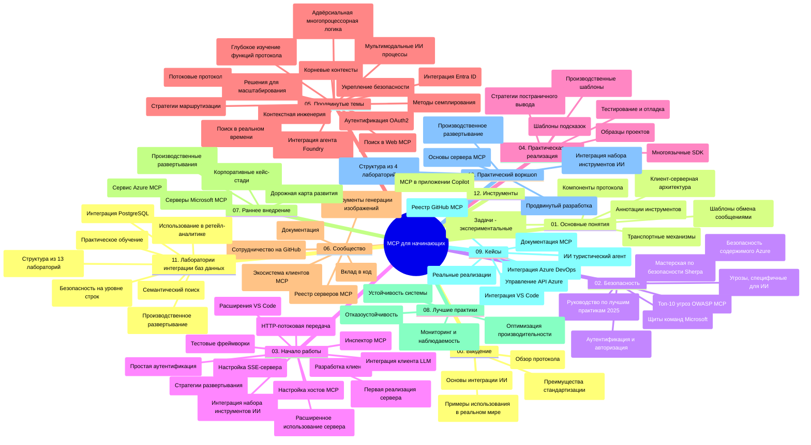

# Протокол Контекста Модели (MCP) для начинающих - Руководство по изучению

Это руководство по изучению предоставляет обзор структуры репозитория и содержимого учебного курса "Протокол Контекста Модели (MCP) для начинающих". Используйте это руководство для эффективной навигации по репозиторию и максимального использования доступных ресурсов.

## Обзор репозитория

Протокол Контекста Модели (MCP) — это стандартизированная структура для взаимодействия между моделями ИИ и клиентскими приложениями. Изначально созданный Anthropic, MCP теперь поддерживается сообществом MCP через официальную организацию на GitHub. Этот репозиторий содержит комплексный учебный курс с практическими примерами кода на C#, Java, JavaScript, Python и TypeScript, предназначенный для разработчиков ИИ, системных архитекторов и инженеров программного обеспечения.

## Визуальная карта учебного курса

## Структура репозитория

Репозиторий организован в двенадцать основных разделов, каждый из которых фокусируется на различных аспектах MCP:

1. **Введение (00-Introduction/)**
   - Обзор Протокола Контекста Модели
   - Почему стандартизация важна в ИИ-пайплайнах
   - Практические примеры использования и преимущества

2. **Основные концепции (01-CoreConcepts/)**
   - Клиент-серверная архитектура
   - Ключевые компоненты протокола
   - Месседжинг паттерны в MCP
   - Взгляд в будущее: [Что меняется в MCP: Release Candidate от 2026-07-28](./01-CoreConcepts/mcp-2026-07-28-release-candidate.md) — безсостояночное ядро протокола, фреймворк расширений и планируемые устаревания Roots/Sampling/Logging в следующей версии спецификации

3. **Безопасность (02-Security/)**
   - Угрозы безопасности в системах на основе MCP
   - Лучшие практики по обеспечению безопасности реализации
   - Стратегии аутентификации и авторизации
   - **Полная документация по безопасности**:
     - MCP Security Best Practices 2025
     - Руководство по реализации Azure Content Safety
     - MCP Security Controls and Techniques
     - Краткая справка по лучшим практикам MCP
   - **Основные темы безопасности**:
     - Атаки внедрения подсказок и отравление инструментов
     - Перехват сессий и проблемы confused deputy
     - Уязвимости обхода токенов
     - Чрезмерные права и контроль доступа
     - Безопасность цепочки поставок для компонентов ИИ
     - Интеграция Microsoft Prompt Shields

4. **Начало работы (03-GettingStarted/)**
   - Настройка среды и конфигурация
   - Создание базовых MCP-серверов и клиентов
   - Интеграция с существующими приложениями
   - Включает разделы:
     - Реализация первого сервера
     - Разработка клиента
     - Интеграция с LLM клиентом
     - Интеграция с VS Code
     - Сервер Server-Sent Events (SSE)
     - Расширенное использование сервера
     - HTTP стриминг
     - Интеграция AI Toolkit
     - Стратегии тестирования
     - Руководство по развертыванию

5. **Практическая реализация (04-PracticalImplementation/)**
   - Использование SDK на разных языках программирования
   - Отладка, тестирование и методы валидации
   - Создание переиспользуемых шаблонов подсказок и рабочих процессов
   - Примеры проектов с реализациями

6. **Продвинутые темы (05-AdvancedTopics/)**
   - Техники инжиниринга контекста
   - Интеграция с Foundry агентом
   - Мультимодальные рабочие процессы ИИ
   - Демонстрации аутентификации OAuth2
   - Возможности поиска в реальном времени
   - Потоковая передача данных в реальном времени
   - Реализация Root контекстов
   - Стратегии маршрутизации
   - Методы сэмплинга
   - Подходы к масштабированию
   - Соображения по безопасности
   - Интеграция с безопасностью Entra ID
   - Интеграция веб-поиска
   - Противодействие многоагентному рассуждению (шаблоны дебатов)

7. **Вклад сообщества (06-CommunityContributions/)**
   - Как вносить вклад в код и документацию
   - Сотрудничество через GitHub
   - Улучшения и обратная связь от сообщества
   - Использование различных клиентов MCP (Claude Desktop, Cline, VSCode)
   - Работа с популярными MCP-серверами, включая генерацию изображений

8. **Уроки раннего внедрения (07-LessonsfromEarlyAdoption/)**
   - Реальные реализации и успешные истории
   - Создание и развертывание решений на базе MCP
   - Тенденции и дорожная карта развития
   - **Руководство по Microsoft MCP серверам**: Полный гид по 10 производственным Microsoft MCP серверам, включая:
     - Microsoft Learn Docs MCP Server
     - Azure MCP Server (15+ специализированных коннекторов)
     - GitHub MCP Server
     - Azure DevOps MCP Server
     - MarkItDown MCP Server
     - SQL Server MCP Server
     - Playwright MCP Server
     - Dev Box MCP Server
     - Microsoft Foundry MCP Server
     - Microsoft 365 Agents Toolkit MCP Server

9. **Лучшие практики (08-BestPractices/)**
   - Настройка производительности и оптимизация
   - Проектирование отказоустойчивых MCP систем
   - Стратегии тестирования и устойчивости

10. **Анализ кейсов (09-CaseStudy/)**
    - **Семь комплексных кейсов**, демонстрирующих универсальность MCP в различных сценариях:
    - **Azure AI Travel Agents**: Оркестрация мультиагентов с Azure OpenAI и AI Search
    - **Интеграция с Azure DevOps**: Автоматизация рабочих процессов с обновлениями данных YouTube
    - **Извлечение документации в реальном времени**: Консольный Python клиент с HTTP стримингом
    - **Интерактивный генератор учебных планов**: Веб-приложение Chainlit с разговорным ИИ
    - **Документация в редакторе**: Интеграция VS Code с рабочими процессами GitHub Copilot
    - **Управление API Azure**: Корпоративная интеграция API с созданием MCP сервера
    - **Реестр MCP GitHub**: Разработка экосистемы и платформа агентной интеграции
    - Примеры реализации охватывают корпоративную интеграцию, производительность разработчиков и развитие экосистемы

11. **Практический воркшоп (10-StreamliningAIWorkflowsBuildingAnMCPServerWithAIToolkit/)**
    - Обширный практический воркшоп, объединяющий MCP с AI Toolkit
    - Создание интеллектуальных приложений, связывающих ИИ-модели с реальными инструментами
    - Практические модули, охватывающие основы, разработку кастомных серверов и стратегии промышленного развертывания
    - **Структура лабораторий**:
      - Лаборатория 1: Основы MCP сервера
      - Лаборатория 2: Продвинутая разработка MCP сервера
      - Лаборатория 3: Интеграция AI Toolkit
      - Лаборатория 4: Промышленное развертывание и масштабирование
    - Подход обучения через лабораторные занятия с пошаговыми инструкциями

12. **Лаборатории интеграции MCP сервера с базой данных (11-MCPServerHandsOnLabs/)**
    - **Всесторонний обучающий путь из 13 лабораторий** по созданию промышленно готовых MCP серверов с интеграцией PostgreSQL
    - **Реализация для розничной аналитики в реальном мире** на примере кейса Zava Retail
    - **Шаблоны корпоративного уровня** включая Row Level Security (RLS), семантический поиск и многоарендный доступ к данным
    - **Полная структура лабораторий**:
      - **Лаборатории 00-03: Основы** — Введение, Архитектура, Безопасность, Настройка среды
      - **Лаборатории 04-06: Построение MCP сервера** — Дизайн базы данных, реализация MCP сервера, разработка инструментов
      - **Лаборатории 07-09: Продвинутые функции** — Семантический поиск, тестирование и отладка, интеграция VS Code
      - **Лаборатории 10-12: Производство и лучшие практики** — Развертывание, мониторинг, оптимизация
    - **Используемые технологии**: FastMCP framework, PostgreSQL, Azure OpenAI, Azure Container Apps, Application Insights
    - **Результаты обучения**: Производственно готовые MCP серверы, паттерны интеграции баз данных, аналитика на базе ИИ, корпоративная безопасность

13. **Инструменты (12-tooling/)**
    - Обучение использованию MCP в приложении Copilot и других инструментах

## Дополнительные ресурсы

В репозитории включены вспомогательные ресурсы:

- **Папка с изображениями**: Содержит диаграммы и иллюстрации, используемые по всему курсу
- **Переводы**: Многоязычная поддержка с автоматическими переводами документации
- **Официальные ресурсы MCP**:
  - [Документация MCP](https://modelcontextprotocol.io/)
  - [Спецификация MCP](https://spec.modelcontextprotocol.io/)
  - [Репозиторий MCP на GitHub](https://github.com/modelcontextprotocol)

## Как использовать этот репозиторий

1. **Последовательное обучение**: Следуйте главам по порядку (от 00 до 11) для структурированного изучения.
2. **Языковая направленность**: Если вас интересует определённый язык программирования, изучайте каталоги образцов с реализациями на предпочитаемом языке.
3. **Практическая реализация**: Начните с раздела "Начало работы", чтобы настроить среду и создать свой первый MCP сервер и клиент.
4. **Продвинутое изучение**: Освоившись с основами, переходите к продвинутым темам для расширения знаний.
5. **Участие в сообществе**: Присоединяйтесь к сообществу MCP через обсуждения на GitHub и каналы Discord, чтобы общаться с экспертами и разработчиками.

## Клиенты и инструменты MCP

Учебный курс охватывает различные клиенты и инструменты MCP:

1. **Официальные клиенты**:
   - Visual Studio Code
   - MCP в Visual Studio Code
   - Claude Desktop
   - Claude в VSCode
   - Claude API

2. **Клиенты сообщества**:
   - Cline (терминальный)
   - Cursor (редактор кода)
   - ChatMCP
   - Windsurf

3. **Инструменты управления MCP**:
   - MCP CLI
   - MCP Manager
   - MCP Linker
   - MCP Router

## Популярные MCP серверы

В репозитории представлены различные MCP серверы, включая:

1. **Официальные Microsoft MCP серверы**:
   - Microsoft Learn Docs MCP Server
   - Azure MCP Server (15+ специализированных коннекторов)
   - GitHub MCP Server
   - Azure DevOps MCP Server
   - MarkItDown MCP Server
   - SQL Server MCP Server
   - Playwright MCP Server
   - Dev Box MCP Server
   - Microsoft Foundry MCP Server
   - Microsoft 365 Agents Toolkit MCP Server

2. **Референсные официальные серверы**:
   - Filesystem
   - Fetch
   - Memory
   - Sequential Thinking

3. **Генерация изображений**:
   - Azure OpenAI DALL-E 3
   - Stable Diffusion WebUI
   - Replicate

4. **Инструменты разработки**:
   - Git MCP
   - Terminal Control
   - Code Assistant

5. **Специализированные серверы**:
   - Salesforce
   - Microsoft Teams
   - Jira & Confluence

## Вклад в проект

Этот репозиторий приветствует вклады сообщества. См. раздел "Вклад сообщества" для инструкций по эффективному внесению вклада в экосистему MCP.

----

*Это руководство по изучению было обновлено 5 февраля 2026 года и отражает последнюю спецификацию MCP 2025-11-25, а также предоставляет обзор содержимого репозитория на эту дату. Содержимое репозитория может обновляться после этой даты.*

*Дополнение (2 июля 2026): урок по Release Candidate спецификации MCP `2026-07-28` добавлен в разделе [01-CoreConcepts](./01-CoreConcepts/mcp-2026-07-28-release-candidate.md); базовая версия курса остаётся 2025-11-25 до выпуска новой спецификации.*

---

<!-- CO-OP TRANSLATOR DISCLAIMER START -->
**Отказ от ответственности**:
Этот документ был переведен с использованием сервиса машинного перевода [Co-op Translator](https://github.com/Azure/co-op-translator). Несмотря на наши усилия по обеспечению точности, имейте в виду, что автоматический перевод может содержать ошибки или неточности. Оригинальный документ на его исходном языке следует считать авторитетным источником. Для получения критически важной информации рекомендуется обратиться к профессиональному человеческому переводу. Мы не несем ответственности за любые недоразумения или неправильные толкования, возникшие в результате использования этого перевода.
<!-- CO-OP TRANSLATOR DISCLAIMER END -->