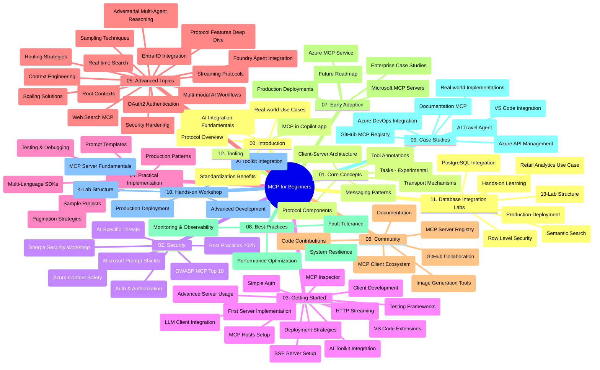

# Протокол Контекста Модели (MCP) для Начинающих - Руководство к изучению

Это руководство по изучению предоставляет обзор структуры и содержания репозитория для учебной программы "Протокол Контекста Модели (MCP) для Начинающих". Используйте это руководство для эффективной навигации по репозиторию и максимального использования доступных ресурсов.

## Обзор Репозитория

Протокол Контекста Модели (MCP) — это стандартизированная платформа для взаимодействия между AI-моделями и клиентскими приложениями. Первоначально созданный компанией Anthropic, MCP в настоящее время поддерживается широким сообществом MCP через официальную организацию на GitHub. Этот репозиторий предоставляет комплексную учебную программу с практическими примерами кода на C#, Java, JavaScript, Python и TypeScript, предназначенную для разработчиков ИИ, архитекторов систем и инженеров-программистов.

## Визуальная Карта Учебной Программы

## Структура Репозитория

Репозиторий организован в двенадцать основных разделов, каждый из которых посвящен различным аспектам MCP:

1. **Введение (00-Introduction/)**
   - Обзор Протокола Контекста Модели
   - Почему стандартизация важна в AI-конвейерах
   - Практические примеры использования и преимущества

2. **Основные Концепции (01-CoreConcepts/)**
   - Клиент-серверная архитектура
   - Ключевые компоненты протокола
   - Шаблоны обмена сообщениями в MCP
   - Текущая спецификация: [Что изменилось в MCP: Спецификация 2026-07-28](./01-CoreConcepts/mcp-2026-07-28.md) — ядро протокола без состояния, фреймворк расширений и устаревание Roots/Sampling/Logging

3. **Безопасность (02-Security/)**
   - Угрозы безопасности в системах на основе MCP
   - Лучшие практики обеспечения безопасности реализаций
   - Стратегии аутентификации и авторизации
   - Практический пример [авторизации CIMD и DCR](./02-Security/samples/cimd-dcr-auth/README.md)
   - **Полная документация по безопасности**:
     - Лучшие практики безопасности MCP
     - Руководство по реализации Azure Content Safety
     - Контроли и технические средства безопасности MCP
     - Быстрая справка по лучшим практикам MCP
   - **Основные темы безопасности**:
     - Атаки с внедрением подсказок и отравлением инструментов
     - Перехват сеанса и проблемы «запутавшегося заместителя»
     - Уязвимости обхода токенов
     - Избыточные разрешения и контроль доступа
     - Безопасность цепочек поставок для компонентов ИИ
     - Интеграция Microsoft Prompt Shields

4. **Начало Работы (03-GettingStarted/)**
   - Настройка окружения и конфигурация
   - Создание базовых MCP серверов и клиентов
   - Интеграция с существующими приложениями
   - Включает разделы по:
     - Первой реализации сервера
     - Разработке клиента
     - Интеграции с LLM клиентом
     - Интеграции VS Code
     - Серверу событий, отправляемых сервером (SSE)
     - Продвинутому использованию сервера
     - HTTP-стримингу
     - Интеграции AI Toolkit
     - Стратегиям тестирования
     - Руководству по развертыванию

5. **Практическая Реализация (04-PracticalImplementation/)**
   - Использование SDK для различных языков программирования
   - Приемы отладки, тестирования и валидации
   - Создание повторно используемых шаблонов подсказок и рабочих процессов
   - Пример проектов с примерами реализации

6. **Расширенные Темы (05-AdvancedTopics/)**
   - Техники инженерии контекста
   - Интеграция агента Foundry
   - Мульти-модальные AI рабочие процессы
   - Демонстрации аутентификации OAuth2
   - Возможности поиска в реальном времени
   - Потоковая передача в реальном времени
   - Реализация корневых контекстов
   - Стратегии маршрутизации
   - Методы выборки
   - Подходы к масштабированию
   - Вопросы безопасности
   - Интеграция безопасности Entra ID
   - Интеграция веб-поиска
   - Противостоящее мультимодальное агентское рассуждение (паттерны дебатов)

7. **Вклад Сообщества (06-CommunityContributions/)**
   - Как вносить код и документацию
   - Сотрудничество через GitHub
   - Совместное развитие улучшений и обратная связь
   - Использование различных MCP клиентов (Claude Desktop, Cline, VSCode)
   - Работа с популярными MCP серверами, включая генерацию изображений

8. **Уроки раннего внедрения (07-LessonsfromEarlyAdoption/)**
   - Реальные реализации и успешные истории
   - Создание и развертывание решений на основе MCP
   - Тенденции и будущее развитие
   - **Руководство по Microsoft MCP серверам**: Полное руководство по 10 производственным серверам Microsoft MCP, включая:
     - Сервер Microsoft Learn Docs MCP
     - Сервер Azure MCP (15+ специализированных коннекторов)
     - Сервер GitHub MCP
     - Сервер Azure DevOps MCP
     - Сервер MarkItDown MCP
     - Сервер SQL Server MCP
     - Сервер Playwright MCP
     - Сервер Dev Box MCP
     - Сервер Microsoft Foundry MCP
     - Сервер Microsoft 365 Agents Toolkit MCP

9. **Лучшие Практики (08-BestPractices/)**
   - Настройка производительности и оптимизация
   - Проектирование отказоустойчивых MCP систем
   - Стратегии тестирования и устойчивости

10. **Кейсы (09-CaseStudy/)**
    - **Семь комплексных кейсов**, демонстрирующих универсальность MCP в различных сценариях:
    - **Azure AI Туристические Агентства**: Оркестровка мультиагентных систем с Azure OpenAI и AI Search
    - **Интеграция Azure DevOps**: Автоматизация рабочих процессов с обновлениями данных YouTube
    - **Извлечение документации в реальном времени**: Python консольный клиент с потоковым HTTP
    - **Генератор интерактивных учебных планов**: Веб-приложение Chainlit с разговорным ИИ
    - **Документация в редакторе**: Интеграция VS Code с рабочими процессами GitHub Copilot
    - **Управление Azure API**: Корпоративная интеграция API с созданием MCP сервера
    - **Реестр GitHub MCP**: Развитие экосистемы и платформа агентной интеграции
    - Примеры реализации в корпоративной интеграции, повышении производительности разработчиков и развитии экосистемы

11. **Практический Семинар (10-StreamliningAIWorkflowsBuildingAnMCPServerWithAIToolkit/)**
    - Всеобъемлющий практический семинар, сочетающий MCP с AI Toolkit
    - Создание интеллектуальных приложений, объединяющих AI-модели с реальными инструментами
    - Практические модули, охватывающие основы, разработку кастомных серверов и стратегии промышленного развертывания
    - **Структура лабораторий**:
      - Лаборатория 1: Основы MCP сервера
      - Лаборатория 2: Продвинутая разработка MCP сервера
      - Лаборатория 3: Интеграция AI Toolkit
      - Лаборатория 4: Промышленное развертывание и масштабирование
    - Подход к обучению через лабораторные работы с пошаговыми инструкциями

12. **Лаборатории интеграции базы MCP сервера (11-MCPServerHandsOnLabs/)**
    - **Комлексный путь из 13 лабораторий** для создания производственных MCP серверов с интеграцией PostgreSQL
    - **Реализация аналитики розничной торговли на примере Zava Retail**
    - **Корпоративные шаблоны**, включая Row Level Security (RLS), семантический поиск и мультиарендный доступ к данным
    - **Полная структура лабораторий**:
      - **Лаборатории 00-03: Основы** — Введение, Архитектура, Безопасность, Настройка окружения
      - **Лаборатории 04-06: Создание MCP сервера** — Проектирование базы данных, Реализация MCP сервера, Разработка инструментов
      - **Лаборатории 07-09: Расширенные функции** — Семантический поиск, Тестирование и отладка, Интеграция VS Code
      - **Лаборатории 10-12: Производство и лучшие практики** — Развертывание, Мониторинг, Оптимизация
    - **Используемые технологии**: FastMCP framework, PostgreSQL, Azure OpenAI, Azure Container Apps, Application Insights
    - **Результаты обучения**: Производственные MCP серверы, паттерны интеграции базы данных, аналитика с ИИ, корпоративная безопасность

13. **Инструментарий (12-tooling/)**
    - Узнайте, как использовать MCP в приложении Copilot и других инструментах

## Дополнительные Ресурсы

Репозиторий содержит поддерживающие ресурсы:

- **Папка изображений**: содержит диаграммы и иллюстрации, используемые в учебной программе
- **Переводы**: поддержка нескольких языков с автоматизированным переводом документации
- **Официальные ресурсы MCP**:
  - [Документация MCP](https://modelcontextprotocol.io/)
  - [Спецификация MCP](https://modelcontextprotocol.io/specification/2026-07-28/)
  - [Репозиторий MCP на GitHub](https://github.com/modelcontextprotocol)

## Как использовать этот репозиторий

1. **Последовательное изучение**: Следуйте главам по порядку (с 00 по 11) для структурированного обучения.
2. **Фокус на конкретном языке**: Если вас интересует конкретный язык программирования, изучайте каталоги с примерами для реализации на предпочитаемом языке.
3. **Практическая реализация**: Начните с раздела "Начало работы", чтобы настроить окружение и создать первый MCP сервер и клиента.
4. **Продвинутое изучение**: После освоения основ углубляйтесь в продвинутые темы для расширения знаний.
5. **Вовлечение сообщества**: Присоединяйтесь к сообществу MCP через обсуждения на GitHub и каналы Discord для общения с экспертами и разработчиками.

## Клиенты и инструменты MCP

Учебная программа охватывает различные клиенты и инструменты MCP:

1. **Официальные клиенты**:
   - Visual Studio Code
   - MCP в Visual Studio Code
   - Claude Desktop
   - Claude в VSCode
   - Claude API

2. **Клиенты сообщества**:
   - Cline (терминальный клиент)
   - Cursor (редактор кода)
   - ChatMCP
   - Windsurf

3. **Инструменты управления MCP**:
   - MCP CLI
   - MCP Manager
   - MCP Linker
   - MCP Router

## Популярные MCP Серверы

Репозиторий представляет различные MCP сервера, в том числе:

1. **Официальные серверы Microsoft MCP**:
   - Сервер Microsoft Learn Docs MCP
   - Сервер Azure MCP (15+ специализированных коннекторов)
   - Сервер GitHub MCP
   - Сервер Azure DevOps MCP
   - Сервер MarkItDown MCP
   - Сервер SQL Server MCP
   - Сервер Playwright MCP
   - Сервер Dev Box MCP
   - Сервер Microsoft Foundry MCP
   - Сервер Microsoft 365 Agents Toolkit MCP

2. **Официальные эталонные серверы**:
   - Файловая система
   - Fetch
   - Память
   - Последовательное мышление

3. **Генерация изображений**:
   - Azure OpenAI DALL-E 3
   - Stable Diffusion WebUI
   - Replicate

4. **Инструменты разработки**:
   - Git MCP
   - Терминальное управление
   - Помощник по коду

5. **Специализированные серверы**:
   - Salesforce
   - Microsoft Teams
   - Jira & Confluence

## Вклад в проект

Этот репозиторий приветствует вклад сообщества. См. раздел "Вклад сообщества" для рекомендаций, как эффективно вносить свой вклад в экосистему MCP.

----

*Это руководство по изучению было обновлено в последний раз 9 сентября 2026 года. Оно отражает
Спецификацию MCP `2026-07-28`, текущую версию протокола. Некоторые практические примеры
остаются явно привязанными к версии `2025-11-25`, в то время как их SDK и инструменты
используют API протокола без состояния.*

---

<!-- CO-OP TRANSLATOR DISCLAIMER START -->
**Отказ от ответственности**:
Этот документ был переведен с использованием сервиса машинного перевода [Co-op Translator](https://github.com/Azure/co-op-translator). Несмотря на наши усилия по обеспечению точности, имейте в виду, что автоматический перевод может содержать ошибки или неточности. Оригинальный документ на его исходном языке следует считать авторитетным источником. Для получения критически важной информации рекомендуется обратиться к профессиональному человеческому переводу. Мы не несем ответственности за любые недоразумения или неправильные толкования, возникшие в результате использования этого перевода.
<!-- CO-OP TRANSLATOR DISCLAIMER END -->