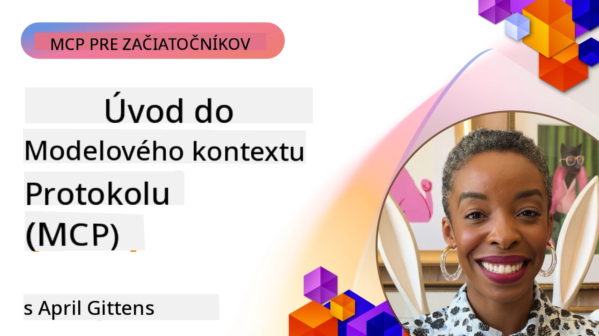
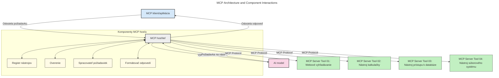
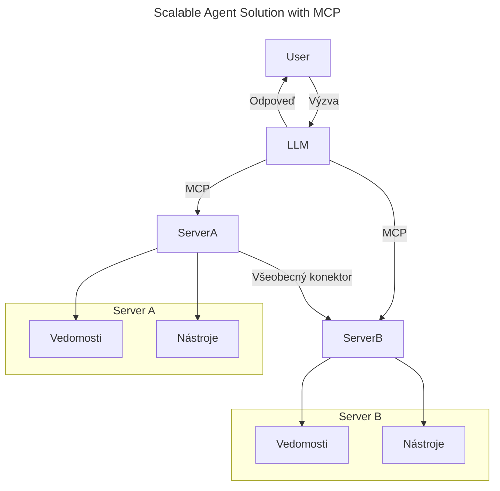
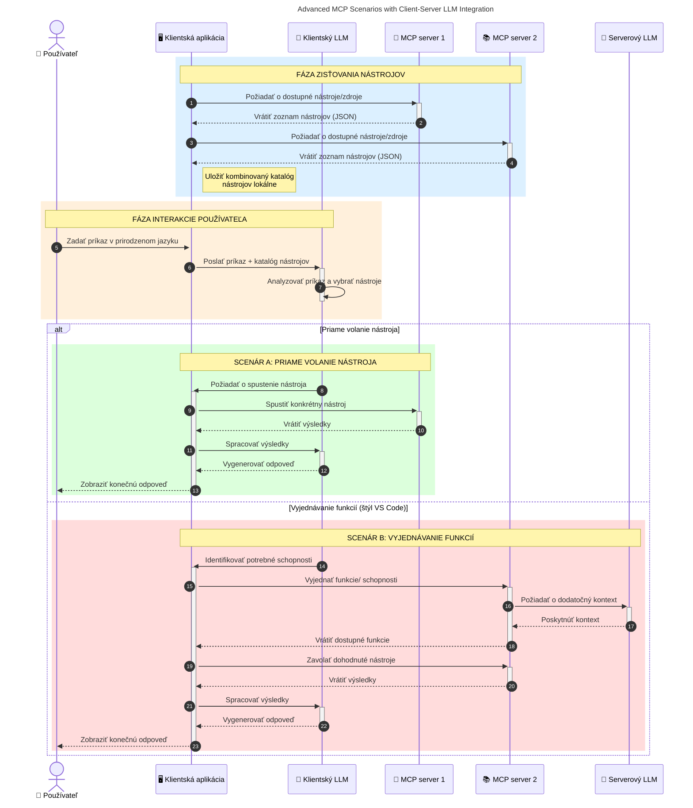

# Úvod do Model Context Protocol (MCP): Prečo je dôležitý pre škálovateľné AI aplikácie

_(Kliknite na obrázok vyššie pre zobrazenie videa tejto lekcie)_

Generatívne AI aplikácie sú skvelým krokom vpred, pretože často umožňujú používateľovi interakciu s aplikáciou pomocou prirodzených jazykových príkazov. Avšak ako je do takýchto aplikácií investovaný viac času a zdrojov, chcete mať istotu, že môžete jednoducho integrovať funkcie a zdroje tak, aby bolo jednoduché ich rozširovať, aby vaša aplikácia vedela obslúžiť viac ako jeden model a zvládnuť rôzne špecifiká modelov. Skrátka, budovanie Gen AI aplikácií je na začiatku jednoduché, ale ako rastú a stávajú sa komplexnejšie, musíte začať definovať architektúru a pravdepodobne sa spoľahnúť na štandard, ktorý zabezpečí, že vaše aplikácie budú vytvorené konzistentným spôsobom. Tu prichádza MCP, ktorý veci organizuje a poskytuje štandard.

---

## **🔍 Čo je Model Context Protocol (MCP)?**

**Model Context Protocol (MCP)** je **otvorený, štandardizovaný rozhranie**, ktoré umožňuje veľkým jazykovým modelom (LLM) plynulo komunikovať s externými nástrojmi, API a zdrojmi dát. Poskytuje konzistentnú architektúru na rozšírenie funkčnosti AI modelov nad rámec ich tréningových dát, umožňujúc inteligentnejšie, škálovateľné a citlivejšie AI systémy.

---

## **🎯 Prečo je štandardizácia v AI dôležitá**

S rastúcou komplexnosťou generatívnych AI aplikácií je nevyhnutné prijať štandardy, ktoré zabezpečia **škálovateľnosť, rozšíriteľnosť, udržiavateľnosť** a **zabránia závislosti na konkrétnych dodávateľoch**. MCP rieši tieto potreby tým, že:

- Zjednocuje integrácie model-nástroj
- Znižuje krehké, jednorazové vlastné riešenia
- Umožňuje existenciu viacerých modelov od rôznych dodávateľov v jednom ekosystéme

**Poznámka:** Hoci MCP sa prezentuje ako otvorený štandard, neplánuje sa jeho štandardizácia prostredníctvom existujúcich štandardizačných organizácií ako IEEE, IETF, W3C, ISO alebo iných.

---

## **📚 Ciele učenia**

Na konci tohto článku budete schopní:

- Definovať **Model Context Protocol (MCP)** a jeho prípady použitia
- Pochopiť, ako MCP štandardizuje komunikáciu medzi modelom a nástrojmi
- Identifikovať základné komponenty architektúry MCP
- Preskúmať reálne použitia MCP v podnikateľských a vývojových kontextoch

---

## **💡 Prečo je Model Context Protocol (MCP) revolučný**

### **🔗 MCP rieši fragmentáciu v interakciách AI**

Pred MCP vyžadovala integrácia modelov s nástrojmi:

- Vlastný kód pre každú dvojicu nástroj-model
- Neštandardné API pre každého dodávateľa
- Časté prerušenia kvôli aktualizáciám
- Slabú škálovateľnosť s rastúcim počtom nástrojov

### **✅ Výhody štandardizácie MCP**

| **Výhoda**              | **Popis**                                                                |
|--------------------------|-------------------------------------------------------------------------|
| Interoperabilita         | LLM pracujú bezproblémovo s nástrojmi od rôznych dodávateľov            |
| Konzistentnosť           | Jednotné správanie na platformách a medzi nástrojmi                      |
| Opätovná použiteľnosť    | Nástroje vytvorené raz možno použiť v rôznych projektoch a systémoch    |
| Urýchlenie vývoja        | Skrátenie času vývoja vďaka použitiu štandardizovaných plug-and-play rozhraní |

---

## **🧱 Prehľad architektúry MCP na vysokej úrovni**

MCP nasleduje **klient-server model**, kde:

- **MCP Hostitelia** prevádzkujú AI modely
- **MCP Klienti** iniciujú požiadavky
- **MCP Servery** poskytujú kontext, nástroje a schopnosti

### **Kľúčové komponenty:**

- **Zdroje** – statické alebo dynamické dáta pre modely  
- **Výzvy (Prompts)** – preddefinované pracovné postupy na riadenú generáciu  
- **Nástroje** – spustiteľné funkcie ako vyhľadávanie, výpočty  
- **Sampling** – agentické správanie cez opakujúce sa interakcie (zastarané v
    MCP `2026-07-28`; nové implementácie by mali priamo integrovať poskytovateľa LLM)

- **Elicitation** – požiadavky na vstup používateľa iniciované serverom
- **Roots** – informačné umiestnenia v súborovom systéme relevantné pre server
    (zastarané v MCP `2026-07-28`; uprednostňujte parametre nástrojov, URI zdrojov alebo
    konfiguráciu servera)

### **Architektúra protokolu:**

MCP používa dvojvrstvovú architektúru:
- **Dátová vrstva**: správy JSON-RPC 2.0, metadáta na požiadavku, objavovanie a
    základné protokolové prvky
- **Transportná vrstva**: stdio pre lokálne podprocesy a Streamable HTTP pre
    vzdialené servery. Streamable HTTP môže použiť SSE rámovanie pre streamované odpovede,
    ale starší HTTP+SSE transport je zastaraný.

---

## Ako fungujú MCP servery

MCP servery fungujú nasledovne:

- **Tok požiadaviek**:
    1. Požiadavku iniciuje koncový používateľ alebo softvér pôsobiaci v jeho mene.
    2. **MCP Klient** pošle požiadavku na **MCP Hostiteľa**, ktorý spravuje runtime AI modelu.
    3. **AI model** dostane používateľskú výzvu a môže žiadať prístup k externým nástrojom alebo dátam cez jedno alebo viac volaní nástrojov.
    4. **MCP Hostiteľ**, nie priamo model, komunikuje so zodpovedajúcim **MCP Serverom(y)** pomocou štandardizovaného protokolu.
- **Funkcionalita MCP Hostiteľa**:
    - **Registrácia nástrojov**: udržiava katalóg dostupných nástrojov a ich schopností.
    - **Overovanie**: preveruje oprávnenia na prístup k nástrojom.
    - **Spracovateľ požiadaviek**: spracúva prichádzajúce požiadavky na nástroje od modelu.
    - **Formátovač odpovedí**: štruktúruje výstupy nástrojov do formátu zrozumiteľného modelu.
- **Spustenie MCP Servera**:
    - **MCP Hostiteľ** smeruje volania nástrojov na jeden alebo viac **MCP Serverov**, z ktorých každý poskytuje špecializované funkcie (napr. vyhľadávanie, výpočty, databázové dotazy).
    - **MCP Servery** vykonávajú príslušné operácie a vracajú výsledky **MCP Hostiteľovi** v konzistentnom formáte.
    - **MCP Hostiteľ** formátuje a odovzdáva výsledky AI modelu.
- **Dokončenie odpovede**:
    - **AI model** zahrnie výstupy nástrojov do finálnej odpovede.
    - **MCP Hostiteľ** odošle túto odpoveď späť **MCP Klientovi**, ktorý ju doručí koncovému používateľovi alebo volajúcemu softvéru.
    

## 👨‍💻 Ako vybudovať MCP server (s príkladmi)

MCP servery umožňujú rozšíriť schopnosti LLM poskytovaním dát a funkcií. 

Pripravení vyskúšať? Tu sú jazykovo a stackovo špecifické SDK s príkladmi vytvorenia jednoduchých MCP serverov v rôznych jazykoch/stackoch:

- **Python SDK**: https://github.com/modelcontextprotocol/python-sdk

- **TypeScript SDK**: https://github.com/modelcontextprotocol/typescript-sdk

- **Java SDK**: https://github.com/modelcontextprotocol/java-sdk

- **C#/.NET SDK**: https://github.com/modelcontextprotocol/csharp-sdk

## 🌍 Reálne použitia MCP

MCP umožňuje širokú škálu aplikácií rozšírením schopností AI:

| **Aplikácia**              | **Popis**                                                                |
|------------------------------|-------------------------------------------------------------------------|
| Integrácia podnikových dát   | Pripojenie LLM k databázam, CRM alebo interným nástrojom                |
| Agentické AI systémy         | Povolenie autonómnych agentov s prístupom k nástrojom a pracovným tokom rozhodovania       |
| Multimodálne aplikácie       | Kombinácia textových, obrazových a audio nástrojov v jednotnej AI aplikácii |
| Integrácia dát v reálnom čase | Prinášanie živých dát do AI interakcií pre presnejšie, aktuálne odpovede |

### 🧠 MCP = Univerzálny štandard pre AI interakcie

Model Context Protocol (MCP) pôsobí ako univerzálny štandard pre AI interakcie, podobne ako USB-C štandardizoval fyzické pripojenia zariadení. Vo svete AI poskytuje MCP konzistentné rozhranie, ktoré umožňuje modelom (klientom) bezproblémovú integráciu s externými nástrojmi a poskytovateľmi dát (servermi). Tým sa eliminuje potreba rôznych vlastných protokolov pre každé API alebo zdroj dát.

V rámci MCP dodržiava nástroj kompatibilný s MCP (označovaný ako MCP server) jednotný štandard. Tieto servery môžu uviesť nástroje alebo akcie, ktoré ponúkajú, a vykonávať tieto akcie na požiadanie AI agenta. Platformy AI agentov podporujúce MCP sú schopné zistiť dostupné nástroje zo serverov a vyvolať ich cez tento štandardizovaný protokol.

### 💡 Uľahčuje prístup k poznatkom

Okrem poskytovania nástrojov MCP tiež uľahčuje prístup k vedomostiam. Umožňuje aplikáciám poskytovať kontext veľkým jazykovým modelom (LLM) prepojením s rôznymi zdrojmi dát. Napríklad MCP server môže predstavovať dokumentačný archív spoločnosti, čo umožní agentom na požiadanie získavať relevantné informácie. Iný server môže spracovávať konkrétne akcie ako odosielanie emailov alebo aktualizáciu záznamov. Z pohľadu agenta sú to jednoducho nástroje, ktoré môže používať – niektoré nástroje vracajú dáta (poznatkový kontext), iné vykonávajú akcie. MCP oba prípady efektívne spravuje.

Agent pripájajúci sa k MCP serveru sa automaticky naučí dostupné schopnosti servera a prístupné dáta cez štandardný formát. Táto štandardizácia umožňuje dynamickú dostupnosť nástrojov. Napríklad pridaním nového MCP servera do systému agenta sú jeho funkcie okamžite použiteľné bez nutnosti ďalšej prispôsobivosti agentových inštrukcií.

Táto zjednodušená integrácia zodpovedá toku znázornenému na nasledujúcom diagrame, kde servery poskytujú nástroje aj vedomosti, čím zabezpečujú hladkú spoluprácu medzi systémami. 

### 👉 Príklad: Škálovateľné riešenie agenta

Univerzálny konektor umožňuje MCP serverom komunikovať a zdieľať schopnosti medzi sebou, čo umožňuje ServerA delegovať úlohy ServerB alebo pristupovať k jeho nástrojom a vedomostiam. Toto federuje nástroje a dáta medzi servermi a podporuje škálovateľné a modulárne agentové architektúry. Pretože MCP štandardizuje vystavenie nástrojov, agenti môžu dynamicky zisťovať a smerovať požiadavky medzi servermi bez pevne zakódovaných integrácií.

Federácia nástrojov a vedomostí: Nástroje a dáta je možné pristupovať naprieč servermi, čo umožňuje škálovateľnejšie a modulárnejšie agentické architektúry.

### 🔄 Pokročilé scénare MCP s integráciou LLM na strane klienta

Okrem základnej architektúry MCP existujú pokročilé scénare, kde klient aj server obsahujú LLM, čo umožňuje sofistikovanejšie interakcie. Na nasledujúcom diagrame môže byť **Klientská aplikácia** IDE so sériou MCP nástrojov dostupných na použitie LLM používateľom:

## 🔐 Praktické výhody MCP

Tu sú praktické výhody použitia MCP:

- **Aktuálnosť**: Modely môžu pristupovať k aktuálnym informáciám mimo svojich tréningových dát
- **Rozšírenie schopností**: Modely môžu využiť špecializované nástroje na úlohy, na ktoré neboli trénované
- **Zníženie halucinácií**: Externé zdroje dát poskytujú faktické základy
- **Súkromie**: Citlivé dáta môžu zostať v zabezpečenom prostredí namiesto toho, aby boli zabudované vo výzvach (prompts)

## 📌 Kľúčové zhrnutie

Nasledujúce body sú kľúčovými poznatkami pri použití MCP:

- **MCP** štandardizuje spôsob, akým AI modely komunikujú s nástrojmi a dátami
- Podporuje **rozšíriteľnosť, konzistentnosť a interoperabilitu**
- MCP pomáha **skrátiť čas vývoja, zlepšiť spoľahlivosť a rozšíriť schopnosti modelov**
- Klient-server architektúra **umožňuje flexibilné, rozšíriteľné AI aplikácie**

## 🧠 Cvičenie

Zamyslite sa nad AI aplikáciou, ktorú by ste chceli vytvoriť.

- Aké **externé nástroje alebo dáta** by mohli rozšíriť jej schopnosti?
- Ako by mohol MCP uľahčiť integráciu a zvýšiť jej spoľahlivosť?

## Dodatočné zdroje

- [MCP GitHub Repository](https://github.com/modelcontextprotocol)

## Čo bude ďalej

Ďalej: [Kapitola 1: Základné koncepty](../01-CoreConcepts/README.md)

---

<!-- CO-OP TRANSLATOR DISCLAIMER START -->
**Vyhlásenie o zodpovednosti**:
Tento dokument bol preložený pomocou AI prekladateľskej služby [Co-op Translator](https://github.com/Azure/co-op-translator). Hoci sa snažíme o presnosť, vezmite prosím na vedomie, že automatické preklady môžu obsahovať chyby alebo nepresnosti. Pôvodný dokument v jeho natívnom jazyku by mal byť považovaný za autoritatívny zdroj. Pre kritické informácie sa odporúča profesionálny ľudský preklad. Nie sme zodpovední za žiadne nedorozumenia alebo nesprávne interpretácie vyplývajúce z použitia tohto prekladu.
<!-- CO-OP TRANSLATOR DISCLAIMER END -->