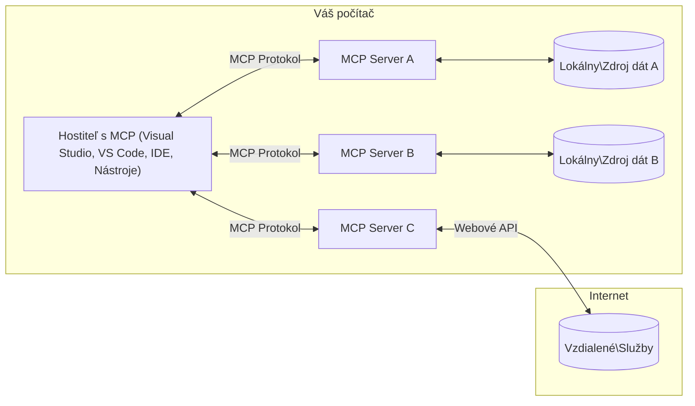

# MCP Core Concepts: Ovládnutie Model Context Protocol pre integráciu AI

[](https://youtu.be/earDzWGtE84)

_(Kliknite na obrázok vyššie pre zobrazenie videa tejto lekcie)_

[Model Context Protocol (MCP)](https://github.com/modelcontextprotocol) je výkonný, štandardizovaný rámec, ktorý optimalizuje komunikáciu medzi veľkými jazykovými modelmi (LLM) a externými nástrojmi, aplikáciami a zdrojmi dát.  
Tento sprievodca vás prevedie základnými konceptmi MCP. Naučíte sa o jeho architektúre klient-server, základných komponentoch, mechanizmoch komunikácie a najlepších postupoch implementácie.

- **Explicitný súhlas používateľa**: Všetky prístupy k dátam a operácie vyžadujú explicitné schválenie používateľa pred vykonaním. Používatelia musia jasne rozumieť, aké dáta budú prístupné a aké akcie budú vykonané, s detailnou kontrolou oprávnení a autorizácií.

- **Ochrana súkromia dát**: Dáta používateľa sú sprístupnené len s explicitným súhlasom a musia byť chránené robustnými kontrolami prístupu počas celého životného cyklu interakcie. Implementácie musia zabrániť neoprávnenému prenosu dát a udržiavať prísne hranice súkromia.

- **Bezpečnosť vykonávania nástrojov**: Každé vyvolanie nástroja vyžaduje explicitný súhlas používateľa s jasným pochopením funkčnosti nástroja, parametrov a potenciálneho dopadu. Robustné bezpečnostné hranice musia zabrániť neúmyselnému, nebezpečnému alebo škodlivému vykonaniu nástroja.

- **Bezpečnosť transportnej vrstvy**: Všetky komunikačné kanály by mali používať vhodné mechanizmy šifrovania a autentifikácie. Vzdialené pripojenia by mali implementovať bezpečné transportné protokoly a správu poverení.

#### Pokyny na implementáciu:

- **Správa oprávnení**: Implementujte jemnozrnné systémy oprávnení, ktoré umožnia používateľom kontrolovať, ktoré servery, nástroje a zdroje sú prístupné  
- **Autentifikácia a autorizácia**: Používajte bezpečné metódy autentifikácie (OAuth, API kľúče) s riadnou správou tokenov a ich expirácie  
- **Validácia vstupov**: Validujte všetky parametre a vstupy dát podľa definovaných schém, aby ste zabránili injekčným útokom  
- **Auditné záznamy**: Vedenie komplexných záznamov všetkých operácií pre bezpečnostné monitorovanie a súlad

## Prehľad

Táto lekcia skúma základnú architektúru a komponenty, ktoré tvoria ekosystém Model Context Protocol (MCP). Naučíte sa o architektúre klient-server, kľúčových komponentoch a mechanizmoch komunikácie, ktoré poháňajú interakcie MCP.

## Kľúčové vzdelávacie ciele

Na konci tejto lekcie budete:

- Rozumieť architektúre klient-server MCP.  
- Identifikovať úlohy a zodpovednosti Hostiteľov, Klientov a Serverov.  
- Analyzovať základné vlastnosti, ktoré robia MCP flexibilnou integračnou vrstvou.  
- Naučiť sa, ako informácie prúdia v ekosystéme MCP.  
- Získať praktické poznatky prostredníctvom príkladov kódu v .NET, Java, Python a JavaScript.

## Architektúra MCP: Hlbší pohľad

Ekosystém MCP je postavený na modeli klient-server. Táto modulárna štruktúra umožňuje AI aplikáciám efektívne komunikovať s nástrojmi, databázami, API a kontextovými zdrojmi. Rozoberme túto architektúru na jej základné komponenty.

V jadre MCP nasleduje architektúru klient-server, kde hostiteľská aplikácia môže pripojiť k viacerým serverom:


- **MCP Hostitelia**: Programy ako VSCode, Claude Desktop, IDE alebo AI nástroje, ktoré chcú pristupovať k dátam cez MCP  
- **MCP Klienti**: Protokoloví klienti, ktorí udržiavajú 1:1 spojenia so servermi  
- **MCP Servery**: Ľahké programy, ktoré každý vystavujú špecifické schopnosti cez štandardizovaný Model Context Protocol  
- **Lokálne zdroje dát**: Súbory, databázy a služby vášho počítača, ku ktorým môžu MCP servery bezpečne pristupovať  
- **Vzdialené služby**: Externé systémy dostupné cez internet, ku ktorým sa MCP servery môžu pripojiť cez API.

Protokol MCP je vyvíjajúci sa štandard používajúci dátumové verzovanie (formát RRRR-MM-DD). Aktuálna verzia protokolu je **2025-11-25**. Najnovšie aktualizácie nájdete v [špecifikácii protokolu](https://modelcontextprotocol.io/specification/2025-11-25/)

### 1. Hostitelia

V Model Context Protocol (MCP) sú **Hostitelia** AI aplikácie, ktoré slúžia ako primárne rozhranie, cez ktoré používatelia interagujú s protokolom. Hostitelia koordinujú a spravujú pripojenia k viacerým MCP serverom vytváraním vyhradených MCP klientov pre každé serverové pripojenie. Príklady Hostiteľov zahŕňajú:

- **AI aplikácie**: Claude Desktop, Visual Studio Code, Claude Code  
- **Vývojové prostredia**: IDE a editory kódu s integráciou MCP  
- **Vlastné aplikácie**: Účelovo vytvorení AI agenti a nástroje

**Hostitelia** sú aplikácie, ktoré koordinujú interakcie s AI modelmi. Oni:

- **Orchestrujú AI modely**: Vykonávajú alebo interagujú s LLM na generovanie odpovedí a koordináciu AI pracovných tokov  
- **Spravujú klientské pripojenia**: Vytvárajú a udržiavajú jedného MCP klienta na každé MCP serverové pripojenie  
- **Riadiace používateľské rozhranie**: Spravujú tok konverzácie, používateľské interakcie a prezentáciu odpovedí  
- **Vynucujú bezpečnosť**: Kontrolujú oprávnenia, bezpečnostné obmedzenia a autentifikáciu  
- **Spravujú súhlas používateľa**: Riadia schválenie používateľa pre zdieľanie dát a vykonávanie nástrojov

### 2. Klienti

**Klienti** sú základné komponenty, ktoré udržiavajú vyhradené jedno-na-jedno spojenia medzi Hostiteľmi a MCP servermi. Každý MCP klient je vytvorený Hostiteľom na pripojenie k špecifickému MCP serveru, čím zabezpečuje organizované a bezpečné komunikačné kanály. Viac klientov umožňuje Hostiteľom pripojiť sa k viacerým serverom súčasne.

**Klienti** sú konektorové komponenty v rámci hostiteľskej aplikácie. Oni:

- **Protokolová komunikácia**: Posielajú JSON-RPC 2.0 požiadavky serverom s promptmi a inštrukciami  
- **Vyjednávanie schopností**: Vyjednávajú podporované funkcie a verzie protokolu so servermi počas inicializácie  
- **Vykonávanie nástrojov**: Spravujú požiadavky na vykonanie nástrojov od modelov a spracovávajú odpovede  
- **Aktualizácie v reálnom čase**: Spracovávajú notifikácie a aktualizácie zo serverov  
- **Spracovanie odpovedí**: Spracovávajú a formátujú odpovede serverov pre zobrazenie používateľom

### 3. Servery

**Servery** sú programy, ktoré poskytujú kontext, nástroje a schopnosti MCP klientom. Môžu bežať lokálne (na rovnakom stroji ako Hostiteľ) alebo vzdialene (na externých platformách) a sú zodpovedné za spracovanie požiadaviek klientov a poskytovanie štruktúrovaných odpovedí. Servery vystavujú špecifickú funkcionalitu cez štandardizovaný Model Context Protocol.

**Servery** sú služby, ktoré poskytujú kontext a schopnosti. Oni:

- **Registrácia funkcií**: Registrujú a vystavujú dostupné primitívy (zdroje, prompty, nástroje) klientom  
- **Spracovanie požiadaviek**: Prijímajú a vykonávajú volania nástrojov, požiadavky na zdroje a prompty od klientov  
- **Poskytovanie kontextu**: Poskytujú kontextové informácie a dáta na zlepšenie odpovedí modelu  
- **Správa stavu**: Udržiavajú stav relácie a spracovávajú stavové interakcie podľa potreby  
- **Notifikácie v reálnom čase**: Posielajú notifikácie o zmenách schopností a aktualizáciách pripojeným klientom

Servery môžu vyvíjať ľubovoľní vývojári na rozšírenie schopností modelu špecializovanou funkcionalitou a podporujú lokálne aj vzdialené nasadenie.

### 4. Serverové primitívy

Servery v Model Context Protocol (MCP) poskytujú tri základné **primitívy**, ktoré definujú fundamentálne stavebné bloky pre bohaté interakcie medzi klientmi, hostiteľmi a jazykovými modelmi. Tieto primitívy špecifikujú typy kontextových informácií a akcií dostupných cez protokol.

MCP servery môžu vystaviť ľubovoľnú kombináciu nasledujúcich troch základných primítív:

#### Zdroje

**Zdroje** sú dátové zdroje, ktoré poskytujú kontextové informácie AI aplikáciám. Reprezentujú statický alebo dynamický obsah, ktorý môže zlepšiť porozumenie modelu a rozhodovanie:

- **Kontextové dáta**: Štruktúrované informácie a kontext pre spotrebu AI modelom  
- **Znalostné bázy**: Repozitáre dokumentov, články, manuály a výskumné práce  
- **Lokálne zdroje dát**: Súbory, databázy a informácie o lokálnom systéme  
- **Externé dáta**: Odpovede API, webové služby a dáta vzdialených systémov  
- **Dynamický obsah**: Dáta v reálnom čase, ktoré sa aktualizujú podľa vonkajších podmienok

Zdroje sú identifikované URI a podporujú vyhľadávanie cez metódy `resources/list` a získavanie cez `resources/read`:

```text
file://documents/project-spec.md
database://production/users/schema
api://weather/current
```

#### Prompty

**Prompty** sú znovupoužiteľné šablóny, ktoré pomáhajú štruktúrovať interakcie s jazykovými modelmi. Poskytujú štandardizované vzory interakcie a šablónové pracovné toky:

- **Interakcie založené na šablónach**: Predštruktúrované správy a začiatky konverzácií  
- **Šablóny pracovných tokov**: Štandardizované sekvencie pre bežné úlohy a interakcie  
- **Príklady few-shot**: Šablóny založené na príkladoch pre inštrukcie modelu  
- **Systémové prompty**: Základné prompty, ktoré definujú správanie a kontext modelu  
- **Dynamické šablóny**: Parametrizované prompty, ktoré sa prispôsobujú špecifickým kontextom

Prompty podporujú substitúciu premenných a môžu byť vyhľadávané cez `prompts/list` a získavané cez `prompts/get`:

```markdown
Generate a {{task_type}} for {{product}} targeting {{audience}} with the following requirements: {{requirements}}
```

#### Nástroje

**Nástroje** sú vykonateľné funkcie, ktoré môžu AI modely vyvolať na vykonanie špecifických akcií. Reprezentujú „slovesá“ ekosystému MCP, umožňujú modelom interagovať s externými systémami:

- **Vykonateľné funkcie**: Diskrétne operácie, ktoré môžu modely vyvolať s konkrétnymi parametrami  
- **Integrácia externých systémov**: Volania API, dotazy do databáz, operácie so súbormi, výpočty  
- **Jedinečná identita**: Každý nástroj má jedinečný názov, popis a schému parametrov  
- **Štruktúrovaný vstup/výstup**: Nástroje prijímajú validované parametre a vracajú štruktúrované, typované odpovede  
- **Akčné schopnosti**: Umožňujú modelom vykonávať reálne akcie a získavať živé dáta

Nástroje sú definované pomocou JSON schémy pre validáciu parametrov a sú vyhľadávané cez `tools/list` a vykonávané cez `tools/call`:

```typescript
server.tool(
  "search_products", 
  {
    query: z.string().describe("Search query for products"),
    category: z.string().optional().describe("Product category filter"),
    max_results: z.number().default(10).describe("Maximum results to return")
  }, 
  async (params) => {
    // Vykonajte vyhľadávanie a vráťte štruktúrované výsledky
    return await productService.search(params);
  }
);
```

## Klientské primitívy

V Model Context Protocol (MCP) môžu **klienti** vystavovať primitívy, ktoré umožňujú serverom žiadať o ďalšie schopnosti od hostiteľskej aplikácie. Tieto klientské primitívy umožňujú bohatšie, interaktívnejšie implementácie serverov, ktoré môžu pristupovať k schopnostiam AI modelu a používateľským interakciám.

### Sampling

**Sampling** umožňuje serverom žiadať dokončenia jazykového modelu z AI aplikácie klienta. Táto primitíva umožňuje serverom pristupovať k schopnostiam LLM bez potreby vkladať vlastné závislosti modelu:

- **Nezávislý prístup k modelu**: Servery môžu žiadať dokončenia bez zahrnutia SDK LLM alebo správy prístupu k modelu  
- **Serverom iniciovaná AI**: Umožňuje serverom autonómne generovať obsah pomocou AI modelu klienta  
- **Rekurzívne LLM interakcie**: Podporuje zložité scenáre, kde servery potrebujú AI asistenciu na spracovanie  
- **Dynamická generácia obsahu**: Umožňuje serverom vytvárať kontextové odpovede pomocou modelu hostiteľa

Sampling sa iniciuje cez metódu `sampling/complete`, kde servery posielajú požiadavky na dokončenie klientom.

### Elicitation

**Elicitation** umožňuje serverom žiadať ďalšie informácie alebo potvrdenie od používateľov cez klientské rozhranie:

- **Žiadosti o vstup používateľa**: Servery môžu žiadať ďalšie informácie, keď sú potrebné pre vykonanie nástroja  
- **Potvrdzovacie dialógy**: Žiadať schválenie používateľa pre citlivé alebo významné operácie  
- **Interaktívne pracovné toky**: Umožniť serverom vytvárať krok za krokom používateľské interakcie  
- **Dynamické zhromažďovanie parametrov**: Zbierať chýbajúce alebo voliteľné parametre počas vykonávania nástroja

Žiadosti o elicitation sa robia pomocou metódy `elicitation/request` na zber vstupu používateľa cez rozhranie klienta.

### Logging

**Logging** umožňuje serverom posielať štruktúrované logovacie správy klientom pre ladenie, monitorovanie a operačnú viditeľnosť:

- **Podpora ladenia**: Umožniť serverom poskytovať detailné logy vykonávania pre riešenie problémov  
- **Operačné monitorovanie**: Posielať klientom stavové aktualizácie a metriky výkonu  
- **Hlásenie chýb**: Poskytovať detailný kontext chýb a diagnostické informácie  
- **Auditné stopy**: Vytvárať komplexné záznamy operácií a rozhodnutí servera

Logovacie správy sa posielajú klientom na zabezpečenie transparentnosti operácií servera a uľahčenie ladenia.

## Tok informácií v MCP

Model Context Protocol (MCP) definuje štruktúrovaný tok informácií medzi hostiteľmi, klientmi, servermi a modelmi. Pochopenie tohto toku pomáha objasniť, ako sa spracovávajú požiadavky používateľov a ako sa externé nástroje a dáta integrujú do odpovedí modelu.

- **Hostiteľ iniciuje pripojenie**  
  Hostiteľská aplikácia (napr. IDE alebo chat rozhranie) nadviaže spojenie s MCP serverom, typicky cez STDIO, WebSocket alebo iný podporovaný transport.

- **Vyjednávanie schopností**  
  Klient (vložený v hostiteľovi) a server si vymieňajú informácie o podporovaných funkciách, nástrojoch, zdrojoch a verziách protokolu. To zabezpečuje, že obe strany rozumejú, aké schopnosti sú dostupné pre reláciu.

- **Používateľská požiadavka**  
  Používateľ interaguje s hostiteľom (napr. zadá prompt alebo príkaz). Hostiteľ zhromaždí tento vstup a odovzdá ho klientovi na spracovanie.

- **Použitie zdroja alebo nástroja**  
  - Klient môže žiadať ďalší kontext alebo zdroje zo servera (napr. súbory, záznamy v databáze alebo články zo znalostnej bázy) na obohatenie porozumenia modelu.  
  - Ak model určí, že je potrebný nástroj (napr. na získanie dát, vykonanie výpočtu alebo volanie API), klient pošle serveru požiadavku na vyvolanie nástroja, špecifikujúc názov nástroja a parametre.

- **Vykonanie serverom**  
  Server prijme požiadavku na zdroj alebo nástroj, vykoná potrebné operácie (napr. spustenie funkcie, dotaz do databázy alebo získanie súboru) a vráti výsledky klientovi v štruktúrovanom formáte.

- **Generovanie odpovede**  
  Klient integruje odpovede servera (dáta zo zdrojov, výstupy nástrojov atď.) do prebiehajúcej interakcie s modelom. Model použije tieto informácie na vytvorenie komplexnej a kontextovo relevantnej odpovede.

- **Prezentácia výsledku**  
  Hostiteľ prijme finálny výstup od klienta a zobrazí ho používateľovi, často vrátane generovaného textu modelu a výsledkov vykonaných nástrojov alebo vyhľadávania zdrojov.

Tento tok umožňuje MCP podporovať pokročilé, interaktívne a kontextovo uvedomelé AI aplikácie tým, že bezproblémovo prepája modely s externými nástrojmi a zdrojmi dát.

## Architektúra protokolu a vrstvy

MCP pozostáva z dvoch odlišných architektonických vrstiev, ktoré spolupracujú na poskytovaní kompletného komunikačného rámca:

### Dátová vrstva

**Dátová vrstva** implementuje jadro protokolu MCP pomocou **JSON-RPC 2.0** ako základ. Táto vrstva definuje štruktúru správ, sémantiku a vzory interakcie:

#### Základné komponenty:

- **JSON-RPC 2.0 protokol**: Všetka komunikácia používa štandardizovaný formát správ JSON-RPC 2.0 pre volania metód, odpovede a notifikácie
- **Správa životného cyklu**: Rieši inicializáciu pripojenia, vyjednávanie schopností a ukončenie relácie medzi klientmi a servermi
- **Serverové primitíva**: Umožňujú serverom poskytovať základnú funkcionalitu prostredníctvom nástrojov, zdrojov a výziev
- **Klientské primitíva**: Umožňujú serverom žiadať o vzorkovanie z LLM, vyvolať vstup používateľa a odosielať logovacie správy
- **Notifikácie v reálnom čase**: Podporuje asynchrónne notifikácie pre dynamické aktualizácie bez potreby opakovaného dotazovania

#### Kľúčové vlastnosti:

- **Vyjednávanie verzie protokolu**: Používa verziu založenú na dátume (RRRR-MM-DD) na zabezpečenie kompatibility
- **Objavovanie schopností**: Klienti a servery si počas inicializácie vymieňajú informácie o podporovaných funkciách
- **Stavové relácie**: Udržiava stav pripojenia naprieč viacerými interakciami pre kontinuitu kontextu

### Transportná vrstva

**Transportná vrstva** spravuje komunikačné kanály, rámcovanie správ a autentifikáciu medzi účastníkmi MCP:

#### Podporované transportné mechanizmy:

1. **STDIO transport**:
   - Používa štandardné vstupné/výstupné prúdy pre priamu komunikáciu procesov
   - Optimálne pre lokálne procesy na rovnakom stroji bez sieťovej záťaže
   - Bežne používané pre lokálne implementácie MCP serverov

2. **Streamovateľný HTTP transport**:
   - Používa HTTP POST pre správy klient → server  
   - Voliteľné Server-Sent Events (SSE) pre streamovanie server → klient
   - Umožňuje komunikáciu so vzdialenými servermi cez siete
   - Podporuje štandardnú HTTP autentifikáciu (bearer tokeny, API kľúče, vlastné hlavičky)
   - MCP odporúča OAuth pre bezpečnú autentifikáciu založenú na tokenoch

#### Abstrakcia transportu:

Transportná vrstva abstrahuje detaily komunikácie od dátovej vrstvy, čo umožňuje rovnaký formát správ JSON-RPC 2.0 naprieč všetkými transportnými mechanizmami. Táto abstrakcia umožňuje aplikáciám plynulo prepínať medzi lokálnymi a vzdialenými servermi.

### Bezpečnostné úvahy

Implementácie MCP musia dodržiavať niekoľko kľúčových bezpečnostných princípov, aby zabezpečili bezpečné, dôveryhodné a zabezpečené interakcie vo všetkých operáciách protokolu:

- **Súhlas a kontrola používateľa**: Používatelia musia poskytnúť výslovný súhlas pred prístupom k akýmkoľvek údajom alebo vykonaním operácií. Mali by mať jasnú kontrolu nad tým, aké údaje sa zdieľajú a ktoré akcie sú autorizované, podporené intuitívnym používateľským rozhraním na prezeranie a schvaľovanie aktivít.

- **Ochrana súkromia údajov**: Údaje používateľa by mali byť sprístupnené len s výslovným súhlasom a musia byť chránené vhodnými prístupovými kontrolami. Implementácie MCP musia zabrániť neoprávnenému prenosu údajov a zabezpečiť, že súkromie je zachované počas všetkých interakcií.

- **Bezpečnosť nástrojov**: Pred vyvolaním akéhokoľvek nástroja je potrebný výslovný súhlas používateľa. Používatelia by mali mať jasné pochopenie funkčnosti každého nástroja a musia byť vynútené robustné bezpečnostné hranice, aby sa zabránilo neúmyselnému alebo nebezpečnému spusteniu nástrojov.

Dodržiavaním týchto bezpečnostných princípov MCP zabezpečuje dôveru používateľov, ochranu súkromia a bezpečnosť vo všetkých interakciách protokolu, pričom umožňuje silné AI integrácie.

## Príklady kódu: Kľúčové komponenty

Nižšie sú uvedené príklady kódu v niekoľkých populárnych programovacích jazykoch, ktoré ilustrujú, ako implementovať kľúčové komponenty MCP servera a nástroje.

### Príklad .NET: Vytvorenie jednoduchého MCP servera s nástrojmi

Tu je praktický príklad kódu v .NET, ktorý demonštruje, ako implementovať jednoduchý MCP server s vlastnými nástrojmi. Tento príklad ukazuje, ako definovať a registrovať nástroje, spracovať požiadavky a pripojiť server pomocou Model Context Protocol.

```csharp
using System;
using System.Threading.Tasks;
using ModelContextProtocol.Server;
using ModelContextProtocol.Server.Transport;
using ModelContextProtocol.Server.Tools;

public class WeatherServer
{
    public static async Task Main(string[] args)
    {
        // Create an MCP server
        var server = new McpServer(
            name: "Weather MCP Server",
            version: "1.0.0"
        );
        
        // Register our custom weather tool
        server.AddTool<string, WeatherData>("weatherTool", 
            description: "Gets current weather for a location",
            execute: async (location) => {
                // Call weather API (simplified)
                var weatherData = await GetWeatherDataAsync(location);
                return weatherData;
            });
        
        // Connect the server using stdio transport
        var transport = new StdioServerTransport();
        await server.ConnectAsync(transport);
        
        Console.WriteLine("Weather MCP Server started");
        
        // Keep the server running until process is terminated
        await Task.Delay(-1);
    }
    
    private static async Task<WeatherData> GetWeatherDataAsync(string location)
    {
        // This would normally call a weather API
        // Simplified for demonstration
        await Task.Delay(100); // Simulate API call
        return new WeatherData { 
            Temperature = 72.5,
            Conditions = "Sunny",
            Location = location
        };
    }
}

public class WeatherData
{
    public double Temperature { get; set; }
    public string Conditions { get; set; }
    public string Location { get; set; }
}
```

### Príklad Java: Komponenty MCP servera

Tento príklad demonštruje rovnaký MCP server a registráciu nástrojov ako vyššie uvedený príklad .NET, ale implementovaný v Jave.

```java
import io.modelcontextprotocol.server.McpServer;
import io.modelcontextprotocol.server.McpToolDefinition;
import io.modelcontextprotocol.server.transport.StdioServerTransport;
import io.modelcontextprotocol.server.tool.ToolExecutionContext;
import io.modelcontextprotocol.server.tool.ToolResponse;

public class WeatherMcpServer {
    public static void main(String[] args) throws Exception {
        // Vytvorte MCP server
        McpServer server = McpServer.builder()
            .name("Weather MCP Server")
            .version("1.0.0")
            .build();
            
        // Zaregistrujte nástroj počasia
        server.registerTool(McpToolDefinition.builder("weatherTool")
            .description("Gets current weather for a location")
            .parameter("location", String.class)
            .execute((ToolExecutionContext ctx) -> {
                String location = ctx.getParameter("location", String.class);
                
                // Získajte údaje o počasí (zjednodušené)
                WeatherData data = getWeatherData(location);
                
                // Vráťte formátovanú odpoveď
                return ToolResponse.content(
                    String.format("Temperature: %.1f°F, Conditions: %s, Location: %s", 
                    data.getTemperature(), 
                    data.getConditions(), 
                    data.getLocation())
                );
            })
            .build());
        
        // Pripojte server pomocou stdio transportu
        try (StdioServerTransport transport = new StdioServerTransport()) {
            server.connect(transport);
            System.out.println("Weather MCP Server started");
            // Udržujte server bežiaci, kým nie je proces ukončený
            Thread.currentThread().join();
        }
    }
    
    private static WeatherData getWeatherData(String location) {
        // Implementácia by volala API počasia
        // Zjednodušené pre účely príkladu
        return new WeatherData(72.5, "Sunny", location);
    }
}

class WeatherData {
    private double temperature;
    private String conditions;
    private String location;
    
    public WeatherData(double temperature, String conditions, String location) {
        this.temperature = temperature;
        this.conditions = conditions;
        this.location = location;
    }
    
    public double getTemperature() {
        return temperature;
    }
    
    public String getConditions() {
        return conditions;
    }
    
    public String getLocation() {
        return location;
    }
}
```

### Príklad Python: Vytváranie MCP servera

Tento príklad používa fastmcp, preto si ho najprv nainštalujte:

```python
pip install fastmcp
```
Ukážka kódu:

```python
#!/usr/bin/env python3
import asyncio
from fastmcp import FastMCP
from fastmcp.transports.stdio import serve_stdio

# Vytvorte server FastMCP
mcp = FastMCP(
    name="Weather MCP Server",
    version="1.0.0"
)

@mcp.tool()
def get_weather(location: str) -> dict:
    """Gets current weather for a location."""
    return {
        "temperature": 72.5,
        "conditions": "Sunny",
        "location": location
    }

# Alternatívny prístup pomocou triedy
class WeatherTools:
    @mcp.tool()
    def forecast(self, location: str, days: int = 1) -> dict:
        """Gets weather forecast for a location for the specified number of days."""
        return {
            "location": location,
            "forecast": [
                {"day": i+1, "temperature": 70 + i, "conditions": "Partly Cloudy"}
                for i in range(days)
            ]
        }

# Zaregistrujte nástroje triedy
weather_tools = WeatherTools()

# Spustite server
if __name__ == "__main__":
    asyncio.run(serve_stdio(mcp))
```

### Príklad JavaScript: Vytvorenie MCP servera

Tento príklad ukazuje vytvorenie MCP servera v JavaScripte a ako zaregistrovať dva nástroje súvisiace s počasím.

```javascript
// Použitie oficiálneho Model Context Protocol SDK
import { McpServer } from "@modelcontextprotocol/sdk/server/mcp.js";
import { StdioServerTransport } from "@modelcontextprotocol/sdk/server/stdio.js";
import { z } from "zod"; // Pre overenie parametrov

// Vytvorte MCP server
const server = new McpServer({
  name: "Weather MCP Server",
  version: "1.0.0"
});

// Definujte nástroj počasia
server.tool(
  "weatherTool",
  {
    location: z.string().describe("The location to get weather for")
  },
  async ({ location }) => {
    // Toto by normálne volalo API počasia
    // Zjednodušené pre demonštráciu
    const weatherData = await getWeatherData(location);
    
    return {
      content: [
        { 
          type: "text", 
          text: `Temperature: ${weatherData.temperature}°F, Conditions: ${weatherData.conditions}, Location: ${weatherData.location}` 
        }
      ]
    };
  }
);

// Definujte nástroj predpovede
server.tool(
  "forecastTool",
  {
    location: z.string(),
    days: z.number().default(3).describe("Number of days for forecast")
  },
  async ({ location, days }) => {
    // Toto by normálne volalo API počasia
    // Zjednodušené pre demonštráciu
    const forecast = await getForecastData(location, days);
    
    return {
      content: [
        { 
          type: "text", 
          text: `${days}-day forecast for ${location}: ${JSON.stringify(forecast)}` 
        }
      ]
    };
  }
);

// Pomocné funkcie
async function getWeatherData(location) {
  // Simulovať volanie API
  return {
    temperature: 72.5,
    conditions: "Sunny",
    location: location
  };
}

async function getForecastData(location, days) {
  // Simulovať volanie API
  return Array.from({ length: days }, (_, i) => ({
    day: i + 1,
    temperature: 70 + Math.floor(Math.random() * 10),
    conditions: i % 2 === 0 ? "Sunny" : "Partly Cloudy"
  }));
}

// Pripojte server pomocou stdio transportu
const transport = new StdioServerTransport();
server.connect(transport).catch(console.error);

console.log("Weather MCP Server started");
```

Tento JavaScriptový príklad demonštruje, ako vytvoriť MCP klienta, ktorý sa pripojí k serveru, odošle výzvu a spracuje odpoveď vrátane všetkých volaní nástrojov, ktoré boli vykonané.

## Bezpečnosť a autorizácia

MCP obsahuje niekoľko vstavaných konceptov a mechanizmov na správu bezpečnosti a autorizácie počas celého protokolu:

1. **Kontrola povolení nástrojov**:  
  Klienti môžu špecifikovať, ktoré nástroje môže model počas relácie používať. To zabezpečuje, že sú prístupné len explicitne autorizované nástroje, čím sa znižuje riziko neúmyselných alebo nebezpečných operácií. Povolenia môžu byť konfigurované dynamicky na základe preferencií používateľa, organizačných politík alebo kontextu interakcie.

2. **Autentifikácia**:  
  Servery môžu vyžadovať autentifikáciu pred udelením prístupu k nástrojom, zdrojom alebo citlivým operáciám. Môže ísť o API kľúče, OAuth tokeny alebo iné autentifikačné schémy. Správna autentifikácia zabezpečuje, že len dôveryhodní klienti a používatelia môžu vyvolávať schopnosti na strane servera.

3. **Validácia**:  
  Validácia parametrov je vynútená pre všetky volania nástrojov. Každý nástroj definuje očakávané typy, formáty a obmedzenia pre svoje parametre a server overuje prichádzajúce požiadavky podľa toho. To zabraňuje tomu, aby do implementácií nástrojov prenikol nesprávny alebo škodlivý vstup a pomáha udržiavať integritu operácií.

4. **Obmedzovanie rýchlosti (Rate Limiting)**:  
  Aby sa predišlo zneužitiu a zabezpečilo spravodlivé využívanie serverových zdrojov, MCP servery môžu implementovať obmedzovanie rýchlosti pre volania nástrojov a prístup k zdrojom. Obmedzenia môžu byť aplikované na používateľa, reláciu alebo globálne a pomáhajú chrániť pred útokmi typu denial-of-service alebo nadmerným využívaním zdrojov.

Kombináciou týchto mechanizmov MCP poskytuje bezpečný základ pre integráciu jazykových modelov s externými nástrojmi a zdrojmi dát, pričom používateľom a vývojárom dáva jemnozrnnú kontrolu nad prístupom a používaním.

## Správy protokolu a tok komunikácie

Komunikácia MCP používa štruktúrované správy **JSON-RPC 2.0** na uľahčenie jasných a spoľahlivých interakcií medzi hostiteľmi, klientmi a servermi. Protokol definuje špecifické vzory správ pre rôzne typy operácií:

### Základné typy správ:

#### **Inicializačné správy**
- **`initialize` požiadavka**: Zriaďuje pripojenie a vyjednáva verziu protokolu a schopnosti
- **`initialize` odpoveď**: Potvrdzuje podporované funkcie a informácie o serveri  
- **`notifications/initialized`**: Signalizuje, že inicializácia je dokončená a relácia je pripravená

#### **Objavovacie správy**
- **`tools/list` požiadavka**: Objavuje dostupné nástroje na serveri
- **`resources/list` požiadavka**: Zoznam dostupných zdrojov (dátových zdrojov)
- **`prompts/list` požiadavka**: Získava dostupné šablóny výziev

#### **Výkonné správy**  
- **`tools/call` požiadavka**: Vykonáva konkrétny nástroj s poskytnutými parametrami
- **`resources/read` požiadavka**: Získava obsah z konkrétneho zdroja
- **`prompts/get` požiadavka**: Načíta šablónu výzvy s voliteľnými parametrami

#### **Správy na strane klienta**
- **`sampling/complete` požiadavka**: Server žiada klienta o dokončenie LLM
- **`elicitation/request`**: Server žiada používateľský vstup cez klientské rozhranie
- **Logovacie správy**: Server odosiela štruktúrované logovacie správy klientovi

#### **Notifikačné správy**
- **`notifications/tools/list_changed`**: Server informuje klienta o zmenách v nástrojoch
- **`notifications/resources/list_changed`**: Server informuje klienta o zmenách v zdrojoch  
- **`notifications/prompts/list_changed`**: Server informuje klienta o zmenách v šablónach výziev

### Štruktúra správ:

Všetky správy MCP dodržiavajú formát JSON-RPC 2.0 s:
- **Požiadavkové správy**: Obsahujú `id`, `method` a voliteľné `params`
- **Odpoveďové správy**: Obsahujú `id` a buď `result` alebo `error`  
- **Notifikačné správy**: Obsahujú `method` a voliteľné `params` (bez `id` a bez očakávanej odpovede)

Táto štruktúrovaná komunikácia zabezpečuje spoľahlivé, sledovateľné a rozšíriteľné interakcie podporujúce pokročilé scenáre ako aktualizácie v reálnom čase, reťazenie nástrojov a robustné spracovanie chýb.

## Kľúčové poznatky

- **Architektúra**: MCP používa klient-server architektúru, kde hostitelia spravujú viacero klientskych pripojení k serverom
- **Účastníci**: Ekosystém zahŕňa hostiteľov (AI aplikácie), klientov (protokolové konektory) a servery (poskytovatelia schopností)
- **Transportné mechanizmy**: Komunikácia podporuje STDIO (lokálne) a streamovateľný HTTP s voliteľným SSE (vzdialené)
- **Základné primitíva**: Servery vystavujú nástroje (vykonávateľné funkcie), zdroje (dátové zdroje) a výzvy (šablóny)
- **Klientské primitíva**: Servery môžu žiadať vzorkovanie (LLM dokončenia), vyvolanie (vstup používateľa) a logovanie od klientov
- **Základ protokolu**: Postavený na JSON-RPC 2.0 s verziou založenou na dátume (aktuálna: 2025-11-25)
- **Schopnosti v reálnom čase**: Podporuje notifikácie pre dynamické aktualizácie a synchronizáciu v reálnom čase
- **Bezpečnosť na prvom mieste**: Výslovný súhlas používateľa, ochrana súkromia údajov a bezpečný transport sú základné požiadavky

## Cvičenie

Navrhnite jednoduchý MCP nástroj, ktorý by bol užitočný vo vašej oblasti. Definujte:
1. Ako by sa nástroj volal
2. Aké parametre by prijímal
3. Aký výstup by vracal
4. Ako by model mohol tento nástroj použiť na riešenie problémov používateľa


---

## Čo ďalej

Ďalej: [Kapitola 2: Bezpečnosť](../02-Security/README.md)

---

<!-- CO-OP TRANSLATOR DISCLAIMER START -->
**Zrieknutie sa zodpovednosti**:
Tento dokument bol preložený pomocou AI prekladateľskej služby [Co-op Translator](https://github.com/Azure/co-op-translator). Aj keď sa snažíme o presnosť, majte prosím na pamäti, že automatizované preklady môžu obsahovať chyby alebo nepresnosti. Pôvodný dokument v jeho rodnom jazyku by mal byť považovaný za autoritatívny zdroj. Pre kritické informácie sa odporúča profesionálny ľudský preklad. Nie sme zodpovední za akékoľvek nedorozumenia alebo nesprávne interpretácie vyplývajúce z použitia tohto prekladu.
<!-- CO-OP TRANSLATOR DISCLAIMER END -->