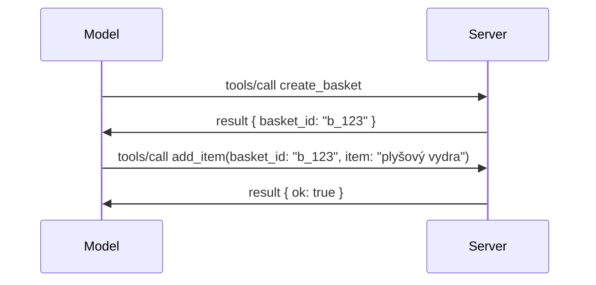

# Čo sa zmenilo v MCP: Špecifikácia 2026-07-28

> **Stav:** Finálna. Špecifikácia MCP `2026-07-28` bola vydaná 28. júla 2026
> a je aktuálnou revíziou protokolu. Táto lekcia popisuje finálnu
> špecifikáciu. Niektoré príklady z kurikula zostávajú explicitne verzionované na
> `2025-11-25`, pretože ich SDK ešte neprevzali nové bezstavové API;
> tieto príklady považujte za usmernenia pre kompatibilitu so staršou verziou.

## Prehľad

`2026-07-28` je najväčšia revízia MCP od jeho spustenia. Šesť
návrhov na vylepšenie špecifikácie (SEP) odstraňuje protokolové relácie a
robí MCP bezstavovým na transportnej vrstve, rozšírenia sa stávajú prvotriednym,
verzionovaným mechanizmom a niekoľko funkcií pokrytých skôr v tomto kurikule
(Roots, Sampling, Logging) je v rámci novej životnej politiky zastaralých. Táto
lekcia sumarizuje, čo sa zmenilo, prečo je to dôležité a čo to znamená pre kód
písaný na základe `2025-11-25`.

Zdroj: [The 2026-07-28 MCP Specification Release Candidate](https://blog.modelcontextprotocol.io/posts/2026-07-28-release-candidate/) (Model Context Protocol Blog, David Soria Parra a Den Delimarsky).

## Ciele učenia

Na konci tejto lekcie budete schopní:

- Vysvetliť, prečo MCP prechádza na bezstavové jadro protokolu a aký problém to rieši pri horizontálne škálovaných nasadeniach.
- Opísať, ako sú nahradené handshake `initialize`/`initialized` a hlavička `Mcp-Session-Id`.
- Identifikovať nové hlavičky `Mcp-Method` a `Mcp-Name` a metaúdaje pre kešovanie `ttlMs`/`cacheScope`.
- Rozpoznať rámec rozšírení a dve rozšírenia dodávané s týmto vydaním: MCP Apps a Tasks.
- Zhrnúť spevnenie autorizácie a zastaranie Dynamic Client Registration.

- Identifikovať, ktoré jadrové funkcie (Roots, Sampling, Logging) sú teraz zastaralé a čo to znamená v praxi.
- Vysvetliť zmenu Full JSON Schema 2020-12 pre nástroj `inputSchema`/`outputSchema`.

## Bezstavový protokol

Hlavná zmena: MCP sa stáva bezstavovým na úrovni protokolu.

### Predtým (2025-11-25): relácie vás viažu na jednu inštanciu servera

Zavolanie nástroja cez Streamable HTTP začína handshake `initialize`. Server odpovie hlavičkou `Mcp-Session-Id`, ktorú musí každý následný požiadavok obsahovať:

```http
POST /mcp HTTP/1.1
Mcp-Session-Id: 1868a90c-3a3f-4f5b
Content-Type: application/json

{"jsonrpc":"2.0","id":2,"method":"tools/call",
 "params":{"name":"search","arguments":{"q":"otters"}}}
```

Pretože relácia je viazaná na ktorúkoľvek inštanciu servera, ktorá ju vytvorila, horizontálne škálované nasadenia potrebujú **sticky routing** na load balanceri a **zdielané ukladanie relácií** medzi inštanciami.

### Potom (2026-07-28): každý požiadavok je samostatný

```http
POST /mcp HTTP/1.1
MCP-Protocol-Version: 2026-07-28
Mcp-Method: tools/call
Mcp-Name: search
Content-Type: application/json

{"jsonrpc":"2.0","id":1,"method":"tools/call",
 "params":{"name":"search","arguments":{"q":"otters"},
           "_meta":{"io.modelcontextprotocol/protocolVersion":"2026-07-28",
                    "io.modelcontextprotocol/clientInfo":{"name":"my-app","version":"1.0"},
                    "io.modelcontextprotocol/clientCapabilities":{}}}}
```

Každá inštancia servera môže tento požiadavok spracovať. Kľúčové zmeny:

- **Handshake `initialize`/`initialized` je odstránený** ([SEP-2575](https://github.com/modelcontextprotocol/modelcontextprotocol/pull/2575)). Verzia protokolu, informácie o klientovi a schopnosti klienta sa prenášajú v `_meta` pri každom požiadavku. Nová metóda `server/discover` umožňuje klientovi získať schopnosti servera predom, keď ich potrebuje.
- **Hlavička `Mcp-Session-Id` a protokolová relácia sú odstránené** ([SEP-2567](https://github.com/modelcontextprotocol/modelcontextprotocol/pull/2567)). Sticky routing a zdielané ukladanie relácií už nie sú na úrovni protokolu potrebné.

### Bezstavový protokol, stavové aplikácie

Odstránenie protokolovej relácie neznamená, že váš server nemôže byť stavový. Odporúčaný vzor je rovnaký, aký používajú HTTP API: vytvorte explicitný identifikátor (napr. `basket_id`, `browser_id`) z jedného volania nástroja a model ho neskôr posiela späť ako bežný argument.



Tým sa stav stáva viditeľný a pre model rozumný, namiesto toho, aby bol skrytý v transportných metaúdajoch, a umožňuje každej inštancii servera spracovať akékoľvek volanie.

### Požiadavky zo servera na klienta, preštruktúrované

Bezstavový protokol stále potrebuje spôsob, ako server môže požiadať klienta o niečo počas volania (napríklad výzvu na doplnenie údajov):

- **Požiadavky iniciované serverom môžu byť vydávané iba počas aktívneho spracovania požiadavku klienta** ([SEP-2260](https://github.com/modelcontextprotocol/modelcontextprotocol/pull/2260)) — predtým odporúčanie, teraz povinné. Používateľ nie je vyzývaný nečakane.
- **Multi Round-Trip Requests** ([SEP-2322](https://github.com/modelcontextprotocol/modelcontextprotocol/pull/2322)) nahradzujú držanie otvoreného SSE streamu. Namiesto toho server vráti `InputRequiredResult`:

  ```json
  {
    "resultType": "input_required",
    "inputRequests": {
      "confirm": {
        "type": "elicitation",
        "message": "Delete 3 files?",
        "schema": { "type": "boolean" }
      }
    },
    "requestState": "eyJzdGVwIjoxLCJmaWxlcyI6WyJhIiwiYiIsImMiXX0="
  }
  ```

  Klient zhromažďuje odpovede a opätovne vykoná pôvodné volanie s `inputResponses` plus echo `requestState`. Každá inštancia servera môže spracovať retry, pretože všetko potrebné je v už odoslanom obsahu.

### Směrovatelný, kešovateľný, sledovateľný

Tri menšie zmeny uľahčujú prevádzku bezstavovej komunikácie:

- **Hlavičky `Mcp-Method` a `Mcp-Name` sú povinné na Streamable HTTP** ([SEP-2243](https://github.com/modelcontextprotocol/modelcontextprotocol/pull/2243)), aby load balancery, brány a rate limitery mohli smerovať podľa operácie bez potreby kontroly JSON tela. Servery odmietajú požiadavky, kde hlavičky a telo nezhodujú.
- **`tools/list` a výsledky čítania zdrojov nesú `ttlMs` a `cacheScope`** ([SEP-2549](https://github.com/modelcontextprotocol/modelcontextprotocol/pull/2549)), modelované podľa HTTP `Cache-Control`. Klienti vedia, ako dlho je výsledok zoznamu čerstvý a či je bezpečné ho zdieľať medzi používateľmi, bez potreby dlhodobého SSE streamu na získanie zmien.
- **Šírenie W3C Trace Context v `_meta` je zdokumentované** ([SEP-414](https://github.com/modelcontextprotocol/modelcontextprotocol/pull/414)), opravujúce názvy kľúčov `traceparent`, `tracestate` a `baggage`, takže distribuovaný tras má možnosť sledovať volanie cez klientské SDK, MCP server a následné systémy v backendu kompatibilnom s [OpenTelemetry](https://opentelemetry.io/).

## Rozšírenia sa stávajú prvotriednymi

Rozšírenia existovali neformálne v `2025-11-25`. [SEP-2133](https://github.com/modelcontextprotocol/modelcontextprotocol/pull/2133) ich formalizuje:

- Rozšírenia sú identifikované pomocou ID vo formáte reverzného DNS.
- Jednajú sa o ne prostredníctvom mapy `extensions` v klientskych a serverových schopnostiach.
- Žijú vo vlastných repozitároch `ext-*` s delegovanými správcami a verzionujú sa nezávisle od jadra špecifikácie.
- Nový Extensions Track v procese SEP im dáva cestu od experimentálneho po oficiálne rozšírenie.

Toto vydanie obsahuje dve oficiálne rozšírenia.

### MCP Apps: serverom renderované užívateľské rozhrania

[MCP Apps](https://blog.modelcontextprotocol.io/posts/2026-01-26-mcp-apps/) ([SEP-1865](https://github.com/modelcontextprotocol/modelcontextprotocol/pull/1865)) umožňuje serverom odosielať interaktívne HTML rozhrania, ktoré hostia vykreslia v sandboxovanom iframe. Nástroje deklarujú svoje UI šablóny vopred, takže hostia ich môžu prednačítať, kešovať a zabezpečene skontrolovať pred spustením. Už ste prešli základmi v [Lekcii 15: MCP Apps](../03-GettingStarted/15-mcp-apps/README.md) — v rámci rámca rozšírení sú MCP Apps teraz formálne rozšírením, nie experimentálnou jadrovou funkciou.

### Tasks postupuje na rozšírenie

Tasks boli dodané ako experimentálna jadrová funkcia v `2025-11-25`. Produkčné použitie odhalilo potrebu redizajnu, preto je správnym domovom rozšírenie: [Tasks rozšírenie](https://github.com/modelcontextprotocol/modelcontextprotocol/pull/2663) prepracováva životný cyklus bezstavového modelu — server môže odpovedať na `tools/call` s úchopom úlohy a klient ho posúva ďalej s `tasks/get`, `tasks/update` a `tasks/cancel`. Vytváranie úloh je riadené serverom: klient deklaruje rozšírenie a server rozhoduje, kedy má byť volanie vykonané ako úloha. `tasks/list` je úplne odstránený, pretože nie je možné ho bezpečne ohraničiť bez relácií.

> **Poznámka k migrácii:** ak ste implementovali experimentálne API Tasks `2025-11-25`, budete musieť prejsť na nový životný cyklus rozšírenia — nie je spätne kompatibilný.

## Spevnenie autorizácie

Niekoľko SEPs sprísňuje
[špecifikáciu autorizácie](https://modelcontextprotocol.io/specification/2026-07-28/basic/authorization)
tak, aby lepšie zodpovedala reálnym nasadeniam OAuth 2.0 / OpenID Connect:

| SEP | Zmena |
|---|---|
| [SEP-2468](https://github.com/modelcontextprotocol/modelcontextprotocol/pull/2468) | Klienti musia validovať parameter `iss` v autorizáčných odpovediach podľa [RFC 9207](https://www.rfc-editor.org/rfc/rfc9207), čím sa zmierňuje zmätok, bežný v MCP modeli s jedným klientom a mnohými servermi. Budúca verzia bude vyžadovať odmietnuť odpovede bez `iss`. |
| [SEP-837](https://github.com/modelcontextprotocol/modelcontextprotocol/pull/837) | Kompatibilitné klienty Dynamic Client Registration deklarujú svoj OpenID Connect `application_type`, čím sa vyhýbajú nesprávnym predvoleným hodnotám `"web"` pre desktopové a CLI klienty. |
| [SEP-2352](https://github.com/modelcontextprotocol/modelcontextprotocol/pull/2352) | Kompatibilitné registrované poverenia sú viazané na `issuer` vydávajúceho autorizačného servera; klienti sa pre-registrujú, ak zdroj migruje. |
| [SEP-2207](https://github.com/modelcontextprotocol/modelcontextprotocol/pull/2207) | Dokumentuje spôsob požiadavky obnovovacích tokenov od autorizačných serverov štýlu OpenID Connect. |
| [SEP-2350](https://github.com/modelcontextprotocol/modelcontextprotocol/pull/2350) | Vyjasňuje kumuláciu rozsahov počas autorizácie s vyššou úrovňou. |
| [SEP-2351](https://github.com/modelcontextprotocol/modelcontextprotocol/pull/2351) | Vyjasňuje príponu .well-known pre vyhľadávanie. |

Ak vytvárate autorizačný server pre MCP, poskytnite `iss` v autorizáčných
odpovediach a riaďte sa finálnou autorizáčnou špecifikáciou. Pozrite si
[02-Security](../02-Security/README.md) pre implementačné pokyny.

Dynamic Client Registration zostáva dostupná pre kompatibilitu, ale je
tiež zastaraná v `2026-07-28`. Nové implementácie by mali používať Client ID Metadata
dokumenty.

## Zastaralé funkcie

Pod novou
[politikou životného cyklu funkcie](https://github.com/modelcontextprotocol/modelcontextprotocol/pull/2577),
sú Roots, Sampling, Logging a Dynamic Client Registration **zastaralé**:

| Funkcia | Odporúčaná náhrada |
|---|---|
| Roots | Parametre nástroja, URI zdrojov alebo konfigurácia servera |
| Sampling | Priama integrácia s API poskytovateľov LLM |
| Logging | `stderr` pre stdio transporty; OpenTelemetry pre štruktúrované sledovanie |
| Dynamic Client Registration | Dokumenty s metadátami Client ID |

Tieto funkcie zostávajú v `2026-07-28` pre kompatibilitu. Sú vhodné na
odstránenie pri prvej revízii špecifikácie vydanej po 28. júli 2027;
reálne odstránenie môže nastať neskôr. Nové implementácie by mali použiť
vyššie uvedené náhradné vzory.

## Plný JSON Schema 2020-12 pre nástroje

Nástrojové `inputSchema` a `outputSchema` sú rozšírené na plné [JSON Schema 2020-12](https://json-schema.org/draft/2020-12) ([SEP-2106](https://github.com/modelcontextprotocol/modelcontextprotocol/pull/2106)):

- Vstupné schémy si ponechávajú koreňové obmedzenie `type: "object"`, no teraz umožňujú kompozíciu (`oneOf`, `anyOf`, `allOf`), podmienky a odkazy (`$ref`, `$defs`).
- Výstupné schémy sú neobmedzené a `structuredContent` môže byť teraz akákoľvek JSON hodnota, nie len objekt.
- Implementácie nesmú automaticky dereferencovať externé `$ref` URI a mali by obmedziť hĺbku schémy a čas validácie (údaj proti DoS útokom, ktorý treba brať do úvahy pri serverovej validácii).

Samostatne sa kód chyby pre chýbajúci zdroj mení z MCP vlastného `-32002` na JSON-RPC štandard `-32602` (Invalid Params) ([SEP-2164](https://github.com/modelcontextprotocol/modelcontextprotocol/pull/2164)). Ak váš klient rozpoznáva doslovne hodnotu `-32002`, bude potrebné ho aktualizovať.

## Ako sa protokol bude vyvíjať ďalej

Toto vydanie obsahuje zlomiace zmeny, ktoré správcovia MCP neplánujú, aby boli bežné v budúcnosti. Tri riadiace SEPs majú zabrániť ich opakovaniu:

- **Politika životného cyklu funkcií** dáva každej funkcii cestu Aktívne → Zastarané → Odstránené s aspoň dvanásťmesačnou lehotou medzi zastaraním a možným odstránením.
- **Rámec rozšírení** umožňuje novým schopnostiam vyvíjať sa ako voliteľné rozšírenia a stabilizovať sa tam pred tým, než (ak vôbec) sa presunú do jadra špecifikácie.
- SEP zo štandardizačnej vetvy už nemôže dosiahnuť finálny status, kým zodpovedajúci scenár nepribudne do [konformnej sady](https://github.com/modelcontextprotocol/conformance) ([SEP-2484](https://github.com/modelcontextprotocol/modelcontextprotocol/pull/2484)) — tej istej sady, ktorou oficiálne SDK hodnotí [tier systém SDK](https://github.com/modelcontextprotocol/modelcontextprotocol/pull/1777).

## Časový harmonogram vydania a validácia

- Kandidát na vydanie bol uzamknutý 21. mája 2026.
- Finálna špecifikácia bola vydaná 28. júla 2026.

- Podpora SDK môže zaostávať za špecifikáciou. Pred migráciou príkladu si skontrolujte
  [dokumentáciu SDK](https://modelcontextprotocol.io/docs/sdk) a poznámky k vydaniu SDK.

- Sledujte konečné zmeny v
  [špecifikácii 2026-07-28](https://modelcontextprotocol.io/specification/2026-07-28/)
  a jej
  [zázname zmien](https://modelcontextprotocol.io/specification/2026-07-28/changelog).

## Čo to znamená pre tento kurz

Kurz prechádza z príkladov `2025-11-25` na aktuálnu
špecifikáciu `2026-07-28`. Konkrétne:

- **Sessions a handshake `initialize`** v príkladoch výslovne cielených na
  `2025-11-25` sú staršie správanie. Protokol `2026-07-28` ich nahrádza
  modelom neuloženej požiadavky uvedeným vyššie.
- **Sampling a Roots** zostávajú dostupné pre kompatibilitu, ale sú zastarané.
  Nové návrhy by mali používať náhradné vzory uvedené vyššie.
- **Experimentálna funkcia Tasks**, ak ste ju používali, bude potrebné ju migrovať na nový životný cyklus rozšírenia Tasks.
- **MCP Apps** ([Lekcia 15](../03-GettingStarted/15-mcp-apps/README.md)) v praxi ovplyvnené nie sú; jednoducho sa presúvajú pod formálny rámec rozšírení.

## Ďalšie zdroje

- [Špecifikácia MCP 2026-07-28](https://modelcontextprotocol.io/specification/2026-07-28/)
- [Záznam zmien 2026-07-28](https://modelcontextprotocol.io/specification/2026-07-28/changelog)
- [Kandidát na vydanie špecifikácie MCP 2026-07-28 (historický blogový príspevok)](https://blog.modelcontextprotocol.io/posts/2026-07-28-release-candidate/)
- [Budúcnosť MCP Transportov](https://blog.modelcontextprotocol.io/posts/2025-12-19-mcp-transport-future/)
- [Pokyny SEP](https://modelcontextprotocol.io/community/sep-guidelines)
- [Systém úrovní MCP SDK](https://modelcontextprotocol.io/docs/sdk)

## Ďalšie kroky

Vráťte sa na [Základné koncepty](./README.md) alebo pokračujte na
[Bezpečnosť](../02-Security/README.md), kde použijete aktuálne usmernenia `2026-07-28`.

---

<!-- CO-OP TRANSLATOR DISCLAIMER START -->
**Vyhlásenie o zodpovednosti**:
Tento dokument bol preložený pomocou AI prekladateľskej služby [Co-op Translator](https://github.com/Azure/co-op-translator). Hoci sa snažíme o presnosť, vezmite prosím na vedomie, že automatické preklady môžu obsahovať chyby alebo nepresnosti. Pôvodný dokument v jeho natívnom jazyku by mal byť považovaný za autoritatívny zdroj. Pre kritické informácie sa odporúča profesionálny ľudský preklad. Nie sme zodpovední za žiadne nedorozumenia alebo nesprávne interpretácie vyplývajúce z použitia tohto prekladu.
<!-- CO-OP TRANSLATOR DISCLAIMER END -->