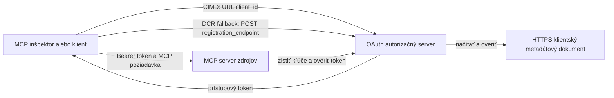

# Príklad autorizácie CIMD a DCR

Tento príklad v TypeScript porovnáva dva spôsoby, ako môže OAuth klient získať identitu
pred prístupom k chránenému MCP serveru:

- **Client ID Metadata Documents (CIMD)** využívajú stabilnú HTTPS URL ako
  `client_id`. Toto je preferovaný mechanizmus pre klientov a autorizačné
  servery, ktoré nemajú predchádzajúci vzťah.
- **Dynamická registrácia klienta (DCR)** žiada autorizačný server, aby za behu
  vygeneroval nepriehľadné client ID. MCP `2026-07-28` ponecháva DCR iba
  pre spätnú kompatibilitu.

Príklad používa stabilné MCP TypeScript SDK v2 a bezstavový
MCP `2026-07-28` model požiadavky. Funguje s externým OAuth 2.1/OpenID
Connect autorizačným serverom ako Auth0. MCP server je server zdroja:
overuje prístupové tokeny, ale neoveruje používateľov ani nevydáva
tokeny.

## Ciele učenia

Po dokončení tohto príkladu budete schopní:

- Vysvetliť, prečo je CIMD preferované oproti DCR pre nových MCP klientov.
- Publikovať platný CIMD dokument pre verejného natívneho klienta.
- Nakonfigurovať MCP resource server pre OAuth discovery a validáciu JWT.
- Vyskúšať CIMD a DCR s tým istým MCP serverom a autorizačným serverom.
- Presadzovať OAuth scope v nástroji MCP.
- Určiť, ktoré zodpovednosti patria klientovi, resource serveru a
  autorizačnému serveru.

## Architektúra



Autorizačný server vyberá a overuje mechanizmus registrácie.
MCP server vidí len výsledný overený claim `client_id`. HTTPS URL
s cestou identifikuje CIMD. Nepriehľadné ID nie je dostačujúce na preukázanie DCR, pretože
aj predregistrovaný klient môže použiť nepriehľadné ID; voliteľné
nastavenie `DCR_CLIENT_ID_PREFIX` poskytuje demo nápovedu špecifickú pre poskytovateľa.

## Priorita registrácie

MCP klienti, ktorí podporujú všetky mechanizmy, by mali použiť tento poradie:

1. Používajte predregistrované informácie o klientovi, keď už sú k dispozícii.
2. Používajte CIMD, keď autorizačný server oznamuje
   `client_id_metadata_document_supported: true`.
3. Používajte DCR iba ako záložnú možnosť, keď server oznamuje
   `registration_endpoint`.
4. Požiadajte používateľa o predregistrované informácie o klientovi, keď nie je dostupné
   nič z vyššie uvedeného.

## Rozloženie projektu

```text
src/
  config.ts          Environment validation
  dcr.ts             DCR compatibility request
  mcp.ts             MCP tools and scope checks
  oauth.ts           Authorization metadata and JWT verification
  register-dcr.ts    DCR command-line helper
  registration.ts    CIMD document and mechanism classification
  server.ts          Express, OAuth discovery, and MCP endpoint
test/
  dcr.test.ts
  oauth.test.ts
  registration.test.ts
  server.test.ts
```

## Predpoklady

- Node.js 20.6 alebo novší. Skripty používajú `--env-file` a `--import`.
- OAuth 2.1/OpenID Connect autorizačný server, ktorý podporuje:
  - Autorizačný kódový tok s S256 PKCE.
  - Metadata chránených OAuth zdrojov a Resource Indicators.
  - JWT prístupové tokeny a JWKS endpoint.
  - CIMD a DCR, ak chcete porovnať starú záložnú možnosť.
- MCP Inspector alebo iný MCP `2026-07-28` klient.
- Verejnú HTTPS URL pre CIMD dokument. Vývojový tunel je vhodný
  na lab; v produkcii použite stabilnú doménu.

## Inštalácia a testovanie

```bash
npm install
npm run build
npm test
```

Tucte testov používajú lokálne kľúče a mock HTTP endpointy. Nepotrebujú
účet na autorizačnom serveri. Overujú:

- Tvar CIMD dokumentu a obmedzenia URL.
- Správnu klasifikáciu URL a nepriehľadných client ID.
- Spracovanie požiadaviek a odpovedí DCR.
- Zamietnutie nezabezpečených DCR endpointov mimo loopback.
- Validáciu podpisu JWT, vydavateľa, publika, expirácie, client ID a scope.
- Volanie MCP `2026-07-28` metódy `registration-info` v procese.

## Konfigurácia autorizačného servera

Presné názvy ovládacích prvkov sa líšia podľa poskytovateľa. Nakonfigurujte tieto schopnosti:

1. Vytvorte API alebo resource server, ktorého identifikátor presne zodpovedá URL MCP,
   vrátane `/mcp`, napríklad `http://127.0.0.1:3001/mcp`.
2. Použite RS256 prístupové tokeny a zahrňte `client_id` alebo `azp` claim.
3. Pridajte oprávnenie alebo scope `tool:greet`.
4. Povoliť autorizačný kódový tok s S256 PKCE pre verejných natívnych klientov.
5. Povoliť Client ID Metadata Documents.
6. Pre porovnanie povoliť Dynamic Client Registration.
7. Uistite sa, že metadata autorizačného servera uvádza:
   - `issuer`
   - `authorization_endpoint`
   - `token_endpoint`
   - `jwks_uri`
   - `client_id_metadata_document_supported: true`
   - `registration_endpoint` keď je povolený DCR

### Príklad Auth0

Pre Auth0 povolte registráciu Client ID Metadata Document, OIDC Dynamic
Application Registration a kompatibilitu s Resource Parameter. Vytvorte API,
ktorého identifikátor je presná MCP URL a pridajte oprávnenie `tool:greet`.
Umožnite testovaciemu používateľovi a tretím stranám vyžiadať toto oprávnenie.

Ovládacie panely poskytovateľov a dostupnosť funkcií sa v priebehu času menia. Skontrolujte
dokumentáciu poskytovateľa pred použitím týchto nastavení mimo tohto labu.

## Konfigurácia príkladu

Vytvorte `.env` z príkladu:

```powershell
Copy-Item .env.example .env
```

V bash-kompatibilných shelloch:

```bash
cp .env.example .env
```

Nastavte tieto hodnoty:

```dotenv
MCP_SERVER_URL=http://127.0.0.1:3001/mcp
AUTHORIZATION_SERVER_ISSUER=https://your-tenant.example.com/
AUTHORIZATION_SERVER_METADATA_URL=https://your-tenant.example.com/.well-known/openid-configuration
CLIENT_METADATA_URL=https://your-public-host.example.com/client-metadata.json
OAUTH_REDIRECT_URIS=http://127.0.0.1:6274/oauth/callback
DCR_CLIENT_ID_PREFIX=tpc_
```

Dôležité detaily:

- `AUTHORIZATION_SERVER_ISSUER` sa musí presne zhodovať s `issuer` v objavených
  metadátach autorizačného servera, vrátane prípadnej koncovej lomky.
- `MCP_SERVER_URL` musí zodpovedať publiku prístupového tokenu.
- `CLIENT_METADATA_URL` musí používať HTTPS, musí obsahovať ne-koreňovú cestu a byť
  verejnou URL, ktorá podáva metadata route. Query stringy a fragmenty sú
  odmietané, aby cesta a `client_id` zostali identické.
- `OAUTH_REDIRECT_URIS` je zoznam povolených adries oddelených čiarkami. Predvolené je
  MCP Inspector loopback callback.
- `DCR_CLIENT_ID_PREFIX` je voliteľný a špecifický pre poskytovateľa. Nechajte prázdny, keď
  váš poskytovateľ nemá spoľahlivý DCR prefix.

## Publikujte CIMD dokument

Spustite tunel, ktorý smeruje svoju verejnú HTTPS pôvodnú adresu na `127.0.0.1:3001`.
Nastavte `CLIENT_METADATA_URL` na tento pôvod plus `/client-metadata.json`, potom spustite:

```bash
npm run build
npm start
```

Overte obe discovery dokumenty:

```bash
curl http://127.0.0.1:3001/health
curl http://127.0.0.1:3001/client-metadata.json
curl http://127.0.0.1:3001/.well-known/oauth-protected-resource/mcp
```

`client_id` vrátený verejnou HTTPS metadata URL musí byť byty za bytom
totožný s touto URL. Autorizačný server musí overiť dokument a
jeho redirect URI pred vydaním tokenu.

> [!NOTE]
> Príklad hostuje klientsky dokument a MCP resource server v jednom procese
> aby bol lab malý. V produkcii MCP klient spravuje a hostuje svoj CIMD
> dokument nezávisle od resource servera.

## Porovnanie CIMD a DCR

Spustite MCP Inspector:

```bash
npx @modelcontextprotocol/inspector
```

Použite Streamable HTTP a pripojte sa na `http://127.0.0.1:3001/mcp`.

### CIMD (preferované)


1. Zadajte verejné `CLIENT_METADATA_URL` ako OAuth Client ID.
2. Požiadajte o `tool:greet` a všetky identity scopes požadované vaším poskytovateľom.
3. Dokončite prihlásenie a súhlas.
4. Zavolajte `registration-info`. Hlási `mechanism: "cimd"`.
5. Zavolajte `greet` na overenie uplatňovania rozsahu.

### DCR (Spätná kompatibilita)

1. Vymažte uložený OAuth stav v Inspectore.
2. Nechajte OAuth Client ID prázdne, aby mohol Inspector použiť inzerovaný
   `registration_endpoint`.
3. Dokončite prihlásenie a súhlas.
4. Zavolajte `registration-info`.
5. Ak `DCR_CLIENT_ID_PREFIX` zodpovedá generovaným ID poskytovateľa, nástroj
   hlási `mechanism: "dcr"`; inak správne hlási
   `opaque-client-id`.

Môžete tiež priamo demonštrovať požiadavku na registráciu:

```bash
npm run build
npm run register:dcr
```

Pomocník vytlačí vrátené client ID, ale nikdy nevytlačí klientský tajný kľúč.
Zaobchádzajte s akýmkoľvek vráteným tajomstvom ako s citlivým údajom a ukladajte ho do správneho úložiska tajomstiev.

## Nástroje

| Nástroj | Požadovaný scope | Účel |
| --- | --- | --- |
| `registration-info` | Overený klient | Hlási typ client ID |
| `greet` | `tool:greet` | Demonštrácia autorizácie pre nástroj |

## Bezpečnostné poznámky

- Overujte podpisy JWT cez JWKS endpoint autorizačného servera.
- Vyžadujte presnú zhodu issuer a audience.
- Vyžadujte platnosť (expiration) a nároky client ID.
- Nikdy neprijímajte token vydaný pre iný zdroj.
- Nikdy nepoužívajte MCP token v nasledujúcom API.
- Uchovávajte DCR poverenia viazané na issuer, ktorý ich vytvoril.
- Validujte CIMD presmerovacie URI so presnou zhodou.
- Používajte SSRF kontroly, keď autorizačný server načítava CIMD URL.
- Používajte HTTPS pre autorizačné a metadata koncové body mimo vývoja na loopback.

- Nezosúvajte DCR z nepriehľadného client ID, pokiaľ poskytovateľ nedokumentuje
  spoľahlivú konvenciu identifikátora.

## Referencie

- [MCP autorizácia špecifikácia](https://modelcontextprotocol.io/specification/2026-07-28/basic/authorization)
- [MCP registrácia klienta](https://modelcontextprotocol.io/specification/2026-07-28/basic/authorization/client-registration)
- [MCP bezpečnostné osvedčené praktiky](https://modelcontextprotocol.io/specification/2026-07-28/basic/security_best_practices)
- [MCP TypeScript SDK v2 príručka autorizácie](https://ts.sdk.modelcontextprotocol.io/v2/serving/authorization)
- [OAuth dynamická registrácia klienta (RFC 7591)](https://datatracker.ietf.org/doc/html/rfc7591)
- [OAuth Client ID Metadata Document návrh](https://datatracker.ietf.org/doc/html/draft-ietf-oauth-client-id-metadata-document-00)

## Poďakovanie

Prístup vzdelávania vedľa seba bol inšpirovaný
[Sambego/auth0-xmcp-cimd](https://github.com/Sambego/auth0-xmcp-cimd). Tento
príklad je originálna, poskytovateľsky neutrálna implementácia vytvorená s oficiálnym
MCP TypeScript SDK v2 pre tento učebný plán.

---

<!-- CO-OP TRANSLATOR DISCLAIMER START -->
**Vyhlásenie o zodpovednosti**:
Tento dokument bol preložený pomocou AI prekladateľskej služby [Co-op Translator](https://github.com/Azure/co-op-translator). Hoci sa snažíme o presnosť, vezmite prosím na vedomie, že automatické preklady môžu obsahovať chyby alebo nepresnosti. Pôvodný dokument v jeho natívnom jazyku by mal byť považovaný za autoritatívny zdroj. Pre kritické informácie sa odporúča profesionálny ľudský preklad. Nie sme zodpovední za žiadne nedorozumenia alebo nesprávne interpretácie vyplývajúce z použitia tohto prekladu.
<!-- CO-OP TRANSLATOR DISCLAIMER END -->