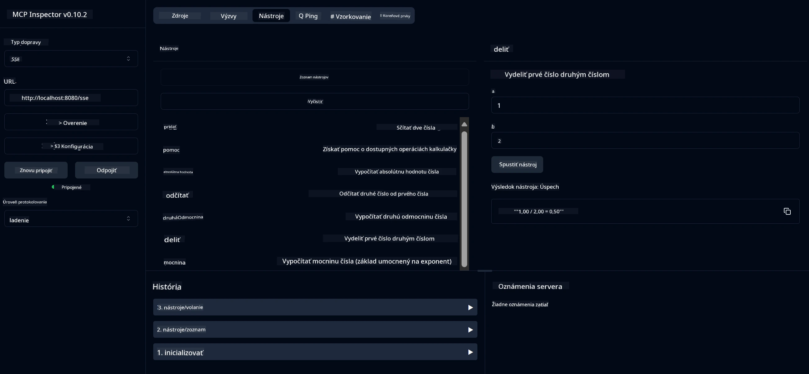

# Základný kalkulačný MCP servis

> [!NOTE]
> Toto riešenie v Jave používa starý HTTP+SSE transport a cieli na SDK
> kompatibilné s MCP `2025-11-25`. Je zachované pre zhodu s kódom kurzu;
> nové vzdialené servery by mali používať `2026-07-28` Streamable HTTP podporu.

Tento servis poskytuje základné kalkulačné operácie cez Model Context Protocol (MCP) s použitím Spring Boot a WebFlux transportu. Je navrhnutý ako jednoduchý príklad pre začiatočníkov učících sa o implementáciách MCP.

Pre viac informácií, pozrite si referenčnú dokumentáciu [MCP Server Boot Starter](https://docs.spring.io/spring-ai/reference/api/mcp/mcp-server-boot-starter-docs.html).


## Použitie servisu

Servis sprístupňuje nasledujúce API endpointy cez MCP protokol:

- `add(a, b)`: Sčítať dve čísla
- `subtract(a, b)`: Odčítať druhé číslo od prvého
- `multiply(a, b)`: Vynásobiť dve čísla
- `divide(a, b)`: Vydeliť prvé číslo druhým (so zabezpečením proti deleniu nulou)
- `power(base, exponent)`: Vypočítať mocninu čísla
- `squareRoot(number)`: Vypočítať druhú odmocninu (so zabezpečením proti zápornému číslu)
- `modulus(a, b)`: Vypočítať zvyšok po delení
- `absolute(number)`: Vypočítať absolútnu hodnotu

## Závislosti

Projekt vyžaduje nasledujúce kľúčové závislosti:

```xml
<dependency>
    <groupId>org.springframework.ai</groupId>
    <artifactId>spring-ai-starter-mcp-server-webflux</artifactId>
</dependency>
```

## Vytvorenie projektu

Projekt zostavte pomocou Maven:
```bash
./mvnw clean install -DskipTests
```

## Spustenie servera

### Použitie Javy

```bash
java -jar target/calculator-server-0.0.1-SNAPSHOT.jar
```

### Použitie MCP Inspectora

MCP Inspector je užitočný nástroj na interakciu s MCP servisami. Pre použitie s týmto kalkulačným servisom:

1. **Nainštalujte a spustite MCP Inspector** v novom terminálovom okne:
   ```bash
   npx @modelcontextprotocol/inspector
   ```

2. **Prístup k webovému UI** kliknutím na URL zobrazenú aplikáciou (zvyčajne http://localhost:6274)

3. **Nastavte pripojenie**:
   - Nastavte typ transportu na "SSE"
   - Nastavte URL na SSE endpoint vášho bežiaceho servera: `http://localhost:8080/sse`
   - Kliknite na "Pripojiť"

4. **Použite nástroje**:
   - Kliknite na "Zoznam nástrojov" pre zobrazenie dostupných kalkulačných operácií
   - Vyberte nástroj a kliknite na "Spustiť nástroj" pre vykonanie operácie



---

<!-- CO-OP TRANSLATOR DISCLAIMER START -->
**Vyhlásenie o zodpovednosti**:
Tento dokument bol preložený pomocou AI prekladateľskej služby [Co-op Translator](https://github.com/Azure/co-op-translator). Hoci sa snažíme o presnosť, vezmite prosím na vedomie, že automatické preklady môžu obsahovať chyby alebo nepresnosti. Pôvodný dokument v jeho natívnom jazyku by mal byť považovaný za autoritatívny zdroj. Pre kritické informácie sa odporúča profesionálny ľudský preklad. Nie sme zodpovední za žiadne nedorozumenia alebo nesprávne interpretácie vyplývajúce z použitia tohto prekladu.
<!-- CO-OP TRANSLATOR DISCLAIMER END -->