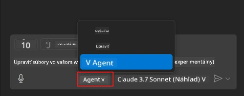
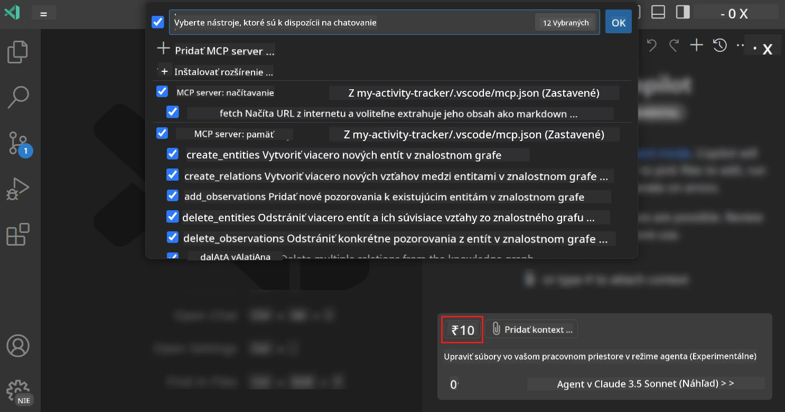
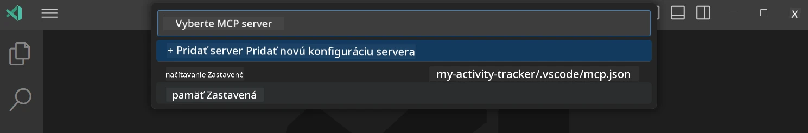
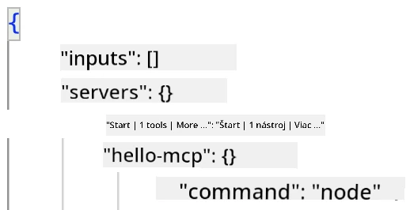
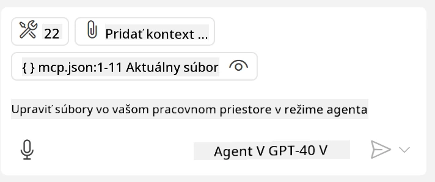
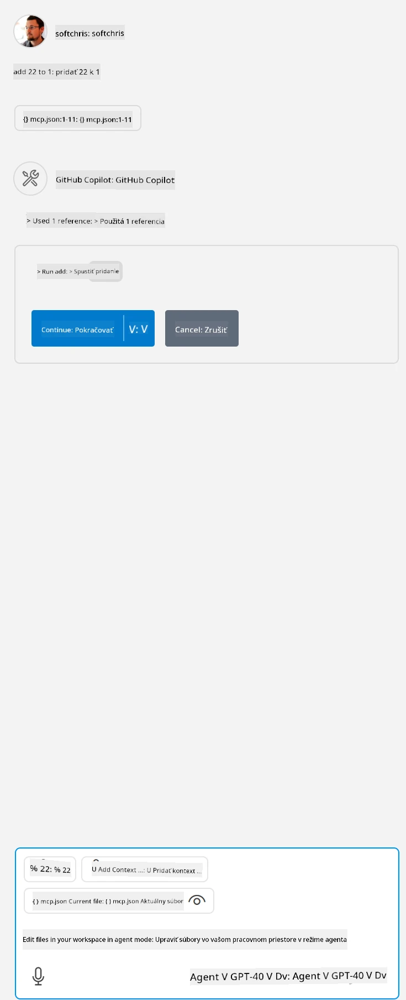

# Používanie servera z režimu GitHub Copilot Agent

Visual Studio Code a GitHub Copilot môžu fungovať ako klient a používať MCP server. Prečo by ste to chceli robiť, sa možno pýtate? No, to znamená, že akékoľvek funkcie, ktoré MCP server má, môžu byť teraz použité priamo vo vašom IDE. Predstavte si, že pridáte napríklad GitHubov MCP server, čo by umožnilo ovládať GitHub pomocou promptov namiesto písania konkrétnych príkazov v termináli. Alebo si predstavte čokoľvek, čo by mohlo zlepšiť vašu vývojársku skúsenosť, všetko ovládané prirodzeným jazykom. Už začínate vidieť výhodu, však?

## Prehľad

Táto lekcia vysvetľuje, ako používať Visual Studio Code a režim agenta GitHub Copilot ako klienta pre váš MCP server.

## Výučbové ciele

Na konci tejto lekcie budete schopní:

- Používať MCP server cez Visual Studio Code.
- Spúšťať schopnosti ako nástroje cez GitHub Copilot.
- Konfigurovať Visual Studio Code, aby našiel a spravoval váš MCP server.

## Použitie

Váš MCP server môžete ovládať dvoma rôznymi spôsobmi:

- Používateľské rozhranie, ukážeme si to neskôr v tejto kapitole.
- Terminál, je možné ovládať veci z terminálu pomocou spustiteľného súboru `code`:

  Na pridanie MCP servera do vášho používateľského profilu použite príkazovú voľbu --add-mcp a poskytnite konfiguráciu servera v JSON formáte vo forme {\"name\":\"server-name\",\"command\":...}.

  ```
  code --add-mcp "{\"name\":\"my-server\",\"command\": \"uvx\",\"args\": [\"mcp-server-fetch\"]}"
  ```

### Snímky obrazovky





Pozrime sa viac na to, ako používame vizuálne rozhranie v nasledujúcich častiach.

## Prístup

Takto musíme pristúpiť k tomu na vyššej úrovni:

- Konfigurovať súbor na nájdenie nášho MCP servera.
- Spustiť/Pripojiť sa k serveru, aby zobrazil svoje schopnosti.
- Používať tieto schopnosti cez rozhranie GitHub Copilot Chat.

Výborne, teraz keď rozumieme postupu, poďme vyskúšať použiť MCP server cez Visual Studio Code prostredníctvom cvičenia.

## Cvičenie: Používanie servera

V tomto cvičení nakonfigurujeme Visual Studio Code tak, aby našiel váš MCP server, aby mohol byť použitý z rozhrania GitHub Copilot Chat.

### -0- Predkrok, povolenie objavovania MCP serverov

Možno budete musieť povoliť objavovanie MCP serverov.

1. Prejdite do `Súbor -> Preferencie -> Nastavenia` vo Visual Studio Code.

1. Vyhľadajte "MCP" a povoľte `chat.mcp.discovery.enabled` v súbore settings.json.

### -1- Vytvorte konfiguračný súbor

Začnite vytvorením konfiguračného súboru v koreňovom adresári vášho projektu, potrebujete súbor s názvom MCP.json, ktorý umiestnite do priečinka .vscode. Mal by vyzerať takto:

```text
.vscode
|-- mcp.json
```

Ďalej sa pozrime, ako pridať záznam servera.

### -2- Konfigurácia servera

Pridajte nasledujúci obsah do *mcp.json*:

```json
{
    "inputs": [],
    "servers": {
       "hello-mcp": {
           "command": "node",
           "args": [
               "build/index.js"
           ]
       }
    }
}
```

Vyššie je jednoduchý príklad, ako spustiť server napísaný v Node.js, pre iné runtime uvedte správny príkaz na spustenie servera pomocou `command` a `args`.

### -3- Spustenie servera

Keď ste pridali záznam, spustime server:

1. Nájdite svoj záznam v *mcp.json* a uistite sa, že vidíte ikonu "play":

    

1. Kliknite na ikonu "play", mali by ste vidieť ikonu nástrojov v GitHub Copilot Chate, ktorá zvýši počet dostupných nástrojov. Ak kliknete na túto ikonu nástrojov, uvidíte zoznam registrovaných nástrojov. Môžete zaškrtnúť alebo odškrtnúť jednotlivé nástroje podľa toho, či chcete, aby ich GitHub Copilot používal ako kontext:

  

1. Na spustenie nástroja zadajte prompt, o ktorom viete, že zodpovedá popisu niektorého z vašich nástrojov, napríklad prompt "add 22 to 1":

  

  Mali by ste vidieť odpoveď s hodnotou 23.

## Zadanie

Skúste pridať záznam servera do súboru *mcp.json* a uistite sa, že viete server spustiť/zastaviť. Tiež sa uistite, že viete komunikovať s nástrojmi na vašom serveri cez rozhranie GitHub Copilot Chat.

## Riešenie

[Riešenie](./solution/README.md)

## Kľúčové poznatky

Kľúčové zistenia z tejto kapitoly sú nasledujúce:

- Visual Studio Code je vynikajúci klient, ktorý vám umožňuje používať viacero MCP serverov a ich nástrojov.
- Rozhranie GitHub Copilot Chat je spôsob, ako komunikujete so servermi.
- Môžete vyzvať používateľa na zadanie vstupov ako API kľúče, ktoré sa môžu poslať MCP serveru pri konfigurácii záznamu servera v súbore *mcp.json*.

## Ukážky

- [Java Kalkulačka](../samples/java/calculator/README.md)
- [.Net Kalkulačka](../../../../03-GettingStarted/samples/csharp)
- [JavaScript Kalkulačka](../samples/javascript/README.md)
- [TypeScript Kalkulačka](../samples/typescript/README.md)
- [Python Kalkulačka](../../../../03-GettingStarted/samples/python)

## Dodatočné zdroje

- [Dokumentácia Visual Studio](https://code.visualstudio.com/docs/copilot/chat/mcp-servers)

## Čo nasleduje

- Ďalšie: [Vytvorenie stdio servera](../05-stdio-server/README.md)

---

<!-- CO-OP TRANSLATOR DISCLAIMER START -->
**Vyhlásenie o zodpovednosti**:
Tento dokument bol preložený pomocou AI prekladateľskej služby [Co-op Translator](https://github.com/Azure/co-op-translator). Hoci sa snažíme o presnosť, vezmite prosím na vedomie, že automatické preklady môžu obsahovať chyby alebo nepresnosti. Pôvodný dokument v jeho natívnom jazyku by mal byť považovaný za autoritatívny zdroj. Pre kritické informácie sa odporúča profesionálny ľudský preklad. Nie sme zodpovední za žiadne nedorozumenia alebo nesprávne interpretácie vyplývajúce z použitia tohto prekladu.
<!-- CO-OP TRANSLATOR DISCLAIMER END -->