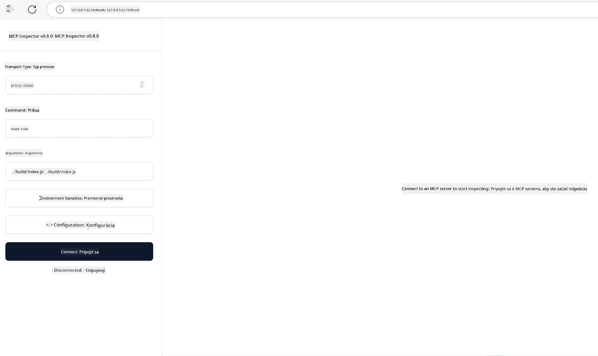

## Testovanie a ladenie

Predtým, ako začnete testovať svoj MCP server, je dôležité pochopiť dostupné nástroje a osvedčené postupy pre ladenie. Efektívne testovanie zabezpečuje, že váš server sa správa podľa očakávaní a pomáha vám rýchlo identifikovať a vyriešiť problémy. Nasledujúca sekcia popisuje odporúčané prístupy na overenie vašej implementácie MCP.

## Prehľad

Táto lekcia pokrýva, ako vybrať správny prístup k testovaniu a najefektívnejší testovací nástroj.

## Učebné ciele

Na konci tejto lekcie budete schopní:

- Opísať rôzne prístupy k testovaniu.
- Použiť rôzne nástroje na efektívne testovanie vášho kódu.


## Testovanie MCP serverov

MCP poskytuje nástroje, ktoré vám pomôžu otestovať a ladiť vaše servery:

- **MCP Inspector**: Nástroj príkazového riadku, ktorý možno použiť ako CLI aj ako vizuálny nástroj.
- **Manuálne testovanie**: Môžete použiť nástroj ako curl na vykonávanie webových požiadaviek, ale akýkoľvek nástroj schopný spustiť HTTP bude fungovať.
- **Jednotkové testovanie**: Je možné použiť vašu preferovanú testovaciu knižnicu na testovanie funkcií servera aj klienta.

### Použitie MCP Inspector

Použitie tohto nástroja sme popísali v predchádzajúcich lekciách, ale poďme si o ňom povedať stručne na vyššej úrovni. Je to nástroj postavený v Node.js a môžete ho použiť zavolaním spustiteľného súboru `npx`, ktorý dočasne stiahne a nainštaluje samotný nástroj a po dokončení vašej požiadavky sa vyčistí.

[MCP Inspector](https://github.com/modelcontextprotocol/inspector) vám pomáha:

- **Objavovať schopnosti servera**: Automaticky zisťovať dostupné zdroje, nástroje a výzvy
- **Testovať spustenie nástrojov**: Vyskúšať rôzne parametre a vidieť odpovede v reálnom čase
- **Prezerať metadata servera**: Skontrolovať informácie o serveri, schémy a konfigurácie

Typické spustenie nástroja vyzerá takto:

```bash
npx @modelcontextprotocol/inspector node build/index.js
```

Vyššie uvedený príkaz spustí MCP a jeho vizuálne rozhranie a otvorí lokálne webové rozhranie vo vašom prehliadači. Očakávajte, že uvidíte panel s registrovanými MCP servermi, ich dostupnými nástrojmi, zdrojmi a výzvami. Rozhranie umožňuje interaktívne testovať spúšťanie nástrojov, prezerať metadata servera a sledovať odpovede v reálnom čase, čo uľahčuje overenie a ladenie implementácií vášho MCP servera.

Tu je, ako to môže vyzerať: 

Tento nástroj môžete tiež spustiť v režime CLI, pričom pridáte atribút `--cli`. Tu je príklad spustenia nástroja v režime "CLI", ktorý vypíše všetky nástroje na serveri:

```sh
npx @modelcontextprotocol/inspector --cli node build/index.js --method tools/list
```

### Manuálne testovanie

Okrem použitia nástroja inspector na testovanie schopností servera je ďalším podobným prístupom spustiť klienta schopného použiť HTTP, napríklad curl.

Pomocou curl môžete testovať MCP servery priamo použitím HTTP požiadaviek:

```bash
# Príklad: Metadata testovacieho servera
curl http://localhost:3000/v1/metadata

# Príklad: Spustenie nástroja
curl -X POST http://localhost:3000/v1/tools/execute \
  -H "Content-Type: application/json" \
  -d '{"name": "calculator", "parameters": {"expression": "2+2"}}'
```

Ako vidíte z vyššie uvedeného použitia curl, na vyvolanie nástroja používate POST požiadavku s prenosovou štruktúrou, ktorá obsahuje názov nástroja a jeho parametre. Použite prístup, ktorý vám najviac vyhovuje. CLI nástroje sú vo všeobecnosti rýchlejšie na použitie a dobre sa skriptujú, čo môže byť užitočné v CI/CD prostredí.

### Jednotkové testovanie

Vytvorte jednotkové testy pre vaše nástroje a zdroje, aby ste zabezpečili, že fungujú podľa očakávaní. Tu je príklad testovacieho kódu.

```python
import pytest

from mcp.server.fastmcp import FastMCP
from mcp.shared.memory import (
    create_connected_server_and_client_session as create_session,
)

# Označte celý modul pre asynchrónne testy
pytestmark = pytest.mark.anyio


async def test_list_tools_cursor_parameter():
    """Test that the cursor parameter is accepted for list_tools.

    Note: FastMCP doesn't currently implement pagination, so this test
    only verifies that the cursor parameter is accepted by the client.
    """

 server = FastMCP("test")

    # Vytvorte niekoľko testovacích nástrojov
    @server.tool(name="test_tool_1")
    async def test_tool_1() -> str:
        """First test tool"""
        return "Result 1"

    @server.tool(name="test_tool_2")
    async def test_tool_2() -> str:
        """Second test tool"""
        return "Result 2"

    async with create_session(server._mcp_server) as client_session:
        # Test bez parametra cursor (vynechaný)
        result1 = await client_session.list_tools()
        assert len(result1.tools) == 2

        # Test s cursor=None
        result2 = await client_session.list_tools(cursor=None)
        assert len(result2.tools) == 2

        # Test s cursor ako reťazec
        result3 = await client_session.list_tools(cursor="some_cursor_value")
        assert len(result3.tools) == 2

        # Test s prázdnym reťazcovým cursorom
        result4 = await client_session.list_tools(cursor="")
        assert len(result4.tools) == 2
    
```

Predchádzajúci kód robí nasledovné:

- Využíva pytest framework, ktorý umožňuje vytvárať testy ako funkcie a používa assert výrazy.
- Vytvára MCP server s dvoma rôznymi nástrojmi.
- Používa `assert` na overenie, či sú splnené určité podmienky.

Pozrite sa na [celý súbor tu](https://github.com/modelcontextprotocol/python-sdk/blob/main/tests/client/test_list_methods_cursor.py)

Na základe tohto súboru môžete otestovať svoj vlastný server a overiť, či sú schopnosti vytvorené správne.

Všetky hlavné SDK majú podobné sekcie na testovanie, takže sa môžete prispôsobiť svojmu vybranému runtime.

## Príklady

- [Java kalkulačka](../samples/java/calculator/README.md)
- [.Net kalkulačka](../../../../03-GettingStarted/samples/csharp)
- [JavaScript kalkulačka](../samples/javascript/README.md)
- [TypeScript kalkulačka](../samples/typescript/README.md)
- [Python kalkulačka](../../../../03-GettingStarted/samples/python) 

## Dodatočné zdroje

- [Python SDK](https://github.com/modelcontextprotocol/python-sdk)

## Čo bude ďalej

- Ďalej: [Nasadenie](../09-deployment/README.md)

---

<!-- CO-OP TRANSLATOR DISCLAIMER START -->
**Vyhlásenie o zodpovednosti**:
Tento dokument bol preložený pomocou AI prekladateľskej služby [Co-op Translator](https://github.com/Azure/co-op-translator). Aj keď sa snažíme o presnosť, majte prosím na pamäti, že automatizované preklady môžu obsahovať chyby alebo nepresnosti. Originálny dokument v jeho pôvodnom jazyku by mal byť považovaný za autoritatívny zdroj. Pre kritické informácie sa odporúča profesionálny ľudský preklad. Nezodpovedáme za žiadne nedorozumenia alebo nesprávne interpretácie vyplývajúce z použitia tohto prekladu.
<!-- CO-OP TRANSLATOR DISCLAIMER END -->