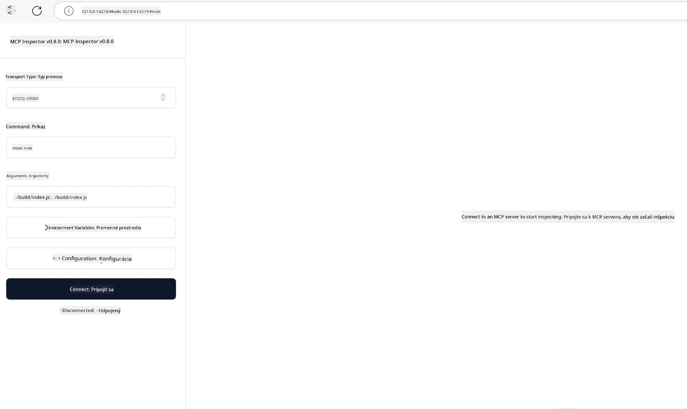

## Testovanie a ladenie

Predtým, než začnete testovať svoj MCP server, je dôležité porozumieť dostupným nástrojom a najlepším praktikám ladenia. Efektívne testovanie zabezpečí, že váš server bude fungovať podľa očakávaní a pomôže vám rýchlo identifikovať a vyriešiť problémy. Nasledujúca časť popisuje odporúčané prístupy na validáciu vašej MCP implementácie.

## Prehľad

Táto lekcia pokrýva, ako vybrať správny testovací prístup a najefektívnejší testovací nástroj.

## Ciele učenia

Po skončení tejto lekcie budete vedieť:

- Opísať rôzne prístupy k testovaniu.
- Používať rôzne nástroje na efektívne testovanie svojho kódu.


## Testovanie MCP serverov

MCP poskytuje nástroje, ktoré vám pomôžu testovať a ladiť vaše servery:

- **MCP Inspector**: Nástroj príkazového riadku, ktorý môžete spúšťať ako CLI nástroj aj ako vizuálny nástroj.
- **Manuálne testovanie**: Môžete použiť nástroj ako curl na spúšťanie webových požiadaviek, ale stačí akýkoľvek nástroj schopný vykonávať HTTP požiadavky.
- **Jednotkové testovanie**: Je možné použiť váš preferovaný testovací rámec na testovanie funkcií servera aj klienta.

### Použitie MCP Inspectora

Použitie tohto nástroja sme opísali v predchádzajúcich lekciách, ale poďme si o ňom povedať stručne vo vysokej úrovni. Je to nástroj postavený v Node.js a môžete ho použiť zavolaním vykonateľného súboru `npx`, ktorý si nástroj dočasne stiahne a nainštaluje a po spustení vášho požiadavku sa sám vyčistí.

[MCP Inspector](https://github.com/modelcontextprotocol/inspector) vám pomáha:

- **Objaviť schopnosti servera**: Automaticky zistiť dostupné zdroje, nástroje a výzvy
- **Testovať vykonávanie nástrojov**: Vyskúšať rôzne parametre a vidieť odpovede v reálnom čase
- **Zobraziť metadata servera**: Skontrolovať informácie o serveri, schémy a konfigurácie

Typický priebeh spustenia nástroja vyzerá takto:

```bash
npx @modelcontextprotocol/inspector node build/index.js
```

Príkaz vyššie spustí MCP a jeho vizuálne rozhranie a otvorí lokálne webové rozhranie vo vašom prehliadači. Môžete očakávať zobrazenie dashboardu zobrazujúceho vaše registrované MCP servery, ich dostupné nástroje, zdroje a výzvy. Rozhranie vám umožňuje interaktívne testovať vykonávanie nástrojov, skúmať metadata servera a sledovať odpovede v reálnom čase, čo uľahčuje validáciu a ladenie vašich implementácií MCP serverov.

Takto to môže vyzerať: 

Tento nástroj môžete tiež spustiť v režime CLI, kde pridáte atribút `--cli`. Tu je príklad spustenia nástroja v "CLI" režime, ktorý vypíše všetky nástroje na serveri:

```sh
npx @modelcontextprotocol/inspector --cli node build/index.js --method tools/list
```

### Manuálne testovanie

Okrem spustenia nástroja inspector na testovanie schopností servera je ďalším podobným prístupom spustenie klienta schopného využívať HTTP napríklad curl.

S curl môžete testovať MCP servery priamo pomocou HTTP požiadaviek:

```bash
# Príklad: Metadáta testovacieho servera
curl http://localhost:3000/v1/metadata

# Príklad: Spustiť nástroj
curl -X POST http://localhost:3000/v1/tools/execute \
  -H "Content-Type: application/json" \
  -d '{"name": "calculator", "parameters": {"expression": "2+2"}}'
```

Ako vidíte z uvedeného použitia curl, používate POST požiadavku na vyvolanie nástroja pomocou dátového objektu obsahujúceho názov nástroja a jeho parametre. Použite prístup, ktorý vám najviac vyhovuje. CLI nástroje sú obecne rýchlejšie a umožňujú ich použitie v skriptoch, čo môže byť užitočné v CI/CD prostredí.

### Jednotkové testovanie

Vytvorte jednotkové testy pre vaše nástroje a zdroje, aby ste zabezpečili, že fungujú podľa očakávaní. Tu je príklad testovacieho kódu.

```python
import pytest

from mcp.server.fastmcp import FastMCP
from mcp.shared.memory import (
    create_connected_server_and_client_session as create_session,
)

# Označte celý modul pre asynchrónne testy
pytestmark = pytest.mark.anyio


async def test_list_tools_cursor_parameter():
    """Test that the cursor parameter is accepted for list_tools.

    Note: FastMCP doesn't currently implement pagination, so this test
    only verifies that the cursor parameter is accepted by the client.
    """

 server = FastMCP("test")

    # Vytvorte niekoľko testovacích nástrojov
    @server.tool(name="test_tool_1")
    async def test_tool_1() -> str:
        """First test tool"""
        return "Result 1"

    @server.tool(name="test_tool_2")
    async def test_tool_2() -> str:
        """Second test tool"""
        return "Result 2"

    async with create_session(server._mcp_server) as client_session:
        # Testovať bez parametra kurzora (vynechané)
        result1 = await client_session.list_tools()
        assert len(result1.tools) == 2

        # Testovať s kurzorom=None
        result2 = await client_session.list_tools(cursor=None)
        assert len(result2.tools) == 2

        # Testovať s kurzorom ako reťazec
        result3 = await client_session.list_tools(cursor="some_cursor_value")
        assert len(result3.tools) == 2

        # Testovať s kurzorom ako prázdny reťazec
        result4 = await client_session.list_tools(cursor="")
        assert len(result4.tools) == 2
    
```

Predchádzajúci kód robí nasledovné:

- Využíva rámec pytest, ktorý umožňuje vytvárať testy ako funkcie a používať assert príkazy.
- Vytvára MCP server s dvoma rôznymi nástrojmi.
- Používa príkaz `assert` na kontrolu, či sú splnené určité podmienky.

Pozrite si [celý súbor tu](https://github.com/modelcontextprotocol/python-sdk/blob/main/tests/client/test_list_methods_cursor.py)

S daným súborom môžete testovať vlastný server, aby ste mali istotu, že schopnosti sú vytvorené tak, ako majú byť.

Všetky hlavné SDK majú podobné testovacie sekcie, takže ich môžete prispôsobiť vašej vybranej runtime platforme.

## Príklady

- [Java Kalkulačka](../samples/java/calculator/README.md)
- [.Net Kalkulačka](../../../../03-GettingStarted/samples/csharp)
- [JavaScript Kalkulačka](../samples/javascript/README.md)
- [TypeScript Kalkulačka](../samples/typescript/README.md)
- [Python Kalkulačka](../../../../03-GettingStarted/samples/python)

## Dodatočné zdroje

- [Python SDK](https://github.com/modelcontextprotocol/python-sdk)

## Čo bude ďalej

- Ďalej: [Deployment](../09-deployment/README.md)

---

<!-- CO-OP TRANSLATOR DISCLAIMER START -->
**Vyhlásenie o zodpovednosti**:
Tento dokument bol preložený pomocou AI prekladateľskej služby [Co-op Translator](https://github.com/Azure/co-op-translator). Hoci sa snažíme o presnosť, vezmite prosím na vedomie, že automatické preklady môžu obsahovať chyby alebo nepresnosti. Pôvodný dokument v jeho natívnom jazyku by mal byť považovaný za autoritatívny zdroj. Pre kritické informácie sa odporúča profesionálny ľudský preklad. Nie sme zodpovední za žiadne nedorozumenia alebo nesprávne interpretácie vyplývajúce z použitia tohto prekladu.
<!-- CO-OP TRANSLATOR DISCLAIMER END -->