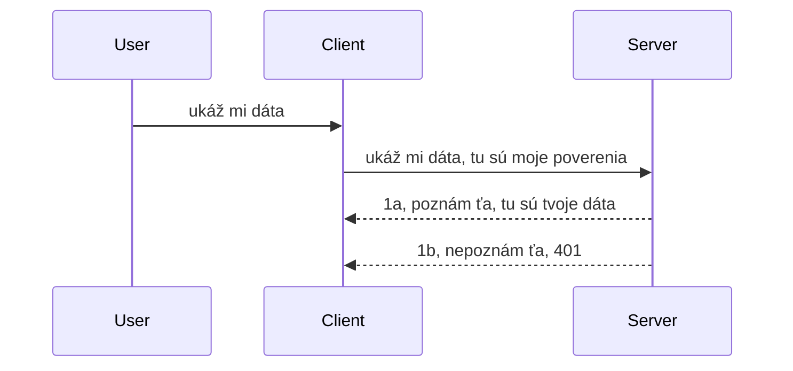

# Jednoduchá autentifikácia

SDK MCP podporujú použitie OAuth 2.1, čo je úprimne povedané celkom zložitý proces zahŕňajúci pojmy ako autentifikačný server, zdrojový server, posielanie prihlasovacích údajov, získavanie kódu, výmenu kódu za nosičský token, až kým nakoniec nedostanete svoje zdrojové dáta. Ak nie ste zvyknutí na OAuth, čo je skvelá vec na implementáciu, je dobré začať s nejakou základnou úrovňou autentifikácie a postupne prechádzať k lepšej a lepšej bezpečnosti. Preto táto kapitola existuje, aby vás pripravila na pokročilejšiu autentifikáciu.

## Autentifikácia, čo tým myslíme?

Autentifikácia je skratka pre overenie identity a autorizáciu. Idea je, že potrebujeme urobiť dve veci:

- **Overenie identity (Authentication)**, čo je proces zisťovania, či necháme človeka vstúpiť do nášho domu, teda či má právo byť "tu", či má prístup k nášmu zdrojovému serveru, kde sú funkcionality nášho MCP Servera.
- **Autorizácia (Authorization)**, je proces zisťovania, či by používateľ mal mať prístup ku konkrétnym zdrojom, o ktoré žiada, napríklad tieto objednávky alebo tieto produkty, alebo či mu je dovolené čítať obsah, ale nie ho mazať, ako ďalší príklad.

## Prihlasovacie údaje: ako povieme systému, kto sme

No, väčšina webových vývojárov rozmýšľa v termínoch poskytovania prihlasovacích údajov serveru, zvyčajne tajomstva, ktoré hovorí, či môžu byť tu "Overenie identity". Tieto prihlasovacie údaje sú obyčajne base64 kódovaná verzia mena používateľa a hesla alebo API kľúč, ktorý jednoznačne identifikuje konkrétneho používateľa.

To zahŕňa ich posielanie cez hlavičku nazývanú "Authorization" takto:

```json
{ "Authorization": "secret123" }
```

Toto sa zvyčajne nazýva základná autentifikácia. Ako celý tok funguje potom vyzerá nasledovne:


Teraz keď chápeme, ako to funguje z hľadiska toku, ako to implementujeme? Väčšina webových serverov má pojem middleware, kus kódu, ktorý sa spúšťa ako súčasť požiadavky a môže overiť prihlasovacie údaje, a ak sú platné, nechá požiadavku prejsť. Ak požiadavka nemá platné prihlasovacie údaje, dostanete chybu autentifikácie. Pozrime sa, ako sa to dá implementovať:

**Python**

```python
class AuthMiddleware(BaseHTTPMiddleware):
    async def dispatch(self, request, call_next):

        has_header = request.headers.get("Authorization")
        if not has_header:
            print("-> Missing Authorization header!")
            return Response(status_code=401, content="Unauthorized")

        if not valid_token(has_header):
            print("-> Invalid token!")
            return Response(status_code=403, content="Forbidden")

        print("Valid token, proceeding...")
       
        response = await call_next(request)
        # pridajte akékoľvek zákaznícke hlavičky alebo nejako upravte odpoveď
        return response


starlette_app.add_middleware(CustomHeaderMiddleware)
```

Tu máme:

- Vytvorený middleware s názvom `AuthMiddleware`, kde jeho metóda `dispatch` je vyvolávaná webovým serverom.
- Pridaný middleware k webovému serveru:

    ```python
    starlette_app.add_middleware(AuthMiddleware)
    ```

- Napísanú validačnú logiku, ktorá kontroluje, či je prítomná hlavička Authorization, a či je posielané tajomstvo platné:

    ```python
    has_header = request.headers.get("Authorization")
    if not has_header:
        print("-> Missing Authorization header!")
        return Response(status_code=401, content="Unauthorized")

    if not valid_token(has_header):
        print("-> Invalid token!")
        return Response(status_code=403, content="Forbidden")
    ```

    ak je tajomstvo prítomné a platné, necháme požiadavku prejsť volaním `call_next` a vrátime odpoveď.

    ```python
    response = await call_next(request)
    # pridajte akékoľvek hlavičky zákazníka alebo nejako zmeňte odpoveď
    return response
    ```

Ako to funguje, je to, že ak je webová požiadavka smerovaná na server, middleware bude vyvolaný a podľa svojej implementácie buď nechá požiadavku prejsť, alebo vráti chybu, ktorá naznačuje, že klient nemá povolenie pokračovať.

**TypeScript**

Tu vytvárame middleware s populárnym frameworkom Express a zachytávame požiadavku ešte predtým, než dosiahne MCP Server. Tu je kód:

```typescript
function isValid(secret) {
    return secret === "secret123";
}

app.use((req, res, next) => {
    // 1. Hlavička autorizácie prítomná?
    if(!req.headers["Authorization"]) {
        res.status(401).send('Unauthorized');
    }
    
    let token = req.headers["Authorization"];

    // 2. Skontrolujte platnosť.
    if(!isValid(token)) {
        res.status(403).send('Forbidden');
    }

   
    console.log('Middleware executed');
    // 3. Posiela požiadavku do ďalšieho kroku v pipeline požiadaviek.
    next();
});
```

V tomto kóde:

1. Kontrolujeme, či hlavička Authorization je prítomná, ak nie je, posielame chybu 401.
2. Overujeme, či je prihlasovací údaj/token platný, ak nie je, posielame chybu 403.
3. Nakoniec posielame požiadavku v potrubí ďalej a vraciame požadovaný zdroj.

## Cvičenie: Implementovať autentifikáciu

Poďme si zobrať naše vedomosti a vyskúšať implementovať to. Tu je plán:

Server

- Vytvoriť webový server a inštanciu MCP.
- Implementovať middleware pre server.

Klient

- Poslať webovú požiadavku s prihlasovacími údajmi cez hlavičku.

### -1- Vytvoriť inštanciu webového servera a MCP

V našom prvom kroku potrebujeme vytvoriť inštanciu webového servera a MCP Server.

**Python**

Tu vytvoríme inštanciu MCP servera, vytvoríme starlette web app a hostíme ju pomocou uvicorn.

```python
# vytváranie MCP Servera

app = FastMCP(
    name="MCP Resource Server",
    instructions="Resource Server that validates tokens via Authorization Server introspection",
    host=settings["host"],
    port=settings["port"],
    debug=True
)

# vytváranie webovej aplikácie starlette
starlette_app = app.streamable_http_app()

# spúšťanie aplikácie cez uvicorn
async def run(starlette_app):
    import uvicorn
    config = uvicorn.Config(
            starlette_app,
            host=app.settings.host,
            port=app.settings.port,
            log_level=app.settings.log_level.lower(),
        )
    server = uvicorn.Server(config)
    await server.serve()

run(starlette_app)
```

V tomto kóde:

- Vytvárame MCP Server.
- Konštruujeme starlette web app z MCP Servera, `app.streamable_http_app()`.
- Hostujeme a servujeme web app cez uvicorn `server.serve()`.

**TypeScript**

Tu vytvoríme inštanciu MCP Servera.

```typescript
const server = new McpServer({
      name: "example-server",
      version: "1.0.0"
    });

    // ... nastaviť zdroje servera, nástroje a výzvy ...
```

Toto vytvorenie MCP Servera musí prebiehať vo definícii našej POST /mcp trasy, tak vezmime vyššie uvedený kód a presuňme ho takto:

```typescript
import express from "express";
import { randomUUID } from "node:crypto";
import { McpServer } from "@modelcontextprotocol/sdk/server/mcp.js";
import { StreamableHTTPServerTransport } from "@modelcontextprotocol/sdk/server/streamableHttp.js";
import { isInitializeRequest } from "@modelcontextprotocol/sdk/types.js"

const app = express();
app.use(express.json());

// Mapa na ukladanie transportov podľa ID relácie
const transports: { [sessionId: string]: StreamableHTTPServerTransport } = {};

// Spracovanie POST požiadaviek pre komunikáciu klient-server
app.post('/mcp', async (req, res) => {
  // Skontrolujte existujúce ID relácie
  const sessionId = req.headers['mcp-session-id'] as string | undefined;
  let transport: StreamableHTTPServerTransport;

  if (sessionId && transports[sessionId]) {
    // Znovu použite existujúci transport
    transport = transports[sessionId];
  } else if (!sessionId && isInitializeRequest(req.body)) {
    // Nová inicializačná požiadavka
    transport = new StreamableHTTPServerTransport({
      sessionIdGenerator: () => randomUUID(),
      onsessioninitialized: (sessionId) => {
        // Uložte transport podľa ID relácie
        transports[sessionId] = transport;
      },
      // Ochrana proti DNS rebindingu je predvolene vypnutá pre spätnú kompatibilitu. Ak tento server spúšťate
      // lokálne, nezabudnite nastaviť:
      // enableDnsRebindingProtection: true,
      // allowedHosts: ['127.0.0.1'],
    });

    // Vyčistite transport po zatvorení
    transport.onclose = () => {
      if (transport.sessionId) {
        delete transports[transport.sessionId];
      }
    };
    const server = new McpServer({
      name: "example-server",
      version: "1.0.0"
    });

    // ... nastavte serverové zdroje, nástroje a výzvy ...

    // Pripojenie k MCP serveru
    await server.connect(transport);
  } else {
    // Neplatná požiadavka
    res.status(400).json({
      jsonrpc: '2.0',
      error: {
        code: -32000,
        message: 'Bad Request: No valid session ID provided',
      },
      id: null,
    });
    return;
  }

  // Spracovanie požiadavky
  await transport.handleRequest(req, res, req.body);
});

// Opakovane použiteľný handler pre GET a DELETE požiadavky
const handleSessionRequest = async (req: express.Request, res: express.Response) => {
  const sessionId = req.headers['mcp-session-id'] as string | undefined;
  if (!sessionId || !transports[sessionId]) {
    res.status(400).send('Invalid or missing session ID');
    return;
  }
  
  const transport = transports[sessionId];
  await transport.handleRequest(req, res);
};

// Spracovanie GET požiadaviek pre notifikácie server-klient cez SSE
app.get('/mcp', handleSessionRequest);

// Spracovanie DELETE požiadaviek na ukončenie relácie
app.delete('/mcp', handleSessionRequest);

app.listen(3000);
```

Teraz vidíte, ako bolo vytvorenie MCP Servera presunuté do `app.post("/mcp")`.

Poďme na ďalší krok vytvorenia middleware, aby sme mohli validovať prichádzajúce prihlasovacie údaje.

### -2- Implementovať middleware pre server

Teraz sa zamerajme na časť middleware. Tu vytvoríme middleware, ktorý bude hľadať prihlasovacie údaje v hlavičke `Authorization` a validovať ich. Ak sú akceptovateľné, požiadavka bude pokračovať vo vykonávaní svojich úloh (napr. výpis nástrojov, čítanie zdroja alebo čokoľvek, čo MCP klient požaduje).

**Python**

Na vytvorenie middleware potrebujeme vytvoriť triedu, ktorá dedí z `BaseHTTPMiddleware`. Sú tu dva zaujímavé prvky:

- požiadavka `request`, z ktorej čítame informácie z hlavičiek.
- `call_next`, spätné volanie, ktoré musíme vyvolať, ak klient priniesol prijateľné prihlasovacie údaje.

Najprv potrebujeme ošetriť prípad, že hlavička `Authorization` chýba:

```python
has_header = request.headers.get("Authorization")

# neexistuje hlavička, zlyhať s 401, inak pokračovať ďalej.
if not has_header:
    print("-> Missing Authorization header!")
    return Response(status_code=401, content="Unauthorized")
```

Tu posielame správu 401 unauthorized, pretože klient zlyhal v autentifikácii.

Ďalej, ak boli prihlasovacie údaje odoslané, skontrolujeme ich platnosť takto:

```python
 if not valid_token(has_header):
    print("-> Invalid token!")
    return Response(status_code=403, content="Forbidden")
```

Všimnite si, že vyššie posielame správu 403 forbidden. Tu je kompletný middleware implementujúci všetko, o čom sme hovorili:

```python
class AuthMiddleware(BaseHTTPMiddleware):
    async def dispatch(self, request, call_next):

        has_header = request.headers.get("Authorization")
        if not has_header:
            print("-> Missing Authorization header!")
            return Response(status_code=401, content="Unauthorized")

        if not valid_token(has_header):
            print("-> Invalid token!")
            return Response(status_code=403, content="Forbidden")

        print("Valid token, proceeding...")
        print(f"-> Received {request.method} {request.url}")
        response = await call_next(request)
        response.headers['Custom'] = 'Example'
        return response

```

Výborne, ale čo funkcia `valid_token`? Tu je jej implementácia nižšie:

```python
# NEpoužívajte na produkciu - vylepšite to !!
def valid_token(token: str) -> bool:
    # odstráňte predponu "Bearer "
    if token.startswith("Bearer "):
        token = token[7:]
        return token == "secret-token"
    return False
```

Táto by sa samozrejme mala zlepšiť. 

DÔLEŽITÉ: Nikdy by ste nemali mať tajomstvá ako tieto priamo v kóde. Hodnotu, s ktorou porovnávate, by ste mali ideálne načítať z dátového zdroja alebo z IDP (poskytovateľ identity) alebo ešte lepšie, nechať overovanie na IDP.

**TypeScript**

Na implementáciu s Express potrebujeme zavolať metódu `use`, ktorá berie funkcie middleware.

Musíme:

- Interagovať s premennou požiadavky a skontrolovať prihlasovacie údaje v `Authorization` vlastnosti.
- Overiť prihlasovacie údaje, a ak sú platné, nechať požiadavku pokračovať tak, aby klientov MCP request vykonal svoje (napr. vypísať nástroje, prečítať zdroj alebo čokoľvek iné súvisiace s MCP).

Tu kontrolujeme, či hlavička `Authorization` je prítomná, a ak nie je, zastavíme pokračovanie požiadavky:

```typescript
if(!req.headers["authorization"]) {
    res.status(401).send('Unauthorized');
    return;
}
```

Ak hlavička vôbec nepríde, dostanete chybu 401.

Ďalej kontrolujeme, či sú prihlasovacie údaje platné, ak nie, opäť zastavíme požiadavku, ale s trochu inou správou:

```typescript
if(!isValid(token)) {
    res.status(403).send('Forbidden');
    return;
} 
```

Všimnite si, že teraz dostanete chybu 403.

Tu je kompletný kód:

```typescript
app.use((req, res, next) => {
    console.log('Request received:', req.method, req.url, req.headers);
    console.log('Headers:', req.headers["authorization"]);
    if(!req.headers["authorization"]) {
        res.status(401).send('Unauthorized');
        return;
    }
    
    let token = req.headers["authorization"];

    if(!isValid(token)) {
        res.status(403).send('Forbidden');
        return;
    }  

    console.log('Middleware executed');
    next();
});
```

Nastavili sme webový server, aby akceptoval middleware na kontrolu prihlasovacích údajov, ktoré nám klient dúfame posiela. A čo samotný klient?

### -3- Poslať webovú požiadavku s prihlasovacími údajmi cez hlavičku

Musíme zabezpečiť, že klient posiela prihlasovacie údaje cez hlavičku. Keďže použijeme MCP klienta, potrebujeme zistiť, ako sa to robí.

**Python**

Pre klienta potrebujeme poslať hlavičku s našimi prihlasovacími údajmi takto:

```python
# NENECHÁVAJ hodnotu pevne zakódovanú, maj ju aspoň v premennej prostredia alebo v bezpečnejšom úložisku
token = "secret-token"

async with streamablehttp_client(
        url = f"http://localhost:{port}/mcp",
        headers = {"Authorization": f"Bearer {token}"}
    ) as (
        read_stream,
        write_stream,
        session_callback,
    ):
        async with ClientSession(
            read_stream,
            write_stream
        ) as session:
            await session.initialize()
      
            # TODO, čo chceš, aby sa robilo v kliente, napr. zoznam nástrojov, volanie nástrojov atď.
```

Všimnite si, ako vyplníme vlastnosť `headers` takto `headers = {"Authorization": f"Bearer {token}"}`.

**TypeScript**

Toto môžeme vyriešiť v dvoch krokoch:

1. Naplniť konfiguračný objekt našimi prihlasovacími údajmi.
2. Odovzdať konfiguračný objekt pretransportu.

```typescript

// NENASTAVUJ hodnotu pevne, ako je to tu ukázané. Minimálne ju maj ako premennú prostredia a používaj niečo ako dotenv (v režime vývoja).
let token = "secret123"

// definuj objekt možností pre klientsky transport
let options: StreamableHTTPClientTransportOptions = {
  sessionId: sessionId,
  requestInit: {
    headers: {
      "Authorization": "secret123"
    }
  }
};

// odovzdaj objekt možností transportu
async function main() {
   const transport = new StreamableHTTPClientTransport(
      new URL(serverUrl),
      options
   );
```

Tu vidíte, ako sme museli vytvoriť objekt `options` a umiestniť naše hlavičky do vlastnosti `requestInit`.

DÔLEŽITÉ: Ako to však zlepšiť? Aktuálna implementácia má niekoľko problémov. Najprv, posielať prihlasovacie údaje takto je pomerne riskantné, ak nemáte minimálne HTTPS. Aj tak však môžu byť údaje ukradnuté, a preto potrebujete systém, kde môžete ľahko zrušiť token a pridávať ďalšie kontroly, ako je to, odkiaľ token pochádza, či požiadavky neprichádzajú príliš často (robotické správanie), skrátka je tu celý rad obáv. 

Treba však povedať, že pre veľmi jednoduché API, kde nechcete, aby vám niekto volať API bez autentifikácie, je toto dobrý začiatok.

S tým povedaným si trocha posilnime bezpečnosť použitím štandardizovaného formátu ako je JSON Web Token, tiež známe ako JWT alebo "JOT" tokeny.

## JSON Web Tokeny, JWT

Takže snažíme sa zlepšiť veci oproti posielaniu veľmi jednoduchých prihlasovacích údajov. Aké sú okamžité výhody, ktoré získavame prijatím JWT?

- **Zlepšenie bezpečnosti**. Pri základnej autentifikácii posielate používateľské meno a heslo ako base64 kódovaný token (alebo API kľúč) znova a znova, čo zvyšuje riziko. S JWT pošlete svoje prihlasovacie údaje a dostanete token na oplátku, ktorý má časové obmedzenie a expiruje. JWT vám umožňuje ľahko použiť jemnozrnné riadenie prístupu pomocou rolí, rozsahov a oprávnení.
- **Bezstavovosť a škálovateľnosť**. JWT sú samostatné, nesú všetky informácie o používateľovi a eliminujú potrebu serverového ukladania relácií. Token môže byť tiež validovaný lokálne.
- **Interoperabilita a federácia**. JWT sú stredobodom Open ID Connect a používajú sa s známymi poskytovateľmi identity, ako sú Entra ID, Google Identity a Auth0. Taktiež umožňujú single sign-on a ďalšie funkcie, vďaka čomu sú vhodné pre podnikové prostredie.
- **Modularita a flexibilita**. JWT možno použiť aj s API bránami ako Azure API Management, NGINX a ďalšími. Podporujú aj autentifikáciu a komunikáciu server–služba vrátane scenárov zosobnenia a delegácie.
- **Výkon a cachovanie**. JWT môžu byť po dekódovaní cachované, čo znižuje potrebu opakovaného parsovania. To pomáha najmä pri aplikáciách s vysokou záťažou, pretože to zlepšuje priepustnosť a znižuje záťaž na infraštruktúru.
- **Pokročilé funkcie**. Podporujú aj introspekciu (kontrola platnosti na serveri) a revokáciu (zneplatnenie tokenu).

S týmito výhodami sa pozrime, ako môžeme našu implementáciu posunúť na ďalšiu úroveň.

## Prevod základnej autentifikácie na JWT

Zmeny, ktoré potrebujeme urobiť na vysokú úroveň, sú:

- **Naučiť sa vytvoriť JWT token** a pripraviť ho na odoslanie klientom na server.
- **Validovať JWT token**, a ak je platný, nechať klientovi prístup k našim zdrojom.
- **Bezpečné ukladanie tokenu**. Ako tento token uchovávame.
- **Chrániť trasy**. Potrebujeme chrániť trasy, v našom prípade chrániť trasy a konkrétne MCP funkcie.
- **Pridať refresh tokeny**. Zabezpečiť, aby sme vytvárali tokeny, ktoré sú krátkodobé, ale aj refresh tokeny, ktoré sú dlhodobé a dajú sa použiť na získanie nových tokenov po expirácii. Tiež zabezpečiť refresh endpoint a stratégiu rotácie.

### -1- Vytvoriť JWT token

JWT token má tieto časti:

- **header**, použitý algoritmus a typ tokenu.
- **payload**, tvrdenia, ako sub (používateľ alebo entita, ktorú token reprezentuje. V auth scenári to typicky je id používateľa), exp (kedy expiruje), role (rola).
- **signature**, podpísané tajomstvom alebo súkromným kľúčom.

K tomu potrebujeme vytvoriť header, payload a zakódovaný token.

**Python**

```python

import jwt
import jwt
from jwt.exceptions import ExpiredSignatureError, InvalidTokenError
import datetime

# Tajný kľúč použitý na podpísanie JWT
secret_key = 'your-secret-key'

header = {
    "alg": "HS256",
    "typ": "JWT"
}

# informácie o používateľovi, jeho nároky a čas expirácie
payload = {
    "sub": "1234567890",               # Predmet (ID používateľa)
    "name": "User Userson",                # Vlastný nárok
    "admin": True,                     # Vlastný nárok
    "iat": datetime.datetime.utcnow(),# Vydané o
    "exp": datetime.datetime.utcnow() + datetime.timedelta(hours=1)  # Expirácia
}

# zakódovať to
encoded_jwt = jwt.encode(payload, secret_key, algorithm="HS256", headers=header)
```

V tomto kóde sme:

- Definovali header s algoritmom HS256 a typom JWT.
- Vytvorili payload, ktorý obsahuje subjekt alebo id používateľa, meno používateľa, rolu, kedy bol token vydaný a kedy má expiráciu, čím implementuje časovú viazanosť, ktorú sme spomínali.

**TypeScript**

Tu budeme potrebovať niektoré závislosti, ktoré nám pomôžu vytvoriť JWT token.

Závislosti

```sh

npm install jsonwebtoken
npm install --save-dev @types/jsonwebtoken
```

Keď toto máme, vytvorme header, payload a z toho zakódovaný token.

```typescript
import jwt from 'jsonwebtoken';

const secretKey = 'your-secret-key'; // Používajte premenné prostredia v produkcii

// Definujte zaťaženie
const payload = {
  sub: '1234567890',
  name: 'User usersson',
  admin: true,
  iat: Math.floor(Date.now() / 1000), // Vydané o
  exp: Math.floor(Date.now() / 1000) + 60 * 60 // Platnosť vyprší za 1 hodinu
};

// Definujte hlavičku (voliteľné, jsonwebtoken nastavuje predvolené hodnoty)
const header = {
  alg: 'HS256',
  typ: 'JWT'
};

// Vytvorte token
const token = jwt.sign(payload, secretKey, {
  algorithm: 'HS256',
  header: header
});

console.log('JWT:', token);
```

Tento token je:

Podpísaný pomocou HS256
Platný 1 hodinu
Zahŕňa claimy ako sub, name, admin, iat a exp.

### -2- Validovať token

Potrebujeme tiež validovať token, toto by sme mali robiť na serveri, aby sme sa uistili, že to, čo nám klient posiela, je skutočne platné. Máme tu mnoho kontrol, od overenia štruktúry až po platnosť. Odporúča sa aj pridať ďalšie kontroly, či používateľ je v našom systéme a ďalšie.

Na validáciu tokenu ho musíme dekódovať, aby sme ho mohli čítať a potom začať kontrolovať jeho platnosť:

**Python**

```python

# Dekódujte a overte JWT
try:
    decoded = jwt.decode(token, secret_key, algorithms=["HS256"])
    print("✅ Token is valid.")
    print("Decoded claims:")
    for key, value in decoded.items():
        print(f"  {key}: {value}")
except ExpiredSignatureError:
    print("❌ Token has expired.")
except InvalidTokenError as e:
    print(f"❌ Invalid token: {e}")

```

V tomto kóde voláme `jwt.decode` s tokenom, tajným kľúčom a zvoleným algoritmom ako vstupom. Všimnite si, že používame try-catch konštrukt, pretože neúspešná validácia vyvolá chybu.

**TypeScript**

Tu voláme `jwt.verify`, aby sme získali dekódovanú verziu tokenu, ktorú môžeme ďalej analyzovať. Ak toto volanie zlyhá, znamená to, že štruktúra tokenu je nesprávna alebo už nie je platná.

```typescript

try {
  const decoded = jwt.verify(token, secretKey);
  console.log('Decoded Payload:', decoded);
} catch (err) {
  console.error('Token verification failed:', err);
}
```

POZNÁMKA: ako bolo spomenuté, mali by sme vykonať ďalšie kontroly, aby sme sa uistili, že tento token pripomína používateľa v našom systéme a že používateľ má práva, ktoré tvrdí, že má.

Ďalej sa pozrime na riadenie prístupu na základe rolí, tiež známe ako RBAC.
## Pridanie riadenia prístupu na základe rolí

Myšlienka je, že chceme vyjadriť, že rôzne roly majú rôzne oprávnenia. Napríklad predpokladáme, že admin môže robiť všetko, bežní používatelia môžu čítať/písať a hosť môže iba čítať. Preto tu sú niektoré možné úrovne oprávnení:

- Admin.Write 
- User.Read
- Guest.Read

Pozrime sa, ako môžeme takýto kontrolný mechanizmus implementovať pomocou middleware. Middleware môžu byť pridané pre jednotlivé cesty aj pre všetky cesty.

**Python**

```python
from starlette.middleware.base import BaseHTTPMiddleware
from starlette.responses import JSONResponse
import jwt

# NEMAJ tajomstvo v kóde, toto je len na demonštračné účely. Prečítaj to z bezpečného miesta.
SECRET_KEY = "your-secret-key" # daj toto do premenných prostredia
REQUIRED_PERMISSION = "User.Read"

class JWTPermissionMiddleware(BaseHTTPMiddleware):
    async def dispatch(self, request, call_next):
        auth_header = request.headers.get("Authorization")
        if not auth_header or not auth_header.startswith("Bearer "):
            return JSONResponse({"error": "Missing or invalid Authorization header"}, status_code=401)

        token = auth_header.split(" ")[1]
        try:
            decoded = jwt.decode(token, SECRET_KEY, algorithms=["HS256"])
        except jwt.ExpiredSignatureError:
            return JSONResponse({"error": "Token expired"}, status_code=401)
        except jwt.InvalidTokenError:
            return JSONResponse({"error": "Invalid token"}, status_code=401)

        permissions = decoded.get("permissions", [])
        if REQUIRED_PERMISSION not in permissions:
            return JSONResponse({"error": "Permission denied"}, status_code=403)

        request.state.user = decoded
        return await call_next(request)


```

Existuje niekoľko rôznych spôsobov, ako pridať middleware ako nižšie:

```python

# Alt 1: pridajte middleware počas vytvárania aplikácie starlette
middleware = [
    Middleware(JWTPermissionMiddleware)
]

app = Starlette(routes=routes, middleware=middleware)

# Alt 2: pridajte middleware po tom, čo je aplikácia starlette už vytvorená
starlette_app.add_middleware(JWTPermissionMiddleware)

# Alt 3: pridajte middleware pre každú trasu
routes = [
    Route(
        "/mcp",
        endpoint=..., # spracovateľ
        middleware=[Middleware(JWTPermissionMiddleware)]
    )
]
```

**TypeScript**

Môžeme použiť `app.use` a middleware, ktorý bude spustený pre všetky požiadavky.

```typescript
app.use((req, res, next) => {
    console.log('Request received:', req.method, req.url, req.headers);
    console.log('Headers:', req.headers["authorization"]);

    // 1. Skontrolujte, či bol odoslaný hlavičkový údaj autorizácie

    if(!req.headers["authorization"]) {
        res.status(401).send('Unauthorized');
        return;
    }
    
    let token = req.headers["authorization"];

    // 2. Skontrolujte, či je token platný
    if(!isValid(token)) {
        res.status(403).send('Forbidden');
        return;
    }  

    // 3. Skontrolujte, či používateľ tokenu existuje v našom systéme
    if(!isExistingUser(token)) {
        res.status(403).send('Forbidden');
        console.log("User does not exist");
        return;
    }
    console.log("User exists");

    // 4. Overte, či token má správne oprávnenia
    if(!hasScopes(token, ["User.Read"])){
        res.status(403).send('Forbidden - insufficient scopes');
    }

    console.log("User has required scopes");

    console.log('Middleware executed');
    next();
});

```

Existuje niekoľko vecí, ktoré môžeme a MALI by sme nechať middleware robiť, konkrétne:

1. Skontrolovať, či je prítomný autorizačný header
2. Skontrolovať, či je token platný, voláme `isValid`, čo je metóda, ktorú sme napísali a ktorá kontroluje integritu a platnosť JWT tokenu.
3. Overiť, či používateľ existuje v našom systéme, toto by sme mali skontrolovať.

   ```typescript
    // používatelia v databáze
   const users = [
     "user1",
     "User usersson",
   ]

   function isExistingUser(token) {
     let decodedToken = verifyToken(token);

     // TODO, skontrolovať či užívateľ existuje v databáze
     return users.includes(decodedToken?.name || "");
   }
   ```

   Vyššie sme vytvorili veľmi jednoduchý zoznam `users`, ktorý by mal samozrejme byť v databáze.

4. Ďalej by sme mali skontrolovať, či token má správne oprávnenia.

   ```typescript
   if(!hasScopes(token, ["User.Read"])){
        res.status(403).send('Forbidden - insufficient scopes');
   }
   ```

   V tomto kóde z middleware kontrolujeme, či token obsahuje oprávnenie User.Read, ak nie, posielame chybu 403. Nižšie je pomocná metóda `hasScopes`.

   ```typescript
   function hasScopes(scope: string, requiredScopes: string[]) {
     let decodedToken = verifyToken(scope);
    return requiredScopes.every(scope => decodedToken?.scopes.includes(scope));
  }
   ```

Have a think which additional checks you should be doing, but these are the absolute minimum of checks you should be doing.

Using Express as a web framework is a common choice. There are helpers library when you use JWT so you can write less code.

- `express-jwt`, helper library that provides a middleware that helps decode your token.
- `express-jwt-permissions`, this provides a middleware `guard` that helps check if a certain permission is on the token.

Here's what these libraries can look like when used:

```typescript
const express = require('express');
const jwt = require('express-jwt');
const guard = require('express-jwt-permissions')();

const app = express();
const secretKey = 'your-secret-key'; // put this in env variable

// Decode JWT and attach to req.user
app.use(jwt({ secret: secretKey, algorithms: ['HS256'] }));

// Check for User.Read permission
app.use(guard.check('User.Read'));

// multiple permissions
// app.use(guard.check(['User.Read', 'Admin.Access']));

app.get('/protected', (req, res) => {
  res.json({ message: `Welcome ${req.user.name}` });
});

// Error handler
app.use((err, req, res, next) => {
  if (err.code === 'permission_denied') {
    return res.status(403).send('Forbidden');
  }
  next(err);
});

```

Teraz ste videli, ako sa middleware môže použiť na autentifikáciu aj autorizáciu, ale čo MCP, mení to spôsob, akým robíme autentifikáciu? Poďme to zistiť v ďalšej časti.

### -3- Pridanie RBAC k MCP

Doteraz ste videli, ako môžete pridať RBAC pomocou middleware, avšak pre MCP neexistuje jednoduchý spôsob, ako pridať RBAC na úrovni každej MCP funkcie, čo teda robiť? No, jednoducho pridáme kód, ktorý v tomto prípade kontroluje, či klient má práva volať konkrétny nástroj:

Máte niekoľko rôznych možností, ako zrealizovať RBAC pre jednotlivé funkcie, tu sú niektoré:

- Pridať kontrolu pre každý nástroj, zdroj, prompt, kde potrebujete overiť úroveň oprávnení.

   **python**

   ```python
   @tool()
   def delete_product(id: int):
      try:
          check_permissions(role="Admin.Write", request)
      catch:
        pass # klient zlyhal autorizáciu, vyvolajte chybu autorizácie
   ```

   **typescript**

   ```typescript
   server.registerTool(
    "delete-product",
    {
      title: Delete a product",
      description: "Deletes a product",
      inputSchema: { id: z.number() }
    },
    async ({ id }) => {
      
      try {
        checkPermissions("Admin.Write", request);
        // todo, odoslať ID do productService a remote entry
      } catch(Exception e) {
        console.log("Authorization error, you're not allowed");  
      }

      return {
        content: [{ type: "text", text: `Deletected product with id ${id}` }]
      };
    }
   );
   ```


- Použiť pokročilý serverový prístup a request handlery, aby ste minimalizovali počet miest, kde je potrebné kontrolu vykonať.

   **Python**

   ```python
   
   tool_permission = {
      "create_product": ["User.Write", "Admin.Write"],
      "delete_product": ["Admin.Write"]
   }

   def has_permission(user_permissions, required_permissions) -> bool:
      # user_permissions: zoznam oprávnení, ktoré má používateľ
      # required_permissions: zoznam oprávnení požadovaných pre nástroj
      return any(perm in user_permissions for perm in required_permissions)

   @server.call_tool()
   async def handle_call_tool(
     name: str, arguments: dict[str, str] | None
   ) -> list[types.TextContent]:
    # Predpokladaj, že request.user.permissions je zoznam oprávnení používateľa
     user_permissions = request.user.permissions
     required_permissions = tool_permission.get(name, [])
     if not has_permission(user_permissions, required_permissions):
        # Vyvolaj chybu "Nemáte oprávnenie na použitie nástroja {name}"
        raise Exception(f"You don't have permission to call tool {name}")
     # pokračuj a zavolaj nástroj
     # ...
   ```   
   

   **TypeScript**

   ```typescript
   function hasPermission(userPermissions: string[], requiredPermissions: string[]): boolean {
       if (!Array.isArray(userPermissions) || !Array.isArray(requiredPermissions)) return false;
       // Vráti true, ak má používateľ aspoň jedno požadované povolenie
       
       return requiredPermissions.some(perm => userPermissions.includes(perm));
   }
  
   server.setRequestHandler(CallToolRequestSchema, async (request) => {
      const { params: { name } } = request;
  
      let permissions = request.user.permissions;
  
      if (!hasPermission(permissions, toolPermissions[name])) {
         return new Error(`You don't have permission to call ${name}`);
      }
  
      // pokračuj..
   });
   ```

   Poznámka: Musíte zabezpečiť, aby váš middleware priradil dekódovaný token do vlastnosti user požiadavky, aby bol vyššie uvedený kód jednoduchý.

### Zhrnutie

Teraz, keď sme prebrali, ako pridať podporu pre RBAC všeobecne a pre MCP konkrétne, je čas skúsiť implementovať bezpečnosť sami, aby ste si overili, že ste pochopili predložené koncepty.

## Zadanie 1: Vytvorte MCP server a MCP klienta pomocou základnej autentifikácie

Tu použijete to, čo ste sa naučili o odosielaní poverení cez hlavičky.

## Riešenie 1

[Riešenie 1](./code/basic/README.md)

## Zadanie 2: Vylepšite riešenie zo Zadania 1 pomocou JWT

Použite prvé riešenie, ale tentokrát ho vylepšíme.

Namiesto Basic Auth použijeme JWT.

## Riešenie 2

[Riešenie 2](./solution/jwt-solution/README.md)

## Výzva

Pridajte RBAC pre každý nástroj, ktorý popisujeme v sekcii "Pridanie RBAC k MCP".

## Zhrnutie

Dúfame, že ste sa v tejto kapitole veľa naučili, od úplného absencie bezpečnosti, cez základnú bezpečnosť, až po JWT a ako ho pridať do MCP.

Vybudovali sme pevný základ s vlastnými JWT, ale s rastom prechádzame k štandardizovanému modelu identity. Prijatie IdP ako Entra alebo Keycloak nám umožňuje odovzdať vydávanie, validáciu a správu životného cyklu tokenov dôveryhodnej platforme – čím sa môžeme sústrediť na logiku aplikácie a používateľský zážitok.

Pre to máme pokročilejšiu [kapitolu o Entra](../../05-AdvancedTopics/mcp-security-entra/README.md)

## Čo bude nasledovať

- Ďalej: [Nastavenie MCP Hostov](../12-mcp-hosts/README.md)

---

<!-- CO-OP TRANSLATOR DISCLAIMER START -->
**Zrieknutie sa zodpovednosti**:
Tento dokument bol preložený pomocou AI prekladateľskej služby [Co-op Translator](https://github.com/Azure/co-op-translator). Aj keď sa snažíme o presnosť, majte prosím na pamäti, že automatizované preklady môžu obsahovať chyby alebo nepresnosti. Pôvodný dokument v jeho rodnom jazyku by mal byť považovaný za autoritatívny zdroj. Pre kritické informácie sa odporúča profesionálny ľudský preklad. Nie sme zodpovední za akékoľvek nedorozumenia alebo nesprávne výklady vyplývajúce z použitia tohto prekladu.
<!-- CO-OP TRANSLATOR DISCLAIMER END -->