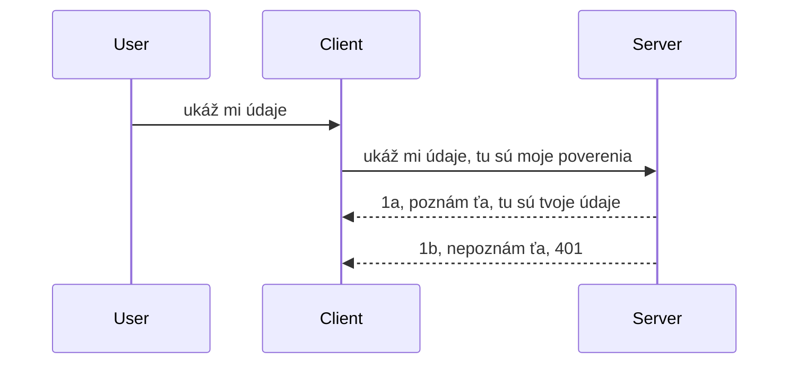

# Jednoduchá autentifikácia

MCP SDK podporujú používanie OAuth 2.1, čo je naozaj zložitý proces zahŕňajúci koncepty ako autentifikačný server, server zdrojov, zasielanie poverení, získavanie kódu, výmenu kódu za prístupový token, až kým nakoniec nedostanete dáta z vašich zdrojov. Ak nie ste zvyknutí na OAuth, čo je skvelá vec na implementáciu, je dobré začať s nejakou základnou úrovňou autentifikácie a postupne ju zlepšovať k lepšej bezpečnosti. Preto existuje táto kapitola, aby vás vybudovala na pokročilejšiu autentifikáciu.

## Autentifikácia, čo tým myslíme?

Autentifikácia je skrátene overovanie identity a autorizácia. Myšlienka je, že potrebujeme urobiť dve veci:

- **Overenie identity (Authentication)**, čo je proces zistenia, či necháme osobu vstúpiť do nášho domu, či má právo byť „tu“, teda mať prístup k nášmu serveru zdrojov, kde sú funkcie MCP servera.
- **Autorizácia (Authorization)**, je proces zisťovania, či užívateľ by mal mať prístup k týmto konkrétnym zdrojom, o ktoré žiada, napríklad tieto objednávky alebo produkty, alebo či smie len čítať obsah, ale nie mazať, ako jeden z príkladov.

## Poverenia: ako systému hovoríme, kto sme

Väčšina webových vývojárov začína uvažovať v zmysle poskytovania poverenia serveru, zvyčajne tajomstva, ktoré hovorí, či im je dovolené byť „tu“ – autentifikácia. Toto poverenie je zvyčajne base64 zakódovaná verzia užívateľského mena a hesla alebo API kľúč, ktorý jednoznačne identifikuje konkrétneho používateľa.

Zahŕňa to jeho odosielanie v hlavičke nazývanej „Authorization“ takto:

```json
{ "Authorization": "secret123" }
```

Toto sa zvyčajne nazýva základná autentifikácia. Ako potom celý tok funguje, je nasledovné:


```mermaid
sequenceDiagram
   participant User
   participant Client
   participant Server

   User->>Client: ukáž mi údaje
   Client->>Server: ukáž mi údaje, tu sú moje poverenia
   Server-->>Client: 1a, poznám ťa, tu sú tvoje údaje
   Server-->>Client: 1b, nepoznám ťa, 401 
```

Teraz, keď chápeme, ako to funguje z hľadiska toku, ako to implementujeme? Väčšina webových serverov má koncept middleware, kus kódu, ktorý beží ako súčasť požiadavky a vie overiť poverenia, a ak sú platné, môže požiadavku pustiť ďalej. Ak požiadavka nemá platné poverenia, dostanete chybu autentifikácie. Pozrime sa, ako to možno implementovať:

**Python**

```python
class AuthMiddleware(BaseHTTPMiddleware):
    async def dispatch(self, request, call_next):

        has_header = request.headers.get("Authorization")
        if not has_header:
            print("-> Missing Authorization header!")
            return Response(status_code=401, content="Unauthorized")

        if not valid_token(has_header):
            print("-> Invalid token!")
            return Response(status_code=403, content="Forbidden")

        print("Valid token, proceeding...")
       
        response = await call_next(request)
        # pridajte akékoľvek vlastné hlavičky alebo zmeňte odpoveď nejakým spôsobom
        return response


starlette_app.add_middleware(CustomHeaderMiddleware)
```

Máme tu:

- Vytvorili sme middleware nazvaný `AuthMiddleware`, kde metóda `dispatch` je volaná webovým serverom.
- Pridali middleware do webového servera:

    ```python
    starlette_app.add_middleware(AuthMiddleware)
    ```

- Napísali sme validačnú logiku, ktorá kontroluje, či je prítomná hlavička Authorization a či zaslané tajomstvo je platné:

    ```python
    has_header = request.headers.get("Authorization")
    if not has_header:
        print("-> Missing Authorization header!")
        return Response(status_code=401, content="Unauthorized")

    if not valid_token(has_header):
        print("-> Invalid token!")
        return Response(status_code=403, content="Forbidden")
    ```

    ak je tajomstvo prítomné a platné, požiadavku pustíme ďalej zavolaním `call_next` a vrátime odpoveď.

    ```python
    response = await call_next(request)
    # pridajte akékoľvek hlavičky zákazníka alebo nejako zmeňte odpoveď
    return response
    ```

Funguje to tak, že ak je vykonaná požiadavka na webový server, middleware sa spustí a podľa implementácie buď požiadavku pustí ďalej, alebo vráti chybu, ktorá indikuje, že klient nemá povolenie pokračovať.

**TypeScript**

Tu vytvárame middleware s populárnym frameworkom Express a zachytávame požiadavku pred tým, než dosiahne MCP Server. Tu je kód na to:

```typescript
function isValid(secret) {
    return secret === "secret123";
}

app.use((req, res, next) => {
    // 1. Hlavička autorizácie prítomná?
    if(!req.headers["Authorization"]) {
        res.status(401).send('Unauthorized');
    }
    
    let token = req.headers["Authorization"];

    // 2. Skontrolujte platnosť.
    if(!isValid(token)) {
        res.status(403).send('Forbidden');
    }

   
    console.log('Middleware executed');
    // 3. Odovzdá požiadavku do ďalšieho kroku v procese spracovania požiadavky.
    next();
});
```

V tomto kóde:

1. Skontrolujeme, či je hlavička Authorization v prvom rade prítomná, ak nie, pošleme chybu 401.
2. Overíme, či je poverenie/token platný, ak nie, pošleme chybu 403.
3. Nakoniec pustíme požiadavku ďalej v pipeline a vrátime požadovaný zdroj.

## Cvičenie: Implementujte autentifikáciu

Vezmeme naše vedomosti a vyskúšame implementáciu. Plán je nasledovný:

Server

- Vytvorte webový server a inštanciu MCP.
- Implementujte middleware pre server.

Klient

- Pošlite webovú požiadavku s poverením cez hlavičku.

### -1- Vytvorenie webového servera a inštancie MCP

> [!WARNING]
> Príklad v TypeScript nižšie cieli na MCP `2025-11-25`. Sleduje transporty
> podľa `mcp-session-id` a nie je súčasným príkladom transportu `2026-07-28`. MCP
> `2026-07-28` odstraňuje handshake `initialize` a protokolový session ID; nové
> implementácie používajú samostatné požiadavky. Viď
> [Čo sa zmenilo v MCP: Špecifikácia 2026-07-28](../../01-CoreConcepts/mcp-2026-07-28.md).

V našom prvom kroku potrebujeme vytvoriť inštanciu webového servera a MCP servera.

**Python**

Tu vytvoríme inštanciu MCP servera, vytvoríme webovú aplikáciu starlette a hosťujeme ju pomocou uvicorn.

```python
# vytváranie MCP servera

app = FastMCP(
    name="MCP Resource Server",
    instructions="Resource Server that validates tokens via Authorization Server introspection",
    host=settings["host"],
    port=settings["port"],
    debug=True
)

# vytváranie webovej aplikácie starlette
starlette_app = app.streamable_http_app()

# spúšťanie aplikácie cez uvicorn
async def run(starlette_app):
    import uvicorn
    config = uvicorn.Config(
            starlette_app,
            host=app.settings.host,
            port=app.settings.port,
            log_level=app.settings.log_level.lower(),
        )
    server = uvicorn.Server(config)
    await server.serve()

run(starlette_app)
```

V tomto kóde:

- Vytvoríme MCP Server.
- Postavíme starlette webovú aplikáciu z MCP Servera, `app.streamable_http_app()`.
- Hosťujeme a servírujeme webovú aplikáciu pomocou uvicorn `server.serve()`.

**TypeScript**

Tu vytvárame inštanciu MCP Servera.

```typescript
const server = new McpServer({
      name: "example-server",
      version: "1.0.0"
    });

    // ... nastaviť serverové zdroje, nástroje a výzvy ...
```

Toto vytvorenie MCP Servera musí prebehnúť v definícii nášho POST /mcp route, takže vezmime vyššie uvedený kód a presuňme ho takto:

```typescript
import express from "express";
import { randomUUID } from "node:crypto";
import { McpServer } from "@modelcontextprotocol/sdk/server/mcp.js";
import { StreamableHTTPServerTransport } from "@modelcontextprotocol/sdk/server/streamableHttp.js";
import { isInitializeRequest } from "@modelcontextprotocol/sdk/types.js"

const app = express();
app.use(express.json());

// Mapa na ukladanie transportov podľa ID relácie
const transports: { [sessionId: string]: StreamableHTTPServerTransport } = {};

// Spracovať POST požiadavky pre komunikáciu klient-server
app.post('/mcp', async (req, res) => {
  // Skontrolovať existujúce ID relácie
  const sessionId = req.headers['mcp-session-id'] as string | undefined;
  let transport: StreamableHTTPServerTransport;

  if (sessionId && transports[sessionId]) {
    // Znovu použiť existujúci transport
    transport = transports[sessionId];
  } else if (!sessionId && isInitializeRequest(req.body)) {
    // Nová inicializačná požiadavka
    transport = new StreamableHTTPServerTransport({
      sessionIdGenerator: () => randomUUID(),
      onsessioninitialized: (sessionId) => {
        // Uložiť transport podľa ID relácie
        transports[sessionId] = transport;
      },
      // Ochrana pred DNS rebindingom je štandardne vypnutá pre spätnú kompatibilitu. Ak tento server
      // spúšťate lokálne, uistite sa, že máte nastavené:
      // enableDnsRebindingProtection: true,
      // allowedHosts: ['127.0.0.1'],
    });

    // Vyčistiť transport po zatvorení
    transport.onclose = () => {
      if (transport.sessionId) {
        delete transports[transport.sessionId];
      }
    };
    const server = new McpServer({
      name: "example-server",
      version: "1.0.0"
    });

    // ... nastaviť zdroje servera, nástroje a výzvy ...

    // Pripojiť sa k MCP serveru
    await server.connect(transport);
  } else {
    // Neplatná požiadavka
    res.status(400).json({
      jsonrpc: '2.0',
      error: {
        code: -32000,
        message: 'Bad Request: No valid session ID provided',
      },
      id: null,
    });
    return;
  }

  // Spracovať požiadavku
  await transport.handleRequest(req, res, req.body);
});

// Opakovane použiteľný spracovateľ pre GET a DELETE požiadavky
const handleSessionRequest = async (req: express.Request, res: express.Response) => {
  const sessionId = req.headers['mcp-session-id'] as string | undefined;
  if (!sessionId || !transports[sessionId]) {
    res.status(400).send('Invalid or missing session ID');
    return;
  }
  
  const transport = transports[sessionId];
  await transport.handleRequest(req, res);
};

// Spracovať GET požiadavky pre notifikácie zo servera na klienta cez SSE
app.get('/mcp', handleSessionRequest);

// Spracovať DELETE požiadavky pre ukončenie relácie
app.delete('/mcp', handleSessionRequest);

app.listen(3000);
```

Teraz vidíte, že vytvorenie MCP Servera bolo presunuté do `app.post("/mcp")`.

Poďme k ďalšiemu kroku vytvorenia middleware, aby sme mohli validovať prichádzajúce poverenia.

### -2- Implementujte middleware pre server

Poďme k časti middleware. Tu vytvoríme middleware, ktorý hľadá poverenie v hlavičke `Authorization` a overí ho. Ak je prijateľné, požiadavka bude pokračovať a vykoná to, čo má (napr. zobraziť nástroje, čítať zdroj alebo čokoľvek MCP klient žiada).

**Python**

Na vytvorenie middleware potrebujeme vytvoriť triedu, ktorá dedí z `BaseHTTPMiddleware`. Sú tu dva zaujímavé kusy:

- Požiadavka `request`, z ktorej čítame info z hlavičky.
- `call_next` je callback, ktorý vyvoláme ak klient priniesol prijateľné poverenia.

Najprv potrebujeme ošetriť prípad, ak hlavička `Authorization` chýba:

```python
has_header = request.headers.get("Authorization")

# hlavička nie je prítomná, zlyhať s 401, inak pokračovať ďalej.
if not has_header:
    print("-> Missing Authorization header!")
    return Response(status_code=401, content="Unauthorized")
```

Tu pošleme správu 401 unauthorized, pretože klient neprešiel autentifikáciou.

Ďalej, ak bolo zaslané poverenie, musíme overiť jeho platnosť takto:

```python
 if not valid_token(has_header):
    print("-> Invalid token!")
    return Response(status_code=403, content="Forbidden")
```

Všimnite si, že vyššie posielame správu 403 forbidden. Pozrime sa na celé middleware nižšie implementujúce všetko, čo sme spomenuli vyššie:

```python
class AuthMiddleware(BaseHTTPMiddleware):
    async def dispatch(self, request, call_next):

        has_header = request.headers.get("Authorization")
        if not has_header:
            print("-> Missing Authorization header!")
            return Response(status_code=401, content="Unauthorized")

        if not valid_token(has_header):
            print("-> Invalid token!")
            return Response(status_code=403, content="Forbidden")

        print("Valid token, proceeding...")
        print(f"-> Received {request.method} {request.url}")
        response = await call_next(request)
        response.headers['Custom'] = 'Example'
        return response

```

Skvelé, ale čo funkcia `valid_token`? Tu je nižšie:

```python
# NEpoužívajte na produkciu - zlepšite to !!
def valid_token(token: str) -> bool:
    # odstráňte prefix "Bearer "
    if token.startswith("Bearer "):
        token = token[7:]
        return token == "secret-token"
    return False
```

Toto by samozrejme malo byť vylepšené.

DÔLEŽITÉ: Nikdy by ste nemali mať takéto tajomstvá priamo v kóde. Hodnotu, s ktorou sa porovnáva, by ste mali ideálne získať z dátového zdroja alebo od poskytovateľa identity (IDP), alebo ešte lepšie, nechať validáciu na IDP.

**TypeScript**

Na implementáciu s Express potrebujeme volať metódu `use`, ktorá prijíma middleware funkcie.

Potrebujeme:

- Interagovať s premennou požiadavky a skontrolovať odoslané poverenia v políčku `Authorization`.
- Overiť tieto poverenia, a ak sú platné, pustiť požiadavku ďalej, aby klient mohol robiť, čo žiadal (napr. zobraziť nástroje, čítať zdroj alebo iné MCP funkcie).

Tu kontrolujeme, či je prítomná hlavička `Authorization`, a ak nie je, zastavíme požiadavku:

```typescript
if(!req.headers["authorization"]) {
    res.status(401).send('Unauthorized');
    return;
}
```

Ak hlavička chýba, dostanete chybu 401.

Ďalej kontrolujeme platnosť poverenia, ak nie je platné, opäť zastavíme požiadavku s trochu inou správou:

```typescript
if(!isValid(token)) {
    res.status(403).send('Forbidden');
    return;
} 
```

Všimnite si, že teraz dostanete chybu 403.

Tu je celý kód:

```typescript
app.use((req, res, next) => {
    console.log('Request received:', req.method, req.url, req.headers);
    console.log('Headers:', req.headers["authorization"]);
    if(!req.headers["authorization"]) {
        res.status(401).send('Unauthorized');
        return;
    }
    
    let token = req.headers["authorization"];

    if(!isValid(token)) {
        res.status(403).send('Forbidden');
        return;
    }  

    console.log('Middleware executed');
    next();
});
```

Nastavili sme webový server tak, aby akceptoval middleware na kontrolu poverenia, ktoré nám klient dúfajme posiela. A čo samotný klient?

### -3- Pošlite webovú požiadavku s poverením v hlavičke

Musíme zabezpečiť, aby klient posílal poverenie cez hlavičku. Keďže použijeme MCP klienta, musíme zistiť, ako sa to robí.

**Python**

Pre klienta musíme poslať hlavičku s našim poverením takto:

```python
# NENECHÁVAJ hodnotu pevne zakódovanú, maj ju minimálne v premennej prostredia alebo v bezpečnejšom úložisku
token = "secret-token"

async with streamablehttp_client(
        url = f"http://localhost:{port}/mcp",
        headers = {"Authorization": f"Bearer {token}"}
    ) as (
        read_stream,
        write_stream,
        session_callback,
    ):
        async with ClientSession(
            read_stream,
            write_stream
        ) as session:
            await session.initialize()
      
            # TODO, čo chceš, aby klient vykonal, napr. zoznam nástrojov, volanie nástrojov atď.
```

Všimnite si, že vkladáme do premennej `headers` takto: ` headers = {"Authorization": f"Bearer {token}"}`.

**TypeScript**

Riešime to v dvoch krokoch:

1. Naplniť konfiguračný objekt našimi povereniami.
2. Predať tento konfiguračný objekt transportu.

```typescript

// NEPEVNÉ zakódujte hodnotu, ako je to tu zobrazené. Minimálne použite pre ňu premennú prostredia a niečo ako dotenv (v režime vývoja).
let token = "secret123"

// definujte objekt s možnosťami transportu klienta
let options: StreamableHTTPClientTransportOptions = {
  sessionId: sessionId,
  requestInit: {
    headers: {
      "Authorization": "secret123"
    }
  }
};

// odovzdajte objekt možností do transportu
async function main() {
   const transport = new StreamableHTTPClientTransport(
      new URL(serverUrl),
      options
   );
```

Tu vidíte, že sme museli vytvoriť objekt `options` a umiestniť hlavičky pod vlastnosť `requestInit`.

DÔLEŽITÉ: Ako to ale ďalej vylepšiť? Súčasná implementácia má niekoľko problémov. Najskôr, posielanie poverenia týmto spôsobom je dosť rizikové, pokiaľ aspoň nemáte HTTPS. Aj tak však môže byť poverenie ukradnuté, preto potrebujete systém, kde môžete ľahko zrušiť token a pridať ďalšie kontroly – ako odkiaľ je požiadavka, či sa nevykonáva príliš často (bot-like správanie), skrátka je tu veľa obáv.

Treba však povedať, že pre veľmi jednoduché API, kde nechcete, aby ktokoľvek volal vaše API bez autentifikácie, je toto dobrý začiatok.

S tým povedaným, poďme trochu posilniť bezpečnosť použitím štandardizovaného formátu ako JSON Web Token, tiež známeho ako JWT alebo "JOT" tokeny.

## JSON Web Tokeny, JWT

Snažíme sa teda vylepšiť veci oproti posielaniu veľmi jednoduchých poverení. Aké sú okamžité výhody zavedenia JWT?

- **Zlepšenia bezpečnosti**. V základnej autentifikácii posielate užívateľské meno a heslo ako base64 zakódovaný token (alebo API kľúč) stále dokola, čo zvyšuje riziko. S JWT posielate užívateľské meno a heslo, dostanete token na oplátku a ten má časové obmedzenie platnosti. JWT umožňuje použiť jemnozrnnú kontrolu prístupov pomocou rolí, rozsahov a oprávnení.
- **Bezstavovosť a škálovateľnosť**. JWT sú samostatné, nesú všetky info o používateľovi a eliminuje potrebu ukladania session server-side. Token možno overiť lokálne.
- **Interoperabilita a federácia**. JWT sú centrom Open ID Connect a používajú sa s overenými poskytovateľmi identity ako Entra ID, Google Identity a Auth0. Umožňujú jednorazové prihlásenie a mnoho ďalšieho, čo z nich robí riešenie podnikovej úrovne.
- **Modularita a flexibilita**. JWT možno použiť aj s API bránami ako Azure API Management, NGINX a ďalšími. Podporujú autentifikáciu a server-na-server komunikáciu vrátane impersonácie a delegácie.
- **Výkon a cacheovanie**. JWT možno po dekódovaní cachovať, čím sa znižuje potreba opätovného parsovania. To pomáha najmä pri aplikáciách s veľkým zaťažením, lebo zlepšuje priepustnosť a znižuje záťaž infraštruktúry.
- **Pokročilé funkcie**. Podporujú tiež introspekciu (kontrola platnosti na serveri) a zrušenie platnosti tokenu (revokáciu).

S týmito výhodami sa pozrime, ako môžeme vziať našu implementáciu na vyššiu úroveň.

## Premena základnej autentifikácie na JWT

Takže zmeny, ktoré musíme urobiť na vysokej úrovni, sú:

- **Naučiť sa vytvárať JWT token** a pripraviť ho na odoslanie zo strany klienta na server.
- **Overiť JWT token**, a ak je platný, dovoliť klientovi prístup k našim zdrojom.
- **Bezpečné uloženie tokenu**. Ako bezpečne uložiť tento token.
- **Chrániť cesty**. Potrebujeme chrániť cesty, v našom prípade konkrétne MCP funkcie.
- **Pridať refresh tokeny**. Zabezpečiť, že vytvoríme tokeny s krátkou platnosťou a refresh tokeny s dlhšou platnosťou, ktoré možno použiť na získanie nových tokenov po vypršaní platnosti. Taktiež zajistiť endpoint na refresh a stratégiu rotating tokenov.

### -1- Vytvorenie JWT tokenu

JWT token má nasledujúce časti:

- **header** – algoritmus a typ tokenu.
- **payload** – nároky, ako sub (užívateľ alebo entita, ktorú token reprezentuje – zvyčajne user id), exp (kedy vyprší), role (rola).
- **signature** – podpísaná tajomstvom alebo súkromným kľúčom.

Budeme musieť skonštruovať header, payload a zakódovaný token.

**Python**

```python

import jwt
import jwt
from jwt.exceptions import ExpiredSignatureError, InvalidTokenError
import datetime

# Tajný kľúč použitý na podpísanie JWT
secret_key = 'your-secret-key'

header = {
    "alg": "HS256",
    "typ": "JWT"
}

# informácie o používateľovi, jeho nároky a čas expirácie
payload = {
    "sub": "1234567890",               # Predmet (ID používateľa)
    "name": "User Userson",                # Vlastný nárok
    "admin": True,                     # Vlastný nárok
    "iat": datetime.datetime.utcnow(),# Vydané
    "exp": datetime.datetime.utcnow() + datetime.timedelta(hours=1)  # Expirácia
}

# zakódovať to
encoded_jwt = jwt.encode(payload, secret_key, algorithm="HS256", headers=header)
```

V uvedenom kóde sme:

- Definovali header s algoritmom HS256 a typom JWT.
- Vytvorili payload obsahujúci subject alebo user id, užívateľské meno, rolu, čas vydania a čas expirácia, implementujúc tak časové obmedzenie platnosti.

**TypeScript**

Tu budeme potrebovať niektoré závislosti, ktoré nám pomôžu vytvoriť JWT token.

Závislosti

```sh

npm install jsonwebtoken
npm install --save-dev @types/jsonwebtoken
```

Teraz, keď to máme, vytvorme header, payload a cez nich zakódovaný token.

```typescript
import jwt from 'jsonwebtoken';

const secretKey = 'your-secret-key'; // Použite premenné prostredia v produkcii

// Definujte zaťažovací obsah
const payload = {
  sub: '1234567890',
  name: 'User usersson',
  admin: true,
  iat: Math.floor(Date.now() / 1000), // Vydané o
  exp: Math.floor(Date.now() / 1000) + 60 * 60 // Platné 1 hodinu
};

// Definujte hlavičku (voliteľné, jsonwebtoken nastavuje predvolené hodnoty)
const header = {
  alg: 'HS256',
  typ: 'JWT'
};

// Vytvorte token
const token = jwt.sign(payload, secretKey, {
  algorithm: 'HS256',
  header: header
});

console.log('JWT:', token);
```

Tento token:

Je podpísaný pomocou HS256
Je platný jednu hodinu
Obsahuje nároky ako sub, name, admin, iat a exp.

### -2- Overenie tokenu

Budeme tiež potrebovať overiť token, čo by sme mali robiť na serveri, aby sme zaručili, že to, čo nám klient posiela, je skutočne platné. Existuje mnoho kontrol, ktoré by sme mali vykonať – od overenia štruktúry až po platnosť. Odporúča sa tiež pridať ďalšie kontroly, či je užívateľ v systéme a podobne.

Na overenie tokenu ho musíme dekódovať, aby sme ho mohli čítať, a potom začať kontrolovať jeho platnosť:

**Python**

```python

# Dekódujte a overte JWT
try:
    decoded = jwt.decode(token, secret_key, algorithms=["HS256"])
    print("✅ Token is valid.")
    print("Decoded claims:")
    for key, value in decoded.items():
        print(f"  {key}: {value}")
except ExpiredSignatureError:
    print("❌ Token has expired.")
except InvalidTokenError as e:
    print(f"❌ Invalid token: {e}")

```


V tomto kóde voláme `jwt.decode` s tokenom, tajným kľúčom a zvoleným algoritmom ako vstupom. Všimnite si, ako používame konštrukt try-catch, pretože neúspešná validácia vedie k vyvolaniu chyby.

**TypeScript**

Tu potrebujeme zavolať `jwt.verify`, aby sme získali dekódovanú verziu tokenu, ktorú môžeme ďalej analyzovať. Ak toto volanie zlyhá, znamená to, že štruktúra tokenu je nesprávna alebo už nie je platná.

```typescript

try {
  const decoded = jwt.verify(token, secretKey);
  console.log('Decoded Payload:', decoded);
} catch (err) {
  console.error('Token verification failed:', err);
}
```

POZNÁMKA: ako už bolo spomenuté, mali by sme vykonať ďalšie kontroly, aby sme sa uistili, že tento token odkazuje na používateľa v našom systéme a že používateľ má práva, ktoré tvrdí, že má.

Ďalej sa pozrime na riadenie prístupu založené na rolách, známe aj ako RBAC.

## Pridanie riadenia prístupu založeného na rolách

Idea je taká, že chceme vyjadriť, že rôzne roly majú rôzne oprávnenia. Napríklad predpokladáme, že admin môže všetko, bežný používateľ môže čítať/písať a hosť môže len čítať. Preto tu sú niektoré možné úrovne oprávnení:

- Admin.Write 
- User.Read
- Guest.Read

Pozrime sa, ako môžeme implementovať takéto riadenie prostredníctvom middleware. Middleware možno pridávať k jednotlivým trasám aj ku všetkým trasám.

**Python**

```python
from starlette.middleware.base import BaseHTTPMiddleware
from starlette.responses import JSONResponse
import jwt

# NEUCHOVÁVAJTE tajný kód priamo v kóde, toto je len pre demonstračné účely. Prečítajte si ho z bezpečného miesta.
SECRET_KEY = "your-secret-key" # uložte to do env premennej
REQUIRED_PERMISSION = "User.Read"

class JWTPermissionMiddleware(BaseHTTPMiddleware):
    async def dispatch(self, request, call_next):
        auth_header = request.headers.get("Authorization")
        if not auth_header or not auth_header.startswith("Bearer "):
            return JSONResponse({"error": "Missing or invalid Authorization header"}, status_code=401)

        token = auth_header.split(" ")[1]
        try:
            decoded = jwt.decode(token, SECRET_KEY, algorithms=["HS256"])
        except jwt.ExpiredSignatureError:
            return JSONResponse({"error": "Token expired"}, status_code=401)
        except jwt.InvalidTokenError:
            return JSONResponse({"error": "Invalid token"}, status_code=401)

        permissions = decoded.get("permissions", [])
        if REQUIRED_PERMISSION not in permissions:
            return JSONResponse({"error": "Permission denied"}, status_code=403)

        request.state.user = decoded
        return await call_next(request)


```

Existuje niekoľko rôznych spôsobov, ako pridať middleware, napríklad nižšie:

```python

# Alt 1: pridanie middleware počas vytvárania starlette aplikácie
middleware = [
    Middleware(JWTPermissionMiddleware)
]

app = Starlette(routes=routes, middleware=middleware)

# Alt 2: pridanie middleware po tom, čo je starlette aplikácia už vytvorená
starlette_app.add_middleware(JWTPermissionMiddleware)

# Alt 3: pridanie middleware pre každú trasu
routes = [
    Route(
        "/mcp",
        endpoint=..., # spracovateľ
        middleware=[Middleware(JWTPermissionMiddleware)]
    )
]
```

**TypeScript**

Môžeme použiť `app.use` a middleware, ktorý bude spustený pre všetky požiadavky.

```typescript
app.use((req, res, next) => {
    console.log('Request received:', req.method, req.url, req.headers);
    console.log('Headers:', req.headers["authorization"]);

    // 1. Skontrolujte, či bol odoslaný hlavičkový atribút autorizácie

    if(!req.headers["authorization"]) {
        res.status(401).send('Unauthorized');
        return;
    }
    
    let token = req.headers["authorization"];

    // 2. Skontrolujte, či je token platný
    if(!isValid(token)) {
        res.status(403).send('Forbidden');
        return;
    }  

    // 3. Skontrolujte, či používateľ tokenu existuje v našom systéme
    if(!isExistingUser(token)) {
        res.status(403).send('Forbidden');
        console.log("User does not exist");
        return;
    }
    console.log("User exists");

    // 4. Overte, či má token správne oprávnenia
    if(!hasScopes(token, ["User.Read"])){
        res.status(403).send('Forbidden - insufficient scopes');
    }

    console.log("User has required scopes");

    console.log('Middleware executed');
    next();
});

```

Existuje dosť veľa vecí, ktoré náš middleware môže a MAL by robiť, konkrétne:

1. Skontrolovať, či je prítomný autorizačný header
2. Overiť platnosť tokenu, voláme `isValid`, čo je metóda, ktorú sme napísali na kontrolu integrity a platnosti JWT tokenu.
3. Overiť, že používateľ existuje v našom systéme, toto by sme mali skontrolovať.

   ```typescript
    // používatelia v DB
   const users = [
     "user1",
     "User usersson",
   ]

   function isExistingUser(token) {
     let decodedToken = verifyToken(token);

     // TODO, skontrolovať, či používateľ existuje v DB
     return users.includes(decodedToken?.name || "");
   }
   ```

   Vyššie sme vytvorili veľmi jednoduchý zoznam `users`, ktorý by samozrejme mal byť v databáze.

4. Okrem toho by sme mali tiež skontrolovať, či token má správne oprávnenia.

   ```typescript
   if(!hasScopes(token, ["User.Read"])){
        res.status(403).send('Forbidden - insufficient scopes');
   }
   ```

   V tomto kóde z middleware kontrolujeme, či token obsahuje oprávnenie User.Read, ak nie, posielame chybu 403. Nižšie je pomocná metóda `hasScopes`.

   ```typescript
   function hasScopes(scope: string, requiredScopes: string[]) {
     let decodedToken = verifyToken(scope);
    return requiredScopes.every(scope => decodedToken?.scopes.includes(scope));
  }
   ```

Have a think which additional checks you should be doing, but these are the absolute minimum of checks you should be doing.

Using Express as a web framework is a common choice. There are helpers library when you use JWT so you can write less code.

- `express-jwt`, helper library that provides a middleware that helps decode your token.
- `express-jwt-permissions`, this provides a middleware `guard` that helps check if a certain permission is on the token.

Here's what these libraries can look like when used:

```typescript
const express = require('express');
const jwt = require('express-jwt');
const guard = require('express-jwt-permissions')();

const app = express();
const secretKey = 'your-secret-key'; // put this in env variable

// Decode JWT and attach to req.user
app.use(jwt({ secret: secretKey, algorithms: ['HS256'] }));

// Check for User.Read permission
app.use(guard.check('User.Read'));

// multiple permissions
// app.use(guard.check(['User.Read', 'Admin.Access']));

app.get('/protected', (req, res) => {
  res.json({ message: `Welcome ${req.user.name}` });
});

// Error handler
app.use((err, req, res, next) => {
  if (err.code === 'permission_denied') {
    return res.status(403).send('Forbidden');
  }
  next(err);
});

```

Teraz ste videli, ako sa middleware môže použiť na autentifikáciu aj autorizáciu, ale čo MCP, mení to spôsob, akým robíme autentifikáciu? Poďme to zistiť v nasledujúcej časti.

### -3- Pridanie RBAC do MCP

Doposiaľ ste videli, ako pridať RBAC prostredníctvom middleware, avšak pre MCP nie je jednoduchý spôsob, ako pridať RBAC pre každú funkciu MCP zvlášť, takže čo robíme? Jednoducho pridáme kód, ktorý v tomto prípade kontroluje, či má klient práva volať konkrétny nástroj:

Máte niekoľko rôznych možností, ako dosiahnuť RBAC pre jednotlivé funkcie, tu sú niektoré:

- Pridať kontrolu pre každý nástroj, zdroj, prompt, kde je potrebné skontrolovať úroveň oprávnení.

   **python**

   ```python
   @tool()
   def delete_product(id: int):
      try:
          check_permissions(role="Admin.Write", request)
      catch:
        pass # klient zlyhal pri autorizácii, vyvolajte chybu autorizácie
   ```

   **typescript**

   ```typescript
   server.registerTool(
    "delete-product",
    {
      title: Delete a product",
      description: "Deletes a product",
      inputSchema: { id: z.number() }
    },
    async ({ id }) => {
      
      try {
        checkPermissions("Admin.Write", request);
        // todo, odoslať id do productService a vzdialeného vstupu
      } catch(Exception e) {
        console.log("Authorization error, you're not allowed");  
      }

      return {
        content: [{ type: "text", text: `Deletected product with id ${id}` }]
      };
    }
   );
   ```


- Použiť pokročilý serverový prístup a request handlery, aby ste minimalizovali počet miest, kde musíte kontrolu vykonať.

   **Python**

   ```python
   
   tool_permission = {
      "create_product": ["User.Write", "Admin.Write"],
      "delete_product": ["Admin.Write"]
   }

   def has_permission(user_permissions, required_permissions) -> bool:
      # user_permissions: zoznam povolení, ktoré používateľ má
      # required_permissions: zoznam povolení požadovaných pre nástroj
      return any(perm in user_permissions for perm in required_permissions)

   @server.call_tool()
   async def handle_call_tool(
     name: str, arguments: dict[str, str] | None
   ) -> list[types.TextContent]:
    # Predpokladaj, že request.user.permissions je zoznam povolení pre používateľa
     user_permissions = request.user.permissions
     required_permissions = tool_permission.get(name, [])
     if not has_permission(user_permissions, required_permissions):
        # Vyhoď chybu "Nemáte povolenie volať nástroj {name}"
        raise Exception(f"You don't have permission to call tool {name}")
     # pokračovať a zavolať nástroj
     # ...
   ```   
   

   **TypeScript**

   ```typescript
   function hasPermission(userPermissions: string[], requiredPermissions: string[]): boolean {
       if (!Array.isArray(userPermissions) || !Array.isArray(requiredPermissions)) return false;
       // Vráťte true, ak má používateľ aspoň jedno požadované povolenie
       
       return requiredPermissions.some(perm => userPermissions.includes(perm));
   }
  
   server.setRequestHandler(CallToolRequestSchema, async (request) => {
      const { params: { name } } = request;
  
      let permissions = request.user.permissions;
  
      if (!hasPermission(permissions, toolPermissions[name])) {
         return new Error(`You don't have permission to call ${name}`);
      }
  
      // pokračujte..
   });
   ```

   Poznámka, je potrebné zabezpečiť, aby middleware priradil dekódovaný token do vlastnosti user požiadavky, aby bol kód vyššie jednoduchý.

### Zhrnutie

Teraz, keď sme prebrali, ako všeobecne pridať podporu RBAC a konkrétne pre MCP, je načase skúsiť implementovať zabezpečenie samostatne, aby ste si overili pochopenie prezentovaných konceptov.

## Úloha 1: Vytvorte mcp server a mcp klient pomocou základnej autentifikácie

Tu použijete to, čo ste sa naučili o odosielaní prihlasovacích údajov cez hlavičky.

## Riešenie 1

[Riešenie 1](./code/basic/README.md)

## Úloha 2: Vylepšiť riešenie z úlohy 1 použitím JWT

Vezmite prvé riešenie, ale tentokrát ho vylepšíme.

Namiesto Basic Auth použijeme JWT.

## Riešenie 2

[Riešenie 2](./solution/jwt-solution/README.md)

## Výzva

Pridajte RBAC pre každý nástroj, ako je to popísané v sekcii "Pridanie RBAC do MCP".

## Zhrnutie

Dúfame, že ste sa v tejto kapitole veľa naučili, od absencie zabezpečenia, cez základné zabezpečenie, až po JWT a ako môže byť pridané do MCP.

Vybudovali sme pevný základ s vlastnými JWT, ale pri raste smerujeme k štandardizovanému modelu identity. Použitie IdP ako Entra alebo Keycloak nám umožní delegovať vydávanie tokenov, ich validáciu a správu životného cyklu na dôveryhodnú platformu — čo nám uvoľní ruky zamerať sa na logiku aplikácie a používateľskú skúsenosť.

Pre to máme pokročilejšiu [kapitolu o Entra](../../05-AdvancedTopics/mcp-security-entra/README.md)

## Čo bude ďalej

- Ďalej: [Nastavenie MCP hostiteľov](../12-mcp-hosts/README.md)

---

<!-- CO-OP TRANSLATOR DISCLAIMER START -->
**Vyhlásenie o zodpovednosti**:
Tento dokument bol preložený pomocou AI prekladateľskej služby [Co-op Translator](https://github.com/Azure/co-op-translator). Hoci sa snažíme o presnosť, vezmite prosím na vedomie, že automatické preklady môžu obsahovať chyby alebo nepresnosti. Pôvodný dokument v jeho natívnom jazyku by mal byť považovaný za autoritatívny zdroj. Pre kritické informácie sa odporúča profesionálny ľudský preklad. Nie sme zodpovední za žiadne nedorozumenia alebo nesprávne interpretácie vyplývajúce z použitia tohto prekladu.
<!-- CO-OP TRANSLATOR DISCLAIMER END -->