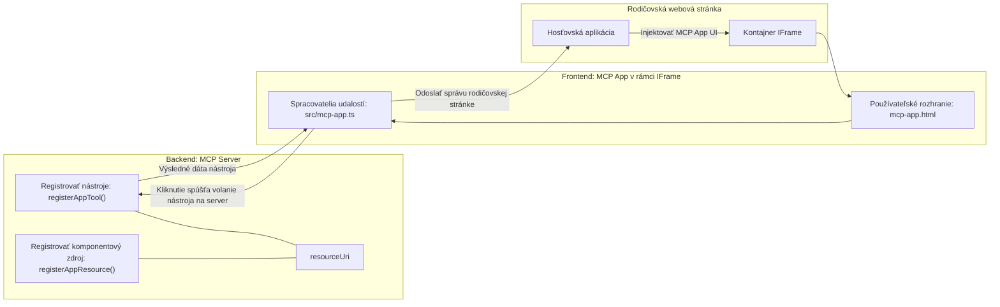
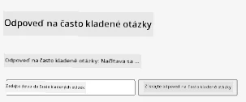
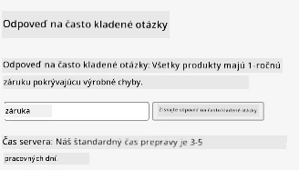
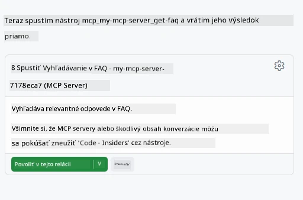
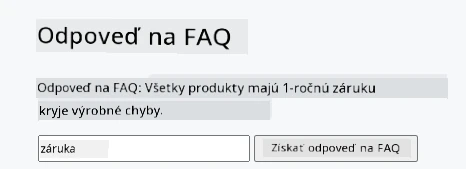

# MCP Aplikácie

MCP Aplikácie sú novým paradigmov v MCP. Myšlienka je taká, že nielen reagujete s dátami z volania nástroja, ale zároveň poskytujete informácie o tom, ako by sa s týmito informáciami malo interagovať. To znamená, že výsledky nástrojov teraz môžu obsahovať informácie o používateľskom rozhraní. Prečo by sme to však chceli? No, zvážte, ako veci robíte dnes. Pravdepodobne konzumujete výsledky MCP Servera tým, že pred ne nasadíte nejaký front-end, čo je kód, ktorý musíte písať a udržiavať. Niekedy je to to, čo chcete, ale niekedy by bolo skvelé, keby ste mohli priniesť útržok informácie, ktorý je samostatný a má všetko od dát po používateľské rozhranie.

## Prehľad

Táto lekcia poskytuje praktické usmernenie o MCP Aplikáciách, ako s nimi začať a ako ich integrovať do vašich existujúcich webových aplikácií. MCP Aplikácie sú veľmi novým prírastkom do MCP Štandardu.

## Výukové ciele

Na konci tejto lekcie budete vedieť:

- Vysvetliť, čo sú MCP Aplikácie.
- Kedy použiť MCP Aplikácie.
- Vytvoriť a integrovať vlastné MCP Aplikácie.

## MCP Aplikácie - ako to funguje

Myšlienka MCP Aplikácií je poskytnúť odpoveď, ktorá je vlastne komponentom na vykreslenie. Takýto komponent môže mať vizuály aj interaktivitu, napríklad kliknutia na tlačidlá, vstup používateľa a ďalšie. Začnime na serverovej strane a našom MCP Serveri. Na vytvorenie komponentu MCP Aplikácie potrebujete vytvoriť nástroj, ale aj aplikačný zdroj. Tieto dve časti sú prepojené pomocou resourceUri. 

Tu je príklad. Skúsme si vizualizovať, čo je zapojené a ktorá časť čo robí:

```text
server.ts -- responsible for registering tools and the component as a UI component
src/
  mcp-app.ts -- wiring up event handlers
mcp-app.html -- the user interface
```

Tento vizuál popisuje architektúru na vytvorenie komponentu a jeho logiku.


Skúsme popísať zodpovednosti pre backend a frontend postupne.

### Backend

Sú tu dve veci, ktoré potrebujeme dosiahnuť:

- Registrácia nástrojov, s ktorými chceme interagovať.
- Definovať komponent.

**Registrácia nástroja**

```typescript
registerAppTool(
    server,
    "get-time",
    {
      title: "Get Time",
      description: "Returns the current server time.",
      inputSchema: {},
      _meta: { ui: { resourceUri } }, // Pripojí tento nástroj k jeho UI zdroju
    },
    async () => {
      const time = new Date().toISOString();
      return { content: [{ type: "text", text: time }] };
    },
  );

```

Predchádzajúci kód popisuje správanie, kde exponuje nástroj nazvaný `get-time`. Neberie žiadne vstupy, ale nakoniec produkuje aktuálny čas. Máme možnosť definovať `inputSchema` pre nástroje, kde potrebujeme prijať vstup používateľa.

**Registrácia komponentu**

V rovnakom súbore potrebujeme tiež zaregistrovať komponent:

```typescript
const resourceUri = "ui://get-time/mcp-app.html";

// Zaregistrujte zdroj, ktorý vracia zabalený HTML/JavaScript pre používateľské rozhranie.
registerAppResource(
  server,
  resourceUri,
  resourceUri,
  { mimeType: RESOURCE_MIME_TYPE },
  async () => {
    const html = await fs.readFile(path.join(DIST_DIR, "mcp-app.html"), "utf-8");

    return {
    contents: [
        { uri: resourceUri, mimeType: RESOURCE_MIME_TYPE, text: html },
    ],
    };
  },
);
```

Všimnite si, ako spomíname `resourceUri` na prepojenie komponentu s jeho nástrojmi. Zaujímavá je aj spätná väzba, kde načítavame UI súbor a vraciame komponent.

### Frontend komponentu

Rovnako ako backend, sú tu dve časti:

- Frontend napísaný v čistej HTML.
- Kód, ktorý spracováva udalosti a čo robiť, napríklad volať nástroje alebo odosielať správy do rodičovského okna.

**Používateľské rozhranie**

Pozrime sa na používateľské rozhranie.

```html
<!-- mcp-app.html -->
<!DOCTYPE html>
<html lang="en">
  <head>
    <meta charset="UTF-8" />
    <title>Get Time App</title>
  </head>
  <body>
    <p>
      <strong>Server Time:</strong> <code id="server-time">Loading...</code>
    </p>
    <button id="get-time-btn">Get Server Time</button>
    <script type="module" src="/src/mcp-app.ts"></script>
  </body>
</html>
```

**Pripojenie udalostí**

Poslednou časťou je prepojenie udalostí. To znamená, že identifikujeme, ktorá časť v našom UI potrebuje spracovanie udalostí a čo robiť, ak sú udalosti vyvolané:

```typescript
// mcp-app.ts

import { App } from "@modelcontextprotocol/ext-apps";

// Získajte referencie na prvky
const serverTimeEl = document.getElementById("server-time")!;
const getTimeBtn = document.getElementById("get-time-btn")!;

// Vytvorte inštanciu aplikácie
const app = new App({ name: "Get Time App", version: "1.0.0" });

// Spracujte výsledky nástrojov zo servera. Nastavte pred `app.connect()`, aby ste predišli
// strate počiatočného výsledku nástroja.
app.ontoolresult = (result) => {
  const time = result.content?.find((c) => c.type === "text")?.text;
  serverTimeEl.textContent = time ?? "[ERROR]";
};

// Prepojte kliknutie na tlačidlo
getTimeBtn.addEventListener("click", async () => {
  // `app.callServerTool()` umožňuje používateľskému rozhraniu vyžiadať si čerstvé údaje zo servera
  const result = await app.callServerTool({ name: "get-time", arguments: {} });
  const time = result.content?.find((c) => c.type === "text")?.text;
  serverTimeEl.textContent = time ?? "[ERROR]";
});

// Pripojte sa k hostiteľovi
app.connect();
```

Ako vidíte, toto je normálny kód na prepojenie DOM elementov s udalosťami. Za zmienku stojí volanie `callServerTool`, ktoré nakoniec volá nástroj na backende.

## Spracovanie vstupu používateľa

Zatiaľ sme videli komponent, ktorý má tlačidlo, ktoré pri kliknutí volá nástroj. Pozrime sa, či môžeme pridať viac UI prvkov, ako napríklad vstupné pole, a či môžeme odosielať argumenty do nástroja. Implementujme funkciu FAQ (často kladené otázky). Takto by to malo fungovať:

- Malo by tam byť tlačidlo a vstupný prvok, kde používateľ zadáva kľúčové slovo na vyhľadávanie napríklad "Shipping" (doručenie). Toto by malo volať nástroj na backende, ktorý vyhľadáva v dátach FAQ.
- Nástroj, ktorý podporuje uvedené vyhľadávanie FAQ.

Najprv pridajme potrebnú podporu na backend:

```typescript
const faq: { [key: string]: string } = {
    "shipping": "Our standard shipping time is 3-5 business days.",
    "return policy": "You can return any item within 30 days of purchase.",
    "warranty": "All products come with a 1-year warranty covering manufacturing defects.",
  }

registerAppTool(
    server,
    "get-faq",
    {
      title: "Search FAQ",
      description: "Searches the FAQ for relevant answers.",
      inputSchema: zod.object({
        query: zod.string().default("shipping"),
      }),
      _meta: { ui: { resourceUri: faqResourceUri } }, // Prepojí tento nástroj s jeho zdrojom používateľského rozhrania
    },
    async ({ query }) => {
      const answer: string = faq[query.toLowerCase()] || "Sorry, I don't have an answer for that.";
      return { content: [{ type: "text", text: answer }] };
    },
  );
```

Vidíme tu, ako napĺňame `inputSchema` a dávame mu `zod` schému nasledovne:

```typescript
inputSchema: zod.object({
  query: zod.string().default("shipping"),
})
```

V vyššie uvedenej schéme deklarujeme, že máme vstupný parameter `query` a že je nepovinný s predvolenou hodnotou "shipping".

Ok, prejdime teraz do *mcp-app.html*, aby sme videli, aké UI potrebujeme vytvoriť:

```html
<div class="faq">
    <h1>FAQ response</h1>
    <p>FAQ Response: <code id="faq-response">Loading...</code></p>
    <input type="text" id="faq-query" placeholder="Enter FAQ query" />
    <button id="get-faq-btn">Get FAQ Response</button>
  </div>
```

Skvelé, teraz máme vstupný prvok a tlačidlo. Prejdime teraz do *mcp-app.ts*, aby sme prepojili tieto udalosti:

```typescript
const getFaqBtn = document.getElementById("get-faq-btn")!;
const faqQueryInput = document.getElementById("faq-query") as HTMLInputElement;

getFaqBtn.addEventListener("click", async () => {
  const query = faqQueryInput.value;
  const result = await app.callServerTool({ name: "get-faq", arguments: { query } });
  const faq = result.content?.find((c) => c.type === "text")?.text;
  faqResponseEl.textContent = faq ?? "[ERROR]";
});
```

V kóde vyššie:

- Vytvárame odkazy na zaujímavé UI prvky.
- Spracovávame kliknutie tlačidla na načítanie hodnoty vstupného prvku a voláme `app.callServerTool()` s `name` a `arguments`, kde posledné posiela `query` ako hodnotu.

Čo sa vlastne deje, keď voláte `callServerTool`, je, že odošle správu rodičovskému oknu a toto okno nakoniec volá MCP Server.

### Vyskúšajte si to

Ak to vyskúšame, teraz by sme mali vidieť nasledovné:



a tu to skúšame so vstupom ako "warranty" (záruka)



Na spustenie tohto kódu prejdite do [Sekcie kódu](./code/README.md)

## Testovanie vo Visual Studio Code

Visual Studio Code má skvelú podporu pre MCP Aplikácie a pravdepodobne je to jeden z najjednoduchších spôsobov, ako testovať vaše MCP Aplikácie. Na použitie Visual Studio Code pridajte serverový záznam do *mcp.json* takto:

```json
"my-mcp-server-7178eca7": {
    "url": "http://localhost:3001/mcp",
    "type": "http"
  }
```

Potom spustite server, mali by ste byť schopní komunikovať s vašou MCP Aplikáciou cez chatové okno, ak máte nainštalovaný GitHub Copilot.

s vyvolaním cez prompt, napríklad "#get-faq":



a rovnako ako keď ste to spúšťali cez webový prehliadač, vykreslí sa rovnako:



## Zadanie

Vytvorte hru kameň-papier-nožnice. Mala by obsahovať nasledovné:

UI:

- rozbaľovací zoznam s možnosťami
- tlačidlo na odoslanie voľby
- štítok zobrazujúci, kto čo vybral a kto vyhral

Server:

- mal by mať nástroj kameň-papier-nožnice, ktorý berie "choice" ako vstup. Mal by tiež zobraziť výber počítača a určiť víťaza.

## Riešenie

[Riešenie](./assignment/README.md)

## Zhrnutie

Naučili sme sa o tomto novom paradigme MCP Aplikácií. Je to nový prístup, ktorý umožňuje MCP Serverom mať názor nielen na dáta, ale aj na to, ako by tieto dáta mali byť prezentované.

Okrem toho sme sa dozvedeli, že tieto MCP Aplikácie sú hostované v IFrame a na komunikáciu s MCP Servermi musia odosielať správy rodičovskej webovej aplikácii. Existuje niekoľko knižníc pre čistý JavaScript, React a ďalšie, ktoré túto komunikáciu zjednodušujú.

## Kľúčové poznatky

Tu je čo ste sa naučili:

- MCP Aplikácie sú nový štandard, ktorý môže byť užitočný, keď chcete poslať dáta i funkcie používateľského rozhrania.
- Tento typ aplikácií beží v IFrame z dôvodu bezpečnosti.

## Čo ďalej

- [Kapitola 4](../../04-PracticalImplementation/README.md)

---

<!-- CO-OP TRANSLATOR DISCLAIMER START -->
**Zrieknutie sa zodpovednosti**:
Tento dokument bol preložený pomocou AI prekladateľskej služby [Co-op Translator](https://github.com/Azure/co-op-translator). Hoci sa snažíme o presnosť, berte prosím na vedomie, že automatické preklady môžu obsahovať chyby alebo nepresnosti. Pôvodný dokument v jeho rodnom jazyku by mal byť považovaný za autoritatívny zdroj. Pre kritické informácie sa odporúča profesionálny ľudský preklad. Nezodpovedáme za akékoľvek nedorozumenia alebo mylné výklady vyplývajúce z použitia tohto prekladu.
<!-- CO-OP TRANSLATOR DISCLAIMER END -->