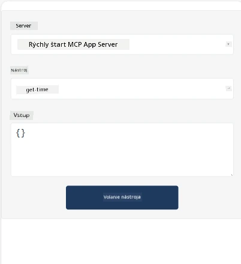
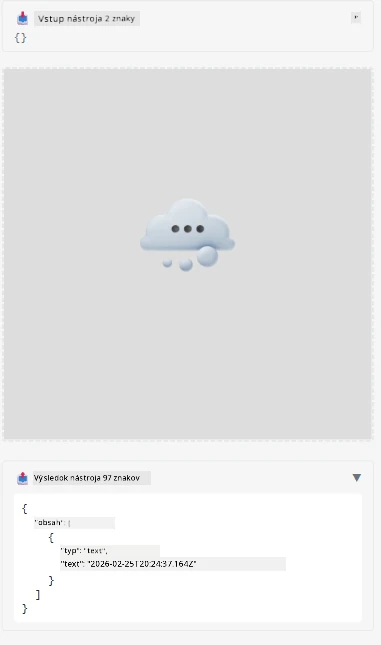

Here's a sample demonstrating MCP App

## Inštalácia

1. Prejdite do priečinka *mcp-app*  
1. Spustite `npm install`, čím sa nainštalujú závislosti pre frontend aj backend

Overte, či sa backend kompiluje spustením:

```sh
npx tsc --noEmit
```
  
Ak je všetko v poriadku, nemal by sa zobraziť žiadny výstup.

## Spustenie backendu

> Toto si vyžaduje trochu viac práce, ak používate Windows, pretože riešenie MCP Apps používa knižnicu `concurrently`, na ktorú potrebujete nájsť náhradu. Tu je problémový riadok v *package.json* MCP App:

```json
"start": "concurrently \"cross-env NODE_ENV=development INPUT=mcp-app.html vite build --watch\" \"tsx watch main.ts\""
```

Táto aplikácia má dve časti, backendovú a hostiteľskú.

Backend spustíte zavolaním:

```sh
npm start
```
  
Tým by sa mal spustiť backend na `http://localhost:3001/mcp`.

> Poznámka: Ak ste v Codespace, možno budete musieť nastaviť viditeľnosť portu na verejnú. Skontrolujte, či môžete v prehliadači dosiahnuť endpoint na https://<name of Codespace>.app.github.dev/mcp

## Voľba -1 Testovanie aplikácie vo Visual Studio Code

Na otestovanie riešenia vo Visual Studio Code postupujte takto:

- Pridajte zápis servera do `mcp.json` takto:

    ```json
    {
        "servers": {
            "my-mcp-server-7178eca7": {
                "url": "http://localhost:3001/mcp",
                "type": "http"
            }
        },
        "inputs": []
    }
    ```
  
1. Kliknite na tlačidlo „start“ v *mcp.json*  
1. Uistite sa, že je otvorené chatovacie okno a napíšte `get-faq`, mali by ste vidieť výsledok ako na obrázku:


## Voľba -2- Testovanie aplikácie s hosťom

Repozitár <https://github.com/modelcontextprotocol/ext-apps> obsahuje niekoľko rôznych hostiteľov, ktorých môžete použiť na testovanie svojich MVP aplikácií.

Predstavíme vám tu dve rôzne možnosti:

### Lokálny počítač

- Prejdite do priečinka *ext-apps* po naklonovaní repozitára.
- Nainštalujte závislosti

   ```sh
   npm install
   ```
  
- V inom terminálovom okne prejdite do *ext-apps/examples/basic-host*

> Ak ste v Codespace, musíte prejsť do súboru serve.ts, na riadok 27 a nahradiť http://localhost:3001/mcp URL adresou svojho Codespace backendu, napríklad https://psychic-xylophone-657rpjgvxpc5g64-3001.app.github.dev/mcp

- Spustite hostiteľa:

    ```sh
    npm start
    ```
  
Tým by sa mal hostiteľ spojiť s backendom a mali by ste vidieť aplikáciu bežiacu takto:



### Codespace

Nastavenie prostredia Codespace si vyžaduje trochu viac práce. Ak chcete použiť hostiteľa cez Codespace:  

- Pozrite si adresár *ext-apps* a prejdite do *examples/basic-host*.  
- Spustite `npm install` na nainštalovanie závislostí  
- Spustite `npm start` na spustenie hostiteľa.

## Otestujte aplikáciu

Vyskúšajte aplikáciu nasledovne:

- Vyberte tlačidlo „Call Tool“ a mali by ste vidieť výsledky takto:



Výborne, všetko funguje.

---

<!-- CO-OP TRANSLATOR DISCLAIMER START -->
**Zrieknutie sa zodpovednosti**:
Tento dokument bol preložený pomocou AI prekladateľskej služby [Co-op Translator](https://github.com/Azure/co-op-translator). Aj keď sa snažíme o presnosť, vezmite prosím na vedomie, že automatizované preklady môžu obsahovať chyby alebo nepresnosti. Pôvodný dokument v jeho rodnom jazyku by sa mal považovať za autoritatívny zdroj. Pre kritické informácie sa odporúča profesionálny ľudský preklad. Nezodpovedáme za žiadne nedorozumenia alebo nesprávne interpretácie vyplývajúce z používania tohto prekladu.
<!-- CO-OP TRANSLATOR DISCLAIMER END -->