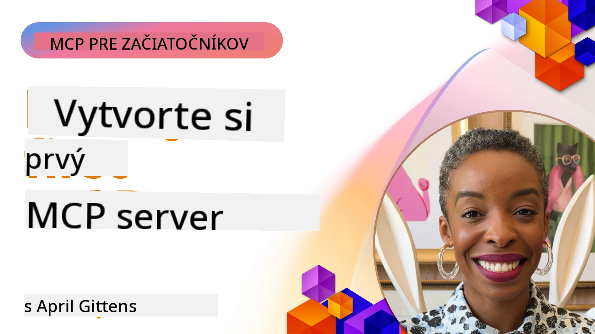

## Začíname  

_(Kliknite na obrázok vyššie pre zobrazenie videa tejto lekcie)_

Táto sekcia pozostáva z viacerých lekcií:

- **1 Váš prvý server**, v tejto prvej lekcii sa naučíte, ako vytvoriť svoj prvý server a preskúmať ho pomocou nástroja inspector, čo je cenný spôsob, ako testovať a ladit váš server, [na lekciu](01-first-server/README.md)

- **2 Klient**, v tejto lekcii sa naučíte, ako napísať klienta, ktorý sa dokáže pripojiť k vášmu serveru, [na lekciu](02-client/README.md)

- **3 Klient s LLM**, ešte lepší spôsob písania klienta je pridať k nemu LLM, aby mohol „rokovať“ s vaším serverom o tom, čo robiť, [na lekciu](03-llm-client/README.md)

- **4 Používanie režimu GitHub Copilot Agenta na serveri v Visual Studio Code**. Tu sa pozrieme na spúšťanie nášho MCP servera priamo vo Visual Studio Code, [na lekciu](04-vscode/README.md)

- **5 stdio Transport Server** stdio transport je odporúčaný štandard pre lokálnu komunikáciu MCP server-klient, zabezpečujúci bezpečnú komunikáciu cez podprocesy s vstavanou izoláciou procesov [na lekciu](05-stdio-server/README.md)

- **6 HTTP Streaming s MCP (Streamable HTTP)**. Naučte sa o modernom HTTP streaming transporte (odporúčaný prístup pre vzdialené MCP servery podľa [MCP Špecifikácie 2025-11-25](https://spec.modelcontextprotocol.io/specification/2025-11-25/basic/transports/#streamable-http)), o notifikáciách o priebehu a ako implementovať škálovateľné, v reálnom čase MCP servery a klientov pomocou Streamable HTTP. [na lekciu](06-http-streaming/README.md)

- **7 Využívanie AI Toolkit pre VSCode** na používanie a testovanie vašich MCP klientov a serverov [na lekciu](07-aitk/README.md)

- **8 Testovanie**. Tu sa budeme zameriavať najmä na to, ako môžeme testovať náš server a klienta rôznymi spôsobmi, [na lekciu](08-testing/README.md)

- **9 Nasadenie**. Táto kapitola sa pozrie na rôzne spôsoby nasadenia vašich MCP riešení, [na lekciu](09-deployment/README.md)

- **10 Pokročilé využitie servera**. Táto kapitola pokrýva pokročilé využitie servera, [na lekciu](./10-advanced/README.md)

- **11 Autentifikácia**. Táto kapitola sa zaoberá tým, ako pridať jednoduchú autentifikáciu, od Basic Auth až po použitie JWT a RBAC. Odporúčame začať tu a potom pozrieť Pokročilé témy v kapitole 5 a vykonať ďalšie zabezpečenie podľa odporúčaní v kapitole 2, [na lekciu](./11-simple-auth/README.md)

- **12 MCP hostitelia**. Konfigurácia a použitie populárnych MCP hostiteľských klientov vrátane Claude Desktop, Cursor, Cline a Windsurf. Naučte sa typy transportov a riešenie problémov, [na lekciu](./12-mcp-hosts/README.md)

- **13 MCP Inšpektor**. Interaktívne ladíte a testujete svoje MCP servery pomocou nástroja MCP Inspector. Naučte sa riešiť nástroje, zdroje a protokolové správy, [na lekciu](./13-mcp-inspector/README.md)

- **14 Sampling**. Vytvorte MCP servery, ktoré spolupracujú s MCP klientmi na úlohách súvisiacich s LLM. [na lekciu](./14-sampling/README.md)

- **15 MCP Aplikácie**. Vytvorte MCP servery, ktoré tiež odpovedajú s pokynmi pre UI, [na lekciu](./15-mcp-apps/README.md)

Model Context Protocol (MCP) je otvorený protokol, ktorý štandardizuje spôsob, akým aplikácie poskytujú kontext LLM (veľkým jazykovým modelom). MCP si môžete predstaviť ako USB-C port pre AI aplikácie – poskytuje štandardizovaný spôsob prepojenia AI modelov s rôznymi zdrojmi dát a nástrojmi.

## Ciele vzdelávania

Na konci tejto lekcie budete vedieť:

- Nastaviť vývojové prostredia pre MCP v C#, Java, Python, TypeScript a JavaScript
- Vytvoriť a nasadiť základné MCP servery s vlastnými funkciami (zdroje, promptovanie a nástroje)
- Vytvoriť hostiteľské aplikácie, ktoré sa pripájajú k MCP serverom
- Testovať a ladiť implementácie MCP
- Pochopiť bežné problémy pri nastavovaní a ich riešenia
- Pripojiť svoje implementácie MCP ku populárnym LLM službám

## Nastavenie vášho MCP prostredia

Predtým než začnete pracovať s MCP, je dôležité pripraviť si vývojové prostredie a pochopiť základný pracovný postup. Táto sekcia vás prevedie úvodnými krokmi, aby ste zabezpečili hladký štart s MCP.

### Predpoklady

Pred začatím vývoja MCP si skontrolujte, že máte:

- **Vývojové prostredie**: pre váš vybraný jazyk (C#, Java, Python, TypeScript alebo JavaScript)
- **IDE/Editory**: Visual Studio, Visual Studio Code, IntelliJ, Eclipse, PyCharm alebo akýkoľvek moderný kódový editor
- **Správcu balíkov**: NuGet, Maven/Gradle, pip alebo npm/yarn
- **API kľúče**: pre akékoľvek AI služby, ktoré plánujete používať vo svojich hostiteľských aplikáciách

### Oficiálne SDK

V nadchádzajúcich kapitolách uvidíte riešenia vytvorené v Pythone, TypeScripte, Java a .NET. Tu sú všetky oficiálne podporované SDK.

MCP poskytuje oficiálne SDK pre viacero jazykov (v súlade s [MCP Špecifikáciou 2025-11-25](https://spec.modelcontextprotocol.io/specification/2025-11-25/)):
- [C# SDK](https://github.com/modelcontextprotocol/csharp-sdk) - udržiavané v spolupráci so spoločnosťou Microsoft
- [Java SDK](https://github.com/modelcontextprotocol/java-sdk) - udržiavané v spolupráci so Spring AI
- [TypeScript SDK](https://github.com/modelcontextprotocol/typescript-sdk) - oficiálna implementácia pre TypeScript
- [Python SDK](https://github.com/modelcontextprotocol/python-sdk) - oficiálna Python implementácia (FastMCP)
- [Kotlin SDK](https://github.com/modelcontextprotocol/kotlin-sdk) - oficiálna implementácia pre Kotlin
- [Swift SDK](https://github.com/modelcontextprotocol/swift-sdk) - udržiavané v spolupráci so Loopwork AI
- [Rust SDK](https://github.com/modelcontextprotocol/rust-sdk) - oficiálna implementácia pre Rust
- [Go SDK](https://github.com/modelcontextprotocol/go-sdk) - oficiálna implementácia pre Go

## Kľúčové poznatky

- Nastavenie vývojového prostredia MCP je jednoduché s jazykovo špecifickými SDK
- Vývoj MCP serverov zahŕňa vytváranie a registráciu nástrojov s jasnými schémami
- MCP klienti sa pripájajú k serverom a modelom, aby využili rozšírené možnosti
- Testovanie a ladenie sú nevyhnutné pre spoľahlivé implementácie MCP
- Možnosti nasadenia sa pohybujú od lokálneho vývoja po riešenia v cloude

## Cvičenia

Máme sadu príkladov, ktoré dopĺňajú cvičenia, ktoré uvidíte vo všetkých kapitolách v tejto sekcii. Okrem toho má každá kapitola svoje vlastné cvičenia a úlohy.

- [Java kalkulačka](./samples/java/calculator/README.md)
- [.Net kalkulačka](../../../03-GettingStarted/samples/csharp)
- [JavaScript kalkulačka](./samples/javascript/README.md)
- [TypeScript kalkulačka](./samples/typescript/README.md)
- [Python kalkulačka](../../../03-GettingStarted/samples/python)

## Dodatočné zdroje

- [Vytváranie agentov pomocou Model Context Protocol na Azure](https://learn.microsoft.com/azure/developer/ai/intro-agents-mcp)
- [Vzdialené MCP s Azure Container Apps (Node.js/TypeScript/JavaScript)](https://learn.microsoft.com/samples/azure-samples/mcp-container-ts/mcp-container-ts/)
- [.NET OpenAI MCP Agent](https://learn.microsoft.com/samples/azure-samples/openai-mcp-agent-dotnet/openai-mcp-agent-dotnet/)

## Čo ďalej

Začnite s prvou lekciou: [Vytvorenie vášho prvého MCP servera](01-first-server/README.md)

Po dokončení tohto modulu pokračujte: [Modul 4: Praktická implementácia](../04-PracticalImplementation/README.md)

---

<!-- CO-OP TRANSLATOR DISCLAIMER START -->
**Upozornenie**:  
Tento dokument bol preložený pomocou AI prekladateľskej služby [Co-op Translator](https://github.com/Azure/co-op-translator). Hoci sa snažíme o presnosť, majte prosím na pamäti, že automatické preklady môžu obsahovať chyby alebo nepresnosti. Originálny dokument v jeho rodnom jazyku by mal byť považovaný za autoritatívny zdroj. Pre kritické informácie sa odporúča profesionálny ľudský preklad. Nie sme zodpovední za akékoľvek nedorozumenia alebo nesprávne interpretácie vyplývajúce z použitia tohto prekladu.
<!-- CO-OP TRANSLATOR DISCLAIMER END -->