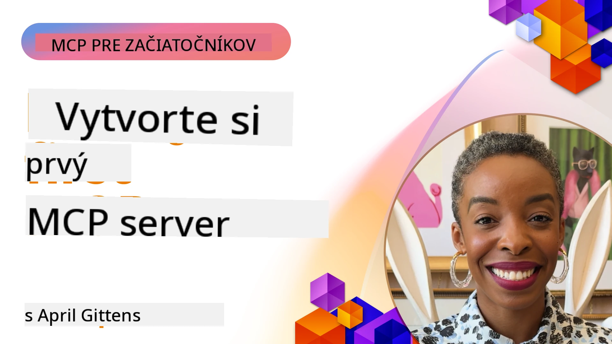

## Začíname  

_(Kliknite na obrázok vyššie pre zobrazenie videa k tejto lekcii)_

Táto sekcia pozostáva z niekoľkých lekcií:

- **1 Váš prvý server**, v tejto prvej lekcii sa naučíte, ako vytvoriť svoj prvý server a skontrolovať ho pomocou nástroja inspector, čo je cenný spôsob, ako testovať a debugovať váš server, [do lekcie](01-first-server/README.md)

- **2 Klient**, v tejto lekcii sa naučíte, ako napísať klienta, ktorý sa dokáže pripojiť k vášmu serveru, [do lekcie](02-client/README.md)

- **3 Klient s LLM**, ešte lepší spôsob písania klienta je pridaním LLM, aby mohol „vyjednávať“ s vaším serverom, čo má robiť, [do lekcie](03-llm-client/README.md)

- **4 Využitie režimu GitHub Copilot Agent pre MCP server vo Visual Studio Code**. Tu sa pozrieme na spustenie nášho MCP Servera priamo vo Visual Studio Code, [do lekcie](04-vscode/README.md)

- **5 stdio Transport Server** stdio transport je odporúčaný štandard pre lokálnu komunikáciu MCP server–klient, poskytujúc bezpečnú komunikáciu založenú na subprocessoch s zabudovanou izoláciou procesu [do lekcie](05-stdio-server/README.md)

- **6 HTTP Streaming s MCP (Streamovateľný HTTP)**. Naučte sa o štandardnom
	vzdialenom transporte v [Špecifikácii MCP 2026-07-28](https://modelcontextprotocol.io/specification/2026-07-28/basic/transports/streamable-http),
	plus o zachovanej legacy implementácii na základe session.
	[do lekcie](06-http-streaming/README.md)

- **7 Využívanie AI Toolkit pre VSCode** na používanie a testovanie vašich MCP klientov a serverov [do lekcie](07-aitk/README.md)

- **8 Testovanie**. Tu sa sústredíme najmä na to, ako môžeme náš server a klienta testovať rôznymi spôsobmi, [do lekcie](08-testing/README.md)

- **9 Nasadenie**. Táto kapitola sa pozrie na rôzne spôsoby nasadenia vašich MCP riešení, [do lekcie](09-deployment/README.md)

- **10 Pokročilé používanie servera**. Táto kapitola pokrýva pokročilé používanie servera, [do lekcie](./10-advanced/README.md)

- **11 Autentifikácia**. Táto kapitola pokrýva, ako pridať jednoduchú autentifikáciu, od Basic Autentifikácie po používanie JWT a RBAC. Odporúčame začať tu a potom sa pozrieť na pokročilé témy v kapitole 5 a vykonať ďalšie zabezpečovacie opatrenia podľa odporúčaní v kapitole 2, [do lekcie](./11-simple-auth/README.md)

- **12 MCP Hostitelia**. Konfigurujte a používajte populárnych klientov MCP hostiteľov vrátane Claude Desktop, Cursor, Cline a Windsurf. Naučte sa typy transportov a riešenie problémov, [do lekcie](./12-mcp-hosts/README.md)

- **13 MCP Inspector**. Debugujte a testujte svoje MCP servery interaktívne pomocou nástroja MCP Inspector. Naučte sa riešiť nástroje, zdroje a protokolové správy, [do lekcie](./13-mcp-inspector/README.md)

- **14 Sampling**. Naučte sa legacy Sampling primitív pre `2025-11-25` a
	ako migrovať nové návrhy na priame začlenenie poskytovateľa LLM. Sampling je
	odporúčaný na vyradenie v MCP `2026-07-28`. [do lekcie](./14-sampling/README.md)

- **15 MCP Aplikácie**. Vytvorte MCP Servery, ktoré tiež odpovedajú inštrukciami pre UI, [do lekcie](./15-mcp-apps/README.md)

Model Context Protocol (MCP) je otvorený protokol, ktorý štandardizuje spôsob, akým aplikácie poskytujú kontext pre LLM. Myslite na MCP ako na USB-C port pre AI aplikácie - poskytuje štandardizovaný spôsob pripojenia AI modelov k rôznym zdrojom dát a nástrojom.

## Ciele učenia sa

Na konci tejto lekcie budete schopní:

- Nastaviť vývojové prostredia pre MCP v C#, Java, Python, TypeScript a JavaScript
- Vytvárať a nasadzovať základné MCP servery s vlastnými funkciami (zdroje, podnety a nástroje)
- Vytvárať hostiteľské aplikácie, ktoré sa pripájajú k MCP serverom
- Testovať a ladit implementácie MCP
- Pochopiť bežné výzvy pri nastavení a ich riešenia
- Pripojiť svoje MCP implementácie k populárnym LLM službám

## Nastavenie vášho MCP prostredia

Pred začatím práce s MCP je dôležité pripraviť si vývojové prostredie a pochopiť základný pracovný postup. Táto sekcia vás prevedie počiatočnými krokmi nastavenia, aby ste mali hladký štart s MCP.

### Predpoklady

Pred ponorením sa do vývoja MCP sa uistite, že máte:

- **Vývojové prostredie**: Pre vybraný jazyk (C#, Java, Python, TypeScript alebo JavaScript)
- **IDE/Editor**: Visual Studio, Visual Studio Code, IntelliJ, Eclipse, PyCharm alebo akýkoľvek moderný kódovací editor
- **Manažéri balíkov**: NuGet, Maven/Gradle, pip alebo npm/yarn
- **API kľúče**: Pre akékoľvek AI služby, ktoré plánujete používať vo svojich hostiteľských aplikáciách

### Oficiálne SDK

V nadchádzajúcich kapitolách uvidíte riešenia postavené pomocou Python, TypeScript,
Java a .NET. Tu sú oficiálne SDK.

Podpora SDK pre MCP `2026-07-28` sa postupne zavádza nezávisle podľa jazyka.
Pred spustením príkladu skontrolujte verziu balíka a poznámky k vydaniu SDK
pre podporované revízie protokolu. Pozrite si
[oficiálny zoznam SDK](https://modelcontextprotocol.io/docs/sdk):
- [C# SDK](https://github.com/modelcontextprotocol/csharp-sdk) - Udržiavané v spolupráci s Microsoftom
- [Java SDK](https://github.com/modelcontextprotocol/java-sdk) - Udržiavané v spolupráci so Spring AI
- [TypeScript SDK](https://github.com/modelcontextprotocol/typescript-sdk) - Oficiálna implementácia TypeScript
- [Python SDK](https://github.com/modelcontextprotocol/python-sdk) - Oficiálna implementácia Python (FastMCP)
- [Kotlin SDK](https://github.com/modelcontextprotocol/kotlin-sdk) - Oficiálna implementácia Kotlin
- [Swift SDK](https://github.com/modelcontextprotocol/swift-sdk) - Udržiavané v spolupráci s Loopwork AI
- [Rust SDK](https://github.com/modelcontextprotocol/rust-sdk) - Oficiálna implementácia Rust
- [Go SDK](https://github.com/modelcontextprotocol/go-sdk) - Oficiálna implementácia Go

## Kľúčové poznatky

- Nastavenie vývojového prostredia MCP je jednoduché s jazykovo špecifickými SDK
- Vytváranie MCP serverov zahŕňa tvorbu a registráciu nástrojov s jasnými schémami
- MCP klienti sa pripájajú k serverom a modelom, aby využili rozšírené funkcie
- Testovanie a ladenie sú nevyhnutné pre spoľahlivé MCP implementácie
- Možnosti nasadenia siahajú od lokálneho vývoja až po cloudové riešenia

## Praktické cvičenia

Máme súbor príkladov, ktoré dopĺňajú cvičenia, ktoré uvidíte vo všetkých kapitolách tejto sekcie. Navyše každá kapitola má aj vlastné cvičenia a úlohy

- [Java Kalkulačka](./samples/java/calculator/README.md)
- [.NET Kalkulačka](../../../03-GettingStarted/samples/csharp)
- [JavaScript Kalkulačka](./samples/javascript/README.md)
- [TypeScript Kalkulačka](./samples/typescript/README.md)
- [Python Kalkulačka](../../../03-GettingStarted/samples/python)

## Ďalšie zdroje

- [Vytvárajte agentov pomocou Model Context Protocol na Azure](https://learn.microsoft.com/azure/developer/ai/intro-agents-mcp)
- [Vzdialené MCP s Azure Container Apps (Node.js/TypeScript/JavaScript)](https://learn.microsoft.com/samples/azure-samples/mcp-container-ts/mcp-container-ts/)
- [.NET OpenAI MCP agent](https://learn.microsoft.com/samples/azure-samples/openai-mcp-agent-dotnet/openai-mcp-agent-dotnet/)

## Čo ďalej

Začnite prvou lekciou: [Vytvorenie vášho prvého MCP servera](01-first-server/README.md)

Po dokončení tohto modulu pokračujte na: [Modul 4: Praktická implementácia](../04-PracticalImplementation/README.md)

---

<!-- CO-OP TRANSLATOR DISCLAIMER START -->
**Vyhlásenie o zodpovednosti**:
Tento dokument bol preložený pomocou AI prekladateľskej služby [Co-op Translator](https://github.com/Azure/co-op-translator). Hoci sa snažíme o presnosť, vezmite prosím na vedomie, že automatické preklady môžu obsahovať chyby alebo nepresnosti. Pôvodný dokument v jeho natívnom jazyku by mal byť považovaný za autoritatívny zdroj. Pre kritické informácie sa odporúča profesionálny ľudský preklad. Nie sme zodpovední za žiadne nedorozumenia alebo nesprávne interpretácie vyplývajúce z použitia tohto prekladu.
<!-- CO-OP TRANSLATOR DISCLAIMER END -->