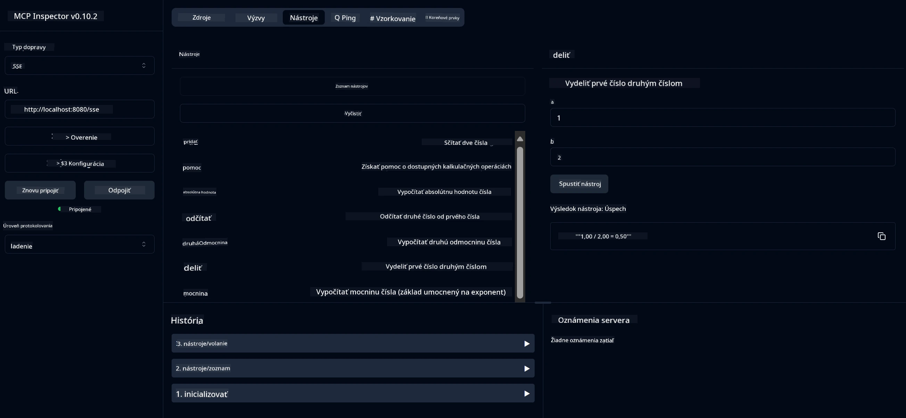

# Základná kalkulačka MCP služba

> [!NOTE]
> Tento príklad používa starší HTTP+SSE transport a cieli na SDK kompatibilné
> s MCP `2025-11-25`. Nové vzdialené servery by mali používať `2026-07-28` Streamable
> HTTP podporu.

Táto služba poskytuje základné kalkulačné operácie prostredníctvom Model Context Protocol (MCP) používaného v Spring Boot s WebFlux transportom. Je navrhnutá ako jednoduchý príklad pre začiatočníkov učících sa o implementáciách MCP.

Pre viac informácií, pozrite si referenčnú dokumentáciu [MCP Server Boot Starter](https://docs.spring.io/spring-ai/reference/api/mcp/mcp-server-boot-starter-docs.html).

## Prehľad

Služba ukazuje:
- Podpora SSE (Server-Sent Events)
- Automatická registrácia nástrojov pomocou anotácie `@Tool` v Spring AI
- Základné kalkulačné funkcie:
  - Sčítanie, odčítanie, násobenie, delenie
  - Výpočet mocniny a druhá odmocnina
  - Modulo (zvyšok) a absolútna hodnota
  - Funkcia pomocníka pre opis operácií

## Funkcie

Táto kalkulačková služba ponúka nasledujúce schopnosti:

1. **Základné aritmetické operácie**:
   - Sčítanie dvoch čísel
   - Odčítanie jedného čísla od druhého
   - Násobenie dvoch čísel
   - Delenie jedného čísla druhým (s kontrolou delenia nulou)

2. **Pokročilé operácie**:
   - Výpočet mocniny (základ na exponent)
   - Výpočet druhej odmocniny (s kontrolou záporného čísla)
   - Výpočet modula (zvyšok po delení)
   - Výpočet absolútnej hodnoty

3. **Pomocný systém**:
   - Zabudovaná pomocná funkcia vysvetľujúca všetky dostupné operácie

## Použitie služby

Služba vystavuje nasledujúce API endpointy prostredníctvom MCP protokolu:

- `add(a, b)`: Spočítať dve čísla dokopy
- `subtract(a, b)`: Odčítať druhé číslo od prvého
- `multiply(a, b)`: Násobiť dve čísla
- `divide(a, b)`: Deliť prvé číslo druhým (s kontrolou nuly)
- `power(base, exponent)`: Vypočítať mocninu čísla
- `squareRoot(number)`: Vypočítať druhú odmocninu (s kontrolou záporného čísla)
- `modulus(a, b)`: Vypočítať zvyšok po delení
- `absolute(number)`: Vypočítať absolútnu hodnotu
- `help()`: Získať informácie o dostupných operáciách

## Testovací klient

Jednoduchý testovací klient je zahrnutý v balíku `com.microsoft.mcp.sample.client`. Trieda `SampleCalculatorClient` demonštruje dostupné operácie kalkulačkových služieb.

## Použitie LangChain4j klienta

Projekt obsahuje príklad LangChain4j klienta v `com.microsoft.mcp.sample.client.LangChain4jClient`, ktorý ukazuje, ako integrovať kalkulačkové služby s LangChain4j a GitHub modelmi:

### Predpoklady

1. **Nastavenie GitHub tokenu**:
   
   Ak chcete používať AI modely GitHub (napríklad phi-4), potrebujete osobný prístupový token GitHub:

   a. Prejdite do nastavení vášho GitHub účtu: https://github.com/settings/tokens
   
   b. Kliknite na „Generate new token“ → „Generate new token (classic)“
   
   c. Pomenujte svoj token opisným názvom
   
   d. Vyberte nasledujúce rozsahy oprávnení:
      - `repo` (Plná kontrola nad súkromnými repozitármi)
      - `read:org` (Čítať členstvo v organizácii a tímoch, čítať projekty organizácie)
      - `gist` (Vytvárať gisty)
      - `user:email` (Prístup k emailovým adresám používateľa (iba na čítanie))
   
   e. Kliknite na „Generate token“ a skopírujte nový token
   
   f. Nastavte ho ako premennú prostredia:
      
      Vo Windows:
      ```
      set GITHUB_TOKEN=your-github-token
      ```
      
      Na macOS/Linux:
      ```bash
      export GITHUB_TOKEN=your-github-token
      ```

   g. Pre trvalé nastavenie ho pridajte do systémových premenných prostredia

2. Pridajte závislosť LangChain4j GitHub do projektu (už zahrnuté v pom.xml):
   ```xml
   <dependency>
       <groupId>dev.langchain4j</groupId>
       <artifactId>langchain4j-github</artifactId>
       <version>${langchain4j.version}</version>
   </dependency>
   ```

3. Uistite sa, že kalkulačkový server beží na `localhost:8080`

### Spustenie LangChain4j klienta

Tento príklad demonštruje:
- Pripojenie ku kalkulačkovému MCP serveru cez SSE transport
- Použitie LangChain4j na vytvorenie chat bota, ktorý využíva kalkulačné operácie
- Integráciu s GitHub AI modelmi (aktuálne používa model phi-4)

Klient odosiela nasledujúce vzorové požiadavky na demonstráciu funkčnosti:
1. Výpočet súčtu dvoch čísel
2. Nájdenie druhej odmocniny čísla
3. Získanie pomoci o dostupných kalkulačných operáciách

Spustite príklad a sledujte výstup v konzole, aby ste videli, ako AI model používa kalkulačné nástroje na odpovede na otázky.

### Konfigurácia GitHub modelu

LangChain4j klient je nakonfigurovaný na použitie GitHub modelu phi-4 so nasledujúcimi nastaveniami:

```java
ChatLanguageModel model = GitHubChatModel.builder()
    .apiKey(System.getenv("GITHUB_TOKEN"))
    .timeout(Duration.ofSeconds(60))
    .modelName("phi-4")
    .logRequests(true)
    .logResponses(true)
    .build();
```

Pre použitie iných GitHub modelov jednoducho zmeňte parameter `modelName` na iný podporovaný model (napr. "claude-3-haiku-20240307", "llama-3-70b-8192", atď.).

## Závislosti

Projekt vyžaduje nasledujúce kľúčové závislosti:

```xml
<!-- For MCP Server -->
<dependency>
    <groupId>org.springframework.ai</groupId>
    <artifactId>spring-ai-starter-mcp-server-webflux</artifactId>
</dependency>

<!-- For LangChain4j integration -->
<dependency>
    <groupId>dev.langchain4j</groupId>
    <artifactId>langchain4j-mcp</artifactId>
    <version>${langchain4j.version}</version>
</dependency>

<!-- For GitHub models support -->
<dependency>
    <groupId>dev.langchain4j</groupId>
    <artifactId>langchain4j-github</artifactId>
    <version>${langchain4j.version}</version>
</dependency>
```

## Zostavenie projektu

Projekt zostavíte pomocou Maven:
```bash
./mvnw clean install -DskipTests
```

## Spustenie servera

### Použitie Java

```bash
java -jar target/calculator-server-0.0.1-SNAPSHOT.jar
```

### Použitie MCP Inspector

MCP Inspector je užitočný nástroj na interakciu so službami MCP. Ak ho chcete použiť s touto kalkulačkovou službou:

1. **Nainštalujte a spustite MCP Inspector** v novom terminálovom okne:
   ```bash
   npx @modelcontextprotocol/inspector
   ```

2. **Prístup k webovému rozhraniu** kliknutím na URL zobrazenú aplikáciou (zvyčajne http://localhost:6274)

3. **Nastavte pripojenie**:
   - Nastavte typ transportu na „SSE“
   - Nastavte URL na SSE endpoint bežiaceho servera: `http://localhost:8080/sse`
   - Kliknite na „Connect“

4. **Použite nástroje**:
   - Kliknite „List Tools“ pre zoznam dostupných kalkulačných operácií
   - Vyberte nástroj a kliknite „Run Tool“ na vykonanie operácie



### Použitie Docker

Projekt obsahuje Dockerfile pre kontajnerové nasadenie:

1. **Zostavte Docker obraz**:
   ```bash
   docker build -t calculator-mcp-service .
   ```

2. **Spustite Docker kontajner**:
   ```bash
   docker run -p 8080:8080 calculator-mcp-service
   ```

Toto vykoná:
- Zostavenie viacstupňového Docker obrazu s Maven 3.9.9 a Eclipse Temurin 24 JDK
- Vytvorenie optimalizovaného obrazu kontajnera
- Zverejnenie služby na porte 8080
- Spustenie MCP kalkulačkovej služby v kontajneri

K službe budete mať prístup na `http://localhost:8080`, keď bude kontajner bežať.

## Riešenie problémov

### Bežné problémy s GitHub tokenom

1. **Problémy s oprávneniami tokenu**: Ak dostanete chybu 403 Forbidden, skontrolujte, či má váš token správne oprávnenia podľa požiadaviek.

2. **Token nebol nájdený**: Ak dostanete chybu "No API key found", uistite sa, že premenná prostredia GITHUB_TOKEN je správne nastavená.

3. **Obmedzenie počtu požiadaviek (Rate limiting)**: GitHub API má limity počtu požiadaviek. Ak narazíte na chybu limitu (kód 429), počkajte niekoľko minút a skúste znova.

4. **Vypršanie platnosti tokenu**: GitHub tokeny môžu vypršať. Ak dostávate autentifikačné chyby po nejakom čase, vygenerujte nový token a aktualizujte premennú prostredia.

Ak potrebujete ďalšiu pomoc, pozrite si [dokumentáciu LangChain4j](https://github.com/langchain4j/langchain4j) alebo [dokumentáciu GitHub API](https://docs.github.com/en/rest).

---

<!-- CO-OP TRANSLATOR DISCLAIMER START -->
**Vyhlásenie o zodpovednosti**:
Tento dokument bol preložený pomocou AI prekladateľskej služby [Co-op Translator](https://github.com/Azure/co-op-translator). Hoci sa snažíme o presnosť, vezmite prosím na vedomie, že automatické preklady môžu obsahovať chyby alebo nepresnosti. Pôvodný dokument v jeho natívnom jazyku by mal byť považovaný za autoritatívny zdroj. Pre kritické informácie sa odporúča profesionálny ľudský preklad. Nie sme zodpovední za žiadne nedorozumenia alebo nesprávne interpretácie vyplývajúce z použitia tohto prekladu.
<!-- CO-OP TRANSLATOR DISCLAIMER END -->