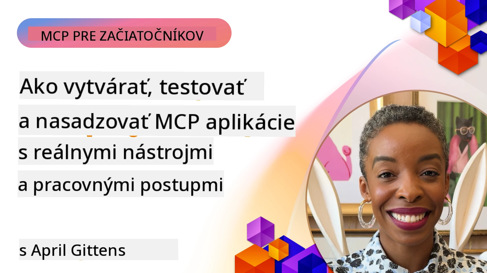

# Praktická implementácia

[](https://youtu.be/vCN9-mKBDfQ)

_(Kliknite na obrázok vyššie pre zobrazenie videa tejto lekcie)_

Praktická implementácia je miestom, kde sa moc Model Context Protocol (MCP) stáva hmatateľnou. Zatiaľ čo pochopenie teórie a architektúry MCP je dôležité, skutočná hodnota sa prejaví, keď tieto koncepty aplikujete na tvorbu, testovanie a nasadenie riešení, ktoré riešia reálne problémy. Táto kapitola premostí priepasť medzi konceptuálnymi znalosťami a praktickým vývojom, pričom vás prevedie procesom oživenia aplikácií založených na MCP.

Či už vyvíjate inteligentných asistentov, integrujete AI do podnikových pracovných tokov alebo tvoria vlastné nástroje na spracovanie dát, MCP poskytuje flexibilný základ. Jeho jazykovo neutrálne navrhnutie a oficiálne SDK pre populárne programovacie jazyky ho sprístupňujú širokému spektru vývojárov. Využitím týchto SDK môžete rýchlo prototypovať, iterovať a škálovať svoje riešenia na rôznych platformách a prostrediach.

V nasledujúcich sekciách nájdete praktické príklady, ukážkový kód a stratégie nasadenia, ktoré demonštrujú, ako implementovať MCP v C#, Jave so Springom, TypeScripte, JavaScripte a Pythone. Naučíte sa tiež, ako debugovať a testovať svoje MCP servery, spravovať API a nasadzovať riešenia do cloudu pomocou Azure. Tieto praktické zdroje sú navrhnuté tak, aby urýchlili vaše učenie a pomohli vám sebaisto vytvárať robustné, produkčne pripravené MCP aplikácie.

## Prehľad

Táto lekcia sa zameriava na praktické aspekty implementácie MCP v rôznych programovacích jazykoch. Preskúmame, ako používať MCP SDK v C#, Jave so Springom, TypeScripte, JavaScripte a Pythone na tvorbu robustných aplikácií, debugovanie a testovanie MCP serverov a vytváranie znovu použiteľných zdrojov, promptov a nástrojov.

## Ciele učenia

Na konci tejto lekcie budete schopní:

- Implementovať MCP riešenia pomocou oficiálnych SDK v rôznych programovacích jazykoch
- Systematicky debugovať a testovať MCP servery
- Vytvárať a používať funkcie servera (Zdroje, Prompty a Nástroje)
- Navrhovať efektívne MCP pracovné toky pre komplexné úlohy
- Optimalizovať implementácie MCP pre výkon a spoľahlivosť

## Oficiálne SDK zdroje

Model Context Protocol ponúka oficiálne SDK pre viaceré jazyky (v súlade s [špecifikáciou MCP 2025-11-25](https://spec.modelcontextprotocol.io/specification/2025-11-25/)):

- [C# SDK](https://github.com/modelcontextprotocol/csharp-sdk)
- [Java so Spring SDK](https://github.com/modelcontextprotocol/java-sdk) **Poznámka:** vyžaduje závislosť na [Project Reactor](https://projectreactor.io). (Pozri [diskusný issue 246](https://github.com/orgs/modelcontextprotocol/discussions/246).)
- [TypeScript SDK](https://github.com/modelcontextprotocol/typescript-sdk)
- [Python SDK](https://github.com/modelcontextprotocol/python-sdk)
- [Kotlin SDK](https://github.com/modelcontextprotocol/kotlin-sdk)
- [Go SDK](https://github.com/modelcontextprotocol/go-sdk)

## Práca s MCP SDK

Táto sekcia poskytuje praktické príklady implementácie MCP v rôznych programovacích jazykoch. Ukážkový kód nájdete v adresári `samples` organizovaný podľa jazyka.

### Dostupné ukážky

Repozitár obsahuje [ukážkové implementácie](../../../04-PracticalImplementation/samples) v týchto jazykoch:

- [C#](./samples/csharp/README.md)
- [Java so Spring](./samples/java/containerapp/README.md)
- [TypeScript](./samples/typescript/README.md)
- [JavaScript](./samples/javascript/README.md)
- [Python](./samples/python/README.md)

Každá ukážka demonštruje kľúčové koncepty MCP a vzory implementácie pre daný jazyk a ekosystém.

### Praktické návody

Ďalšie návody na praktickú implementáciu MCP:

- [Stránkovanie a veľké súbory výsledkov](./pagination/README.md) – Správa stránkovania založeného na kurzoroch pre nástroje, zdroje a veľké dátové súbory

## Kľúčové funkcie servera

MCP servery môžu implementovať ľubovoľnú kombináciu týchto funkcií:

### Zdroje

Zdroje poskytujú kontext a dáta pre používateľa alebo AI model:

- Repozitáre dokumentov
- Znalostné bázy
- Štruktúrované dátové zdroje
- Súborové systémy

### Prompty

Prompty sú šablónované správy a pracovné toky pre používateľov:

- Preddefinované šablóny konverzácií
- Usmernené interakčné vzory
- Špecializované dialógové štruktúry

### Nástroje

Nástroje sú funkcie, ktoré môže AI model vykonávať:

- Pomocné nástroje na spracovanie dát
- Integrácie s externými API
- Výpočtové schopnosti
- Funkcionalita vyhľadávania

## Ukážkové implementácie: Implementácia v C#

Oficiálny repozitár C# SDK obsahuje niekoľko ukážkových implementácií demonštrujúcich rôzne aspekty MCP:

- **Základný MCP klient**: Jednoduchý príklad ukazujúci, ako vytvoriť MCP klienta a volať nástroje
- **Základný MCP server**: Minimálna implementácia servera so základnou registráciou nástrojov
- **Pokročilý MCP server**: Plne vybavený server s registráciou nástrojov, autentifikáciou a obsluhou chýb
- **Integrácia ASP.NET**: Príklady ukazujúce integráciu s ASP.NET Core
- **Vzorové implementácie nástrojov**: Rôzne vzory implementácie nástrojov s rôznou úrovňou zložitosti

MCP C# SDK je v preview a API sa môžu meniť. Tento blog budeme priebežne aktualizovať podľa vývoja SDK.

### Kľúčové funkcie

- [C# MCP Nuget ModelContextProtocol](https://www.nuget.org/packages/ModelContextProtocol)
- Vytvorenie vášho [prvého MCP servera](https://devblogs.microsoft.com/dotnet/build-a-model-context-protocol-mcp-server-in-csharp/).

Pre kompletné C# implementačné ukážky navštívte [oficiálny repozitár C# SDK ukážok](https://github.com/modelcontextprotocol/csharp-sdk)

## Ukážková implementácia: Implementácia v Java so Springom

Java so Spring SDK ponúka robustné možnosti implementácie MCP s firemnými funkciami.

### Kľúčové vlastnosti

- Integrácia so Spring Frameworkom
- Silná typová bezpečnosť
- Podpora reaktívneho programovania
- Komplexná obsluha chýb

Pre kompletný príklad implementácie Java so Spring viď [Java so Spring ukážka](samples/java/containerapp/README.md) v adresári s ukážkami.

## Ukážková implementácia: Implementácia v JavaScripte

JavaScript SDK poskytuje ľahký a flexibilný prístup k implementácii MCP.

### Kľúčové vlastnosti

- Podpora Node.js a prehliadača
- API založené na Promise
- Jednoduchá integrácia s Express a ďalšími frameworkami
- Podpora WebSocket pre streamovanie

Pre kompletný príklad implementácie v JavaScripte viď [JavaScript ukážka](samples/javascript/README.md) v adresári s ukážkami.

## Ukážková implementácia: Implementácia v Pythone

Python SDK ponúka pythonický prístup k implementácii MCP s výbornou integráciou ML frameworkov.

### Kľúčové vlastnosti

- Podpora async/await s asyncio
- Integrácia s FastAPI``
- Jednoduchá registrácia nástrojov
- Nativna integrácia s populárnymi ML knižnicami

Pre kompletný príklad implementácie v Pythone viď [Python ukážka](samples/python/README.md) v adresári s ukážkami.

## Správa API

Azure API Management je skvelé riešenie na zabezpečenie MCP serverov. Myšlienka je umiestniť inštanciu Azure API Management pred váš MCP server a nechať ju spravovať funkcie, ktoré pravdepodobne budete chcieť, ako napríklad:

- obmedzovanie rýchlosti
- správa tokenov
- monitorovanie
- vyrovnávanie zaťaženia
- bezpečnosť

### Azure ukážka

Tu je Azure ukážka, ktorá robí presne to, t.j. [vytvára MCP server a zabezpečuje ho pomocou Azure API Management](https://github.com/Azure-Samples/remote-mcp-apim-functions-python).

Pozrite sa, ako prebieha autentifikačný tok na nasledujúcom obrázku:


Na predchádzajúcom obrázku sa deje toto:

- Autentifikácia/autorizácia prebieha cez Microsoft Entra.
- Azure API Management pôsobí ako brána a používa politiky na smerovanie a správu prevádzky.
- Azure Monitor zaznamenáva všetky požiadavky pre ďalšiu analýzu.

#### Tok autorizácie

Pozrime sa na tok autorizácie podrobnejšie:


#### Špecifikácia autorizácie MCP

Viac informácií o [špecifikácii autorizácie MCP](https://spec.modelcontextprotocol.io/specification/2025-11-25/basic/authorization/)

## Nasadenie vzdialeného MCP servera do Azure

Pozrime sa, či dokážeme nasadiť ukážku, ktorú sme spomínali vyššie:

1. Klonujte repozitár

    ```bash
    git clone https://github.com/Azure-Samples/remote-mcp-apim-functions-python.git
    cd remote-mcp-apim-functions-python
    ```

1. Zaregistrujte poskytovateľa zdrojov `Microsoft.App`.

   - Ak používate Azure CLI, spustite `az provider register --namespace Microsoft.App --wait`.
   - Ak používate Azure PowerShell, spustite `Register-AzResourceProvider -ProviderNamespace Microsoft.App`. Potom po chvíli skontrolujte `(Get-AzResourceProvider -ProviderNamespace Microsoft.App).RegistrationState`, či je registrácia dokončená.

1. Spustite tento príkaz [azd](https://aka.ms/azd) na vytvorenie služby API Management, funkčnej aplikácie (s kódom) a všetkých ďalších potrebných Azure zdrojov

    ```shell
    azd up
    ```

    Tento príkaz by mal nasadiť všetky cloudové zdroje na Azure

### Testovanie vášho servera pomocou MCP Inspector

1. V **novom terminálovom okne** nainštalujte a spustite MCP Inspector

    ```shell
    npx @modelcontextprotocol/inspector
    ```

    Mali by ste vidieť rozhranie podobné:

    

1. Stlačte CTRL a kliknite na URL zobrazenú aplikáciou pre načítanie webovej aplikácie MCP Inspector (napr. [http://127.0.0.1:6274/#resources](http://127.0.0.1:6274/#resources))
1. Nastavte typ transportu na `SSE`
1. Nastavte URL na váš bežiaci API Management SSE endpoint zobrazený po `azd up` a **Pripojte sa**:

    ```shell
    https://<apim-servicename-from-azd-output>.azure-api.net/mcp/sse
    ```

1. **Zoznam nástrojov**. Kliknite na nástroj a **Spustite nástroj**.

Ak všetky kroky prebehli úspešne, mali by ste byť teraz pripojení k MCP serveru a úspešne volať nástroj.

## MCP servery pre Azure

[Remote-mcp-functions](https://github.com/Azure-Samples/remote-mcp-functions-dotnet): Táto sada repozitárov je šablóna na rýchly štart pre tvorbu a nasadenie vlastných vzdialených MCP (Model Context Protocol) serverov pomocou Azure Functions v Pythone, C# .NET alebo Node/TypeScript.

Ukážky poskytujú kompletné riešenie, ktoré vývojárom umožňuje:

- Vyvíjať a spúšťať lokálne: Vyvíjať a debugovať MCP server na lokálnom počítači
- Nasadiť do Azure: Ľahko nasadiť do cloudu jednoduchým príkazom azd up
- Pripojiť sa z klientov: Pripojiť sa k MCP serveru z rôznych klientov vrátane VS Code v režime Copilot agent a nástroja MCP Inspector

### Kľúčové vlastnosti

- Bezpečnosť navrhnutá v základe: MCP server je zabezpečený pomocou kľúčov a HTTPS
- Možnosti autentifikácie: Podpora OAuth pomocou vstavaného auth a/alebo API Management
- Sieťová izolácia: Umožňuje sieťovú izoláciu pomocou Azure Virtual Networks (VNET)
- Serverless architektúra: Využíva Azure Functions pre škálovateľné, event-driven spúšťanie
- Lokálny vývoj: Komplexná podpora lokálneho vývoja a debugovania
- Jednoduché nasadenie: Zjednodušený proces nasadenia do Azure

Repozitár obsahuje všetky potrebné konfiguračné súbory, zdrojový kód a definície infraštruktúry pre rýchly štart produkčne pripravených implementácií MCP servera.

- [Azure Remote MCP Functions Python](https://github.com/Azure-Samples/remote-mcp-functions-python) – Ukážková implementácia MCP s Azure Functions v Pythone

- [Azure Remote MCP Functions .NET](https://github.com/Azure-Samples/remote-mcp-functions-dotnet) – Ukážková implementácia MCP s Azure Functions v C# .NET

- [Azure Remote MCP Functions Node/Typescript](https://github.com/Azure-Samples/remote-mcp-functions-typescript) – Ukážková implementácia MCP s Azure Functions v Node/TypeScript.

## Kľúčové poznatky

- MCP SDK poskytujú jazykovo špecifické nástroje pre implementáciu robustných MCP riešení
- Proces debugovania a testovania je kľúčový pre spoľahlivé MCP aplikácie
- Znovu použiteľné šablóny promptov umožňujú konzistentné interakcie AI
- Dobré navrhnuté pracovné toky dokážu orchesterovať komplexné úlohy s použitím viacerých nástrojov
- Implementácia MCP riešení si vyžaduje zváženie bezpečnosti, výkonu a obsluhy chýb

## Cvičenie

Navrhnite praktický MCP pracovný tok, ktorý rieši reálny problém vo vašej oblasti:

1. Identifikujte 3-4 nástroje, ktoré by boli užitočné pri riešení tohto problému
2. Vytvorte diagram pracovného toku ukazujúci, ako tieto nástroje vzájomne interagujú
3. Implementujte základnú verziu jedného z nástrojov vo vašom preferovanom jazyku
4. Vytvorte šablónu promptu, ktorá by pomohla modelu efektívne používať váš nástroj

## Dodatočné zdroje

---

## Čo ďalej

Ďalej: [Pokročilé témy](../05-AdvancedTopics/README.md)

---

<!-- CO-OP TRANSLATOR DISCLAIMER START -->
**Zrieknutie sa zodpovednosti**:  
Tento dokument bol preložený pomocou AI prekladateľskej služby [Co-op Translator](https://github.com/Azure/co-op-translator). Aj keď sa snažíme o presnosť, berte prosím na vedomie, že automatické preklady môžu obsahovať chyby alebo nepresnosti. Originálny dokument v jeho pôvodnom jazyku by mal byť považovaný za autoritatívny zdroj. Pre kritické informácie sa odporúča profesionálny ľudský preklad. Nezodpovedáme za žiadne nedorozumenia alebo nesprávne výklady vzniknuté použitím tohto prekladu.
<!-- CO-OP TRANSLATOR DISCLAIMER END -->