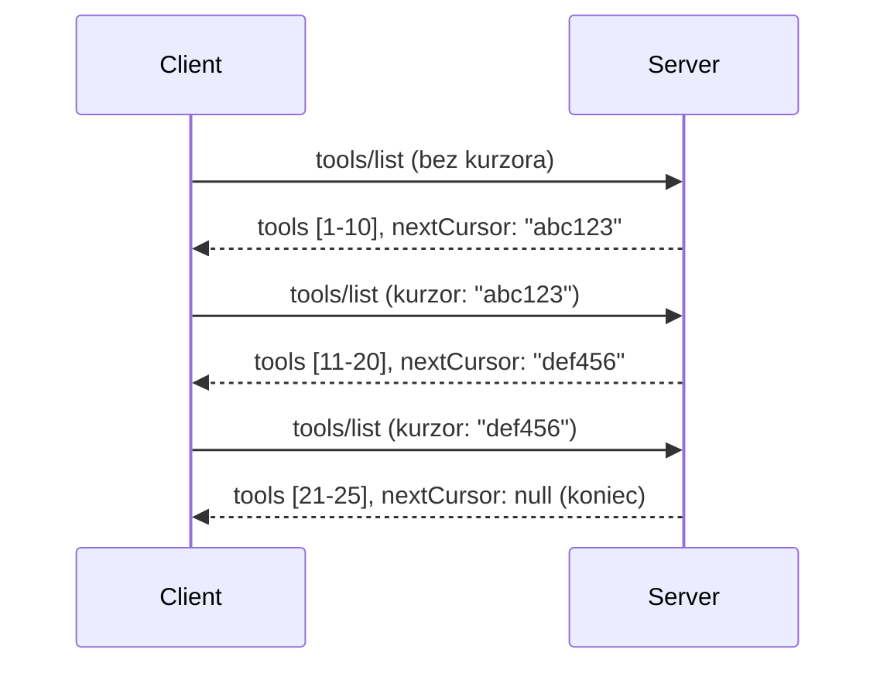

# Stránkovanie a veľké množiny výsledkov v MCP

Keď váš MCP server spracováva veľké množiny dát – či už zobrazuje tisíce súborov, záznamov v databáze alebo výsledkov vyhľadávania – potrebujete stránkovanie na efektívne spravovanie pamäte a zabezpečenie responzívneho používateľského zážitku. Tento návod vysvetľuje, ako implementovať a používať stránkovanie v MCP.

## Prečo je stránkovanie dôležité

Bez stránkovania môžu veľké odpovede spôsobiť:

- **Vyčerpanie pamäte** – Načítanie miliónov záznamov naraz
- **Pomalé reakčné časy** – Používatelia čakajú, kým sa načítajú všetky dáta
- **Chyby časového limitu** – Žiadosti prekročia časové limity
- **Slabý výkon AI** – LLM majú problém s obrovským kontextom

MCP používa **stránkovanie založené na kurzore** pre spoľahlivé a konzistentné prechádzanie množinami výsledkov.

---

## Ako funguje stránkovanie v MCP

### Koncept kurzora

**Kurzor** je nepriehľadný reťazec, ktorý označuje vašu pozíciu v množine výsledkov. Predstavte si ho ako záložku v dlhej knihe.



### Stránkovanie v MCP metódach

Tieto MCP metódy podporujú stránkovanie:

| Metóda | Vracia | Podpora kurzora |
|--------|---------|--------------------|
| `tools/list` | Definície nástrojov | ✅ |
| `resources/list` | Definície zdrojov | ✅ |
| `prompts/list` | Definície promptov | ✅ |
| `resources/templates/list` | Šablóny zdrojov | ✅ |

---

## Implementácia servera

### Python (FastMCP)

```python
from mcp.server import Server
from mcp.types import Tool, ListToolsResult
import math

app = Server("paginated-server")

# Simulovaný veľký súbor údajov
ALL_TOOLS = [
    Tool(name=f"tool_{i}", description=f"Tool number {i}", inputSchema={})
    for i in range(100)
]

PAGE_SIZE = 10

@app.list_tools()
async def list_tools(cursor: str | None = None) -> ListToolsResult:
    """List tools with pagination support."""
    
    # Dekódujte kurzor pre získanie počiatočného indexu
    start_index = 0
    if cursor:
        try:
            start_index = int(cursor)
        except ValueError:
            start_index = 0
    
    # Získať stránku výsledkov
    end_index = min(start_index + PAGE_SIZE, len(ALL_TOOLS))
    page_tools = ALL_TOOLS[start_index:end_index]
    
    # Vypočítať ďalší kurzor
    next_cursor = None
    if end_index < len(ALL_TOOLS):
        next_cursor = str(end_index)
    
    return ListToolsResult(
        tools=page_tools,
        nextCursor=next_cursor
    )
```

### TypeScript

```typescript
import { Server } from "@modelcontextprotocol/sdk/server/index.js";
import { ListToolsResultSchema } from "@modelcontextprotocol/sdk/types.js";

const server = new Server({
  name: "paginated-server",
  version: "1.0.0"
});

// Simulovaný veľký dataset
const ALL_TOOLS = Array.from({ length: 100 }, (_, i) => ({
  name: `tool_${i}`,
  description: `Tool number ${i}`,
  inputSchema: { type: "object", properties: {} }
}));

const PAGE_SIZE = 10;

server.setRequestHandler(ListToolsResultSchema, async (request) => {
  // Dekódovať kurzor
  let startIndex = 0;
  if (request.params?.cursor) {
    startIndex = parseInt(request.params.cursor, 10) || 0;
  }
  
  // Získať stránku výsledkov
  const endIndex = Math.min(startIndex + PAGE_SIZE, ALL_TOOLS.length);
  const pageTools = ALL_TOOLS.slice(startIndex, endIndex);
  
  // Vypočítať ďalší kurzor
  const nextCursor = endIndex < ALL_TOOLS.length ? String(endIndex) : undefined;
  
  return {
    tools: pageTools,
    nextCursor
  };
});
```

### Java (Spring MCP)

```java
@Service
public class PaginatedToolService {
    
    private static final int PAGE_SIZE = 10;
    private final List<Tool> allTools;
    
    public PaginatedToolService() {
        // Inicializovať veľký dataset
        this.allTools = IntStream.range(0, 100)
            .mapToObj(i -> new Tool("tool_" + i, "Tool number " + i, Map.of()))
            .collect(Collectors.toList());
    }
    
    @McpMethod("tools/list")
    public ListToolsResult listTools(@Param("cursor") String cursor) {
        // Dekódovať kurzor
        int startIndex = 0;
        if (cursor != null && !cursor.isEmpty()) {
            try {
                startIndex = Integer.parseInt(cursor);
            } catch (NumberFormatException e) {
                startIndex = 0;
            }
        }
        
        // Získať stránku výsledkov
        int endIndex = Math.min(startIndex + PAGE_SIZE, allTools.size());
        List<Tool> pageTools = allTools.subList(startIndex, endIndex);
        
        // Vypočítať ďalší kurzor
        String nextCursor = endIndex < allTools.size() ? String.valueOf(endIndex) : null;
        
        return new ListToolsResult(pageTools, nextCursor);
    }
}
```

---

## Implementácia klienta

### Python klient

```python
from mcp import ClientSession

async def get_all_tools(session: ClientSession) -> list:
    """Fetch all tools using pagination."""
    all_tools = []
    cursor = None
    
    while True:
        result = await session.list_tools(cursor=cursor)
        all_tools.extend(result.tools)
        
        if result.nextCursor is None:
            break
        cursor = result.nextCursor
    
    return all_tools

# Použitie
async with client_session as session:
    tools = await get_all_tools(session)
    print(f"Found {len(tools)} tools")
```

### TypeScript klient

```typescript
import { Client } from "@modelcontextprotocol/sdk/client/index.js";

async function getAllTools(client: Client): Promise<Tool[]> {
  const allTools: Tool[] = [];
  let cursor: string | undefined = undefined;
  
  do {
    const result = await client.listTools({ cursor });
    allTools.push(...result.tools);
    cursor = result.nextCursor;
  } while (cursor);
  
  return allTools;
}

// Použitie
const tools = await getAllTools(client);
console.log(`Found ${tools.length} tools`);
```

### Vzor lazy loading

Pri veľmi veľkých množinách dát načítavajte stránky na vyžiadanie:

```python
class PaginatedToolIterator:
    """Lazily iterate through paginated tools."""
    
    def __init__(self, session: ClientSession):
        self.session = session
        self.cursor = None
        self.buffer = []
        self.exhausted = False
    
    async def __anext__(self):
        # Vrátiť z vyrovnávacej pamäte, ak je k dispozícii
        if self.buffer:
            return self.buffer.pop(0)
        
        # Skontrolovať, či sme vyčerpali všetky stránky
        if self.exhausted:
            raise StopAsyncIteration
        
        # Získať nasledujúcu stránku
        result = await self.session.list_tools(cursor=self.cursor)
        self.buffer = list(result.tools)
        self.cursor = result.nextCursor
        
        if self.cursor is None:
            self.exhausted = True
        
        if not self.buffer:
            raise StopAsyncIteration
        
        return self.buffer.pop(0)
    
    def __aiter__(self):
        return self

# Použitie - pamäťovo efektívne pre veľké súbory údajov
async for tool in PaginatedToolIterator(session):
    process_tool(tool)
```

---

## Stránkovanie pre zdroje

Zdroje často potrebujú stránkovanie pre adresáre alebo veľké množiny dát:

```python
from mcp.server import Server
from mcp.types import Resource, ListResourcesResult
import os

app = Server("file-server")

@app.list_resources()
async def list_resources(cursor: str | None = None) -> ListResourcesResult:
    """List files in directory with pagination."""
    
    directory = "/data/files"
    all_files = sorted(os.listdir(directory))
    
    # Dekódovať kurzor (index súboru)
    start_index = int(cursor) if cursor else 0
    page_size = 20
    end_index = min(start_index + page_size, len(all_files))
    
    # Vytvoriť zoznam zdrojov pre túto stránku
    resources = []
    for filename in all_files[start_index:end_index]:
        filepath = os.path.join(directory, filename)
        resources.append(Resource(
            uri=f"file://{filepath}",
            name=filename,
            mimeType="application/octet-stream"
        ))
    
    # Vypočítať ďalší kurzor
    next_cursor = str(end_index) if end_index < len(all_files) else None
    
    return ListResourcesResult(
        resources=resources,
        nextCursor=next_cursor
    )
```

---

## Stratégie navrhovania kurzora

### Stratégia 1: Na základe indexu (jednoduchá)

```python
# Kurzor je iba index
cursor = "50"  # Začnite na položke 50
```

**Výhody:** Jednoduchá, bezstavová
**Nevýhody:** Výsledky sa môžu posunúť, ak sa položky pridávajú/odstraňujú

### Stratégia 2: Na základe ID (stabilná)

```python
# Kurzor je posledné viditeľné ID
cursor = "item_abc123"  # Začnite za týmto prvkom
```

**Výhody:** Stabilná aj pri zmene položiek
**Nevýhody:** Vyžaduje usporiadané ID

### Stratégia 3: Zakódovaný stav (zložitá)

```python
import base64
import json

def encode_cursor(state: dict) -> str:
    return base64.b64encode(json.dumps(state).encode()).decode()

def decode_cursor(cursor: str) -> dict:
    return json.loads(base64.b64decode(cursor).decode())

# Kurzor obsahuje viacero stavových polí
cursor = encode_cursor({
    "offset": 50,
    "filter": "active",
    "sort": "name"
})
```

**Výhody:** Môže zakódovať komplexný stav
**Nevýhody:** Zložitejšia, väčšie reťazce kurzora

---

## Najlepšie postupy

### 1. Vyberajte vhodné veľkosti stránok

```python
# Zvážte veľkosť dát
PAGE_SIZE_SMALL_ITEMS = 100   # Jednoduché metadata
PAGE_SIZE_MEDIUM_ITEMS = 20   # Bohatejšie objekty
PAGE_SIZE_LARGE_ITEMS = 5     # Komplexný obsah
```

### 2. Elegantne spracujte neplatné kurzory

```python
@app.list_tools()
async def list_tools(cursor: str | None = None) -> ListToolsResult:
    try:
        start_index = int(cursor) if cursor else 0
        if start_index < 0 or start_index >= len(ALL_TOOLS):
            start_index = 0  # Obnoviť na začiatok
    except (ValueError, TypeError):
        start_index = 0  # Neplatný kurzor, začať odznova
    # ...
```

### 3. Pridajte celkový počet (voliteľné)

```python
return ListToolsResult(
    tools=page_tools,
    nextCursor=next_cursor,
    # Niektoré implementácie zahrnujú celkový stav pre postup používateľského rozhrania
    _meta={"total": len(ALL_TOOLS)}
)
```

### 4. Testujte hraničné prípady

```python
async def test_pagination():
    # Prázdna množina výsledkov
    result = await session.list_tools()
    assert result.tools == []
    assert result.nextCursor is None
    
    # Jedna stránka
    result = await session.list_tools()
    assert len(result.tools) <= PAGE_SIZE
    
    # Neplatný kurzor
    result = await session.list_tools(cursor="invalid")
    assert result.tools  # Malo by vrátiť prvú stránku
```

---

## Bežné nástrahy

### ❌ Vraciať všetky výsledky a potom stránkovať na strane klienta

```python
# ZLÉ: Načíta všetko do pamäte
@app.list_tools()
async def list_tools() -> ListToolsResult:
    all_tools = load_all_tools()  # 1 milión nástrojov!
    return ListToolsResult(tools=all_tools)
```

### ✅ Stránkovať priamo u zdroja dát

```python
# DOBRÉ: Načíta iba to, čo je potrebné
@app.list_tools()
async def list_tools(cursor: str | None = None) -> ListToolsResult:
    offset = int(cursor) if cursor else 0
    tools = await db.query_tools(offset=offset, limit=PAGE_SIZE)
    return ListToolsResult(tools=tools, nextCursor=...)
```

---

## Čo nasleduje

- [Modul 5.14 - Inžinierstvo kontextu](../../05-AdvancedTopics/mcp-contextengineering/README.md)
- [Modul 8 - Najlepšie postupy](../../08-BestPractices/README.md)
- [3.8 - Testovanie vášho MCP servera](../../03-GettingStarted/08-testing/README.md)

---

## Dodatočné zdroje

- [Špecifikácia MCP - Stránkovanie](https://modelcontextprotocol.io/specification/2026-07-28/)
- [Vysvetlenie stránkovania založeného na kurzore](https://slack.engineering/evolving-api-pagination-at-slack/)
- [Testy stránkovania Python SDK](https://github.com/modelcontextprotocol/python-sdk/blob/main/tests/client/test_list_methods_cursor.py)

---

<!-- CO-OP TRANSLATOR DISCLAIMER START -->
**Vyhlásenie o zodpovednosti**:
Tento dokument bol preložený pomocou AI prekladateľskej služby [Co-op Translator](https://github.com/Azure/co-op-translator). Hoci sa snažíme o presnosť, vezmite prosím na vedomie, že automatické preklady môžu obsahovať chyby alebo nepresnosti. Pôvodný dokument v jeho natívnom jazyku by mal byť považovaný za autoritatívny zdroj. Pre kritické informácie sa odporúča profesionálny ľudský preklad. Nie sme zodpovední za žiadne nedorozumenia alebo nesprávne interpretácie vyplývajúce z použitia tohto prekladu.
<!-- CO-OP TRANSLATOR DISCLAIMER END -->