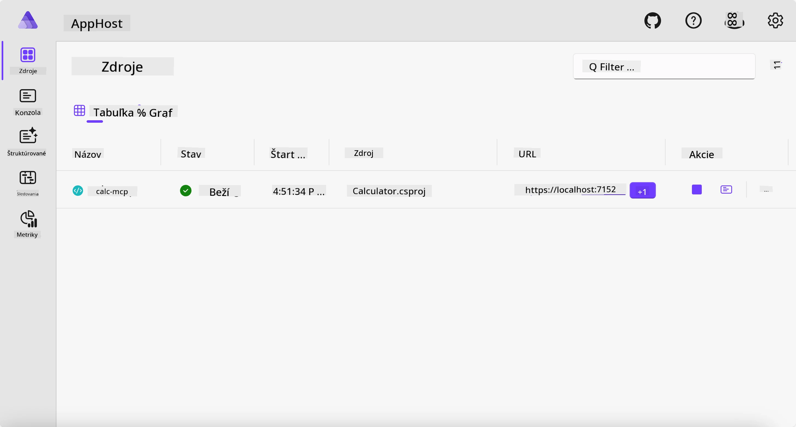
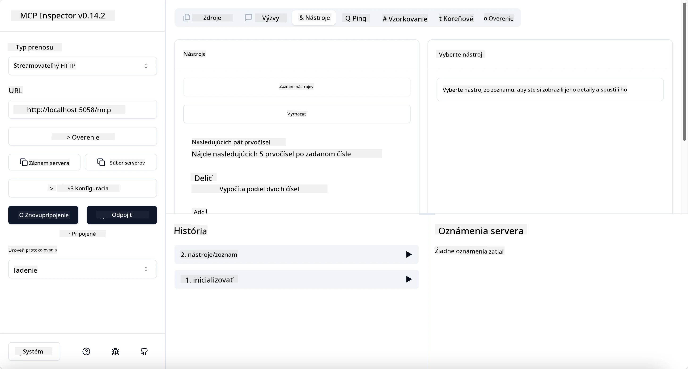
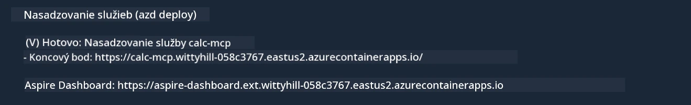

# Príklad

Predchádzajúci príklad ukazuje, ako používať lokálny .NET projekt s typom `stdio`. A ako spustiť server lokálne v kontejnery. Toto je dobré riešenie v mnohých situáciách. Avšak, môže byť užitočné mať server bežiaci na diaľku, napríklad v cloudovom prostredí. Práve tu prichádza na rad typ `http`.

Pri pohľade na riešenie v priečinku `04-PracticalImplementation` môže vyzerať oveľa zložitejšie než predchádzajúce. Ale v skutočnosti to tak nie je. Ak sa pozriete bližšie na projekt `src/Calculator`, uvidíte, že ide väčšinou o rovnaký kód ako v predchádzajúcom príklade. Jediný rozdiel je, že používame inú knižnicu `ModelContextProtocol.AspNetCore` na spracovanie HTTP požiadaviek. A meníme metódu `IsPrime` na súkromnú, iba aby sme ukázali, že v kóde môžete mať súkromné metódy. Zvyšok kódu je rovnaký ako predtým.

Ostatné projekty pochádzajú od [Aspire](https://aspire.dev/get-started/what-is-aspire/). Mať Aspire v riešení zlepší skúsenosť vývojára počas vývoja a testovania a pomôže s pozorovateľnosťou. Nie je to nutné pre spustenie servera, ale je to dobrá prax mať ho vo vašom riešení.

## Spustenie servera lokálne

1. Vo VS Code (s rozšírením C# DevKit) prejdite do adresára `04-PracticalImplementation/samples/csharp`.
1. Spustite nasledujúci príkaz na spustenie servera:

   ```bash
    dotnet watch run --project ./src/AppHost
   ```

1. Keď webový prehliadač otvorí Aspire dashboard, všimnite si URL `http`. Malo by to vyzerať približne ako `http://localhost:5058/`.

   

## Testovanie Streamable HTTP pomocou MCP Inspektora

Ak máte Node.js 22.7.5 alebo novší, môžete použiť MCP Inspektora na testovanie vášho servera.

Spustite server a v termináli zadajte nasledujúci príkaz:

```bash
npx @modelcontextprotocol/inspector http://localhost:5058
```



- Vyberte `Streamable HTTP` ako typ transportu.
- Do poľa Url zadajte URL servera, ktoré ste si predtým poznamenali, a pridajte `/mcp`. Malo by to byť `http` (nie `https`), napríklad `http://localhost:5058/mcp`.
- stlačte tlačidlo Connect.

Skvelé na Inspektorovi je, že poskytuje dobrý prehľad o dianí.

- Skúste zoznam dostupných nástrojov
- Vyskúšajte niektoré z nich, mali by fungovať rovnako ako predtým.

## Test MCP servera pomocou GitHub Copilot Chat vo VS Code

Na použitie Streamable HTTP transportu s GitHub Copilot Chat upravte konfiguráciu servera `calc-mcp`, ktorý sme vytvorili skôr, takto:

```jsonc
// .vscode/mcp.json
{
  "servers": {
    "calc-mcp": {
      "type": "http",
      "url": "http://localhost:5058/mcp"
    }
  }
}
```

Urobte si nejaké testy:

- Požiadajte o "3 prvočísla za 6780". Všimnite si, že Copilot použije nové nástroje `NextFivePrimeNumbers` a vráti len prvé 3 prvočísla.
- Požiadajte o "7 prvočísel za 111", aby ste videli, čo sa stane.
- Požiadajte o "John má 24 lízaniek a chce ich rozdeliť medzi svoje 3 deti. Koľko lízaniek má každé dieťa?", aby ste videli, čo sa stane.

## Nasadenie servera na Azure

Nasadíme server na Azure, aby ho mohlo používať viac ľudí.

V termináli prejdite do priečinka `04-PracticalImplementation/samples/csharp` a zadajte nasledujúci príkaz:

```bash
azd up
```

Po dokončení nasadenia by ste mali vidieť správu ako táto:



Skopírujte URL a použite ho v MCP Inspektorovi a v GitHub Copilot Chate.

```jsonc
// .vscode/mcp.json
{
  "servers": {
    "calc-mcp": {
      "type": "http",
      "url": "https://calc-mcp.gentleriver-3977fbcf.australiaeast.azurecontainerapps.io/mcp"
    }
  }
}
```

## Čo ďalej?

Vyskúšali sme rôzne typy transportu a nástroje na testovanie. Tiež sme nasadili MCP server na Azure. Ale čo ak náš server potrebuje prístup k súkromným zdrojom? Napríklad databáze alebo súkromnému API? V nasledujúcej kapitole si ukážeme, ako môžeme zlepšiť bezpečnosť nášho servera.

---

<!-- CO-OP TRANSLATOR DISCLAIMER START -->
**Vyhlásenie o zodpovednosti**:
Tento dokument bol preložený pomocou AI prekladateľskej služby [Co-op Translator](https://github.com/Azure/co-op-translator). Hoci sa snažíme o presnosť, vezmite prosím na vedomie, že automatické preklady môžu obsahovať chyby alebo nepresnosti. Pôvodný dokument v jeho natívnom jazyku by mal byť považovaný za autoritatívny zdroj. Pre kritické informácie sa odporúča profesionálny ľudský preklad. Nie sme zodpovední za žiadne nedorozumenia alebo nesprávne interpretácie vyplývajúce z použitia tohto prekladu.
<!-- CO-OP TRANSLATOR DISCLAIMER END -->