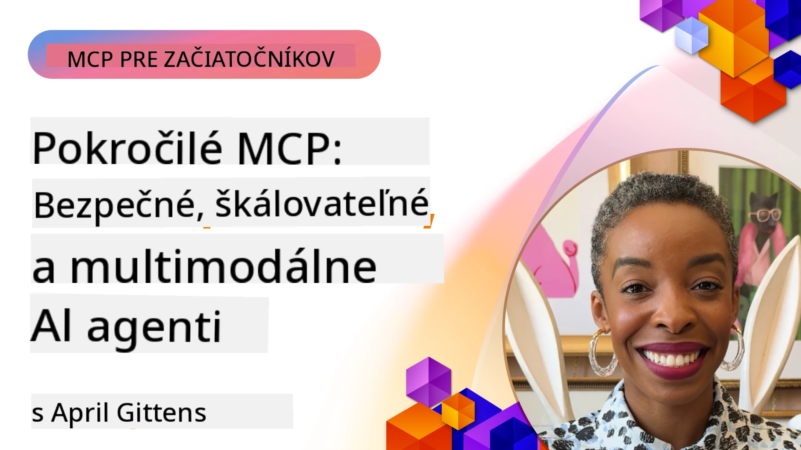

# Pokročilé témy v MCP

_(Kliknite na obrázok vyššie pre zobrazenie videa tejto lekcie)_

Táto kapitola pokrýva sériu pokročilých tém v implementácii Model Context Protocol (MCP), vrátane multimodálnej integrácie, škálovateľnosti, najlepších bezpečnostných postupov a podnikovej integrácie. Témy sú kľúčové pre budovanie robustných a pripravených na produkciu MCP aplikácií, ktoré dokážu splniť požiadavky moderných AI systémov.

## Prehľad

Táto lekcia skúma pokročilé koncepty v implementácii Model Context Protocol, so zameraním na multimodálnu integráciu, škálovateľnosť, najlepšie bezpečnostné praktiky a podnikové integrácie. Tieto témy sú nevyhnutné pre budovanie produkčných MCP aplikácií, ktoré zvládnu zložité požiadavky v podnikových prostrediach.

> **Poznámka k aktuálnej špecifikácii:** MCP `2026-07-28` zastaralizuje primitíva Roots a
> Sampling pokryté v lekciách 5.4 a 5.6. Tiež presúva
> experimentálnu funkcionalitu Tasks uvedenú v Protocol Features (5.16) do
> samostatného rozšírenia Tasks. Tieto lekcie zostávajú pre staršie
> implementácie `2025-11-25` a obsahujú pokyny na migráciu. Viď
> [Čo sa zmenilo v MCP: Špecifikácia 2026-07-28](../01-CoreConcepts/mcp-2026-07-28.md).

## Ciele učenia

Do konca tejto lekcie budete vedieť:

- Implementovať multimodálne schopnosti v rámci MCP platforiem
- Navrhnúť škálovateľné MCP architektúry pre scenáre s vysokou záťažou
- Aplikovať najlepšie bezpečnostné postupy v súlade s bezpečnostnými princípmi MCP
- Integrovať MCP s podnikových AI systémami a platformami
- Optimalizovať výkon a spoľahlivosť v produkčných prostrediach

## Lekcie a ukážkové projekty

| Odkaz | Názov | Popis |
|------|-------|-------------|
| [5.1 Integrácia s Azure](./mcp-integration/README.md) | Integrácia s Azure | Naučte sa, ako integrovať svoj MCP Server na Azure |
| [5.2 Ukážka multimodality](./mcp-multi-modality/README.md) | MCP multimodálne ukážky  | Ukážky pre audio, obraz a multimodálne odpovede |
| [5.3 MCP OAuth2 ukážka](../../../05-AdvancedTopics/mcp-oauth2-demo) | MCP OAuth2 Demo | Minimálna aplikácia Spring Boot ukazujúca OAuth2 s MCP, ako autorizačný a zdrojový server. Demonštruje bezpečné vydávanie tokenov, chránené endpointy, nasadenie v Azure Container Apps a integráciu s API Management. |
| [5.4 Root Contexts](./mcp-root-contexts/README.md) | Koreňové kontexty  | Naučte sa staršie primitívum Roots z verzie `2025-11-25` a aktuálne možnosti migrácie (zastaralé od `2026-07-28`) |
| [5.5 Routing](./mcp-routing/README.md) | Smerovanie | Naučte sa rôzne typy smerovania |
| [5.6 Sampling](./mcp-sampling/README.md) | Sampling | Naučte sa staršie primitívum Sampling z verzie `2025-11-25` a aktuálne možnosti migrácie (zastaralé od `2026-07-28`) |
| [5.7 Scaling](./mcp-scaling/README.md) | Škálovanie  | Naučte sa o škálovaní |
| [5.8 Security](./mcp-security/README.md) | Bezpečnosť  | Zabezpečte svoj MCP Server |
| [5.9 Web Search ukážka](./web-search-mcp/README.md) | Web Search MCP | Python MCP server a klient integrujúci SerpAPI pre vyhľadávanie na webe v reálnom čase, správy, produkty a Q&A. Demonštruje orchestráciu multimodelov, integráciu externých API a robustné spracovanie chýb. |
| [5.10 Realtime Streaming](./mcp-realtimestreaming/README.md) | Streaming  | Streamovanie dát v reálnom čase sa stalo nevyhnutnosťou v dnešnom svete riadenom dátami, kde podniky a aplikácie potrebujú okamžitý prístup k informáciám na pravovčasné rozhodnutia.|
| [5.11 Realtime Web Search](./mcp-realtimesearch/README.md) | Webové vyhľadávanie | Reálne časové webové vyhľadávanie ako MCP transformuje vyhľadávanie v reálnom čase, poskytovaním štandardizovaného prístupu k správe kontextu naprieč AI modelmi, vyhľadávačmi a aplikáciami.| 
| [5.12 Autentifikácia Entra ID pre Model Context Protocol Servery](./mcp-security-entra/README.md) | Autentifikácia Entra ID | Microsoft Entra ID poskytuje robustné cloudové riešenie na správu identity a prístupu, zabezpečujúce, že len autorizovaní používatelia a aplikácie môžu komunikovať s vaším MCP serverom.|
| [5.13 Integrácia agenta Microsoft Foundry](./mcp-foundry-agent-integration/README.md) | Integrácia Microsoft Foundry | Naučte sa, ako integrovať Model Context Protocol servery s agentmi Microsoft Foundry, čo umožňuje výkonnú orchestráciu nástrojov a podnikové AI schopnosti so štandardizovanými externými dátovými zdrojmi.|
| [5.14 Inžinierstvo kontextu](./mcp-contextengineering/README.md) | Inžinierstvo kontextu | Budúce príležitosti techník inžinierstva kontextu pre MCP servery, vrátane optimalizácie kontextu, dynamickej správy kontextu a stratégií efektívneho prompt engineeringu v rámci MCP platforiem.|
| [5.15 Vlastný transport MCP](./mcp-transport/README.md) | Vlastný transport | Naučte sa implementovať vlastné transportné mechanizmy pre špecializované scenáre komunikácie MCP.|
| [5.16 Hĺbkový ponor do funkcií protokolu](./mcp-protocol-features/README.md) | Funkcie protokolu | Ovládnite pokročilé funkcie protokolu vrátane notifikácií o pokroku, zrušenia požiadaviek, šablón zdrojov a vzorov spracovania chýb.|
| [5.17 Adverziálne viacagentné uvažovanie](./mcp-adversarial-agents/README.md) | Adverziálni agenti | Použite dvoch agentov s protichodnými stanoviskami, ktorí zdieľajú súbor MCP nástrojov, na odhaľovanie halucinácií, vystavenie okrajových prípadov a produkciu lepšie kalibrovaných výstupov cez štruktúrovanú debatu.|

> **Historická poznámka `2025-11-25`:** táto revízia zaviedla experimentálne
> Tasks a rozšírila niekoľko funkcií protokolu. V `2026-07-28` sa Tasks presunuli na
> oficiálne rozšírenie a Roots boli zastarané. Nepoužívajte
> stav funkcie `2025-11-25` ako aktuálne usmernenie; pozrite si
> [zmeny v 2026-07-28](https://modelcontextprotocol.io/specification/2026-07-28/changelog).

## Dodatočné odkazy

Pre najaktuálnejšie informácie o pokročilých témach MCP, konzultujte:
- [Dokumentácia MCP](https://modelcontextprotocol.io/)
- [Špecifikácia MCP (2026-07-28)](https://modelcontextprotocol.io/specification/2026-07-28/)
- [GitHub Repository](https://github.com/modelcontextprotocol)
- [OWASP MCP Top 10](https://microsoft.github.io/mcp-azure-security-guide/mcp/) - Bezpečnostné riziká a zmiernenia
- [MCP Security Summit Workshop (Sherpa)](https://azure-samples.github.io/sherpa/) - Praktický bezpečnostný tréning

## Kľúčové závery

- Multimodálne MCP implementácie rozširujú AI schopnosti za hranice spracovania textu
- Škálovateľnosť je nevyhnutná pre podnikové nasadenia a dá sa riešiť horizontálnym a vertikálnym škálovaním
- Komplexné bezpečnostné opatrenia chránia dáta a zabezpečujú správne riadenie prístupu
- Podniková integrácia s platformami ako Azure OpenAI a Microsoft AI Foundry zvyšuje možnosti MCP
- Pokročilé MCP implementácie profitujú z optimalizovaných architektúr a starostlivého manažmentu zdrojov

## Cvičenie

Navrhnite podnikové MCP riešenie pre konkrétny prípad použitia:

1. Identifikujte multimodálne požiadavky pre váš prípad použitia
2. Vymedzte bezpečnostné kontroly potrebné na ochranu citlivých dát
3. Navrhnite škálovateľnú architektúru schopnú zvládnuť rôzne záťaže
4. Naplánujte integračné body s podnikových AI systémami
5. Zdokumentujte potenciálne výkonnostné úzke hrdlá a stratégie ich zvládania

## Dodatočné zdroje

- [Dokumentácia Azure OpenAI](https://learn.microsoft.com/en-us/azure/ai-services/openai/)
- [Dokumentácia Microsoft AI Foundry](https://learn.microsoft.com/en-us/ai-services/)

---

## Čo ďalej

Preskúmajte lekcie v tomto module začínajúc s: [5.1 MCP Integrácia](./mcp-integration/README.md)

Po dokončení tohto modulu pokračujte na: [Modul 6: Príspevky komunity](../06-CommunityContributions/README.md)

---

<!-- CO-OP TRANSLATOR DISCLAIMER START -->
**Vyhlásenie o zodpovednosti**:
Tento dokument bol preložený pomocou AI prekladateľskej služby [Co-op Translator](https://github.com/Azure/co-op-translator). Hoci sa snažíme o presnosť, vezmite prosím na vedomie, že automatické preklady môžu obsahovať chyby alebo nepresnosti. Pôvodný dokument v jeho natívnom jazyku by mal byť považovaný za autoritatívny zdroj. Pre kritické informácie sa odporúča profesionálny ľudský preklad. Nie sme zodpovední za žiadne nedorozumenia alebo nesprávne interpretácie vyplývajúce z použitia tohto prekladu.
<!-- CO-OP TRANSLATOR DISCLAIMER END -->