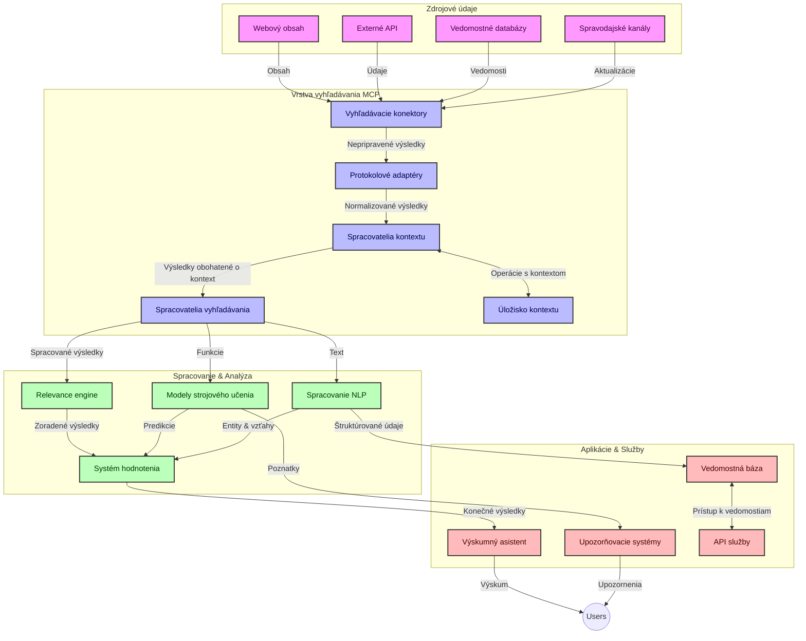
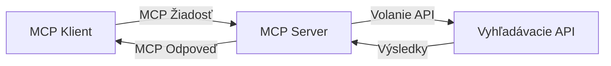
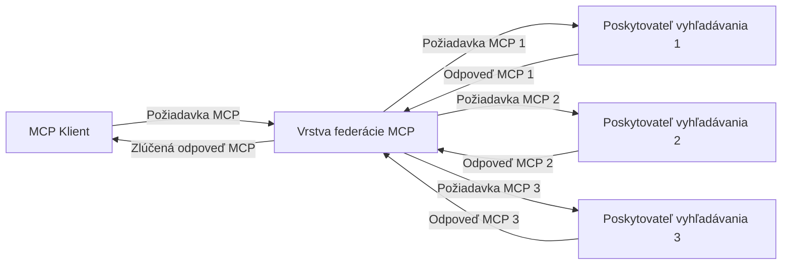
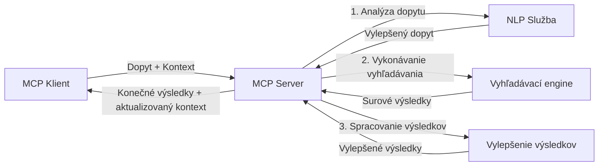

# Protokol kontextu modelu pre vyhľadávanie na webe v reálnom čase

## Prehľad

Vyhľadávanie na webe v reálnom čase sa stalo nevyhnutnosťou v dnešnom informačne orientovanom prostredí, kde aplikácie potrebujú okamžitý prístup k aktuálnym informáciám z celého internetu, aby poskytovali relevantné a časovo presné odpovede. Protokol kontextu modelu (MCP) predstavuje významný pokrok v optimalizácii týchto procesov vyhľadávania v reálnom čase, zvyšuje efektivitu vyhľadávania, zachováva kontextuálnu integritu a zlepšuje celkový výkon systému.

Tento modul skúma, ako MCP transformuje vyhľadávanie na webe v reálnom čase poskytovaním štandardizovaného prístupu k správe kontextu naprieč AI modelmi, vyhľadávacími enginmi a aplikáciami.

### Čo sa naučíte

V tomto komplexnom návode objavíte:

- Ako MCP vytvára bezproblémové prepojenie medzi AI modelmi a schopnosťami vyhľadávania na webe v reálnom čase
- Architektonické vzory na implementáciu efektívnych a škálovateľných vyhľadávacích riešení s MCP
- Techniky na zachovanie kontextu vyhľadávania počas viacerých dopytov a interakcií
- Praktické implementácie kódu v Pythone a JavaScripte pre rôzne vyhľadávacie scenáre
- Metódy na vyváženie relevantnosti, aktuálnosti a výkonu v systémoch vyhľadávania s podporou MCP

## Úvod do vyhľadávania na webe v reálnom čase

Vyhľadávanie na webe v reálnom čase je technologický prístup, ktorý umožňuje neustále dotazovanie, spracovanie a analýzu webových informácií hneď ako sú publikované alebo aktualizované, čo umožňuje systémom poskytovať čerstvé a relevantné informácie s minimálnou latenciou. Na rozdiel od tradičných vyhľadávacích systémov, ktoré pracujú s indexovanými dátami, ktoré môžu byť staré hodiny alebo dni, vyhľadávanie v reálnom čase spracováva živé dáta z webu a prináša poznatky a informácie, ktoré odrážajú aktuálny stav online obsahu.

### Kľúčové koncepty vyhľadávania na webe v reálnom čase:

- **Neustále spracovanie dotazov**: Vyhľadávacie dopyty sú spracovávané voči neustále aktualizovaným zdrojom dát
- **Prioritizácia aktuálnosti**: Systémy sú navrhnuté na uprednostňovanie čerstvých informácií
- **Vyváženie relevantnosti**: Zachovanie rovnováhy medzi relevantnosťou a aktuálnosťou
- **Škálovateľná architektúra**: Systémy musia zvládať rôzne záťaže dopytov a objemy dát
- **Porozumenie kontextu**: Zachovanie používateľského kontextu počas opakovaných vyhľadávaní je kľúčové pre zmysluplné výsledky
- **Dynamická reformulácia dotazov**: Adaptívna úprava dopytov založená na kontexte a predchádzajúcich výsledkoch
- **Integrácia viacerých zdrojov**: Kombinovanie výsledkov z viacerých vyhľadávacích poskytovateľov a webových zdrojov
- **Sémantické porozumenie**: Spracovanie dotazov a obsahu na základe významu, nie len kľúčových slov
- **Rebríčkovanie v reálnom čase**: Neustále prispôsobovanie hodnotenia výsledkov ako sú k dispozícii nové informácie

### Protokol kontextu modelu a vyhľadávanie na webe v reálnom čase

Protokol kontextu modelu (MCP) rieši niekoľko kritických výziev v prostredí vyhľadávania na webe v reálnom čase:

1. **Zachovanie kontextu vyhľadávania**: MCP štandardizuje, ako sa kontext udržiava naprieč distribuovanými vyhľadávacími komponentmi, zabezpečujúc že AI modely a spracovateľské uzly majú prístup k relevantnej histórii dopytov a preferenciám používateľa.

2. **Efektívna správa dopytov**: Poskytovaním štruktúrovaných mechanizmov na prenos kontextu MCP znižuje režijné náklady opakovania kontextu v každej iterácii vyhľadávania.

3. **Interoperabilita**: MCP vytvára spoločný jazyk na zdieľanie kontextu medzi rôznorodými vyhľadávacími technológiami a AI modelmi, čo umožňuje flexibilnejšiu a rozšíriteľnú architektúru.

4. **Vyhľadávaniu optimalizovaný kontext**: Implementácie MCP môžu uprednostňovať, ktoré prvky kontextu sú najrelevantnejšie pre efektívne vyhľadávanie, optimalizujúc výkon aj presnosť.

5. **Adaptívne spracovanie vyhľadávania**: S riadnou správou kontextu cez MCP môžu vyhľadávacie systémy dynamicky prispôsobovať spracovanie na základe vyvíjajúcich sa potrieb používateľa a informačných krajín.

V moderných aplikáciách od agregácie správ po výskumných asistentov umožňuje integrácia MCP s webovými vyhľadávacími technológiami inteligentnejšie, kontextovo uvedomelé vyhľadávanie, ktoré môže poskytovať stále relevantnejšie výsledky ako používateľské interakcie pokračujú.

## Výučbové ciele

Na konci tejto lekcie budete schopní:

- Pochopiť základy vyhľadávania na webe v reálnom čase a jeho výzvy v moderných aplikáciách
- Vysvetliť, ako Protokol kontextu modelu (MCP) zlepšuje schopnosti vyhľadávania na webe v reálnom čase
- Implementovať riešenia vyhľadávania založené na MCP pomocou populárnych rámcov a API
- Navrhnúť a nasadiť škálovateľné, vysoko výkonné vyhľadávacie architektúry s MCP
- Použiť koncepcie MCP na rôzne prípady použitia vrátane sémantického vyhľadávania, výskumných asistentov a AI podporovaného prehliadania
- Hodnotiť vznikajúce trendy a budúce inovácie v MCP-založených vyhľadávacích technológiách
- Vyvíjať kontextovo uvedomelé vyhľadávacie systémy, ktoré sa učia z používateľských interakcií
- Integrovať schopnosti webového vyhľadávania do AI asistentov pomocou štandardizovaných MCP protokolov
- Vytvárať viacstupňové vyhľadávacie procesy, ktoré postupne zlepšujú výsledky na základe kontextu
- Optimalizovať výkon vyhľadávania pri zachovaní komplexného povedomia o kontexte

### Definícia a význam

Vyhľadávanie na webe v reálnom čase zahŕňa nepretržité dotazovanie, získavanie a dodávanie webových informácií s minimálnou latenciou. Na rozdiel od tradičných vyhľadávacích enginov, ktoré periodicky prehľadávajú a indexujú web, vyhľadávanie v reálnom čase sa snaží zverejniť informácie hneď ako sú dostupné, umožňujúc okamžitý prístup k najaktuálnejšiemu obsahu.

Kľúčové charakteristiky vyhľadávania na webe v reálnom čase zahŕňajú:

- **Čerstvosť**: Uprednostňovanie nedávneho obsahu a aktualizácií
- **Neustále spracovanie**: Neustále sledovanie novej informácie
- **Adaptácia dotazov**: Zdokonaľovanie vyhľadávacích dopytov na základe kontextu a spätných väzieb
- **Okamžité dodanie**: Poskytovanie výsledkov vyhľadávania s minimálnym oneskorením
- **Udržiavanie kontextu**: Stavanie na predchádzajúcich dotazoch pre lepšiu relevantnosť

### Výzvy v tradičnom webovom vyhľadávaní

Tradičné prístupy k webovému vyhľadávaniu čelia niekoľkým obmedzeniam, keď sa aplikujú na scenáre v reálnom čase:

1. **Fragmentácia kontextu**: Obtiažnosť udržiavania kontextu vyhľadávania pri viacerých dotazoch
2. **Aktuálnosť informácií**: Výzvy pri prístupe a prioritizácii najnovších informácií
3. **Komplexnosť integrácie**: Problémy s interoperabilitou medzi vyhľadávacími systémami a aplikáciami
4. **Problémy s latenciou**: Vyváženie komplexného vyhľadávania a požiadaviek na dobu odozvy
5. **Ladenie relevantnosti**: Zabezpečenie presnosti a relevantnosti pri uprednostňovaní aktuálnosti

## Pochopenie protokolu kontextu modelu (MCP) pre vyhľadávanie

### Čo je MCP v kontextoch vyhľadávania?

Protokol kontextu modelu (MCP) je štandardizovaný komunikačný protokol navrhnutý na uľahčenie efektívnej interakcie medzi AI modelmi a aplikáciami. V kontexte vyhľadávania na webe v reálnom čase poskytuje MCP rámec pre:

- Zachovávanie kontextu vyhľadávania počas sekvencií dopytov
- Štandardizáciu formátov vyhľadávacích dopytov a výsledkov
- Optimalizáciu prenosu parametrov vyhľadávania a výsledkov
- Zlepšenie komunikácie medzi modelom a vyhľadávacím enginom

### Základné komponenty a architektúra

Architektúra MCP pre vyhľadávanie na webe v reálnom čase sa skladá z niekoľkých kľúčových komponentov:

1. **Správca kontextu dopytov**: Riadi a udržiava kontext vyhľadávania počas viacerých dopytov
2. **Spracovatelia vyhľadávania**: Spracovávajú prichádzajúce vyhľadávacie požiadavky s využitím kontextovo uvedomelých techník
3. **Protokolové adaptéry**: Konvertujú medzi rôznymi vyhľadávacími API pri zachovaní kontextu
4. **Úložisko kontextu**: Efektívne uchováva a získava históriu vyhľadávania a preferencie
5. **Vyhľadávacie konektory**: Pripájajú sa k rôznym vyhľadávacím enginom a webovým API



### Ako MCP zlepšuje vyhľadávanie na webe v reálnom čase

MCP rieši tradičné výzvy webového vyhľadávania prostredníctvom:

- **Kontinuita kontextu**: Udržiavanie vzťahov medzi dopytmi počas celej vyhľadávacej relácie
- **Optimalizovaný prenos**: Znižovanie redundancie v parametroch vyhľadávania prostredníctvom inteligentného manažmentu kontextu
- **Štandardizované rozhrania**: Poskytovanie konzistentných API pre vyhľadávacie komponenty
- **Znížená latencia**: Minimalizovanie spracovacej záťaže efektívnym spracovaním kontextu
- **Zvýšená relevantnosť**: Zlepšovanie relevantnosti vyhľadávania zachovaním zámeru používateľa naprieč viacerými dopytmi


## Integrácia a implementácia

Systémy na vyhľadávanie na webe v reálnom čase vyžadujú starostlivý architektonický návrh a implementáciu, aby sa zachovala výkonosť aj kontextová integrita. Protokol Model Context Protocol (MCP) ponúka štandardizovaný prístup k integrácii AI modelov a vyhľadávacích technológií, čo umožňuje sofistikovanejšie, kontextovo uvedomelé vyhľadávacie pipeline.

### Prehľad integrácie MCP vo vyhľadávacích architektúrach

Implementácia MCP v prostredí vyhľadávania na webe v reálnom čase zahŕňa niekoľko kľúčových faktorov:

1. **Serializácia vyhľadávacieho kontextu**: MCP poskytuje efektívne mechanizmy na kódovanie kontextových informácií v rámci vyhľadávacích požiadaviek, čím zabezpečuje, že nevyhnutný kontext sprevádza dotaz počas celého spracovateľského procesu. Toto zahŕňa štandardizované serializačné formáty optimalizované pre metadata súvisiace s vyhľadávaním.

2. **Spracovanie vyhľadávania s uchovávaním stavu**: MCP umožňuje inteligentnejšie spracovanie so zachovaním konzistentnej reprezentácie kontextu naprieč vyhľadávacími iteráciami. To je obzvlášť cenné v multi-fázových vyhľadávacích pipeline, kde sa kontext vylepšuje pre lepšie výsledky.

3. **Rozšírenie a upresnenie dopytov**: Implementácie MCP vo vyhľadávacích systémoch môžu uľahčovať sofistikované rozšírenie a upresnenie dopytov na základe nahromadeného kontextu, čo umožňuje získavať stále relevantnejšie výsledky v priebehu vyhľadávacej relácie.

4. **Kešovanie a prioritizácia výsledkov**: Štandardizáciou spracovania kontextu pomáha MCP riadiť kešovanie a prioritizáciu výsledkov, čím umožňuje komponentom prispôsobiť sa meniacemu sa vyhľadávaciemu kontextu.

5. **Federácia a agregácia vyhľadávania**: MCP umožňuje komplexnejšiu federáciu vyhľadávania naprieč viacerými backendmi tým, že poskytuje štruktúrované reprezentácie vyhľadávacieho kontextu, čo umožňuje zmysluplnejšiu agregáciu výsledkov z rôznorodých zdrojov.

Implementácia MCP naprieč rôznymi vyhľadávacími technológiami vytvára jednotný prístup k správe kontextu, čím sa znižuje potreba vlastného integračného kódu a zároveň sa zlepšuje schopnosť systému udržiavať zmysluplný kontext, ako sa vyhľadávacie dotazy vyvíjajú.

### MCP v rôznych implementáciách webového vyhľadávania

Tieto príklady vychádzajú zo súčasnej špecifikácie MCP, ktorá sa zameriava na JSON-RPC protokol s odlišnými transportnými mechanizmami. Kód ukazuje, ako možno implementovať vlastné integrácie vyhľadávania pri zachovaní plnej kompatibility s MCP protokolom.


<details>
<summary>Implementácia v Pythone s generickým vyhľadávacím API</summary>

```python
import asyncio
import json
import aiohttp
from typing import Dict, Any, Optional, List
from contextlib import asynccontextmanager
from collections.abc import AsyncIterator

# Importujte štandardné knižnice MCP
from mcp.client.session import ClientSession
from mcp.client.streamable_http import streamablehttp_client
from mcp.types import TextContent, CreateMessageRequestParams, CreateMessageResult
from mcp.server.fastmcp import FastMCP

# Vytvorte server FastMCP pre webové vyhľadávanie
search_server = FastMCP("WebSearch")

# Trieda na spracovanie operácií webového vyhľadávania
class WebSearchHandler:
    def __init__(self, api_endpoint: str, api_key: str):
        self.api_endpoint = api_endpoint
        self.api_key = api_key
        self.session = None
        
    async def initialize(self):
        """Initialize the HTTP session"""
        self.session = aiohttp.ClientSession(
            headers={"Authorization": f"Bearer {self.api_key}"}
        )
    
    async def close(self):
        """Close the HTTP session"""
        if self.session:
            await self.session.close()
            
    async def perform_search(self, query: str, max_results: int = 5, 
                           include_domains: List[str] = None, 
                           exclude_domains: List[str] = None,
                           time_period: str = "any") -> Dict[str, Any]:
        """Perform web search using the search API"""
        # Konštruujte parametre vyhľadávania
        search_params = {
            "q": query,
            "limit": max_results,
            "time": time_period
        }
        
        if include_domains:
            search_params["site"] = ",".join(include_domains)
            
        if exclude_domains:
            search_params["exclude_site"] = ",".join(exclude_domains)
        
        # Vykonajte požiadavku na vyhľadávanie
        try:
            async with self.session.get(
                self.api_endpoint,
                params=search_params
            ) as response:
                if response.status != 200:
                    error_text = await response.text()
                    raise Exception(f"Search API error: {response.status} - {error_text}")
                
                search_data = await response.json()
                
                # Preveďte odpoveď špecifickú pre API do štandardného formátu
                results = []
                for item in search_data.get("results", []):
                    results.append({
                        "title": item.get("title", ""),
                        "url": item.get("url", ""),
                        "snippet": item.get("snippet", ""),
                        "date": item.get("published_date", ""),
                        "source": item.get("source", "")
                    })
                
                return {
                    "query": query,
                    "totalResults": len(results),
                    "results": results
                }
        except Exception as e:
            print(f"Search API request error: {e}")
            raise

# Inicializujte spracovateľa vyhľadávania
search_handler = WebSearchHandler(
    api_endpoint="https://api.search-service.example/search",
    api_key="your-api-key-here"
)

# Nastavte životný cyklus na správu spracovateľa vyhľadávania
@asyncio.asynccontextmanager
async def app_lifespan(server: FastMCP):
    """Manage application lifecycle"""
    await search_handler.initialize()
    try:
        yield {"search_handler": search_handler}
    finally:
        await search_handler.close()

# Nastavte životný cyklus pre server
search_server = FastMCP("WebSearch", lifespan=app_lifespan)

# Zaregistrujte nástroj na webové vyhľadávanie
@search_server.tool()
async def web_search(query: str, max_results: int = 5, 
                   include_domains: List[str] = None,
                   exclude_domains: List[str] = None,
                   time_period: str = "any") -> Dict[str, Any]:
    """
    Search the web for information
    
    Args:
        query: The search query
        max_results: Maximum number of results to return (default: 5)
        include_domains: List of domains to include in search results
        exclude_domains: List of domains to exclude from search results
        time_period: Time period for results ("day", "week", "month", "any")
        
    Returns:
        Dictionary containing search results
    """
    ctx = search_server.get_context()
    search_handler = ctx.request_context.lifespan_context["search_handler"]
    
    results = await search_handler.perform_search(
        query=query,
        max_results=max_results,
        include_domains=include_domains,
        exclude_domains=exclude_domains,
        time_period=time_period
    )
    
    return results

# Príklad použitia klienta
async def client_example():
    # Pripojte sa k serveru vyhľadávania pomocou Streamable HTTP transportu
    async with streamablehttp_client("http://localhost:8000/mcp") as (read, write, _):
        async with ClientSession(read, write) as session:
            # Inicializujte pripojenie
            await session.initialize()
            
            # Zavolajte nástroj web_search
            search_results = await session.call_tool(
                "web_search", 
                {
                    "query": "latest developments in AI and Model Context Protocol",
                    "max_results": 5,
                    "time_period": "day",
                    "include_domains": ["github.com", "microsoft.com"]
                }
            )
            
            print(f"Search results: {search_results}")

# Príklad spustenia servera
if __name__ == "__main__":
    # Spustite server pomocou Streamable HTTP transportu
    search_server.run(transport="streamable-http")
```
</details> 

<details>
<summary>Implementácia v JavaScripte pre vyhľadávanie v prehliadači</summary>


```javascript
// Implementácia MCP servera pre webové vyhľadávanie
import { McpServer, ResourceTemplate } from '@modelcontextprotocol/sdk/server/mcp.js';
import { StreamableHTTPServerTransport } from '@modelcontextprotocol/sdk/server/streamableHttp.js';
import { z } from 'zod';

// Vytvorte MCP server pre webové vyhľadávanie
const searchServer = new McpServer({
    name: "BrowserSearch",
    description: "A server that provides web search capabilities"
});

// Trieda vyhľadávacej služby
class SearchService {
    constructor(searchApiUrl, apiKey) {
        this.searchApiUrl = searchApiUrl;
        this.apiKey = apiKey;
    }

    async performSearch(parameters) {
        const {
            query = '',
            maxResults = 5,
            includeDomains = [],
            excludeDomains = [],
            timePeriod = 'any'
        } = parameters;
        
        // Konštruovať URL vyhľadávania s parametrami
        const url = new URL(this.searchApiUrl);
        url.searchParams.append('q', query);
        url.searchParams.append('limit', maxResults);
        url.searchParams.append('time', timePeriod);
        
        if (includeDomains.length > 0) {
            url.searchParams.append('site', includeDomains.join(','));
        }
        
        if (excludeDomains.length > 0) {
            url.searchParams.append('exclude_site', excludeDomains.join(','));
        }
        
        try {
            const response = await fetch(url.toString(), {
                method: 'GET',
                headers: {
                    'Authorization': `Bearer ${this.apiKey}`,
                    'Content-Type': 'application/json'
                }
            });
            
            if (!response.ok) {
                const errorText = await response.text();
                throw new Error(`Search API error: ${response.status} - ${errorText}`);
            }
            
            const searchData = await response.json();
            
            // Transformovať odpoveď špecifickú pre API do štandardného formátu
            const results = searchData.results?.map(item => ({
                title: item.title || '',
                url: item.url || '',
                snippet: item.snippet || '',
                date: item.published_date || '',
                source: item.source || ''
            })) || [];
            
            return {
                query,
                totalResults: results.length,
                results
            };
        } catch (error) {
            console.error('Search API request error:', error);
            throw error;
        }
    }
}

// Inicializovať vyhľadávaciu službu
const searchService = new SearchService(
    'https://api.search-service.example/search',
    'your-api-key-here'
);

// Nastaviť poskytovateľa kontextu pre server
searchServer.setContextProvider(() => {
    return {
        searchService
    };
});

// Registrovať nástroj pre webové vyhľadávanie
searchServer.tool({
    name: 'web_search',
    description: 'Search the web for information',
    parameters: {
        type: 'object',
        properties: {
            query: {
                type: 'string',
                description: 'The search query'
            },
            maxResults: {
                type: 'integer',
                description: 'Maximum number of results to return',
                default: 5
            },
            includeDomains: {
                type: 'array',
                items: { type: 'string' },
                description: 'List of domains to include in search results'
            },
            excludeDomains: {
                type: 'array',
                items: { type: 'string' },
                description: 'List of domains to exclude from search results'
            },
            timePeriod: {
                type: 'string',
                description: 'Time period for results',
                enum: ['day', 'week', 'month', 'any'],
                default: 'any'
            }
        },
        required: ['query']
    },
    handler: async (params, context) => {
        const { searchService } = context;
        return await searchService.performSearch(params);
    }
});

// Príklad kódu klienta na pripojenie k vyhľadávaciemu serveru
import { Client } from '@modelcontextprotocol/sdk/client/index.js';
import { StreamableHTTPClientTransport } from '@modelcontextprotocol/sdk/client/streamableHttp.js';

async function connectToSearchServer() {
    // Pripojiť sa k vyhľadávaciemu serveru
    const transport = new StreamableHTTPClientTransport(
        new URL('http://localhost:8000/mcp')
    );
    
    const client = new Client({
        name: 'search-client',
        version: '1.0.0'
    });
    
    await client.connect(transport);
    
    // Spustiť vyhľadávací nástroj
    const searchResults = await client.callTool({
        name: 'web_search',
        arguments: {
            query: 'Model Context Protocol implementation examples',
            maxResults: 10,
            timePeriod: 'week',
            includeDomains: ['github.com', 'docs.microsoft.com']
        }
    });
    
    console.log('Search results:', searchResults);
    
    // Upratať
    await client.disconnect();
}

// Spustiť server
const transport = new StreamableHTTPServerTransport();
await searchServer.connect(transport);
console.log('Search server running at http://localhost:8000/mcp');

// V samostatnom procese alebo po spustení servera
// connectToSearchServer().catch(console.error);
```
</details> 


## Zrieknutie sa zodpovednosti za príklady kódu

> **Dôležitá poznámka**: Nižšie uvedené príklady kódu demonštrujú integráciu Model Context Protocol (MCP) s funkciami webového vyhľadávania. Aj keď nasledujú vzory a štruktúry oficiálnych MCP SDK, boli zjednodušené na vzdelávacie účely.
> 
> Tieto príklady ukazujú:
> 
> 1. **Implementácia v Pythone**: Server FastMCP, ktorý poskytuje nástroj na webové vyhľadávanie a pripája sa k externému vyhľadávaciemu API. Tento príklad demonštruje správu životného cyklu, spracovanie kontextu a implementáciu nástroja podľa vzorov [oficiálneho MCP Python SDK](https://github.com/modelcontextprotocol/python-sdk). Server využíva odporúčaný Streamable HTTP transport, ktorý nahradil starší SSE transport pre produkčné nasadenie.
> 
> 2. **Implementácia v JavaScripte**: Typovo bezpečná implementácia v TypeScripte/JavaScripte používajúca vzor FastMCP z [oficiálneho MCP TypeScript SDK](https://github.com/modelcontextprotocol/typescript-sdk) na vytvorenie vyhľadávacieho servera so správnou definíciou nástrojov a klientskými pripojeniami. Nasleduje najnovšie odporúčané vzory pre správu relácií a zachovanie kontextu.
> 
> Pre produkčné použitie by tieto príklady vyžadovali ďalšie spracovanie chýb, autentifikáciu a konkrétny integračný kód API. Ukazované API endpointy vyhľadávania (`https://api.search-service.example/search`) sú zástupné a museli by byť nahradené reálnymi endpointmi vyhľadávacích služieb.
> 
> Pre kompletné implementačné detaily a najnovšie prístupy sa, prosím, obráťte na [oficiálnu špecifikáciu MCP](https://spec.modelcontextprotocol.io/) a dokumentáciu SDK.

## Základné koncepty

### Rámec Model Context Protocol (MCP)

V jadre poskytuje Model Context Protocol štandardizovaný spôsob, ako si AI modely, aplikácie a služby môžu vymieňať kontext. Pri vyhľadávaní na webe v reálnom čase je tento rámec nevyhnutný pre vytváranie koherentných, viackrokových vyhľadávacích zážitkov. Kľúčové komponenty zahŕňajú:

1. **Architektúra klient-server**: MCP stanovuje jasné oddelenie medzi vyhľadávacími klientmi (žiadajúcimi) a vyhľadávacími servermi (poskytujúcimi), čo umožňuje flexibilné modely nasadenia.

2. **Komunikácia JSON-RPC**: Protokol používa JSON-RPC na výmenu správ, čo ho robí kompatibilným s webovými technológiami a ľahko implementovateľným na rôznych platformách.

3. **Správa kontextu**: MCP definuje štruktúrované metódy na udržiavanie, aktualizáciu a využívanie vyhľadávacieho kontextu počas viacerých interakcií.

4. **Definície nástrojov**: Vyhľadávacie možnosti sú vystavené ako štandardizované nástroje s dobre definovanými parametrami a návratovými hodnotami.

5. **Podpora streamovania**: Protokol podporuje streamovanie výsledkov, čo je kľúčové pre vyhľadávanie v reálnom čase, kde výsledky môžu prichádzať postupne.

### Vzory integrácie webového vyhľadávania

Pri integrácii MCP s webovým vyhľadávaním vzniká niekoľko vzorov:

#### 1. Priama integrácia poskytovateľa vyhľadávania



V tomto vzore MCP server priamo komunikuje s jedným alebo viacerými vyhľadávacími API, prekladá MCP požiadavky na API-špecifické volania a formátuje výsledky ako MCP odpovede.

#### 2. Federované vyhľadávanie so zachovaním kontextu



Tento vzor rozdeľuje vyhľadávacie dotazy medzi viacerých MCP-kompatibilných poskytovateľov vyhľadávania, z ktorých každý môže byť špecializovaný na rôzne typy obsahu alebo vyhľadávacie schopnosti, pričom udržiava jednotný kontext.

#### 3. Kontextom vylepšený vyhľadávací reťazec



V tomto vzore je vyhľadávací proces rozdelený do viacerých fáz, pričom sa kontext na každom kroku obohacuje, čo vedie k postupne relevantnejším výsledkom.

### Komponenty vyhľadávacieho kontextu

V MCP základe obvykle kontext zahŕňa:

- **Históriu dotazov**: Predchádzajúce vyhľadávacie dotazy v rámci relácie
- **Používateľské preferencie**: Jazyk, región, nastavenia bezpečného vyhľadávania
- **Históriu interakcií**: Ktoré výsledky boli kliknuté, čas strávený na výsledkoch
- **Vyhľadávacie parametre**: Filtre, zoradenia a ďalšie modifikátory vyhľadávania
- **Doménové znalosti**: Kontext špecifický pre danú tému relevantnú pre vyhľadávanie
- **Temporálny kontext**: Faktor relevancie založený na čase
- **Preferencie zdrojov**: Dôveryhodné alebo preferované informačné zdroje

## Používateľské prípady a aplikácie

### Výskum a získavanie informácií

MCP zlepšuje pracovné postupy výskumu tým, že:

- Zachováva výskumný kontext naprieč vyhľadávacími reláciami
- Umožňuje sofistikovanejšie a kontextovo relevantné dotazy
- Podporuje federované vyhľadávanie z viacerých zdrojov
- Uľahčuje získavanie znalostí z výsledkov vyhľadávania

### Monitorovanie správ a trendov v reálnom čase

Vyhľadávanie s podporou MCP prináša výhody pre monitorovanie správ:

- Objavovanie vznikajúcich správ takmer v reálnom čase
- Kontextové filtrovanie relevantných informácií
- Sledovanie tém a entít naprieč viacerými zdrojmi
- Personalizované notifikácie správ na základe používateľského kontextu

### Prehliadanie a výskum s podporou AI

MCP vytvára nové možnosti pre prehliadanie podporované AI:

- Kontextové návrhy vyhľadávania na základe aktuálnej aktivity v prehliadači
- Bezproblémová integrácia webového vyhľadávania s asistentmi na báze veľkých jazykových modelov (LLM)
- Viackrokové upresňovanie vyhľadávania so zachovaným kontextom
- Vylepšená kontrola faktov a overovanie informácií

## Budúce trendy a inovácie

### Vývoj MCP vo webovom vyhľadávaní

Do budúcnosti očakávame, že MCP sa bude vyvíjať tak, aby riešil:


- **Multimódové vyhľadávanie**: Integrácia vyhľadávania textov, obrázkov, zvuku a videa so zachovaným kontextom
- **Decentralizované vyhľadávanie**: Podpora distribuovaných a federovaných vyhľadávacích ekosystémov
- **Súkromie vyhľadávania**: Kontextovo uvedomelé mechanizmy vyhľadávania s ochranou súkromia
- **Porozumenie dotazov**: Hĺbková sémantická analýza vyhľadávacích dotazov v prirodzenom jazyku

### Potenciálne technologické pokroky

Novovznikajúce technológie, ktoré budú formovať budúcnosť MCP vyhľadávania:

1. **Neuronové vyhľadávacie architektúry**: Systémy vyhľadávania založené na embedovaniach optimalizované pre MCP
2. **Personalizovaný vyhľadávací kontext**: Učenie sa individuálnych vzorcov vyhľadávania používateľov v priebehu času
3. **Integrácia znalostných grafov**: Kontextové vyhľadávanie vylepšené doménovo špecifickými znalostnými grafmi
4. **Medzi-modalitný kontext**: Zachovávanie kontextu naprieč rôznymi vyhľadávacími modalitami

## Praktické cvičenia

### Cvičenie 1: Nastavenie základného MCP vyhľadávacieho potrubia

V tomto cvičení sa naučíte:
- Konfigurovať základné prostredie MCP vyhľadávania
- Implementovať spracovateľov kontextu pre webové vyhľadávanie
- Testovať a overiť zachovanie kontextu naprieč iteráciami vyhľadávania

### Cvičenie 2: Vytvorenie výskumného asistenta s MCP vyhľadávaním

Vytvorte kompletnú aplikáciu, ktorá:
- Spracúva výskumné otázky v prirodzenom jazyku
- Vykonáva kontextovo uvedomelé webové vyhľadávanie
- Syntetizuje informácie z viacerých zdrojov
- Prezentuje organizované výskumné zistenia

### Cvičenie 3: Implementácia multi-zdrojovej federácie vyhľadávania s MCP

Pokročilé cvičenie pokrývajúce:
- Kontextovo uvedomelé rozdeľovanie dotazov do viacerých vyhľadávacích motorov
- Triedenie a agregácia výsledkov
- Kontextová deduplikácia výsledkov vyhľadávania
- Spracovanie metadát špecifických pre zdroj

## Dodatočné zdroje

- [Specifikácia Model Context Protocol](https://spec.modelcontextprotocol.io/) - Oficiálna špecifikácia MCP a podrobná dokumentácia protokolu
- [Dokumentácia Model Context Protocol](https://modelcontextprotocol.io/) - Podrobné tutoriály a implementačné návody
- [MCP Python SDK](https://github.com/modelcontextprotocol/python-sdk) - Oficiálna Python implementácia MCP protokolu
- [MCP TypeScript SDK](https://github.com/modelcontextprotocol/typescript-sdk) - Oficiálna TypeScript implementácia MCP protokolu
- [MCP Referenčné servery](https://github.com/modelcontextprotocol/servers) - Referenčné implementácie MCP serverov
- [Dokumentácia Bing Web Search API](https://learn.microsoft.com/en-us/bing/search-apis/bing-web-search/overview) - Microsoft API pre webové vyhľadávanie
- [Google Custom Search JSON API](https://developers.google.com/custom-search/v1/overview) - Programovateľný vyhľadávací engine od Google
- [SerpAPI Dokumentácia](https://serpapi.com/search-api) - API pre výsledky vyhľadávacích stránok
- [Meilisearch Dokumentácia](https://www.meilisearch.com/docs) - Open-source vyhľadávací engine
- [Elasticsearch Dokumentácia](https://www.elastic.co/guide/index.html) - Distribuovaný vyhľadávací a analytický engine
- [LangChain Dokumentácia](https://python.langchain.com/docs/get_started/introduction) - Vytváranie aplikácií s LLM

## Výsledky učenia

Po dokončení tohto modulu budete schopní:

- Pochopiť základy reálneho času webového vyhľadávania a jeho výzvy
- Vysvetliť, ako Model Context Protocol (MCP) vylepšuje schopnosti vyhľadávania v reálnom čase
- Implementovať vyhľadávacie riešenia založené na MCP pomocou populárnych rámcov a API
- Navrhovať a nasadzovať škálovateľné, vysoko výkonné vyhľadávacie architektúry s MCP
- Použiť koncepty MCP pre rôzne použitia vrátane sémantického vyhľadávania, výskumných asistentov a AI-zlepšeného browsingu
- Hodnotiť vznikajúce trendy a budúce inovácie v MCP založených vyhľadávacích technológiách


### Úvahy o dôvere a bezpečnosti

Pri implementácii vyhľadávacích riešení založených na MCP si zapamätajte tieto dôležité princípy zo špecifikácie MCP:

1. **Súhlas a kontrola používateľa**: Používatelia musia výslovne súhlasiť a rozumieť všetkým prístupom k údajom a operáciám. Toto je obzvlášť dôležité pre implementácie webového vyhľadávania, ktoré môžu pristupovať k externým zdrojom údajov.

2. **Súkromie údajov**: Zabezpečte primerané nakladanie s vyhľadávacími dotazmi a výsledkami, najmä ak môžu obsahovať citlivé informácie. Implementujte vhodné prístupové kontroly na ochranu údajov používateľov.

3. **Bezpečnosť nástrojov**: Implementujte správne autorizácie a overenia pre vyhľadávacie nástroje, keďže predstavujú potenciálne bezpečnostné riziká prostredníctvom vykonávania ľubovoľného kódu. Popisy správania nástrojov by sa mali považovať za nedôveryhodné, pokiaľ nie sú získané z dôveryhodného servera.

4. **Jasná dokumentácia**: Poskytnite jasnú dokumentáciu o schopnostiach, obmedzeniach a bezpečnostných úvahách vašej MCP implementácie vyhľadávania, v súlade s implementačnými pokynmi zo špecifikácie MCP.

5. **Robustné toky súhlasu**: Vybudujte robustné toky súhlasu a autorizácie, ktoré jasne vysvetľujú, čo každý nástroj robí pred jeho povolením na použitie, najmä pre nástroje, ktoré interagujú s externými webovými zdrojmi.

Pre úplné detaily o bezpečnosti a úvahách dôvery v MCP navštívte [oficiálnu dokumentáciu](https://modelcontextprotocol.io/specification/2025-11-25/basic/security_best_practices).

## Čo nasleduje

- [5.12 Overovanie Entra ID pre Model Context Protocol Servere](../mcp-security-entra/README.md)

---

<!-- CO-OP TRANSLATOR DISCLAIMER START -->
**Vyhlásenie o zodpovednosti**:
Tento dokument bol preložený pomocou AI prekladateľskej služby [Co-op Translator](https://github.com/Azure/co-op-translator). Hoci sa snažíme o presnosť, vezmite prosím na vedomie, že automatické preklady môžu obsahovať chyby alebo nepresnosti. Pôvodný dokument v jeho natívnom jazyku by mal byť považovaný za autoritatívny zdroj. Pre kritické informácie sa odporúča profesionálny ľudský preklad. Nie sme zodpovední za žiadne nedorozumenia alebo nesprávne interpretácie vyplývajúce z použitia tohto prekladu.
<!-- CO-OP TRANSLATOR DISCLAIMER END -->