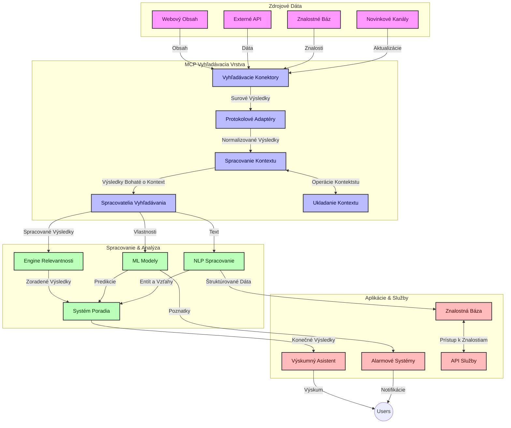
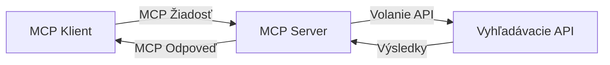
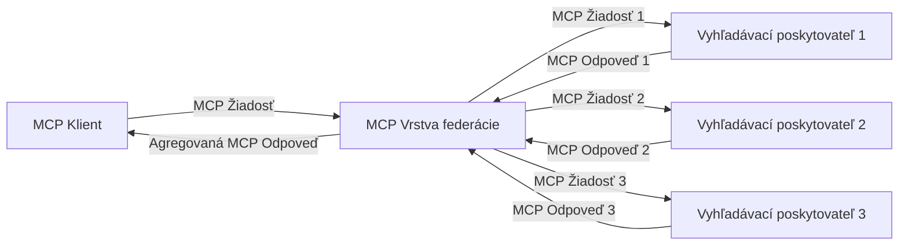
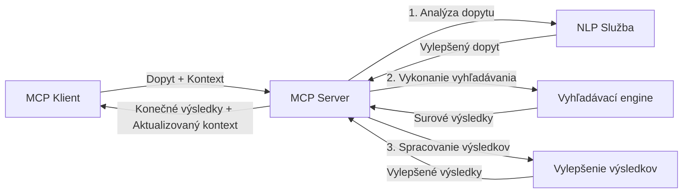

# Protokol kontextu modelu pre vyhľadávanie na webe v reálnom čase

## Prehľad

Vyhľadávanie na webe v reálnom čase sa stalo nevyhnutným v dnešnom prostredí riadenom informáciami, kde aplikácie potrebujú okamžitý prístup k aktuálnym informáciám z celého internetu, aby mohli poskytovať relevantné a načasované odpovede. Protokol kontextu modelu (MCP) predstavuje významný posun v optimalizácii týchto procesov vyhľadávania v reálnom čase, zvyšuje efektívnosť vyhľadávania, zachováva kontextuálnu integritu a zlepšuje celkový výkon systému.

Tento modul skúma, ako MCP transformuje vyhľadávanie na webe v reálnom čase tým, že poskytuje štandardizovaný prístup k správe kontextu naprieč AI modelmi, vyhľadávacími nástrojmi a aplikáciami.

### Čo sa naučíte

V tomto komplexnom návode objavíte:

- Ako MCP vytvára plynulý most medzi AI modelmi a schopnosťami vyhľadávania na webe v reálnom čase
- Architektonické vzory pre implementáciu efektívnych a škálovateľných vyhľadávacích riešení s MCP
- Techniky pre zachovanie kontextu vyhľadávania naprieč viacerými dotazmi a interakciami
- Praktické implementácie kódu v Pythone a JavaScripte pre rôzne vyhľadávacie scenáre
- Metódy na vyváženie relevantnosti, aktuálnosti a výkonu v systémoch vyhľadávania poháňaných MCP

## Úvod do vyhľadávania na webe v reálnom čase

Vyhľadávanie na webe v reálnom čase je technologický prístup, ktorý umožňuje nepretržité dotazovanie, spracovanie a analýzu webových informácií počas ich uverejňovania alebo aktualizovania, čo umožňuje systémom poskytovať čerstvé a relevantné informácie s minimálnou latenciou. Na rozdiel od tradičných vyhľadávacích systémov, ktoré pracujú s indexovanými dátami, ktoré môžu byť staré niekoľko hodín či dní, vyhľadávanie v reálnom čase spracováva živé dáta z webu a doručuje poznatky a informácie, ktoré odrážajú aktuálny stav online obsahu.

### Kľúčové koncepty vyhľadávania na webe v reálnom čase:

- **Nepretržité spracovanie dotazov**: Vyhľadávacie dotazy sa spracovávajú voči zdrojom dát, ktoré sa neustále aktualizujú
- **Priorita aktuálnosti**: Systémy sú navrhnuté tak, aby uprednostňovali čerstvé informácie
- **Vyváženie relevantnosti**: Zachovanie rovnováhy medzi relevantnosťou a aktuálnosťou
- **Škálovateľná architektúra**: Systémy musia zvládať variabilné zaťaženie dotazmi a objem dát
- **Kontekstuálne porozumenie**: Zachovanie kontextu používateľa počas vyhľadávania je kľúčové pre zmysluplné výsledky
- **Dynamické preformulovanie dotazov**: Adaptívna úprava dotazov na základe kontextu a predchádzajúcich výsledkov
- **Integrácia z viacerých zdrojov**: Kombinovanie výsledkov z viacerých vyhľadávacích poskytovateľov a webových zdrojov
- **Sémantické porozumenie**: Spracovanie dotazov a obsahu založené na význame namiesto samotných kľúčových slov
- **Rebríčkovanie v reálnom čase**: Neustále úpravy poradia výsledkov, keď sa objavujú nové informácie

### Protokol kontextu modelu a vyhľadávanie v reálnom čase

Protokol kontextu modelu (MCP) rieši niekoľko kľúčových výziev v prostrediach vyhľadávania na webe v reálnom čase:

1. **Zachovanie kontextu vyhľadávania**: MCP štandardizuje spôsob, akým sa kontext uchováva naprieč distribuovanými vyhľadávacími komponentmi, čo zabezpečuje, že AI modely a spracovateľské uzly majú prístup k relevantnej histórii dotazov a preferenciám používateľov.

2. **Efektívne riadenie dotazov**: Poskytovaním štruktúrovaných mechanizmov pre prenos kontextu MCP znižuje režijné náklady spojené s opakovaním kontextu v každej iterácii vyhľadávania.

3. **Interoperabilita**: MCP vytvára spoločný jazyk pre zdieľanie kontextu medzi rôznymi vyhľadávacími technológiami a AI modelmi, čo umožňuje flexibilnejšie a rozšíriteľnejšie architektúry.

4. **Vyhľadávaniu optimalizovaný kontext**: Implementácie MCP môžu uprednostňovať, ktoré prvky kontextu sú najrelevantnejšie pre efektívne vyhľadávanie, čím sa optimalizuje výkon aj presnosť.

5. **Adaptívne spracovanie vyhľadávania**: Vďaka správnemu manažmentu kontextu cez MCP môžu vyhľadávacie systémy dynamicky prispôsobovať spracovanie na základe meniacej sa potreby používateľa a informačného prostredia.

V moderných aplikáciách, od agregácie správ po výskumných asistentov, integrácia MCP s technológiami vyhľadávania na webe umožňuje inteligentnejšie vyhľadávanie s povedomím o kontexte, ktoré dokáže poskytovať čoraz relevantnejšie výsledky so zvyšujúcou sa interakciou používateľa.

## Učebné ciele

Na konci tejto lekcie budete schopní:

- Pochopiť základy vyhľadávania na webe v reálnom čase a jeho výzvy v moderných aplikáciách
- Vysvetliť, ako Protokol kontextu modelu (MCP) zlepšuje schopnosti vyhľadávania na webe v reálnom čase
- Implementovať MCP-založené vyhľadávacie riešenia pomocou populárnych rámcov a API
- Navrhnúť a nasadiť škálovateľné, vysokovýkonné vyhľadávacie architektúry s MCP
- Aplikovať koncepty MCP na rôzne prípady použitia vrátane sémantického vyhľadávania, výskumných asistentov a AI rozšíreného prehliadania
- Hodnotiť nové trendy a budúce inovácie v technológiách vyhľadávania založených na MCP
- Vyvíjať vyhľadávacie systémy s uvedomením kontextu, ktoré sa učia z interakcií používateľov
- Integrovať schopnosti vyhľadávania na webe do AI asistentov pomocou štandardizovaných protokolov MCP
- Vytvárať viacstupňové vyhľadávacie pipeline, ktoré postupne zlepšujú výsledky na základe kontextu
- Optimalizovať výkon vyhľadávania pri zachovaní komplexnej povedomosti o kontexte

### Definícia a význam

Vyhľadávanie na webe v reálnom čase zahŕňa nepretržité dotazovanie, načítanie a poskytovanie informácií z webu s minimálnou latenciou. Na rozdiel od tradičných vyhľadávacích nástrojov, ktoré periodicky prehľadávajú a indexujú web, cieľom vyhľadávania v reálnom čase je zobrazovať informácie hneď, ako sú dostupné, čo umožňuje okamžitý prístup k najaktuálnejšiemu obsahu.

Kľúčové charakteristiky vyhľadávania na webe v reálnom čase zahŕňajú:

- **Čerstvosť**: Uprednostňovanie nedávneho obsahu a aktualizácií
- **Nepretržité spracovanie**: Neustále sledovanie nových informácií
- **Adaptácia dotazov**: Vylepšovanie vyhľadávacích dotazov na základe kontextu a spätnej väzby
- **Okamžité poskytovanie**: Dodávanie výsledkov vyhľadávania s minimálnym oneskorením
- **Zachovanie kontextu**: Stavanie na predchádzajúcich dotazoch za účelom zvýšenia relevantnosti

### Výzvy v tradičnom vyhľadávaní na webe

Tradičné prístupy k vyhľadávaniu na webe čelia niekoľkým obmedzeniam pri použití v reálnych časových scenároch:

1. **Fragmentácia kontextu**: Ťažkosti pri udržiavaní kontextu vyhľadávania naprieč viacerými dotazmi
2. **Aktuálnosť informácií**: Problémy s prístupom k najnovším informáciám a ich uprednostnením
3. **Zložitosť integrácie**: Problémy s interoperabilitou medzi vyhľadávacími systémami a aplikáciami
4. **Problémy s latenciou**: Vyváženie komplexnosti vyhľadávania a požiadaviek na čas odozvy
5. **Ladenie relevantnosti**: Zabezpečenie presnosti a relevantnosti pri prioritizovaní aktuálnosti

## Pochopenie Protokolu kontextu modelu (MCP) pre vyhľadávanie

### Čo je MCP v kontextoch vyhľadávania?

Protokol kontextu modelu (MCP) je štandardizovaný komunikačný protokol navrhnutý na uľahčenie efektívnej interakcie medzi AI modelmi a aplikáciami. V kontexte vyhľadávania na webe v reálnom čase poskytuje MCP rámec pre:

- Zachovanie kontextu vyhľadávania počas sekvencií dotazov
- Štandardizovanie formátov vyhľadávacích dotazov a výsledkov
- Optimalizáciu prenosu parametrov vyhľadávania a výsledkov
- Zlepšenie komunikácie medzi modelmi a vyhľadávacími nástrojmi

### Kľúčové komponenty a architektúra

Architektúra MCP pre vyhľadávanie na webe v reálnom čase pozostáva z niekoľkých kľúčových komponentov:

1. **Správca kontextu dotazu**: Riadi a uchováva kontext vyhľadávania naprieč viacerými dotazmi
2. **Spracovatelia vyhľadávania**: Spracúvajú prichádzajúce vyhľadávacie požiadavky s využitím techník vedomých o kontexte
3. **Adaptéry protokolu**: Prekladajú medzi rôznymi vyhľadávacími API pri zachovaní kontextu
4. **Úložisko kontextu**: Efektívne ukladá a získava históriu vyhľadávania a preferencie
5. **Vyhľadávacie konektory**: Pripájajú sa k rôznym vyhľadávacím nástrojom a webovým API



### Ako MCP zlepšuje vyhľadávanie na webe v reálnom čase

MCP rieši tradičné výzvy vo vyhľadávaní na webe:

- **Kontextová kontinuita**: Zachovanie vzťahov medzi dotazmi počas celého vyhľadávacieho sedenia
- **Optimalizovaný prenos**: Znižovanie redundancie v parametroch vyhľadávania prostredníctvom inteligentného manažmentu kontextu
- **Štandardizované rozhrania**: Poskytovanie konzistentných API pre vyhľadávacie komponenty
- **Znížená latencia**: Minimalizovanie režijných nákladov spracovania vďaka efektívnej správe kontextu
- **Zvýšená relevantnosť**: Zlepšenie relevantnosti vyhľadávania zachovaním zámeru používateľa naprieč viacerými dotazmi

## Integrácia a implementácia

Systémy vyhľadávania na webe v reálnom čase vyžadujú starostlivý architektonický návrh a implementáciu, aby sa zachoval výkon aj integrita kontextu. Protokol kontextu modelu ponúka štandardizovaný prístup k integrácii AI modelov a vyhľadávacích technológií, čo umožňuje sofistikovanejšie, na kontext vedomé vyhľadávacie pipeline.

### Prehľad integrácie MCP v architektúrach vyhľadávania

Implementácia MCP v prostrediach vyhľadávania na webe v reálnom čase zahŕňa niekoľko kľúčových úvah:

1. **Serializácia kontextu vyhľadávania**: MCP poskytuje efektívne mechanizmy na kódovanie kontextových informácií v rámci vyhľadávacích požiadaviek, čo zabezpečuje, že podstatný kontext sprevádza dotaz počas celého spracovateľského procesu. Zahŕňa to štandardizované formáty serializácie optimalizované pre vyhľadávacie metadáta.

2. **Spracovanie vyhľadávania so stavom**: MCP umožňuje inteligentnejšie spracovanie so zachovaným stavom tým, že udržiava konzistentnú reprezentáciu kontextu naprieč vyhľadávacími iteráciami. To je obzvlášť cenné v viacstupňových vyhľadávacích pipeline, kde vylepšenie kontextu zlepšuje výsledky.

3. **Rozširovanie a vylepšovanie dotazov**: Implementácie MCP v systémoch vyhľadávania môžu umožniť sofistikované rozširovanie a vylepšovanie dotazov na základe nahromadeného kontextu, čo umožňuje čoraz relevantnejšie výsledky počas postupu vyhľadávacieho sedenia.

4. **Ukladanie a priorizácia výsledkov**: Štandardizáciou správy kontextu MCP pomáha riadiť ukladanie do vyrovnávacej pamäte a priorizáciu výsledkov, čo umožňuje komponentom prispôsobiť sa na základe meniacho sa kontextu vyhľadávania.

5. **Federácia a agregácia vyhľadávania**: MCP uľahčuje sofistikovanejšiu federáciu vyhľadávania naprieč viacerými backendmi tým, že poskytuje štruktúrované reprezentácie kontextu vyhľadávania, čo umožňuje zmysluplnejšiu agregáciu výsledkov z rôznych zdrojov.

Implementácia MCP naprieč rôznymi vyhľadávacími technológiami vytvára jednotný prístup k správe kontextu, znižuje potrebu vlastného integračného kódu a zároveň zlepšuje schopnosť systému udržiavať zmysluplný kontext s vyvíjajúcimi sa vyhľadávacími dotazmi.

### MCP v rôznych implementáciách vyhľadávania na webe

Tieto príklady nasledujú aktuálnu špecifikáciu MCP, ktorá sa zameriava na protokol založený na JSON-RPC s rôznymi transportnými mechanizmami. Kód ukazuje, ako môžete implementovať vlastné integrácie vyhľadávania pri zachovaní plnej kompatibility s protokolom MCP.


<details>
<summary>Implementácia v Pythone s generickým vyhľadávacím API</summary>

```python
import asyncio
import json
import aiohttp
from typing import Dict, Any, Optional, List
from contextlib import asynccontextmanager
from collections.abc import AsyncIterator

# Import štandardných MCP knižníc
from mcp.client.session import ClientSession
from mcp.client.streamable_http import streamablehttp_client
from mcp.types import TextContent, CreateMessageRequestParams, CreateMessageResult
from mcp.server.fastmcp import FastMCP

# Vytvorte FastMCP server pre webové vyhľadávanie
search_server = FastMCP("WebSearch")

# Trieda na spracovanie operácií webového vyhľadávania
class WebSearchHandler:
    def __init__(self, api_endpoint: str, api_key: str):
        self.api_endpoint = api_endpoint
        self.api_key = api_key
        self.session = None
        
    async def initialize(self):
        """Initialize the HTTP session"""
        self.session = aiohttp.ClientSession(
            headers={"Authorization": f"Bearer {self.api_key}"}
        )
    
    async def close(self):
        """Close the HTTP session"""
        if self.session:
            await self.session.close()
            
    async def perform_search(self, query: str, max_results: int = 5, 
                           include_domains: List[str] = None, 
                           exclude_domains: List[str] = None,
                           time_period: str = "any") -> Dict[str, Any]:
        """Perform web search using the search API"""
        # Vytvorte parametre vyhľadávania
        search_params = {
            "q": query,
            "limit": max_results,
            "time": time_period
        }
        
        if include_domains:
            search_params["site"] = ",".join(include_domains)
            
        if exclude_domains:
            search_params["exclude_site"] = ",".join(exclude_domains)
        
        # Vykonajte požiadavku na vyhľadávanie
        try:
            async with self.session.get(
                self.api_endpoint,
                params=search_params
            ) as response:
                if response.status != 200:
                    error_text = await response.text()
                    raise Exception(f"Search API error: {response.status} - {error_text}")
                
                search_data = await response.json()
                
                # Preveďte odpoveď špecifickú pre API do štandardného formátu
                results = []
                for item in search_data.get("results", []):
                    results.append({
                        "title": item.get("title", ""),
                        "url": item.get("url", ""),
                        "snippet": item.get("snippet", ""),
                        "date": item.get("published_date", ""),
                        "source": item.get("source", "")
                    })
                
                return {
                    "query": query,
                    "totalResults": len(results),
                    "results": results
                }
        except Exception as e:
            print(f"Search API request error: {e}")
            raise

# Inicializujte spracovateľa vyhľadávania
search_handler = WebSearchHandler(
    api_endpoint="https://api.search-service.example/search",
    api_key="your-api-key-here"
)

# Nastavte životný cyklus na správu spracovateľa vyhľadávania
@asyncio.asynccontextmanager
async def app_lifespan(server: FastMCP):
    """Manage application lifecycle"""
    await search_handler.initialize()
    try:
        yield {"search_handler": search_handler}
    finally:
        await search_handler.close()

# Nastavte životný cyklus servera
search_server = FastMCP("WebSearch", lifespan=app_lifespan)

# Zaregistrujte nástroj na webové vyhľadávanie
@search_server.tool()
async def web_search(query: str, max_results: int = 5, 
                   include_domains: List[str] = None,
                   exclude_domains: List[str] = None,
                   time_period: str = "any") -> Dict[str, Any]:
    """
    Search the web for information
    
    Args:
        query: The search query
        max_results: Maximum number of results to return (default: 5)
        include_domains: List of domains to include in search results
        exclude_domains: List of domains to exclude from search results
        time_period: Time period for results ("day", "week", "month", "any")
        
    Returns:
        Dictionary containing search results
    """
    ctx = search_server.get_context()
    search_handler = ctx.request_context.lifespan_context["search_handler"]
    
    results = await search_handler.perform_search(
        query=query,
        max_results=max_results,
        include_domains=include_domains,
        exclude_domains=exclude_domains,
        time_period=time_period
    )
    
    return results

# Príklad použitia klienta
async def client_example():
    # Pripojte sa k vyhľadávaciemu serveru pomocou Streamable HTTP transportu
    async with streamablehttp_client("http://localhost:8000/mcp") as (read, write, _):
        async with ClientSession(read, write) as session:
            # Inicializujte spojenie
            await session.initialize()
            
            # Zavolajte nástroj web_search
            search_results = await session.call_tool(
                "web_search", 
                {
                    "query": "latest developments in AI and Model Context Protocol",
                    "max_results": 5,
                    "time_period": "day",
                    "include_domains": ["github.com", "microsoft.com"]
                }
            )
            
            print(f"Search results: {search_results}")

# Príklad spustenia servera
if __name__ == "__main__":
    # Spustite server so Streamable HTTP transportom
    search_server.run(transport="streamable-http")
```
</details> 

<details>
<summary>Implementácia v JavaScripte s vyhľadávaním v prehliadači</summary>


```javascript
// Implementácia MCP servera pre webové vyhľadávanie
import { McpServer, ResourceTemplate } from '@modelcontextprotocol/sdk/server/mcp.js';
import { StreamableHTTPServerTransport } from '@modelcontextprotocol/sdk/server/streamableHttp.js';
import { z } from 'zod';

// Vytvoriť MCP server pre webové vyhľadávanie
const searchServer = new McpServer({
    name: "BrowserSearch",
    description: "A server that provides web search capabilities"
});

// Trieda služby vyhľadávania
class SearchService {
    constructor(searchApiUrl, apiKey) {
        this.searchApiUrl = searchApiUrl;
        this.apiKey = apiKey;
    }

    async performSearch(parameters) {
        const {
            query = '',
            maxResults = 5,
            includeDomains = [],
            excludeDomains = [],
            timePeriod = 'any'
        } = parameters;
        
        // Vytvoriť URL vyhľadávania s parametrami
        const url = new URL(this.searchApiUrl);
        url.searchParams.append('q', query);
        url.searchParams.append('limit', maxResults);
        url.searchParams.append('time', timePeriod);
        
        if (includeDomains.length > 0) {
            url.searchParams.append('site', includeDomains.join(','));
        }
        
        if (excludeDomains.length > 0) {
            url.searchParams.append('exclude_site', excludeDomains.join(','));
        }
        
        try {
            const response = await fetch(url.toString(), {
                method: 'GET',
                headers: {
                    'Authorization': `Bearer ${this.apiKey}`,
                    'Content-Type': 'application/json'
                }
            });
            
            if (!response.ok) {
                const errorText = await response.text();
                throw new Error(`Search API error: ${response.status} - ${errorText}`);
            }
            
            const searchData = await response.json();
            
            // Pretransformovať odpoveď špecifickú pre API do štandardného formátu
            const results = searchData.results?.map(item => ({
                title: item.title || '',
                url: item.url || '',
                snippet: item.snippet || '',
                date: item.published_date || '',
                source: item.source || ''
            })) || [];
            
            return {
                query,
                totalResults: results.length,
                results
            };
        } catch (error) {
            console.error('Search API request error:', error);
            throw error;
        }
    }
}

// Inicializovať službu vyhľadávania
const searchService = new SearchService(
    'https://api.search-service.example/search',
    'your-api-key-here'
);

// Nastaviť poskytovateľa kontextu pre server
searchServer.setContextProvider(() => {
    return {
        searchService
    };
});

// Zaregistrovať nástroj webového vyhľadávania
searchServer.tool({
    name: 'web_search',
    description: 'Search the web for information',
    parameters: {
        type: 'object',
        properties: {
            query: {
                type: 'string',
                description: 'The search query'
            },
            maxResults: {
                type: 'integer',
                description: 'Maximum number of results to return',
                default: 5
            },
            includeDomains: {
                type: 'array',
                items: { type: 'string' },
                description: 'List of domains to include in search results'
            },
            excludeDomains: {
                type: 'array',
                items: { type: 'string' },
                description: 'List of domains to exclude from search results'
            },
            timePeriod: {
                type: 'string',
                description: 'Time period for results',
                enum: ['day', 'week', 'month', 'any'],
                default: 'any'
            }
        },
        required: ['query']
    },
    handler: async (params, context) => {
        const { searchService } = context;
        return await searchService.performSearch(params);
    }
});

// Príklad klientskeho kódu na pripojenie k vyhľadávaciemu serveru
import { Client } from '@modelcontextprotocol/sdk/client/index.js';
import { StreamableHTTPClientTransport } from '@modelcontextprotocol/sdk/client/streamableHttp.js';

async function connectToSearchServer() {
    // Pripojiť sa k vyhľadávaciemu serveru
    const transport = new StreamableHTTPClientTransport(
        new URL('http://localhost:8000/mcp')
    );
    
    const client = new Client({
        name: 'search-client',
        version: '1.0.0'
    });
    
    await client.connect(transport);
    
    // Spustiť nástroj vyhľadávania
    const searchResults = await client.callTool({
        name: 'web_search',
        arguments: {
            query: 'Model Context Protocol implementation examples',
            maxResults: 10,
            timePeriod: 'week',
            includeDomains: ['github.com', 'docs.microsoft.com']
        }
    });
    
    console.log('Search results:', searchResults);
    
    // Upratanie
    await client.disconnect();
}

// Spustiť server
const transport = new StreamableHTTPServerTransport();
await searchServer.connect(transport);
console.log('Search server running at http://localhost:8000/mcp');

// V samostatnom procese alebo po spustení servera
// connectToSearchServer().catch(console.error);
```
</details> 


## Zrieknutie sa zodpovednosti za príklady kódu

> **Dôležitá poznámka**: Nižšie uvedené príklady kódu demonštrujú integráciu Protokolu kontextu modelu (MCP) s funkciou vyhľadávania na webe. Hoci nasledujú vzory a štruktúry oficiálnych SDK MCP, boli zjednodušené pre vzdelávacie účely.
> 
> Tieto príklady ukazujú:
> 
> 1. **Implementáciu v Pythone**: Implementáciu servera FastMCP, ktorý poskytuje nástroj na vyhľadávanie na webe a pripája sa k externému vyhľadávaciemu API. Tento príklad demonštruje správu životného cyklu, správu kontextu a implementáciu nástroja podľa vzorov [oficiálneho python SDK MCP](https://github.com/modelcontextprotocol/python-sdk). Server používa odporúčaný transport Streamable HTTP, ktorý nahradil starší SSE transport pre produkčné nasadenia.
> 
> 2. **Implementáciu v JavaScripte**: Implementáciu v TypeScripte/JavaScripte podľa vzoru FastMCP z [oficiálneho TypeScript SDK MCP](https://github.com/modelcontextprotocol/typescript-sdk) na vytvorenie vyhľadávacieho servera so správnymi definíciami nástrojov a klientskymi pripojeniami. Nasleduje najnovšie odporúčané vzory pre správu sedenia a zachovanie kontextu.
> 
> Tieto príklady by vyžadovali dodatočnú správu chýb, autentifikáciu a špecifický integračný kód API pre použitie v produkcii. Zobrazené API koncové body (`https://api.search-service.example/search`) sú zástupné a museli by byť nahradené skutočnými koncovými bodmi vyhľadávacích služieb.
> 
> Pre kompletné implementačné detaily a najaktuálnejšie prístupy,
> pozrite si [oficiálnu špecifikáciu MCP](https://modelcontextprotocol.io/specification/2026-07-28/)
> a dokumentáciu SDK.

## Základné koncepty

### Rámec Protokolu kontextu modelu (MCP)

Na svojom základe poskytuje Protokol kontextu modelu štandardizovaný spôsob, ako si AI modely, aplikácie a služby vymieňajú kontext. V rámci vyhľadávania na webe v reálnom čase je tento rámec zásadný pre vytváranie koherentných, viackrokových vyhľadávacích skúseností. Kľúčové komponenty zahŕňajú:

1. **Kliens-srverová architektúra**: MCP ustanovuje jasné oddelenie medzi vyhľadávacími klientmi (žiadateľmi) a vyhľadávacími servermi (poskytovateľmi), čo umožňuje flexibilné modely nasadenia.

2. **Komunikácia JSON-RPC**: Protokol používa JSON-RPC na výmenu správ, čím je kompatibilný s webovými technológiami a ľahko implementovateľný na rôznych platformách.

3. **Správa kontextu**: MCP definuje štruktúrované metódy na udržiavanie, aktualizáciu a využívanie kontextu vyhľadávania naprieč viacerými interakciami.

4. **Definície nástrojov**: Vyhľadávacie schopnosti sú vystavené ako štandardizované nástroje s dobre definovanými parametrami a návratovými hodnotami.

5. **Podpora streamovania**: Protokol podporuje streamovanie výsledkov, čo je nevyhnutné pre vyhľadávanie v reálnom čase, kde môžu výsledky prichádzať postupne.

### Vzory integrácie vyhľadávania na webe

Pri integrácii MCP s vyhľadávaním na webe sa objavuje niekoľko vzorov:

#### 1. Priama integrácia poskytovateľa vyhľadávania



V tomto vzore MCP server priamo komunikuje s jedným alebo viacerými vyhľadávacími API, prekladá požiadavky MCP na API špecifické volania a formátuje výsledky ako odpovede MCP.

#### 2. Federované vyhľadávanie so zachovaním kontextu



Tento vzor distribuuje vyhľadávacie dotazy naprieč viacerými MCP-kompatibilnými vyhľadávacími poskytovateľmi, z ktorých každý sa môže špecializovať na rôzne typy obsahu alebo vyhľadávacích schopností, pričom zachováva jednotný kontext.

#### 3. Vyhľadávací reťazec s vylepšeným kontextom



V tomto vzore je vyhľadávací proces rozdelený do viacerých fáz, kde sa kontext obohacuje v každom kroku, čo vedie k postupne relevantnejším výsledkom.

### Komponenty vyhľadávacieho kontextu

V MCP-založenom vyhľadávaní na webe kontext zvyčajne zahŕňa:

- **Históriu dotazov**: Predchádzajúce vyhľadávacie dotazy v rámci sedenia
- **Preferencie používateľa**: Jazyk, región, nastavenia bezpečného vyhľadávania
- **Históriu interakcií**: Ktoré výsledky boli kliknuté, čas strávený nad výsledkami
- **Parametre vyhľadávania**: Filtre, poradové kritériá a iné modifikátory vyhľadávania
- **Odborné znalosti**: Kontext týkajúci sa konkrétnej témy relevantnej pre vyhľadávanie
- **Časový kontext**: Faktory relevantné na základe času
- **Preferencie zdrojov**: Dôveryhodné alebo preferované informačné zdroje

## Prípady použitia a aplikácie

### Výskum a zhromažďovanie informácií

MCP zlepšuje pracovné postupy výskumu tým, že:

- Zachováva kontext výskumu naprieč vyhľadávacími sedenami
- Umožňuje sofistikovanejšie a kontextuálne relevantné dotazy
- Podporuje federáciu vyhľadávania z viacerých zdrojov
- Uľahčuje extrakciu poznatkov z výsledkov vyhľadávania

### Monitorovanie správ a trendov v reálnom čase

Vyhľadávanie poháňané MCP ponúka výhody pre monitorovanie správ:

- Objavovanie nových správ takmer v reálnom čase
- Kontextové filtrovanie relevantných informácií
- Sledovanie tém a entít naprieč viacerými zdrojmi
- Personalizované upozornenia na správy založené na kontexte používateľa

### Prehliadanie a výskum rozšírený AI

MCP vytvára nové možnosti pre prehliadanie rozšírené AI:

- Kontextové návrhy vyhľadávania založené na aktuálnej aktivite v prehliadači
- Plynulú integráciu vyhľadávania na webe s asistentmi poháňanými veľkými jazykovými modelmi (LLM)
- Viackrokové vylepšovanie vyhľadávania pri zachovaní kontextu
- Vylepšené overovanie faktov a kontrola informácií

## Budúce trendy a inovácie

### Vývoj MCP vo vyhľadávaní na webe

Do budúcnosti očakávame, že MCP sa bude vyvíjať s cieľom riešiť:


- **Multimodálne vyhľadávanie**: Integrácia vyhľadávania textu, obrázkov, zvuku a videa so zachovaným kontextom
- **Decentralizované vyhľadávanie**: Podpora distribuovaných a federatívnych vyhľadávacích ekosystémov
- **Súkromie pri vyhľadávaní**: Kontextovo orientované mechanizmy vyhľadávania zachovávajúce súkromie
- **Pochopenie dopytu**: Hlboká sémantická syntaktická analýza dopytov v prirodzenom jazyku

### Potenciálne technologické pokroky

Nové technológie, ktoré budú formovať budúcnosť MCP vyhľadávania:

1. **Nervové vyhľadávacie architektúry**: Vyhľadávacie systémy založené na vkladaných reprezentáciách optimalizované pre MCP
2. **Personalizovaný kontext vyhľadávania**: Učenie sa individuálnych vzorcov vyhľadávania používateľa v priebehu času
3. **Integrácia znalostných grafov**: Kontextové vyhľadávanie obohatené doménovo špecifickými znalostnými grafmi
4. **Krížový multimodálny kontext**: Zachovanie kontextu naprieč rôznymi režimami vyhľadávania

## Praktické cvičenia

### Cvičenie 1: Nastavenie základného MCP vyhľadávacieho reťazca

V tomto cvičení sa naučíte:
- Konfigurovať základné MCP vyhľadávacie prostredie
- Implementovať spracovateľov kontextu pre webové vyhľadávanie
- Testovať a overovať zachovanie kontextu naprieč iteráciami vyhľadávania

### Cvičenie 2: Vytváranie výskumného asistenta pomocou MCP vyhľadávania

Vytvorte kompletnú aplikáciu, ktorá:
- Spracováva výskumné otázky v prirodzenom jazyku
- Vykonáva kontextovo vedomé webové vyhľadávania
- Synthesizuje informácie z viacerých zdrojov
- Prezentuje usporiadané výskumné zistenia

### Cvičenie 3: Implementácia federácie vyhľadávania z viacerých zdrojov pomocou MCP

Pokročilé cvičenie zahŕňajúce:
- Kontextovo orientované odosielanie dopytov do viacerých vyhľadávacích nástrojov
- Zoradenie a agregáciu výsledkov
- Kontextovú deduplikáciu výsledkov vyhľadávania
- Spracovanie metadát špecifických pre zdroj

## Dodatočné zdroje

- [Špecifikácia Model Context Protocol](https://modelcontextprotocol.io/specification/2026-07-28/) - Oficiálna špecifikácia MCP a podrobná dokumentácia protokolu
- [Dokumentácia Model Context Protocol](https://modelcontextprotocol.io/) - Podrobné návody a implementačné príručky
- [MCP Python SDK](https://github.com/modelcontextprotocol/python-sdk) - Oficiálna Python implementácia protokolu MCP
- [MCP TypeScript SDK](https://github.com/modelcontextprotocol/typescript-sdk) - Oficiálna TypeScript implementácia protokolu MCP
- [MCP Referenčné servery](https://github.com/modelcontextprotocol/servers) - Referenčné implementácie MCP serverov
- [Bing Web Search API Dokumentácia](https://learn.microsoft.com/en-us/bing/search-apis/bing-web-search/overview) - Microsoft API pre webové vyhľadávanie
- [Google Custom Search JSON API](https://developers.google.com/custom-search/v1/overview) - Programovateľný vyhľadávací nástroj Google
- [SerpAPI Dokumentácia](https://serpapi.com/search-api) - API výsledkov stránok vyhľadávačov
- [Meilisearch Dokumentácia](https://www.meilisearch.com/docs) - Open-source vyhľadávací engine
- [Elasticsearch Dokumentácia](https://www.elastic.co/guide/index.html) - Distribuovaný vyhľadávací a analytický nástroj
- [LangChain Dokumentácia](https://python.langchain.com/docs/get_started/introduction) - Vytváranie aplikácií s LLM

## Výsledky učenia

Po ukončení tohto modulu budete schopní:

- Pochopiť základy vyhľadávania na webe v reálnom čase a jeho výzvy
- Vysvetliť, ako Model Context Protocol (MCP) vylepšuje schopnosti vyhľadávania na webe v reálnom čase
- Implementovať vyhľadávacie riešenia založené na MCP pomocou populárnych frameworkov a API
- Navrhovať a nasadzovať škálovateľné, vysoko výkonné vyhľadávacie architektúry s MCP
- Aplikovať koncepty MCP na rôzne prípady použitia vrátane sémantického vyhľadávania, výskumného asistenta a prehliadania s podporou AI
- Hodnotiť vznikajúce trendy a budúce inovácie v technológiách vyhľadávania založeného na MCP


### Úvahy o dôvere a bezpečnosti

Pri implementácii MCP založených webových vyhľadávacích riešení si zapamätajte tieto dôležité princípy zo špecifikácie MCP:

1. **Súhlas a kontrola používateľa**: Používatelia musia výslovne súhlasiť a rozumieť všetkým prístupom k údajom a operáciám. Toto je obzvlášť dôležité pre implementácie webového vyhľadávania, ktoré môžu pristupovať k externým údajovým zdrojom.

2. **Ochrana súkromia údajov**: Zaistite správne spracovanie vyhľadávacích dotazov a výsledkov, najmä ak môžu obsahovať citlivé informácie. Implementujte vhodné kontrolné mechanizmy prístupu na ochranu používateľských údajov.

3. **Bezpečnosť nástrojov**: Implementujte správne autorizácie a validácie vyhľadávacích nástrojov, pretože predstavujú potenciálne bezpečnostné riziká prostredníctvom spustenia ľubovoľného kódu. Popisy správania nástrojov by sa mali považovať za nedôveryhodné, pokiaľ nepochádzajú z dôveryhodného servera.

4. **Jasná dokumentácia**: Poskytnite jasnú dokumentáciu o schopnostiach, obmedzeniach a bezpečnostných úvahách vašej implementácie vyhľadávania založeného na MCP v súlade s implementačnými usmerneniami zo špecifikácie MCP.

5. **Robustné toky súhlasu**: Vytvorte robustné toky súhlasu a autorizácie, ktoré jasne vysvetľujú, čo každý nástroj robí pred jeho povolením, najmä pre nástroje, ktoré interagujú s externými webovými zdrojmi.

Kompletné informácie o bezpečnostných a dôveryhodných úvahách MCP nájdete v
[oficiálnej dokumentácii](https://modelcontextprotocol.io/specification/2026-07-28/basic/security_best_practices).

## Čo nasleduje

- [5.12 Entra ID autentifikácia pre Model Context Protocol servery](../mcp-security-entra/README.md)

---

<!-- CO-OP TRANSLATOR DISCLAIMER START -->
**Vyhlásenie o zodpovednosti**:
Tento dokument bol preložený pomocou AI prekladateľskej služby [Co-op Translator](https://github.com/Azure/co-op-translator). Hoci sa snažíme o presnosť, vezmite prosím na vedomie, že automatické preklady môžu obsahovať chyby alebo nepresnosti. Pôvodný dokument v jeho natívnom jazyku by mal byť považovaný za autoritatívny zdroj. Pre kritické informácie sa odporúča profesionálny ľudský preklad. Nie sme zodpovední za žiadne nedorozumenia alebo nesprávne interpretácie vyplývajúce z použitia tohto prekladu.
<!-- CO-OP TRANSLATOR DISCLAIMER END -->