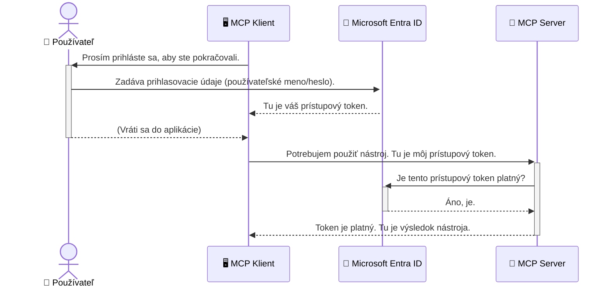

# Zaistenie AI pracovných tokov: Overovanie Entra ID pre servery Model Context Protocol

> [!NOTE]
> Vzdialený server v tejto lekcii chráni staršie koncové body `/sse` a `/message`
> a cieľuje MCP `2025-11-25`. Dodržiavajte jeho praktiky overovania identity a tokenov,
> ale pre nové implementácie používajte transport Streamable HTTP kompatibilný s `2026-07-28`.


## Úvod
Zaistenie vášho servera Model Context Protocol (MCP) je rovnako dôležité ako zamknutie hlavného vchodu do vášho domu. Necháte váš MCP server otvorený, vystavujete svoje nástroje a dáta neautorizovanému prístupu, čo môže viesť k narušeniu bezpečnosti. Microsoft Entra ID poskytuje robustné cloudové riešenie pre správu identity a prístupu, ktoré zabezpečuje, že iba oprávnení používatelia a aplikácie môžu komunikovať s vaším MCP serverom. V tejto časti sa naučíte, ako chrániť svoje AI pracovné toky pomocou overovania Entra ID.

## Ciele učenia
Na konci tejto časti budete schopní:

- Pochopiť dôležitosť zabezpečenia MCP serverov.
- Vysvetliť základy Microsoft Entra ID a OAuth 2.0 overovania.
- Rozpoznať rozdiel medzi verejnými a dôvernými klientmi.
- Implementovať overovanie Entra ID v lokálnych (verejný klient) aj vzdialených (dôverný klient) scénach MCP serverov.
- Použiť bezpečnostné najlepšie praktiky pri vývoji AI pracovných tokov.

## Bezpečnosť a MCP

Rovnako ako by ste nenechali hlavné dvere domu odomknuté, nemali by ste nechať váš MCP server otvorený na prístup komukoľvek. Zaistenie vašich AI pracovných tokov je nevyhnutné pre budovanie robustných, dôveryhodných a bezpečných aplikácií. Táto kapitola vás zoznámi s použitím Microsoft Entra ID na zabezpečenie vašich MCP serverov, čím zabezpečí, že iba autorizovaní používatelia a aplikácie môžu pracovať s vašimi nástrojmi a dátami.

## Prečo je bezpečnosť dôležitá pre MCP servery

Predstavte si, že váš MCP server má nástroj, ktorý môže posielať e-maily alebo pristupovať k databáze zákazníkov. Nezaistený server by znamenal, že ktokoľvek by mohol používať tento nástroj, čo vedie k neautorizovanému prístupu k údajom, spamu alebo iným škodlivým aktivitám.

Implementáciou overovania zabezpečíte, že každá požiadavka na server je overená, čím sa potvrdí identita používateľa alebo aplikácie, ktorá požiadavku posiela. Toto je prvý a najdôležitejší krok v zabezpečení vašich AI pracovných tokov.

## Úvod do Microsoft Entra ID

[**Microsoft Entra ID**](https://adoption.microsoft.com/microsoft-security/entra/) je cloudová služba na správu identity a prístupu. Predstavte si ju ako univerzálneho bezpečnostného strážcu pre vaše aplikácie. Rieši zložitý proces overovania identít používateľov (autentifikácia) a určovania, čo môžu robiť (autorizácia).

Použitím Entra ID môžete:

- Umožniť bezpečné prihlásenie používateľov.
- Chrániť API a služby.
- Centrálne spravovať prístupové politiky.

Pre servery MCP poskytuje Entra ID robustné a všeobecne dôveryhodné riešenie na riadenie toho, kto môže pristupovať k schopnostiam vášho servera.

---

## Pochopenie mágie: Ako funguje overovanie Entra ID

Entra ID používa otvorené štandardy ako **OAuth 2.0** na riešenie overovania. Hoci detaily môžu byť zložité, základný koncept je jednoduchý a dá sa pochopiť pomocou analógie.

### Jemný úvod do OAuth 2.0: Valetový kľúč

Predstavte si OAuth 2.0 ako valet službu pre vaše auto. Keď prídete do reštaurácie, nedáte valetovi svoj generálny kľúč. Namiesto toho mu poskytnete **valetový kľúč** s obmedzenými právami – môže naštartovať auto a zamknúť dvere, ale nemôže otvoriť kufor ani odkladací box.

V tejto analógii:

- **Vy** ste **Používateľ**.
- **Vaše auto** je **MCP server** s jeho cennými nástrojmi a dátami.
- **Valet** je **Microsoft Entra ID**.
- **Parkovací úradník** je **MCP klient** (aplikácia, ktorá sa snaží pristupovať k serveru).
- **Valetový kľúč** je **prístupový token**.

Prístupový token je bezpečný textový reťazec, ktorý MCP klient dostane od Entra ID po vašom prihlásení. Klient potom tento token predkladá serveru MCP s každou požiadavkou. Server môže token overiť, aby zabezpečil, že požiadavka je legitímna a že klient má potrebné oprávnenia, a to všetko bez toho, aby musel pracovať s vašimi skutočnými prihlasovacími údajmi (napríklad heslom).

### Priebeh overovania

Takto proces funguje v praxi:



### Predstavenie Microsoft Authentication Library (MSAL)

Predtým než sa pustíme do kódu, je dôležité predstaviť kľúčovú súčasť, ktorú uvidíte v príkladoch: **Microsoft Authentication Library (MSAL)**.

MSAL je knižnica vyvinutá Microsoftom, ktorá výrazne uľahčuje vývojárom prácu s autentifikáciou. Namiesto toho, aby ste písali všetok zložitý kód na správu bezpečnostných tokenov, prihlasovaní a obnove relácií, MSAL prevezme túto záťaž.

Použitie knižnice ako MSAL je vysoko odporúčané, pretože:

- **Je bezpečná:** Implementuje štandardné protokoly a bezpečnostné praktiky, čím znižuje riziko zraniteľností vo vašom kóde.
- **Zjednodušuje vývoj:** Odbúrava zložitosť protokolov OAuth 2.0 a OpenID Connect, čo vám umožňuje pridať robustné overovanie do vašej aplikácie len niekoľkými riadkami kódu.
- **Je udržiavaná:** Microsoft aktívne udržiava a aktualizuje MSAL, aby riešil nové bezpečnostné hrozby a zmeny platforiem.

MSAL podporuje široké spektrum jazykov a aplikačných rámcov, vrátane .NET, JavaScript/TypeScript, Python, Java, Go a mobilné platformy ako iOS a Android. To znamená, že môžete používať rovnaké konzistentné vzory overovania v celom vašom technologickom stacku.

Pre viac informácií o MSAL si môžete pozrieť oficiálnu [dokumentáciu prehľadu MSAL](https://learn.microsoft.com/entra/identity-platform/msal-overview).

---

## Zaistenie vášho MCP servera pomocou Entra ID: krok za krokom

Teraz si prejdeme, ako zabezpečiť lokálny MCP server (ktorý komunikuje cez `stdio`) pomocou Entra ID. Tento príklad používa **verejného klienta**, ktorý je vhodný pre aplikácie spustené na používateľovom počítači, ako je desktopová aplikácia alebo lokálny vývojový server.

### Scenár 1: Zaistenie lokálneho MCP servera (s verejným klientom)

V tomto scenári sa pozrieme na MCP server bežiaci lokálne, ktorý komunikuje cez `stdio` a používa Entra ID na overenie používateľa pred povolením prístupu k jeho nástrojom. Server bude mať jeden nástroj, ktorý načíta profilové informácie používateľa z Microsoft Graph API.

#### 1. Nastavenie aplikácie v Entra ID

Pred písaním kódu musíte zaregistrovať svoju aplikáciu v Microsoft Entra ID. Toto umožňuje Entra ID vedieť o vašej aplikácii a udeľuje jej povolenie používať autentifikačné služby.

1. Prejdite na **[Microsoft Entra portál](https://entra.microsoft.com/)**.
2. Choďte do **App registrations** a kliknite na **New registration**.
3. Pomenujte svoju aplikáciu (napr. "Môj lokálny MCP server").
4. Pre **Supported account types** vyberte **Accounts in this organizational directory only**.
5. Pre tento príklad môžete nechať **Redirect URI** prázdne.
6. Kliknite na **Register**.

Po registrácii si poznamenajte **Application (client) ID** a **Directory (tenant) ID**. Budete ich potrebovať v kóde.

#### 2. Kód: rozbor

Pozrime sa na kľúčové časti kódu, ktoré riešia overovanie. Kompletný kód tohto príkladu nájdete v priečinku [Entra ID - Local - WAM](https://github.com/Azure-Samples/mcp-auth-servers/tree/main/src/entra-id-local-wam) v repozitári [mcp-auth-servers GitHub](https://github.com/Azure-Samples/mcp-auth-servers).

**`AuthenticationService.cs`**

Táto trieda je zodpovedná za interakciu s Entra ID.

- **`CreateAsync`**: Táto metóda inicializuje `PublicClientApplication` z MSAL (Microsoft Authentication Library). Je nakonfigurovaná s `clientId` a `tenantId` vašej aplikácie.
- **`WithBroker`**: Táto možnosť povoľuje použitie brokera (ako Windows Web Account Manager), ktorý poskytuje bezpečnejší a plynulejší single sign-on zážitok.
- **`AcquireTokenAsync`**: Toto je hlavná metóda. Najskôr sa pokúsi získať token ticho (t.j. používateľ sa nemusí znovu prihlasovať, ak už má platnú reláciu). Ak sa token ticho získať nedá, vyzve používateľa na interaktívne prihlásenie.

```csharp
// Simplified for clarity
public static async Task<AuthenticationService> CreateAsync(ILogger<AuthenticationService> logger)
{
    var msalClient = PublicClientApplicationBuilder
        .Create(_clientId) // Your Application (client) ID
        .WithAuthority(AadAuthorityAudience.AzureAdMyOrg)
        .WithTenantId(_tenantId) // Your Directory (tenant) ID
        .WithBroker(new BrokerOptions(BrokerOptions.OperatingSystems.Windows))
        .Build();

    // ... cache registration ...

    return new AuthenticationService(logger, msalClient);
}

public async Task<string> AcquireTokenAsync()
{
    try
    {
        // Try silent authentication first
        var accounts = await _msalClient.GetAccountsAsync();
        var account = accounts.FirstOrDefault();

        AuthenticationResult? result = null;

        if (account != null)
        {
            result = await _msalClient.AcquireTokenSilent(_scopes, account).ExecuteAsync();
        }
        else
        {
            // If no account, or silent fails, go interactive
            result = await _msalClient.AcquireTokenInteractive(_scopes).ExecuteAsync();
        }

        return result.AccessToken;
    }
    catch (Exception ex)
    {
        _logger.LogError(ex, "An error occurred while acquiring the token.");
        throw; // Optionally rethrow the exception for higher-level handling
    }
}
```

**`Program.cs`**

Tu sa nastavuje MCP server a integruje autentifikačná služba.

- **`AddSingleton<AuthenticationService>`**: Táto registruje `AuthenticationService` v kontajneri závislostí, aby ju mohli používať ostatné časti aplikácie (napríklad náš nástroj).
- **`GetUserDetailsFromGraph` nástroj**: Tento nástroj vyžaduje inštanciu `AuthenticationService`. Pred jeho použitím volá `authService.AcquireTokenAsync()` na získanie platného prístupového tokenu. Ak je overenie úspešné, používa token na volanie Microsoft Graph API a načítanie detailov používateľa.

```csharp
// Simplified for clarity
[McpServerTool(Name = "GetUserDetailsFromGraph")]
public static async Task<string> GetUserDetailsFromGraph(
    AuthenticationService authService)
{
    try
    {
        // This will trigger the authentication flow
        var accessToken = await authService.AcquireTokenAsync();

        // Use the token to create a GraphServiceClient
        var graphClient = new GraphServiceClient(
            new BaseBearerTokenAuthenticationProvider(new TokenProvider(authService)));

        var user = await graphClient.Me.GetAsync();

        return System.Text.Json.JsonSerializer.Serialize(user);
    }
    catch (Exception ex)
    {
        return $"Error: {ex.Message}";
    }
}
```

#### 3. Ako to všetko funguje spolu

1. Keď sa MCP klient pokúsi použiť nástroj `GetUserDetailsFromGraph`, nástroj najskôr zavolá `AcquireTokenAsync`.
2. `AcquireTokenAsync` spustí MSAL knižnicu, aby skontrolovala platný token.
3. Ak žiadny token nenájde, MSAL cez brokera vyzve používateľa na prihlásenie pomocou jeho Entra ID účtu.
4. Po prihlásení používateľa Entra ID vydá prístupový token.
5. Nástroj prijme token a používa ho na bezpečné volanie Microsoft Graph API.
6. Detaily používateľa sa vrátia MCP klientovi.

Tento proces zaisťuje, že iba autentifikovaní používatelia môžu používať nástroj, čím účinne zabezpečuje váš lokálny MCP server.

### Scenár 2: Zaistenie vzdialeného MCP servera (s dôverným klientom)

Ak váš MCP server beží na vzdialenom počítači (napr. cloud server) a komunikuje cez protokol ako HTTP Streaming, bezpečnostné požiadavky sú odlišné. V tomto prípade by ste mali použiť **dôverného klienta** a **Authorization Code Flow**. Tento spôsob je bezpečnejší, pretože tajomstvá aplikácie nie sú nikdy vystavené prehliadaču.

Tento príklad používa MCP server založený na TypeScripte, ktorý používa Express.js na spracovanie HTTP požiadaviek.

#### 1. Nastavenie aplikácie v Entra ID

Nastavenie v Entra ID je podobné ako u verejného klienta, ale s jedným kľúčovým rozdielom: potrebujete vytvoriť **client secret**.

1. Prejdite na **[Microsoft Entra portál](https://entra.microsoft.com/)**.
2. Vo vašej registrácii aplikácie choďte na záložku **Certificates & secrets**.
3. Kliknite na **New client secret**, zadajte popis a kliknite na **Add**.
4. **Dôležité:** Hodnotu tajomstva si ihneď skopírujte. Už ju nebudete môcť znova vidieť.
5. Tiež musíte nakonfigurovať **Redirect URI**. Choďte na záložku **Authentication**, kliknite na **Add a platform**, vyberte **Web** a zadajte URI pre presmerovanie vašej aplikácie (napr. `http://localhost:3001/auth/callback`).

> **⚠️ Dôležité bezpečnostné upozornenie:** Pre produkčné aplikácie Microsoft silne odporúča používať **authentifikáciu bez tajomstiev** ako **Managed Identity** alebo **Workload Identity Federation** namiesto client secrets. Client secrets predstavujú bezpečnostné riziká, keďže môžu byť odhalené alebo kompromitované. Managed identity poskytujú bezpečnejší prístup eliminovaním potreby ukladať prihlasovacie údaje vo vašom kóde alebo konfigurácii.
>
> Pre viac informácií o managed identities a ich implementácii si pozrite [Prehľad Managed Identities pre Azure zdroje](https://learn.microsoft.com/entra/identity/managed-identities-azure-resources/overview).

#### 2. Kód: rozbor

Tento príklad používa prístup založený na reláciách. Keď sa používateľ autentifikuje, server uloží prístupový token a refresh token do relácie a poskytne používateľovi token relácie. Tento token relácie sa potom používa pre následné požiadavky. Kompletný kód tohto príkladu nájdete v priečinku [Entra ID - Confidential client](https://github.com/Azure-Samples/mcp-auth-servers/tree/main/src/entra-id-cca-session) v repozitári [mcp-auth-servers GitHub](https://github.com/Azure-Samples/mcp-auth-servers).

**`Server.ts`**

Tento súbor nastavuje Express server a transportnú vrstvu MCP.

- **`requireBearerAuth`**: Toto je middleware, ktorý chráni koncové body `/sse` a `/message`. Kontroluje platný bearer token v hlavičke `Authorization` požiadavky.
- **`EntraIdServerAuthProvider`**: Toto je vlastná trieda implementujúca rozhranie `McpServerAuthorizationProvider`. Je zodpovedná za správu OAuth 2.0 flow.
- **`/auth/callback`**: Tento koncový bod spracováva presmerovanie z Entra ID po prihlásení používateľa. Vymení autorizačný kód za prístupový a refresh token.

```typescript
// Zjednodušené pre prehľadnosť
const app = express();
const { server } = createServer();
const provider = new EntraIdServerAuthProvider();

// Chrániť SSE koncový bod
app.get("/sse", requireBearerAuth({
  provider,
  requiredScopes: ["User.Read"]
}), async (req, res) => {
  // ... pripojiť k transportu ...
});

// Chrániť koncový bod správy
app.post("/message", requireBearerAuth({
  provider,
  requiredScopes: ["User.Read"]
}), async (req, res) => {
  // ... spracovať správu ...
});

// Spracovať OAuth 2.0 spätné volanie
app.get("/auth/callback", (req, res) => {
  provider.handleCallback(req.query.code, req.query.state)
    .then(result => {
      // ... spracovať úspech alebo neúspech ...
    });
});
```

**`Tools.ts`**

Tento súbor definuje nástroje, ktoré MCP server poskytuje. Nástroj `getUserDetails` je podobný tomu v predchádzajúcom príklade, ale získava prístupový token z relácie.

```typescript
// Zjednodušené pre prehľadnosť
server.setRequestHandler(CallToolRequestSchema, async (request) => {
  const { name } = request.params;
  const context = request.params?.context as { token?: string } | undefined;
  const sessionToken = context?.token;

  if (name === ToolName.GET_USER_DETAILS) {
    if (!sessionToken) {
      throw new AuthenticationError("Authentication token is missing or invalid. Ensure the token is provided in the request context.");
    }

    // Získajte token Entra ID z úložiska relácie
    const tokenData = tokenStore.getToken(sessionToken);
    const entraIdToken = tokenData.accessToken;

    const graphClient = Client.init({
      authProvider: (done) => {
        done(null, entraIdToken);
      }
    });

    const user = await graphClient.api('/me').get();

    // ... vrátiť údaje o používateľovi ...
  }
});
```

**`auth/EntraIdServerAuthProvider.ts`**

Táto trieda spravuje logiku pre:

- Presmerovanie používateľa na prihlasovaciu stránku Entra ID.
- Výmenu autorizačného kódu za prístupový token.
- Ukladanie tokenov v `tokenStore`.
- Obnovenie prístupového tokenu, keď vyprší.


#### 3. Ako to všetko spolu funguje

1. Keď sa používateľ prvýkrát pokúsi pripojiť k serveru MCP, middleware `requireBearerAuth` zistí, že nemá platnú reláciu, a presmeruje ho na prihlasovaciu stránku Entra ID.
2. Používateľ sa prihlási pomocou svojho účtu Entra ID.
3. Entra ID presmeruje používateľa späť na koncový bod `/auth/callback` s autorizačným kódom.
4. Server vymení kód za prístupový token a obnovovací token, uloží ich a vytvorí token relácie, ktorý je zaslaný klientovi.
5. Klient teraz môže použiť tento token relácie v hlavičke `Authorization` pri všetkých budúcich požiadavkách na server MCP.
6. Keď sa zavolá nástroj `getUserDetails`, použije token relácie na vyhľadanie prístupového tokenu Entra ID, ktorý potom použije na volanie Microsoft Graph API.

Tento tok je zložitejší než tok verejného klienta, ale je potrebný pre internetové koncové body. Keďže vzdialené servery MCP sú prístupné cez verejný internet, potrebujú silnejšie bezpečnostné opatrenia na ochranu pred neoprávneným prístupom a potenciálnymi útokmi.


## Najlepšie bezpečnostné praktiky

- **Vždy používajte HTTPS**: Šifrujte komunikáciu medzi klientom a serverom, aby ste ochránili tokeny pred zachytením.
- **Implementujte riadenie prístupu na základe rolí (RBAC)**: Nekontrolujte len *či* je používateľ overený; kontrolujte *čo* je autorizovaný robiť. Môžete definovať role v Entra ID a kontrolovať ich na vašom serveri MCP.
- **Monitorujte a auditujte**: Zaznamenávajte všetky udalosti overovania, aby ste mohli detegovať a reagovať na podozrivú aktivitu.
- **Spravujte obmedzovanie a throttling**: Microsoft Graph a ďalšie API implementujú obmedzovanie rýchlosti na zabránenie zneužitiu. Implementujte exponenciálny backoff a logiku opakovaných pokusov vo vašom serveri MCP na hladké spracovanie odpovedí HTTP 429 (Príliš veľa požiadaviek). Zvážte cachovanie často pristupovaných dát na zníženie API volaní.
- **Bezpečné ukladanie tokenov**: Uchovávajte prístupové a obnovovacie tokeny bezpečne. Pre lokálne aplikácie použite systémové mechanizmy bezpečného ukladania. Pre serverové aplikácie zvážte použitie šifrovaného ukladania alebo bezpečných správcov kľúčov ako Azure Key Vault.
- **Spracovanie vypršania platnosti tokenov**: Prístupové tokeny majú obmedzenú životnosť. Implementujte automatickú obnovu tokenov pomocou obnovovacích tokenov na zabezpečenie plynulého používateľského zážitku bez nutnosti opätovného prihlasovania.
- **Zvážte použitie Azure API Management**: Hoci priamo implementovanie bezpečnosti vo vašom serveri MCP vám dáva detailnú kontrolu, API brány ako Azure API Management môžu automaticky spravovať mnohé z týchto bezpečnostných požiadaviek vrátane autentifikácie, autorizácie, obmedzovania rýchlosti a monitorovania. Poskytujú centralizovanú bezpečnostnú vrstvu medzi vašimi klientmi a servermi MCP. Pre viac informácií o použití API brán s MCP si pozrite náš článok [Azure API Management Your Auth Gateway For MCP Servers](https://techcommunity.microsoft.com/blog/integrationsonazureblog/azure-api-management-your-auth-gateway-for-mcp-servers/4402690).


## Kľúčové body

- Zaistenie bezpečnosti vášho servera MCP je kľúčové pre ochranu vašich dát a nástrojov.
- Microsoft Entra ID poskytuje robustné a škálovateľné riešenie pre autentifikáciu a autorizáciu.
- Používajte **verejného klienta** pre lokálne aplikácie a **dôverného klienta** pre vzdialené servery.
- **Authorization Code Flow** je najbezpečnejšia možnosť pre webové aplikácie.


## Cvičenie

1. Premyslite si server MCP, ktorý by ste mohli vytvoriť. Bol by to lokálny alebo vzdialený server?
2. Na základe vašej odpovede by ste použili verejného alebo dôverného klienta?
3. Aké povolenie by váš server MCP požadoval na vykonávanie akcií voči Microsoft Graph?


## Praktické cvičenia

### Cvičenie 1: Registrácia aplikácie v Entra ID
Navigujte do portálu Microsoft Entra.
Zaregistrujte novú aplikáciu pre váš server MCP.
Zapíšte si ID aplikácie (klienta) a ID adresára (nájomníka).

### Cvičenie 2: Zabezpečenie lokálneho servera MCP (verejný klient)
- Postupujte podľa príkladu kódu na integráciu MSAL (Microsoft Authentication Library) pre overovanie používateľov.
- Otestujte autentifikačný tok zavolaním nástroja MCP, ktorý získava údaje používateľa z Microsoft Graph.

### Cvičenie 3: Zabezpečenie vzdialeného servera MCP (dôverný klient)
- Zaregistrujte dôverného klienta v Entra ID a vytvorte klientské tajomstvo.
- Nakonfigurujte váš server MCP Express.js na použitie Authorization Code Flow.
- Otestujte chránené koncové body a potvrďte prístup na základe tokenov.

### Cvičenie 4: Aplikujte najlepšie bezpečnostné praktiky
- Povoliť HTTPS pre váš lokálny alebo vzdialený server.
- Implementujte riadenie prístupu na základe roly (RBAC) vo vašej serverovej logike.
- Pridajte spracovanie expirácie tokenov a bezpečné ukladanie tokenov.

## Zdroje

1. **Dokumentácia MSAL Overview**  
   Naučte sa, ako Microsoft Authentication Library (MSAL) umožňuje bezpečné získavanie tokenov naprieč platformami:  
   [MSAL Overview on Microsoft Learn](https://learn.microsoft.com/en-gb/entra/msal/overview)

2. **Azure-Samples/mcp-auth-servers GitHub repozitár**  
   Referenčné implementácie serverov MCP pre ukážky autentifikačných tokov:  
   [Azure-Samples/mcp-auth-servers on GitHub](https://github.com/Azure-Samples/mcp-auth-servers)

3. **Prehľad spravovaných identít pre Azure zdroje**  
   Pochopte, ako eliminovať tajomstvá použitím systémových alebo používateľsky priradených spravovaných identít:  
   [Managed Identities Overview on Microsoft Learn](https://learn.microsoft.com/en-us/entra/identity/managed-identities-azure-resources/)

4. **Azure API Management: Vaša autentifikačná brána pre MCP servery**  
   Podrobný pohľad na použitie APIM ako bezpečnej OAuth2 brány pre servery MCP:  
   [Azure API Management Your Auth Gateway For MCP Servers](https://techcommunity.microsoft.com/blog/integrationsonazureblog/azure-api-management-your-auth-gateway-for-mcp-servers/4402690)

5. **Referenčný zoznam povolení Microsoft Graph**  
   Komplexný zoznam delegovaných a aplikačných povolení pre Microsoft Graph:  
   [Microsoft Graph Permissions Reference](https://learn.microsoft.com/zh-tw/graph/permissions-reference)


## Výsledky učenia
Po dokončení tejto sekcie budete vedieť:

- Vysvetliť, prečo je autentifikácia kľúčová pre servery MCP a AI pracovné postupy.
- Nastaviť a konfigurovať autentifikáciu Entra ID pre scenáre lokálnych a vzdialených serverov MCP.
- Vybrať vhodný typ klienta (verejný alebo dôverný) podľa nasadenia servera.
- Implementovať bezpečné programovacie praktiky vrátane ukladania tokenov a autorizácie založenej na rolách.
- Sebavedome chrániť váš server MCP a jeho nástroje pred neoprávneným prístupom.

## Čo ďalej

- [5.13 Model Context Protocol (MCP) integrácia s Microsoft Foundry](../mcp-foundry-agent-integration/README.md)

---

<!-- CO-OP TRANSLATOR DISCLAIMER START -->
**Vyhlásenie o zodpovednosti**:
Tento dokument bol preložený pomocou AI prekladateľskej služby [Co-op Translator](https://github.com/Azure/co-op-translator). Hoci sa snažíme o presnosť, vezmite prosím na vedomie, že automatické preklady môžu obsahovať chyby alebo nepresnosti. Pôvodný dokument v jeho natívnom jazyku by mal byť považovaný za autoritatívny zdroj. Pre kritické informácie sa odporúča profesionálny ľudský preklad. Nie sme zodpovední za žiadne nedorozumenia alebo nesprávne interpretácie vyplývajúce z použitia tohto prekladu.
<!-- CO-OP TRANSLATOR DISCLAIMER END -->