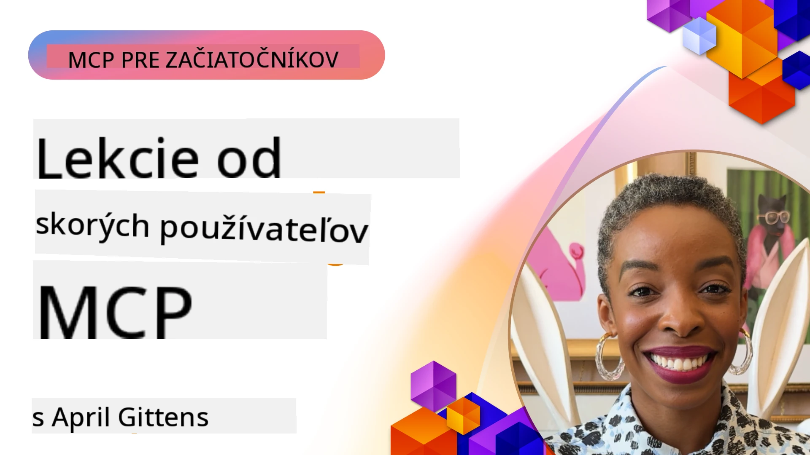

# 🌟 Lekcie od prvých používateľov

[](https://youtu.be/jds7dSmNptE)

_(Kliknite na obrázok vyššie pre zobrazenie videa tejto lekcie)_

## 🎯 Čo tento modul pokrýva

Tento modul skúma, ako reálne organizácie a vývojári využívajú Model Context Protocol (MCP) na riešenie skutočných výziev a podporu inovácií. Prostredníctvom podrobných prípadových štúdií, praktických projektov a príkladov objavíte, ako MCP umožňuje bezpečnú, škálovateľnú AI integráciu, ktorá spája jazykové modely, nástroje a podnikové dáta.

### 📚 Pozrite si MCP v akcii

Chcete vidieť tieto princípy aplikované na nástroje pripravené na produkciu? Pozrite si náš [**10 Microsoft MCP serverov, ktoré transformujú produktivitu vývojárov**](microsoft-mcp-servers.md), ktoré predstavujú reálne Microsoft MCP servery, ktoré môžete používať už dnes.

## Prehľad

Táto lekcia skúma, ako prvý používatelia využili Model Context Protocol (MCP) na riešenie reálnych problémov a podporu inovácií naprieč odvetviami. Prostredníctvom podrobných prípadových štúdií a praktických projektov uvidíte, ako MCP umožňuje štandardizovanú, bezpečnú a škálovateľnú AI integráciu — prepájajúc veľké jazykové modely, nástroje a podnikové dáta v jednotnom rámci. Získate praktické skúsenosti s navrhovaním a budovaním riešení na báze MCP, naučíte sa osvedčené implementačné vzory a objavíte najlepšie postupy pre nasadenie MCP v produkčných prostrediach. Lekcia tiež zvýrazňuje nové trendy, budúce smery a open-source zdroje, ktoré vám pomôžu zostať na čele MCP technológie a jej vyvíjajúceho sa ekosystému.

## Ciele učenia

- Analyzovať reálne MCP implementácie naprieč rôznymi odvetviami
- Navrhovať a vytvárať kompletné aplikácie založené na MCP
- Preskúmať nové trendy a budúce smery v MCP technológii
- Aplikovať najlepšie postupy v reálnych vývojových scenároch

## Reálne MCP implementácie

### Prípadová štúdia 1: Automatyzácia zákazníckej podpory v podniku

Nadnárodná korporácia implementovala riešenie založené na MCP na štandardizáciu AI interakcií v rámci ich systémov zákazníckej podpory. To im umožnilo:

- Vytvoriť jednotné rozhranie pre viacerých poskytovateľov LLM
- Udržiavať konzistentnú správu promptov naprieč oddeleniami
- Implementovať robustné bezpečnostné a súladové kontroly
- Jednoducho prechádzať medzi rôznymi AI modelmi podľa špecifických potrieb

**Technická implementácia:**

```python
# Implementácia Python MCP servera pre zákaznícku podporu
import logging
import asyncio
from modelcontextprotocol import create_server, ServerConfig
from modelcontextprotocol.server import MCPServer
from modelcontextprotocol.transports import create_http_transport
from modelcontextprotocol.resources import ResourceDefinition
from modelcontextprotocol.prompts import PromptDefinition
from modelcontextprotocol.tool import ToolDefinition

# Konfigurácia protokolovania
logging.basicConfig(level=logging.INFO)

async def main():
    # Vytvorte konfiguráciu servera
    config = ServerConfig(
        name="Enterprise Customer Support Server",
        version="1.0.0",
        description="MCP server for handling customer support inquiries"
    )
    
    # Inicializujte MCP server
    server = create_server(config)
    
    # Zaregistrujte zdroje znalostnej databázy
    server.resources.register(
        ResourceDefinition(
            name="customer_kb",
            description="Customer knowledge base documentation"
        ),
        lambda params: get_customer_documentation(params)
    )
    
    # Zaregistrujte šablóny výziev
    server.prompts.register(
        PromptDefinition(
            name="support_template",
            description="Templates for customer support responses"
        ),
        lambda params: get_support_templates(params)
    )
    
    # Zaregistrujte nástroje podpory
    server.tools.register(
        ToolDefinition(
            name="ticketing",
            description="Create and update support tickets"
        ),
        handle_ticketing_operations
    )
    
    # Spustite server s HTTP prenosom
    transport = create_http_transport(port=8080)
    await server.run(transport)

if __name__ == "__main__":
    asyncio.run(main())
```

**Výsledky:** Zníženie nákladov na model o 30 %, zlepšenie konzistencie odoziev o 45 % a zvýšená súladovosť naprieč globálnymi operáciami.

### Prípadová štúdia 2: Diagnostický asistent v zdravotníctve

Poskytovateľ zdravotnej starostlivosti vyvinul MCP infraštruktúru na integráciu viacerých špecializovaných medicínskych AI modelov so zabezpečením citlivých pacientskych dát:

- Bezproblémový prechod medzi všeobecnými a špecializovanými medicínskymi modelmi
- Prísne kontroly súkromia a auditné stopy
- Integrácia s existujúcimi systémami elektronických zdravotných záznamov (EHR)
- Konzistentné spracovanie promptov pre medicínsku terminológiu

**Technická implementácia:**

```csharp
// C# MCP host application implementation in healthcare application
using Microsoft.Extensions.DependencyInjection;
using ModelContextProtocol.SDK.Client;
using ModelContextProtocol.SDK.Security;
using ModelContextProtocol.SDK.Resources;

public class DiagnosticAssistant
{
    private readonly MCPHostClient _mcpClient;
    private readonly PatientContext _patientContext;
    
    public DiagnosticAssistant(PatientContext patientContext)
    {
        _patientContext = patientContext;
        
        // Configure MCP client with healthcare-specific settings
        var clientOptions = new ClientOptions
        {
            Name = "Healthcare Diagnostic Assistant",
            Version = "1.0.0",
            Security = new SecurityOptions
            {
                Encryption = EncryptionLevel.Medical,
                AuditEnabled = true
            }
        };
        
        _mcpClient = new MCPHostClientBuilder()
            .WithOptions(clientOptions)
            .WithTransport(new HttpTransport("https://healthcare-mcp.example.org"))
            .WithAuthentication(new HIPAACompliantAuthProvider())
            .Build();
    }
    
    public async Task<DiagnosticSuggestion> GetDiagnosticAssistance(
        string symptoms, string patientHistory)
    {
        // Create request with appropriate resources and tool access
        var resourceRequest = new ResourceRequest
        {
            Name = "patient_records",
            Parameters = new Dictionary<string, object>
            {
                ["patientId"] = _patientContext.PatientId,
                ["requestingProvider"] = _patientContext.ProviderId
            }
        };
        
        // Request diagnostic assistance using appropriate prompt
        var response = await _mcpClient.SendPromptRequestAsync(
            promptName: "diagnostic_assistance",
            parameters: new Dictionary<string, object>
            {
                ["symptoms"] = symptoms,
                patientHistory = patientHistory,
                relevantGuidelines = _patientContext.GetRelevantGuidelines()
            });
            
        return DiagnosticSuggestion.FromMCPResponse(response);
    }
}
```

**Výsledky:** Zlepšené diagnostické návrhy pre lekárov pri zachovaní plnej zhody s HIPAA a významné zníženie prepínania kontextov medzi systémami.

### Prípadová štúdia 3: Analýza rizík vo finančných službách

Finančná inštitúcia implementovala MCP na štandardizáciu svojich procesov analýzy rizík naprieč rôznymi oddeleniami:

- Vytvorili jednotné rozhranie pre modely úverového rizika, detekcie podvodov a rizika investícií
- Zaviedli prísne kontrolné prístupy a verziu modelov
- Zabezpečili auditovateľnosť všetkých AI odporúčaní
- Udržiavali konzistentné formátovanie dát naprieč rôznorodými systémami

**Technická implementácia:**

```java
// Java MCP server pre hodnotenie finančného rizika
import org.mcp.server.*;
import org.mcp.security.*;

public class FinancialRiskMCPServer {
    public static void main(String[] args) {
        // Vytvorte MCP server s funkciami finančnej zhody
        MCPServer server = new MCPServerBuilder()
            .withModelProviders(
                new ModelProvider("risk-assessment-primary", new AzureOpenAIProvider()),
                new ModelProvider("risk-assessment-audit", new LocalLlamaProvider())
            )
            .withPromptTemplateDirectory("./compliance/templates")
            .withAccessControls(new SOCCompliantAccessControl())
            .withDataEncryption(EncryptionStandard.FINANCIAL_GRADE)
            .withVersionControl(true)
            .withAuditLogging(new DatabaseAuditLogger())
            .build();
            
        server.addRequestValidator(new FinancialDataValidator());
        server.addResponseFilter(new PII_RedactionFilter());
        
        server.start(9000);
        
        System.out.println("Financial Risk MCP Server running on port 9000");
    }
}
```

**Výsledky:** Zvýšené dodržiavanie regulačných požiadaviek, 40 % rýchlejšie cykly nasadenia modelov a zlepšená konzistentnosť hodnotenia rizík naprieč oddeleniami.

### Prípadová štúdia 4: Microsoft Playwright MCP server pre automatizáciu prehliadača

Microsoft vyvinul [Playwright MCP server](https://github.com/microsoft/playwright-mcp) na umožnenie bezpečnej, štandardizovanej automatizácie prehliadača prostredníctvom Model Context Protocol. Tento produkčne pripravený server umožňuje AI agentom a LLM interagovať s webovými prehliadačmi spôsobom, ktorý je kontrolovaný, auditovateľný a rozšíriteľný — podporujúc použitia ako automatizované testovanie webu, extrakcia dát a end-to-end pracovné procesy.

> **🎯 Produkčný nástroj**
> 
> Táto prípadová štúdia prezentuje reálny MCP server, ktorý môžete používať už dnes! Viac o Playwright MCP Server a ďalších 9 produkčne pripravených Microsoft MCP serveroch sa dozviete v našom [**Microsoft MCP Servers Guide**](microsoft-mcp-servers.md#8--playwright-mcp-server).

**Kľúčové vlastnosti:**
- Poskytuje schopnosti automatizácie prehliadača (navigácia, vyplňovanie formulárov, snímanie obrazovky a pod.) ako MCP nástroje
- Zavádza prísne prístupové kontroly a izoláciu pre zabránenie neoprávneným akciám
- Poskytuje podrobné auditné záznamy všetkých interakcií s prehliadačom
- Podporuje integráciu s Azure OpenAI a inými LLM poskytovateľmi pre agentovo riadenú automatizáciu
- Poháňa GitHub Copilot Coding Agenta so schopnosťou prehliadania webu

**Technická implementácia:**

```typescript
// TypeScript: Registrácia nástrojov Playwright pre automatizáciu prehliadača v serveri MCP
import { createServer, ToolDefinition } from 'modelcontextprotocol';
import { launch } from 'playwright';

const server = createServer({
  name: 'Playwright MCP Server',
  version: '1.0.0',
  description: 'MCP server for browser automation using Playwright'
});

// Registrovať nástroj na navigáciu na URL a zachytenie snímky obrazovky
server.tools.register(
  new ToolDefinition({
    name: 'navigate_and_screenshot',
    description: 'Navigate to a URL and capture a screenshot',
    parameters: {
      url: { type: 'string', description: 'The URL to visit' }
    }
  }),
  async ({ url }) => {
    const browser = await launch();
    const page = await browser.newPage();
    await page.goto(url);
    const screenshot = await page.screenshot();
    await browser.close();
    return { screenshot };
  }
);

// Spustiť server MCP
server.listen(8080);
```

**Výsledky:**

- Umožnil bezpečnú, programovateľnú automatizáciu prehliadača pre AI agentov a LLM
- Znížil manuálnu prácu pri testovaní a zlepšil pokrytie testami pre webové aplikácie
- Poskytol znovupoužiteľný, rozšíriteľný rámec pre integráciu nástrojov založených na prehliadači v podnikových prostrediach
- Napája webové prehliadacie schopnosti GitHub Copilot

**Referencie:**

- [Playwright MCP Server GitHub Repository](https://github.com/microsoft/playwright-mcp)
- [Microsoft AI and Automation Solutions](https://azure.microsoft.com/en-us/products/ai-services/)

### Prípadová štúdia 5: Azure MCP – Podnikový Model Context Protocol ako služba

Azure MCP Server ([https://aka.ms/azmcp](https://aka.ms/azmcp)) je manažovaná, podniková implementácia Model Context Protocol od Microsoftu, navrhnutá na poskytovanie škálovateľných, bezpečných a súladových MCP serverových kapacít ako cloudovej služby. Azure MCP umožňuje organizáciám rýchlo nasadzovať, spravovať a integrovať MCP servery s Azure AI, dátami a bezpečnostnými službami, čím znižuje prevádzkové náklady a zrýchľuje adopciu AI.

> **🎯 Produkčný nástroj**
> 
> Toto je reálny MCP server, ktorý môžete používať dnes! Viac o Microsoft Foundry MCP Server sa dozviete v našom [**Microsoft MCP Servers Guide**](microsoft-mcp-servers.md).


- Plne manažované hostovanie MCP servera so zabudovaným škálovaním, monitorovaním a zabezpečením
- Natívna integrácia s Azure OpenAI, Azure AI Search a inými Azure službami
- Podniková autentifikácia a autorizácia cez Microsoft Entra ID
- Podpora vlastných nástrojov, šablón promptov a zdrojových konektorov
- Súlad s podnikateľskými bezpečnostnými a regulačnými požiadavkami

**Technická implementácia:**

```yaml
# Example: Azure MCP server deployment configuration (YAML)
apiVersion: mcp.microsoft.com/v1
kind: McpServer
metadata:
  name: enterprise-mcp-server
spec:
  modelProviders:
    - name: azure-openai
      type: AzureOpenAI
      endpoint: https://<your-openai-resource>.openai.azure.com/
      apiKeySecret: <your-azure-keyvault-secret>
  tools:
    - name: document_search
      type: AzureAISearch
      endpoint: https://<your-search-resource>.search.windows.net/
      apiKeySecret: <your-azure-keyvault-secret>
  authentication:
    type: EntraID
    tenantId: <your-tenant-id>
  monitoring:
    enabled: true
    logAnalyticsWorkspace: <your-log-analytics-id>
```

**Výsledky:**  
- Skrátenie času na hodnotu pre podnikové AI projekty poskytovaním pripraveného, súladového MCP serverového prostredia
- Zjednodušená integrácia LLM, nástrojov a podnikových zdrojov dát
- Zvýšené zabezpečenie, sledovateľnosť a efektivita prevádzky pre MCP záťaže
- Zlepšenie kvality kódu pomocou osvedčených praktík Azure SDK a aktuálnych autentifikačných vzorov

**Referencie:**  
- [Azure MCP Documentation](https://aka.ms/azmcp)
- [Azure MCP Server GitHub Repository](https://github.com/Azure/azure-mcp)
- [Azure AI Services](https://azure.microsoft.com/en-us/products/ai-services/)
- [Microsoft MCP Center](https://mcp.azure.com)

## Prípadová štúdia 6: NLWeb 
MCP (Model Context Protocol) je nastupujúci protokol pre chatbota a AI asistentov na interakciu s nástrojmi. Každá inštancia NLWeb je zároveň MCP server, ktorý podporuje jednu hlavnú metódu, ask, ktorá sa používa na kladenie otázky webovej stránke v prirodzenom jazyku. Vrátená odpoveď využíva schema.org, široko používanú slovnú zásobu na opis webových dát. Voľne povedané, MCP je NLWeb tak, ako Http je k HTML. NLWeb kombinuje protokoly, formáty Schema.org a vzorový kód, aby pomohol stránkam rýchlo vytvárať tieto koncové body, čím prospieva ľuďom cez konverzačné rozhrania a strojom cez prirodzenú agent-agent interakciu.

Existujú dve odlišné zložky NLWeb.
- Protokol, veľmi jednoduchý na začatie, na rozhranie s webom v prirodzenom jazyku a formát, ktorý využíva json a schema.org pre vracanú odpoveď. Viac informácií je v dokumentácii k REST API.
- Priama implementácia (1), ktorá využíva existujúce značkovanie, pre stránky, ktoré možno abstraktovať ako zoznamy položiek (produkty, recepty, atrakcie, recenzie a pod.). Spolu so súborom UI widgetov môžu stránky ľahko poskytovať konverzačné rozhrania k ich obsahu. Viac informácií v dokumentácii k Life of a chat query o tom, ako to funguje.
 
**Referencie:**  
- [Azure MCP Documentation](https://aka.ms/azmcp)
- [NLWeb](https://github.com/microsoft/NlWeb)

### Prípadová štúdia 7: Microsoft Foundry MCP Server – Integrácia podnikových AI agentov

Microsoft Foundry MCP servery demonštrujú, ako možno MCP použiť na orchestráciu a správu AI agentov a pracovných tokov v podnikových prostrediach. Integráciou MCP s Microsoft Foundry môžu organizácie štandardizovať interakcie agentov, využiť Foundry manažment pracovných tokov a zabezpečiť bezpečné, škálovateľné nasadenia.

> **🎯 Produkčný nástroj**
> 
> Toto je reálny MCP server, ktorý môžete používať dnes! Viac o Microsoft Foundry MCP Server sa dozviete v našom [**Microsoft MCP Servers Guide**](microsoft-mcp-servers.md#9--microsoft-foundry-mcp-server).

**Kľúčové vlastnosti:**
- Komplexný prístup k Azure AI ekosystému vrátane katalógov modelov a správy nasadenia
- Indexovanie znalostí s Azure AI Search pre RAG aplikácie
- Nástroje na hodnotenie výkonu AI modelov a zabezpečenie kvality
- Integrácia s Microsoft Foundry Catalog a Labs pre najmodernejšie výskumné modely
- Správa agentov a hodnotiace schopnosti pre produkčné scenáre

**Výsledky:**
- Rýchle prototypovanie a robustné monitorovanie pracovných tokov AI agentov
- Bezproblémová integrácia s Azure AI službami pre pokročilé scenáre
- Jednotné rozhranie na tvorbu, nasadenie a monitorovanie agentových pipeline
- Zlepšená bezpečnosť, súlad a efektivita prevádzky pre podniky
- Urýchlená adopcia AI pri zachovaní kontroly nad komplexnými agentovo riadenými procesmi

**Referencie:**
- [Microsoft Foundry MCP Server GitHub Repository](https://github.com/azure-ai-foundry/mcp-foundry)
- [Integrating Azure AI Agents with MCP (Microsoft Foundry Blog)](https://devblogs.microsoft.com/foundry/integrating-azure-ai-agents-mcp/)

### Prípadová štúdia 8: Foundry MCP Playground – Experimentovanie a prototypovanie

Foundry MCP Playground ponúka pripravené prostredie na experimentovanie s MCP servermi a integráciami Microsoft Foundry. Vývojári môžu rýchlo prototypovať, testovať a hodnotiť AI modely a pracovné toky agentov pomocou zdrojov z Microsoft Foundry Catalog a Labs. Playground zjednodušuje nastavenie, poskytuje vzorové projekty a podporuje spoluprácu na vývoji, čo uľahčuje skúmanie najlepších praktík a nových scenárov s minimálnymi nákladmi. Je mimoriadne užitočný pre tímy, ktoré chcú overiť nápady, zdieľať experimenty a zrýchliť učenie bez potreby zložitej infraštruktúry. Znížením vstupnej bariéry playground podporuje inováciu a komunitné príspevky v MCP a Microsoft Foundry ekosystéme.

**Referencie:**

- [Foundry MCP Playground GitHub Repository](https://github.com/azure-ai-foundry/foundry-mcp-playground)

### Prípadová štúdia 9: Microsoft Learn Docs MCP Server – Dokumentačný prístup poháňaný AI

Microsoft Learn Docs MCP Server je cloudová služba, ktorá poskytuje AI asistentom prístup k oficiálnej dokumentácii Microsoftu v reálnom čase prostredníctvom Model Context Protocol. Tento produkčne pripravený server sa pripája ku komplexnému Microsoft Learn ekosystému a umožňuje sémantické vyhľadávanie vo všetkých oficiálnych zdrojoch Microsoftu.

> **🎯 Produkčný nástroj**
> 
> Tento reálny MCP server môžete používať dnes! Viac o Microsoft Learn Docs MCP Server sa dozviete v našom [**Microsoft MCP Servers Guide**](microsoft-mcp-servers.md#1--microsoft-learn-docs-mcp-server).

**Kľúčové vlastnosti:**
- Prístup v reálnom čase k oficiálnej Microsoft dokumentácii, Azure dokumentom a Microsoft 365 dokumentácii
- Pokročilé schopnosti sémantického vyhľadávania, ktoré chápu kontext a zámer
- Vždy aktuálne informácie, keď sa publikuje obsah Microsoft Learn
- Komplexné pokrytie Microsoft Learn, Azure dokumentácie a zdrojov Microsoft 365
- Vracia až 10 kvalitných obsahových blokov s titulmi článkov a URL adresami

**Prečo je to kľúčové:**
- Rieši problém „zastaranej AI znalosti“ pre Microsoft technológie
- Zaisťuje prístup AI asistentov k najnovším funkciám .NET, C#, Azure a Microsoft 365
- Poskytuje autoritatívne, prvostranové informácie pre presnú generáciu kódu
- Nevyhnutné pre vývojárov pracujúcich s rýchlo sa vyvíjajúcimi Microsoft technológiami

**Výsledky:**
- Dramaticky zlepšená presnosť AI generovaného kódu pre Microsoft technológie
- Skrátený čas hľadania aktuálnej dokumentácie a najlepších praktík
- Zvýšená produktivita vývojárov s kontextovo uvedomelým získavaním dokumentácie
- Bezproblémová integrácia do vývojových pracovných tokov bez opustenia IDE

**Referencie:**
- [Microsoft Learn Docs MCP Server GitHub Repository](https://github.com/MicrosoftDocs/mcp)
- [Microsoft Learn Documentation](https://learn.microsoft.com/)

## Praktické projekty

### Projekt 1: Vytvorte MCP server s viacerými poskytovateľmi

**Cieľ:** Vytvoriť MCP server, ktorý dokáže smerovať požiadavky na viacerých poskytovateľov AI modelov na základe špecifických kritérií.

**Požiadavky:**

- Podpora aspoň troch rôznych poskytovateľov modelov (napr. OpenAI, Anthropic, lokálne modely)
- Implementácia routing mechanizmu založeného na metadátach požiadaviek
- Vytvorenie konfiguračného systému na správu prihlasovacích údajov poskytovateľov
- Pridanie kešovania na optimalizáciu výkonu a nákladov
- Vytvorenie jednoduchého dashboardu na monitoring využitia

**Kroky implementácie:**

1. Nastaviť základnú infraštruktúru MCP servera
2. Implementovať adaptéry poskytovateľov pre každú službu AI modelov
3. Vytvoriť routing logiku založenú na atribútoch požiadavky
4. Pridať kešovacie mechanizmy pre časté požiadavky
5. Vyvinúť monitorovací dashboard
6. Testovať s rôznymi vzormi požiadaviek

**Technológie:** Vyberte si z Pythonu (.NET/Java/Python podľa preferencie), Redis pre kešovanie a jednoduchý webový framework pre dashboard.

### Projekt 2: Podnikový systém správy promptov

**Cieľ:** Vyvinúť systém na báze MCP pre správu, verziovanie a nasadzovanie šablón promptov v celej organizácii.

**Požiadavky:**


- Vytvorte centralizované úložisko pre šablóny promptov
- Implementujte spravovanie verzií a schvaľovacie pracovné postupy
- Vybudujte schopnosti testovania šablón so vzorovými vstupmi
- Vyvinúť riadenie prístupu založené na rolách
- Vytvorte API pre vyhľadávanie a nasadzovanie šablón

**Kroky implementácie:**

1. Navrhnite schému databázy pre ukladanie šablón
2. Vytvorte základné API pre operácie CRUD so šablónami
3. Implementujte systém spravovania verzií
4. Vybudujte schvaľovací pracovný tok
5. Vyvinúť testovací rámec
6. Vytvorte jednoduché webové rozhranie pre správu
7. Integrujte s MCP serverom

**Technológie:** Vami zvolený backendový framework, SQL alebo NoSQL databáza a frontendový framework pre riadiace rozhranie.

### Projekt 3: Platforma na generovanie obsahu založená na MCP

**Cieľ:** Vybudovať platformu na generovanie obsahu, ktorá využíva MCP na poskytovanie konzistentných výsledkov pre rôzne typy obsahu.

**Požiadavky:**

- Podpora viacerých formátov obsahu (blogové príspevky, sociálne médiá, marketingové texty)
- Implementovať generovanie založené na šablónach s možnosťami prispôsobenia
- Vytvoriť systém kontroly a spätnej väzby k obsahu
- Sledovať metriky výkonnosti obsahu
- Podporovať verziovanie a iteráciu obsahu

**Kroky implementácie:**

1. Nastaviť infraštruktúru MCP klienta
2. Vytvoriť šablóny pre rôzne typy obsahu
3. Vybudovať pipeline pre generovanie obsahu
4. Implementovať systém kontroly
5. Vyvinúť systém sledovania metrík
6. Vytvoriť užívateľské rozhranie pre správu šablón a generovanie obsahu

**Technológie:** Vami preferovaný programovací jazyk, webový framework a databázový systém.

## Budúce smery pre technológiu MCP

### Vznikajúce trendy

1. **Multimodálny MCP**
   - Rozšírenie MCP na štandardizáciu interakcií s modelmi pre obraz, zvuk a video
   - Vývoj schopností medzimodálneho uvažovania
   - Štandardizované formáty promptov pre rôzne modality

2. **Federovaná infraštruktúra MCP**
   - Distribuované siete MCP, ktoré môžu zdieľať zdroje medzi organizáciami
   - Štandardizované protokoly pre bezpečné zdieľanie modelov
   - Techniky výpočtov chrániace súkromie

3. **Trhy MCP**
   - Ekosystémy na zdieľanie a monetizáciu šablón a pluginov MCP
   - Procesy zabezpečovania kvality a certifikácie
   - Integrácia s trhmi s modelmi

4. **MCP pre Edge Computing**
   - Adaptácia štandardov MCP pre zariadenia s obmedzenými zdrojmi na okraji siete
   - Optimalizované protokoly pre prostredia s nízkou šírkou pásma
   - Špecializované implementácie MCP pre ekosystémy IoT

5. **Regulačné rámce**
   - Vývoj rozšírení MCP pre regulačnú súladnosť
   - Štandardizované auditové stopy a rozhrania vysvetliteľnosti
   - Integrácia s postupne vznikajúcimi rámcami riadenia AI

### Riešenia MCP od Microsoftu

Microsoft a Azure vyvinuli niekoľko open-source repozitárov na pomoc vývojárom implementovať MCP v rôznych scenároch:

#### Organizácia Microsoft

1. [playwright-mcp](https://github.com/microsoft/playwright-mcp) - MCP server Playwright pre automatizáciu a testovanie prehliadača
2. [files-mcp-server](https://github.com/microsoft/files-mcp-server) - Implementácia MCP servera pre OneDrive pre lokálne testovanie a komunitné príspevky
3. [NLWeb](https://github.com/microsoft/NlWeb) - NLWeb je zbierka otvorených protokolov a príslušných open source nástrojov. Jeho hlavná orientácia je na vytváranie základnej vrstvy pre AI Web

#### Organizácia Azure-Samples

1. [mcp](https://github.com/Azure-Samples/mcp) - Odkazy na vzory, nástroje a zdroje pre tvorbu a integráciu MCP serverov na Azure pomocou viacerých jazykov
2. [mcp-auth-servers](https://github.com/Azure-Samples/mcp-auth-servers) - Referenčné MCP servery demonštrujúce autentifikáciu podľa aktuálnej špecifikácie Model Context Protocol
3. [remote-mcp-functions](https://github.com/Azure-Samples/remote-mcp-functions) - Úvodná stránka implementácií vzdialených MCP serverov v Azure Functions s odkazmi na repozitáre pre rôzne jazyky
4. [remote-mcp-functions-python](https://github.com/Azure-Samples/remote-mcp-functions-python) - Šablóna rýchleho štartu na vytváranie a nasadzovanie vlastných vzdialených MCP serverov pomocou Azure Functions v Pythone
5. [remote-mcp-functions-dotnet](https://github.com/Azure-Samples/remote-mcp-functions-dotnet) - Šablóna rýchleho štartu na vytváranie a nasadzovanie vlastných vzdialených MCP serverov pomocou Azure Functions v .NET/C#
6. [remote-mcp-functions-typescript](https://github.com/Azure-Samples/remote-mcp-functions-typescript) - Šablóna rýchleho štartu na vytváranie a nasadzovanie vlastných vzdialených MCP serverov pomocou Azure Functions v TypeScripte
7. [remote-mcp-apim-functions-python](https://github.com/Azure-Samples/remote-mcp-apim-functions-python) - Azure API Management ako AI Gateway k vzdialeným MCP serverom pomocou Pythonu
8. [AI-Gateway](https://github.com/Azure-Samples/AI-Gateway) - APIM ❤️ AI experimenty vrátane MCP schopností, integrácia so službami Azure OpenAI a AI Foundry

Tieto repozitáre poskytujú rôzne implementácie, šablóny a zdroje pre prácu s Model Context Protocol naprieč rôznymi programovacími jazykmi a službami Azure. Pokrývajú široké spektrum prípadov použitia od základných implementácií serverov cez autentifikáciu, nasadenie v cloude a podnikové integračné scenáre.

#### Adresár zdrojov MCP

Adresár [MCP Resources](https://github.com/microsoft/mcp/tree/main/Resources) v oficiálnom repozitári Microsoft MCP poskytuje vybranú kolekciu vzorových zdrojov, šablón promptov a definícií nástrojov pre použitie so servermi Model Context Protocol. Tento adresár je navrhnutý tak, aby pomohol vývojárom rýchlo začať s MCP tým, že ponúka znovu použiteľné stavebné bloky a príklady najlepších praktík pre:

- **Šablóny promptov:** Hotové šablóny promptov pre bežné AI úlohy a scenáre, ktoré je možné prispôsobiť vašim vlastným implementáciám MCP serverov.
- **Definície nástrojov:** Vzorové schémy nástrojov a metadata na štandardizáciu integrácie nástrojov a ich volania medzi rôznymi MCP servermi.
- **Vzorové zdroje:** Príklady definícií zdrojov na pripojenie k dátovým zdrojom, API a externým službám v rámci MCP frameworku.
- **Referenčné implementácie:** Praktické vzory, ktoré demonštrujú ako štruktúrovať a organizovať zdroje, prompty a nástroje v reálnych projektoch MCP.

Tieto zdroje urýchľujú vývoj, podporujú štandardizáciu a pomáhajú zabezpečiť najlepšie postupy pri budovaní a nasadzovaní riešení založených na MCP.

#### Adresár zdrojov MCP

- [MCP Resources (vzorové prompty, nástroje a definície zdrojov)](https://github.com/microsoft/mcp/tree/main/Resources)

### Výskumné príležitosti

- Efektívne techniky optimalizácie promptov v rámci MCP frameworkov
- Bezpečnostné modely pre viacnájomcové nasadenia MCP
- Benchmarking výkonu naprieč rôznymi implementáciami MCP
- Formálne metódy overovania MCP serverov

## Záver

Model Context Protocol (MCP) rýchlo formuje budúcnosť štandardizovanej, zabezpečenej a interoperabilnej integrácie AI v rôznych odvetviach. Prostredníctvom prípadových štúdií a praktických projektov v tejto lekcii ste videli, ako skorí používatelia — vrátane Microsoftu a Azure — využívajú MCP na riešenie reálnych výziev, zrýchlenie adopcie AI a zabezpečenie súladu, bezpečnosti a škálovateľnosti. Modulárny prístup MCP umožňuje organizáciám prepojiť veľké jazykové modely, nástroje a podnikové dáta v jednotnom, auditovateľnom rámci. Ako sa MCP ďalej vyvíja, dôležité bude zostať zapojený do komunity, objavovať open-source zdroje a uplatňovať najlepšie praktiky na stavbu robustných a pripravených na budúcnosť AI riešení.

## Ďalšie zdroje

- [MCP Foundry GitHub Repozitár](https://github.com/azure-ai-foundry/mcp-foundry)
- [Foundry MCP Playground](https://github.com/azure-ai-foundry/foundry-mcp-playground)
- [Integrácia Azure AI agentov s MCP (Microsoft Foundry Blog)](https://devblogs.microsoft.com/foundry/integrating-azure-ai-agents-mcp/)
- [MCP GitHub Repozitár (Microsoft)](https://github.com/microsoft/mcp)
- [Adresár MCP zdrojov (vzorové prompty, nástroje a definície zdrojov)](https://github.com/microsoft/mcp/tree/main/Resources)
- [Komunita & dokumentácia MCP](https://modelcontextprotocol.io/introduction)
- [Špecifikácia MCP (2026-07-28)](https://modelcontextprotocol.io/specification/2026-07-28/)
- [Dokumentácia Azure MCP](https://aka.ms/azmcp)
- [OWASP MCP Top 10](https://microsoft.github.io/mcp-azure-security-guide/mcp/) - Najlepšie bezpečnostné praktiky
- [Playwright MCP Server GitHub Repozitár](https://github.com/microsoft/playwright-mcp)
- [Files MCP Server (OneDrive)](https://github.com/microsoft/files-mcp-server)
- [Azure-Samples MCP](https://github.com/Azure-Samples/mcp)
- [MCP Auth Servers (Azure-Samples)](https://github.com/Azure-Samples/mcp-auth-servers)
- [Vzdialené MCP Funkcie (Azure-Samples)](https://github.com/Azure-Samples/remote-mcp-functions)
- [Vzdialené MCP Funkcie Python (Azure-Samples)](https://github.com/Azure-Samples/remote-mcp-functions-python)
- [Vzdialené MCP Funkcie .NET (Azure-Samples)](https://github.com/Azure-Samples/remote-mcp-functions-dotnet)
- [Vzdialené MCP Funkcie TypeScript (Azure-Samples)](https://github.com/Azure-Samples/remote-mcp-functions-typescript)
- [Vzdialené MCP APIM Funkcie Python (Azure-Samples)](https://github.com/Azure-Samples/remote-mcp-apim-functions-python)
- [AI-Gateway (Azure-Samples)](https://github.com/Azure-Samples/AI-Gateway)
- [Riešenia AI a automatizácie od Microsoftu](https://azure.microsoft.com/en-us/products/ai-services/)

## Cvičenia

1. Analyzujte jednu z prípadových štúdií a navrhnite alternatívny prístup implementácie.
2. Vyberte jeden z projektných nápadov a vytvorte podrobnú technickú špecifikáciu.
3. Preskúmajte odvetvie, ktoré nebolo pokryté v prípadových štúdiách, a načrtnite, ako by MCP mohlo riešiť jeho špecifické výzvy.
4. Preskúmajte jeden z budúcich smerov a vytvorte koncept nového rozšírenia MCP na jeho podporu.

## Čo ďalej

Preskúmajte viac: [Microsoft MCP Servery](./microsoft-mcp-servers.md)

Pokračujte na: [Modul 8: Najlepšie praktiky](../08-BestPractices/README.md)

---

<!-- CO-OP TRANSLATOR DISCLAIMER START -->
**Vyhlásenie o zodpovednosti**:
Tento dokument bol preložený pomocou AI prekladateľskej služby [Co-op Translator](https://github.com/Azure/co-op-translator). Hoci sa snažíme o presnosť, vezmite prosím na vedomie, že automatické preklady môžu obsahovať chyby alebo nepresnosti. Pôvodný dokument v jeho natívnom jazyku by mal byť považovaný za autoritatívny zdroj. Pre kritické informácie sa odporúča profesionálny ľudský preklad. Nie sme zodpovední za žiadne nedorozumenia alebo nesprávne interpretácie vyplývajúce z použitia tohto prekladu.
<!-- CO-OP TRANSLATOR DISCLAIMER END -->