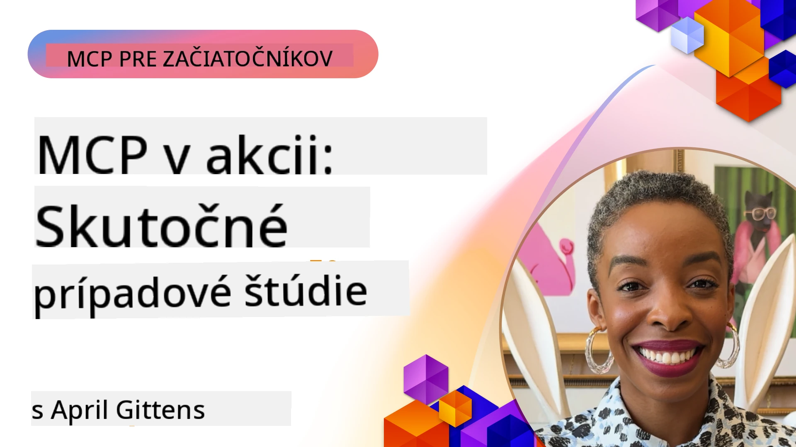

# MCP v praxi: Prípadové štúdie zo skutočného sveta

_(Kliknite na obrázok vyššie pre zobrazenie videa k tejto lekcii)_

Protokol kontextu modelu (MCP) mení spôsob, akým AI aplikácie komunikujú s dátami, nástrojmi a službami. Táto sekcia predstavuje prípadové štúdie zo skutočného sveta, ktoré demonštrujú praktické použitie MCP v rôznych podnikových scenároch.

## Prehľad

Táto sekcia ukazuje konkrétne príklady implementácií MCP a zdôrazňuje, ako organizácie využívajú tento protokol na riešenie náročných obchodných problémov. Preskúmaním týchto prípadových štúdií získate prehľad o všestrannosti, škálovateľnosti a praktických výhodách MCP v reálnych situáciách.

## Kľúčové učebné ciele

Preskúmaním týchto prípadových štúdií budete:

- Rozumieť tomu, ako možno MCP použiť na riešenie konkrétnych obchodných problémov
- Naučiť sa o rôznych vzorcoch integrácie a architektonických prístupoch
- Rozpoznať najlepšie praktiky pre implementáciu MCP v podnikových prostrediach
- Získať prehľad o výzvach a riešeniach, ktoré sa vyskytli v reálnych implementáciách
- Identifikovať príležitosti na použitie podobných vzorcov vo vlastných projektoch

## Predstavené prípadové štúdie

### 1. [Azure AI cestovné agenti – Referenčná implementácia](./travelagentsample.md)

Táto prípadová štúdia skúma komplexné referenčné riešenie spoločnosti Microsoft, ktoré demonštruje, ako postaviť viac-agentovú aplikáciu na plánovanie cestovania poháňanú AI pomocou MCP, Azure OpenAI a Azure AI Search. Projekt ukazuje:

- Orchester viac agentov cez MCP
- Podniková integrácia dát pomocou Azure AI Search
- Bezpečná, škálovateľná architektúra využívajúca Azure služby
- Rozšíriteľné nástroje s opakovane použiteľnými komponentmi MCP
- Konverzačné používateľské rozhranie poháňané Azure OpenAI

Architektúra a detaily implementácie poskytujú cenné poznatky o budovaní komplexných viac-agentových systémov s MCP ako koordinačnou vrstvou.

### 2. [Aktualizácia položiek Azure DevOps z údajov YouTube](./UpdateADOItemsFromYT.md)

Táto prípadová štúdia ukazuje praktické použitie MCP na automatizáciu pracovných procesov. Ukazuje, ako možno nástroje MCP použiť na:

- Extrahovanie dát z online platforiem (YouTube)
- Aktualizáciu pracovných položiek v systémoch Azure DevOps
- Vytváranie opakovateľných automatizačných pracovných tokov
- Integráciu dát naprieč rôznymi systémami

Tento príklad ukazuje, ako aj relatívne jednoduché implementácie MCP môžu priniesť významné zvýšenie efektivity automatizáciou rutinných úloh a zlepšením konzistencie dát medzi systémami.

### 3. [Získavanie dokumentácie v reálnom čase s MCP](./docs-mcp/README.md)

Táto prípadová štúdia vás prevedie pripojením Python konzolového klienta k serveru Model Context Protocol (MCP) za účelom získavania a zaznamenávania aktuálnej, kontextovo podvedomej Microsoft dokumentácie. Naučíte sa, ako:

- Pripojiť sa k MCP serveru pomocou Python klienta a oficiálneho MCP SDK
- Použiť streaming HTTP klientov na efektívne získavanie dát v reálnom čase
- Volanie nástrojov dokumentácie na serveri a zaznamenávanie odpovedí priamo do konzoly
- Integrovať aktuálnu Microsoft dokumentáciu do vášho pracovného toku bez opustenia terminálu

Kapitola obsahuje praktické zadanie, minimálny funkčný ukážkový kód a odkazy na ďalšie zdroje pre hlbšie štúdium. Pozrite si úplný návod a kód v pripojenej kapitole, aby ste pochopili, ako MCP môže transformovať prístup k dokumentácii a produktivitu vývojárov v konzolových prostrediach.

### 4. [Interaktívna webová aplikácia na generovanie študijného plánu s MCP](./docs-mcp/README.md)

Táto prípadová štúdia demonštruje, ako vytvoriť interaktívnu webovú aplikáciu pomocou Chainlit a Model Context Protocol (MCP) na generovanie personalizovaných študijných plánov pre akúkoľvek tému. Používatelia môžu špecifikovať predmet (napríklad „certifikácia AI-900“) a dĺžku štúdia (napr. 8 týždňov) a aplikácia poskytne rozpis odporúčaného obsahu podľa týždňov. Chainlit umožňuje konverzačné chatové rozhranie, ktoré robí zážitok zaujímavým a adaptívnym.

- Konverzačná webová aplikácia poháňaná Chainlit
- Používateľom riadené zadania o téme a trvaní
- Odporúčania obsahu podľa týždňov pomocou MCP
- Odpovede v reálnom čase, adaptívne v chat rozhraní

Projekt ukazuje, ako je možné kombinovať konverzačné AI a MCP na vytváranie dynamických, používateľom riadených vzdelávacích nástrojov v modernom webovom prostredí.

### 5. [Dokumentácia v editore s MCP serverom vo VS Code](./docs-mcp/README.md)

Táto prípadová štúdia demonštruje, ako môžete priniesť dokumentáciu Microsoft Learn priamo do prostredia VS Code pomocou MCP servera — už žiadne presúvanie sa medzi záložkami prehliadača! Uvidíte, ako:

- Okamžite vyhľadávať a čítať dokumentáciu vo VS Code pomocou MCP panela alebo príkazovej palety
- Odkazovať na dokumentáciu a vkladať odkazy priamo do vašich README alebo markdown súborov k kurzom
- Používať GitHub Copilot a MCP spoločne pre plynulé, AI-poháňané pracovné postupy s dokumentáciou a kódom
- Validovať a zlepšovať vašu dokumentáciu pomocou spätnej väzby v reálnom čase a presnosti od Microsoftu
- Integrovať MCP s GitHub pracovnými postupmi pre kontinuálnu validáciu dokumentácie

Implementácia zahŕňa:

- Príklad konfigurácie `.vscode/mcp.json` pre jednoduché nastavenie
- Prechádzky zábermi obrazovky z používania v editore
- Tipy na kombinovanie Copilot a MCP pre maximálnu produktivitu

Tento scenár je ideálny pre autorov kurzov, spisovateľov dokumentácie a vývojárov, ktorí chcú zostať sústredení vo svojom editore pri práci s dokumentáciou, Copilotom a nástrojmi validácie — všetko poháňané MCP.

### 6. [Vytvorenie MCP servera pomocou APIM](./apimsample.md)

Táto prípadová štúdia poskytuje krok za krokom návod, ako vytvoriť MCP server pomocou Azure API Management (APIM). Pokrýva:

- Nastavenie MCP servera v Azure API Management
- Exponovanie API operácií ako MCP nástrojov
- Konfigurovanie pravidiel pre obmedzenie rýchlosti a zabezpečenie
- Testovanie MCP servera pomocou Visual Studio Code a GitHub Copilot

Tento príklad ilustruje, ako využiť schopnosti Azure na vytvorenie robustného MCP servera, ktorý možno použiť v rôznych aplikáciách a zlepšiť integráciu AI systémov s podnikových API.

### 7. [GitHub MCP Registrácia — Zrýchlenie agentnej integrácie](https://github.com/mcp)

Táto prípadová štúdia skúma, ako GitHub MCP Registrácia, spustená v septembri 2025, rieši kritickú výzvu v AI ekosystéme: roztrošené vyhľadávanie a nasadzovanie Model Context Protocol (MCP) serverov.

#### Prehľad
**MCP Registrácia** rieši rastúci problém roztrúsených MCP serverov v repozitároch a registroch, čo doteraz spomaľovalo a zvyšovalo chybovosť pri integrácii. Tieto servery umožňujú AI agentom interakciu s externými systémami ako API, databázy a zdroje dokumentácie.

#### Prehlásenie problému
Vývojári budujúci agentné pracovné toky čelili niekoľkým výzvam:
- **Zlá vyhľadateľnosť** MCP serverov na rôznych platformách
- **Duplicitné dotazy na nastavenie** roztrúsené vo fórach a dokumentácii
- **Bezpečnostné riziká** z neoverených a nespoľahlivých zdrojov
- **Nedostatok štandardizácie** v kvalite a kompatibilite serverov

#### Architektúra riešenia
GitHub MCP Registrácia centralizuje overené MCP servery s kľúčovými funkciami:
- **Inštalácia jedným kliknutím** cez VS Code pre jednoduché nastavenie
- **Zoradenie podľa signálu nad šumom** na základe hviezdičiek, aktivity a overovania komunitou
- **Priama integrácia** s GitHub Copilot a inými nástrojmi kompatibilnými s MCP
- **Model otvorenej spolupráce** umožňujúci príspevky komunity aj podnikových partnerov

#### Obchodný dopad
Registrácia priniesla merateľné zlepšenia:
- **Rýchlejšie uvedenie do prevádzky** pre vývojárov používajúcich nástroje ako Microsoft Learn MCP Server, ktorý streamuje oficiálnu dokumentáciu priamo agentom
- **Zvýšenú produktivitu** cez špecializované servery ako `github-mcp-server`, umožňujúce automatizáciu GitHubu prirodzeným jazykom (vytváranie PR, znovuspustenie CI, skenovanie kódu)
- **Silnejšiu dôveru v ekosystém** cez kurátorské zoznamy a transparentné štandardy nastavenia

#### Strategická hodnota
Pre odborníkov špecializujúcich sa na správu životného cyklu agentov a reprodukovateľné pracovné toky poskytuje MCP Registrácia:
- **Modulárne nasadzovanie agentov** so štandardizovanými komponentmi
- **Hodnotiace pipeline registrácie** pre konzistentné testovanie a overovanie
- **Medzi-nástrojovú interoperabilitu** umožňujúcu bezproblémovú integráciu medzi rôznymi AI platformami

Táto prípadová štúdia ukazuje, že MCP Registrácia nie je iba adresár—je to základná platforma pre škálovateľnú integráciu modelov a nasadzovanie agentných systémov v reálnom svete.

### 8. [Publikovanie do sociálnych sietí z agenta](./publora-social-publishing.md)

Táto prípadová štúdia prechádza **remote MCP serverom s možnosťou zápisu** — takým, ktorého nástroje vykonávajú nezvratné akcie v mene používateľa — a používa ako príklad sociálne publikovanie. Agent vytvorí návrh príspevku, človek ho schváli a server ho naplánuje na rôzne siete.

Zaujímavá časť sú návrhové obmedzenia, ktoré publikovanie ukladá a ktoré platia pre každý server, ktorý zapisuje skôr než iba číta:

- **Otvorené vyhľadávanie, autentifikované vykonávanie** — `tools/list` odpovedá bez prihlasovacích údajov, aby registratúry a klienti mohli introspektovať, zatiaľ čo každý `tools/call` vyžaduje token a inak vracia `401` s hlavičkou `WWW-Authenticate`
- **Registrácia OAuth bez kroku mimo pásma** — dynamická registrácia klienta dnes, pričom Client ID Metadata Documents smerujú k špecifikácii `2026-07-28`
- **Anotácie nástrojov** (`readOnlyHint`, `destructiveHint`, `idempotentHint`), ktoré klienti používajú na rozhodnutie, čo potvrdiť — odporúčania namiesto presadzovania, a niečo, čo teraz očakávajú adresáre konektorov pri revízii
- **Nezameniteľné identifikátory**, takže halucinovaná hodnota hlasno zlyhá namiesto toho, aby konala podľa plausible vyzerajúcej hodnoty
- **Idempotentné kľúče na nástrojoch vytvárajúcich príspevky**, takže opätovné spustenie runtime agenta nie je duplikátom publikácie
- **Nástroj s no-op cieľom popísaný v schéme nástroja**, ktorý prechádza celou cestou zápisu a nič nezverejňuje, pre recenzentov a CI

Kapitola končí krátkym kontrolným zoznamom, ktorý môžete použiť pri tvorbe servera.

## Záver

Týchto osem komplexných prípadových štúdií demonštruje pozoruhodnú všestrannosť a praktické použitia Model Context Protocol v rôznych reálnych situáciách. Od komplexných viac-agentových systémov na plánovanie cestovania a správy podnikových API cez optimalizované pracovné toky dokumentácie až po revolučnú GitHub MCP Registráciu tieto príklady ukazujú, ako MCP poskytuje štandardizovaný a škálovateľný spôsob, ako prepojiť AI systémy s nástrojmi, dátami a službami potrebnými na dosiahnutie výnimočnej hodnoty.

Prípadové štúdie pokrývajú viaceré rozmery implementácie MCP:
- **Podniková integrácia**: Azure API Management a automatizácia Azure DevOps
- **Viac-agentová orchestrácia**: Plánovanie cestovania s koordinovanými AI agentmi
- **Produktivita vývojára**: Integrácia do VS Code a prístup k dokumentácii v reálnom čase
- **Rozvoj ekosystému**: GitHub MCP Registrácia ako základná platforma
- **Vzdelávacie aplikácie**: Interaktívne generátory študijných plánov a konverzačné rozhrania

Štúdiom týchto implementácií získate dôležité poznatky o:
- **Architektonických vzorcoch** pre rôzne mierky a prípady použitia
- **Stratégiách implementácie** vyvážajúcich funkčnosť a udržateľnosť
- **Bezpečnostných a škálovateľnostných úvahách** pre produkčné nasadenia
- **Najlepších praktikách** pre vývoj MCP serverov a integráciu klientov
- **Ekosystémovom myslení** pre tvorbu prepojených AI riešení

Tieto príklady spoločne dokazujú, že MCP nie je len teoretický rámec, ale zrelý, pripravený na produkciu protokol umožňujúci praktické riešenia zložitých obchodných výziev. Či už vytvárate jednoduché automatizačné nástroje alebo sofistikované viac-agentové systémy, vzorce a prístupy tu ilustrované poskytujú pevný základ pre vaše vlastné MCP projekty.

## Ďalšie zdroje

- [Azure AI cestovní agenti GitHub repozitár](https://github.com/Azure-Samples/azure-ai-travel-agents)
- [Azure DevOps MCP nástroj](https://github.com/microsoft/azure-devops-mcp)
- [Playwright MCP nástroj](https://github.com/microsoft/playwright-mcp)
- [Microsoft Docs MCP server](https://github.com/MicrosoftDocs/mcp)
- [GitHub MCP Registrácia — Zrýchlenie agentnej integrácie](https://github.com/mcp)
- [Príklady komunity MCP](https://github.com/microsoft/mcp)

## Čo bude ďalej

- Predchádzajúce: [Modul 8: Najlepšie praktiky](../08-BestPractices/README.md)
- Nasledujúce: [Modul 10: Zjednodušenie AI pracovných tokov: Vytváranie MCP servera s AI Toolkit](../10-StreamliningAIWorkflowsBuildingAnMCPServerWithAIToolkit/README.md)

---

<!-- CO-OP TRANSLATOR DISCLAIMER START -->
**Vyhlásenie o zodpovednosti**:
Tento dokument bol preložený pomocou AI prekladateľskej služby [Co-op Translator](https://github.com/Azure/co-op-translator). Hoci sa snažíme o presnosť, vezmite prosím na vedomie, že automatické preklady môžu obsahovať chyby alebo nepresnosti. Pôvodný dokument v jeho natívnom jazyku by mal byť považovaný za autoritatívny zdroj. Pre kritické informácie sa odporúča profesionálny ľudský preklad. Nie sme zodpovední za žiadne nedorozumenia alebo nesprávne interpretácie vyplývajúce z použitia tohto prekladu.
<!-- CO-OP TRANSLATOR DISCLAIMER END -->