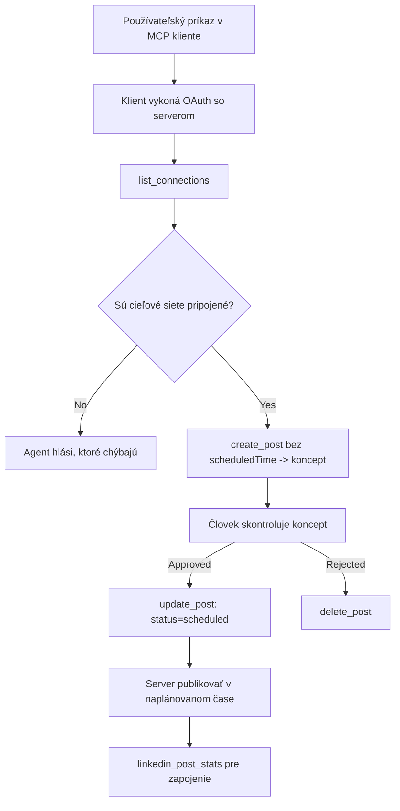

# Prípadová štúdia: Publikovanie na sociálne siete z agenta s vzdialeným MCP serverom

> **Vyhlásenie:** Viaceré služby a open-source projekty dokážu publikovať na sociálne siete a tím môže tiež priamo integrovať každé API siete. Nižšie uvedený scenár slúži ako jeden príklad, ako možno navrhnúť a používať **zapisovateľný vzdialený MCP server**. Publora je komerčná služba s bezplatnou úrovňou; tu popísané vzory platia pre akýkoľvek MCP server, ktorý vykonáva nevratné akcie v mene používateľa.

## Prehľad

Agenti sú dobrí v písaní obsahu, ale zle v jeho doručovaní. Model môže za sekundy napísať oznámenie o vydaní, a potom práca končí: zverejnenie znamená API na každú sieť, OAuth aplikáciu pre každú sieť a rôzne pravidlá pre médiá pre každú. Väčšina tímov to rieši tak, že text manuálne skopírujú do prehliadača.

Táto prípadová štúdia sa zaoberá tým, ako sa táto posledná fáza uzavrie jedným vzdialeným MCP serverom a — čo je užitočnejšie pre kohokoľvek, kto niektorý buduje — návrhovými rozhodnutiami, ktoré **zapisovateľný** server musí správne urobiť. Čítanie dát je odpúšťajúce. Publikovanie nie: nesprávne zavolanie nástroja je viditeľné pre publikum a nemožno ho vrátiť späť.

## Scenár

Malý tím správy vývojárov vytvára príspevky v agente (Claude, VS Code, Cursor — klient nie je podstatný). Chcú, aby agent:

- videl, ktoré sociálne účty má tím pripojené,
- vytvoril návrh príspevku a uchoval ho ako návrh na schválenie človekom,
- pripojil obrázok,
- naplánoval ho do viacerých sietí na zvolený čas,
- a neskôr hlásil, ako fungoval.

Kľúčové je, že chcú, aby agent *nemohol* omylom publikovať, kým stále skúšajú.

## Použité nástroje

- [Publora MCP Server](https://github.com/publora/mcp-server) — vzdialený MCP server (`streamable-http`), ktorý poskytuje nástroje na publikovanie, plánovanie, médiá a analytiku LinkedIn. Registrovaný v oficiálnom MCP registri ako `com.publora/mcp-server`.

## Postup krok za krokom

1. **Pripojenie servera.** Klienti používajúci OAuth dokončia autorizáciu cez kódový tok s PKCE proti vlastnej obrazovke súhlasu servera; klienti, ktorí OAuth nepoužívajú, ako napríklad headless CLI, používajú API kľúč Publora v hlavičke. Obe cesty sú podporované a ktorú dostanete závisí od klienta, nie od servera.
2. **Zoznam pripojení.** Agent zavolá `list_connections` a dostane pripojené účty s ich identifikátormi.
3. **Návrh.** Agent zavolá `create_post` *bez* plánovaného času. Príspevok je uložený ako návrh — nič sa nezverejní.
4. **Pripojenie médií.** Verejné URL obrázkov sa posielajú v rovnakom volaní; server ich stiahne a overí.
5. **Plánovanie.** Po schválení človekom nastaví `update_post` stav na naplánovaný s časom v ISO 8601.
6. **Meranie.** Pre LinkedIn vráti `linkedin_post_stats` zapojenie, keď je príspevok zverejnený.

## Príklad promptu

```text
Which social accounts do I have connected?
Draft a post announcing our new changelog page, attach the screenshot at
https://example.com/changelog.png, and keep it as a draft — do not publish it.
Once I approve, schedule it to LinkedIn and Bluesky for tomorrow at 09:00 UTC.
```

## Mermaid diagram toku



## Technická implementácia

Lekcie nižšie sú prenositeľnou časťou tejto prípadovej štúdie.

### Otvorené zisťovanie, autentifikované vykonanie

`tools/list` je dostupné bez poverení; každé `tools/call` vyžaduje token
a inak vracia `401` s hlavičkou `WWW-Authenticate` smerujúcou na
metadata chráneného zdroja. Starší endpoint servera tiež odpovedá na
neautentifikovaný `initialize` pre klientov na verziách protokolu pred
`2026-07-28`; súčasní klienti tento handshake nepoužívajú.

Tento server-špecifický rozdelenie umožňuje registrám, katalógom a klientom skontrolovať názvy nástrojov,
schémy a anotácie bez tajomstva a zároveň zabraňuje anonymnému
vykonaniu. Otvorené zisťovanie je voľbou nasadenia, nie požiadavkou MCP; chránené
nasadenie môže tiež vyžadovať autorizáciu pre `tools/list`.

### Registrácia: dynamická registrácia klienta a čo ju nahrádza

Server inzeruje `/.well-known/oauth-protected-resource` a `/.well-known/oauth-authorization-server`, a podporuje autorizáciu cez kódový tok s PKCE (`S256`), refresh tokeny a **dynamickú registráciu klienta**.

Dynamická registrácia odstránila manuálny krok pre starších klientov: bez nej
každý klient potreboval vopred vydané `client_id` od dodávateľa.

Traktujte to ako správanie pre kompatibilitu, nie ako návrh na skopírovanie. Revízia špecifikácie `2026-07-28` označuje dynamickú registráciu klienta za zastaranú v prospech dokumentov metadát Client ID, kde klient hostuje metadátový dokument na stabilnej HTTPS URL a táto URL *je* `client_id`. DCR zatiaľ funguje, ale server vytváraný dnes by mal plánovať CIMD a DCR ponechať len pre starších klientov.

### Anotácie nástrojov nie sú dekorácia

Každý nástroj má `title` a použiteľné nápovedy: `readOnlyHint`, `destructiveHint`, `idempotentHint`, `openWorldHint`.

Dva dôvody pre ich investovanie. Prvý, klienti používajú nápovedy na rozhodnutie, čo potvrdiť s používateľom — klient môže automaticky vykonať čítanie a zastaviť sa na schválenie pred vymazaním. Špecifikácia explicitne uvádza, že anotácie sú nedôveryhodné nápovedy, nie autorizačný mechanizmus: formujú, čo klient ponúka, nerušia nič na serveri a server musí stále vynucovať vlastné pravidlá. Druhý dôvod, hlavné adresáre konektorov ich teraz *vyžadujú* na kontrolu; server bez titulov a nápovedí bude odmietnutý bez ohľadu na jeho funkčnosť.

### Urobiť identifikátory neuhádnuteľné

Platformové identifikátory sú nepriehľadné reťazce vrátené `list_connections` a schema výslovne uvádza, že ich treba kopírovať presne a nikdy neuhádnuť. Server iné odmieta.

Modely sú zdatní hádači. Každý zapisovateľný server by mal predpokladať, že identifikátor sa nakoniec zhalucinuje a túto cestu musí ukončiť hlučne a skoro, namiesto vykonania akcie so správne vyzerajúcou hodnotou.

### Zlyhať pred publikovaním s konateľnou správou

Niektoré siete odmietajú príspevky iba s textom a vyžadujú obrázok alebo video. Toto sa kontroluje pri plánovaní príspevku a chyba pomenúva platformu a chýbajúcu požiadavku.

Agent sa môže zotaviť z „Instagram vyžaduje médium — pripojte obrázok alebo video“ bez ďalšieho okruhu komunikácie. Nedokáže sa zotaviť z generického `400`.

### Urobiť opakovania bezpečnými

Dva nástroje, ktoré tvoria obsah, `create_post` a `update_post`, prijímajú idempotentný kľúč: jeho použitie s identickou požiadavkou zopakuje pôvodnú odpoveď namiesto vytvorenia druhého príspevku. Agent runtime opakuje pri timeoutoch; bez idempotencie sa pomalá odpoveď stane duplikátnym publikovaním. Ostatné zapisovacie nástroje — mazania, kroky s médiami, LinkedIn reakcie a komentáre — kľúč nepoužívajú, takže opakovanie nie je automaticky bezpečné. Stojí za to vedieť, ktoré z vašich mutácií sú chránené a ktoré nie.

### Poskytnúť spôsob testovania, ktoré nič nepublikuje


Server prijíma rezervovaný cieľ, `publora-playground`, ktorý je overený a potvrdený ako skutočný cieľ a potom zahodený — nič sa nedostane k živému účtu. Je popísaný priamo v schéme nástroja, ktorú môže každý klient prečítať bez prihlasovacích údajov: pole `platforms` v dokumentoch `create_post` ho uvádza ako "cieľ testovania pripojenia, ktorý nevyžaduje skutočné pripojenie — príspevok je potvrdený a odstránený, nič sa nezverejní". Zavolajte ho tak, že ho zadáte ako jediný záznam: `platforms: ["publora-playground"]`.

Toto sa ukázalo ako jeden z najpraktickejších detailov celej plochy. Recenzenti adresárov konektorov, prispievatelia aj CI môžu bez rizika pre skutočné publikum plne otestovať celú cestu zápisu. Každý server MCP s nezvratnými akciami má úžitok z dokumentovaného no-op cieľa.

## Výsledky a dopad

- Krok publikovania sa presunul z prehliadača do rovnakého rozhovoru, kde sa obsah píše, a zvyk zostavenia návrhu ako prvého udržiava človeka v procese. Buďte presní ohľadom toho, čo to znamená: návrh je konvencia, nie hranica. Rovnaký poverovací údaj môže plánovať aj publikovať, takže každý, kto potrebuje skutočnú kontrolu schválenia, musí ju presadzovať mimo rozhrania nástroja — samostatné poverenia alebo politická vrstva pred serverom.
- Rozdiely medzi sieťami — požiadavky na médiá, vlákna, ovládanie odpovedí — sa riešia raz na serveri, nie v každom agente, ktorý s ním komunikuje.
- Rovnaký server podporuje niekoľko klientov MCP bez vopred vydaných poverení.
    Súčasní klienti môžu používať dokumenty metadát Client ID; DCR zostáva záložným riešením
    pre staršie klienty.
- Návrhové obmedzenia vyššie formovali recenzie adresárov konektorov rovnako ako používatelia: anotácie, OAuth a bezpečný testovací cieľ boli požadované aspoň jedným z nich.

## Referencie

- [Publora MCP Server (zdrojový kód)](https://github.com/publora/mcp-server)
- [Publora API a dokumentácia MCP](https://docs.publora.com)
- [Záznam v MCP Registry: `com.publora/mcp-server`](https://registry.modelcontextprotocol.io/v0/servers?search=com.publora/mcp-server)
- [Špecifikácia MCP — Autorizácia](https://modelcontextprotocol.io/specification/2026-07-28/basic/authorization)
- [Špecifikácia MCP — Anotácie nástrojov](https://modelcontextprotocol.io/docs/concepts/tools)

## Čo ďalej

- Vezmite MCP server, ktorý vytvárate, a skontrolujte tu tri najlacnejšie vylepšenia: anotácie na každý nástroj, idempotentný kľúč na každý zápis a dokumentovaný no-op cieľ.
- Vyskúšajte otvorený objavovacích prístup: volajte `tools/list` na verejný vzdialený server bez poverení, potom zavolajte nástroj a skontrolujte odpoveď `401`.
- Zvážte, čo znamená "kroť" vo vašom odbore. Publikovanie má koncept návrhov aj odstraňovania; ak vaše akcie nemajú ekvivalent, potvrdenie patrí do návrhu nástroja, nie do výzvy.

---

<!-- CO-OP TRANSLATOR DISCLAIMER START -->
**Vyhlásenie o zodpovednosti**:
Tento dokument bol preložený pomocou AI prekladateľskej služby [Co-op Translator](https://github.com/Azure/co-op-translator). Hoci sa snažíme o presnosť, vezmite prosím na vedomie, že automatické preklady môžu obsahovať chyby alebo nepresnosti. Pôvodný dokument v jeho natívnom jazyku by mal byť považovaný za autoritatívny zdroj. Pre kritické informácie sa odporúča profesionálny ľudský preklad. Nie sme zodpovední za žiadne nedorozumenia alebo nesprávne interpretácie vyplývajúce z použitia tohto prekladu.
<!-- CO-OP TRANSLATOR DISCLAIMER END -->