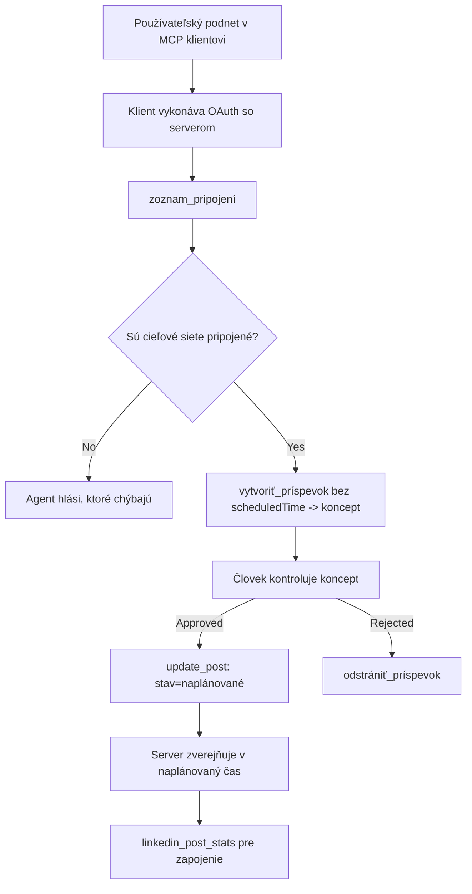

# Prípadová štúdia: Publikovanie na sociálne siete z agenta s diaľkovým MCP serverom

> **Upozornenie:** Niekoľko služieb a open-source projektov môže publikovať na sociálne siete a tím by mohol tiež integrovať API každej siete priamo. Scenár nižšie je uvedený ako jeden spracovaný príklad toho, ako môže byť navrhnutý a využívaný **diaľkový MCP server s možnosťou zápisu**. Publora je komerčná služba s bezplatnou úrovňou; vzory popísané tu platia pre akýkoľvek MCP server, ktorý vykonáva nezvratné akcie v mene používateľa.

## Prehľad

Agenti sú dobrí v písaní obsahu, ale zlí pri jeho doručovaní. Model dokáže napísať oznámenie o vydaní za sekundy, a potom práca končí: publikovanie znamená API pre každú sieť, OAuth aplikáciu pre každú sieť a rôzne sady mediálnych pravidiel pre každú. Väčšina tímov tento problém rieši tak, že text manuálne kopírujú do prehliadača.

Táto prípadová štúdia skúma, ako je tento posledný krok vyriešený jedným diaľkovým MCP serverom, a — ešte užitočnejšie pre kohokoľvek, kto taký server buduje — rozhodnutia o dizajne, ktoré musí server s možnosťou zápisu správne zvládnuť. Čítanie dát je zhovievavé. Publikovanie nie: nesprávny nástrojový hovor je viditeľný pre publikum a nedá sa vrátiť späť.

## Scenár

Malý tím pre vzťahy s vývojármi vytvára príspevky v agentovi (Claude, VS Code, Cursor — klient nie je dôležitý). Chcú, aby agent:

- videl, ktoré sociálne účty má tím pripojené,
- vytvoril koncept príspevku a uchoval ho ako koncept na schválenie človekom,
- priložil obrázok,
- naplánoval ho na niekoľko sietí na vybraný čas,
- a neskôr reportoval, ako si viedol.

Kľúčové je, že chcú, aby agent *nemohol* omylom publikovať, kým ešte experimentujú.

## Použité nástroje

- [Publora MCP Server](https://github.com/publora/mcp-server) — diaľkový MCP server (`streamable-http`), ktorý vystavuje nástroje na publikovanie, plánovanie, médiá a analytiku LinkedIn. Registrovaný v oficiálnom MCP registri ako `com.publora/mcp-server`.

## Krok za krokom pracovný postup

1. **Pripojenie servera.** Klienti, ktorí používajú OAuth, dokončia tok autorizačného kódu s PKCE proti vlastnej obrazovke súhlasu servera; klienti, ktorí nie, ako napríklad bezhlavé CLI, používajú Publora API kľúč v hlavičke. Podporované sú obe cesty, ktorú dostanete závisí od klienta, nie od servera.
2. **Zobrazenie pripojení.** Agent volá `list_connections` a dostane pripojené účty spolu s ich identifikátormi.
3. **Koncept.** Agent volá `create_post` *bez* plánovaného času. Príspevok je uložený ako koncept — nič nie je publikované.
4. **Priloženie médií.** Verejné URL obrázkov sa posielajú v rovnakom volaní; server ich sťahuje a overuje.
5. **Plánovanie.** Po schválení človekom nastavuje `update_post` stav na naplánovaný s ISO 8601 časom.
6. **Meranie.** Pre LinkedIn vráti `linkedin_post_stats` zapojenie, keď je príspevok publikovaný.

## Príklad promptu

```text
Which social accounts do I have connected?
Draft a post announcing our new changelog page, attach the screenshot at
https://example.com/changelog.png, and keep it as a draft — do not publish it.
Once I approve, schedule it to LinkedIn and Bluesky for tomorrow at 09:00 UTC.
```

## Mermaid diagram toku



## Technická implementácia

Lekcie nižšie sú prenosnou časťou tejto prípadovej štúdie.

### Otvorená objaviteľnosť, autentifikované vykonávanie

`tools/list` je poskytované bez prihlasovacích údajov; každé `tools/call` vyžaduje token a inak vráti `401` so záhlavím `WWW-Authenticate` ukazujúcim na metadata chráneného zdroja. (Server tiež odpovedá na neautentifikované `initialize`, čo má význam len pre klientov na protokolových verziách pred `2026-07-28`; táto revízia úplne odstránila úvodné zjednanie.)

Toto rozdelenie má v praxi zmysel. Registry, katalógy a klienti môžu nahlížat na rozhranie nástrojov — mená, schémy, poznámky — bez držania tajomstva, zatiaľ čo nič nemôže byť *vykonané* anonymne. Server, ktorý požaduje token pre `initialize`, je efektívne neviditeľný nástrojom; server, ktorý povoľuje anonymné `tools/call`, je riziko.

### Registrácia: dynamická registrácia klienta a čo ju nahrádza

Server inzeruje `/.well-known/oauth-protected-resource` a `/.well-known/oauth-authorization-server`, a podporuje autorizačný tok s PKCE (`S256`), obnovovacie tokeny a **dynamickú registráciu klientov**.

Dynamická registrácia odstraňuje manuálny krok: bez nej každý klient potrebuje predpísaný `client_id`, čo znamená požiadavku mimo pásma na dodávateľa pre každého nového klienta.

Považujte to skôr za kompatibilitu než za dizajn na kopírovanie. Revizia špecifikácie z `2026-07-28` zavádza náhradu dynamickej registrácie klienta dokumentmi o metadátach Client ID (CIMD), kde klient hostuje dokument metadát na stabilnej HTTPS URL a táto URL *je* `client_id`. DCR zatiaľ stále funguje, ale server, ktorý sa dnes buduje, by mal plánovať pre CIMD a ponechať DCR len pre starších klientov.

### Anotácie nástrojov nie sú len dekorácie

Každý nástroj nesie `title` a príslušné indikátory: `readOnlyHint`, `destructiveHint`, `idempotentHint`, `openWorldHint`.

Dva dôvody, prečo do nich investovať. Po prvé, klienti používajú indikátory na rozhodnutie, čo potvrdiť so používateľom — klient môže automaticky vykonať čítanie bez zmeny a zastaviť sa na schválenie pred zmazaním. Špecifikácia jasne uvádza, že anotácie sú nedôveryhodné indikátory, nie autorizačný mechanizmus: formujú, čo klient ponúkne vykonať, nič na serveri nezastavia a server musí stále vynucovať svoje pravidlá. Po druhé, hlavné adresáre konektorov ich teraz *vyžadujú* pre schválenie; server bez titulkov a indikátorov bude vrátený, nech už funguje akokoľvek dobre.

### Urobte identifikátory nepredstaviteľnými

Identifikátory platforiem sú nepriehľadné reťazce vrátené `list_connections`, pričom schéma výslovne hovorí, že musia byť kopírované doslovne a nikdy sa nesmú hádať. Server všetko iné odmieta.

Modely často „uhádnu“. Každý server s možnosťou zápisu by mal predpokladať, že identifikátor bude nakoniec vymyslený, a spraviť, aby táto cesta zlyhala hlasno a skoro, namiesto aby konal podľa hodnoverne vyzerajúcej hodnoty.

### Zlyhajte pred publikovaním, s možnosťou riešenia chyby

Niektoré siete nepovoľujú iba textové príspevky a vyžadujú obrázok alebo video. To sa overuje pri plánovaní príspevku a chyba uvádza platformu a chýbajúcu požiadavku.

Agent sa môže zotaviť z "Instagram vyžaduje médiá — priložte obrázok alebo video" bez ďalšieho spätného volania. Nemôže sa zotaviť z generickej chyby `400`.

### Zabezpečte bezpečné opakovanie

Dva nástroje, ktoré vytvárajú obsah, `create_post` a `update_post`, akceptujú idempotentný kľúč: jeho opätovné použitie s totožnou požiadavkou zopakuje pôvodnú odpoveď namiesto vytvorenia druhého príspevku. Behy agentov opakujú volania pri časových limitoch; bez idempotentnosti sa pomalá odpoveď premení na duplicitné publikovanie. Ostatné nástroje na zápis — mazania, kroky s médiami, reakcie a komentáre LinkedIn — idempotentný kľúč neprijímajú, takže opakovanie tam nie je automaticky bezpečné. Stojí za to vedieť, ktoré vaše mutácie sú chránené a ktoré nie.

### Poskytnite spôsob testovania, ktorý nič nepublikuje

Server akceptuje rezervovaný cieľ, `publora-playground`, ktorý je overený a potvrdený ako skutočný cieľ, potom zahodený — nič sa nedostane na živý účet. Je popísaný priamo v schéme nástroja, ktorú môže prečítať akýkoľvek klient bez prihlasovania: pole `platforms` u `create_post` dokumentuje tento cieľ ako "cieľ testu pripojenia, ktorý nevyžaduje skutočné pripojenie — príspevok je potvrdený a zahodený, nič sa nepublikuje". Zavolajte ho tak, že ho zadáte ako jediný záznam: `platforms: ["publora-playground"]`.

Toto sa ukázalo ako jeden z najpoužiteľnejších detailov celej plochy nástrojov. Recenzenti adresárov konektorov, prispievatelia a CI môžu celú cestu zápisu vyskúšať od začiatku do konca bez rizika pre skutočné publikum. Každý MCP server so nezvratnými akciami má osoh z dokumentovaného cieľa no-op.

## Výsledky a dopad

- Krok publikovania sa presunul z prehliadača do tej istej konverzácie, kde sa obsah píše, a zvyk konceptu ako prvého udržuje človeka v procese. Buďte presní, čo to znamená: koncept je dohoda, nie hranica. Tá istá poverenia môžu plánovať aj publikovať, takže kto potrebuje skutočné schvaľovanie, musí to vynútiť mimo rozhrania — samostatné poverenia, alebo vrstva politík pred serverom.
- Rozdiely medzi sieťami — požiadavky na médiá, vlákna, ovládanie odpovedí — sa riešia raz na serveri, nie v každom agente.
- Tento istý server podporuje niekoľko MCP klientov bez práce na klienta, pretože objavovanie je otvorené a registrácia dynamická.
- Dizajnové požiadavky vyššie formovali tie isté recenzie adresárov konektorov aj používatelia: anotácie, OAuth a bezpečný testovací cieľ boli vždy požadované aspoň jedným z nich.

## Odkazy

- [Publora MCP Server (zdroj)](https://github.com/publora/mcp-server)
- [Dokumentácia Publora API a MCP](https://docs.publora.com)
- [Záznam MCP registrácie: `com.publora/mcp-server`](https://registry.modelcontextprotocol.io/v0/servers?search=com.publora/mcp-server)
- [Špecifikácia MCP — autorizácia](https://modelcontextprotocol.io/specification/draft/basic/authorization)
- [Špecifikácia MCP — anotácie nástrojov](https://modelcontextprotocol.io/docs/concepts/tools)

## Čo ďalej

- Vezmite MCP server, ktorý budujete, a skontrolujte tri najlacnejšie vylepšenia tu: anotácie na každý nástroj, idempotentný kľúč na každý zápis a dokumentovaný no-op cieľ.
- Vyskúšajte rozdelenie otvorenej objaviteľnosti: zavolajte `tools/list` na verejnom diaľkovom serveri bez poverení, potom zavolajte nástroj a skontrolujte výzvu `401`.
- Premyslite, čo znamená "spätné vrátenie" vo vašej doméne. Publikovanie má koncepty a mazanie; ak vaše akcie nemajú ekvivalent, potvrdenie patrí do dizajnu nástrojov, nie do promptu.

---

<!-- CO-OP TRANSLATOR DISCLAIMER START -->
**Vyhlásenie o zodpovednosti**:
Tento dokument bol preložený pomocou AI prekladateľskej služby [Co-op Translator](https://github.com/Azure/co-op-translator). Hoci sa snažíme o presnosť, vezmite prosím na vedomie, že automatické preklady môžu obsahovať chyby alebo nepresnosti. Pôvodný dokument v jeho natívnom jazyku by mal byť považovaný za autoritatívny zdroj. Pre kritické informácie sa odporúča profesionálny ľudský preklad. Nie sme zodpovední za žiadne nedorozumenia alebo nesprávne interpretácie vyplývajúce z použitia tohto prekladu.
<!-- CO-OP TRANSLATOR DISCLAIMER END -->