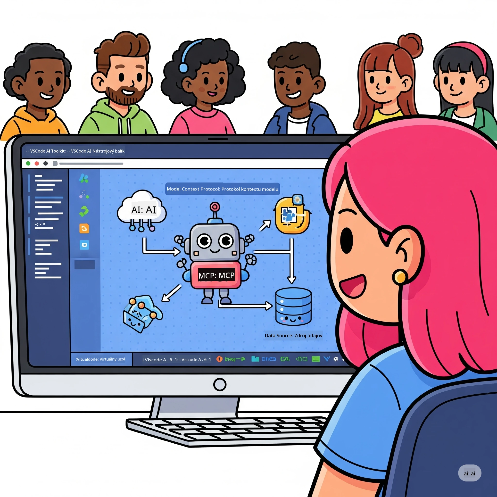
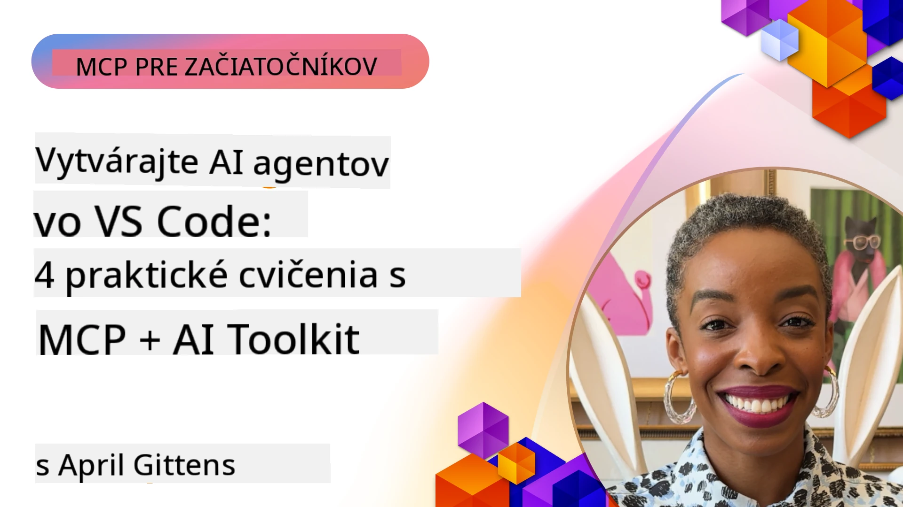

# Zefektívnenie pracovných tokov AI: Vytvorenie MCP servera s Microsoft Foundry Toolkit

## 🎯 Prehľad

_(Kliknite na obrázok vyššie pre zobrazenie videa tejto lekcie)_

Vitajte na **Model Context Protocol (MCP) Workshope**! Tento komplexný praktický workshop spája dve špičkové technológie na revolúciu vo vývoji AI aplikácií:

> **Poznámka o kompatibilite:** kód workshopu bol vybudovaný a testovaný s MCP
> `2025-11-25`, ako ukazuje odznak vyššie. Použite
> [aktuálnu špecifikáciu `2026-07-28`](https://modelcontextprotocol.io/specification/2026-07-28/)
> pre nové implementácie protokolu a pred migráciou laboratórnych cvičení si prečítajte
> poznámky k vydaniu SDK.

- **🔗 Model Context Protocol (MCP)**: Otvorený štandard pre plynulú integráciu AI nástrojov
- **🛠️ Rozšírenie Microsoft Foundry Toolkit pre VS Code**: Výkonné Microsoft AI rozšírenie na vývoj

### 🎓 Čo sa naučíte

Na konci tohto workshopu budete ovládať umenie vytvárania inteligentných aplikácií, ktoré prepájajú AI modely s reálnymi nástrojmi a službami. Od automatizovaného testovania až po vlastné API integrácie získate praktické zručnosti na riešenie zložitých biznis výziev.

## 🏗️ Technologický stack

### 🔌 Model Context Protocol (MCP)

MCP je **"USB-C pre AI"** - univerzálny štandard prepájajúci AI modely s externými nástrojmi a zdrojmi dát.

**✨ Kľúčové vlastnosti:**

- 🔄 **Štandardizovaná integrácia**: Univerzálne rozhranie pre prepojenie AI nástrojov
- 🏛️ **Flexibilná architektúra**: Lokálne a vzdialené servery cez stdio/SSE prenos
- 🧰 **Bohatý ekosystém**: Nástroje, promptové výzvy a zdroje v jednom protokole
- 🔒 **Pripravenosť pre podniky**: Zabudovaná bezpečnosť a spoľahlivosť

**🎯 Prečo je MCP dôležitý:**
Rovnako ako USB-C zrušil chaos s káblami, MCP odstraňuje zložitosť AI integrácií. Jeden protokol, nekonečné možnosti.

### 🤖 Rozšírenie Microsoft Foundry Toolkit pre VS Code

Vlajková AI rozšírenie od Microsoftu, ktoré transformuje VS Code na AI siláka.

**🚀 Hlavné schopnosti:**

- 📦 **Katalóg modelov**: Prístup k modelom z Azure AI, GitHub, Hugging Face, Ollama
- ⚡ **Lokálne inferencie**: ONNX optimalizované CPU/GPU/NPU vykonávanie
- 🏗️ **Agent Builder**: Vizualizovaný vývoj AI agentov s MCP integráciou
- 🎭 **Multi-Modalita**: Podpora textu, vízie a štruktúrovaného výstupu

**💡 Výhody vývoja:**

- Nasadenie modelu bez konfigurácie
- Vizuálne inžinierstvo promptov
- Testovanie v reálnom čase na ihrisku
- Bezproblémová integrácia MCP servera

## 📚 Vzdelávacia cesta

### [🚀 Modul 1: Základy Microsoft Foundry Toolkit](./lab1/README.md)

**Trvanie**: 15 minút

- 🛠️ Inštalujte a nakonfigurujte Microsoft Foundry Toolkit pre VS Code
- 🗂️ Preskúmajte katalóg modelov (100+ modelov z GitHub, ONNX, OpenAI, Anthropic, Google)
- 🎮 Ovládnite interaktívne ihrisko pre testovanie modelov v reálnom čase
- 🤖 Vytvorte svoj prvý AI agent s Agent Builder
- 📊 Vyhodnoťte výkon modelu pomocou zabudovaných metrík (F1, relevantnosť, podobnosť, súvislosť)
- ⚡ Naučte sa dávkové spracovanie a podporu multimodálnych vstupov

**🎯 Výsledok učenia**: Vytvoriť funkčného AI agenta s komplexným pochopením možností Microsoft Foundry Toolkit

### [🌐 Modul 2: MCP so základmi Microsoft Foundry Toolkit](./lab2/README.md)

**Trvanie**: 20 minút

- 🧠 Ovládnite architektúru a koncepty protokolu Model Context (MCP)
- 🌐 Preskúmajte ekosystém MCP serverov spoločnosti Microsoft
- 🤖 Vytvorte agenta pre automatizáciu prehliadača pomocou Playwright MCP servera
- 🔧 Integrujte MCP servery s Microsoft Foundry Toolkit Agent Builder
- 📊 Nakonfigurujte a testujte nástroje MCP vo vašich agentech
- 🚀 Exportujte a nasadzujte agentov so silou MCP pre produkčné použitie

**🎯 Výsledok učenia**: Nasadiť AI agenta supernabitého externými nástrojmi cez MCP

### [🔧 Modul 3: Pokročilý vývoj MCP s Microsoft Foundry Toolkit](./lab3/README.md)

**Trvanie**: 20 minút

- 💻 Vytvorte vlastné MCP servery pomocou Microsoft Foundry Toolkit
- 🐍 Nakonfigurujte a používajte najnovší MCP Python SDK (v1.9.3)
- 🔍 Nastavte a používajte MCP Inspector pre ladenie
- 🛠️ Vybudujte Weather MCP Server s profesionálnymi workflow pre ladenie
- 🧪 Ladte MCP servery v prostredí Agent Builder a Inspector

**🎯 Výsledok učenia**: Vyvinúť a ladiť vlastné MCP servery s modernými nástrojmi

### [🐙 Modul 4: Praktický vývoj MCP - Vlastný GitHub Clone Server](./lab4/README.md)

**Trvanie**: 30 minút

- 🏗️ Vytvorte reálny GitHub Clone MCP Server pre vývojové pracovné postupy
- 🔄 Implementujte inteligentné klonovanie repozitárov s validáciou a spracovaním chýb
- 📁 Vytvorte inteligentné spravovanie adresárov a integráciu s VS Code
- 🤖 Využite režim GitHub Copilot Agent so špeciálnymi MCP nástrojmi
- 🛡️ Aplikujte spoľahlivosť pripravenú na produkciu a kompatibilitu naprieč platformami

**🎯 Výsledok učenia**: Nasadiť produkčný MCP server, ktorý zefektívňuje reálne vývojové pracovné postupy

## 💡 Aplikácie v reálnom svete a dopad

### 🏢 Podnikové príklady použitia

#### 🔄 Automatizácia DevOps

Transformujte svoj vývojový pracovný postup pomocou inteligentnej automatizácie:

- **Inteligentné spravovanie repozitárov**: AI-riadené kontroly kódu a rozhodnutia o zlúčení
- **Inteligentné CI/CD**: Automatická optimalizácia pipeline podľa zmien v kóde
- **Triedenie problémov**: Automatická klasifikácia a priradenie chýb

#### 🧪 Revolúcia v zabezpečení kvality

Zlepšite testovanie s automatizáciou riadenou AI:

- **Inteligentná generácia testov**: Automatické vytváranie komplexných testovacích sád
- **Testovanie vizuálnej regresie**: AI riadené detekovanie zmien UI
- **Monitorovanie výkonu**: Proaktívne odhaľovanie a riešenie problémov

#### 📊 Inteligencia dátového potrubia

Vytvárajte inteligentnejšie pracovné toky spracovania dát:

- **Adaptívne ETL procesy**: Samooptimalizujúce sa dátové transformácie
- **Detekcia anomálií**: Monitorovanie kvality dát v reálnom čase
- **Inteligentné smerovanie**: Inteligentná správa toku dát

#### 🎧 Zlepšenie zákazníckej skúsenosti

Vytvárajte výnimočné interakcie so zákazníkmi:

- **Podpora s ohľadom na kontext**: AI agenti s prístupom k histórii zákazníkov
- **Proaktívne riešenie problémov**: Prediktívna zákaznícka podpora
- **Integrácia viacerých kanálov**: Jednotný AI zážitok naprieč platformami

## 🛠️ Požiadavky a nastavenie

### 💻 Systémové požiadavky

| Komponent | Požiadavka | Poznámky |
|-----------|-------------|----------|
| **Operačný systém** | Windows 10+, macOS 10.15+, Linux | Akýkoľvek moderný OS |
| **Visual Studio Code** | Najnovšia stabilná verzia | Vyžaduje sa pre Microsoft Foundry Toolkit |
| **Node.js** | v18.0+ a npm | Na vývoj MCP servera |
| **Python** | 3.10+ | Voliteľné pre Python MCP servery |
| **Pamäť** | Minimálne 8 GB RAM | Odporúča sa 16 GB pre lokálne modely |

### 🔧 Vývojové prostredie

#### Odporúčané rozšírenia VS Code

- **Microsoft Foundry Toolkit** (ms-windows-ai-studio.windows-ai-studio)
- **Python** (ms-python.python)
- **Python Debugger** (ms-python.debugpy)
- **GitHub Copilot** (GitHub.copilot) - Voliteľné, ale užitočné

#### Voliteľné nástroje

- **uv**: Moderný správca balíčkov pre Python
- **MCP Inspector**: Nástroj na vizuálne ladenie MCP serverov
- **Playwright**: Na príklady webovej automatizácie

## 🎖️ Výsledky učenia a certifikačná cesta

### 🏆 Kontrolný zoznam osvojených zručností

Dokončením tohto workshopu dosiahnete ovládanie v:

#### 🎯 Kľúčové kompetencie

- [ ] **Ovládanie MCP protokolu**: Hlboké porozumenie architektúry a implementačných vzorov
- [ ] **Znalosť Microsoft Foundry Toolkit**: Expertné využitie Microsoft Foundry Toolkit pre rýchly vývoj
- [ ] **Vývoj vlastných serverov**: Vytvárať, nasadzovať a udržiavať produkčné MCP servery
- [ ] **Excelentnosť v integrácii nástrojov**: Bezproblémové prepojenie AI s existujúcimi vývojárskymi pracovnými tokmi
- [ ] **Aplikácia riešenia problémov**: Použitie naučených zručností na reálne obchodné výzvy

#### 🔧 Technické zručnosti

- [ ] Nastaviť a nakonfigurovať Microsoft Foundry Toolkit vo VS Code
- [ ] Navrhnúť a implementovať vlastné MCP servery
- [ ] Integrovať GitHub modely s MCP architektúrou
- [ ] Vytvárať automatizované testovacie pracovné toky s Playwright
- [ ] Nasadiť AI agentov do produkčného prostredia
- [ ] Ladenie a optimalizácia výkonu MCP servera

#### 🚀 Pokročilé schopnosti

- [ ] Navrhovať podnikové AI integrácie v rozsahu
- [ ] Implementovať najlepšie bezpečnostné postupy pre AI aplikácie
- [ ] Navrhovať škálovateľné architektúry MCP serverov
- [ ] Vytvárať vlastné nástrojové reťazce pre špecifické oblasti
- [ ] Mentorovať iných vo vývoji natívnom pre AI

## 📖 Dodatočné zdroje

- [MCP špecifikácia (2026-07-28)](https://modelcontextprotocol.io/specification/2026-07-28/)
- [Microsoft Foundry Toolkit GitHub repozitár](https://github.com/microsoft/vscode-ai-toolkit)
- [Kolekcia ukážkových MCP serverov](https://github.com/modelcontextprotocol/servers)
- [Sprievodca najlepšími praktikami](https://modelcontextprotocol.io/docs/best-practices)
- [OWASP MCP Top 10](https://microsoft.github.io/mcp-azure-security-guide/mcp/) - Najlepšie bezpečnostné postupy

---

**🚀 Pripravení zrevolucionizovať váš vývoj AI?**

Poďme spoločne budovať budúcnosť inteligentných aplikácií s MCP a Microsoft Foundry Toolkit!

## Čo ďalej

Pokračujte na: [Modul 11: Praktické laboratóriá MCP serverov](../11-MCPServerHandsOnLabs/README.md)

---

<!-- CO-OP TRANSLATOR DISCLAIMER START -->
**Vyhlásenie o zodpovednosti**:
Tento dokument bol preložený pomocou AI prekladateľskej služby [Co-op Translator](https://github.com/Azure/co-op-translator). Hoci sa snažíme o presnosť, vezmite prosím na vedomie, že automatické preklady môžu obsahovať chyby alebo nepresnosti. Pôvodný dokument v jeho natívnom jazyku by mal byť považovaný za autoritatívny zdroj. Pre kritické informácie sa odporúča profesionálny ľudský preklad. Nie sme zodpovední za žiadne nedorozumenia alebo nesprávne interpretácie vyplývajúce z použitia tohto prekladu.
<!-- CO-OP TRANSLATOR DISCLAIMER END -->