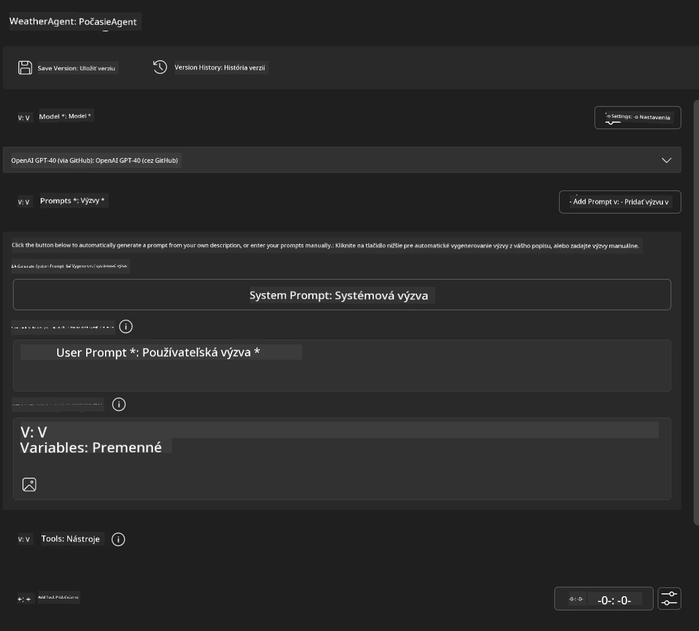
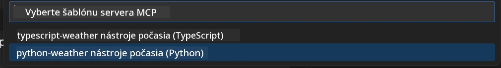
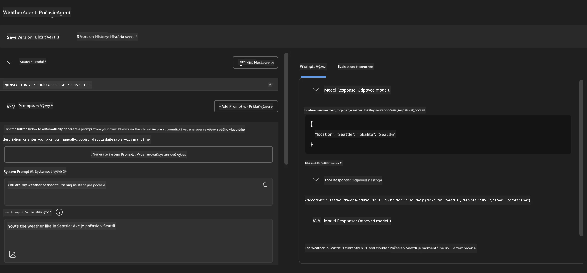
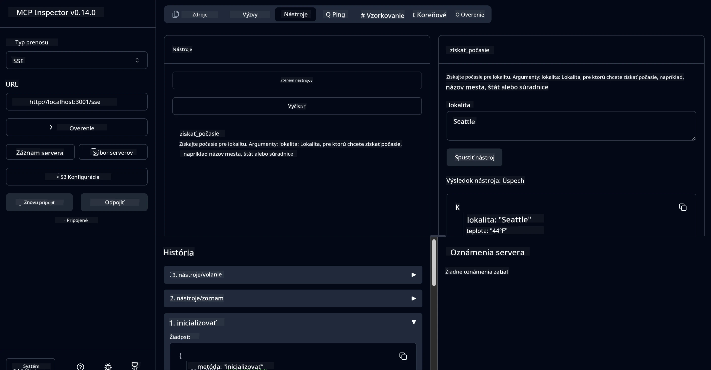

# 🔧 Modul 3: Pokročilý vývoj MCP s Microsoft Foundry Toolkit

> [!NOTE]
> URL adresy Inspektora v tejto laboratórii používajú starší koncový bod `/sse` a cieľom sú
> pripnuté závislosti MCP SDK `1.9.3` a Inspektora `0.14.0`. Nie sú to
> aktuálne príklady Streamable HTTP z dátumu `2026-07-28`.


## 🎯 Ciele učenia

Na konci tejto laboratórie budete schopní:

- ✅ Vytvárať vlastné MCP servery pomocou Microsoft Foundry Toolkit
- ✅ Konfigurovať a používať najnovšie MCP Python SDK (verzia 1.9.3)
- ✅ Nastaviť a využívať MCP Inspektor na ladenie
- ✅ Ladiť MCP servery v prostredí Agent Builder aj Inspektora
- ✅ Pochopiť pokročilé pracovné postupy vývoja MCP serverov

## 📋 Predpoklady

- Dokončenie laboratória 2 (Základy MCP)
- VS Code s rozšírením Microsoft Foundry Toolkit
- Prostredie Python 3.10+
- Node.js a npm na nastavenie Inspektora

## 🏗️ Čo vybudujete

V tejto laboratórii vytvoríte **Weather MCP Server**, ktorý demonštruje:
- Vlastnú implementáciu MCP servera
- Integráciu s Microsoft Foundry Toolkit Agent Builderom
- Profesionálne pracovné postupy ladenia
- Moderné vzory používania MCP SDK

---

## 🔧 Prehľad základných komponentov

### 🐍 MCP Python SDK
Model Context Protocol Python SDK poskytuje základ pre vývoj vlastných MCP serverov. Použijete verziu 1.9.3 s rozšírenými ladiacimi možnosťami.

### 🔍 MCP Inspektor
Výkonný nástroj na ladenie, ktorý ponúka:
- Monitorovanie servera v reálnom čase
- Vizualizáciu vykonávania nástrojov
- Kontrolu sieťových požiadaviek/odpovedí
- Interaktívne testovacie prostredie

---

## 📖 Krok za krokom implementácia

### Krok 1: Vytvorte WeatherAgent v Agent Builderi

1. **Spustite Agent Builder** vo VS Code prostredníctvom rozšírenia Microsoft Foundry Toolkit
2. **Vytvorte nového agenta** s touto konfiguráciou:
   - Názov agenta: `WeatherAgent`



### Krok 2: Inicializujte MCP Server Projekt

1. **Prejdite do Tools** → **Add Tool** v Agent Builderi
2. **Vyberte "MCP Server"** z dostupných možností
3. **Zvoľte "Create A new MCP Server"**
4. **Vyberte šablónu `python-weather`**
5. **Pomenujte svoj server:** `weather_mcp`



### Krok 3: Otvorte a preskúmajte projekt

1. **Otvorte vygenerovaný projekt** vo VS Code
2. **Prejdite štruktúru projektu:**
   ```
   weather_mcp/
   ├── src/
   │   ├── __init__.py
   │   └── server.py
   ├── inspector/
   │   ├── package.json
   │   └── package-lock.json
   ├── .vscode/
   │   ├── launch.json
   │   └── tasks.json
   ├── pyproject.toml
   └── README.md
   ```

### Krok 4: Aktualizujte na najnovšie MCP SDK

> **🔍 Prečo aktualizovať?** Chceme používať najnovšie MCP SDK (verzia 1.9.3) a Inspektor (0.14.0) pre rozšírené funkcie a lepšie možnosti ladenia.

#### 4a. Aktualizujte Python závislosti

**Upravte `pyproject.toml`:** aktualizujte [./code/weather_mcp/pyproject.toml](../../../../10-StreamliningAIWorkflowsBuildingAnMCPServerWithAIToolkit/lab3/code/weather_mcp/pyproject.toml)


#### 4b. Aktualizujte konfiguráciu Inspektora

**Upravte `inspector/package.json`:** aktualizujte [./code/weather_mcp/inspector/package.json](../../../../10-StreamliningAIWorkflowsBuildingAnMCPServerWithAIToolkit/lab3/code/weather_mcp/inspector/package.json)

#### 4c. Aktualizujte závislosti Inspektora

**Upravte `inspector/package-lock.json`:** aktualizujte [./code/weather_mcp/inspector/package-lock.json](../../../../10-StreamliningAIWorkflowsBuildingAnMCPServerWithAIToolkit/lab3/code/weather_mcp/inspector/package-lock.json)

> **📝 Poznámka:** Tento súbor obsahuje rozsiahle definície závislostí. Nižšie je základná štruktúra – celý obsah zabezpečuje správne vyriešenie závislostí.


> **⚡ Kompletný zámok balíkov:** Kompletný package-lock.json obsahuje ~3000 riadkov definícií závislostí. Vyššie je kľúčová štruktúra – použite poskytnutý súbor pre úplné vyriešenie závislostí.

### Krok 5: Nakonfigurujte VS Code na ladenie

*Poznámka: Skopírujte súbor na uvedenej ceste a nahraďte zodpovedajúci lokálny súbor*

#### 5a. Aktualizujte konfiguráciu spustenia

**Upravte `.vscode/launch.json`:**

```json
{
  "version": "0.2.0",
  "configurations": [
    {
      "name": "Attach to Local MCP",
      "type": "debugpy",
      "request": "attach",
      "connect": {
        "host": "localhost",
        "port": 5678
      },
      "presentation": {
        "hidden": true
      },
      "internalConsoleOptions": "neverOpen",
      "postDebugTask": "Terminate All Tasks"
    },
    {
      "name": "Launch Inspector (Edge)",
      "type": "msedge",
      "request": "launch",
      "url": "http://localhost:6274?timeout=60000&serverUrl=http://localhost:3001/sse#tools",
      "cascadeTerminateToConfigurations": [
        "Attach to Local MCP"
      ],
      "presentation": {
        "hidden": true
      },
      "internalConsoleOptions": "neverOpen"
    },
    {
      "name": "Launch Inspector (Chrome)",
      "type": "chrome",
      "request": "launch",
      "url": "http://localhost:6274?timeout=60000&serverUrl=http://localhost:3001/sse#tools",
      "cascadeTerminateToConfigurations": [
        "Attach to Local MCP"
      ],
      "presentation": {
        "hidden": true
      },
      "internalConsoleOptions": "neverOpen"
    }
  ],
  "compounds": [
    {
      "name": "Debug in Agent Builder",
      "configurations": [
        "Attach to Local MCP"
      ],
      "preLaunchTask": "Open Agent Builder",
    },
    {
      "name": "Debug in Inspector (Edge)",
      "configurations": [
        "Launch Inspector (Edge)",
        "Attach to Local MCP"
      ],
      "preLaunchTask": "Start MCP Inspector",
      "stopAll": true
    },
    {
      "name": "Debug in Inspector (Chrome)",
      "configurations": [
        "Launch Inspector (Chrome)",
        "Attach to Local MCP"
      ],
      "preLaunchTask": "Start MCP Inspector",
      "stopAll": true
    }
  ]
}
```

**Upravte `.vscode/tasks.json`:**

```
{
  "version": "2.0.0",
  "tasks": [
    {
      "label": "Start MCP Server",
      "type": "shell",
      "command": "python -m debugpy --listen 127.0.0.1:5678 src/__init__.py sse",
      "isBackground": true,
      "options": {
        "cwd": "${workspaceFolder}",
        "env": {
          "PORT": "3001"
        }
      },
      "problemMatcher": {
        "pattern": [
          {
            "regexp": "^.*$",
            "file": 0,
            "location": 1,
            "message": 2
          }
        ],
        "background": {
          "activeOnStart": true,
          "beginsPattern": ".*",
          "endsPattern": "Application startup complete|running"
        }
      }
    },
    {
      "label": "Start MCP Inspector",
      "type": "shell",
      "command": "npm run dev:inspector",
      "isBackground": true,
      "options": {
        "cwd": "${workspaceFolder}/inspector",
        "env": {
          "CLIENT_PORT": "6274",
          "SERVER_PORT": "6277",
        }
      },
      "problemMatcher": {
        "pattern": [
          {
            "regexp": "^.*$",
            "file": 0,
            "location": 1,
            "message": 2
          }
        ],
        "background": {
          "activeOnStart": true,
          "beginsPattern": "Starting MCP inspector",
          "endsPattern": "Proxy server listening on port"
        }
      },
      "dependsOn": [
        "Start MCP Server"
      ]
    },
    {
      "label": "Open Agent Builder",
      "type": "shell",
      "command": "echo ${input:openAgentBuilder}",
      "presentation": {
        "reveal": "never"
      },
      "dependsOn": [
        "Start MCP Server"
      ],
    },
    {
      "label": "Terminate All Tasks",
      "command": "echo ${input:terminate}",
      "type": "shell",
      "problemMatcher": []
    }
  ],
  "inputs": [
    {
      "id": "openAgentBuilder",
      "type": "command",
      "command": "ai-mlstudio.agentBuilder",
      "args": {
        "initialMCPs": [ "local-server-weather_mcp" ],
        "triggeredFrom": "vsc-tasks"
      }
    },
    {
      "id": "terminate",
      "type": "command",
      "command": "workbench.action.tasks.terminate",
      "args": "terminateAll"
    }
  ]
}
```


---

## 🚀 Spustenie a testovanie vášho MCP servera

### Krok 6: Inštalácia závislostí

Po vykonaní zmien konfigurácie spustite tieto príkazy:

**Nainštalujte Python závislosti:**
```bash
uv sync
```

**Nainštalujte závislosti Inspektora:**
```bash
cd inspector
npm install
```

### Krok 7: Ladenie v Agent Builderi

1. **Stlačte F5** alebo použite konfiguračný profil **"Debug in Agent Builder"**
2. **Vyberte zloženú konfiguráciu** z debug panela
3. **Počkajte, kým sa server spustí** a otvorí Agent Builder
4. **Otestujte svoj weather MCP server** pomocou prirodzených jazykových dotazov

Vstupný prompt ako tento

SYSTEM_PROMPT

```
You are my weather assistant
```

USER_PROMPT

```
How's the weather like in Seattle
```



### Krok 8: Ladenie s MCP Inspektorom

1. **Použite konfiguráciu "Debug in Inspector"** (Edge alebo Chrome)
2. **Otvorte rozhranie Inspektora** na `http://localhost:6274`
3. **Preskúmajte interaktívne testovacie prostredie:**
   - Prezerajte dostupné nástroje
   - Testujte vykonávanie nástrojov
   - Sledujte sieťové požiadavky
   - Ladiť odpovede servera



---

## 🎯 Kľúčové výsledky učenia

Dokončením tejto laboratórie ste:

- [x] **Vytvorili vlastný MCP server** pomocou šablón Microsoft Foundry Toolkit
- [x] **Aktualizovali na najnovšie MCP SDK** (verzia 1.9.3) pre lepšie funkcie
- [x] **Nakonfigurovali profesionálne pracovné postupy ladenia** pre Agent Builder aj Inspektora
- [x] **Nastavili MCP Inspektor** pre interaktívne testovanie servera
- [x] **Ovládate konfigurácie ladenia vo VS Code** pre vývoj MCP

## 🔧 Preskúmané pokročilé funkcie

| Funkcia | Popis | Použitie |
|---------|-------------|----------|
| **MCP Python SDK v1.9.3** | Najnovšia implementácia protokolu | Moderný vývoj servera |
| **MCP Inspektor 0.14.0** | Interaktívny nástroj na ladenie | Testovanie servera v reálnom čase |
| **VS Code ladenie** | Integrované vývojové prostredie | Profesionálny pracovný postup ladenia |
| **Integrácia Agent Buildera** | Priame prepojenie na Microsoft Foundry Toolkit | Komplexné testovanie agentov |

## 📚 Ďalšie zdroje

- [Dokumentácia MCP Python SDK](https://modelcontextprotocol.io/docs/sdk/python)
- [Návod na rozšírenie Microsoft Foundry Toolkit](https://code.visualstudio.com/docs/ai/ai-toolkit)
- [Dokumentácia ladenia vo VS Code](https://code.visualstudio.com/docs/editor/debugging)
- [Špecifikácia Model Context Protocol](https://modelcontextprotocol.io/docs/concepts/architecture)

---

**🎉 Gratulujeme!** Úspešne ste dokončili Laboratórium 3 a teraz viete vytvárať, ladiť a nasadzovať vlastné MCP servery s profesionálnymi vývojovými postupmi.

### 🔜 Pokračujte do ďalšieho modulu

Ste pripravení použiť svoje MCP zručnosti na reálny vývojový pracovný postup? Pokračujte do **[Modulu 4: Praktický vývoj MCP - Vlastný GitHub klonovací server](../lab4/README.md)**, kde budete:
- Vytvárať produkčne pripravený MCP server, ktorý automatizuje operácie s GitHub repozitármi
- Implementovať funkcie klonovania repozitárov GitHub cez MCP
- Integrovať vlastné MCP servery s VS Code a režimom GitHub Copilot Agent
- Testovať a nasadzovať vlastné MCP servery v produkčnom prostredí
- Učiť sa praktickú automatizáciu pracovných postupov pre vývojárov

---

<!-- CO-OP TRANSLATOR DISCLAIMER START -->
**Vyhlásenie o zodpovednosti**:
Tento dokument bol preložený pomocou AI prekladateľskej služby [Co-op Translator](https://github.com/Azure/co-op-translator). Hoci sa snažíme o presnosť, vezmite prosím na vedomie, že automatické preklady môžu obsahovať chyby alebo nepresnosti. Pôvodný dokument v jeho natívnom jazyku by mal byť považovaný za autoritatívny zdroj. Pre kritické informácie sa odporúča profesionálny ľudský preklad. Nie sme zodpovední za žiadne nedorozumenia alebo nesprávne interpretácie vyplývajúce z použitia tohto prekladu.
<!-- CO-OP TRANSLATOR DISCLAIMER END -->