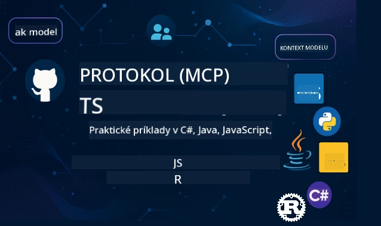

<!--
CO_OP_TRANSLATOR_METADATA:
{
  "original_hash": "35240f904db8c08d6198f6f15767d218",
  "translation_date": "2026-01-15T04:51:44+00:00",
  "source_file": "README.md",
  "language_code": "sk"
}
-->
 

[](https://GitHub.com/microsoft/mcp-for-beginners/graphs/contributors)
[](https://GitHub.com/microsoft/mcp-for-beginners/issues)
[](https://GitHub.com/microsoft/mcp-for-beginners/pulls)
[](http://makeapullrequest.com)

[](https://GitHub.com/microsoft/mcp-for-beginners/watchers)
[](https://GitHub.com/microsoft/mcp-for-beginners/fork)
[](https://GitHub.com/microsoft/mcp-for-beginners/stargazers)


[](https://discord.gg/nTYy5BXMWG)

Postupujte podľa týchto krokov, aby ste začali používať tieto zdroje:
1. **Vytvorte Fork úložiska**: Kliknite na [](https://GitHub.com/microsoft/mcp-for-beginners/fork)
2. **Klonujte úložisko**:   `git clone https://github.com/microsoft/mcp-for-beginners.git`
3. **Pripojte sa na** [](https://discord.gg/nTYy5BXMWG)


### 🌐 Podpora viacerých jazykov

#### Podporované cez GitHub Action (automatizované a vždy aktuálne)

<!-- CO-OP TRANSLATOR LANGUAGES TABLE START -->
[Arabčina](../ar/README.md) | [Bengálčina](../bn/README.md) | [Bulharčina](../bg/README.md) | [Burmčina (Myanmar)](../my/README.md) | [Čínština (zjednodušená)](../zh/README.md) | [Čínština (tradičná, Hong Kong)](../hk/README.md) | [Čínština (tradičná, Macau)](../mo/README.md) | [Čínština (tradičná, Taiwan)](../tw/README.md) | [Chorvátčina](../hr/README.md) | [Čeština](../cs/README.md) | [Dánčina](../da/README.md) | [Holandčina](../nl/README.md) | [Estónčina](../et/README.md) | [Fínčina](../fi/README.md) | [Francúzština](../fr/README.md) | [Nemčina](../de/README.md) | [Gréčtina](../el/README.md) | [Hebrejčina](../he/README.md) | [Hindi](../hi/README.md) | [Maďarčina](../hu/README.md) | [Indonézština](../id/README.md) | [Taliančina](../it/README.md) | [Japončina](../ja/README.md) | [Kannadčina](../kn/README.md) | [Kórejčina](../ko/README.md) | [Litovčina](../lt/README.md) | [Malajčina](../ms/README.md) | [Malayalam](../ml/README.md) | [Maráthčina](../mr/README.md) | [Nepálčina](../ne/README.md) | [Nigérijský pidžin](../pcm/README.md) | [Nórčina](../no/README.md) | [Perzština (Farsi)](../fa/README.md) | [Poľština](../pl/README.md) | [Portugalčina (Brazília)](../br/README.md) | [Portugalčina (Portugalsko)](../pt/README.md) | [Punjabi (Gurmukhi)](../pa/README.md) | [Rumunčina](../ro/README.md) | [Ruština](../ru/README.md) | [Srbčina (cyrilika)](../sr/README.md) | [Slovenčina](./README.md) | [Slovinčina](../sl/README.md) | [Španielčina](../es/README.md) | [Swahilčina](../sw/README.md) | [Švédčina](../sv/README.md) | [Tagalog (Filipino)](../tl/README.md) | [Tamilčina](../ta/README.md) | [Telugčina](../te/README.md) | [Thajčina](../th/README.md) | [Turečtina](../tr/README.md) | [Ukrajinčina](../uk/README.md) | [Urdu](../ur/README.md) | [Vietnamsky](../vi/README.md)

> **Radšej klonovať lokálne?**

> Toto úložisko obsahuje vyše 50 jazykových prekladov, čo výrazne zvyšuje veľkosť sťahovania. Ak chcete klonovať bez prekladov, použite sparse checkout:
> ```bash
> git clone --filter=blob:none --sparse https://github.com/microsoft/mcp-for-beginners.git
> cd mcp-for-beginners
> git sparse-checkout set --no-cone '/*' '!translations' '!translated_images'
> ```
> To vám poskytne všetko potrebné na dokončenie kurzu pri oveľa rýchlejšom stahovaní.
<!-- CO-OP TRANSLATOR LANGUAGES TABLE END -->

# 🚀 Kurz protokolu modelového kontextu (MCP) pre začiatočníkov

## **Naučte sa MCP cez praktické príklady kódu v C#, Java, JavaScript, Rust, Python a TypeScript**

## 🧠 Prehľad kurzu protokolu modelového kontextu
Vitajte na vašej ceste do sveta Model Context Protocol! Ak ste sa niekedy zamýšľali nad tým, ako AI aplikácie komunikujú s rôznymi nástrojmi a službami, chystáte sa objaviť elegantné riešenie, ktoré mení spôsob, akým vývojári vytvárajú inteligentné systémy.

MCP si predstavte ako univerzálneho prekladateľa pre AI aplikácie – rovnako ako USB porty umožňujú pripojiť akékoľvek zariadenie k vášmu počítaču, MCP umožňuje AI modelom pripojiť sa ku ktorémukoľvek nástroju alebo službe štandardizovaným spôsobom. Či už tvoríte svoj prvý chatbot alebo pracujete na komplexných AI workflowoch, pochopenie MCP vám dá silu vytvárať schopnejšie a flexibilnejšie aplikácie.

Tento kurz je navrhnutý s trpezlivosťou a starostlivosťou o vašu učebnú cestu. Začneme s jednoduchými konceptmi, ktoré už poznáte, a postupne budeme rozvíjať vaše schopnosti praktickým cvičením vo vašom obľúbenom programovacom jazyku. Každý krok obsahuje zrozumiteľné vysvetlenia, praktické príklady a množstvo povzbudenia.

Keď túto cestu dokončíte, budete si istí v tvorbe vlastných MCP serverov, ich integrácii s populárnymi AI platformami a pochopení, ako táto technológia formuje budúcnosť vývoja AI. Poďme spolu začať toto vzrušujúce dobrodružstvo!

### Oficiálna dokumentácia a špecifikácie

Tieto zdroje budú hodnotnejšie, ako bude vaše porozumenie rásť, ale necíťte tlak, že musíte hneď čítať všetko. Začnite s oblasťami, ktoré vás najviac zaujímajú!
- 📘 [MCP Dokumentácia](https://modelcontextprotocol.io/) – Toto je váš hlavný zdroj krok-za-krokom tutoriálov a používateľských príručiek. Dokumentácia je písaná s ohľadom na začiatočníkov, poskytuje jasné príklady, podľa ktorých sa môžete učiť vlastným tempom.
- 📜 [MCP Špecifikácia](https://modelcontextprotocol.io/docs/) – Považujte ju za svoj komplexný referenčný manuál. Počas kurzu sa sem budete často vracať, aby ste si overili konkrétne detaily a preskúmali pokročilé funkcie.
- 📜 [Pôvodná MCP špecifikácia](https://modelcontextprotocol.io/specification/versioning) – Obsahuje ďalšie technické detaily vhodné pre pokročilé implementácie. Je tu, keď ju potrebujete, ale pri štarte sa ňou nemusíte trápiť.
- 🧑‍💻 [MCP GitHub úložisko](https://github.com/modelcontextprotocol) – Nájdete tu SDK, nástroje a ukážky kódu v rôznych programovacích jazykoch. Je to pokladnica praktických príkladov a hotových komponentov.
- 🌐 [MCP Komunita](https://github.com/orgs/modelcontextprotocol/discussions) – Pridajte sa k ďalším študentom a skúseným vývojárom v diskusiách o MCP. Je to podporná komunita, kde sú otázky vítané a vedomosti sa slobodne zdieľajú.
  
## Výukové ciele

Po dokončení tohto kurzu budete cítiť istotu a nadšenie zo svojich nových schopností. Toto dosiahnete:

• **Pochopiť základy MCP**: Získate predstavu, čo je Model Context Protocol a prečo mení spôsob spolupráce AI aplikácií, a to pomocou príkladov a analógií, ktoré vám budú dávať zmysel.

• **Vytvoriť svoj prvý MCP server**: Vytvoríte funkčný MCP server v preferovanom programovacom jazyku, začínajúc jednoduchými príkladmi, ktoré vás krok po kroku pripravujú.

• **Pripojiť AI modely k reálnym nástrojom**: Naučíte sa premostiť AI modely so skutočnými službami, čo vašim aplikáciám dodá nové silné schopnosti.

• **Implementovať bezpečnostné najlepšie praktiky**: Pochopíte, ako zabezpečiť svoje MCP implementácie, chrániť aplikácie i používateľov.

• **Nasadiť s istotou**: Budete vedieť, ako dostať svoje MCP projekty z vývoja do produkcie s praktickými stratégiami fungujúcimi v reálnom svete.

• **Pripojiť sa ku komunite MCP**: Stanete sa súčasťou rastúcej komunity vývojárov formujúcich budúcnosť vývoja AI aplikácií.

## Základné poznatky

Predtým, než sa ponoríme do detailov MCP, uistime sa, že vám sú pohodlné niektoré základné pojmy. Nebojte sa, že nemusíte byť odborníkom – všetko vám vysvetlíme počas cesty!

### Pochopenie protokolov (základ)

Protokol si predstavte ako pravidlá pre konverzáciu. Keď voláte kamarátovi, obaja viete, že sa pozdravíte „ahoj“, striedate sa v rozprávaní a nakoniec si poviete „dovidenia“. Počítačové programy potrebujú podobné pravidlá na efektívnu komunikáciu.

MCP je protokol – súbor dohodnutých pravidiel, ktoré umožňujú AI modelom a aplikáciám viesť produktívne „rozhovory“ s nástrojmi a službami. Tak ako pravidlá rozhovoru uľahčujú ľudskú komunikáciu, MCP robí komunikáciu AI aplikácií spoľahlivejšou a výkonnejšou.

### Vzťahy klient-server (ako programy spolupracujú)

Vzťahy klient-server používate každý deň! Keď používate webový prehliadač (klient) na návštevu webu, pripájate sa na webový server, ktorý vám pošle obsah stránky. Prehliadač vie, ako požadovať údaje, a server vie, ako odpovedať.

V MCP máme podobný vzťah: AI modely sú klienti, ktorí žiadajú informácie alebo akcie, a MCP servery tieto schopnosti poskytujú. Je to ako mať pomocníka (server), ktorému môže AI povedať, čo má urobiť.

### Prečo je štandardizácia dôležitá (spolupráca na jednotnej úrovni)

Predstavte si, že každý výrobca áut používa iný tvar benzínovej hadice – museli by ste mať pre každé auto iný adaptér! Štandardizácia znamená dohodu na spoločných prístupoch, aby veci spolupracovali hladko.

MCP poskytuje túto štandardizáciu pre AI aplikácie. Namiesto toho, aby každému AI modelu chýbal vlastný kód pre každý nástroj, MCP vytvára univerzálny spôsob komunikácie. Vývojári tak môžu nástroje vytvoriť raz a používať ich s mnoho AI systémami.

## 🧭 Prehľad vašej učebnej cesty

Vaša cesta MCP je starostlivo zostavená tak, aby postupne budovala vašu istotu a schopnosti. Každá fáza predstavuje nové koncepty a zároveň posilňuje to, čo už viete.

### 🌱 Fáza Základov: Pochopenie základov (Moduly 0-2)

Tu začína vaše dobrodružstvo! Predstavíme vám koncepcie MCP pomocou známych analógií a jednoduchých príkladov. Pochopíte, čo MCP je, prečo existuje a ako zapadá do širšieho sveta AI vývoja.

• **Modul 0 - Úvod do MCP**: Začneme preskúmaním, čo MCP je a prečo je také dôležité pre moderné AI aplikácie. Uvidíte reálne príklady MCP v praxi a pochopíte, ako rieši bežné problémy vývojárov.

• **Modul 1 - Vysvetlenie základných konceptov**: Tu sa naučíte hlavné stavebné kamene MCP. Použijeme veľa analógií a vizuálnych príkladov, aby boli tieto koncepty prirodzené a pochopiteľné.

• **Modul 2 - Bezpečnosť v MCP**: Bezpečnosť môže znieť desivo, no ukážeme vám, ako MCP má zabudované bezpečnostné prvky a naučíme vás najlepšie praktiky na ochranu vašich aplikácií od začiatku.

### 🔨 Fáza Budovania: Tvorba prvých implementácií (Modul 3)

Teraz začína skutočná zábava! Získate praktické skúsenosti s tvorbou skutočných MCP serverov a klientov. Nebojte sa – začneme jednoducho a prevedieme vás každým krokom.

Tento modul obsahuje viaceré praktické návody, kde si môžete cvičiť vo vašom preferovanom programovacom jazyku. Vytvoríte svoj prvý server, postavíte klienta na jeho pripojenie a dokonca integrujete do populárnych vývojových nástrojov ako VS Code.

Každý návod obsahuje kompletné príklady kódu, tipy na riešenie problémov a vysvetlenia, prečo robíme konkrétne návrhové rozhodnutia. Po skončení tejto fázy budete mať funkčné MCP implementácie, na ktoré môžete byť hrdí!
### 🚀 Fáza rastu: Pokročilé koncepty a aplikácia v reálnom svete (Moduly 4-5)

Keď zvládnete základy, ste pripravení preskúmať sofistikovanejšie funkcie MCP. Pokryjeme praktické implementačné stratégie, techniky ladenia a pokročilé témy ako multimodálna AI integrácia.

Naučíte sa tiež, ako škálovať svoje MCP implementácie pre produkčné použitie a integrovať sa s cloudovými platformami ako Azure. Tieto moduly vás pripravia na tvorbu MCP riešení, ktoré dokážu zvládať požiadavky reálneho sveta.

### 🌟 Fáza majstrovstva: Komunita a špecializácia (Moduly 6-11)

Záverečná fáza sa zameriava na zapojenie do MCP komunity a špecializáciu v oblastiach, ktoré vás najviac zaujímajú. Naučíte sa, ako prispievať k open-source MCP projektom, implementovať pokročilé autentifikačné vzory a budovať komplexné riešenia integrované s databázami.

Modul 11 si zaslúži osobitnú zmienku – je to kompletná 13-laboratórna praktická učebná cesta, ktorá vás naučí stavať produkčne pripravené MCP servery s integráciou PostgreSQL. Je to ako záverečný projekt, ktorý spája všetko, čo ste sa naučili!

### 📚 Kompletná štruktúra kurikula

| Modul | Téma | Popis | Odkaz |
|--------|-------|-------------|------|
| **Moduly 1-3: Základy** | | | |
| 00 | Úvod do MCP | Prehľad Model Context Protocol a jeho význam v AI pipeline | [Čítať viac](./00-Introduction/README.md) |
| 01 | Vysvetlenie jadrových konceptov | Hlboký prieskum základných konceptov MCP | [Čítať viac](./01-CoreConcepts/README.md) |
| 02 | Bezpečnosť v MCP | Hrozby bezpečnosti a najlepšie praktiky | [Čítať viac](./02-Security/README.md) |
| 03 | Začíname s MCP | Nastavenie prostredia, základné servery/klienti, integrácia | [Čítať viac](./03-GettingStarted/README.md) |
| **Modul 3: Budovanie vášho prvého servera a klienta** | | | |
| 3.1 | Prvý server | Vytvorte svoj prvý MCP server | [Sprievodca](./03-GettingStarted/01-first-server/README.md) |
| 3.2 | Prvý klient | Vypracovanie základného MCP klienta | [Sprievodca](./03-GettingStarted/02-client/README.md) |
| 3.3 | Klient s LLM | Integrácia veľkých jazykových modelov | [Sprievodca](./03-GettingStarted/03-llm-client/README.md) |
| 3.4 | Integrácia VS Code | Používajte MCP servery vo VS Code | [Sprievodca](./03-GettingStarted/04-vscode/README.md) |
| 3.5 | stdio server | Vytvorenie serverov využívajúcich stdio transport | [Sprievodca](./03-GettingStarted/05-stdio-server/README.md) |
| 3.6 | HTTP streamovanie | Implementácia HTTP streamovania v MCP | [Sprievodca](./03-GettingStarted/06-http-streaming/README.md) |
| 3.7 | AI Toolkit | Použitie AI Toolkit s MCP | [Sprievodca](./03-GettingStarted/07-aitk/README.md) |
| 3.8 | Testovanie | Testovanie implementácie MCP servera | [Sprievodca](./03-GettingStarted/08-testing/README.md) |
| 3.9 | Nasadenie | Nasadenie MCP serverov do produkcie | [Sprievodca](./03-GettingStarted/09-deployment/README.md) |
| 3.10 | Pokročilé použitie servera | Používanie pokročilých serverov pre rozšírené funkcie a lepšiu architektúru | [Sprievodca](./03-GettingStarted/10-advanced/README.md) |
| 3.11 | Jednoduchá autentifikácia | Kapitola ukazujúca autentifikáciu od základu a RBAC | [Sprievodca](./03-GettingStarted/11-simple-auth/README.md) |
| **Moduly 4-5: Praktické & Pokročilé** | | | |
| 04 | Praktická implementácia | SDK, ladenie, testovanie, znovu použiteľné šablóny promptov | [Čítať viac](./04-PracticalImplementation/README.md) |
| 05 | Pokročilé témy v MCP | Multimodálna AI, škálovanie, podnikové použitie | [Čítať viac](./05-AdvancedTopics/README.md) |
| 5.1 | Integrácia s Azure | MCP integrácia s Azure | [Sprievodca](./05-AdvancedTopics/mcp-integration/README.md) |
| 5.2 | Multimodalita | Práca s viacerými modalitami | [Sprievodca](./05-AdvancedTopics/mcp-multi-modality/README.md) |
| 5.3 | Demo OAuth2 | Implementácia OAuth2 autentifikácie | [Sprievodca](./05-AdvancedTopics/mcp-oauth2-demo/README.md) |
| 5.4 | Root Contexts | Pochopenie a implementácia root kontextov | [Sprievodca](./05-AdvancedTopics/mcp-root-contexts/README.md) |
| 5.5 | Smerovanie | Stratégie smerovania v MCP | [Sprievodca](./05-AdvancedTopics/mcp-routing/README.md) |
| 5.6 | Výber vzoriek | Techniky vzorkovania v MCP | [Sprievodca](./05-AdvancedTopics/mcp-sampling/README.md) |
| 5.7 | Škálovanie | Škálovanie MCP implementácií | [Sprievodca](./05-AdvancedTopics/mcp-scaling/README.md) |
| 5.8 | Bezpečnosť | Pokročilé bezpečnostné úvahy | [Sprievodca](./05-AdvancedTopics/mcp-security/README.md) |
| 5.9 | Webové vyhľadávanie | Implementácia schopností webového vyhľadávania | [Sprievodca](./05-AdvancedTopics/web-search-mcp/README.md) |
| 5.10 | Realtime streamovanie | Budovanie realtime streamovacích funkcií | [Sprievodca](./05-AdvancedTopics/mcp-realtimestreaming/README.md) |
| 5.11 | Realtime vyhľadávanie | Implementácia realtime vyhľadávania | [Sprievodca](./05-AdvancedTopics/mcp-realtimesearch/README.md) |
| 5.12 | Entra ID autentifikácia | Autentifikácia s Microsoft Entra ID | [Sprievodca](./05-AdvancedTopics/mcp-security-entra/README.md) |
| 5.13 | Foundry integrácia | Integrácia s Azure AI Foundry | [Sprievodca](./05-AdvancedTopics/mcp-foundry-agent-integration/README.md) |
| 5.14 | Context engineering | Techniky efektívneho navrhovania kontextu | [Sprievodca](./05-AdvancedTopics/mcp-contextengineering/README.md) |
| 5.15 | Vlastný MCP transport | Implementácie vlastného transportu | [Sprievodca](./05-AdvancedTopics/mcp-transport/README.md) |
| **Moduly 6-10: Komunita & Najlepšie praktiky** | | | |
| 06 | Príspevky komunity | Ako prispievať do MCP ekosystému | [Sprievodca](./06-CommunityContributions/README.md) |
| 07 | Poučenia z raného nasadenia | Príbehy o reálnych implementáciách | [Sprievodca](./07-LessonsFromEarlyAdoption/README.md) |
| 08 | Najlepšie praktiky pre MCP | Výkon, odolnosť proti chybám, spoľahlivosť | [Sprievodca](./08-BestPractices/README.md) |
| 09 | Štúdie prípadov MCP | Praktické príklady implementácie | [Sprievodca](./09-CaseStudy/README.md) |
| 10 | Praktický workshop | Budovanie MCP servera s AI Toolkit | [Lab](./10-StreamliningAIWorkflowsBuildingAnMCPServerWithAIToolkit/README.md) |
| **Modul 11: Praktické laby MCP servera** | | | |
| 11 | Integrácia MCP servera s databázou | Kompletná 13-laboratórna praktická učebná cesta pre integráciu PostgreSQL | [Laby](./11-MCPServerHandsOnLabs/README.md) |
| 11.1 | Úvod | Prehľad MCP s integráciou databázy a retail analýzy | [Lab 00](./11-MCPServerHandsOnLabs/00-Introduction/README.md) |
| 11.2 | Jadro architektúry | Pochopenie architektúry MCP servera, databázové vrstvy a bezpečnostné vzory | [Lab 01](./11-MCPServerHandsOnLabs/01-Architecture/README.md) |
| 11.3 | Bezpečnosť & multitenantnosť | Row Level Security, autentifikácia a prístup k viacerým nájomcom | [Lab 02](./11-MCPServerHandsOnLabs/02-Security/README.md) |
| 11.4 | Nastavenie prostredia | Nastavenie vývojového prostredia, Docker, Azure zdroje | [Lab 03](./11-MCPServerHandsOnLabs/03-Setup/README.md) |
| 11.5 | Návrh databázy | Nastavenie PostgreSQL, návrh retail schémy a ukážkové dáta | [Lab 04](./11-MCPServerHandsOnLabs/04-Database/README.md) |
| 11.6 | Implementácia MCP servera | Budovanie FastMCP servera s integráciou databázy | [Lab 05](./11-MCPServerHandsOnLabs/05-MCP-Server/README.md) |
| 11.7 | Vývoj nástrojov | Tvorba nástrojov na dotazovanie databázy a introspekciu schémy | [Lab 06](./11-MCPServerHandsOnLabs/06-Tools/README.md) |
| 11.8 | Semantické vyhľadávanie | Implementácia vektorových embeddingov s Azure OpenAI a pgvector | [Lab 07](./11-MCPServerHandsOnLabs/07-Semantic-Search/README.md) |
| 11.9 | Testovanie & ladenie | Testovacie stratégie, nástroje na ladenie a validačné prístupy | [Lab 08](./11-MCPServerHandsOnLabs/08-Testing/README.md) |
| 11.10 | Integrácia VS Code | Konfigurácia MCP integrácie vo VS Code a používanie AI chat | [Lab 09](./11-MCPServerHandsOnLabs/09-VS-Code/README.md) |
| 11.11 | Nasadzovacie stratégie | Nasadenie cez Docker, Azure Container Apps a úvahy o škálovaní | [Lab 10](./11-MCPServerHandsOnLabs/10-Deployment/README.md) |
| 11.12 | Monitorovanie | Application Insights, logovanie, monitorovanie výkonu | [Lab 11](./11-MCPServerHandsOnLabs/11-Monitoring/README.md) |
| 11.13 | Najlepšie praktiky | Optimalizácia výkonu, tvrdenie bezpečnosti a tipy pre produkciu | [Lab 12](./11-MCPServerHandsOnLabs/12-Best-Practices/README.md) |

### 💻 Ukážkové projektové kódy

Jednou z najzaujímavejších častí učenia MCP je sledovať, ako sa vaše kódovacie schopnosti postupne rozvíjajú. Naše príklady kódu sú navrhnuté tak, aby začali jednoducho a postupne sa stávali sofistikovanejšími, ako sa vaše porozumenie prehlbuje. Tu je spôsob, ako zavádzame koncepty – kód, ktorý je ľahko pochopiteľný, ale zároveň demonštruje skutočné princípy MCP, takže budete rozumieť nielen tomu, čo kód robí, ale prečo je štruktúrovaný týmto spôsobom a ako zapadá do väčších MCP aplikácií.

#### Základné vzory MCP kalkulačky

| Jazyk | Popis | Odkaz |
|----------|-------------|------|
| C# | Príklad MCP servera | [Zobraziť kód](./03-GettingStarted/samples/csharp/README.md) |
| Java | MCP kalkulačka | [Zobraziť kód](./03-GettingStarted/samples/java/calculator/README.md) |
| JavaScript | MCP demo | [Zobraziť kód](./03-GettingStarted/samples/javascript/README.md) |
| Python | MCP server | [Zobraziť kód](../../03-GettingStarted/samples/python/mcp_calculator_server.py) |
| TypeScript | MCP príklad | [Zobraziť kód](./03-GettingStarted/samples/typescript/README.md) |
| Rust | MCP príklad | [Zobraziť kód](./03-GettingStarted/samples/rust/README.md) |

#### Pokročilé MCP implementácie

| Jazyk | Popis | Odkaz |
|----------|-------------|------|
| C# | Pokročilý príklad | [Zobraziť kód](./04-PracticalImplementation/samples/csharp/README.md) |
| Java so Spring | Príklad Container App | [Zobraziť kód](./04-PracticalImplementation/samples/java/containerapp/README.md) |
| JavaScript | Pokročilý príklad | [Zobraziť kód](./04-PracticalImplementation/samples/javascript/README.md) |
| Python | Komplexná implementácia | [Zobraziť kód](../../04-PracticalImplementation/samples/python/READMEmd) |
| TypeScript | Príklad kontajnera | [Zobraziť kód](./04-PracticalImplementation/samples/typescript/README.md) |


## 🎯 Predpoklady pre učenie MCP

Aby ste z tohto kurikula vyťažili maximum, mali by ste mať:

- Základné znalosti programovania aspoň v jednom z nasledujúcich jazykov: C#, Java, JavaScript, Python alebo TypeScript  
- Pochopenie klient-server modelu a API  
- Znalosť konceptov REST a HTTP  
- (Voliteľné) Základy v AI/ML konceptoch  

- Účasť v diskusiách našej komunity pre podporu  

## 📚 Študijný plán a zdroje

Tento repozitár obsahuje niekoľko zdrojov, ktoré vám pomôžu efektívne sa orientovať a učiť:

### Študijný plán

K dispozícii je komplexný [Študijný plán](./study_guide.md), ktorý vám pomôže efektívne sa orientovať v tomto repozitári. Táto vizuálna mapa kurikula ukazuje, ako sú všetky témy prepojené, a poskytuje návod, ako efektívne využívať ukážkové projekty. Je obzvlášť užitočný, ak ste vizuálny typ, ktorý rád vidí celkový obraz.

Sprievodca obsahuje:  
- Vizuálnu mapu kurikula so všetkými témami  
- Detailné rozdelenie každej časti repozitára  
- Návody na použitie ukážkových projektov  
- Odporúčané učebné cesty pre rôzne úrovne zručností  
- Doplnkové zdroje na podporu vášho učenia  

### Zoznam zmien

Udržiavame podrobný [Zoznam zmien](./changelog.md), ktorý sleduje všetky významné aktualizácie materiálov kurikula, takže môžete byť vždy informovaní o najnovších zlepšeniach a doplnkoch.  
- Nové obsahové doplnky  
- Štrukturálne zmeny  
- Vylepšenia funkcií  
- Aktualizácie dokumentácie  

## 🛠️ Ako efektívne používať toto kurikulum

Každá lekcia v tomto sprievodcovi obsahuje:

1. Jasné vysvetlenia MCP konceptov  
2. Živé príklady kódu v rôznych jazykoch  
3. Cvičenia na stavbu reálnych MCP aplikácií  
4. Extra zdroje pre pokročilých študentov
## Obsah na požiadanie

### [MCP Dev Days júl 2025](https://developer.microsoft.com/en-us/reactor/series/S-1563/)
#### [➡️Sledujte na požiadanie - MCP Dev Days](https://developer.microsoft.com/en-us/reactor/series/S-1563/)
Pripravte sa na dva dni hlbokých technických poznatkov, spojenia s komunitou a praktického učenia na MCP Dev Days, virtuálnej udalosti venovanej Model Context Protocol (MCP) — novému štandardu, ktorý prepája AI modely a nástroje, na ktorých závisia.
MCP Dev Days môžete sledovať po registrácii na našej stránke udalosti: https://aka.ms/mcpdevdays.

#### [Deň 1: MCP produktivita, DevTools a komunita:](https://developer.microsoft.com/en-us/reactor/series/S-1563/)

Je o posilnení vývojárov, aby používali MCP vo svojom vývojárskom pracovnom toku a o oslavovaní úžasnej MCP komunity. Pripoja sa k nám členovia komunity a partneri ako Arcade, Block, Okta a Neon, aby sme videli, ako spolupracujú so spoločnosťou Microsoft na tvorbe otvoreného a rozšíriteľného MCP ekosystému. Ukážky v reálnom svete cez VS Code, Visual Studio, GitHub Copilot a obľúbené komunitné nástroje
Praktické, kontextovo riadené vývojárske pracovné toky
Relácie a postrehy vedené komunitou
Či už začínate s MCP, alebo s ním už pracujete, Deň 1 vám poskytne inšpiráciu a praktické tipy.

#### [Deň 2: Budujte MCP servery s istotou](https://developer.microsoft.com/en-us/reactor/series/S-1563/)

Je pre tvorcov MCP. Pôjdeme do hĺbky implementačných stratégií a najlepších postupov pre tvorbu MCP serverov a integráciu MCP do vašich AI pracovných tokov.

#### Témy zahŕňajú:

- Budovanie MCP serverov a ich integrácia do prostredí agentov
- Vývoj riadený promptmi
- Najlepšie bezpečnostné postupy
- Používanie stavebných blokov ako Funkcie, ACA a správa API
- Zladenie registru a nástroje (1P + 3P)

Ak ste vývojár, tvorca nástrojov, alebo stratég AI produktov, tento deň je plný poznatkov, ktoré potrebujete na vytváranie škálovateľných, bezpečných a budúcnosti pripravených MCP riešení.

### MCP Boot Camp august 2025
Naučte sa v intenzívnych video lekciách, ako vytvárať MCP servery, integrovať s VS Code a profesionálne nasadzovať na Azure podľa obsahu z kurikula MCP pre začiatočníkov. Odídete s praktickými zručnosťami v technológii, ktorú už používajú veľké spoločnosti.

#### [➡️Sledujte na požiadanie MCP Bootcamp | Angličtina](https://developer.microsoft.com/en-us/reactor/series/s-1568/)
#### [➡️Sledujte na požiadanie MCP Bootcamp | Brazília](https://developer.microsoft.com/en-us/reactor/series/S-1566/)
#### [➡️Sledujte na požiadanie MCP Bootcamp | Španielčina](https://developer.microsoft.com/en-us/reactor/series/S-1567/)

### Poďme sa učiť MCP s C# – séria návodov
Poďme sa naučiť o Model Context Protocol (MCP), modernom rámci navrhnutom na štandardizáciu interakcií medzi AI modelmi a klientskymi aplikáciami. Prostredníctvom tejto priateľskej lekcie pre začiatočníkov vás zoznámime s MCP a prevedieme vás vytvorením vášho prvého MCP servera.
#### C#: [https://aka.ms/letslearnmcp-csharp](https://aka.ms/letslearnmcp-csharp)
#### Java: [https://aka.ms/letslearnmcp-java](https://aka.ms/letslearnmcp-java)
#### JavaScript: [https://aka.ms/letslearnmcp-javascript](https://aka.ms/letslearnmcp-javascript)
#### Python: [https://aka.ms/letslearnmcp-python](https://aka.ms/letslearnmcp-python)

## 🎓 Vaša cesta k MCP začína

Gratulujeme! Práve ste urobili prvý krok na vzrušujúcej ceste, ktorá rozšíri vaše programátorské schopnosti a pripojí vás k najmodernejšiemu vývoju AI.

### Čo ste už dosiahli

Tým, že ste si prečítali tento úvod, ste už začali budovať svoje základy poznania MCP. Chápete, čo je MCP, prečo je dôležitý, a ako vám tento kurz pomôže na vašej vzdelávacej ceste. To je veľký úspech a začiatok vašej expertízy v tejto dôležitej technológii.

### Dobrodružstvo, ktoré je pred vami

Ako budete postupovať jednotlivými modulmi, pamätajte, že každý expert bol raz začiatočníkom. Koncepty, ktoré sa teraz môžu zdať zložité, sa stanú samozrejmými, keď ich budete praktizovať a uplatňovať. Každý malý krok buduje silné schopnosti, ktoré vám budú slúžiť počas celej programátorskej kariéry.

### Vaša podporná sieť

Pridávate sa ku komunite študentov a odborníkov, ktorí majú vášeň pre MCP a sú ochotní pomôcť ostatným uspieť. Či už máte problém s kódovacou výzvou, alebo sa chcete podeliť o úspech, komunita je tu, aby vás podporila.

Ak sa zaseknete alebo máte otázky o tvorbe AI aplikácií, pripojte sa k diskusiám s ostatnými študentmi a skúsenými vývojármi o MCP. Je to podporná komunita, kde sú otázky vítané a vedomosti sa slobodne delia.

[](https://discord.gg/nTYy5BXMWG)

Ak máte spätnú väzbu na produkt alebo chyby počas vývoja, navštívte:

[](https://aka.ms/foundry/forum)

### Pripravený začať?

Vaše dobrodružstvo s MCP začína práve teraz! Začnite s Modulom 0, aby ste sa ponorili do prvých praktických skúseností s MCP, alebo si prezrite ukážkové projekty a uvidíte, čo budete tvoriť. Pamätajte – každý expert začínal presne tam, kde ste teraz vy, a s trpezlivosťou a praxou budete prekvapení, čo všetko dokážete.

Vitajte vo svete vývoja Model Context Protocol. Poďme spolu tvoriť niečo úžasné!

## 🤝 Prispievanie do vzdelávacej komunity

Tento kurz rastie vďaka príspevkom od študentov, ako ste vy! Či už opravujete preklep, navrhujete jasnejšie vysvetlenie alebo pridávate nový príklad, vaše príspevky pomáhajú ďalším začiatočníkom uspieť.

Vďaka Microsoft Valued Professional [Shivam Goyal](https://www.linkedin.com/in/shivam2003/) za príspevok kódových ukážok.

Proces prispievania je navrhnutý ako vítajúci a podporný. Väčšina príspevkov vyžaduje dohodu o licencii prispievateľa (CLA), ale automatizované nástroje vás tým procesom hladko prevedú.

## 📜 Otvorený zdroj učenia

Celý tento kurz je dostupný pod licenciou MIT [LICENSE](../../LICENSE), čo znamená, že ho môžete slobodne používať, upravovať a zdieľať. Tým podporujeme našu misiu sprístupniť poznatky o MCP vývojárom na celom svete.

## 🤝 Pravidlá prispievania

Tento projekt vítá príspevky a návrhy. Väčšina príspevkov vyžaduje, aby ste súhlasili s
Dohodou o licencii prispievateľa (CLA), v ktorej deklarujete, že máte právo a skutočne nám udeľujete
práva na použitie vášho príspevku. Pre podrobnosti navštívte <https://cla.opensource.microsoft.com>.

Keď odošlete pull request, CLA bot automaticky zistí, či je potrebné CLA poskytnúť,
a príslušne PR označí (napr. kontrola stavu, komentár). Stačí postupovať podľa pokynov
bota. Tento krok bude potrebné urobiť len raz pre všetky repozitáre používajúce náš CLA.

Tento projekt prijal [Microsoft Open Source Code of Conduct](https://opensource.microsoft.com/codeofconduct/).
Pre viac informácií si pozrite [FAQ k Etickému kódexu](https://opensource.microsoft.com/codeofconduct/faq/) alebo
kontaktujte [opencode@microsoft.com](mailto:opencode@microsoft.com) s ďalšími otázkami či pripomienkami.

---

*Pripravení začať svoju cestu s MCP? Začnite s [Modul 00 - Úvod do MCP](./00-Introduction/README.md) a urobte svoje prvé kroky vo svete vývoja Model Context Protocol!*

## 🎒 Ďalšie kurzy
Náš tím tvorí aj ďalšie kurzy! Pozrite si:

<!-- CO-OP TRANSLATOR OTHER COURSES START -->
### LangChain
[](https://aka.ms/langchain4j-for-beginners)
[](https://aka.ms/langchainjs-for-beginners?WT.mc_id=m365-94501-dwahlin)

---

### Azure / Edge / MCP / Agent
[](https://github.com/microsoft/AZD-for-beginners?WT.mc_id=academic-105485-koreyst)
[](https://github.com/microsoft/edgeai-for-beginners?WT.mc_id=academic-105485-koreyst)
[](https://github.com/microsoft/mcp-for-beginners?WT.mc_id=academic-105485-koreyst)
[](https://github.com/microsoft/ai-agents-for-beginners?WT.mc_id=academic-105485-koreyst)

---

### Séria Generatívnej AI
[](https://github.com/microsoft/generative-ai-for-beginners?WT.mc_id=academic-105485-koreyst)
[-9333EA?style=for-the-badge&labelColor=E5E7EB&color=9333EA)](https://github.com/microsoft/Generative-AI-for-beginners-dotnet?WT.mc_id=academic-105485-koreyst)
[-C084FC?style=for-the-badge&labelColor=E5E7EB&color=C084FC)](https://github.com/microsoft/generative-ai-for-beginners-java?WT.mc_id=academic-105485-koreyst)
[-E879F9?style=for-the-badge&labelColor=E5E7EB&color=E879F9)](https://github.com/microsoft/generative-ai-with-javascript?WT.mc_id=academic-105485-koreyst)

---

### Základné učenie
[](https://aka.ms/ml-beginners?WT.mc_id=academic-105485-koreyst)
[](https://aka.ms/datascience-beginners?WT.mc_id=academic-105485-koreyst)
[](https://aka.ms/ai-beginners?WT.mc_id=academic-105485-koreyst)
[](https://github.com/microsoft/Security-101?WT.mc_id=academic-96948-sayoung)
[](https://aka.ms/webdev-beginners?WT.mc_id=academic-105485-koreyst)
[](https://aka.ms/iot-beginners?WT.mc_id=academic-105485-koreyst)
[](https://github.com/microsoft/xr-development-for-beginners?WT.mc_id=academic-105485-koreyst)

---
 
### Séria Copilot
[](https://aka.ms/GitHubCopilotAI?WT.mc_id=academic-105485-koreyst)
[](https://github.com/microsoft/mastering-github-copilot-for-dotnet-csharp-developers?WT.mc_id=academic-105485-koreyst)
[](https://github.com/microsoft/CopilotAdventures?WT.mc_id=academic-105485-koreyst)
<!-- CO-OP TRANSLATOR OTHER COURSES END -->

---

<!-- CO-OP TRANSLATOR DISCLAIMER START -->
**Vyhlásenie o zodpovednosti**:  
Tento dokument bol preložený pomocou AI prekladateľskej služby [Co-op Translator](https://github.com/Azure/co-op-translator). Aj keď sa snažíme o presnosť, berte prosím na vedomie, že automatické preklady môžu obsahovať chyby alebo nepresnosti. Originálny dokument v jeho pôvodnom jazyku by mal byť považovaný za autoritatívny zdroj. Pre kritické informácie sa odporúča profesionálny ľudský preklad. Nie sme zodpovední za žiadne nedorozumenia alebo nesprávne interpretácie vyplývajúce z použitia tohto prekladu.
<!-- CO-OP TRANSLATOR DISCLAIMER END -->