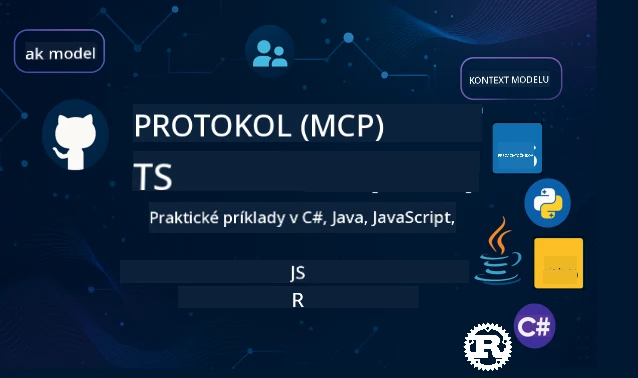

 

[](https://GitHub.com/microsoft/mcp-for-beginners/graphs/contributors)
[](https://GitHub.com/microsoft/mcp-for-beginners/issues)
[](https://GitHub.com/microsoft/mcp-for-beginners/pulls)
[](http://makeapullrequest.com)

[](https://GitHub.com/microsoft/mcp-for-beginners/watchers)
[](https://GitHub.com/microsoft/mcp-for-beginners/fork)
[](https://GitHub.com/microsoft/mcp-for-beginners/stargazers)


[](https://discord.gg/nTYy5BXMWG)

Nasledujte tieto kroky, aby ste začali používať tieto zdroje:
1. **Vytvorte fork repozitára**: Kliknite na [](https://GitHub.com/microsoft/mcp-for-beginners/fork)
2. **Naklonujte repozitár**:  `git clone https://github.com/microsoft/mcp-for-beginners.git`
3. **Pripojte sa k** [](https://discord.gg/nTYy5BXMWG)


### 🌐 Podpora viacerých jazykov

#### Podporované cez GitHub Action (automaticky a vždy aktuálne)

<!-- CO-OP TRANSLATOR LANGUAGES TABLE START -->
[Arabčina](../ar/README.md) | [Bengálčina](../bn/README.md) | [Bulharčina](../bg/README.md) | [Barmčina (Myanmar)](../my/README.md) | [Čínština (zjednodušená)](../zh-CN/README.md) | [Čínština (tradičná, Hong Kong)](../zh-HK/README.md) | [Čínština (tradičná, Macau)](../zh-MO/README.md) | [Čínština (tradičná, Taiwan)](../zh-TW/README.md) | [Chorvátčina](../hr/README.md) | [Čeština](../cs/README.md) | [Dánčina](../da/README.md) | [Holandčina](../nl/README.md) | [Estónčina](../et/README.md) | [Fínčina](../fi/README.md) | [Francúzština](../fr/README.md) | [Nemčina](../de/README.md) | [Gréčtina](../el/README.md) | [Hebrejčina](../he/README.md) | [Hindi](../hi/README.md) | [Maďarčina](../hu/README.md) | [Indonézština](../id/README.md) | [Taliančina](../it/README.md) | [Japončina](../ja/README.md) | [Kannadčina](../kn/README.md) | [Kórejčina](../ko/README.md) | [Litovčina](../lt/README.md) | [Malajčina](../ms/README.md) | [Malayalam](../ml/README.md) | [Maráthčina](../mr/README.md) | [Nepálčina](../ne/README.md) | [Nigérijská pidžinčina](../pcm/README.md) | [Nórčina](../no/README.md) | [Perzština (Farsí)](../fa/README.md) | [Poľština](../pl/README.md) | [Portugalčina (Brazília)](../pt-BR/README.md) | [Portugalčina (Portugalsko)](../pt-PT/README.md) | [Pandžábčina (Gurmukhi)](../pa/README.md) | [Rumunčina](../ro/README.md) | [Ruština](../ru/README.md) | [Srbčina (Cyrilika)](../sr/README.md) | [Slovenčina](./README.md) | [Slovinčina](../sl/README.md) | [Španielčina](../es/README.md) | [Swahilčina](../sw/README.md) | [Švédčina](../sv/README.md) | [Tagalog (Filipínčina)](../tl/README.md) | [Tamilčina](../ta/README.md) | [Telugčina](../te/README.md) | [Thajčina](../th/README.md) | [Turečtina](../tr/README.md) | [Ukrajinčina](../uk/README.md) | [Urdčina](../ur/README.md) | [Vietnamčina](../vi/README.md)

> **Radšej klonovať lokálne?**
>
> Tento repozitár obsahuje viac ako 50 jazykových prekladov, čo výrazne zväčšuje veľkosť sťahovania. Ak chcete klonovať bez prekladov, použite sparse checkout:
>
> **Bash / macOS / Linux:**
> ```bash
> git clone --filter=blob:none --sparse https://github.com/microsoft/mcp-for-beginners.git
> cd mcp-for-beginners
> git sparse-checkout set --no-cone '/*' '!translations' '!translated_images'
> ```
>
> **CMD (Windows):**
> ```cmd
> git clone --filter=blob:none --sparse https://github.com/microsoft/mcp-for-beginners.git
> cd mcp-for-beginners
> git sparse-checkout set --no-cone "/*" "!translations" "!translated_images"
> ```
>
> Týmto získate všetko potrebné na dokončenie kurzu s oveľa rýchlejším sťahovaním.
<!-- CO-OP TRANSLATOR LANGUAGES TABLE END -->

# 🚀 Kurz Model Context Protocol (MCP) pre začiatočníkov

## **Naučte sa MCP cez praktické kódové príklady v C#, Java, JavaScript, Rust, Python a TypeScript**

## 🧠 Prehľad kurzu Model Context Protocol
Vitajte na vašej ceste do sveta Model Context Protocol! Ak ste sa niekedy pýtali, ako AI aplikácie komunikujú s rôznymi nástrojmi a službami, chystáte sa objaviť elegantné riešenie, ktoré mení spôsob, akým vývojári vytvárajú inteligentné systémy.

Myslite na MCP ako na univerzálny prekladač pre AI aplikácie – podobne ako USB porty umožňujú pripojiť akékoľvek zariadenie k počítaču, MCP umožňuje AI modelom pripojiť sa ku každému nástroju alebo službe štandardizovaným spôsobom. Či už vytvárate svoj prvý chatbot alebo pracujete na komplexných AI pracovných tokoch, pochopenie MCP vám dá silu vytvárať schopnejšie a flexibilnejšie aplikácie.

Tento kurz je navrhnutý s trpezlivosťou a starostlivosťou o vašu učebnú cestu. Začneme jednoduchými konceptmi, ktoré už poznáte, a postupne budeme budovať vaše skúsenosti cez praktické cvičenia vo vašom obľúbenom programovacom jazyku. Každý krok obsahuje jasné vysvetlenia, praktické príklady a veľa povzbudenia na ceste.

Keď dokončíte túto cestu, budete si istí, ako vybudovať vlastné MCP servery, integrovať ich s populárnymi AI platformami a pochopíte, ako táto technológia mení budúcnosť vývoja AI. Poďme začať toto vzrušujúce dobrodružstvo spolu!

### Oficiálna dokumentácia a špecifikácie

Tento kurz je zosúladený s **MCP Špecifikáciou 2025-11-25** (najnovšie stabilné vydanie). MCP špecifikácia používa časové označenie verzií podľa dátumu (formát RRRR-MM-DD) pre jasné sledovanie verzií protokolu.

Tieto zdroje získavajú na hodnote, ako budete lepšie rozumieť, ale necíťte sa pod tlakom, že musíte všetko čítať ihneď. Začnite oblasťami, ktoré vás najviac zaujímajú!
- 📘 [MCP Dokumentácia](https://modelcontextprotocol.io/) – Toto je váš hlavný zdroj na postupné návody a používateľské príručky. Dokumentácia je písaná s ohľadom na začiatočníkov a poskytuje jasné príklady, podľa ktorých môžete postupovať vlastným tempom.
- 📜 [MCP Špecifikácia](https://modelcontextprotocol.io/specification/2025-11-25) – Považujte ju za svoj komplexný referenčný manuál. Počas kurzu sa sem často vrátite, aby ste si vyhľadali konkrétne detaily a preskúmali pokročilé funkcie.
- 📜 [Verziovanie MCP Špecifikácie](https://modelcontextprotocol.io/specification/versioning) – Obsahuje informácie o histórii verzií protokolu a o tom, ako MCP používa dátumové označenie verzií (formát RRRR-MM-DD).
- 🧑‍💻 [MCP GitHub Repozitár](https://github.com/modelcontextprotocol) – Nájdete tu SDK, nástroje a ukážky kódu v rôznych programovacích jazykoch. Je to ako pokladnica praktických príkladov a hotových komponentov.
- 🌐 [MCP Komunita](https://github.com/orgs/modelcontextprotocol/discussions) – Pripojte sa k ostatným študentom a skúseným vývojárom v diskusiách o MCP. Je to podporujúca komunita, kde sú otázky vítané a vedomosti sa slobodne zdieľajú.
  
## Ciele učenia

Na konci tohto kurzu sa budete cítiť sebavedomí a nadšení z vašich nových schopností. Tu je, čo dosiahnete:

• **Pochopenie základov MCP**: Pochopíte, čo je Model Context Protocol a prečo mení spôsob, akým spolu AI aplikácie komunikujú, pomocou analógií a príkladov, ktoré dávajú zmysel.

• **Vytvorenie prvého MCP servera**: Vybudujete pracujúci MCP server vo vašom preferovanom programovacom jazyku, začínajúc jednoduchými príkladmi a postupne si zvyšujúc zručnosti.

• **Prepojenie AI modelov s reálnymi nástrojmi**: Naučíte sa, ako spojiť AI modely so skutočnými službami, čím vašim aplikáciám pridáte silné nové schopnosti.

• **Implementácia bezpečnostných postupov**: Pochopíte, ako udržať vaše MCP implementácie bezpečné, chrániac ako vaše aplikácie, tak aj vašich používateľov.

• **Dôverné nasadenie**: Naučíte sa, ako previesť svoje MCP projekty z vývoja do produkcie, s praktickými stratégiami nasadenia, ktoré fungujú v reálnom svete.

• **Pripojenie ku komunite MCP**: Stanete sa súčasťou rastúcej komunity vývojárov, ktorí formujú budúcnosť vývoja AI aplikácií.

## Základné poznatky

Predtým, než sa pustíme do špecifík MCP, uistime sa, že ovládate niektoré základné pojmy. Nebojte sa, ak nie ste expert – všetko potrebné vysvetlíme postupne!

### Pochopenie protokolov (základ)

Predstavte si protokol ako pravidlá pre rozhovor. Keď voláte priateľovi, obaja viete, že máte povedať „ahoj“ pri dvíhaní, striedať sa vo vyjadrovaní a povedať „zbohom“ po skončení. Počítačové programy potrebujú podobné pravidlá na efektívnu komunikáciu.

MCP je protokol – súbor dohodnutých pravidiel, ktoré pomáhajú AI modelom a aplikáciám viesť produktívne „rozhovory“ s nástrojmi a službami. Rovnako ako pravidlá rozhovoru uľahčujú ľudskú komunikáciu, MCP robí komunikáciu AI aplikácií oveľa spoľahlivejšou a silnejšou.

### Klient-server vzťahy (ako spolu programy pracujú)

Klient-server vzťahy používate denne! Keď navštívite web pomocou prehliadača (klient), pripájate sa k webovému serveru, ktorý vám pošle obsah stránky. Prehliadač vie, ako požadovať informácie a server vie, ako odpovedať.

V MCP máme podobný vzťah: AI modely sú klienti, ktorí žiadajú informácie alebo vykonanie akcií, zatiaľ čo MCP servery tieto schopnosti poskytujú. Je to ako mať spoľahlivého asistenta (servera), ktorého môže AI požiadať o vykonanie úloh.

### Prečo je štandardizácia dôležitá (zjednodučuje spoluprácu)

Predstavte si, keby každý výrobca áut používal iný tvar benzínovej pumpy – potrebovali by ste iný adaptér pre každé auto! Štandardizácia znamená dohodnúť sa na spoločných prístupoch, aby veci spolu fungovali bez problémov.

MCP poskytuje túto štandardizáciu pre AI aplikácie. Namiesto toho, aby každý AI model potreboval vlastný kód pre každý nástroj, MCP vytvára univerzálny spôsob komunikácie. Vývojári tak môžu vytvoriť nástroj raz a môže pracovať s mnohými rôznymi AI systémami.

## 🧭 Prehľad vašej učebnej cesty

Vaša cesta v MCP je starostlivo štruktúrovaná tak, aby postupne budovala vaše sebavedomie a zručnosti. Každá fáza prináša nové koncepty a zároveň upevňuje to, čo ste sa už naučili.

### 🌱 Základná fáza: Pochopenie základov (Moduly 0-2)

Tu začína vaše dobrodružstvo! Predstavíme vám koncepty MCP pomocou známych analógií a jednoduchých príkladov. Pochopíte, čo je MCP, prečo existuje a aké miesto zaujíma vo väčšom svete vývoja AI.

• **Modul 0 - Úvod do MCP**: Začneme preskúmaním, čo je MCP a prečo je také dôležité pre moderné AI aplikácie. Uvidíte reálne príklady použitia MCP a pochopíte, ako rieši bežné problémy, ktorým vývojári čelia.

• **Modul 1 - Vysvetlenie základných konceptov**: Tu sa naučíte základné stavebné kamene MCP. Použijeme veľa analógií a vizuálnych príkladov, aby tieto koncepty boli prirodzené a ľahko pochopiteľné.

• **Modul 2 - Bezpečnosť v MCP**: Bezpečnosť môže znieť náročne, ale ukážeme vám, ako MCP obsahuje zabudované bezpečnostné prvky a naučíme vás osvedčené postupy na ochranu vašich aplikácií už od začiatku.

### 🔨 Fáza budovania: Vytvorenie prvých implementácií (Modul 3)

Teraz prichádza skutočná zábava! Získate praktické skúsenosti s vytváraním MCP serverov a klientov. Nebojte sa – začneme jednoducho a prevedieme vás každým krokom.
Tento modul obsahuje viacero praktických príručiek, ktoré vám umožnia precvičovať si vo vašom preferovanom programovacom jazyku. Vytvoríte svoj prvý server, zostavíte klienta, ktorý sa naň pripojí, a dokonca integrujete populárne vývojové nástroje ako VS Code.

Každá príručka obsahuje kompletné príklady kódu, tipy na riešenie problémov a vysvetlenia, prečo robíme konkrétne dizajnové rozhodnutia. Na konci tejto fázy budete mať funkčné implementácie MCP, na ktoré môžete byť hrdí!

### 🚀 Fáza rastu: Pokročilé koncepty a reálna aplikácia (Moduly 4-5)

Keď máte základy zvládnuté, ste pripravení preskúmať sofistikovanejšie funkcie MCP. Pokryjeme praktické implementačné stratégie, techniky ladenia a pokročilé témy ako integrácia multimodálnej AI.

Naučíte sa tiež, ako škálovať svoje MCP implementácie pre produkčné použitie a integrovať ich s cloudovými platformami ako Azure. Tieto moduly vás pripravia na vytváranie MCP riešení, ktoré zvládnu reálne nároky.

### 🌟 Fáza zvládnutia: Komunita a špecializácia (Moduly 6-11)

Záverečná fáza sa zameriava na zapojenie do komunity MCP a špecializáciu v oblastiach, ktoré vás najviac zaujímajú. Naučíte sa, ako prispievať do open-source MCP projektov, implementovať pokročilé autentifikačné vzory a vytvárať komplexné riešenia integrované s databázami.

Modul 11 si zasluhuje zvláštnu pozornosť – je to kompletný 13-laboratórny praktický vzdelávací kurz, ktorý vás naučí vytvárať produkčne pripravené MCP servery s integráciou PostgreSQL. Je to ako záverečný projekt, ktorý spája všetko, čo ste sa naučili!

### 📚 Kompletná štruktúra kurikula

| Modul | Téma | Popis | Odkaz |
|--------|-------|-------------|------|
| **Modul 0-3: Základy** | | | |
| 00 | Úvod do MCP | Prehľad protokolu Model Context Protocol a jeho význam v AI pipeline | [Viac informácií](./00-Introduction/README.md) |
| 01 | Vysvetlenie kľúčových konceptov | Hlboký prieskum hlavných konceptov MCP | [Viac informácií](./01-CoreConcepts/README.md) |
| 02 | Bezpečnosť v MCP | Hrozby bezpečnosti a osvedčené postupy | [Viac informácií](./02-Security/README.md) |
| 03 | Začíname s MCP | Nastavenie prostredia, základné servery/klienti, integrácia | [Viac informácií](./03-GettingStarted/README.md) |
| **Modul 3: Vytvorenie vášho prvého servera a klienta** | | | |
| 3.1 | Prvý server | Vytvorte svoj prvý MCP server | [Príručka](./03-GettingStarted/01-first-server/README.md) |
| 3.2 | Prvý klient | Vyvíjajte základného MCP klienta | [Príručka](./03-GettingStarted/02-client/README.md) |
| 3.3 | Klient s LLM | Integrujte veľké jazykové modely | [Príručka](./03-GettingStarted/03-llm-client/README.md) |
| 3.4 | Integrácia VS Code | Využívajte MCP servery vo VS Code | [Príručka](./03-GettingStarted/04-vscode/README.md) |
| 3.5 | stdio server | Vytvárajte servery používajúce stdio transport | [Príručka](./03-GettingStarted/05-stdio-server/README.md) |
| 3.6 | HTTP streamovanie | Implementujte HTTP streamovanie v MCP | [Príručka](./03-GettingStarted/06-http-streaming/README.md) |
| 3.7 | AI nástroje | Používajte AI Toolkit s MCP | [Príručka](./03-GettingStarted/07-aitk/README.md) |
| 3.8 | Testovanie | Testujte svoju implementáciu MCP servera | [Príručka](./03-GettingStarted/08-testing/README.md) |
| 3.9 | Nasadenie | Nasádzajte MCP servery do produkcie | [Príručka](./03-GettingStarted/09-deployment/README.md) |
| 3.10 | Pokročilé použitie servera | Používajte pokročilé servery pre rozšírenú funkcionalitu a lepšiu architektúru | [Príručka](./03-GettingStarted/10-advanced/README.md) |
| 3.11 | Jednoduchá autentifikácia | Kapitola ukazujúca autentifikáciu od základov a RBAC | [Príručka](./03-GettingStarted/11-simple-auth/README.md) |
| 3.12 | MCP hostitelia | Konfigurujte Claude Desktop, Cursor, Cline a ďalších MCP hostiteľov | [Príručka](./03-GettingStarted/12-mcp-hosts/README.md) |
| 3.13 | MCP Inspector | Ladenie a testovanie MCP serverov pomocou nástroja Inspector | [Príručka](./03-GettingStarted/13-mcp-inspector/README.md) |
| 3.14 | Sampling | Používajte sampling na spoluprácu s klientom | [Príručka](./03-GettingStarted/14-sampling/README.md) |
| 3.15 | MCP aplikácie | Vytvárajte MCP aplikácie | [Príručka](./03-GettingStarted/15-mcp-apps/README.md) |

| **Modul 4-5: Praktické & Pokročilé** | | | |
| 04 | Praktická implementácia | SDK, ladenie, testovanie, znovu použiteľné šablóny promptov | [Viac informácií](./04-PracticalImplementation/README.md) |
| 4.1 | Stránkovanie | Spracovanie veľkých množín výsledkov s kurzorovým stránkovaním | [Príručka](./04-PracticalImplementation/pagination/README.md) |
| 05 | Pokročilé témy v MCP | Multimodálna AI, škálovanie, podnikové využitie | [Viac informácií](./05-AdvancedTopics/README.md) |
| 5.1 | Integrácia Azure | Integrácia MCP s Azure | [Príručka](./05-AdvancedTopics/mcp-integration/README.md) |
| 5.2 | Multimodalita | Práca s viacerými modalitami | [Príručka](./05-AdvancedTopics/mcp-multi-modality/README.md) |
| 5.3 | OAuth2 demonštrácia | Implementácia OAuth2 autentifikácie | [Príručka](./05-AdvancedTopics/mcp-oauth2-demo/README.md) |
| 5.4 | Koreňové kontexty | Pochopenie a implementácia koreňových kontextov | [Príručka](./05-AdvancedTopics/mcp-root-contexts/README.md) |
| 5.5 | Smerovanie | Stratégií smerovania MCP | [Príručka](./05-AdvancedTopics/mcp-routing/README.md) |
| 5.6 | Sampling | Techniky sampling v MCP | [Príručka](./05-AdvancedTopics/mcp-sampling/README.md) |
| 5.7 | Škálovanie | Škálujte MCP implementácie | [Príručka](./05-AdvancedTopics/mcp-scaling/README.md) |
| 5.8 | Bezpečnosť | Pokročilé bezpečnostné úvahy | [Príručka](./05-AdvancedTopics/mcp-security/README.md) |
| 5.9 | Webové vyhľadávanie | Implementujte schopnosti webového vyhľadávania | [Príručka](./05-AdvancedTopics/web-search-mcp/README.md) |
| 5.10 | Realtime streamovanie | Vytvorte funkciu realtime streamovania | [Príručka](./05-AdvancedTopics/mcp-realtimestreaming/README.md) |
| 5.11 | Realtime vyhľadávanie | Implementujte realtime vyhľadávanie | [Príručka](./05-AdvancedTopics/mcp-realtimesearch/README.md) |
| 5.12 | Autentifikácia Entra ID | Autentifikácia s Microsoft Entra ID | [Príručka](./05-AdvancedTopics/mcp-security-entra/README.md) |
| 5.13 | Integrácia Foundry | Integrácia s Azure AI Foundry | [Príručka](./05-AdvancedTopics/mcp-foundry-agent-integration/README.md) |
| 5.14 | Inžinierstvo kontextu | Techniky efektívneho inžinierstva kontextu | [Príručka](./05-AdvancedTopics/mcp-contextengineering/README.md) |
| 5.15 | Vlastný transport MCP | Implementácie vlastných transportov | [Príručka](./05-AdvancedTopics/mcp-transport/README.md) |
| 5.16 | Funkcie protokolu | Notifikácie o priebehu, zrušenie, šablóny zdrojov | [Príručka](./05-AdvancedTopics/mcp-protocol-features/README.md) |
| **Modul 6-10: Komunita a najlepšie postupy** | | | |
| 06 | Príspevky komunity | Ako prispieť do ekosystému MCP | [Príručka](./06-CommunityContributions/README.md) |
| 07 | Postrehy z raného prijatia | Príbehy zo skutočnej implementácie | [Príručka](./07-LessonsfromEarlyAdoption/README.md) |
| 08 | Najlepšie postupy pre MCP | Výkon, odolnosť voči chybám, reziliencia | [Príručka](./08-BestPractices/README.md) |
| 09 | MCP prípadové štúdie | Praktické príklady implementácie | [Príručka](./09-CaseStudy/README.md) |
| 10 | Praktický workshop | Vytváranie MCP servera s AI Toolkit | [Laboratórium](./10-StreamliningAIWorkflowsBuildingAnMCPServerWithAIToolkit/README.md) |
| **Modul 11: MCP Server praktický kurz** | | | |
| 11 | Integrácia MCP servera s databázou | Komplexný 13-laboratórny praktický kurz pre integráciu PostgreSQL | [Laboratóriá](./11-MCPServerHandsOnLabs/README.md) |
| 11.1 | Úvod | Prehľad MCP s databázovou integráciou a prípad použitia maloobchodnej analytiky | [Laboratórium 00](./11-MCPServerHandsOnLabs/00-Introduction/README.md) |
| 11.2 | Základná architektúra | Pochopenie architektúry MCP servera, databázové vrstvy a bezpečnostné vzory | [Laboratórium 01](./11-MCPServerHandsOnLabs/01-Architecture/README.md) |
| 11.3 | Bezpečnosť a multi-tenantnosť | Bezpečnosť na úrovni riadkov, autentifikácia a prístup k multi-tenantným dátam | [Laboratórium 02](./11-MCPServerHandsOnLabs/02-Security/README.md) |
| 11.4 | Nastavenie prostredia | Nastavenie vývojového prostredia, Docker, Azure zdroje | [Laboratórium 03](./11-MCPServerHandsOnLabs/03-Setup/README.md) |
| 11.5 | Návrh databázy | Nastavenie PostgreSQL, návrh zákazníckeho schémy, vzorové dáta | [Laboratórium 04](./11-MCPServerHandsOnLabs/04-Database/README.md) |
| 11.6 | Implementácia MCP servera | Vytváranie FastMCP servera s integráciou databázy | [Laboratórium 05](./11-MCPServerHandsOnLabs/05-MCP-Server/README.md) |
| 11.7 | Vývoj nástrojov | Vytváranie nástrojov pre dotazy do databázy a introspekciu schémy | [Laboratórium 06](./11-MCPServerHandsOnLabs/06-Tools/README.md) |
| 11.8 | Semantické vyhľadávanie | Implementácia vektorových embeddingov s Azure OpenAI a pgvector | [Laboratórium 07](./11-MCPServerHandsOnLabs/07-Semantic-Search/README.md) |
| 11.9 | Testovanie a ladenie | Testovacie stratégie, nástroje na ladenie a prístupy k validácii | [Laboratórium 08](./11-MCPServerHandsOnLabs/08-Testing/README.md) |
| 11.10 | Integrácia VS Code | Konfigurácia integrácie MCP pre VS Code a používanie AI chatu | [Laboratórium 09](./11-MCPServerHandsOnLabs/09-VS-Code/README.md) |
| 11.11 | Stratégie nasadenia | Nasadenie pomocou Docker, Azure Container Apps a škálovacie úvahy | [Laboratórium 10](./11-MCPServerHandsOnLabs/10-Deployment/README.md) |
| 11.12 | Monitorovanie | Application Insights, logovanie, sledovanie výkonu | [Laboratórium 11](./11-MCPServerHandsOnLabs/11-Monitoring/README.md) |
| 11.13 | Najlepšie postupy | Optimalizácia výkonu, spevnenie bezpečnosti a tipy pre produkciu | [Laboratórium 12](./11-MCPServerHandsOnLabs/12-Best-Practices/README.md) |

### 💻 Ukážkové kódové projekty

Jednou z najzaujímavejších častí učenia MCP je vidieť, ako sa vaše kódovacie zručnosti postupne rozvíjajú. Naše príklady kódu sme navrhli tak, aby začínali jednoducho a postupne sa stávali sofistikovanejšími, ako sa váš prehľad prehlbuje. Takto predstavujeme koncepty – s kódom, ktorý je ľahko pochopiteľný, ale demonštruje skutočné princípy MCP, pochopíte nielen to, čo tento kód robí, ale aj prečo je takto štruktúrovaný a ako zapadá do väčších MCP aplikácií.

#### Základné ukážky kalkulačky MCP

| Jazyk | Popis | Odkaz |
|----------|-------------|------|
| C# | Príklad MCP servera | [Zobraziť kód](./03-GettingStarted/samples/csharp/README.md) |
| Java | Kalkulačka MCP | [Zobraziť kód](./03-GettingStarted/samples/java/calculator/README.md) |
| JavaScript | Demo MCP | [Zobraziť kód](./03-GettingStarted/samples/javascript/README.md) |
| Python | MCP server | [Zobraziť kód](../../03-GettingStarted/samples/python/mcp_calculator_server.py) |
| TypeScript | Príklad MCP | [Zobraziť kód](./03-GettingStarted/samples/typescript/README.md) |
| Rust | Príklad MCP | [Zobraziť kód](./03-GettingStarted/samples/rust/README.md) |

#### Pokročilé implementácie MCP

| Jazyk | Popis | Odkaz |
|----------|-------------|------|
| C# | Pokročilý príklad | [Zobraziť kód](./04-PracticalImplementation/samples/csharp/README.md) |
| Java so Spring | Príklad Container App | [Zobraziť kód](./04-PracticalImplementation/samples/java/containerapp/README.md) |
| JavaScript | Pokročilý príklad | [Zobraziť kód](./04-PracticalImplementation/samples/javascript/README.md) |
| Python | Komplexná implementácia | [Zobraziť kód](./04-PracticalImplementation/samples/python/README.md) |
| TypeScript | Ukážka Container | [Zobraziť kód](./04-PracticalImplementation/samples/typescript/README.md) |


## 🎯 Predpoklady pre učenie MCP

Aby ste z tohto kurikula získali čo najviac, mali by ste mať:
- Základné znalosti programovania v aspoň jednom z nasledujúcich jazykov: C#, Java, JavaScript, Python alebo TypeScript
- Pochopenie modelu klient-server a API
- Znalosť konceptov REST a HTTP
- (Voliteľné) Pozadie v pojmoch AI/ML

- Pripojenie sa k našim komunitným diskusiám pre podporu

## 📚 Študijný sprievodca a zdroje

Tento repozitár obsahuje niekoľko zdrojov, ktoré vám pomôžu efektívne sa orientovať a učiť:

### Študijný sprievodca

Komplexný [Študijný sprievodca](./study_guide.md) je k dispozícii, aby vám pomohol efektívne sa orientovať v tomto repozitári. Tento vizuálny mapový plán učiva ukazuje, ako sú všetky témy prepojené a poskytuje návod, ako efektívne používať ukážkové projekty. Je to obzvlášť užitočné, ak ste vizuálny typ, ktorý rád vidí celkový obrázok.

Sprievodca obsahuje:
- Vizuálnu mapu plánu učiva zobrazujúcu všetky pokryté témy
- Podrobný rozpis každej sekcie repozitára
- Návod, ako používať ukážkové projekty
- Odporúčané cesty učenia pre rôzne úrovne zručností
- Ďalšie zdroje na doplnenie vášho študijného procesu

### Zoznam zmien

Vedieme podrobný [Zoznam zmien](./changelog.md), ktorý sleduje všetky významné aktualizácie materiálov učiva, aby ste mohli byť vždy v obraze o najnovších zlepšeniach a doplnkoch.
- Nové príspevky obsahu
- Štrukturálne zmeny
- Vylepšenia funkcií
- Aktualizácie dokumentácie

## 🛠️ Ako efektívne používať tento kurz

Každá lekcia v tomto sprievodcovi obsahuje:

1. Jasné vysvetlenia konceptov MCP  
2. Ukážky kódu v reálnom čase v rôznych jazykoch  
3. Cvičenia na vytvorenie skutočných MCP aplikácií  
4. Dodatočné zdroje pre pokročilých študentov

### Poďme sa učiť MCP s C# - séria návodov
Naučíme sa o Model Context Protocol (MCP), modernom rámci navrhnutom na štandardizáciu interakcií medzi AI modelmi a klientskymi aplikáciami. Prostredníctvom tejto úvodnej priateľskej lekcie vám predstavíme MCP a prevedieme vás vytvorením vášho prvého MCP servera.
#### C#: [https://aka.ms/letslearnmcp-csharp](https://aka.ms/letslearnmcp-csharp)
#### Java: [https://aka.ms/letslearnmcp-java](https://aka.ms/letslearnmcp-java)
#### JavaScript: [https://aka.ms/letslearnmcp-javascript](https://aka.ms/letslearnmcp-javascript)
#### Python: [https://aka.ms/letslearnmcp-python](https://aka.ms/letslearnmcp-python)

## 🎓 Vaša cesta MCP začína

Gratulujeme! Práve ste urobili prvý krok na vzrušujúcej ceste, ktorá rozšíri vaše programátorské schopnosti a pripojí vás k špičke vývoja AI.

### Čo ste už dosiahli

Prečítaním tohto úvodu ste už začali budovať základy svojich znalostí o MCP. Rozumiete, čo je MCP, prečo je dôležité, a ako vám tento kurz pomôže na vašej učebnej ceste. Je to významný úspech a začiatok vašej expertízy v tejto dôležitej technológii.

### Dobrodružstvo, ktoré vás čaká

Keď postupujete modulmi, pamätajte, že každý expert bol raz začiatočník. Koncepty, ktoré sa teraz môžu zdať zložité, sa stanú prirodzenými, keď ich budete cvičiť a aplikovať. Každý malý krok vás posúva k mocným schopnostiam, ktoré vám poslúžia počas celej vašej programátorskej kariéry.

### Vaša podporná sieť

Pridávate sa ku komunite študentov a expertov, ktorí sú nadšení pre MCP a ochotní pomáhať ostatným uspieť. Či už ste zaseknutý na programátorskej výzve alebo nadšený, že môžete zdieľať nový objav, komunita je tu, aby vás podporila.

Ak sa zaseknete alebo máte otázky o tvorbe AI aplikácií, pripojte sa k diskusiám so spoluštudentmi a skúsenými vývojármi o MCP. Je to komunitné prostredie, kde sú otázky vítané a zdieľanie poznatkov je slobodné.

[](https://discord.gg/nTYy5BXMWG)

Ak máte pripomienky k produktu alebo zaznamenáte chyby počas vývoja, navštívte:

[](https://aka.ms/foundry/forum)

### Ste pripravený začať?

Vaše dobrodružstvo s MCP začína práve teraz! Začnite Modulom 0 a ponorte sa do svojich prvých praktických skúseností s MCP alebo preskúmajte ukážkové projekty, aby ste videli, čo budete vytvárať. Pamätajte - každý expert začal presne tam, kde ste teraz vy, a trpezlivosťou a praxou budete ohromení, čo všetko dokážete.

Vitajte vo svete vývoja Model Context Protocol. Poďme spoločne vytvoriť niečo úžasné!

## 🤝 Prispievanie do učebnej komunity

Tento kurz rastie vďaka príspevkom študentov, ako ste vy! Či už opravujete preklep, navrhujete jasnejšie vysvetlenie alebo pridávate nový príklad, vaše príspevky pomáhajú ostatným začiatočníkom uspieť.

Ďakujeme Microsoft Valued Professional [Shivam Goyal](https://www.linkedin.com/in/shivam2003/) za prispievanie kódu.

Proces prispievania je navrhnutý tak, aby bol vítaný a podporujúci. Väčšina príspevkov vyžaduje Contributor License Agreement (CLA), ale automatizované nástroje vás procesom prevedú hladko.

## 📜 Open Source učenie

Celý tento kurz je dostupný pod licenciou MIT [LICENSE](../../LICENSE), čo znamená, že ho môžete voľne používať, modifikovať a zdieľať. Podporuje to našu misiu sprístupniť vedomosti o MCP vývojárom všade vo svete.
## 🤝 Pravidlá prispievania

Tento projekt víta príspevky a návrhy. Väčšina príspevkov vyžaduje súhlas s Contributor License Agreement (CLA), ktorý potvrdzuje, že máte právo a skutočne poskytujete práva na použitie vášho príspevku. Podrobnosti nájdete na <https://cla.opensource.microsoft.com>.

Keď podáte pull request, CLA bot automaticky zistí, či je potrebné poskytnúť CLA, a podľa toho upraví PR (napríklad kontrola stavu, komentár). Postupujte podľa pokynov bota. Stačí to urobiť len raz pre všetky repozitáre používajúce náš CLA.

Tento projekt prijal [Microsoft Open Source Code of Conduct](https://opensource.microsoft.com/codeofconduct/).
Pre viac informácií si pozrite [Code of Conduct FAQ](https://opensource.microsoft.com/codeofconduct/faq/) alebo kontaktujte [opencode@microsoft.com](mailto:opencode@microsoft.com) pre ďalšie otázky či pripomienky.

---

*Pripravený začať svoju cestu s MCP? Začnite s [Module 00 - Úvod do MCP](./00-Introduction/README.md) a urobte svoje prvé kroky vo svete vývoja Model Context Protocol!*


## 🎒 Iné kurzy
Náš tím vytvára aj ďalšie kurzy! Pozrite si:

<!-- CO-OP TRANSLATOR OTHER COURSES START -->
### LangChain
[](https://aka.ms/langchain4j-for-beginners)
[](https://aka.ms/langchainjs-for-beginners?WT.mc_id=m365-94501-dwahlin)
[](https://github.com/microsoft/langchain-for-beginners?WT.mc_id=m365-94501-dwahlin)
---

### Azure / Edge / MCP / Agent
[](https://github.com/microsoft/AZD-for-beginners?WT.mc_id=academic-105485-koreyst)
[](https://github.com/microsoft/edgeai-for-beginners?WT.mc_id=academic-105485-koreyst)
[](https://github.com/microsoft/mcp-for-beginners?WT.mc_id=academic-105485-koreyst)
[](https://github.com/microsoft/ai-agents-for-beginners?WT.mc_id=academic-105485-koreyst)

---
 
### Séria Generatívnej AI
[](https://github.com/microsoft/generative-ai-for-beginners?WT.mc_id=academic-105485-koreyst)
[-9333EA?style=for-the-badge&labelColor=E5E7EB&color=9333EA)](https://github.com/microsoft/Generative-AI-for-beginners-dotnet?WT.mc_id=academic-105485-koreyst)
[-C084FC?style=for-the-badge&labelColor=E5E7EB&color=C084FC)](https://github.com/microsoft/generative-ai-for-beginners-java?WT.mc_id=academic-105485-koreyst)
[-E879F9?style=for-the-badge&labelColor=E5E7EB&color=E879F9)](https://github.com/microsoft/generative-ai-with-javascript?WT.mc_id=academic-105485-koreyst)

---
 
### Základné učenie
[](https://aka.ms/ml-beginners?WT.mc_id=academic-105485-koreyst)
[](https://aka.ms/datascience-beginners?WT.mc_id=academic-105485-koreyst)
[](https://aka.ms/ai-beginners?WT.mc_id=academic-105485-koreyst)
[](https://github.com/microsoft/Security-101?WT.mc_id=academic-96948-sayoung)
[](https://aka.ms/webdev-beginners?WT.mc_id=academic-105485-koreyst)
[](https://aka.ms/iot-beginners?WT.mc_id=academic-105485-koreyst)
[](https://github.com/microsoft/xr-development-for-beginners?WT.mc_id=academic-105485-koreyst)

---
 
### Séria Copilot
[](https://aka.ms/GitHubCopilotAI?WT.mc_id=academic-105485-koreyst)
[](https://github.com/microsoft/mastering-github-copilot-for-dotnet-csharp-developers?WT.mc_id=academic-105485-koreyst)
[](https://github.com/microsoft/CopilotAdventures?WT.mc_id=academic-105485-koreyst)
<!-- CO-OP TRANSLATOR OTHER COURSES END -->

---

<!-- CO-OP TRANSLATOR DISCLAIMER START -->
**Vyhlásenie o zodpovednosti**:
Tento dokument bol preložený pomocou AI prekladateľskej služby [Co-op Translator](https://github.com/Azure/co-op-translator). Hoci sa snažíme o presnosť, majte prosím na pamäti, že automatické preklady môžu obsahovať chyby alebo nepresnosti. Originálny dokument v jeho pôvodnom jazyku by mal byť považovaný za autoritatívny zdroj. Pre kritické informácie sa odporúča profesionálny ľudský preklad. Nezodpovedáme za akékoľvek nepochopenia alebo nesprávne interpretácie vyplývajúce z použitia tohto prekladu.
<!-- CO-OP TRANSLATOR DISCLAIMER END -->