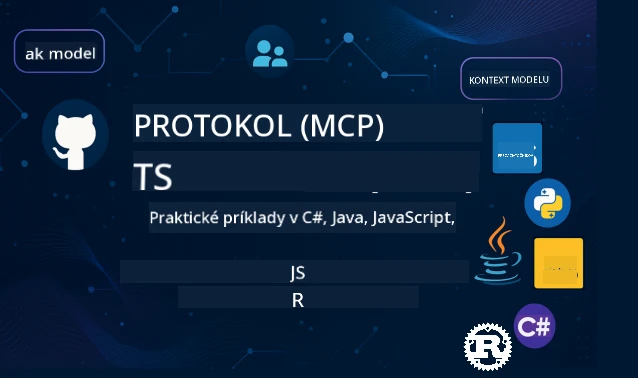

 

[](https://GitHub.com/microsoft/mcp-for-beginners/graphs/contributors)
[](https://GitHub.com/microsoft/mcp-for-beginners/issues)
[](https://GitHub.com/microsoft/mcp-for-beginners/pulls)
[](http://makeapullrequest.com)
[](https://mcptoplist.com/server/mcp.so%2Fmcp-for-beginners%2Fmicrosoft)

[](https://GitHub.com/microsoft/mcp-for-beginners/watchers)
[](https://GitHub.com/microsoft/mcp-for-beginners/fork)
[](https://GitHub.com/microsoft/mcp-for-beginners/stargazers)


[](https://discord.gg/nTYy5BXMWG)

Nasledujte tieto kroky, aby ste mohli začať používať tieto zdroje:
1. **Vytvorte si Fork repozitára**: Kliknite na [](https://GitHub.com/microsoft/mcp-for-beginners/fork)
2. **Klonujte repozitár**:   `git clone https://github.com/microsoft/mcp-for-beginners.git`
3. **Pridajte sa do** [](https://discord.gg/nTYy5BXMWG)


### 🌐 Podpora viacerých jazykov

#### Podporované cez GitHub Action (Automatizované a vždy aktuálne)

<!-- CO-OP TRANSLATOR LANGUAGES TABLE START -->
[Arabčina](../ar/README.md) | [Bengálčina](../bn/README.md) | [Bulharčina](../bg/README.md) | [Barmčina (Myanmar)](../my/README.md) | [Čínština (zjednodušená)](../zh-CN/README.md) | [Čínština (tradičná, Hongkong)](../zh-HK/README.md) | [Čínština (tradičná, Macau)](../zh-MO/README.md) | [Čínština (tradičná, Taiwan)](../zh-TW/README.md) | [Chorvátčina](../hr/README.md) | [Čeština](../cs/README.md) | [Dánčina](../da/README.md) | [Holandčina](../nl/README.md) | [Estónčina](../et/README.md) | [Fínčina](../fi/README.md) | [Francúzština](../fr/README.md) | [Nemčina](../de/README.md) | [Gréčtina](../el/README.md) | [Hebrejčina](../he/README.md) | [Hindi](../hi/README.md) | [Maďarčina](../hu/README.md) | [Indonézčina](../id/README.md) | [Taliančina](../it/README.md) | [Japončina](../ja/README.md) | [Kannadčina](../kn/README.md) | [Khmerčina](../km/README.md) | [Kórejčina](../ko/README.md) | [Litovčina](../lt/README.md) | [Malajčina](../ms/README.md) | [Malajálamčina](../ml/README.md) | [Maráthčina](../mr/README.md) | [Nepálčina](../ne/README.md) | [Nigérijská pidžinčina](../pcm/README.md) | [Norvičtina](../no/README.md) | [Perzština (Farsi)](../fa/README.md) | [Poľština](../pl/README.md) | [Portugalčina (Brazília)](../pt-BR/README.md) | [Portugalčina (Portugalsko)](../pt-PT/README.md) | [Pandžábčina (Gurmukhi)](../pa/README.md) | [Rumunčina](../ro/README.md) | [Ruština](../ru/README.md) | [Srbčina (cyrilika)](../sr/README.md) | [Slovenčina](./README.md) | [Slovinčina](../sl/README.md) | [Španielčina](../es/README.md) | [Swahilčina](../sw/README.md) | [Švédčina](../sv/README.md) | [Tagalog (filipínčina)](../tl/README.md) | [Tamilčina](../ta/README.md) | [Telugčina](../te/README.md) | [Thajčina](../th/README.md) | [Turečtina](../tr/README.md) | [Ukrajinčina](../uk/README.md) | [Urdu](../ur/README.md) | [Vietnamčina](../vi/README.md)

> **Radšej klonujete lokálne?**
>
> Tento repozitár obsahuje viac ako 50 prekladov, čo výrazne zväčšuje veľkosť stiahnutia. Ak chcete klonovať bez prekladov, použite sparse checkout:
>
> **Bash / macOS / Linux:**
> ```bash
> git clone --filter=blob:none --sparse https://github.com/microsoft/mcp-for-beginners.git
> cd mcp-for-beginners
> git sparse-checkout set --no-cone '/*' '!translations' '!translated_images'
> ```
>
> **CMD (Windows):**
> ```cmd
> git clone --filter=blob:none --sparse https://github.com/microsoft/mcp-for-beginners.git
> cd mcp-for-beginners
> git sparse-checkout set --no-cone "/*" "!translations" "!translated_images"
> ```
>
> Toto vám poskytne všetko, čo potrebujete na dokončenie kurzu, s oveľa rýchlejším sťahovaním.
<!-- CO-OP TRANSLATOR LANGUAGES TABLE END -->

# 🚀 Model Context Protocol (MCP) Kurikulum pre začiatočníkov

## **Naučte sa MCP s praktickými príkladmi v C#, Java, JavaScript, Rust, Python a TypeScript**

## 🧠 Prehľad kurikula Model Context Protocol
Vitajte na vašej ceste do Model Context Protocol! Ak ste sa niekedy zamýšľali nad tým, ako AI aplikácie komunikujú s rôznymi nástrojmi a službami, chystáte sa objaviť elegantné riešenie, ktoré mení spôsob, akým vývojári vytvárajú inteligentné systémy.

Predstavte si MCP ako univerzálny prekladač pre AI aplikácie – podobne ako USB porty umožňujú pripojiť akékoľvek zariadenie k počítaču, MCP umožňuje AI modelom pripojiť sa k ľubovoľnému nástroju alebo službe štandardizovaným spôsobom. Či už budujete svoj prvý chatbot alebo pracujete na zložitých AI pracovných tokoch, pochopenie MCP vám dá silu vytvárať schopnejšie a flexibilnejšie aplikácie.

Toto kurikulum je navrhnuté s trpezlivosťou a starostlivosťou o váš učebný proces. Začneme so základnými konceptmi, ktoré už rozumiete, a postupne budeme rozvíjať vaše zručnosti praktickými cvičeniami vo vašom obľúbenom programovacom jazyku. Každý krok obsahuje jasné vysvetlenia, praktické príklady a veľa povzbudenia na ceste.

Do chvíle, keď túto cestu dokončíte, budete mať istotu vytvárať vlastné MCP servery, integrovať ich s populárnymi AI platformami a pochopíte, ako táto technológia mení budúcnosť vývoja AI. Poďme spoločne začať toto vzrušujúce dobrodružstvo!

### Oficiálna dokumentácia a špecifikácie

Toto kurikulum je zosúladené s **MCP Špecifikáciou 2025-11-25** (najnovšia stabilná verzia). Špecifikácia MCP používa číslovanie verzií založené na dátume (formát RRRR-MM-DD), aby zabezpečila jasné sledovanie verzií protokolu.

> **Výhľad do budúcnosti:** kandidát na vydanie ďalšej verzie špecifikácie, **2026-07-28**, je naplánovaný na vydanie 28. júla 2026. Robí protokol bezstavovým na dopravnej vrstve, formalizuje rámec rozšírení (MCP aplikácie, úlohy), zvyšuje bezpečnosť autorizácie a ruší Roots, Sampling a Logging. Kompletný prehľad nájdete v [Čo sa mení v MCP: Kandidát na vydanie 2026-07-28](./01-CoreConcepts/mcp-2026-07-28-release-candidate.md).

Tieto zdroje budú čím ďalej cennejšie, ako budete lepšie rozumieť, ale necítite sa pod tlakom čítať všetko naraz. Začnite s oblasťami, ktoré vás najviac zaujímajú!
- 📘 [MCP Dokumentácia](https://modelcontextprotocol.io/) – Toto je váš hlavný zdroj krok za krokom tutoriálov a používateľských príručiek. Dokumentácia je napísaná s ohľadom na začiatočníkov a poskytuje jasné príklady, ktoré môžete sledovať vlastným tempom.
- 📜 [MCP Špecifikácia](https://modelcontextprotocol.io/specification/2025-11-25) – Považujte to za váš komplexný referenčný manuál. Počas prechádzania kurikula sa sem budete často vracať, aby ste vyhľadávali konkrétne detaily a skúmali pokročilé funkcie.
- 📜 [MCP Číslovanie verzií špecifikácie](https://modelcontextprotocol.io/specification/versioning) – Obsahuje informácie o histórii verzií protokolu a o tom, ako MCP používa dátumové číslovanie verzií (formát RRRR-MM-DD).
- 🧑‍💻 [MCP GitHub Repozitár](https://github.com/modelcontextprotocol) – Tu nájdete SDK, nástroje a ukážky kódu v rôznych programovacích jazykoch. Je to ako pokladnica praktických príkladov a hotových komponentov.
- 🌐 [MCP Komunita](https://github.com/orgs/modelcontextprotocol/discussions) – Pridajte sa k ostatným študentom a skúseným vývojárom v diskusiách o MCP. Je to podporná komunita, kde sú otázky vítané a vedomosti sa voľne zdieľajú.
  
## Ciele učenia

Na konci tohto kurikula budete cítiť istotu a nadšenie zo svojich nových schopností. Tu sú vaše dosiahnutia:

• **Pochopíte základy MCP**: Budete chápať, čo je Model Context Protocol a prečo mení spôsob, akým AI aplikácie spolupracujú, pomocou analógií a príkladov, ktoré dávajú zmysel.

• **Vytvoríte svoj prvý MCP server**: Vytvoríte funkčný MCP server vo vašom preferovanom programovacom jazyku, začínajúc jednoduchými príkladmi a krok po kroku budujúc svoje zručnosti.

• **Prepojíte AI modely s reálnymi nástrojmi**: Naučíte sa, ako premostiť medzeru medzi AI modelmi a skutočnými službami, čím vašim aplikáciám dáte silné nové schopnosti.

• **Implementujete bezpečnostné najlepšie praktiky**: Pochopíte, ako udržať svoje MCP implementácie bezpečné, chrániac tak vaše aplikácie aj používateľov.

• **Nasadíte s istotou**: Budete vedieť, ako previesť svoje MCP projekty z vývoja do produkcie s praktickými stratégiami nasadenia, ktoré fungujú v reálnom svete.

• **Pridáte sa ku komunite MCP**: Stanete sa súčasťou rastúcej komunity vývojárov, ktorí formujú budúcnosť vývoja AI aplikácií. 

## Nevyhnutné predpoklady

Predtým než sa pustíme do detailov MCP, uistime sa, že sa cítite pohodlne s niektorými základnými konceptmi. Nebojte sa, ak v týchto oblastiach nie ste expert – všetko potrebné vám vysvetlíme počas cesty!

### Pochopenie protokolov (Základ)

Predstavte si protokol ako pravidlá konverzácie. Keď voláte priateľovi, obaja viete, že sa pozdravíte „ahoj“ pri prijatí hovoru, striedate sa v rozprávaní a nakoniec sa rozlúčite „dovidenia“, keď skončíte. Počítačové programy potrebujú podobné pravidlá na efektívnu komunikáciu.

MCP je protokol – súbor dohodnutých pravidiel, ktoré pomáhajú AI modelom a aplikáciám viesť produktívne „konverzácie“ s nástrojmi a službami. Rovnakým spôsobom, ako pravidlá konverzácie zlepšujú ľudskú komunikáciu, MCP robí komunikáciu AI aplikácií spoľahlivejšou a výkonnejšou.

### Vzťahy klient-server (Ako programy spolupracujú)

Už každý deň používate vzťahy klient-server! Keď používate webový prehliadač (klient) na návštevu webovej stránky, pripájate sa na webový server, ktorý vám posiela obsah stránok. Prehliadač vie, ako si žiadať informácie a server vie, ako odpovedať.

V MCP máme podobný vzťah: AI modely vystupujú ako klienti, ktorí žiadajú informácie alebo akcie, zatiaľ čo MCP servery poskytujú tieto funkcie. Je to ako mať pomocníka (server), ktorého si AI môže požiadať o vykonanie konkrétnych úloh.

### Prečo je štandardizácia dôležitá (Ako veci fungujú spolu)

Predstavte si, že by každý výrobca áut používal iný tvar čerpacích pištolí – potrebovali by ste iný adaptér pre každé auto! Štandardizácia znamená dohodnúť sa na spoločných prístupoch, aby veci fungovali spolu hladko.

MCP poskytuje túto štandardizáciu pre AI aplikácie. Namiesto toho, aby každý AI model potreboval vlastný kód pre každý nástroj, MCP vytvára univerzálny spôsob komunikácie. To znamená, že vývojári môžu postaviť nástroje raz a nechať ich fungovať s mnohými rôznymi AI systémami.

## 🧭 Prehľad vašej učebnej cesty

Vaša cesta s MCP je starostlivo rozvrhnutá tak, aby postupne budovala vašu dôveru a zručnosti. Každá fáza predstavuje nové koncepty a zároveň upevňuje to, čo ste už naučili.

### 🌱 Fáza základov: Pochopenie základov (Moduly 0-2)

Tu začína vaše dobrodružstvo! Predstavíme vám koncepty MCP pomocou známych analógií a jednoduchých príkladov. Pochopíte, čo MCP je, prečo existuje a ako zapadá do širšieho sveta vývoja AI.


• **Modul 0 - Úvod do MCP**: Začneme preskúmaním, čo je MCP a prečo je tak dôležité pre moderné AI aplikácie. Uvidíte príklady MCP v praxi a pochopíte, ako rieši bežné problémy, s ktorými sa vývojári stretávajú.

• **Modul 1 - Vysvetlenie základných konceptov**: Tu sa naučíte základné stavebné bloky MCP. Použijeme veľa analógií a vizuálnych príkladov, aby tieto koncepty pôsobili prirodzene a boli zrozumiteľné.

• **Modul 2 - Bezpečnosť v MCP**: Bezpečnosť môže znieť zastrašujúco, ale ukážeme vám, ako MCP obsahuje zabudované bezpečnostné funkcie a naučíme vás najlepšie postupy, ktoré chránia vaše aplikácie od začiatku.

### 🔨 Fáza výstavby: Vytvorenie vašich prvých implementácií (Modul 3)

Teraz začína tá pravá zábava! Získate praktické skúsenosti s tvorbou skutočných MCP serverov a klientov. Nebojte sa – začneme jednoducho a prevedieme vás každým krokom.

Tento modul obsahuje viacero praktických návodov, ktoré vám umožnia precvičovať v preferovanom programovacom jazyku. Vytvoríte svoj prvý server, postavíte klienta na jeho pripojenie a dokonca integrujete populárne vývojové nástroje ako VS Code.

Každý návod obsahuje kompletné príklady kódu, tipy na riešenie problémov a vysvetlenia, prečo robíme konkrétne dizajnové rozhodnutia. Na konci tejto fázy budete mať funkčné MCP implementácie, na ktoré môžete byť hrdí!

### 🚀 Fáza rastu: Pokročilé koncepty a aplikácie v reálnom svete (Moduly 4-5)

Po zvládnutí základov ste pripravení preskúmať sofistikovanejšie funkcie MCP. Pokryjeme praktické implementačné stratégie, techniky ladenia a pokročilé témy ako integrácia multimodálneho AI.

Naučíte sa tiež, ako škálovať svoje MCP implementácie pre produkčné použitie a integrovať ich s cloudovými platformami ako Azure. Tieto moduly vás pripravia na tvorbu MCP riešení, ktoré zvládnu požiadavky reálneho sveta.

### 🌟 Fáza majstrovstva: Komunita a špecializácia (Moduly 6-11)

Záverečná fáza sa zameriava na zapojenie sa do MCP komunity a špecializáciu v oblastiach, ktoré vás najviac zaujímajú. Naučíte sa, ako prispievať do open-source MCP projektov, implementovať pokročilé autentifikačné vzory a vytvárať komplexné riešenia s integráciou databáz.

Modul 11 si zasluhuje zvláštnu zmienku – je to kompletná 13-laboratórna praktická učebná cesta, ktorá vás naučí vytvárať produkčne pripravené MCP servery s integráciou PostgreSQL. Je to ako záverečný projekt, ktorý spája všetko, čo ste sa naučili!

### 📚 Kompletná štruktúra kurikula

| Modul | Téma | Popis | Odkaz |
|--------|-------|-------------|------|
| **Moduly 0-3: Základy** | | | |
| 00 | Úvod do MCP | Prehľad Model Context Protocol a jeho význam v AI pipeline | [Čítať viac](./00-Introduction/README.md) |
| 01 | Vysvetlenie základných konceptov | Hlboký prieskum základných MCP konceptov | [Čítať viac](./01-CoreConcepts/README.md) |
| 1.1 | Čo sa mení v MCP (2026-07-28 RC) | Bezstavový protokol, framework rozšírení a vyraďovanie funkcií v nasledujúcej verzii špecifikácie | [Návod](./01-CoreConcepts/mcp-2026-07-28-release-candidate.md) |
| 02 | Bezpečnosť v MCP | Bezpečnostné hrozby a najlepšie postupy | [Čítať viac](./02-Security/README.md) |
| 03 | Začiatky s MCP | Nastavenie prostredia, základné servery/klienti, integrácia | [Čítať viac](./03-GettingStarted/README.md) |
| **Modul 3: Stavba prvého servera a klienta** | | | |
| 3.1 | Prvý server | Vytvorte svoj prvý MCP server | [Návod](./03-GettingStarted/01-first-server/README.md) |
| 3.2 | Prvý klient | Vyvíjajte základného MCP klienta | [Návod](./03-GettingStarted/02-client/README.md) |
| 3.3 | Klient s LLM | Integrujte veľké jazykové modely | [Návod](./03-GettingStarted/03-llm-client/README.md) |
| 3.4 | Integrácia VS Code | Používajte MCP servery vo VS Code | [Návod](./03-GettingStarted/04-vscode/README.md) |
| 3.5 | stdio server | Tvorba serverov s použitím stdio transportu | [Návod](./03-GettingStarted/05-stdio-server/README.md) |
| 3.6 | HTTP streaming | Implementácia HTTP streamingu v MCP | [Návod](./03-GettingStarted/06-http-streaming/README.md) |
| 3.7 | Microsoft Foundry Toolkit | Použitie Microsoft Foundry Toolkit s MCP | [Návod](./03-GettingStarted/07-aitk/README.md) |
| 3.8 | Testovanie | Testujte implementáciu MCP servera | [Návod](./03-GettingStarted/08-testing/README.md) |
| 3.9 | Nasadzovanie | Nasadzujte MCP servery do produkcie | [Návod](./03-GettingStarted/09-deployment/README.md) |
| 3.10 | Pokročilé využitie servera | Používajte pokročilé servery pre pokročilé funkcie a lepšiu architektúru | [Návod](./03-GettingStarted/10-advanced/README.md) |
| 3.11 | Jednoduchá autentifikácia | Kapitola predstavujúca autentifikáciu od základov a RBAC | [Návod](./03-GettingStarted/11-simple-auth/README.md) |
| 3.12 | MCP hostitelia | Konfigurácia Claude Desktopu, Cursora, Cline a ďalších MCP hostiteľov | [Návod](./03-GettingStarted/12-mcp-hosts/README.md) |
| 3.13 | MCP Inspector | Ladenie a testovanie MCP serverov nástrojom Inspector | [Návod](./03-GettingStarted/13-mcp-inspector/README.md) |
| 3.14 | Sampling | Používajte sampling na spoluprácu s klientom | [Návod](./03-GettingStarted/14-sampling/README.md) |
| 3.15 | MCP Apps | Vytvárajte MCP aplikácie | [Návod](./03-GettingStarted/15-mcp-apps/README.md) |
| **Moduly 4-5: Praktické a pokročilé** | | | |
| 04 | Praktická implementácia | SDK, ladenie, testovanie, znovupoužiteľné šablóny promptov | [Čítať viac](./04-PracticalImplementation/README.md) |
| 4.1 | Paginácia | Spracovanie veľkých výsledkov pomocou kazetovej paginácie | [Návod](./04-PracticalImplementation/pagination/README.md) |
| 05 | Pokročilé témy v MCP | Multimodálne AI, škálovanie, podnikové využitie | [Čítať viac](./05-AdvancedTopics/README.md) |
| 5.1 | Integrácia Azure | MCP integrácia s Azure | [Návod](./05-AdvancedTopics/mcp-integration/README.md) |
| 5.2 | Multimodalita | Práca s viacerými modalitami | [Návod](./05-AdvancedTopics/mcp-multi-modality/README.md) |
| 5.3 | OAuth2 demo | Implementácia OAuth2 autentifikácie | [Návod](./05-AdvancedTopics/mcp-oauth2-demo/README.md) |
| 5.4 | Root Contexts | Pochopenie a implementácia koreňových kontextov | [Návod](./05-AdvancedTopics/mcp-root-contexts/README.md) |
| 5.5 | Routing | Stratégií smerovania MCP | [Návod](./05-AdvancedTopics/mcp-routing/README.md) |
| 5.6 | Sampling | Sampling techniky v MCP | [Návod](./05-AdvancedTopics/mcp-sampling/README.md) |
| 5.7 | Škálovanie | Škálovanie MCP implementácií | [Návod](./05-AdvancedTopics/mcp-scaling/README.md) |
| 5.8 | Bezpečnosť | Pokročilé bezpečnostné úvahy | [Návod](./05-AdvancedTopics/mcp-security/README.md) |
| 5.9 | Webové vyhľadávanie | Implementácia schopností webového vyhľadávania | [Návod](./05-AdvancedTopics/web-search-mcp/README.md) |
| 5.10 | Realtime streaming | Stavba funkcie realtime streamingu | [Návod](./05-AdvancedTopics/mcp-realtimestreaming/README.md) |
| 5.11 | Realtime vyhľadávanie | Implementácia realtime vyhľadávania | [Návod](./05-AdvancedTopics/mcp-realtimesearch/README.md) |
| 5.12 | Autentifikácia Entra ID | Autentifikácia s Microsoft Entra ID | [Návod](./05-AdvancedTopics/mcp-security-entra/README.md) |
| 5.13 | Integrácia Foundry | Integrácia s Microsoft Foundry | [Návod](./05-AdvancedTopics/mcp-foundry-agent-integration/README.md) |
| 5.14 | Context Engineering | Techniky efektívneho navrhovania kontextov | [Návod](./05-AdvancedTopics/mcp-contextengineering/README.md) |
| 5.15 | Vlastný transport MCP | Implementácie vlastného transportu | [Návod](./05-AdvancedTopics/mcp-transport/README.md) |
| 5.16 | Funkcie protokolu | Oznámenia o pokroku, zrušenie, šablóny zdrojov | [Návod](./05-AdvancedTopics/mcp-protocol-features/README.md) |
| 5.17 | Adversariálne multi-agentné uvažovanie | Dvaja agenti argumentujú opačné stránky pomocou zdieľaných MCP nástrojov, hodnotené agentom rozhodcom | [Návod](./05-AdvancedTopics/mcp-adversarial-agents/README.md) |
| **Moduly 6-10: Komunita a najlepšie praktiky** | | | |
| 06 | Príspevky komunity | Ako prispievať do MCP ekosystému | [Návod](./06-CommunityContributions/README.md) |
| 07 | Zážitky z raného prístupovania | Príbehy o implementáciách z reálneho sveta | [Návod](./07-LessonsfromEarlyAdoption/README.md) |
| 08 | Najlepšie praktiky pre MCP | Výkon, odolnosť voči chybám, reziliencia | [Návod](./08-BestPractices/README.md) |
| 09 | Prípady štúdií MCP | Praktické implementačné príklady | [Návod](./09-CaseStudy/README.md) |
| 10 | Praktický workshop | Stavba MCP servera s Microsoft Foundry Toolkit | [Lab](./10-StreamliningAIWorkflowsBuildingAnMCPServerWithAIToolkit/README.md) |
| **Modul 11: Praktická laboratóriá MCP servera** | | | |
| 11 | Integrácia databázy MCP servera | Komplexná 13-laboratórna praktická učebná cesta pre integráciu PostgreSQL | [Laboratóriá](./11-MCPServerHandsOnLabs/README.md) |
| 11.1 | Úvod | Prehľad MCP s integráciou databázy a použitím v maloobchodnej analytike | [Lab 00](./11-MCPServerHandsOnLabs/00-Introduction/README.md) |
| 11.2 | Jadro architektúry | Pochopenie architektúry MCP servera, vrstvy databázy a bezpečnostné vzory | [Lab 01](./11-MCPServerHandsOnLabs/01-Architecture/README.md) |
| 11.3 | Bezpečnosť a multi-tenancy | Row Level Security, autentifikácia a multi-tenant prístup k dátam | [Lab 02](./11-MCPServerHandsOnLabs/02-Security/README.md) |
| 11.4 | Nastavenie prostredia | Nastavenie vývojového prostredia, Docker, Azure zdroje | [Lab 03](./11-MCPServerHandsOnLabs/03-Setup/README.md) |
| 11.5 | Dizajn databázy | Nastavenie PostgreSQL, návrh maloobchodnej schémy a ukážkové dáta | [Lab 04](./11-MCPServerHandsOnLabs/04-Database/README.md) |
| 11.6 | Implementácia MCP servera | Stavba FastMCP servera s integráciou databázy | [Lab 05](./11-MCPServerHandsOnLabs/05-MCP-Server/README.md) |
| 11.7 | Vývoj nástrojov | Tvorba databázových dopytových nástrojov a introspekcia schémy | [Lab 06](./11-MCPServerHandsOnLabs/06-Tools/README.md) |
| 11.8 | Sémantické vyhľadávanie | Implementácia vektorových embeddingov s Azure OpenAI a pgvector | [Lab 07](./11-MCPServerHandsOnLabs/07-Semantic-Search/README.md) |
| 11.9 | Testovanie a ladenie | Testovacie stratégie, nástroje na ladenie a validačné prístupy | [Lab 08](./11-MCPServerHandsOnLabs/08-Testing/README.md) |
| 11.10 | Integrácia VS Code | Konfigurácia VS Code MCP integrácie a používanie AI Chat | [Lab 09](./11-MCPServerHandsOnLabs/09-VS-Code/README.md) |
| 11.11 | Stratégie nasadenia | Docker nasadenie, Azure Container Apps a úvahy o škálovaní | [Lab 10](./11-MCPServerHandsOnLabs/10-Deployment/README.md) |
| 11.12 | Monitorovanie | Application Insights, logovanie, monitorovanie výkonu | [Lab 11](./11-MCPServerHandsOnLabs/11-Monitoring/README.md) |
| 11.13 | Najlepšie praktiky | Optimalizácia výkonu, spevnenie bezpečnosti a tipy pre produkciu | [Lab 12](./11-MCPServerHandsOnLabs/12-Best-Practices/README.md) |
| **Modul 12: MCP nástroje** | | | |
| 12.1 | Nástroje | Použitie MCP v Copilot App | [ Návod ](./12-tooling/README.md) |

### 💻 Ukážkové kódové projekty

Jednou z najzaujímavejších častí učenia sa MCP je postupný rozvoj vašich kódovacích zručností. Navrhli sme naše príklady kódu tak, aby začínali jednoducho a postupne sa stáli sofistikovanejšími s prehlbujúcim sa porozumením. Takto predstavujeme koncepty – s kódom, ktorý je ľahko pochopiteľný, ale demonštruje skutočné princípy MCP, pochopíte nielen to, čo tento kód robí, ale aj prečo je štrukturovaný týmto spôsobom a ako zapadá do väčších MCP aplikácií.

#### Základné príklady MCP kalkulačky

| Jazyk | Popis | Odkaz |
|----------|-------------|------|

| C# | Príklad MCP servera | [Zobraziť kód](./03-GettingStarted/samples/csharp/README.md) |
| Java | MCP kalkulačka | [Zobraziť kód](./03-GettingStarted/samples/java/calculator/README.md) |
| JavaScript | MCP demo | [Zobraziť kód](./03-GettingStarted/samples/javascript/README.md) |
| Python | MCP server | [Zobraziť kód](../../03-GettingStarted/samples/python/mcp_calculator_server.py) |
| TypeScript | MCP príklad | [Zobraziť kód](./03-GettingStarted/samples/typescript/README.md) |
| Rust | MCP príklad | [Zobraziť kód](./03-GettingStarted/samples/rust/README.md) |

#### Pokročilé implementácie MCP

| Jazyk | Popis | Odkaz |
|----------|-------------|------|
| C# | Pokročilý príklad | [Zobraziť kód](./04-PracticalImplementation/samples/csharp/README.md) |
| Java so Spring | Príklad kontajnerovej aplikácie | [Zobraziť kód](./04-PracticalImplementation/samples/java/containerapp/README.md) |
| JavaScript | Pokročilý príklad | [Zobraziť kód](./04-PracticalImplementation/samples/javascript/README.md) |
| Python | Komplexná implementácia | [Zobraziť kód](./04-PracticalImplementation/samples/python/README.md) |
| TypeScript | Príklad kontajnera | [Zobraziť kód](./04-PracticalImplementation/samples/typescript/README.md) |


## 🎯 Predpoklady na štúdium MCP

Aby ste z tohto kurikula čo najviac získali, mali by ste mať:

- Základné znalosti programovania aspoň v jednom z nasledujúcich jazykov: C#, Java, JavaScript, Python alebo TypeScript
- Pochopenie modelu klient-server a API
- Oboznámenie sa s konceptmi REST a HTTP
- (Voliteľné) Základy AI/ML konceptov

- Zapájanie sa do komunít pre podporu

## 📚 Študijný sprievodca a zdroje

Tento repozitár obsahuje niekoľko zdrojov, ktoré vám pomôžu navigovať a efektívne sa učiť:

### Študijný sprievodca

K dispozícii je komplexný [Študijný sprievodca](./study_guide.md), ktorý vám pomôže efektívne prejsť týmto repozitárom. Tento vizuálny mapový plán kurikula ukazuje, ako sú všetky témy prepojené a poskytuje pokyny, ako efektívne využívať príkladové projekty. Je obzvlášť užitočný pre vizuálnych študentov, ktorí radi vidia celkový obraz.

Sprievodca obsahuje:
- Vizuálnu mapu kurikula pokrývajúcu všetky témy
- Podrobný rozpis každej časti repozitára
- Pokyny, ako používať príkladové projekty
- Odporúčané učené cesty pre rôzne úrovne zručností
- Doplnkové zdroje pre vašu študijnú cestu

### Zoznam zmien

Vedie sa detailný [Zoznam zmien](./changelog.md), ktorý sleduje všetky dôležité aktualizácie materiálov kurikula, aby ste boli informovaní o najnovších vylepšeniach a doplnkoch.
- Pridanie nového obsahu
- Strukturálne zmeny
- Zlepšenia funkcií
- Aktualizácie dokumentácie

## 🛠️ Ako efektívne využívať toto kurikulum

Každá lekcia v tomto sprievodcovi obsahuje:

1. Jasné vysvetlenia konceptov MCP  
2. Živé ukážky kódu v rôznych jazykoch  
3. Cvičenia na tvorbu reálnych MCP aplikácií  
4. Doplnkové zdroje pre pokročilých študentov

### Poďme sa učiť MCP s C# - séria tutoriálov
Spoznajte Model Context Protocol (MCP), moderný rámec navrhnutý na štandardizáciu interakcií medzi AI modelmi a klientskymi aplikáciami. V tejto priateľskej úvodnej sérii vás zoznámime s MCP a povedieme vás pri tvorbe prvého MCP servera.
#### C#: [https://aka.ms/letslearnmcp-csharp](https://aka.ms/letslearnmcp-csharp)
#### Java: [https://aka.ms/letslearnmcp-java](https://aka.ms/letslearnmcp-java)
#### JavaScript: [https://aka.ms/letslearnmcp-javascript](https://aka.ms/letslearnmcp-javascript)
#### Python: [https://aka.ms/letslearnmcp-python](https://aka.ms/letslearnmcp-python)

## 🎓 Vaša cesta s MCP začína

Gratulujeme! Práve ste urobili prvý krok na vzrušujúcej ceste, ktorá rozšíri vaše programátorské schopnosti a privedie vás k špičkovej AI tvorbe.

### Čo ste už dosiahli

Čítaním tohto úvodu ste si už začali budovať svoj základ vedomostí o MCP. Rozumiete, čo MCP je, prečo je dôležitý a ako vám toto kurikulum pomôže na vašej učebnej ceste. To je významný úspech a začiatok vášho odborného rastu v tejto dôležitej technológii.

### Dobrodružstvo, ktoré vás čaká

Ako postupujete modulmi, pamätajte, že každý odborník bol raz začiatočník. Koncepty, ktoré sa teraz môžu zdať zložité, vám budú prirodzené, ako budete precvičovať a uplatňovať ich. Každý malý krok vedie k silným schopnostiam, ktoré budete využívať počas svojej vývojárskej kariéry.

### Vaša sieť podpory

Pridávate sa ku komunite študentov a expertov, ktorí sú zanietení pre MCP a pripravení pomôcť iným uspieť. Či už ste zaseknutí na programátorskej výzve, alebo nadšení zo svojho objavu, komunita je tu, aby vás podporila.

Ak budete mať problémy alebo otázky o tvorbe AI aplikácií, pridajte sa k ďalším študentom a skúseným vývojárom v diskusiách o MCP. Je to podporná komunita, kde sú otázky vítané a poznatky sa zdieľajú slobodne.

[](https://discord.gg/nTYy5BXMWG)

Ak máte spätnú väzbu k produktu alebo objavíte chyby počas vývoja, navštívte:

[](https://aka.ms/foundry/forum)

### Pripravení začať?

Vaše dobrodružstvo s MCP začína teraz! Začnite modulom 0 pre prvé praktické skúsenosti s MCP alebo preskúmajte príkladové projekty a zistite, čo budete vytvárať. Pamätajte – každý expert začal presne tam, kde ste vy, a s trpezlivosťou a praxou budete ohromení, čo všetko dokážete.

Vitajte vo svete vývoja Model Context Protocol. Poďme spolu vytvoriť niečo úžasné!

## 🤝 Prispievanie ku komunite učenia

Toto kurikulum rastie a silnie vďaka príspevkom študentov ako ste vy! Či už opravujete preklep, navrhujete jasnejšie vysvetlenie alebo pridávate nový príklad, vaše príspevky pomáhajú ostatným začiatočníkom uspieť.

Ďakujeme Microsoft Valued Professional [Shivam Goyal](https://www.linkedin.com/in/shivam2003/) za príspevky kódových ukážok.

Proces prispievania je navrhnutý tak, aby bol priateľský a podporný. Väčšina príspevkov vyžaduje Dohodu o licencii prispievateľa (CLA), ale automatizované nástroje vás hladko prevedú celým procesom.

## 📜 Otvorené učenie

Celé toto kurikulum je dostupné pod MIT [LICENCIOU](../../LICENSE), čo znamená, že ho môžete slobodne používať, upravovať a zdieľať. To podporuje našu misiu sprístupniť vedomosti o MCP vývojárom po celom svete.
## 🤝 Pravidlá prispievania

Tento projekt vítá príspevky a návrhy. Väčšina príspevkov vyžaduje súhlas s
Dohodou o licencii prispievateľa (CLA), ktorá potvrdzuje, že máte právo a skutočne nám udeľujete
práva na použitie vášho príspevku. Pre podrobnosti navštívte <https://cla.opensource.microsoft.com>.

Keď odošlete žiadosť o zlúčenie (pull request), bot pre CLA automaticky zistí,
či musíte poskytnúť CLA a označí PR primerane (napr. kontrola stavu, komentár). Stačí postupovať podľa
inštrukcií bota. Tento krok budete musieť urobiť len raz pre všetky repozitáre využívajúce náš CLA.

Tento projekt prijal [Microsoft Open Source Kódex správania](https://opensource.microsoft.com/codeofconduct/).
Pre viac informácií si pozrite [FAQ kódexu správania](https://opensource.microsoft.com/codeofconduct/faq/) alebo
kontaktujte [opencode@microsoft.com](mailto:opencode@microsoft.com) s ďalšími otázkami či pripomienkami.

---

*Ste pripravení začať svoju cestu s MCP? Začnite s [Modulom 00 - Úvod do MCP](./00-Introduction/README.md) a urobte prvé kroky vo svete vývoja Model Context Protocol!*


## 🎒 Ďalšie kurzy
Náš tím ponúka aj ďalšie kurzy! Pozrite si:

<!-- CO-OP TRANSLATOR OTHER COURSES START -->
### LangChain
[](https://aka.ms/langchain4j-for-beginners)
[](https://aka.ms/langchainjs-for-beginners?WT.mc_id=m365-94501-dwahlin)
[](https://github.com/microsoft/langchain-for-beginners?WT.mc_id=m365-94501-dwahlin)
---

### Azure / Edge / MCP / Agenti
[](https://github.com/microsoft/AZD-for-beginners?WT.mc_id=academic-105485-koreyst)
[](https://github.com/microsoft/edgeai-for-beginners?WT.mc_id=academic-105485-koreyst)
[](https://github.com/microsoft/mcp-for-beginners?WT.mc_id=academic-105485-koreyst)
[](https://github.com/microsoft/ai-agents-for-beginners?WT.mc_id=academic-105485-koreyst)

---
 
### Séria Generatívna AI
[](https://github.com/microsoft/generative-ai-for-beginners?WT.mc_id=academic-105485-koreyst)
[-9333EA?style=for-the-badge&labelColor=E5E7EB&color=9333EA)](https://github.com/microsoft/Generative-AI-for-beginners-dotnet?WT.mc_id=academic-105485-koreyst)
[-C084FC?style=for-the-badge&labelColor=E5E7EB&color=C084FC)](https://github.com/microsoft/generative-ai-for-beginners-java?WT.mc_id=academic-105485-koreyst)
[-E879F9?style=for-the-badge&labelColor=E5E7EB&color=E879F9)](https://github.com/microsoft/generative-ai-with-javascript?WT.mc_id=academic-105485-koreyst)

---
 
### Základné učenie
[](https://aka.ms/ml-beginners?WT.mc_id=academic-105485-koreyst)
[](https://aka.ms/datascience-beginners?WT.mc_id=academic-105485-koreyst)
[](https://aka.ms/ai-beginners?WT.mc_id=academic-105485-koreyst)

[](https://github.com/microsoft/Security-101?WT.mc_id=academic-96948-sayoung)
[](https://aka.ms/webdev-beginners?WT.mc_id=academic-105485-koreyst)
[](https://aka.ms/iot-beginners?WT.mc_id=academic-105485-koreyst)
[](https://github.com/microsoft/xr-development-for-beginners?WT.mc_id=academic-105485-koreyst)

---
 
### Séria Copilot
[](https://aka.ms/GitHubCopilotAI?WT.mc_id=academic-105485-koreyst)
[](https://github.com/microsoft/mastering-github-copilot-for-dotnet-csharp-developers?WT.mc_id=academic-105485-koreyst)
[](https://github.com/microsoft/CopilotAdventures?WT.mc_id=academic-105485-koreyst)
<!-- CO-OP TRANSLATOR OTHER COURSES END -->

---

<!-- CO-OP TRANSLATOR DISCLAIMER START -->
**Vyhlásenie o zodpovednosti**:
Tento dokument bol preložený pomocou AI prekladateľskej služby [Co-op Translator](https://github.com/Azure/co-op-translator). Hoci sa snažíme o presnosť, vezmite prosím na vedomie, že automatické preklady môžu obsahovať chyby alebo nepresnosti. Pôvodný dokument v jeho natívnom jazyku by mal byť považovaný za autoritatívny zdroj. Pre kritické informácie sa odporúča profesionálny ľudský preklad. Nie sme zodpovední za žiadne nedorozumenia alebo nesprávne interpretácie vyplývajúce z použitia tohto prekladu.
<!-- CO-OP TRANSLATOR DISCLAIMER END -->