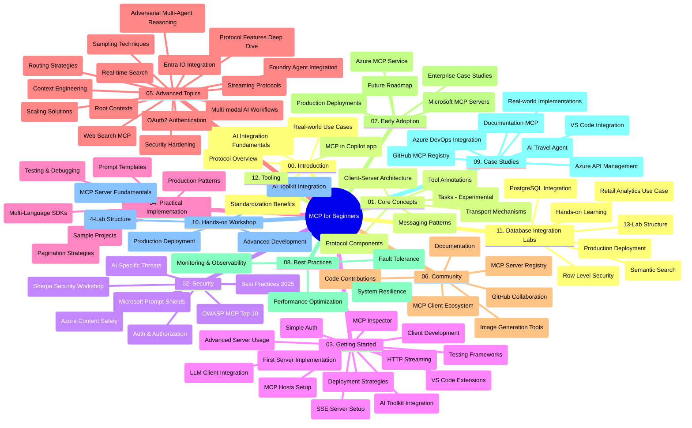

# Protokol Model Context (MCP) pre začiatočníkov - Študijný sprievodca

Tento študijný sprievodca poskytuje prehľad štruktúry repozitára a obsahu kurikula "Model Context Protocol (MCP) pre začiatočníkov". Použite tento sprievodca na efektívnu orientáciu v repozitári a využitie dostupných zdrojov naplno.

## Prehľad repozitára

Model Context Protocol (MCP) je štandardizovaný rámec pre interakcie medzi AI modelmi a klientskymi aplikáciami. Pôvodne vytvorený spoločnosťou Anthropic, MCP je teraz udržiavaný širšou komunitou MCP prostredníctvom oficiálnej GitHub organizácie. Tento repozitár poskytuje komplexné kurikulum s praktickými príkladmi kódu v C#, Java, JavaScript, Python a TypeScript, navrhnuté pre vývojárov AI, systémových architektov a softvérových inžinierov.

## Vizualizácia kurikula

## Štruktúra repozitára

Repozitár je rozdelený do dvanástich hlavných sekcií, z ktorých každá sa zameriava na iné aspekty MCP:

1. **Úvod (00-Introduction/)**
   - Prehľad Model Context Protocol
   - Prečo je štandardizácia v AI pipeline dôležitá
   - Praktické použitia a výhody

2. **Jadro koncepcií (01-CoreConcepts/)**
   - Klient-server architektúra
   - Kľúčové komponenty protokolu
   - Vzory správ v MCP
   - Súčasná špecifikácia: [Čo sa zmenilo v MCP: Špecifikácia z 2026-07-28](./01-CoreConcepts/mcp-2026-07-28.md) — bezstavové jadro protokolu, rámec rozšírení a deprekovania Roots/Sampling/Logging

3. **Bezpečnosť (02-Security/)**
   - Hrozby bezpečnosti v systémoch založených na MCP
   - Najlepšie postupy zabezpečenia implementácií
   - Stratégiá autentifikácie a autorizácie
   - Praktický [príklad autorizácie CIMD a DCR](./02-Security/samples/cimd-dcr-auth/README.md)
   - **Komplexná dokumentácia bezpečnosti**:
     - MCP Bezpečnostné najlepšie praktiky
     - Sprievodca implementáciou Azure Content Safety
     - MCP bezpečnostné kontroly a techniky
     - Rýchla referencia najlepších praktík MCP
   - **Kľúčové bezpečnostné témy**:
     - Útoky vloženia promptu a otrávenie nástrojov
     - Únos relácie a problémy s „zmäteným zástupcom“
     - Zraniteľnosti prenášania tokenov
     - Nadmerné oprávnenia a kontrola prístupu
     - Bezpečnosť dodávateľského reťazca pre AI komponenty
     - Integrácia Microsoft Prompt Shields

4. **Začíname (03-GettingStarted/)**
   - Nastavenie prostredia a konfigurácia
   - Vytváranie základných MCP serverov a klientov
   - Integrácia s existujúcimi aplikáciami
   - Obsahuje sekcie pre:
     - Prvú implementáciu servera
     - Vývoj klienta
     - Integráciu klienta LLM
     - Integráciu do VS Code
     - Server-Sent Events (SSE) server
     - Pokročilé používanie servera
     - HTTP streamovanie
     - AI Toolkit integráciu
     - Testovacie stratégie
     - Pokyny na nasadenie

5. **Praktická implementácia (04-PracticalImplementation/)**
   - Používanie SDK naprieč rôznymi programovacími jazykmi
   - Techniky ladenia, testovania a validácie
   - Vytváranie znovupoužiteľných šablón promptov a pracovných tokov
   - Ukážkové projekty s príkladmi implementácií

6. **Pokročilé témy (05-AdvancedTopics/)**
   - Techniky inžinierstva kontextu
   - Integrácia agenta Foundry
   - Multimodálne AI pracovné toky
   - Demos autentifikácie OAuth2
   - Schopnosti vyhľadávania v reálnom čase
   - Streamovanie v reálnom čase
   - Implementácia koreňových kontextov
   - Stratégiá smerovania
   - Techniky vzorkovania
   - Prístupy škálovania
   - Bezpečnostné úvahy
   - Integrácia bezpečnosti Entra ID
   - Integrácia webového vyhľadávania
   - Adverzárne viacagentové uvažovanie (vzor debát)

7. **Príspevky komunity (06-CommunityContributions/)**
   - Ako prispievať kódom a dokumentáciou
   - Spolupráca cez GitHub
   - Vylepšenia a spätná väzba vedená komunitou
   - Používanie rôznych MCP klientov (Claude Desktop, Cline, VSCode)
   - Práca s populárnymi MCP servermi vrátane generovania obrázkov

8. **Lekcie z počiatočného zavádzania (07-LessonsfromEarlyAdoption/)**
   - Reálne implementácie a úspešné príbehy
   - Budovanie a nasadzovanie riešení založených na MCP
   - Trendy a budúca cesta vývoja
   - **Sprievodca Microsoft MCP servermi**: Komplexný sprievodca 10 produkčne pripravenými Microsoft MCP servermi vrátane:
     - Microsoft Learn Docs MCP Server
     - Azure MCP Server (15+ špecializovaných konektorov)
     - GitHub MCP Server
     - Azure DevOps MCP Server
     - MarkItDown MCP Server
     - SQL Server MCP Server
     - Playwright MCP Server
     - Dev Box MCP Server
     - Microsoft Foundry MCP Server
     - Microsoft 365 Agents Toolkit MCP Server

9. **Najlepšie praktiky (08-BestPractices/)**
   - Ladenie výkonu a optimalizácia
   - Návrh odolných MCP systémov
   - Testovacie a odolnostné stratégie

10. **Prípadové štúdie (09-CaseStudy/)**
    - **Sedem komplexných prípadových štúdií** preukazujúcich všestrannosť MCP v rôznych scenároch:
    - **Azure AI Travel Agents**: Orchestrace viac agentov s Azure OpenAI a AI Search
    - **Integrácia Azure DevOps**: Automatizácia pracovných tokov s aktualizáciami dát z YouTube
    - **Získavanie dokumentácie v reálnom čase**: Python konzolový klient s HTTP streamovaním
    - **Interaktívny generátor študijného plánu**: Chainlit webová aplikácia s konverzačnou AI
    - **Dokumentácia v editore**: VS Code integrácia s pracovnými tokmi GitHub Copilot
    - **Azure API Management**: Podniková API integrácia s vytváraním MCP servera
    - **GitHub MCP Registry**: Ekosystémový vývoj a platforma pre agentnú integráciu
    - Príklady implementácií pokrývajúce podnikové integrácie, produktivitu vývojárov a rozvoj ekosystému

11. **Praktický workshop (10-StreamliningAIWorkflowsBuildingAnMCPServerWithAIToolkit/)**
    - Komplexný praktický workshop kombinujúci MCP s AI Toolkit
    - Budovanie inteligentných aplikácií prepájajúcich AI modely s reálnymi nástrojmi
    - Praktické moduly pokrývajúce základy, vývoj vlastného servera a stratégie produkčného nasadenia
    - **Štruktúra labu**:
      - Lab 1: Základy MCP servera
      - Lab 2: Pokročilý vývoj MCP servera
      - Lab 3: Integrácia AI Toolkit
      - Lab 4: Produkčné nasadenie a škálovanie
    - Prístup ku učeniu založený na laboch s krok za krokom inštrukciami

12. **MCP Server databázové integračné laby (11-MCPServerHandsOnLabs/)**
    - **Komplexná 13-labová učebná cesta** pre budovanie produkčne pripravených MCP serverov s integráciou PostgreSQL
    - **Reálne použitie v maloobchodnej analytike** s použitím prípadu použitia Zava Retail
    - **Podnikové vzory** vrátane Row Level Security (RLS), sémantické vyhľadávanie a viacnásobný prístup k dátam pre viacerých nájomníkov
    - **Kompletná štruktúra labov**:
      - **Laby 00-03: Základy** - Úvod, Architektúra, Bezpečnosť, Nastavenie prostredia
      - **Laby 04-06: Budovanie MCP servera** - Návrh databázy, Implementácia MCP servera, Vývoj nástrojov
      - **Laby 07-09: Pokročilé funkcie** - Sémantické vyhľadávanie, Testovanie & ladenie, Integrácia VS Code
      - **Laby 10-12: Produkcia & Najlepšie praktiky** - Nasadenie, Monitorovanie, Optimalizácia
    - **Použité technológie**: Rámec FastMCP, PostgreSQL, Azure OpenAI, Azure Container Apps, Application Insights
    - **Výsledky učenia**: Produkčne pripravené MCP servery, vzory integrácie databázy, analytika poháňaná AI, podniková bezpečnosť

13. **Nástroje (12-tooling/)**
    - Naučte sa používať MCP v aplikácii Copilot a ďalších nástrojoch

## Ďalšie zdroje

Repozitár obsahuje podporné zdroje:

- **Priečinok obrázkov**: Obsahuje diagramy a ilustrácie použité v celom kurikule
- **Preklady**: Podpora viacerých jazykov s automatizovanými prekladmi dokumentácie
- **Oficiálne MCP zdroje**:
  - [MCP Dokumentácia](https://modelcontextprotocol.io/)
  - [MCP Špecifikácia](https://modelcontextprotocol.io/specification/2026-07-28/)
  - [MCP GitHub Repozitár](https://github.com/modelcontextprotocol)

## Ako používať tento repozitár

1. **Sekvenčné učenie**: Sledujte kapitoly v poradí (00 až 11) pre štruktúrovaný zážitok zo vzdelávania.
2. **Zameranie na konkrétny jazyk**: Ak máte záujem o konkrétny programovací jazyk, preskúmajte priečinky so vzorkami pre implementácie vo vašom preferovanom jazyku.
3. **Praktická implementácia**: Začnite sekciou "Začíname" pre nastavenie prostredia a vytvorenie prvého MCP servera a klienta.
4. **Pokročilý prieskum**: Keď získate základy, ponorte sa do pokročilých tém a rozšírte svoje vedomosti.
5. **Zapojenie komunity**: Pripojte sa ku komunite MCP cez GitHub diskusie a kanály Discord, aby ste sa spojili s odborníkmi a kolegami vývojármi.

## MCP klienti a nástroje

Kurikulum pokrýva rôznych MCP klientov a nástroje:

1. **Oficiálni klienti**:
   - Visual Studio Code
   - MCP vo Visual Studio Code
   - Claude Desktop
   - Claude vo VSCode
   - Claude API

2. **Klienti komunity**:
   - Cline (terminálový)
   - Cursor (editor kódu)
   - ChatMCP
   - Windsurf

3. **Nástroje správy MCP**:
   - MCP CLI
   - MCP Manager
   - MCP Linker
   - MCP Router

## Populárne MCP servery

Repozitár predstavuje rôzne MCP servery, vrátane:

1. **Oficiálne Microsoft MCP servery**:
   - Microsoft Learn Docs MCP Server
   - Azure MCP Server (viac ako 15 špecializovaných konektorov)
   - GitHub MCP Server
   - Azure DevOps MCP Server
   - MarkItDown MCP Server
   - SQL Server MCP Server
   - Playwright MCP Server
   - Dev Box MCP Server
   - Microsoft Foundry MCP Server
   - Microsoft 365 Agents Toolkit MCP Server

2. **Oficiálne referenčné servery**:
   - Filesystem
   - Fetch
   - Memory
   - Sequential Thinking

3. **Generovanie obrázkov**:
   - Azure OpenAI DALL-E 3
   - Stable Diffusion WebUI
   - Replicate

4. **Vývojové nástroje**:
   - Git MCP
   - Terminálová kontrola
   - Code Assistant

5. **Špecializované servery**:
   - Salesforce
   - Microsoft Teams
   - Jira & Confluence

## Príspevky k projektu

Tento repozitár vítá príspevky od komunity. Pozrite sekciu Príspevky komunity pre pokyny, ako efektívne prispievať do ekosystému MCP.

----

*Tento študijný sprievodca bol naposledy aktualizovaný 9. septembra 2026. Odraz je MCP
špecifikácia `2026-07-28`, aktuálna revízia protokolu. Niektoré praktické
príklady zostávajú explicitne verziované ku `2025-11-25`, zatiaľ čo ich SDK a nástroje
používajú bezstavové protokolové API.*

---

<!-- CO-OP TRANSLATOR DISCLAIMER START -->
**Vyhlásenie o zodpovednosti**:
Tento dokument bol preložený pomocou AI prekladateľskej služby [Co-op Translator](https://github.com/Azure/co-op-translator). Hoci sa snažíme o presnosť, vezmite prosím na vedomie, že automatické preklady môžu obsahovať chyby alebo nepresnosti. Pôvodný dokument v jeho natívnom jazyku by mal byť považovaný za autoritatívny zdroj. Pre kritické informácie sa odporúča profesionálny ľudský preklad. Nie sme zodpovední za žiadne nedorozumenia alebo nesprávne interpretácie vyplývajúce z použitia tohto prekladu.
<!-- CO-OP TRANSLATOR DISCLAIMER END -->