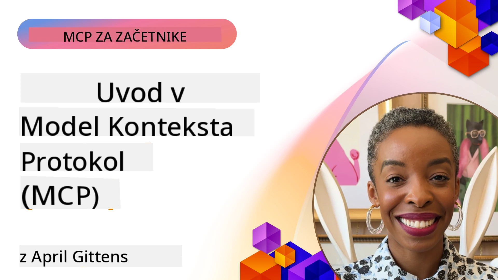
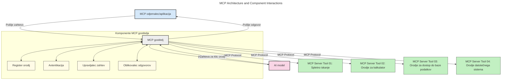
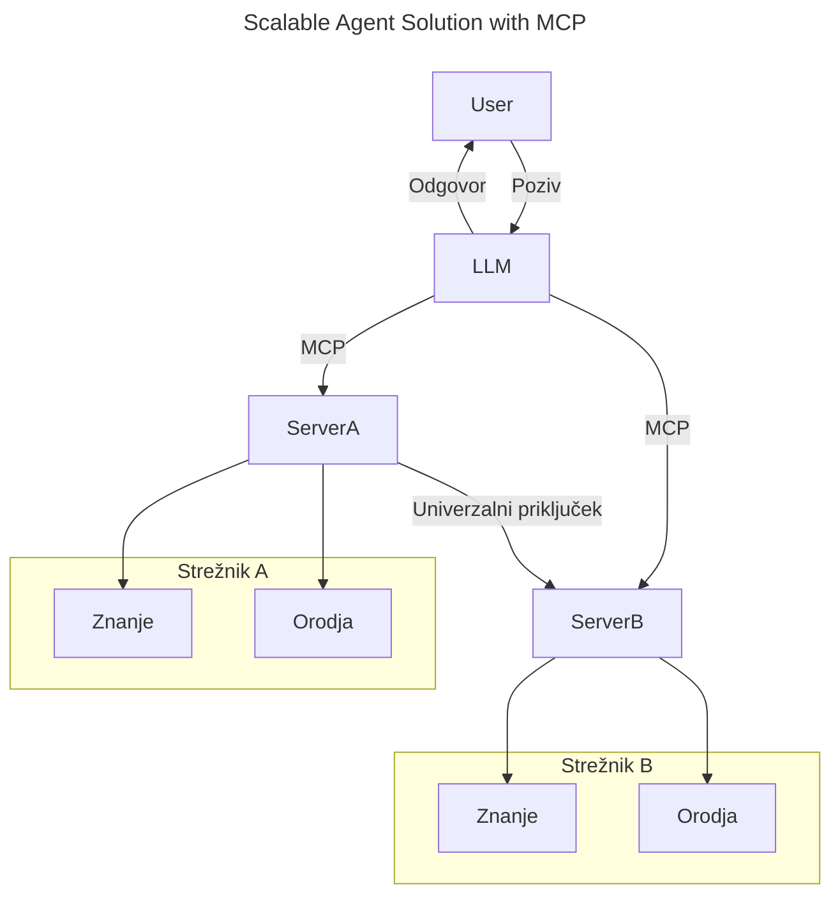
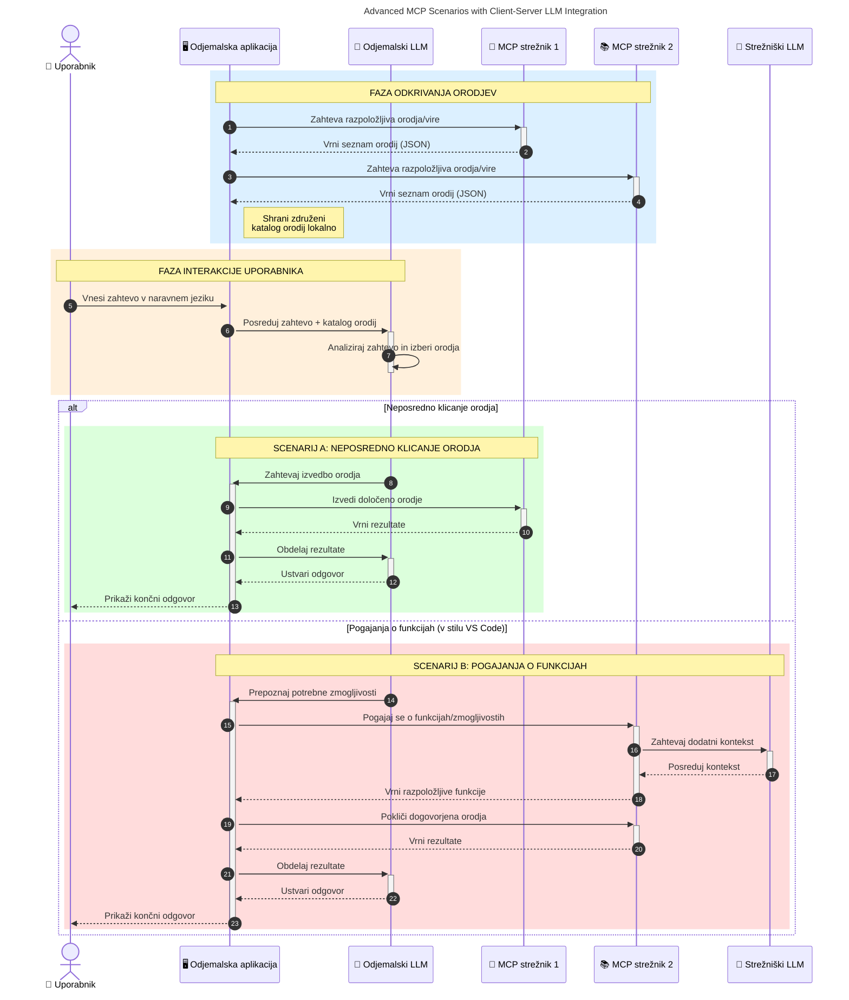

# Uvod v protokol konteksta modela (MCP): zakaj je pomemben za razširljive AI aplikacije

_(Kliknite na sliko zgoraj za ogled videa te lekcije)_

Generativne AI aplikacije so velik korak naprej, saj pogosto omogočajo uporabniku interakcijo z aplikacijo z uporabo naravnih jezikovnih navodil. Vendar pa, ko se v takšne aplikacije vloži več časa in virov, želite zagotoviti, da lahko funkcionalnosti in vire enostavno integrirate na način, ki omogoča enostavno razširljivost, da vaša aplikacija lahko podpira več kot en model in obvladuje različne modelne zapletenosti. Na kratko, gradnja Gen AI aplikacij je na začetku enostavna, vendar, ko rastejo in postajajo kompleksnejše, morate začeti definirati arhitekturo in verjetno boste morali uporabiti standard, da zagotovite, da so vaše aplikacije zgrajene na dosleden način. Tu nastopa MCP, da organizira stvari in zagotovi standard.

---

## **🔍 Kaj je protokol konteksta modela (MCP)?**

**Protokol konteksta modela (MCP)** je **odprti, standardizirani vmesnik**, ki omogoča velikim jezikovnim modelom (LLM) nemoteno interakcijo z zunanjimi orodji, API-ji in viri podatkov. Zagotavlja dosledno arhitekturo za izboljšanje funkcionalnosti AI modelov onkraj njihovih učnih podatkov, kar omogoča pametnejše, razširljivejše in bolj odzivne AI sisteme.

---

## **🎯 Zakaj je standardizacija v AI pomembna**

Ker generativne AI aplikacije postajajo bolj zapletene, je ključnega pomena sprejetje standardov, ki zagotavljajo **razširljivost, razširljivost, vzdržljivost** in **izogibanje zaklepanju pri dobavitelju**. MCP odgovarja na te potrebe z:

- Poenotenjem integracij model-orodje
- Zmanjšanjem krhkih, enkratnih prilagojenih rešitev
- Omogočanjem soobstoja več modelov različnih dobaviteljev znotraj enega ekosistema

**Opomba:** Čeprav se MCP predstavlja kot odprti standard, ni načrtov za standardizacijo MCP prek obstoječih standardnih organov, kot so IEEE, IETF, W3C, ISO ali drugih.

---

## **📚 Cilji učenja**

Do konca tega članka boste lahko:

- Definirali **protokol konteksta modela (MCP)** in njegove primere uporabe
- Razumeli, kako MCP standardizira komunikacijo model-orodje
- Prepoznali ključne komponente arhitekture MCP
- Raziskali dejanske primere uporabe MCP v podjetniških in razvojnih okoljih

---

## **💡 Zakaj je protokol konteksta modela (MCP) prelomnica**

### **🔗 MCP rešuje fragmentacijo v AI interakcijah**

Pred MCP je integracija modelov z orodji zahtevala:

- Prilagojeno kodo za vsak par orodje-model
- Nestandardne API-je za vsakega dobavitelja
- Pogoste prekinitve zaradi posodobitev
- Slabo razširljivost z več orodji

### **✅ Prednosti standardizacije MCP**

| **Prednost**               | **Opis**                                                                       |
|---------------------------|--------------------------------------------------------------------------------|
| Interoperabilnost          | LLM-ji delujejo nemoteno z orodji različnih dobaviteljev                       |
| Doslednost                | Enotno vedenje čez platforme in orodja                                        |
| Ponovna uporabnost         | Orodja, zgrajena enkrat, se lahko uporabljajo v več projektih in sistemih      |
| Pospešen razvoj            | Zmanjšajte čas razvoja z uporabo standardiziranih, takoj pripravljenih vmesnikov |

---

## **🧱 Pregled visokorazinske arhitekture MCP**

MCP sledi **modelu odjemalec-strežnik**, kjer:

- **Gostitelji MCP** poganjajo AI modele
- **Odjemalci MCP** sprožajo zahteve
- **Strežniki MCP** služijo kontekst, orodja in zmožnosti

### **Ključne komponente:**

- **Viri** – Statični ali dinamični podatki za modele  
- **Pozivi** – Vnaprej določeni delovni tokovi za vodeno generacijo  
- **Orodja** – Izvedljive funkcije, kot so iskanje, izračuni  
- **Vzorcevanje** – Agentno vedenje prek rekurzivnih interakcij (prenehano v
    MCP `2026-07-28`; nove implementacije naj se neposredno integrirajo z LLM
    ponudnikom)
- **Izhodišče** – Zahteve, sprožene s strani strežnika za uporabniški vhod
- **Korenine** – Informacijske lokacije datotečnega sistema, pomembne za strežnik
    (prenehano v MCP `2026-07-28`; bolje orodni parametri, URI-ji virov ali
    konfiguracija strežnika)

### **Arhitektura protokola:**

MCP uporablja dvoplastno arhitekturo:
- **Plast podatkov**: sporočila JSON-RPC 2.0, metapodatki po zahtevi, odkrivanje in
    protokolni primitivni elementi
- **Transportna plast**: stdio za lokalne podprocese in Streamable HTTP za
    oddaljene strežnike. Streamable HTTP lahko uporablja SSE okvirjenje za pretočne odgovore,
    vendar je starejši HTTP+SSE transport prenehal.

---

## Kako delujejo strežniki MCP

Strežniki MCP delujejo na naslednji način:

- **Potek zahtevka**:
    1. Zahtevek sproži končni uporabnik ali programska oprema, ki deluje v njegovem imenu.
    2. **Odjemalec MCP** pošlje zahtevek **gostitelju MCP**, ki upravlja izvajanje AI modela.
    3. **AI model** prejme uporabniški poziv in lahko zahteva dostop do zunanjih orodij ali podatkov prek enega ali več klicev orodij.
    4. **Gostitelj MCP**, ne neposredno model, komunicira z ustreznimi **strežniki MCP** z uporabo standardiziranega protokola.
- **Funkcionalnosti gostitelja MCP**:
    - **Register orodij**: vodi katalog razpoložljivih orodij in njihovih zmožnosti.
    - **Avtentikacija**: preverja dovoljenja za dostop do orodij.
    - **Obdelovalec zahtevkov**: procesira dohodne zahteve orodij iz modela.
    - **Formatirnik odzivov**: strukturira izhode orodij v format, ki ga model razume.
- **Izvajanje strežnika MCP**:
    - **Gostitelj MCP** usmerja klice orodij enemu ali več **strežnikom MCP**, ki izpostavljajo specializirane funkcije (npr. iskanje, izračuni, poizvedbe v bazah podatkov).
    - **Strežniki MCP** izvajajo svoje operacije in rezultat vračajo gostitelju MCP v doslednem formatu.
    - **Gostitelj MCP** oblikuje in posreduje te rezultate AI modelu.
- **Dokončanje odziva**:
    - **AI model** vključi izhode orodij v končni odziv.
    - **Gostitelj MCP** pošlje ta odziv nazaj **odjemalcu MCP**, ki ga dostavi končnemu uporabniku ali programski opremi, ki kliče.
    

## 👨‍💻 Kako zgraditi strežnik MCP (s primeri)

Strežniki MCP vam omogočajo razširitev zmožnosti LLM z zagotavljanjem podatkov in funkcionalnosti. 

Ste pripravljeni preizkusiti? Tukaj so SDK-ji za različne programske jezike in okolja s primeri ustvarjanja preprostih MCP strežnikov v različnih jezikih/okoljih:

- **Python SDK**: https://github.com/modelcontextprotocol/python-sdk

- **TypeScript SDK**: https://github.com/modelcontextprotocol/typescript-sdk

- **Java SDK**: https://github.com/modelcontextprotocol/java-sdk

- **C#/.NET SDK**: https://github.com/modelcontextprotocol/csharp-sdk

## 🌍 Dejanski primeri uporabe MCP

MCP omogoča širok nabor aplikacij z razširitvijo AI zmožnosti:

| **Aplikacija**                 | **Opis**                                                                       |
|------------------------------|--------------------------------------------------------------------------------|
| Podjetniška integracija podatkov | Povezava LLM z bazami podatkov, CRM-i ali internimi orodji                  |
| Agencijski AI sistemi          | Omogočanje avtonomnih agentov z dostopom do orodij in delovnimi tokovi odločanja |
| Večmodalne aplikacije          | Združevanje besedilnih, slikovnih in zvočnih orodij znotraj enotne AI aplikacije |
| Integracija podatkov v realnem času | Vključevanje živih podatkov v AI interakcije za natančnejše, trenutne rezultate |

### 🧠 MCP = Univerzalni standard za AI interakcije

Protokol konteksta modela (MCP) deluje kot univerzalni standard za AI interakcije, podobno kot USB-C standardizira fizične povezave za naprave. V svetu AI MCP zagotavlja dosleden vmesnik, ki omogoča modelom (odjemalcem) nemoteno integracijo z zunanjimi orodji in ponudniki podatkov (strežniki). To odpravlja potrebo po različnih, prilagojenih protokolih za vsak API ali vir podatkov.

V protokolu MCP orodje, združljivo z MCP (imenovano MCP strežnik), sledi poenotenemu standardu. Ti strežniki lahko navajajo orodja ali akcije, ki jih ponujajo, in te akcije izvajajo, ko jih AI agent zahteva. Platforme AI agentov, ki podpirajo MCP, lahko odkrijejo razpoložljiva orodja s strežnikov in jih kličejo preko tega standardnega protokola.

### 💡 Omogoča dostop do znanja

Poleg zagotavljanja orodij MCP omogoča tudi dostop do znanja. Omogoča aplikacijam, da zagotovijo kontekst velikim jezikovnim modelom (LLM) s povezavo z različnimi viri podatkov. Na primer, MCP strežnik lahko predstavlja podjetniški repozitorij dokumentov, kar agentom omogoča pridobitev relevantnih informacij po potrebi. Drug strežnik lahko obravnava posebne akcije kot pošiljanje e-pošte ali posodabljanje zapisov. Z vidika agenta so to preprosto orodja, ki jih lahko uporablja—nekatera vrnejo podatke (kontekst znanja), druga izvajajo akcije. MCP učinkovito upravlja oboje.

Agent, ki se poveže s strežnikom MCP, samodejno spozna razpoložljive zmožnosti strežnika in dostopne podatke prek standardiziranega formata. Ta standardizacija omogoča dinamično razpoložljivost orodij. Na primer, dodajanje novega MCP strežnika v sistem agenta takoj omogoči njegovo uporabo, brez potrebe po dodatnih prilagoditvah navodil agenta.

Ta poenostavljena integracija sovpada s tokom, prikazanim na naslednjem diagramu, kjer strežniki zagotavljajo tako orodja kot znanje, kar omogoča nemoteno sodelovanje med sistemi. 

### 👉 Primer: razširljiva agentna rešitev

Univerzalni priključek omogoča MCP strežnikom, da medsebojno komunicirajo in delijo zmožnosti, kar omogoča, da strežnikA delegira naloge strežnikuB ali dostopa do njegovih orodij in znanja. To federira orodja in podatke med strežniki ter spodbuja razširljive in modularne agentne arhitekture. Ker MCP standardizira izpostavljanje orodij, lahko agenti dinamično odkrijejo in usmerjajo zahteve med strežniki brez trdno kodiranih integracij.

Federacija orodij in znanja: Orodjem in podatkom je mogoče dostopati preko strežnikov, kar omogoča bolj razširljive in modularne agentne arhitekture.

### 🔄 Napredni scenariji MCP z integracijo LLM na strani odjemalca

Poleg osnovne arhitekture MCP obstajajo napredni scenariji, kjer tako odjemalec kot strežnik vsebujeta LLM, kar omogoča bolj sofisticirane interakcije. Na naslednjem diagramu je **Odjemalska aplikacija** lahko IDE z več MCP orodji, ki jih uporablja LLM:

## 🔐 Praktične koristi MCP

Tukaj so praktične koristi uporabe MCP:

- **Svežina**: Modeli lahko dostopajo do posodobljenih informacij zunaj svojih učnih podatkov
- **Razširitev zmogljivosti**: Modeli lahko izkoriščajo specializirana orodja za naloge, za katere niso bili učeni
- **Zmanjšane halucinacije**: Zunanji viri podatkov zagotavljajo dejansko utemeljitev
- **Zasebnost**: Občutljivi podatki lahko ostanejo znotraj varnih okolij namesto da bi bili vdelani v pozive

## 📌 Ključne ugotovitve

Naslednje so ključne ugotovitve za uporabo MCP:

- **MCP** standardizira, kako AI modeli sodelujejo z orodji in podatki
- Spodbuja **razširljivost, doslednost in interoperabilnost**
- MCP pomaga **zmanjšati čas razvoja, izboljšati zanesljivost in razširiti zmožnosti modela**
- Arhitektura odjemalec-strežnik **omogoča prilagodljive, razširljive AI aplikacije**

## 🧠 Vaja

Razmislite o AI aplikaciji, ki jo želite zgraditi.

- Katera **zunanja orodja ali podatki** bi lahko izboljšali njene zmogljivosti?
- Kako bi MCP lahko naredil integracijo **preprostejšo in bolj zanesljivo?**

## Dodatni viri

- [MCP GitHub repozitorij](https://github.com/modelcontextprotocol)

## Kaj sledi

Naslednji: [Poglavje 1: Osnovni koncepti](../01-CoreConcepts/README.md)

---

<!-- CO-OP TRANSLATOR DISCLAIMER START -->
**Omejitev odgovornosti**:
Ta dokument je bil preveden z uporabo AI prevajalske storitve [Co-op Translator](https://github.com/Azure/co-op-translator). Čeprav si prizadevamo za natančnost, vas prosimo, da upoštevate, da avtomatizirani prevodi lahko vsebujejo napake ali netočnosti. Izvirni dokument v njegovem izvirnem jeziku je treba obravnavati kot avtoritativni vir. Za kritične informacije je priporočljiv strokovni človeški prevod. Ne odgovarjamo za morebitna nesporazume ali napačne interpretacije, ki izhajajo iz uporabe tega prevoda.
<!-- CO-OP TRANSLATOR DISCLAIMER END -->