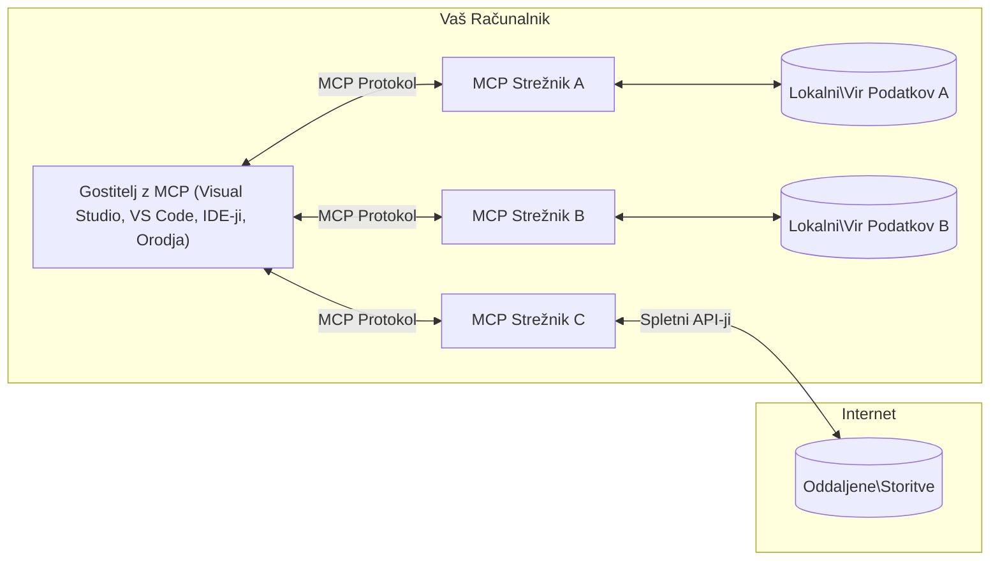

# Osnove MCP: Obvladovanje protokola Model Context za integracijo AI

[](https://youtu.be/earDzWGtE84)

_(Kliknite na zgornjo sliko za ogled videa te lekcije)_

[Model Context Protocol (MCP)](https://github.com/modelcontextprotocol) je zmogljiv, standardiziran okvir, ki optimizira komunikacijo med velikimi jezikovnimi modeli (LLM) in zunanjimi orodji, aplikacijami ter podatkovnimi viri.  
Ta vodič vas bo popeljal skozi osnovne koncepte MCP. Naučili se boste o njegovi arhitekturi klient-strežnik, ključnih komponentah, mehanizmih komunikacije in najboljših praksah implementacije.

- **Izrecno soglasje uporabnika**: Vsi dostopi do podatkov in operacije zahtevajo izrecno odobritev uporabnika pred izvedbo. Uporabniki morajo jasno razumeti, do katerih podatkov bo dostopano in katere ukrepe bo izvedlo, z natančnim nadzorom nad dovoljenji in pooblastili.

- **Zaščita zasebnosti podatkov**: Podatki uporabnikov so razkriti le z izrecnim soglasjem in morajo biti zaščiteni z robustnimi kontrolami dostopa skozi celoten življenjski cikel interakcije. Implementacije morajo preprečiti nepooblaščeno prenašanje podatkov in vzdrževati stroge meje zasebnosti.

- **Varnost izvajanja orodij**: Vsak klic orodja zahteva izrecno soglasje uporabnika z jasnim razumevanjem funkcionalnosti orodja, parametrov in morebitnih vplivov. Robustne varnostne meje morajo preprečiti nenamerno, nevarno ali zlonamerno izvajanje orodij.

- **Varnost transportne plasti**: Vsi komunikacijski kanali naj uporabljajo ustrezne mehanizme šifriranja in overjanja. Oddaljene povezave naj uporabljajo varne transportne protokole in pravilno upravljanje poverilnic.

#### Smernice za implementacijo:

- **Upravljanje dovoljenj**: Implementirajte natančne sisteme dovoljenj, ki uporabnikom omogočajo nadzor, kateri strežniki, orodja in viri so dostopni  
- **Overjanje in pooblastila**: Uporabite varne metode overjanja (OAuth, API ključi) z ustreznim upravljanjem žetonov in potekom  
- **Validacija vhodnih podatkov**: Validirajte vse parametre in vhodne podatke glede na definirane sheme, da preprečite injekcijske napade  
- **Revizijsko beleženje**: Vzdržujte obsežne zapise vseh operacij za varnostni nadzor in skladnost

## Pregled

Ta lekcija raziskuje temeljno arhitekturo in komponente, ki sestavljajo ekosistem Model Context Protocol (MCP). Naučili se boste o arhitekturi klient-strežnik, ključnih komponentah in mehanizmih komunikacije, ki poganjajo interakcije MCP.

## Ključni cilji učenja

Do konca te lekcije boste:

- Razumeli arhitekturo MCP klient-strežnik.  
- Prepoznali vloge in odgovornosti gostiteljev, klientov in strežnikov.  
- Analizirali ključne funkcije, ki naredijo MCP prilagodljivo integracijsko plast.  
- Spoznali, kako poteka pretok informacij znotraj ekosistema MCP.  
- Pridobili praktične vpoglede skozi primere kode v .NET, Javi, Pythonu in JavaScriptu.

## Arhitektura MCP: Podroben pogled

Ekosistem MCP temelji na modelu klient-strežnik. Ta modularna struktura omogoča AI aplikacijam učinkovito interakcijo z orodji, bazami podatkov, API-ji in kontekstualnimi viri. Razdelimo to arhitekturo na njene osnovne komponente.

V jedru MCP sledi arhitekturi klient-strežnik, kjer gostiteljska aplikacija lahko poveže več strežnikov:


- **Gostitelji MCP**: Programi, kot so VSCode, Claude Desktop, IDE-ji ali AI orodja, ki želijo dostopati do podatkov preko MCP  
- **Klienti MCP**: Protokolni klienti, ki vzdržujejo 1:1 povezave s strežniki  
- **Strežniki MCP**: Lahki programi, ki vsak posebej izpostavljajo specifične zmogljivosti preko standardiziranega Model Context Protocol  
- **Lokalni podatkovni viri**: Datoteke, baze podatkov in storitve na vašem računalniku, do katerih lahko MCP strežniki varno dostopajo  
- **Oddaljene storitve**: Zunanji sistemi, dostopni preko interneta, s katerimi se MCP strežniki lahko povežejo preko API-jev.

Protokol MCP je razvijajoči se standard, ki uporablja verzioniranje na osnovi datuma (format LLLL-MM-DD). Trenutna verzija protokola je **2025-11-25**. Najnovejše posodobitve si lahko ogledate v [specifikaciji protokola](https://modelcontextprotocol.io/specification/2025-11-25/)

### 1. Gostitelji

V Model Context Protocol (MCP) so **Gostitelji** AI aplikacije, ki služijo kot primarni vmesnik, preko katerega uporabniki komunicirajo s protokolom. Gostitelji koordinirajo in upravljajo povezave do več MCP strežnikov z ustvarjanjem namenskih MCP klientov za vsako strežniško povezavo. Primeri gostiteljev vključujejo:

- **AI aplikacije**: Claude Desktop, Visual Studio Code, Claude Code  
- **Razvojna okolja**: IDE-ji in urejevalniki kode z integracijo MCP  
- **Prilagojene aplikacije**: Namenjene AI agenti in orodja

**Gostitelji** so aplikacije, ki usklajujejo interakcije z AI modeli. Oni:

- **Orkestrirajo AI modele**: Izvajajo ali komunicirajo z LLM za generiranje odgovorov in usklajevanje AI delovnih tokov  
- **Upravljajo klientske povezave**: Ustvarjajo in vzdržujejo en MCP klient na vsako MCP strežniško povezavo  
- **Nadzorujejo uporabniški vmesnik**: Upravljajo potek pogovora, uporabniške interakcije in prikaz odgovorov  
- **Uveljavljajo varnost**: Nadzorujejo dovoljenja, varnostne omejitve in overjanje  
- **Upravljajo uporabniško soglasje**: Upravljajo odobritve uporabnikov za deljenje podatkov in izvajanje orodij

### 2. Klienti

**Klienti** so ključne komponente, ki vzdržujejo namensko en-na-en povezavo med gostitelji in MCP strežniki. Vsak MCP klient ustvari gostitelj za povezavo s specifičnim MCP strežnikom, kar zagotavlja organizirane in varne komunikacijske kanale. Več klientov omogoča gostiteljem hkratno povezavo z več strežniki.

**Klienti** so povezovalne komponente znotraj gostiteljske aplikacije. Oni:

- **Protokolna komunikacija**: Pošiljajo JSON-RPC 2.0 zahteve strežnikom s pozivi in navodili  
- **Pogajanja o zmogljivostih**: Pogajajo se o podprtih funkcijah in verzijah protokola s strežniki med inicializacijo  
- **Izvajanje orodij**: Upravljajo zahteve za izvajanje orodij iz modelov in obdelujejo odgovore  
- **Posodobitve v realnem času**: Upravljajo obvestila in posodobitve v realnem času s strežnikov  
- **Obdelava odgovorov**: Obdelujejo in oblikujejo strežniške odgovore za prikaz uporabnikom

### 3. Strežniki

**Strežniki** so programi, ki MCP klientom zagotavljajo kontekst, orodja in zmogljivosti. Lahko delujejo lokalno (na istem računalniku kot gostitelj) ali oddaljeno (na zunanjih platformah) in so odgovorni za obdelavo klientskih zahtev ter zagotavljanje strukturiranih odgovorov. Strežniki izpostavljajo specifične funkcionalnosti preko standardiziranega Model Context Protocol.

**Strežniki** so storitve, ki zagotavljajo kontekst in zmogljivosti. Oni:

- **Registracija funkcij**: Registrirajo in izpostavljajo razpoložljive primitivne elemente (viri, pozivi, orodja) klientom  
- **Obdelava zahtev**: Prejemajo in izvajajo klice orodij, zahteve po virih in pozive od klientov  
- **Zagotavljanje konteksta**: Zagotavljajo kontekstualne informacije in podatke za izboljšanje odgovorov modela  
- **Upravljanje stanja**: Vzdržujejo stanje seje in obdelujejo interakcije, ki zahtevajo stanje, kadar je potrebno  
- **Obvestila v realnem času**: Pošiljajo obvestila o spremembah zmogljivosti in posodobitvah povezanih klientom

Strežnike lahko razvije kdorkoli za razširitev zmogljivosti modelov s specializirano funkcionalnostjo, podpirajo pa tako lokalne kot oddaljene scenarije nameščanja.

### 4. Strežniške primitivne enote

Strežniki v Model Context Protocol (MCP) zagotavljajo tri osnovne **primitivne enote**, ki definirajo temeljne gradnike za bogate interakcije med klienti, gostitelji in jezikovnimi modeli. Te primitivne enote določajo vrste kontekstualnih informacij in dejanj, ki so na voljo preko protokola.

MCP strežniki lahko izpostavijo katerokoli kombinacijo naslednjih treh osnovnih primitivnih enot:

#### Viri

**Viri** so podatkovni viri, ki zagotavljajo kontekstualne informacije AI aplikacijam. Predstavljajo statično ali dinamično vsebino, ki lahko izboljša razumevanje modela in odločanje:

- **Kontekstualni podatki**: Strukturirane informacije in kontekst za porabo AI modela  
- **Baze znanja**: Dokumentni repozitoriji, članki, priročniki in raziskovalni prispevki  
- **Lokalni podatkovni viri**: Datoteke, baze podatkov in lokalne sistemske informacije  
- **Zunanji podatki**: Odzivi API-jev, spletne storitve in podatki oddaljenih sistemov  
- **Dinamična vsebina**: Podatki v realnem času, ki se posodabljajo glede na zunanje pogoje

Viri so identificirani z URI-ji in podpirajo odkrivanje preko metod `resources/list` ter pridobivanje preko `resources/read`:

```text
file://documents/project-spec.md
database://production/users/schema
api://weather/current
```

#### Pozivi

**Pozivi** so ponovno uporabni predlogi, ki pomagajo strukturirati interakcije z jezikovnimi modeli. Zagotavljajo standardizirane vzorce interakcij in predloge delovnih tokov:

- **Interakcije na osnovi predlog**: Vnaprej strukturirana sporočila in začetki pogovorov  
- **Predloge delovnih tokov**: Standardizirani zaporedji za pogoste naloge in interakcije  
- **Primeri z nekaj primeri**: Predloge na osnovi primerov za navodila modelu  
- **Sistemski pozivi**: Temeljni pozivi, ki definirajo vedenje in kontekst modela  
- **Dinamične predloge**: Parametrizirani pozivi, ki se prilagajajo specifičnim kontekstom

Pozivi podpirajo zamenjavo spremenljivk in jih je mogoče odkriti preko `prompts/list` ter pridobiti z `prompts/get`:

```markdown
Generate a {{task_type}} for {{product}} targeting {{audience}} with the following requirements: {{requirements}}
```

#### Orodja

**Orodja** so izvršljive funkcije, ki jih lahko AI modeli pokličejo za izvedbo specifičnih dejanj. Predstavljajo "glagole" ekosistema MCP, ki omogočajo modelom interakcijo z zunanjimi sistemi:

- **Izvršljive funkcije**: Posamezne operacije, ki jih modeli lahko pokličejo s specifičnimi parametri  
- **Integracija zunanjih sistemov**: Klici API-jev, poizvedbe v bazah, operacije z datotekami, izračuni  
- **Edinstvena identiteta**: Vsako orodje ima edinstveno ime, opis in shemo parametrov  
- **Strukturiran vhod/izhod**: Orodja sprejemajo validirane parametre in vračajo strukturirane, tipizirane odgovore  
- **Zmogljivosti dejanj**: Omogočajo modelom izvajanje dejanj v resničnem svetu in pridobivanje živih podatkov

Orodja so definirana z JSON shemo za validacijo parametrov in jih je mogoče odkriti preko `tools/list` ter izvajati preko `tools/call`:

```typescript
server.tool(
  "search_products", 
  {
    query: z.string().describe("Search query for products"),
    category: z.string().optional().describe("Product category filter"),
    max_results: z.number().default(10).describe("Maximum results to return")
  }, 
  async (params) => {
    // Izvedi iskanje in vrni strukturirane rezultate
    return await productService.search(params);
  }
);
```

## Klientske primitivne enote

V Model Context Protocol (MCP) lahko **klienti** izpostavijo primitivne enote, ki strežnikom omogočajo zahtevo dodatnih zmogljivosti od gostiteljske aplikacije. Te klientske primitivne enote omogočajo bogatejše, bolj interaktivne strežniške implementacije, ki lahko dostopajo do zmogljivosti AI modelov in uporabniških interakcij.

### Vzorec

**Vzorec** omogoča strežnikom, da zahtevajo dokončanja jezikovnega modela iz AI aplikacije klienta. Ta primitiv omogoča strežnikom dostop do zmogljivosti LLM brez vgrajevanja lastnih odvisnosti modela:

- **Neodvisen dostop do modela**: Strežniki lahko zahtevajo dokončanja brez vključevanja SDK-jev LLM ali upravljanja dostopa do modela  
- **AI, ki jo sproži strežnik**: Omogoča strežnikom samostojno generiranje vsebine z uporabo modela klienta  
- **Rekurzivne LLM interakcije**: Podpira kompleksne scenarije, kjer strežniki potrebujejo AI pomoč pri obdelavi  
- **Dinamična generacija vsebine**: Omogoča strežnikom ustvarjanje kontekstualnih odgovorov z uporabo modela gostitelja

Vzorec se sproži preko metode `sampling/complete`, kjer strežniki pošljejo zahteve za dokončanje klientom.

### Povpraševanje

**Povpraševanje** omogoča strežnikom, da preko klientovega vmesnika zahtevajo dodatne informacije ali potrditev od uporabnikov:

- **Zahteve za uporabniški vnos**: Strežniki lahko zahtevajo dodatne informacije, kadar so potrebne za izvajanje orodij  
- **Pogovorna okna za potrditev**: Zahtevajo uporabnikovo odobritev za občutljive ali vplivne operacije  
- **Interaktivni delovni tokovi**: Omogočajo strežnikom ustvarjanje korak-po-korak uporabniških interakcij  
- **Dinamično zbiranje parametrov**: Zbirajo manjkajoče ali opcijske parametre med izvajanjem orodij

Zahteve za povpraševanje se izvajajo z metodo `elicitation/request` za zbiranje uporabniškega vnosa preko klientovega vmesnika.

### Beleženje

**Beleženje** omogoča strežnikom pošiljanje strukturiranih zapisov dnevnika klientom za odpravljanje napak, nadzor in operativno preglednost:

- **Podpora odpravljanju napak**: Omogoča strežnikom podrobne zapise izvajanja za odpravljanje težav  
- **Operativni nadzor**: Pošiljanje statusnih posodobitev in meritev zmogljivosti klientom  
- **Poročanje o napakah**: Zagotavljanje podrobnega konteksta napak in diagnostičnih informacij  
- **Revizijske sledi**: Ustvarjanje obsežnih zapisov strežniških operacij in odločitev

Sporočila za beleženje se pošiljajo klientom za zagotavljanje preglednosti strežniških operacij in olajšanje odpravljanja napak.

## Pretok informacij v MCP

Model Context Protocol (MCP) definira strukturiran pretok informacij med gostitelji, klienti, strežniki in modeli. Razumevanje tega pretoka pomaga pojasniti, kako se obdelujejo uporabniške zahteve in kako se zunanja orodja ter podatkovni viri integrirajo v odgovore modela.

- **Gostitelj vzpostavi povezavo**  
  Gostiteljska aplikacija (kot je IDE ali klepetalni vmesnik) vzpostavi povezavo s MCP strežnikom, običajno preko STDIO, WebSocket ali drugega podprtega transporta.

- **Pogajanje o zmogljivostih**  
  Klient (vdelan v gostitelja) in strežnik izmenjata informacije o podprtih funkcijah, orodjih, virih in verzijah protokola. To zagotavlja, da obe strani razumeta, katere zmogljivosti so na voljo za sejo.

- **Uporabniška zahteva**  
  Uporabnik komunicira z gostiteljem (npr. vnese poziv ali ukaz). Gostitelj zbere ta vnos in ga posreduje klientu za obdelavo.

- **Uporaba vira ali orodja**  
  - Klient lahko zahteva dodatni kontekst ali vire od strežnika (kot so datoteke, vnosi v bazi ali članki iz baze znanja) za obogatitev razumevanja modela.  
  - Če model ugotovi, da je potrebno orodje (npr. za pridobitev podatkov, izvedbo izračuna ali klic API-ja), klient pošlje zahtevo za klic orodja strežniku, pri čemer navede ime orodja in parametre.

- **Izvajanje strežnika**  
  Strežnik prejme zahtevo za vir ali orodje, izvede potrebne operacije (kot je zagon funkcije, poizvedba v bazi ali pridobitev datoteke) in vrne rezultate klientu v strukturirani obliki.

- **Generiranje odgovora**  
  Klient integrira strežniške odgovore (podatke vira, izhode orodij itd.) v tekočo interakcijo z modelom. Model uporabi te informacije za generiranje celovitega in kontekstualno relevantnega odgovora.

- **Prikaz rezultata**  
  Gostitelj prejme končni izhod od klienta in ga predstavi uporabniku, pogosto vključno z generiranim besedilom modela in morebitnimi rezultati izvajanja orodij ali iskanja virov.

Ta pretok omogoča MCP podporo naprednim, interaktivnim in kontekstualno ozaveščenim AI aplikacijam z nemotenim povezovanjem modelov z zunanjimi orodji in podatkovnimi viri.

## Arhitektura protokola in plasti

MCP sestavljata dve ločeni arhitekturni plasti, ki skupaj zagotavljata celovit komunikacijski okvir:

### Podatkovna plast

**Podatkovna plast** implementira osnovni MCP protokol z uporabo **JSON-RPC 2.0** kot temelja. Ta plast definira strukturo sporočil, semantiko in vzorce interakcij:

#### Osnovne komponente:

- **JSON-RPC 2.0 protokol**: Vsa komunikacija uporablja standardiziran format sporočil JSON-RPC 2.0 za klice metod, odgovore in obvestila
- **Upravljanje življenjskega cikla**: Upravljanje inicializacije povezave, pogajanja o zmogljivostih in zaključka seje med odjemalci in strežniki  
- **Strežniški primitivci**: Omogočajo strežnikom zagotavljanje osnovne funkcionalnosti preko orodij, virov in pozivov  
- **Odjemalski primitivci**: Omogočajo strežnikom zahtevo po vzorčenju iz LLM-jev, pridobivanje uporabniškega vnosa in pošiljanje dnevniških sporočil  
- **Obvestila v realnem času**: Podpira asinhrona obvestila za dinamične posodobitve brez poizvedovanja  

#### Ključne funkcije:

- **Pogajanje o različici protokola**: Uporablja datum kot različico (LLLL-MM-DD) za zagotavljanje združljivosti  
- **Odkritje zmogljivosti**: Odjemalci in strežniki med inicializacijo izmenjajo informacije o podprtih funkcijah  
- **Stanje seje**: Ohranja stanje povezave skozi več interakcij za kontinuiteto konteksta  

### Transportna plast

**Transportna plast** upravlja komunikacijske kanale, oblikovanje sporočil in overjanje med udeleženci MCP:

#### Podprti transportni mehanizmi:

1. **STDIO transport**:  
   - Uporablja standardne vhode/izhode za neposredno komunikacijo procesov  
   - Optimalno za lokalne procese na istem računalniku brez omrežnega režija  
   - Pogosto uporabljen za lokalne implementacije MCP strežnikov  

2. **Streamable HTTP transport**:  
   - Uporablja HTTP POST za sporočila od odjemalca do strežnika  
   - Neobvezni Server-Sent Events (SSE) za pretakanje od strežnika do odjemalca  
   - Omogoča komunikacijo z oddaljenimi strežniki preko omrežij  
   - Podpira standardno HTTP overjanje (bearer žetoni, API ključi, prilagojeni glavi)  
   - MCP priporoča OAuth za varno overjanje na osnovi žetonov  

#### Transportna abstrakcija:

Transportna plast abstraktira podrobnosti komunikacije od podatkovne plasti, kar omogoča enak format sporočil JSON-RPC 2.0 za vse transportne mehanizme. Ta abstrakcija omogoča aplikacijam nemoteno preklapljanje med lokalnimi in oddaljenimi strežniki.

### Varnostne premisleke

Implementacije MCP morajo upoštevati več ključnih varnostnih načel za zagotavljanje varnih, zaupanja vrednih in zaščitenih interakcij v vseh operacijah protokola:

- **Uporabniški soglasje in nadzor**: Uporabniki morajo dati izrecno soglasje pred dostopom do podatkov ali izvajanjem operacij. Morajo imeti jasen nadzor nad tem, kateri podatki se delijo in katere akcije so pooblaščene, podprto z intuitivnimi uporabniškimi vmesniki za pregled in odobritev aktivnosti.  

- **Zasebnost podatkov**: Uporabniški podatki naj bodo razkriti le z izrecnim soglasjem in zaščiteni z ustreznimi kontrolami dostopa. Implementacije MCP morajo preprečiti nepooblaščeno prenašanje podatkov in zagotoviti ohranjanje zasebnosti skozi vse interakcije.  

- **Varnost orodij**: Pred klicem kateregakoli orodja je potrebno izrecno uporabniško soglasje. Uporabniki morajo imeti jasno razumevanje funkcionalnosti vsakega orodja, hkrati pa morajo biti vzpostavljene robustne varnostne meje, da se prepreči nenamerno ali nevarno izvajanje orodij.  

S spoštovanjem teh varnostnih načel MCP zagotavlja zaupanje uporabnikov, zasebnost in varnost v vseh interakcijah protokola, hkrati pa omogoča zmogljive integracije umetne inteligence.

## Primeri kode: Ključne komponente

Spodaj so primeri kode v več priljubljenih programskih jezikih, ki prikazujejo, kako implementirati ključne MCP strežniške komponente in orodja.

### Primer .NET: Ustvarjanje preprostega MCP strežnika z orodji

Tukaj je praktičen primer kode v .NET, ki prikazuje, kako implementirati preprost MCP strežnik s prilagojenimi orodji. Ta primer prikazuje, kako definirati in registrirati orodja, obdelovati zahteve in povezati strežnik z uporabo Model Context Protocol.

```csharp
using System;
using System.Threading.Tasks;
using ModelContextProtocol.Server;
using ModelContextProtocol.Server.Transport;
using ModelContextProtocol.Server.Tools;

public class WeatherServer
{
    public static async Task Main(string[] args)
    {
        // Create an MCP server
        var server = new McpServer(
            name: "Weather MCP Server",
            version: "1.0.0"
        );
        
        // Register our custom weather tool
        server.AddTool<string, WeatherData>("weatherTool", 
            description: "Gets current weather for a location",
            execute: async (location) => {
                // Call weather API (simplified)
                var weatherData = await GetWeatherDataAsync(location);
                return weatherData;
            });
        
        // Connect the server using stdio transport
        var transport = new StdioServerTransport();
        await server.ConnectAsync(transport);
        
        Console.WriteLine("Weather MCP Server started");
        
        // Keep the server running until process is terminated
        await Task.Delay(-1);
    }
    
    private static async Task<WeatherData> GetWeatherDataAsync(string location)
    {
        // This would normally call a weather API
        // Simplified for demonstration
        await Task.Delay(100); // Simulate API call
        return new WeatherData { 
            Temperature = 72.5,
            Conditions = "Sunny",
            Location = location
        };
    }
}

public class WeatherData
{
    public double Temperature { get; set; }
    public string Conditions { get; set; }
    public string Location { get; set; }
}
```

### Primer Java: MCP strežniške komponente

Ta primer prikazuje enak MCP strežnik in registracijo orodij kot zgornji .NET primer, vendar implementiran v Javi.

```java
import io.modelcontextprotocol.server.McpServer;
import io.modelcontextprotocol.server.McpToolDefinition;
import io.modelcontextprotocol.server.transport.StdioServerTransport;
import io.modelcontextprotocol.server.tool.ToolExecutionContext;
import io.modelcontextprotocol.server.tool.ToolResponse;

public class WeatherMcpServer {
    public static void main(String[] args) throws Exception {
        // Ustvari MCP strežnik
        McpServer server = McpServer.builder()
            .name("Weather MCP Server")
            .version("1.0.0")
            .build();
            
        // Registriraj vremensko orodje
        server.registerTool(McpToolDefinition.builder("weatherTool")
            .description("Gets current weather for a location")
            .parameter("location", String.class)
            .execute((ToolExecutionContext ctx) -> {
                String location = ctx.getParameter("location", String.class);
                
                // Pridobi vremenske podatke (poenostavljeno)
                WeatherData data = getWeatherData(location);
                
                // Vrni oblikovan odgovor
                return ToolResponse.content(
                    String.format("Temperature: %.1f°F, Conditions: %s, Location: %s", 
                    data.getTemperature(), 
                    data.getConditions(), 
                    data.getLocation())
                );
            })
            .build());
        
        // Poveži strežnik z uporabo stdio transporta
        try (StdioServerTransport transport = new StdioServerTransport()) {
            server.connect(transport);
            System.out.println("Weather MCP Server started");
            // Ohrani strežnik aktiven, dokler proces ni prekinjen
            Thread.currentThread().join();
        }
    }
    
    private static WeatherData getWeatherData(String location) {
        // Implementacija bi klicala vremenski API
        // Poenostavljeno za namene primera
        return new WeatherData(72.5, "Sunny", location);
    }
}

class WeatherData {
    private double temperature;
    private String conditions;
    private String location;
    
    public WeatherData(double temperature, String conditions, String location) {
        this.temperature = temperature;
        this.conditions = conditions;
        this.location = location;
    }
    
    public double getTemperature() {
        return temperature;
    }
    
    public String getConditions() {
        return conditions;
    }
    
    public String getLocation() {
        return location;
    }
}
```

### Primer Python: Gradnja MCP strežnika

Ta primer uporablja fastmcp, zato ga najprej namestite:

```python
pip install fastmcp
```
Primer kode:

```python
#!/usr/bin/env python3
import asyncio
from fastmcp import FastMCP
from fastmcp.transports.stdio import serve_stdio

# Ustvari FastMCP strežnik
mcp = FastMCP(
    name="Weather MCP Server",
    version="1.0.0"
)

@mcp.tool()
def get_weather(location: str) -> dict:
    """Gets current weather for a location."""
    return {
        "temperature": 72.5,
        "conditions": "Sunny",
        "location": location
    }

# Alternativni pristop z uporabo razreda
class WeatherTools:
    @mcp.tool()
    def forecast(self, location: str, days: int = 1) -> dict:
        """Gets weather forecast for a location for the specified number of days."""
        return {
            "location": location,
            "forecast": [
                {"day": i+1, "temperature": 70 + i, "conditions": "Partly Cloudy"}
                for i in range(days)
            ]
        }

# Registriraj orodja razreda
weather_tools = WeatherTools()

# Zaženi strežnik
if __name__ == "__main__":
    asyncio.run(serve_stdio(mcp))
```

### Primer JavaScript: Ustvarjanje MCP strežnika

Ta primer prikazuje ustvarjanje MCP strežnika v JavaScriptu in kako registrirati dve orodji povezani z vremenskimi podatki.

```javascript
// Uporaba uradnega Model Context Protocol SDK
import { McpServer } from "@modelcontextprotocol/sdk/server/mcp.js";
import { StdioServerTransport } from "@modelcontextprotocol/sdk/server/stdio.js";
import { z } from "zod"; // Za preverjanje parametrov

// Ustvari MCP strežnik
const server = new McpServer({
  name: "Weather MCP Server",
  version: "1.0.0"
});

// Določi orodje za vreme
server.tool(
  "weatherTool",
  {
    location: z.string().describe("The location to get weather for")
  },
  async ({ location }) => {
    // To bi običajno klicalo vremenski API
    // Poenostavljeno za demonstracijo
    const weatherData = await getWeatherData(location);
    
    return {
      content: [
        { 
          type: "text", 
          text: `Temperature: ${weatherData.temperature}°F, Conditions: ${weatherData.conditions}, Location: ${weatherData.location}` 
        }
      ]
    };
  }
);

// Določi orodje za napoved
server.tool(
  "forecastTool",
  {
    location: z.string(),
    days: z.number().default(3).describe("Number of days for forecast")
  },
  async ({ location, days }) => {
    // To bi običajno klicalo vremenski API
    // Poenostavljeno za demonstracijo
    const forecast = await getForecastData(location, days);
    
    return {
      content: [
        { 
          type: "text", 
          text: `${days}-day forecast for ${location}: ${JSON.stringify(forecast)}` 
        }
      ]
    };
  }
);

// Pomožne funkcije
async function getWeatherData(location) {
  // Simuliraj klic API-ja
  return {
    temperature: 72.5,
    conditions: "Sunny",
    location: location
  };
}

async function getForecastData(location, days) {
  // Simuliraj klic API-ja
  return Array.from({ length: days }, (_, i) => ({
    day: i + 1,
    temperature: 70 + Math.floor(Math.random() * 10),
    conditions: i % 2 === 0 ? "Sunny" : "Partly Cloudy"
  }));
}

// Poveži strežnik z uporabo stdio transporta
const transport = new StdioServerTransport();
server.connect(transport).catch(console.error);

console.log("Weather MCP Server started");
```

Ta JavaScript primer prikazuje, kako ustvariti MCP odjemalca, ki se poveže s strežnikom, pošlje poziv in obdela odgovor, vključno z vsemi klici orodij, ki so bili izvedeni.

## Varnost in pooblastila

MCP vključuje več vgrajenih konceptov in mehanizmov za upravljanje varnosti in pooblastil skozi celoten protokol:

1. **Nadzor dovoljenj za orodja**:  
   Odjemalci lahko določijo, katera orodja sme model uporabljati med sejo. To zagotavlja, da so dostopna le izrecno pooblaščena orodja, kar zmanjša tveganje nenamernih ali nevarnih operacij. Dovoljenja se lahko dinamično konfigurirajo glede na uporabniške preference, organizacijske politike ali kontekst interakcije.  

2. **Overjanje**:  
   Strežniki lahko zahtevajo overjanje pred dovoljenjem dostopa do orodij, virov ali občutljivih operacij. To lahko vključuje API ključe, OAuth žetone ali druge sheme overjanja. Pravilno overjanje zagotavlja, da lahko strežniške zmogljivosti kličejo le zaupanja vredni odjemalci in uporabniki.  

3. **Validacija**:  
   Validacija parametrov je obvezna za vse klice orodij. Vsako orodje definira pričakovane tipe, formate in omejitve za svoje parametre, strežnik pa ustrezno validira dohodne zahteve. To preprečuje, da bi nepravilni ali zlonamerni vnosi dosegli implementacije orodij in pomaga ohranjati integriteto operacij.  

4. **Omejevanje hitrosti**:  
   Za preprečevanje zlorab in zagotavljanje poštene uporabe strežniških virov lahko MCP strežniki izvajajo omejevanje hitrosti za klice orodij in dostop do virov. Omejitve se lahko uporabljajo na uporabnika, sejo ali globalno in pomagajo zaščititi pred napadi zavrnitve storitve ali pretirano porabo virov.  

S kombinacijo teh mehanizmov MCP zagotavlja varno osnovo za integracijo jezikovnih modelov z zunanjimi orodji in viri podatkov, hkrati pa uporabnikom in razvijalcem omogoča natančen nadzor nad dostopom in uporabo.

## Protokolna sporočila in potek komunikacije

MCP komunikacija uporablja strukturirana **JSON-RPC 2.0** sporočila za jasne in zanesljive interakcije med gostitelji, odjemalci in strežniki. Protokol definira specifične vzorce sporočil za različne vrste operacij:

### Osnovne vrste sporočil:

#### **Inicializacijska sporočila**
- **`initialize` zahteva**: Vzpostavi povezavo in pogaja različico protokola ter zmogljivosti  
- **`initialize` odgovor**: Potrdi podprte funkcije in informacije o strežniku  
- **`notifications/initialized`**: Signalizira, da je inicializacija zaključena in seja pripravljena  

#### **Odkritvena sporočila**
- **`tools/list` zahteva**: Odkrije na voljo orodja na strežniku  
- **`resources/list` zahteva**: Prikaže seznam razpoložljivih virov (podatkovnih virov)  
- **`prompts/list` zahteva**: Pridobi na voljo predloge pozivov  

#### **Izvedbena sporočila**  
- **`tools/call` zahteva**: Izvede določeno orodje z danimi parametri  
- **`resources/read` zahteva**: Pridobi vsebino določenega vira  
- **`prompts/get` zahteva**: Pridobi predlogo poziva z neobveznimi parametri  

#### **Sporočila na strani odjemalca**
- **`sampling/complete` zahteva**: Strežnik zahteva dokončanje LLM od odjemalca  
- **`elicitation/request`**: Strežnik zahteva uporabniški vnos preko odjemalskega vmesnika  
- **Dnevniška sporočila**: Strežnik pošilja strukturirana dnevniška sporočila odjemalcu  

#### **Obvestilna sporočila**
- **`notifications/tools/list_changed`**: Strežnik obvešča odjemalca o spremembah orodij  
- **`notifications/resources/list_changed`**: Strežnik obvešča odjemalca o spremembah virov  
- **`notifications/prompts/list_changed`**: Strežnik obvešča odjemalca o spremembah pozivov  

### Struktura sporočil:

Vsa MCP sporočila sledijo formatu JSON-RPC 2.0 z:  
- **Zahtevami**: Vključujejo `id`, `method` in neobvezne `params`  
- **Odgovori**: Vključujejo `id` in bodisi `result` ali `error`  
- **Obvestili**: Vključujejo `method` in neobvezne `params` (brez `id` in brez pričakovanega odgovora)  

Ta strukturirana komunikacija zagotavlja zanesljive, sledljive in razširljive interakcije, ki podpirajo napredne scenarije, kot so posodobitve v realnem času, verižna uporaba orodij in robustno ravnanje z napakami.

## Ključne ugotovitve

- **Arhitektura**: MCP uporablja arhitekturo odjemalec-strežnik, kjer gostitelji upravljajo več odjemalskih povezav do strežnikov  
- **Udeleženci**: Ekosistem vključuje gostitelje (AI aplikacije), odjemalce (protokolne povezovalce) in strežnike (ponudnike zmogljivosti)  
- **Transportni mehanizmi**: Komunikacija podpira STDIO (lokalno) in Streamable HTTP z neobveznim SSE (oddaljeno)  
- **Osnovni primitivci**: Strežniki izpostavljajo orodja (izvedljive funkcije), vire (podatkovne vire) in pozive (predloge)  
- **Odjemalski primitivci**: Strežniki lahko zahtevajo vzorčenje (LLM dokončanja), pridobivanje vnosa (elicitation) in beleženje od odjemalcev  
- **Osnova protokola**: Zgrajen na JSON-RPC 2.0 z datumskim verzioniranjem (trenutno: 2025-11-25)  
- **Zmožnosti v realnem času**: Podpira obvestila za dinamične posodobitve in sinhronizacijo v realnem času  
- **Varnost na prvem mestu**: Izrecno uporabniško soglasje, zaščita zasebnosti podatkov in varen transport so osnovne zahteve  

## Vaja

Oblikujte preprosto MCP orodje, ki bi bilo uporabno na vašem področju. Določite:  
1. Kako bi se orodje imenovalo  
2. Katere parametre bi sprejemalo  
3. Kakšen izhod bi vrnilo  
4. Kako bi model lahko uporabil to orodje za reševanje uporabniških problemov  

---

## Kaj sledi

Naslednje: [Poglavje 2: Varnost](../02-Security/README.md)

---

<!-- CO-OP TRANSLATOR DISCLAIMER START -->
**Omejitev odgovornosti**:
Ta dokument je bil preveden z uporabo storitve za prevajanje z umetno inteligenco [Co-op Translator](https://github.com/Azure/co-op-translator). Čeprav si prizadevamo za natančnost, vas opozarjamo, da avtomatizirani prevodi lahko vsebujejo napake ali netočnosti. Izvirni dokument v njegovem izvirnem jeziku velja za avtoritativni vir. Za ključne informacije priporočamo strokovni človeški prevod. Za morebitna nesporazume ali napačne interpretacije, ki izhajajo iz uporabe tega prevoda, ne odgovarjamo.
<!-- CO-OP TRANSLATOR DISCLAIMER END -->