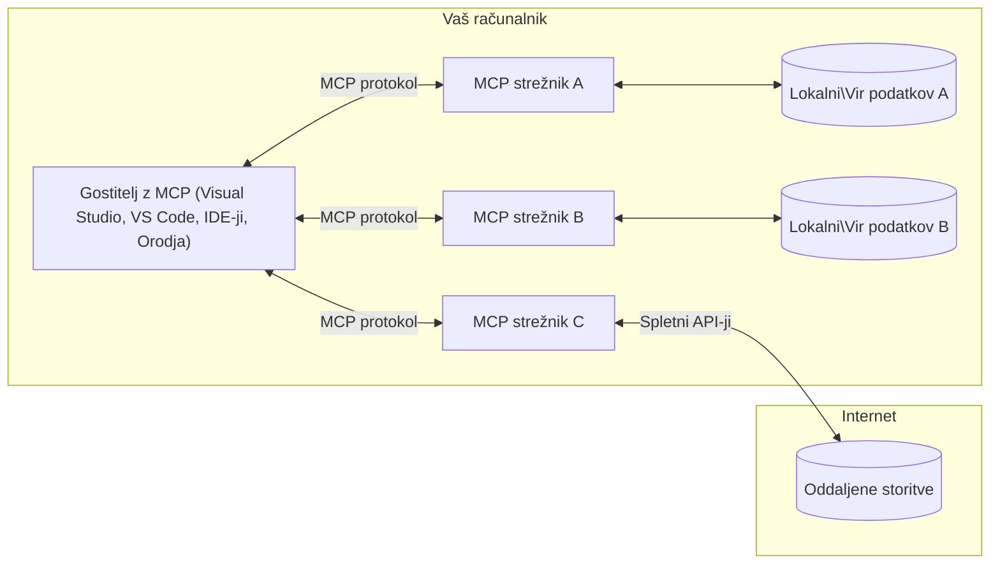

# Osnovni koncepti MCP: obvladovanje protokola Model Context za integracijo AI

[](https://youtu.be/earDzWGtE84)

_(Kliknite na sliko zgoraj za ogled posnetka tega pouka)_

[Protokol Model Context (MCP)](https://github.com/modelcontextprotocol) je zmogljivo, standardizirano ogrodje, ki optimizira komunikacijo med velikimi jezikovnimi modeli (LLM) in zunanjimi orodji, aplikacijami ter viri podatkov.
Ta vodič vas bo popeljal skozi osnovne koncepte MCP. Naučili se boste o njegovi arhitekturi odjemalec-strežnik, ključnih komponentah, mehanizmih komunikacije in najboljših praksah za implementacijo.

- **Nadzor uporabnika in soglasje**: Gostitelji naj jasno pokažejo, kateri podatki in orodja so na voljo prek strežnika, dovolijo uporabnikom zavrnitev operacij in pridobitev izrecnega potvrditve za občutljive ali posledične ukrepe. MCP ne zahteva potrditvenih pogovorov pred vsakim klicem orodja.


- **Zaščita zasebnosti podatkov**: Podatki uporabnikov so razkriti le z izrecnim soglasjem in morajo biti zaščiteni z robustnimi nadzornimi sistemi dostopa skozi celoten življenjski cikel interakcije. Implementacije morajo preprečiti nepooblaščeni prenos podatkov in vzdrževati stroge meje zasebnosti.

- **Varnost izvajanja orodij**: Gostitelji naj naredijo klice orodij vidne ter omogočijo človeku, da jih zavrne. Občutljive operacije morajo pred izvajanjem prikazati vnose in vplive orodij, z varnostnimi mejami, ki preprečujejo nenamerne ali zlonamerne ukrepe.


- **Varnost prenosa**: Oddaljene povezave morajo uporabljati HTTPS in MCP model pooblastila. Lokalni stdio strežniki se zanašajo na izolacijo procesov, zanesljivo konfiguracijo in varno ravnanje z dedovanimi poverilnicami.


#### Smernice za implementacijo:

- **Upravljanje dovoljenj**: Uvedite sistem finozrnatih dovoljenj, ki uporabnikom omogoča nadzor nad tem, kateri strežniki, orodja in viri so dostopni
- **Avtentikacija in avtorizacija**: Uporabite varne metode avtentikacije (OAuth, API ključi) z ustreznim upravljanjem in potekom žetonov  
- **Preverjanje vhodov**: Preverite vse parametre in podatkovne vnose v skladu z določenimi shemami, da preprečite napade z vdori
- **Zapisovanje revizije**: Vzdržujte celovite zapise vseh operacij za spremljanje varnosti in skladnost

## Pregled

Ta lekcija raziskuje osnovno arhitekturo in komponente, ki sestavljajo ekosistem protokola Model Context (MCP). Naučili se boste o arhitekturi odjemalec-strežnik, ključnih komponentah in komunikacijskih mehanizmih, ki omogočajo interakcije MCP.

## Ključni cilji učenja

Do konca te lekcije boste:

- Razumeli arhitekturo odjemalec-strežnik MCP.
- Prepoznali vloge in odgovornosti gostiteljev, odjemalcev in strežnikov.
- Analizirali ključne funkcije, ki delajo MCP fleksibilno integracijsko plast.
- Naučili se, kako teče informacija znotraj ekosistema MCP.
- Pridobili praktična spoznanja skozi primere kode v .NET, Javi, Pythonu in JavaScriptu.

## Arhitektura MCP: poglobljen pogled

Ekosistem MCP je zgrajen na modelu odjemalec-strežnik. Ta modularna struktura omogoča AI aplikacijam učinkovito interakcijo z orodji, podatkovnimi bazami, API-ji in kontekstualnimi viri. Razdelimo to arhitekturo na njene osnovne komponente.

V osnovi MCP sledi arhitekturi odjemalec-strežnik, kjer se gostiteljska aplikacija lahko poveže z več strežniki:


```mermaid
flowchart LR
    subgraph "Vaš računalnik"
        Host["Gostitelj z MCP (Visual Studio, VS Code, IDE-ji, Orodja)"]
        S1["MCP strežnik A"]
        S2["MCP strežnik B"]
        S3["MCP strežnik C"]
        Host <-->|"MCP protokol"| S1
        Host <-->|"MCP protokol"| S2
        Host <-->|"MCP protokol"| S3
        S1 <--> D1[("Lokalni\Vir podatkov A")]
        S2 <--> D2[("Lokalni\Vir podatkov B")]
    end
    subgraph "Internet"
        S3 <-->|"Spletni API-ji"| D3[("Oddaljene storitve")]
    end
```

- **Gostitelji MCP**: Programi, kot so VSCode, Claude Desktop, IDE-ji ali AI orodja, ki želijo dostopati do podatkov prek MCP
- **Odjemalci MCP**: Protokolarne komponente, ki vzdržujejo eno logično razmerje
  s strežnikom; zahteve MCP `2026-07-28` niso odvisne od ene stalne
  povezave ali seje
- **Strežniki MCP**: Lahki programi, ki vsak ponujajo določene zmogljivosti preko standardiziranega protokola Model Context
- **Lokalni viri podatkov**: Datoteke, baze podatkov in storitve na vašem računalniku, do katerih lahko strežniki MCP varno dostopajo
- **Oddaljene storitve**: Zunanji sistemi, dostopni preko interneta, do katerih se strežniki MCP lahko povežejo prek API-jev.

Protokol MCP je razvijajoči se standard, ki uporablja verzioniranje na podlagi datuma
(format LLLL-MM-DD). Trenutna verzija protokola je **2026-07-28**. Oglejte si
[specifikacijo protokola 2026-07-28](https://modelcontextprotocol.io/specification/2026-07-28/).

> **Trenutna izdaja:** MCP `2026-07-28` naredi protokol brezstanjskega na
> nivoju prenosa s tem, da odstrani roko za pozdrav in ID-je sej na ravni protokola.
> Prav tako formalizira ogrodje razširitev in odsvetuje
> korenine, vzorčenje in zapisovanje v korist novejših vzorcev. Glejte
> [Kaj se je spremenilo v MCP: specifikacija 2026-07-28](./mcp-2026-07-28.md)
> za celovit pregled in smernice za migracijo. Primeri, ki ciljno uporabljajo
> `2025-11-25`, so ohranjeni kot lekcije združljivosti iz preteklosti.

### 1. Gostitelji

V protokolu Model Context (MCP) so **gostitelji** AI aplikacije, ki služijo kot primarni vmesnik, preko katerega uporabniki sodelujejo s protokolom. Gostitelji usklajujejo in upravljajo povezave z več strežniki MCP tako, da za vsako povezavo ustvarijo namenski MCP odjemalec. Primeri gostiteljev so:

- **AI aplikacije**: Claude Desktop, Visual Studio Code, Claude Code
- **Razvojna okolja**: IDE-ji in urejevalniki kode z integracijo MCP  
- **Prilagojene aplikacije**: namensko izdelani AI agenti in orodja

**Gostitelji** so aplikacije, ki usklajujejo interakcije z AI modeli. Oni:

- **Orkestrirajo AI modele**: izvajajo ali sodelujejo z LLM-ji za ustvarjanje odgovorov in usklajevanje AI potekov dela
- **Upravljajo odnose odjemalcev**: ustvarijo in upravljajo enega MCP odjemalca za vsak MCP
  strežnik, ki ga gostitelj uporablja
- **Nadzorujejo uporabniški vmesnik**: upravljajo potek pogovora, interakcije z uporabniki in prikaz odgovorov  
- **Uveljavljajo varnost**: nadzorujejo dovoljenja, varnostne omejitve in avtentikacijo
- **Urejajo uporabniško soglasje**: upravljajo odobritve uporabnikov za deljenje podatkov in izvajanje orodij


### 2. Odjemalci

**Odjemalci** so protokolarne komponente, ki jih gostitelj ustvari za določene MCP
strežnike. To je logično razmerje ena-na-ena, ni pa zahteva za
trajno omrežno povezavo. V MCP `2026-07-28` je vsak zahtevek
samostojen in ga lahko obdela kateri koli strežniški primer.

**Odjemalci** so povezovalne komponente znotraj gostiteljske aplikacije. Oni:

- **Protokolna komunikacija**: pošiljajo JSON-RPC 2.0 zahteve strežnikom s pozivi in navodili
- **Odkritje zmogljivosti**: uporabijo `server/discover` za pridobitev informacij o podprtih
  različicah protokola, zmogljivostih in razširitvah strežnika
- **Izvajanje orodij**: upravljajo zahteve za izvajanje orodij od modelov in obdelujejo odgovore
- **Posodobitve v realnem času**: obravnavajo obvestila in posodobitve v realnem času od strežnikov
- **Obdelava odgovorov**: obdelujejo in oblikujejo strežniške odgovore za prikaz uporabnikom

### 3. Strežniki

**Strežniki** so programi, ki MCP odjemalcem zagotavljajo kontekst, orodja in zmogljivosti. Lahko delujejo lokalno (na istem računalniku kot gostitelj) ali oddaljeno (na zunanjih platformah) in so odgovorni za obravnavo zahtev odjemalcev ter zagotavljanje strukturiranih odgovorov. Strežniki ponujajo specifične funkcionalnosti preko standardiziranega protokola Model Context.

**Strežniki** so storitve, ki zagotavljajo kontekst in zmogljivosti. Oni:


- **Registracija funkcij**: Registrirajte in izpostavite razpoložljive primitivne funkcije (viri, pozivi, orodja) za odjemalce
- **Obdelava zahtev**: Sprejemajte in izvajajte klice orodij, zahteve za vire in pozive od odjemalcev
- **Zagotavljanje konteksta**: Zagotovite kontekstualne informacije in podatke za izboljšanje odzivov modela
- **Upravljanje stanja**: Vzdržujte stanje aplikacije z izrecnimi referencami, ki se prenašajo
  v zahtevah, kadar je to potrebno; MCP `2026-07-28` nima sej na nivoju protokola
- **Obvestila v realnem času**: Pošljite obvestila o spremembah in posodobitvah zmogljivosti povezanih odjemalcem

Strežnike lahko razvije kdorkoli za razširitev zmogljivosti modela s specializirano funkcionalnostjo, podpirajo pa tako lokalne kot oddaljene scenarije namestitve.

### 4. Primitivni elementi strežnika

Strežniki v Model Context Protocol (MCP) zagotavljajo tri osnovne **primitivne elemente**, ki definirajo temeljne gradnike za bogate interakcije med odjemalci, gostitelji in jezikovnimi modeli. Ti primitivni elementi določajo vrste kontekstualnih informacij in dejanj, ki so dostopna prek protokola.

Strežniki MCP lahko izpostavijo katerokoli kombinacijo naslednjih treh osnovnih primitivov:

#### Viri

**Viri** so podatkovni viri, ki zagotavljajo kontekstualne informacije za AI aplikacije. Predstavljajo statično ali dinamično vsebino, ki lahko izboljša razumevanje modela in sprejemanje odločitev:

- **Kontekstualni podatki**: Strukturirane informacije in kontekst za porabo modela AI
- **Baze znanja**: Dokumentacijski skladi, članki, priročniki in raziskovalni prispevki
- **Lokalni podatkovni viri**: Datoteke, baze podatkov in lokalne sistemske informacije  
- **Zunanji podatki**: Odzivi API-jev, spletne storitve in podatki oddaljenih sistemov
- **Dinamična vsebina**: Podatki v realnem času, ki se posodabljajo glede na zunanje pogoje

Viri so identificirani z URI-ji in omogočajo odkrivanje preko metod `resources/list` in pridobivanje preko `resources/read`:

```text
file://documents/project-spec.md
database://production/users/schema
api://weather/current
```

#### Pozivi

**Pozivi** so ponovno uporabni predlogi, ki pomagajo strukturirati interakcije z jezikovnimi modeli. Zagotavljajo standardizirane vzorce interakcij in predloge potekov dela:

- **Interakcije na podlagi predlog**: Predstrukturirana sporočila in začetki pogovorov
- **Predloge potekov dela**: Standardizirani zaporedja za pogoste naloge in interakcije
- **Primeri z malo podatki**: Predloge na osnovi primerov za navodila modelu
- **Sistemski pozivi**: Temeljni pozivi, ki definirajo vedenje modela in kontekst
- **Dinamične predloge**: Parametrizirani pozivi, ki se prilagajajo specifičnim kontekstom

Pozivi podpirajo zamenjavo spremenljivk in jih je mogoče odkriti preko metode `prompts/list` ter pridobiti z `prompts/get`:

```markdown
Generate a {{task_type}} for {{product}} targeting {{audience}} with the following requirements: {{requirements}}
```

#### Orodja

**Orodja** so izvršljive funkcije, ki jih lahko AI modeli kličejo za izvedbo specifičnih dejanj. Predstavljajo "glagole" MCP ekosistema, ki omogočajo modelom interakcijo z zunanjimi sistemi:

- **Izvršljive funkcije**: Posamezne operacije, ki jih modeli lahko kličejo s specifičnimi parametri
- **Integracija z zunanjimi sistemi**: Klici API-jev, poizvedbe baz podatkov, operacije z datotekami, izračuni
- **Edinstvena identiteta**: Vsako orodje ima edinstveno ime, opis in shemo parametrov
- **Strukturiran vhod/izhod**: Orodja sprejemajo preverjene parametre in vračajo strukturirane, tipizirane odgovore
- **Zmožnosti izvedbe dejanj**: Omogočajo modelom izvajanje realnih dejanj in pridobivanje živih podatkov

Orodja so definirana z JSON schemo za preverjanje parametrov in jih je mogoče odkriti preko `tools/list` ter izvajati preko `tools/call`. Orodja lahko vključujejo tudi **ikone** kot dodatne metapodatke za boljšo predstavitev uporabniškega vmesnika.

**Oznake orodij**: Orodja podpirajo vedenjske oznake (npr. `readOnlyHint`, `destructiveHint`), ki opisujejo, ali je orodje samo za branje ali uničujoče, kar pomaga odjemalcem pri sprejemanju informiranih odločitev glede izvajanja orodij.

Primer definicije orodja:

```typescript
server.tool(
  "search_products", 
  {
    query: z.string().describe("Search query for products"),
    category: z.string().optional().describe("Product category filter"),
    max_results: z.number().default(10).describe("Maximum results to return")
  }, 
  async (params) => {
    // Izvedi iskanje in vrni strukturirane rezultate
    return await productService.search(params);
  }
);
```

## Primitivni elementi odjemalcev

V Model Context Protocol (MCP) lahko **odjemalci** izpostavijo primitivne elemente, ki strežnikom omogočajo zahtevanje dodatnih zmogljivosti od gostiteljske aplikacije. Ti klient-side primitivni elementi omogočajo bogatejše, bolj interaktivne implementacije strežnikov, ki lahko dostopajo do zmogljivosti AI modelov in interakcij uporabnikov.

### Vzorec

> **Zastarelo v MCP `2026-07-28`:** Vzorec ostaja na voljo zaradi
> združljivosti, vendar naj nove implementacije integrirajo neposredno z LLM
> ponudniškim API-jem. Primeren je za odstranitev pri prvi reviziji specifikacije,
> izdani po ali 28. juliju 2027. Glej
> [Kaj je spremenjeno v MCP: Specifikacija 2026-07-28](./mcp-2026-07-28.md).

**Vzorec** omogoča strežnikom, da zahtevajo zaključke jezikovnega modela iz AI aplikacije odjemalca. Ta primitiv omogoča strežnikom dostop do LLM zmogljivosti brez vgrajevanja lastnih odvisnosti modela:

- **Dostop neodvisen od modela**: Strežniki lahko zahtevajo zaključke brez vključevanja LLM SDK-jev ali upravljanja dostopa do modela
- **AI, ki jo sproži strežnik**: Omogoča strežnikom avtonomno generiranje vsebine z uporabo AI modela odjemalca
- **Rekurzivne LLM interakcije**: Podpira kompleksne scenarije, kjer strežniki potrebujejo AI pomoč pri obdelavi
- **Dinamično ustvarjanje vsebine**: Dovoli strežnikom ustvarjanje kontekstualnih odgovorov z uporabo modela gostitelja
- **Podpora za klic orodij**: Strežniki lahko vključijo parametra `tools` in `toolChoice`, ki omogočata modelu odjemalca klic orodij med vzorčenjem

Vzorec uporablja metodo `sampling/createMessage`, kjer strežniki zahtevajo
zaključek od odjemalcev.

### Korenine

> **Zastarelo v MCP `2026-07-28`:** Korenine ostajajo na voljo zaradi
> združljivosti, vendar naj nove implementacije posredujejo imenike ali datoteke preko
> parametrov orodij, URI-jev virov ali konfiguracije strežnika. Korenine so primerne
> za odstranitev pri prvi reviziji specifikacije, izdani po ali 28.
> juliju 2027. Glej
> [Kaj je spremenjeno v MCP: Specifikacija 2026-07-28](./mcp-2026-07-28.md).

**Korenine** zagotavljajo standardiziran način, da odjemalci identificirajo lokacije datotečnega sistema,
ki so pomembne za strežnike:

- **Namigi datotečnega sistema**: Identificirajo imenike in datoteke, ki so pomembne za zahtevo
- **Ločena avtorizacija**: Ne podeljuje dostopa ali ne uveljavlja varnostnih meja
- **ZmOgljivost na zahtevo**: Odjemalci oglašujejo podporo korenin v metapodatkih zahtev
- **Identifikacija na osnovi URI-jev**: Korenine uporabljajo `file://` URI-je za identifikacijo dostopnih imenikov in datotek

V MCP `2026-07-28` strežnik zahteva `roots/list` preko
`InputRequiredResult`, med obdelavo podprte zahteve odjemalca. Odjemalec
vrne korenine, ko ponovno poizkusi prvotno zahtevo.

### Elicitacija  

**Elicitacija** omogoča strežnikom, da zahtevajo dodatne informacije ali potrditev od uporabnikov preko odjemalskega vmesnika:

- **Zahteve za uporabniški vnos**: Strežniki lahko vprašajo za dodatne informacije, kadar so potrebne za izvajanje orodij
- **Pogovorna okna za potrditev**: Zahtevajte odobritev uporabnika za občutljive ali pomembne operacije
- **Interaktivni poteki dela**: Omogočajo strežnikom ustvarjanje interaktivnih uporabniških korakov
- **Dinamično zbiranje parametrov**: Zbirajte manjkajoče ali izbirne parametre med izvajanjem orodij

Elicitacija uporablja metodo `elicitation/create` znotraj
`InputRequiredResult` za zbiranje uporabniškega vnosa preko odjemalskega vmesnika.


**Načrtovanje načina URL**: Strežniki lahko tudi zahtevajo interakcije uporabnikov, ki temeljijo na URL-jih, kar strežnikom omogoča usmerjanje uporabnikov na zunanje spletne strani za avtentikacijo, potrditev ali vnos podatkov.

### Beleženje

> **Opustjeno v MCP `2026-07-28`:** Beleženje ostaja na voljo zaradi združljivosti,
> vendar naj nove implementacije uporabljajo `stderr` s stdio in
> OpenTelemetry za strukturirano opazljivost. Beleženje je upravičeno do odstranitve
> pri prvi reviziji specifikacije, izdani 28. julija 2027 ali kasneje. Glej
> [Kaj se je spremenilo v MCP: Specifikacija 2026-07-28](./mcp-2026-07-28.md).

**Beleženje** strežnikom omogoča pošiljanje strukturiranih dnevniških sporočil odjemalcem za razhroščevanje, spremljanje in operativno preglednost:

- **Podpora za razhroščevanje**: Omogoča strežnikom podrobne dnevnike izvajanja za odpravljanje težav
- **Operativno spremljanje**: Pošilja posodobitve stanja in metrike uspešnosti odjemalcem
- **Poročanje o napakah**: Nudi podrobni kontekst napak in diagnostične informacije
- **Revizijske sledi**: Ustvarja obsežne dnevnike strežniških operacij in odločitev

Dnevniška sporočila se pošiljajo odjemalcem za zagotavljanje preglednosti strežniških operacij in olajšanje razhroščevanja.

## Tok informacij v MCP

Protokol Model Context Protocol (MCP) definira strukturiran tok informacij med gostitelji, odjemalci, strežniki in modeli. Razumevanje tega toka pomaga pojasniti, kako so uporabniške zahteve obdelane in kako so zunanja orodja ter podatki vključeni v odgovore modela.

- **Gostitelj vzpostavi povezavo**  
  Gostiteljska aplikacija (kot IDE ali klepetalni vmesnik) vzpostavi povezavo s strežnikom MCP, običajno preko STDIO, WebSocket ali drugega podprtega transporta.

- **Pogajanja o zmogljivostih**  
  Odjemalec (vgrajen v gostitelja) in strežnik izmenjujeta informacije o podprtih funkcijah, orodjih, virih in različicah protokola. To zagotavlja, da obe strani razumeta, katere zmogljivosti so na voljo za sejo.

- **Uporabniška zahteva**  
  Uporabnik sodeluje z gostiteljem (npr. vnese poziv ali ukaz). Gostitelj zbira ta vnos in ga posreduje odjemalcu za obdelavo.

- **Uporaba virov ali orodij**  
  - Odjemalec lahko zahteva dodatni kontekst ali vire od strežnika (kot so datoteke, vnosi v podatkovni bazi ali članki iz zbirke znanja) za obogatitev razumevanja modela.
  - Če model presodi, da je orodje potrebno (npr. za pridobivanje podatkov, izvajanje izračuna ali klic API-ja), odjemalec pošlje strežniku zahtevo po uporabi orodja, in navede ime orodja ter parametre.

- **Izvajanje na strežniku**  
  Strežnik prejme zahtevo za vir ali orodje, izvede potrebne operacije (kot je zagon funkcije, poizvedba v bazi podatkov ali prenos datoteke) in rezultate vrne odjemalcu v strukturirani obliki.

- **Generiranje odgovora**  
  Odjemalec vključuje odgovore strežnika (podatki o virih, izhodi orodij ipd.) v tekočo interakcijo modela. Model uporabi te informacije za ustvarjanje celovitega in kontekstualno ustreznega odgovora.

- **Predstavitev rezultata**  
  Gostitelj prejme končni izhod od odjemalca in ga predstavi uporabniku, pogosto vključujoč tako ustvarjeno besedilo modela kot rezultate izvajanj orodij ali poizvedb virov.

Ta tok omogoča MCP podporo naprednim, interaktivnim in kontekstno zavednim AI aplikacijam z brezhibno povezavo modelov z zunanjimi orodji in viri podatkov.

## Arhitektura protokola in plasti

MCP sestavljata dva različna arhitekturna sloja, ki skupaj zagotavljata celovit komunikacijski okvir:

### Podatkovni sloj

**Podatkovni sloj** izvaja osnovni MCP protokol s pomočjo **JSON-RPC 2.0** kot temelja. Ta sloj definira strukturo sporočil, semantiko in vzorce interakcij:

#### Osnovne sestavine:

- **Protokol JSON-RPC 2.0**: Vsa komunikacija uporablja standardiziran format sporočil JSON-RPC 2.0 za klice metod, odgovore in obvestila
- **Upravljanje življenjskega cikla**: Upravljanje inicializacije povezave, pogajanj o zmogljivostih in zaključka seje med odjemalci in strežniki
- **Strežniške primitivne funkcije**: Omogoča strežnikom nuditi osnovne funkcionalnosti skozi orodja, vire in pozive
- **Odjemalske primitivne funkcije**: Omogoča strežnikom zahtevati vzorčenje iz LLM-jev, pridobivanje uporabniškega vnosa in pošiljanje dnevniških sporočil
- **Obvestila v realnem času**: Podpora asinkronim obvestilom za dinamične posodobitve brez klicanja

#### Ključne značilnosti:

- **Pogajanja o različici protokola**: Uporablja časovno določanje različic (YYYY-MM-DD) za zagotavljanje združljivosti
- **Odkritje zmogljivosti**: Odjemalci in strežniki izmenjujejo informacije o podprtih funkcijah med inicializacijo
- **Statusne seje**: Ohranja stanje povezave skozi več interakcij za kontinuiteto konteksta

### Transportni sloj

**Transportni sloj** upravlja komunikacijske kanale, okvirje sporočil in avtentikacijo med MCP udeleženci:

#### Podprti transportni mehanizmi:

1. **Transport STDIO**:
   - Uporablja standardne vhodno/izhodne tokove za neposredno komunikacijo procesov
   - Optimalno za lokalne procese na istem računalniku brez omrežnega dodatka
   - Pogosto uporabljeno za lokalne implementacije MCP strežnikov

2. **Prenos HTTP s tokom**:
   - Uporablja HTTP POST za sporočila od odjemalca do strežnika  
   - Izbirno Server-Sent Events (SSE) za pretakanje od strežnika do odjemalca
   - Omogoča oddaljeno strežniško komunikacijo preko omrežij
   - Podpira standardno HTTP avtentikacijo (avtorizacijski žetoni, API ključi, prilagojeni zaglavlja)
   - MCP priporoča OAuth za varno avtentikacijo na osnovi žetonov

#### Abstrakcija transporta:

Transportni sloj abstraktno loči podrobnosti komunikacije od podatkovnega sloja, kar omogoča enak format sporočil JSON-RPC 2.0 preko vseh transportnih mehanizmov. Ta abstrakcija omogoča aplikacijam brezhibno prehajanje med lokalnimi in oddaljenimi strežniki.

### Varnostni premisleki

Implementacije MCP morajo upoštevati več ključnih varnostnih načel za zagotavljanje varnih, zaupanja vrednih in zaščitenih interakcij v vseh operacijah protokola:

- **Privolitev in nadzor uporabnika**: Uporabniki morajo dati izrecno privolitev, preden se dostopajo podatki ali izvajajo operacije. Morajo imeti jasen nadzor nad tem, kateri podatki se delijo in katere akcije so odobrene, podprto z intuitivnimi uporabniškimi vmesniki za pregled in odobritev dejavnosti.

- **Zasebnost podatkov**: Uporabniški podatki naj bodo izpostavljeni le z izrecno privolitvijo in zaščiteni z ustreznimi dostopnimi kontrolami. Implementacije MCP morajo preprečiti nepooblaščeno prenašanje podatkov in zagotoviti ohranjanje zasebnosti skozi vse interakcije.

- **Varnost orodij**: Preden se orodje pokliče, je potrebna izrecna privolitev uporabnika. Uporabniki naj razumejo funkcionalnost vsakega orodja, strogi varnostni mejniki pa morajo preprečiti nenamerno ali nevarno izvajanje orodij.

S spoštovanjem teh varnostnih načel MCP zagotavlja zaupanje uporabnikov, zasebnost in varnost v vseh interakcijah protokola, hkrati pa omogoča zmogljive integracije AI.

## Primeri kode: ključne sestavine

Spodaj so primeri kode v več priljubljenih programskih jezikih, ki prikazujejo, kako implementirati ključne sestavine MCP strežnika in orodij.

### Primer .NET: Ustvarjanje preprostega MCP strežnika z orodji

Tukaj je praktičen primer kode .NET, ki prikazuje, kako implementirati preprost MCP strežnik z lastnimi orodji. Ta primer prikazuje, kako definirati in registrirati orodja, obdelovati zahteve ter povezati strežnik s protokolom Model Context Protocol.

```csharp
using System;
using System.Threading.Tasks;
using ModelContextProtocol.Server;
using ModelContextProtocol.Server.Transport;
using ModelContextProtocol.Server.Tools;

public class WeatherServer
{
    public static async Task Main(string[] args)
    {
        // Create an MCP server
        var server = new McpServer(
            name: "Weather MCP Server",
            version: "1.0.0"
        );
        
        // Register our custom weather tool
        server.AddTool<string, WeatherData>("weatherTool", 
            description: "Gets current weather for a location",
            execute: async (location) => {
                // Call weather API (simplified)
                var weatherData = await GetWeatherDataAsync(location);
                return weatherData;
            });
        
        // Connect the server using stdio transport
        var transport = new StdioServerTransport();
        await server.ConnectAsync(transport);
        
        Console.WriteLine("Weather MCP Server started");
        
        // Keep the server running until process is terminated
        await Task.Delay(-1);
    }
    
    private static async Task<WeatherData> GetWeatherDataAsync(string location)
    {
        // This would normally call a weather API
        // Simplified for demonstration
        await Task.Delay(100); // Simulate API call
        return new WeatherData { 
            Temperature = 72.5,
            Conditions = "Sunny",
            Location = location
        };
    }
}

public class WeatherData
{
    public double Temperature { get; set; }
    public string Conditions { get; set; }
    public string Location { get; set; }
}
```

### Primer Java: MCP strežniške sestavine

Ta primer prikazuje enak MCP strežnik in registracijo orodij kot zgornji primer .NET, vendar implementirano v Javi.

```java
import io.modelcontextprotocol.server.McpServer;
import io.modelcontextprotocol.server.McpToolDefinition;
import io.modelcontextprotocol.server.transport.StdioServerTransport;
import io.modelcontextprotocol.server.tool.ToolExecutionContext;
import io.modelcontextprotocol.server.tool.ToolResponse;

public class WeatherMcpServer {
    public static void main(String[] args) throws Exception {
        // Ustvari MCP strežnik
        McpServer server = McpServer.builder()
            .name("Weather MCP Server")
            .version("1.0.0")
            .build();
            
        // Registriraj vremensko orodje
        server.registerTool(McpToolDefinition.builder("weatherTool")
            .description("Gets current weather for a location")
            .parameter("location", String.class)
            .execute((ToolExecutionContext ctx) -> {
                String location = ctx.getParameter("location", String.class);
                
                // Pridobi vremenske podatke (poenostavljeno)
                WeatherData data = getWeatherData(location);
                
                // Vrni oblikovani odgovor
                return ToolResponse.content(
                    String.format("Temperature: %.1f°F, Conditions: %s, Location: %s", 
                    data.getTemperature(), 
                    data.getConditions(), 
                    data.getLocation())
                );
            })
            .build());
        
        // Poveži strežnik prek stdio transporta
        try (StdioServerTransport transport = new StdioServerTransport()) {
            server.connect(transport);
            System.out.println("Weather MCP Server started");
            // Ohrani strežnik aktiven dokler se proces ne konča
            Thread.currentThread().join();
        }
    }
    
    private static WeatherData getWeatherData(String location) {
        // Izvedba bi poklicala vremenski API
        // Poenostavljeno za namen primera
        return new WeatherData(72.5, "Sunny", location);
    }
}

class WeatherData {
    private double temperature;
    private String conditions;
    private String location;
    
    public WeatherData(double temperature, String conditions, String location) {
        this.temperature = temperature;
        this.conditions = conditions;
        this.location = location;
    }
    
    public double getTemperature() {
        return temperature;
    }
    
    public String getConditions() {
        return conditions;
    }
    
    public String getLocation() {
        return location;
    }
}
```

### Primer Python: Gradnja MCP strežnika

Ta primer uporablja fastmcp, zato ga prosimo najprej namestite:

```python
pip install fastmcp
```
Vzorec kode:

```python
#!/usr/bin/env python3
import asyncio
from fastmcp import FastMCP
from fastmcp.transports.stdio import serve_stdio

# Ustvari strežnik FastMCP
mcp = FastMCP(
    name="Weather MCP Server",
    version="1.0.0"
)

@mcp.tool()
def get_weather(location: str) -> dict:
    """Gets current weather for a location."""
    return {
        "temperature": 72.5,
        "conditions": "Sunny",
        "location": location
    }

# Alternativni pristop z uporabo razreda
class WeatherTools:
    @mcp.tool()
    def forecast(self, location: str, days: int = 1) -> dict:
        """Gets weather forecast for a location for the specified number of days."""
        return {
            "location": location,
            "forecast": [
                {"day": i+1, "temperature": 70 + i, "conditions": "Partly Cloudy"}
                for i in range(days)
            ]
        }

# Registriraj orodja razreda
weather_tools = WeatherTools()

# Začni strežnik
if __name__ == "__main__":
    asyncio.run(serve_stdio(mcp))
```

### Primer JavaScript: Ustvarjanje MCP strežnika

Ta primer prikazuje ustvarjanje MCP strežnika v JavaScriptu in kako registrirati dve orodji za vremenske podatke.

```javascript
// Uporaba uradnega Model Context Protocol SDK
import { McpServer } from "@modelcontextprotocol/sdk/server/mcp.js";
import { StdioServerTransport } from "@modelcontextprotocol/sdk/server/stdio.js";
import { z } from "zod"; // Za preverjanje parametrov

// Ustvari MCP strežnik
const server = new McpServer({
  name: "Weather MCP Server",
  version: "1.0.0"
});

// Določi vremensko orodje
server.tool(
  "weatherTool",
  {
    location: z.string().describe("The location to get weather for")
  },
  async ({ location }) => {
    // To bi običajno klicalo vremenski API
    // Poenostavljeno za prikaz
    const weatherData = await getWeatherData(location);
    
    return {
      content: [
        { 
          type: "text", 
          text: `Temperature: ${weatherData.temperature}°F, Conditions: ${weatherData.conditions}, Location: ${weatherData.location}` 
        }
      ]
    };
  }
);

// Določi orodje za napoved
server.tool(
  "forecastTool",
  {
    location: z.string(),
    days: z.number().default(3).describe("Number of days for forecast")
  },
  async ({ location, days }) => {
    // To bi običajno klicalo vremenski API
    // Poenostavljeno za prikaz
    const forecast = await getForecastData(location, days);
    
    return {
      content: [
        { 
          type: "text", 
          text: `${days}-day forecast for ${location}: ${JSON.stringify(forecast)}` 
        }
      ]
    };
  }
);

// Pomožne funkcije
async function getWeatherData(location) {
  // Simuliraj klic API
  return {
    temperature: 72.5,
    conditions: "Sunny",
    location: location
  };
}

async function getForecastData(location, days) {
  // Simuliraj klic API
  return Array.from({ length: days }, (_, i) => ({
    day: i + 1,
    temperature: 70 + Math.floor(Math.random() * 10),
    conditions: i % 2 === 0 ? "Sunny" : "Partly Cloudy"
  }));
}

// Poveži strežnik z uporabo stdio transporta
const transport = new StdioServerTransport();
server.connect(transport).catch(console.error);

console.log("Weather MCP Server started");
```

Ta primer JavaScript prikazuje, kako ustvariti MCP strežnik z uporabo SDK za Model Context Protocol. Prikazuje registracijo dveh orodij z imeni `weatherTool` in `forecastTool` ter njihovo voljo odjemalcem MCP prek `StdioServerTransport`.

## Varnost in pooblastila

MCP vsebuje več vgrajenih konceptov in mehanizmov za upravljanje varnosti in pooblastil v celotnem protokolu:

1. **Nadzor dovoljenj za orodja**:  
  Odjemalci lahko določijo, katera orodja lahko model uporablja za vsako zahtevo ali potek dela.
  To zagotavlja, da so dostopna le izrecno pooblaščena orodja, kar zmanjšuje
  tveganje nenamernih ali nevarnih operacij.

2. **Avtentikacija**:  
  Strežniki lahko zahtevajo avtentikacijo pred dovoljenjem dostopa do orodij, virov ali občutljivih operacij. To lahko vključuje API ključke, OAuth žetone ali druge sheme avtentikacije. Pravilna avtentikacija zagotavlja, da lahko strežniške zmogljivosti kličejo le zaupanja vredni odjemalci in uporabniki.

3. **Preverjanje veljavnosti**:  
  Preverjanje parametrov se izvaja za vse klice orodij. Vsako orodje definira pričakovane tipe, formate in omejitve za svoje parametre, strežnik pa ustrezno preverja prihajajoče zahteve. To preprečuje doseganje orodij z nepravilnimi ali zlonamernimi vnosi ter pomaga ohranjati integriteto operacij.

4. **Omejevanje hitrosti**:  
  Za preprečitev zlorabe in zagotavljanje poštene rabe strežniških virov lahko strežniki MCP
  izvajajo omejevanje hitrosti klicev orodij in dostopa do virov. Omejitve hitrosti je mogoče
  uvesti po uporabniku, poverilnicah, operaciji ali globalno.

S kombiniranjem teh mehanizmov MCP zagotavlja varen temelj za integracijo jezikovnih modelov z zunanjimi orodji in viri podatkov, hkrati pa uporabnikom in razvijalcem omogoča fin nadzor nad dostopom in uporabo.

## Sporočila protokola in tok komunikacije

MCP komunikacija uporablja strukturirana **JSON-RPC 2.0** sporočila za omogočanje jasnih in zanesljivih interakcij med gostitelji, odjemalci in strežniki. Protokol definira specifične vzorce sporočil za različne vrste operacij:

### Osnovne vrste sporočil

#### **Metapodatki zahtev in odkrivanje**

- **Metapodatki za vsako zahtevo**: Vsaka zahteva `2026-07-28` je samostojna in
  vsebuje različico protokola, identiteto odjemalca in njegove zmogljivosti v `_meta`.
- **Zahteva `server/discover`**: Pridobi podprte različice protokola, strežniško
  identiteto, zmogljivosti in razširitve, kadar jih odjemalec potrebuje.
- **HTTP glave s tokom**: HTTP zahteve vključujejo `MCP-Protocol-Version` in
  `Mcp-Method`; metode, ki naslavljajo imenovano orodje ali vir, vključujejo tudi
  `Mcp-Name`.

Rokovanje rokov med `initialize`/`initialized` in ID-ji sej na protokolski ravni pripadajo
starejšim revizijam protokola in niso del MCP `2026-07-28`.

#### **Sporočila odkrivanja**
- **Zahteva `tools/list`**: Odkrije na voljo stojata orodja na strežniku
- **Zahteva `resources/list`**: Navede na voljo vire (podatkovne vire)
- **Zahteva `prompts/list`**: Pridobi na voljo predloge pozivov

#### **Sporočila izvajanja**  
- **Zahteva `tools/call`**: Izvede določeno orodje z danimi parametri
- **Zahteva `resources/read`**: Pridobi vsebino določenega vira
- **Zahteva `prompts/get`**: Pridobi predlogo poziva z izbirnimi parametri

#### **Zahteve vnosa na strani odjemalca**

- **`elicitation/create`**: Strežnik zahteva uporabniški vnos prek odjemalskega
  vmesnika med obdelavo zahteve odjemalca.
- **`sampling/createMessage`**: Opustjena strežniška zahteva za dokončanje LLM.
- **`roots/list`**: Opustjena strežniška zahteva za korenine datotečnega sistema odjemalca.

Po specifikaciji `2026-07-28` strežniške zahteve vnosa odjemalcu uporabljajo vzorec `InputRequiredResult`
z večkratnimi krožnimi odgovori namesto vztrajanja seje.

#### **Obvestilna sporočila**
- **`notifications/tools/list_changed`**: Strežnik sporoča odjemalcu spremembe orodij
- **`notifications/resources/list_changed`**: Strežnik sporoča odjemalcu spremembe virov  
- **`notifications/prompts/list_changed`**: Strežnik sporoča odjemalcu spremembe pozivov

### Struktura sporočil:

Vsa sporočila MCP sledijo formatu JSON-RPC 2.0 z:
- **Zahtevami**: Vsebujejo `id`, `method` in izbirne `params`
- **Odgovori**: Vsebujejo `id` in bodisi `result` ali `error`  
- **Obvestila**: Vsebujejo `method` in izbirne `params` (brez `id` ali pričakovanega odgovora)

Ta strukturirana komunikacija zagotavlja zanesljive, sledljive in razširljive interakcije, ki podpirajo napredne scenarije, kot so posodobitve v realnem času, verižna uporaba orodij in robustno ravnanje z napakami.

### Razširitev Tasks

V MCP `2026-07-28` je Tasks uradna razširitev, ne eksperimentalna
osnovna funkcija. Uporablja prenovljen življenjski cikel `tasks/get`, `tasks/update` in
`tasks/cancel`; `tasks/list` je bil odstranjen. Eksperimentalni
API Tasks iz `2025-11-25` ni združljiv nazaj s to razširitvijo. Glej
[Kaj se je spremenilo v MCP: Specifikacija 2026-07-28](./mcp-2026-07-28.md).

**Tasks** zagotavljajo trajne ovojnice za izvajanje z odloženim pridobivanjem rezultatov in
spremljanjem stanja:

- **Dolge operacije**: Spremljajo drage izračune, avtomatizirane poteke dela in paketno obdelavo
- **Odloženi rezultati**: Preverjajo stanje naloge in pridobivajo rezultate, ko se operacije zaključijo
- **Spremljanje stanja**: Nadzorujejo napredek naloge skozi definirane faze življenjskega cikla
- **Večstopenjske operacije**: Podpirajo kompleksne delovne tokove, ki presegajo več interakcij

Tasks ovijajo standardne zahteve MCP, da omogočijo asinhrone vzorce izvajanja za operacije, ki se ne morejo takoj zaključiti.

## Ključne ugotovitve

- **Arhitektura**: MCP uporablja klient-strežnik arhitekturo, kjer gostitelji upravljajo več odjemalskih povezav do strežnikov
- **Udeleženci**: Ekosistem vključuje gostitelje (AI aplikacije), odjemalce (protokolske povezovalce) in strežnike (ponudnike zmogljivosti)
- **Transportni mehanizmi**: Komunikacija podpira stdio (lokalno) in Streamable
  HTTP (oddaljeno); `2026-07-28` odstranjuje samostojni GET tok dogodkov
- **Osnovne primitivne funkcije**: Strežniki izpostavljajo orodja (izvedljive funkcije), vire (podatkovne vire) in pozive (predloge)
- **Odjemalske primitivne funkcije**: Elicitation podpira uporabniški vnos, Sampling in
  Roots pa sta ohranjena le kot opuščene združljivostne funkcije
- **Razširitve**: Uradna razširitev Tasks zagotavlja trajne ovoje za izvajanje
  dolgih operacij
- **Temelj protokola**: Zgrajen na JSON-RPC 2.0 z različicami po datumu
  (trenutno: `2026-07-28`)

- **Zmožnosti v realnem času**: Podpira obvestila za dinamične posodobitve in sinhronizacijo v realnem času
- **Varnost na prvem mestu**: Izrecno soglasje uporabnika, zaščita zasebnosti podatkov in varen prenos so ključne zahteve

## Vaja

Oblikujte preprosto orodje MCP, ki bi bilo koristno na vašem področju. Določite:
1. Kako bi se orodje imenovalo
2. Katere parametre bi sprejelo
3. Kakšen izhod bi vrnilo
4. Kako bi lahko model to orodje uporabil za reševanje uporabniških težav


---

## Kaj sledi

Naslednje: [Poglavje 2: Varnost](../02-Security/README.md)

Preberite [Kaj se je spremenilo v MCP: Specifikacija z dne 2026-07-28](./mcp-2026-07-28.md)
za navodila glede migracije iz `2025-11-25`.

---

<!-- CO-OP TRANSLATOR DISCLAIMER START -->
**Omejitev odgovornosti**:
Ta dokument je bil preveden z uporabo AI prevajalske storitve [Co-op Translator](https://github.com/Azure/co-op-translator). Čeprav si prizadevamo za natančnost, vas prosimo, da upoštevate, da avtomatizirani prevodi lahko vsebujejo napake ali netočnosti. Izvirni dokument v njegovem izvirnem jeziku je treba obravnavati kot avtoritativni vir. Za kritične informacije je priporočljiv strokovni človeški prevod. Ne odgovarjamo za morebitna nesporazume ali napačne interpretacije, ki izhajajo iz uporabe tega prevoda.
<!-- CO-OP TRANSLATOR DISCLAIMER END -->