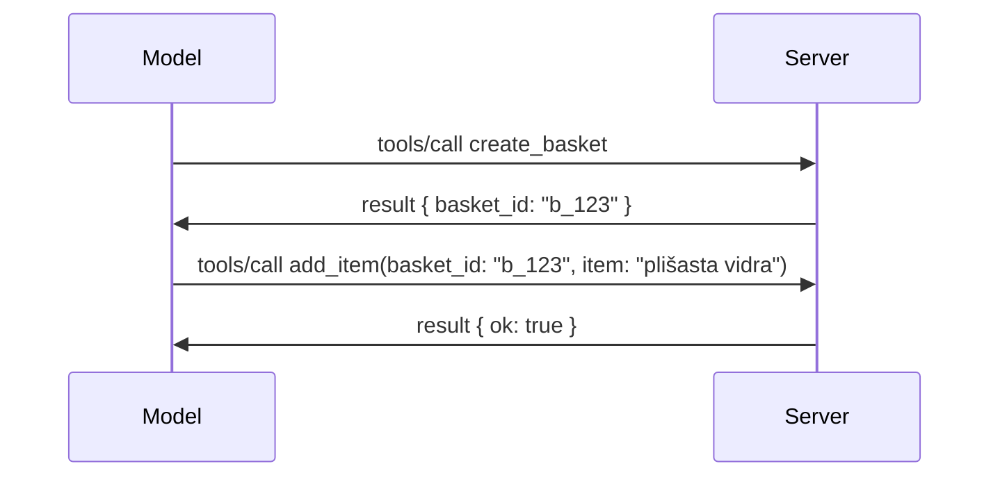

# Kaj se je spremenilo v MCP: specifikacija 2026-07-28

> **Status:** Končno. Specifikacija MCP `2026-07-28` je bila izdana 28. julija 2026
> in je trenutna revizija protokola. Ta lekcija opisuje končno
> specifikacijo. Nekateri primeri iz kurikuluma so še vedno izrecno verzionirani na
> `2025-11-25`, ker njihovi SDK-ji še niso sprejeli novega brezstanjskega API-ja;
> te primere obravnavajte kot smernice za združljivost z dediščino.

## Pregled

`2026-07-28` je največja revizija MCP od njegove uvedbe. Šest
Predlogov za izboljšanje specifikacije (SEPs) odstrani sej na ravni protokola in
naredi MCP brezstanskega na transportnem sloju, razširitve postanejo prvorazredni,
verzionirani mehanizem, in več funkcij, ki so bile obravnavane prej v tem kurikulumu
(Roots, Sampling, Logging), je sedaj zastarelih po novi politiki življenjskega cikla. Ta
lekcija povzema, kaj se je spremenilo, zakaj je pomembno in kaj to pomeni za kodo,
napisano proti `2025-11-25`.

Vir: [The 2026-07-28 MCP Specification Release Candidate](https://blog.modelcontextprotocol.io/posts/2026-07-28-release-candidate/) (Model Context Protocol Blog, David Soria Parra in Den Delimarsky).

## Cilji učenja

Do konca te lekcije boste lahko:

- Pojasnili, zakaj MCP prehaja na brezstanski jedro protokola in kateri problem rešuje za horizontalno skalirane distribucije.
- Opisali, kako se nadzor med `initialize`/`initialized` zamenja in kako nadomestimo glavo `Mcp-Session-Id`.
- Prepoznali nove glave `Mcp-Method` in `Mcp-Name` ter predpomnilniške metapodatke `ttlMs`/`cacheScope`.
- Spoznali ogrodje Extensions in dve razširitvi, ki ju vsebuje ta izdaja: MCP Apps in Tasks.
- Povzeli utrjevanje avtorizacije in ukinitev Dynamic Client Registration.

- Prepoznali, katere osnovne funkcije (Roots, Sampling, Logging) so zdaj zastarele in kaj to pomeni v praksi.
- Pojasnili spremembo Full JSON Schema 2020-12 za orodje `inputSchema`/`outputSchema`.

## Brezstanski protokol

Glavna sprememba: MCP postane brezstanski na ravni protokola.

### Pred (2025-11-25): seje vas vežejo na eno strežniško instanco

Klic orodja preko Streamable HTTP se začne s stiskom roke `initialize`. Strežnik odgovori z glavo `Mcp-Session-Id`, ki jo mora imeti vsak naslednji zahtev:

```http
POST /mcp HTTP/1.1
Mcp-Session-Id: 1868a90c-3a3f-4f5b
Content-Type: application/json

{"jsonrpc":"2.0","id":2,"method":"tools/call",
 "params":{"name":"search","arguments":{"q":"otters"}}}
```

Ker je seja vezana na strežniško instanco, ki jo je izdala, horizontalno skalirane distribucije potrebujejo **lepljivo usmerjanje** na uravnoteževalniku obremenitve in **deljeni shrambi seje** med instancami.

### Po (2026-07-28): vsak zahtevek je samostojen

```http
POST /mcp HTTP/1.1
MCP-Protocol-Version: 2026-07-28
Mcp-Method: tools/call
Mcp-Name: search
Content-Type: application/json

{"jsonrpc":"2.0","id":1,"method":"tools/call",
 "params":{"name":"search","arguments":{"q":"otters"},
           "_meta":{"io.modelcontextprotocol/protocolVersion":"2026-07-28",
                    "io.modelcontextprotocol/clientInfo":{"name":"my-app","version":"1.0"},
                    "io.modelcontextprotocol/clientCapabilities":{}}}}
```

Vsaka strežniška instanca lahko obdela to zahtevo. Ključne spremembe:

- **Odstranjen je stisk roke `initialize`/`initialized`** ([SEP-2575](https://github.com/modelcontextprotocol/modelcontextprotocol/pull/2575)). Verzija protokola, informacije o odjemalcu in zmogljivosti odjemalca so sedaj v `_meta` v vsakem zahtevku. Nova metoda `server/discover` omogoča odjemalcu, da vnaprej dobi zmogljivosti strežnika, ko jih potrebuje.
- **Odstranjena je glava `Mcp-Session-Id` in seja na ravni protokola** ([SEP-2567](https://github.com/modelcontextprotocol/modelcontextprotocol/pull/2567)). Lepljivo usmerjanje in deljene sejne shrambe niso več potrebne na ravni protokola.

### Brezstanski protokol, aplikacije z državo

Odstranitev seje na ravni protokola ne pomeni, da vaš strežnik ne more imeti stanje. Priporočeni vzorec je enak kot ga HTTP API-ji vedno uporabljajo: ustvarite eksplicitno ročico (npr. `basket_id`, `browser_id`) v enem klicu orodja in naj model to ročico vrne kot navaden argument pri kasnejših klicih.



To naredi stanje vidno in razumljivo za model, namesto da bi bilo skrito v transportnih metapodatkih, in omogoča katerikoli strežniški instanci obdelavo katerega koli klica.

### Zahtevki od strežnika do odjemalca, prestrukturirani

Brezstanski protokol še vedno potrebuje način, da lahko strežnik v poljubnem trenutku med klicem vpraša odjemalca (na primer poziv za pridobivanje informacij):

- **Zahtevki, ki jih sproži strežnik, so dovoljeni le med aktivno obdelavo zahtevka odjemalca** ([SEP-2260](https://github.com/modelcontextprotocol/modelcontextprotocol/pull/2260)) — prej priporočilo, zdaj obvezno. Uporabnik ni nikoli nepričakovano pozvan.
- **Večkratni zahtevki (Multi Round-Trip Requests)** ([SEP-2322](https://github.com/modelcontextprotocol/modelcontextprotocol/pull/2322)) nadomestijo obdržanje odprtega SSE toka. Namesto tega strežnik vrne `InputRequiredResult`:

  ```json
  {
    "resultType": "input_required",
    "inputRequests": {
      "confirm": {
        "type": "elicitation",
        "message": "Delete 3 files?",
        "schema": { "type": "boolean" }
      }
    },
    "requestState": "eyJzdGVwIjoxLCJmaWxlcyI6WyJhIiwiYiIsImMiXX0="
  }
  ```

  Odjemalec zbira odgovore in ponovno pošlje originalni klic z `inputResponses` ter ponovnim `requestState`. Katero koli strežniško instanco lahko sprejme ponovni poskus, saj je vse potrebno v nosilcu podatkov.

### Usmerljivo, predpomnjeno, sledljivo

Tri manjše spremembe olajšajo upravljanje brezstanskega prometa:

- **Glavi `Mcp-Method` in `Mcp-Name` sta obvezni na Streamable HTTP** ([SEP-2243](https://github.com/modelcontextprotocol/modelcontextprotocol/pull/2243)), da lahko uravnoteževalniki obremenitve, prehodi in omejevalniki hitrosti usmerjajo po operaciji brez pregledovanja JSON telesa. Strežniki zavrnejo zahtevke, kjer glave in telo niso usklajene.
- **Rezultati za `tools/list` in branje virov nosijo `ttlMs` in `cacheScope`** ([SEP-2549](https://github.com/modelcontextprotocol/modelcontextprotocol/pull/2549)), modelirano po HTTP `Cache-Control`. Odjemalci vedo, kako dolgo je rezultat seznama svež in ali ga je varno deliti med uporabniki, brez potrebe po dolgoročnem SSE toku za spremljanje sprememb.
- **Dokumentirana je propagacija W3C Trace Context v `_meta`** ([SEP-414](https://github.com/modelcontextprotocol/modelcontextprotocol/pull/414)), popravljena imena ključev `traceparent`, `tracestate` in `baggage`, da lahko porazdeljena sled sledi klicu preko odjemalskega SDK-ja, MCP strežnika in nižjih sistemov v [OpenTelemetry](https://opentelemetry.io/)-kompatibilnem zaledju.

## Razširitve postanejo prvorazredne

Razširitve so neuradno obstajale v `2025-11-25`. [SEP-2133](https://github.com/modelcontextprotocol/modelcontextprotocol/pull/2133) jih formalizira:

- Razširitve so identificirane z obrnjenimi DNS ID-ji.
- Pogajajo se preko zemljevida `extensions` na zmogljivostih odjemalca in strežnika.
- Bivajo v svojih lastnih repozitorijih `ext-*` z delegiranimi vzdrževalci ter se verzionirajo neodvisno od same specifikacije.
- Novi razširitveni potek v procesu SEP jim omogoča pot od eksperimentalnega do uradnega.

Ta izdaja prinaša dve uradni razširitvi.

### MCP Apps: strežniško upodobljeni uporabniški vmesniki

[MCP Apps](https://blog.modelcontextprotocol.io/posts/2026-01-26-mcp-apps/) ([SEP-1865](https://github.com/modelcontextprotocol/modelcontextprotocol/pull/1865)) omogoča strežnikom pošiljanje interaktivnih HTML vmesnikov, ki jih gostitelji upodabljajo v varovanem iframeu. Orodja napovedujejo svoje predloge UI vnaprej, da jih gostitelji lahko vnaprej pridobijo, predpomnijo in pregledajo zaradi varnosti, preden karkoli teče. Temeljne koncepte ste že obravnavali v [Lekciji 15: MCP Apps](../03-GettingStarted/15-mcp-apps/README.md) — v ogrodju Extensions je MCP Apps zdaj formalno razširitev in ne več eksperimentalna osnovna funkcija.

### Tasks postane razširitev

Tasks so bili izdani kot eksperimentalna osnovna funkcija v `2025-11-25`. Uporaba v produkciji je pokazala potrebo po prenovi, zato pravi dom zanje je razširitev: [Tasks razširitev](https://github.com/modelcontextprotocol/modelcontextprotocol/pull/2663) preoblikuje življenjski cikel glede na brezstanski model — strežnik lahko odgovori na `tools/call` z ročico naloge, odjemalec pa jo upravlja z `tasks/get`, `tasks/update` in `tasks/cancel`. Ustvarjanje naloge vodi strežnik: odjemalec oglašuje razširitev, strežnik pa se odloči, kdaj naj se klic izvede kot naloga. `tasks/list` je popolnoma odstranjen, ker ga ni mogoče varno omejiti brez sej.

> **Opomba o migraciji:** če ste implementirali eksperimentalni `2025-11-25` Tasks API, boste morali migrirati na nov življenjski cikel razširitve — ni združljiv nazaj.

## Utrjevanje avtorizacije

Več SEP-jev utrjuje
[specifikacijo avtorizacije](https://modelcontextprotocol.io/specification/2026-07-28/basic/authorization)
, da se bolj sklada z realnimi nameščanji OAuth 2.0 / OpenID Connect:

| SEP | Sprememba |
|---|---|
| [SEP-2468](https://github.com/modelcontextprotocol/modelcontextprotocol/pull/2468) | Odjemalci morajo preverjati parameter `iss` v odgovorih avtorizacije skladno z [RFC 9207](https://www.rfc-editor.org/rfc/rfc9207), kar zmanjša pogoste napade z zamenjavo v enemodelski vzorec MCP s številnimi strežniki. Pri bodoči verziji bo potrebno zavrniti odgovore brez `iss`. |
| [SEP-837](https://github.com/modelcontextprotocol/modelcontextprotocol/pull/837) | Odjemalci samo za združljivost Dynamic Client Registration deklarirajo svoj `application_type` OpenID Connect, da se izogne nepravilnim privzetim vrednostim `"web"` za namizne in CLI odjemalce. |
| [SEP-2352](https://github.com/modelcontextprotocol/modelcontextprotocol/pull/2352) | Registrirane poverilnice samo za združljivost so vezane na `issuer` strežnika, ki je izdal avtorizacijo; odjemalci se ponovno registrirajo, če se vir premakne. |
| [SEP-2207](https://github.com/modelcontextprotocol/modelcontextprotocol/pull/2207) | Dokumentira, kako zahtevati osvežitvene žetone od avtorizacijskih strežnikov v slogu OpenID Connect. |
| [SEP-2350](https://github.com/modelcontextprotocol/modelcontextprotocol/pull/2350) | Pojasnjuje akumulacijo obsega med napredovano avtorizacijo. |
| [SEP-2351](https://github.com/modelcontextprotocol/modelcontextprotocol/pull/2351) | Pojasnjuje dodatek `.well-known` za odkrivanje. |

Če gradite avtorizacijski strežnik za MCP, zagotovite `iss` v
odgovorih avtorizacije in sledite končni specifikaciji avtorizacije. Oglejte si
[02-Security](../02-Security/README.md) za navodila za implementacijo.

Dynamic Client Registration ostaja na voljo za združljivost, vendar je v `2026-07-28`
tudi zastarel. Novi implementacije naj uporabljajo Client ID Metadata
dokumente.

## Zastarale funkcije

Po novi
[politiki življenjskega cikla funkcij](https://github.com/modelcontextprotocol/modelcontextprotocol/pull/2577),
so Roots, Sampling, Logging in Dynamic Client Registration **zastareli**:

| Funkcija | Priporočena zamenjava |
|---|---|
| Roots | Parametri orodij, URI-ji virov ali konfiguracija strežnika |
| Sampling | Neposredna integracija s ponudniki LLM API-jev |
| Logging | `stderr` za stdio transport; OpenTelemetry za strukturirano opazovanje |
| Dynamic Client Registration | Client ID Metadata dokumenti |

Te funkcije ostajajo v `2026-07-28` za združljivost. Primerni so za
odstranitev pri prvi reviziji specifikacije izdani po 28. juliju 2027;
dejanska odstranitev se lahko zgodi pozneje. Nove implementacije naj uporabljajo
zgornje vzorce zamenjave.

## Poln JSON Schema 2020-12 za orodja

Orodja `inputSchema` in `outputSchema` so nadgrajena na polni [JSON Schema 2020-12](https://json-schema.org/draft/2020-12) ([SEP-2106](https://github.com/modelcontextprotocol/modelcontextprotocol/pull/2106)):

- Vhodne sheme ohranjajo korensko omejitev `type: "object"`, vendar zdaj dovoljujejo kompozicijo (`oneOf`, `anyOf`, `allOf`), pogoje in reference (`$ref`, `$defs`).
- Izhodne sheme niso omejene, in `structuredContent` je lahko katera koli JSON vrednost, ne le objekt.
- Implementacije ne smejo samodejno dereferencirati zunanjih `$ref` URI-jev in naj omejijo globino sheme ter čas validacije (za zaščito pred zavrnitvijo storitve, če validirate sheme na strežniški strani).

Posebej se koda napake za manjkajoči vir spremeni iz MCP-specifične `-32002` v standard JSON-RPC `-32602` (Neveljavni parametri) ([SEP-2164](https://github.com/modelcontextprotocol/modelcontextprotocol/pull/2164)). Če vaš odjemalec preverja točno vrednost `-32002`, ga bo treba posodobiti.

## Kako se protokol razvija od tu naprej

Ta izdaja vsebuje prelomne spremembe, ki jih vzdrževalci MCP ne nameravajo uveljavljati kot normo za prihodnost. Tri upravljavski SEP-ji so namenjeni preprečitvi ponovitve:

- **Politika življenjskega cikla funkcij** daje vsaki funkciji pot Aktivno → Zastarelo → Odstranjeno z najmanj dvanajstimi meseci med zastaranjem in najzgodnejšo možno odstranitevjo.
- **Ogrodje Extensions** omogoča, da nove zmogljivosti pridejo kot dodatki z možnostjo vključitve in tam stabilizirajo, preden (če sploh) preidejo v jedro specifikacije.
- SEP za standardizacijo ne more več doseči končnega statusa, dokler ustrezni scenarij ne pristane v [kompletu skladenj](https://github.com/modelcontextprotocol/conformance) ([SEP-2484](https://github.com/modelcontextprotocol/modelcontextprotocol/pull/2484)) — isti komplet, proti kateremu [SDK-tierski sistem](https://github.com/modelcontextprotocol/modelcontextprotocol/pull/1777) ocenjuje uradne SDK-je.

## Časovni okvir izdaje in potrjevanje

- Kandidat izdaje je bil zaklenjen 21. maja 2026.
- Končna specifikacija je bila izdana 28. julija 2026.

- Podpora SDK morda zaostaja za specifikacijo. Pred migracijo primera preverite
  [dokumentacijo SDK](https://modelcontextprotocol.io/docs/sdk) in SDK-jeve
  opombe ob izdajah.
- Spremljajte končne spremembe v
  [specifikaciji 2026-07-28](https://modelcontextprotocol.io/specification/2026-07-28/)
  in njenem
  [seznamu sprememb](https://modelcontextprotocol.io/specification/2026-07-28/changelog).

## Kaj To Pomeni Za Ta Kurikulum

Kurikulum prehaja z `2025-11-25` primerov na trenutno
`2026-07-28` specifikacijo. Konkretno:

- **Seje in "initialize" rokovanje** v primerih, ki eksplicitno ciljajo na
  `2025-11-25`, so zastarelo vedenje. Protokol `2026-07-28` jih nadomešča
  z zgornjim modelom brezstanja za zahteve.
- **Vzorec in korenine** ostajajo na voljo zaradi združljivosti, vendar so zastarele.
  Novi dizajni naj uporabljajo zgoraj navedene zamenjalne vzorce.
- **Eksperimentalna funkcija Opravila (Tasks)**, če ste jo uporabljali, bo treba migrirati na nov življenjski cikel razširitve Opravila.
- **MCP aplikacije** ([Lekcija 15](../03-GettingStarted/15-mcp-apps/README.md)) v praksi niso prizadete; preprosto se premaknejo pod formalni okvir Razširitev.

## Dodatni Viri

- [MCP specifikacija 2026-07-28](https://modelcontextprotocol.io/specification/2026-07-28/)
- [Seznam sprememb 2026-07-28](https://modelcontextprotocol.io/specification/2026-07-28/changelog)
- [Kandidat izdaje MCP specifikacije 2026-07-28 (zgodnji blog zapis)](https://blog.modelcontextprotocol.io/posts/2026-07-28-release-candidate/)
- [Prihodnost MCP prenosov](https://blog.modelcontextprotocol.io/posts/2025-12-19-mcp-transport-future/)
- [Smernice SEP](https://modelcontextprotocol.io/community/sep-guidelines)
- [MCP SDK sistem stopenj](https://modelcontextprotocol.io/docs/sdk)

## Naslednji Koraki

Vrnite se na [Osnovne Koncepte](./README.md) ali nadaljujte na
[Varnost](../02-Security/README.md) za uporabo trenutnih navodil `2026-07-28`.

---

<!-- CO-OP TRANSLATOR DISCLAIMER START -->
**Omejitev odgovornosti**:
Ta dokument je bil preveden z uporabo AI prevajalske storitve [Co-op Translator](https://github.com/Azure/co-op-translator). Čeprav si prizadevamo za natančnost, vas prosimo, da upoštevate, da avtomatizirani prevodi lahko vsebujejo napake ali netočnosti. Izvirni dokument v njegovem izvirnem jeziku je treba obravnavati kot avtoritativni vir. Za kritične informacije je priporočljiv strokovni človeški prevod. Ne odgovarjamo za morebitna nesporazume ali napačne interpretacije, ki izhajajo iz uporabe tega prevoda.
<!-- CO-OP TRANSLATOR DISCLAIMER END -->